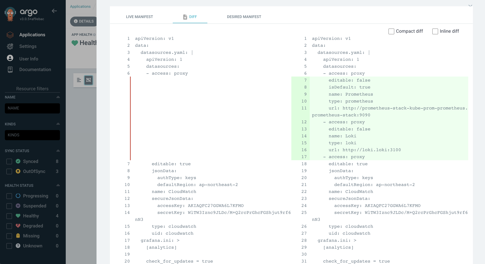
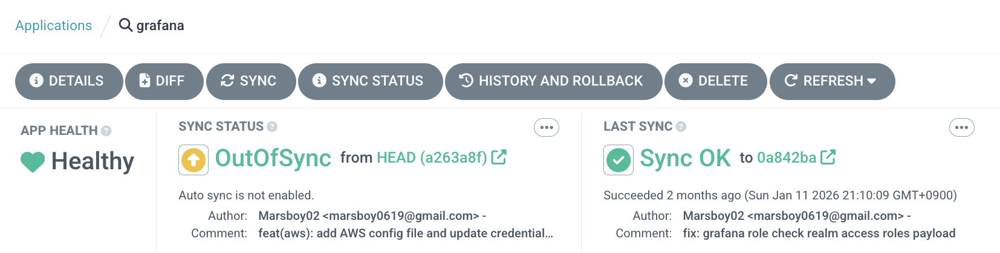

## Introduction

インフラ関連のセミナーには常に参加するようにしていますが、最も基本となるテーマはやはり**GitOps**ではないかと思います。実際にUOSLIFEチームでも、GitOpsを通じてAWS側のインフラとArgoCDが監視するリポジトリを定義するリポジトリでインフラを管理しています。

GitOpsといえば、単にKubernetesクラスタだけでなく、TerraformやPulumi、あるいはAWS CDKのようなツールを通じてAWSにも適用できます。こうなると、インフラを担う2つの大きな柱を両方ともGitOpsで実装できるわけです。多くの企業でも**クラスタを担当する部分**と**クラウドを担当する部分**を分けて管理しています。

個人的にも、GitOpsというキーワードは非常に人気のあるキーワードだと思います。DevOps分野でこれより新しいキーワードがあるとすれば、**プラットフォームエンジニアリング**くらいではないでしょうか。GitOpsをベースにさらに進んで、一部の企業ではTerraformやArgoCDのようなツールではなく、独自に類似ツールを開発・運用しながら、プラットフォームエンジニアリングを通じてより安全で便利なプラットフォームを構築しているようです。

## GitOpsとは何か

GitOpsの定義は非常にシンプルです。**Gitリポジトリをインフラとアプリケーションのシングルソースオブトゥルース（SSOT）として使用する運用モデル**です。開発者にとって馴染みのあるGitを通じてインフラを管理するということです。

GitリポジトリをSSOTとして捉えるということには、非常に多くの重要な意味が込められています。**CNCFのOpenGitOps**プロジェクトで定義された公式原則が4つあります。

## 4つのコア原則

1. **Declarative（宣言的）**: システムの望ましい状態（Desired State）を宣言的に記述します。Kubernetesマニフェスト、Kustomize overlay、Helm chartがこれに該当します。**どのように（How）ではなく、何を（What）定義する**ということです。
2. **Versioned and Immutable（バージョン管理と不変性）**: すべての状態がGitに保存されるため、自然とバージョン管理、監査追跡（audit trail）、そしてロールバックが可能になります。誰がいつなぜ変更したかをGit Historyで追跡できるため、セキュリティ監査への対応にも有利です。
3. **Pulled Automatically（自動Pull）**: 承認された変更がGitにマージされると、エージェントが自動的にこれを検知してクラスタに適用します。ArgoCDやFluxがこの役割を担います。
4. **Continuously Reconciled（継続的リコンシリエーション）**: エージェントが実際の状態（Live State）と望ましい状態（Desired State）を継続的に比較し、差異が発生した場合に自動的に修正します。誰かがkubectl editやAWS Consoleで直接変更しても、ArgoCDや自動化されたIaCが元の状態に戻します。

以上の4つのコア原則があります。GitOpsに関する多くのブログ記事がこれらの内容を引用していますが、理解を深めるために詳しく解説していきます。

### 宣言型パラダイム

GitOpsの最初の概念は**宣言型（Declarative）**であるということです。宣言的という概念を理解するには、反対の概念である**命令型（Imperative）**と比較してみるとわかりやすいです。

宣言型は、KubernetesクラスタやTerraformでS3のようなリソースを作成するのと同様に、どのリソースを宣言するかだけを記述し、どのように作成されるかには関心を持ちません。詳細な実装はTerraform ProviderやKubernetesクラスタの役割だからです。実際のスクリプトを見ると以下のようになります。

TerraformでS3バケットを作成する宣言型スクリプト：

```hcl
resource "aws_s3_bucket" "app_assets" {
  bucket = "my-app-assets"

  tags = {
    Team = "backend"
  }
}

resource "aws_s3_bucket_versioning" "app_assets" {
  bucket = aws_s3_bucket.app_assets.id
  versioning_configuration {
    status = "Enabled"
  }
}
```

Kubernetesでnginx Deploymentを宣言するマニフェスト：

```yaml
apiVersion: apps/v1
kind: Deployment
metadata:
  name: nginx
spec:
  replicas: 3
  selector:
    matchLabels:
      app: nginx
  template:
    metadata:
      labels:
        app: nginx
    spec:
      containers:
        - name: nginx
          image: nginx:1.27
          ports:
            - containerPort: 80
```

どちらの例も「nginxポッドを3つ起動せよ」「S3バケットを作成せよ」という**望ましい状態のみを記述**しているだけで、具体的な作成手順はTerraform ProviderとKubernetesコントローラーが処理します。

一方、同じ作業を命令型（CLI）で実行すると以下のようになります。

AWS CLIでS3バケットを作成する命令型スクリプト：

```bash
aws s3api create-bucket \
  --bucket my-app-assets \
  --region ap-northeast-2 \
  --create-bucket-configuration LocationConstraint=ap-northeast-2
aws s3api put-bucket-versioning \
  --bucket my-app-assets \
  --versioning-configuration Status=Enabled
aws s3api put-bucket-tagging \
  --bucket my-app-assets \
  --tagging 'TagSet=[{Key=Team,Value=backend}]'
```

kubectlでnginx Deploymentを作成する命令型スクリプト：

```bash
kubectl create deployment nginx --image=nginx:1.27 --replicas=3
kubectl expose deployment nginx --port=80 --target-port=80
```

一見すると命令型の方が簡潔に見えますが、実際の運用では致命的な欠点があります。

- **冪等性がない**: 同じスクリプトを2回実行すると「すでに存在します」というエラーが発生します。宣言型は現在の状態と望ましい状態を比較して差分のみを適用するため、何度実行しても同じ結果が保証されます。
- **状態の追跡が不可能**: スクリプトは実行した瞬間の行為のみを記録するだけで、現在のインフラがどのような状態かを知ることができません。誰かがコンソールで直接設定を変更すると、スクリプトと実際の状態が即座に乖離します。
- **変更履歴の管理が困難**: シェルスクリプトをGitに入れても「どのコマンドを実行したか」しかわからず、「現在のインフラがどのような状態であるべきか」を把握するのが困難です。
- **ロールバックが複雑**: 以前の状態に戻すには逆方向のスクリプトを別途作成する必要があります。宣言型では以前のコミットに`git revert`すれば、エージェントが自動的に以前の状態を復元します。

このように、リソースを宣言型で実装するか命令型で実装するかの違いは大きいです。そのため、多くのCNCFプロジェクトやセミナーでもGitOpsベースの宣言型インフラ管理を採用しています。

### バージョン管理と不変性

バージョン管理と不変性については、実はGitの概念をそのまま活用しています。どの部分がどのように変化したかを`git diff`で確認でき、誰がどのコミットメッセージで変更したかを把握できます。

ロールバックも、以前に作成したS3を順番を守って慎重に削除する必要はなく、単純に`git revert`で解決できます。

例えば、AWSで誰がどのリソースにアクセスして変更したかを追跡するにはCloudTrailを使用する必要があります。CloudTrailのイベントログは以下のようなJSON形式で記録されます。

```json
{
  "eventTime": "2026-03-15T09:23:17Z",
  "eventName": "PutBucketVersioning",
  "userIdentity": {
    "type": "IAMUser",
    "userName": "deploy-bot"
  },
  "requestParameters": {
    "bucketName": "my-app-assets",
    "VersioningConfiguration": {
      "Status": "Enabled"
    }
  }
}
```

「誰がいつAPIを呼び出したか」はわかりますが、**なぜ変更したか**はわかりません。変更前後の状態を比較するにはAWS Configのような別のサービスを追加で設定する必要があり、JSONログを一つ一つ調べなければならないため可読性も低くなります。

一方、GitOpsベースではGitがそのまま監査ログになります。コミット履歴を見るだけでインフラの変更履歴が一目で読み取れます。

```bash
$ git log --oneline
a1b2c3d feat: increase nginx replicas to 5 for traffic spike
e4f5g6h fix: rollback S3 bucket policy to restrict public access
i7j8k9l feat: add redis cluster for session caching
```

`git diff`で変更前後の状態を即座に比較でき、`git blame`で特定の行を誰がいつ変更したかを追跡できます。さらに、GitHub PR単位で「なぜ」変更したかのdescriptionやレビューコメントが残るため、CloudTrailでは得られない変更の文脈と意図まで記録されます。

### 自動Pull

GitOpsを通じてデプロイする場合、一般的にはPush方式ではなく**Pull方式**を使用します。AWSが提供するマネージドコンテナサービスであるECSにデプロイする場合を見ると、一般的には以下のようなGitHub Actionsワークフローを通じてデプロイします。

```yaml
name: Deploy to ECS

on:
  push:
    branches: [main]

jobs:
  deploy:
    runs-on: ubuntu-latest
    steps:
      - uses: actions/checkout@v4

      - name: Configure AWS credentials
        uses: aws-actions/configure-aws-credentials@v4
        with:
          aws-access-key-id: ${{ secrets.AWS_ACCESS_KEY_ID }}
          aws-secret-access-key: ${{ secrets.AWS_SECRET_ACCESS_KEY }}
          aws-region: ap-northeast-2

      - name: Login to Amazon ECR
        id: login-ecr
        uses: aws-actions/amazon-ecr-login@v2

      - name: Build and push Docker image
        env:
          ECR_REGISTRY: ${{ steps.login-ecr.outputs.registry }}
          IMAGE_TAG: ${{ github.sha }}
        run: |
          docker build -t $ECR_REGISTRY/my-app:$IMAGE_TAG .
          docker push $ECR_REGISTRY/my-app:$IMAGE_TAG

      - name: Deploy to ECS
        uses: aws-actions/amazon-ecs-deploy-task-definition@v2
        with:
          task-definition: task-definition.json
          service: my-app-service
          cluster: my-app-cluster
          wait-for-service-stability: true
```

この方式はPush方式と呼ばれます。CIパイプラインがビルドからデプロイまですべての過程を直接実行し、外部からターゲット環境に変更を**プッシュ（Push）**する構造です。つまり、GitHub ActionsがAWSの認証情報を持って直接ECSにアクセスしてデプロイを実行します。

ArgoCDの場合はPull方式を使用しており、Kubernetesクラスタ内で動作するArgoCDが特定のGitHubリポジトリを監視しながら、定期的にsyncを行ってソースを直接**取得（Pull）**します。CIパイプラインはイメージのビルドとマニフェストの更新までのみを担当し、実際のクラスタへのデプロイはArgoCDが処理します。

PushとPull方式の長所と短所を比較すると以下のようになります。

| | Push方式 | Pull方式 |
|---|---|---|
| **デプロイ主体** | CIパイプライン（外部） | クラスタ内部のエージェント |
| **認証情報** | CIにクラスタ/クラウドへのアクセス権限が必要 | エージェントはGitの読み取りのみ |
| **セキュリティ** | 外部に機密認証情報が漏洩するリスク | 認証情報がクラスタの外に出ない |
| **ドリフト検知** | 不可能（デプロイ時のみ動作） | 継続的に状態を比較し自動修正 |
| **実装難易度** | 低い（馴染みのあるCI/CDパイプライン） | 中程度（ArgoCD/Fluxの設定が必要） |

### 継続的リコンシリエーション

最後に**継続的リコンシリエーション**があります。これは上記で扱った内容の総合であり、GitOpsリポジトリを状態として使用するという点です。Gitが以前のバージョンとdiffで何が変わったかを確認するように、ArgoCDやTerraformのようなIaCは、現在の状態とGitOpsを通じて宣言的に明示された内容を適用した場合の状態を比較して変化の有無をチェックします。



ArgoCDでは**LIVE MANIFEST**と**DESIRED MANIFEST**という名前で変化の有無をチェックします。LIVEは現在のKubernetesクラスタの状態を意味し、DESIREDはGitOpsリポジトリの内容に基づくKubernetesクラスタの望ましい状態を意味します。

上の画像はPrometheusやLokiをdatasourceとして使用するように設定したもので、Syncを行っていないため望ましい状態から乖離し、どの部分が差分（diff）として残っているかを確認できます。



上記のように最後にSyncを行った時点が2ヶ月前であり、現在の状態は最後のコミットを基準に変更されているため、Syncを通じてGitOpsリポジトリの状態に合わせることができます。**Auto-Syncが適用されていない**ArgoCD Applicationであるため、上記のようにOutOfSync状態が表示されています。

Auto-Syncを設定している場合、一般的なCI/CDパイプラインモデルと同様に、特定のサービスをGitOpsリポジトリにPushすればパイプラインを経てデプロイされるまでの過程が似ています。ただし、内部的にはPush方式ではなく**Pull方式**を使用しており、実装難易度は高いですがセキュリティや認証情報の面で利点があります。

## 従来のCI/CDとGitOpsの違い

Push vs Pull方式の違いは上記で十分に説明したので、ここでは従来のCI/CDパイプラインとGitOpsが根本的に何が違うかに焦点を当てましょう。

### デプロイの主導権：パイプライン vs 宣言的状態

従来のCI/CDでは、パイプラインがデプロイの全過程を主導します。Jenkins、GitHub Actions、GitLab CIのようなツールが、コードのビルド、テスト、イメージのプッシュ、デプロイスクリプトの実行まで、1つのパイプライン内で順次処理します。デプロイとは「パイプラインの最後のステップを正常に実行すること」です。

```
[従来のCI/CD]
コードPush → CIビルド → テスト → イメージビルド → デプロイスクリプト実行 → 完了
                    （1つのパイプラインがすべてを担当）

[GitOps]
コードPush → CIビルド → テスト → イメージビルド → マニフェスト更新（ここまでCI）
                                                    ↓
                                        GitOpsエージェントが検知 → クラスタに適用（ここからCD）
```

GitOpsではCIとCDが明確に分離されます。CIパイプラインはイメージをビルドしてGitOpsリポジトリのマニフェストを更新するところまでのみを担当します。実際のクラスタへの反映であるCDは、ArgoCDやFluxのようなエージェントの役割です。

### 環境の状態を誰が把握しているか

これが**最も本質的な違い**です。従来のCI/CDでは、デプロイが成功したかどうかをパイプラインのexit codeのみで判断します。デプロイ後に誰かが`kubectl edit`で直接リソースを修正したり、AWS Consoleで設定を変更しても、パイプラインはこれを知ることができません。次のデプロイがトリガーされるまで、実際の環境がどのような状態かは誰も保証できません。

GitOpsでは、エージェントが継続的に実際の状態と望ましい状態を比較します。誰かが手動で変更しても、エージェントがこれを検知して元の状態に戻します。つまり、環境の状態が常にGitリポジトリと一致することを保証できます。

### 障害復旧とロールバック

従来のCI/CDでのロールバックとは「以前のバージョンのデプロイパイプラインを再実行すること」です。以前のビルドアーティファクトが残っている必要があり、デプロイスクリプトが冪等に書かれていなければならず、場合によってはデータベースマイグレーションのような副作用も考慮する必要があります。

GitOpsでのロールバックは**`git revert`の1行**です。Git履歴に望ましい状態がすべて記録されているため、以前のコミットに戻すとエージェントが自動的にクラスタを該当の状態に復元します。パイプラインを再実行する必要も、以前のアーティファクトを探す必要もありません。

### マルチ環境管理

従来のCI/CDでdev、staging、productionのようなマルチ環境を管理するには、パイプラインごとに環境別の変数と分岐ロジックを入れる必要があります。環境が増えるほどパイプラインは複雑になり、環境間の設定差異を把握するにはパイプラインコードを読む必要があります。

GitOpsでは環境別にディレクトリやブランチを分ければよいだけです。Kustomize overlayやHelm valuesファイルで環境間の差異を宣言的に管理でき、`diff`だけでdevとproductionの設定差異を一目で確認できます。

```
gitops-repo/
├── base/
│   ├── deployment.yaml
│   └── kustomization.yaml
├── overlays/
│   ├── dev/
│   │   └── kustomization.yaml      # replicas: 1, リソース最小
│   ├── staging/
│   │   └── kustomization.yaml      # replicas: 2, devと類似
│   └── production/
│       └── kustomization.yaml      # replicas: 5, リソース拡大、HPA設定
```

### 監査とコンプライアンス

従来のCI/CDで「誰がいつ何をデプロイしたか」を追跡するには、CIツールのビルドログ、デプロイログ、そしてCloudTrailのような監査ツールを組み合わせる必要があります。ツールごとにログ形式が異なり、保存期間もバラバラです。

GitOpsでは、Git自体が完全な監査ログです。すべての変更はコミットとして記録され、PRレビューを経て承認された変更のみがマージされるため、「誰が、いつ、なぜ、何を」変更したかが1つのツール内で完結します。SOC 2やISO 27001のようなコンプライアンス要件への対応にもGit履歴だけで十分です。

## GitOps実践適用パターン

GitOpsを実際に導入する際、最初に直面する質問は「リポジトリをどのように構成するか」です。この決定がその後のデプロイワークフロー、チーム間の協業、そしてセキュリティ境界まで左右するため、慎重に選択する必要があります。

### リポジトリ構造戦略：モノレポ vs マルチレポ

GitOpsリポジトリの構成は大きく2つの戦略に分かれます。

**モノレポ（Monorepo）** はアプリケーションコードとインフラマニフェストを1つのリポジトリで管理する方式です。

```
my-service/
├── src/                          # アプリケーションソースコード
│   ├── main.go
│   └── ...
├── Dockerfile
├── .github/workflows/ci.yaml    # CIパイプライン
└── k8s/                          # Kubernetesマニフェスト
    ├── base/
    │   ├── deployment.yaml
    │   ├── service.yaml
    │   └── kustomization.yaml
    └── overlays/
        ├── dev/
        └── prod/
```

モノレポの利点は開発者にとって直感的であることです。コードとデプロイ設定が同じリポジトリにあるため、1つのPRで機能追加とデプロイ設定変更を一緒にレビューできます。しかし、欠点も明確です。アプリケーションコードが変更されるたびにArgoCDがマニフェスト変更を検知しようと不必要に動作する可能性があり、インフラアクセス権限とアプリケーションコードアクセス権限を分離しにくくなります。

**マルチレポ（Polyrepo）** はアプリケーションコードとGitOpsマニフェストを別々のリポジトリに分離する方式です。

```
# リポジトリ1: my-service（アプリケーション）
my-service/
├── src/
├── Dockerfile
└── .github/workflows/ci.yaml    # ビルド後にGitOpsリポジトリのマニフェストを更新

# リポジトリ2: gitops-manifests（インフラ）
gitops-manifests/
├── my-service/
│   ├── base/
│   │   ├── deployment.yaml
│   │   ├── service.yaml
│   │   └── kustomization.yaml
│   └── overlays/
│       ├── dev/
│       ├── staging/
│       └── prod/
├── another-service/
│   ├── base/
│   └── overlays/
└── addons/
    ├── argocd/
    ├── monitoring/
    └── ingress-controller/
```

ほとんどのプロダクション環境ではマルチレポを採用しています。CIパイプラインはアプリケーションリポジトリでイメージをビルドし、完了したらGitOpsリポジトリのイメージタグのみを更新します。ArgoCDはGitOpsリポジトリのみを監視すればよいため、関心の分離がきれいにできます。また、インフラリポジトリへのアクセス権限をDevOpsチームのみに付与するといったセキュリティ境界の設定も可能です。

実際にUOSLIFEチームでもこのマルチレポ構造を使用しています。AWSインフラを管理するTerraformリポジトリとKubernetesクラスタのマニフェストを管理するGitOpsリポジトリを分離して運用しています。

### 環境別デプロイ管理

GitOpsでマルチ環境を管理する方法は大きく**ディレクトリベース**と**ブランチベース**の2つがあります。

**ディレクトリベース**は1つのブランチ（通常main）内で環境別にディレクトリを分ける方式です。ArgoCDの公式ドキュメントでもこの方式を推奨しています。

```yaml
# ArgoCD Application - dev環境
apiVersion: argoproj.io/v1alpha1
kind: Application
metadata:
  name: my-service-dev
spec:
  source:
    repoURL: https://github.com/org/gitops-manifests
    path: my-service/overlays/dev      # ディレクトリで環境を区分
    targetRevision: main
  destination:
    server: https://dev-cluster.example.com
    namespace: my-service
```

```yaml
# ArgoCD Application - prod環境
apiVersion: argoproj.io/v1alpha1
kind: Application
metadata:
  name: my-service-prod
spec:
  source:
    repoURL: https://github.com/org/gitops-manifests
    path: my-service/overlays/prod     # 同じブランチ、異なるディレクトリ
    targetRevision: main
  destination:
    server: https://prod-cluster.example.com
    namespace: my-service
```

ディレクトリベースの利点は、環境間の差異を`diff`で即座に比較できることです。`diff overlays/dev overlays/prod`の1行で2つの環境の設定差異を一目で把握できます。

**ブランチベース**は`main`、`staging`、`dev`などブランチ別に環境を分ける方式です。Gitブランチ戦略に慣れたチームには自然に感じられるかもしれませんが、環境間の差異を把握するにはブランチを行き来しながら比較する必要があり、ブランチのマージコンフリクトが発生する可能性があるため運用が複雑になります。こうした理由から、実務ではディレクトリベースがより多く使用されています。

### Kustomize vs Helm

GitOpsマニフェストを管理するツールとしてはKustomizeとHelmが代表的です。2つのツールはアプローチが根本的に異なります。

**Kustomize**は基本のYAMLをそのまま残し、環境別の差分のみをパッチで上書きする方式です。テンプレートなしで純粋なKubernetes YAMLを維持できることが核心です。

```yaml
# base/deployment.yaml - 純粋なKubernetes YAML
apiVersion: apps/v1
kind: Deployment
metadata:
  name: my-service
spec:
  replicas: 1
  template:
    spec:
      containers:
        - name: my-service
          image: my-service:latest
          resources:
            requests:
              cpu: 100m
              memory: 128Mi
```

```yaml
# overlays/prod/kustomization.yaml - プロダクションパッチ
apiVersion: kustomize.config.k8s.io/v1beta1
kind: Kustomization
resources:
  - ../../base
patches:
  - target:
      kind: Deployment
      name: my-service
    patch: |-
      - op: replace
        path: /spec/replicas
        value: 5
      - op: replace
        path: /spec/template/spec/containers/0/resources/requests/cpu
        value: 500m
      - op: replace
        path: /spec/template/spec/containers/0/resources/requests/memory
        value: 512Mi
```

**Helm**はGoテンプレートエンジンを使用してvaluesファイルの値を注入する方式です。複雑な条件分岐やループが必要な場合に有利です。

```yaml
# templates/deployment.yaml - Goテンプレート
apiVersion: apps/v1
kind: Deployment
metadata:
  name: {{ .Release.Name }}
spec:
  replicas: {{ .Values.replicas }}
  template:
    spec:
      containers:
        - name: {{ .Release.Name }}
          image: "{{ .Values.image.repository }}:{{ .Values.image.tag }}"
          resources:
            requests:
              cpu: {{ .Values.resources.requests.cpu }}
              memory: {{ .Values.resources.requests.memory }}
```

```yaml
# values-prod.yaml
replicas: 5
image:
  repository: my-service
  tag: v1.2.3
resources:
  requests:
    cpu: 500m
    memory: 512Mi
```

| | Kustomize | Helm |
|---|---|---|
| **方式** | パッチ（オーバーレイ） | テンプレート（値の注入） |
| **学習コスト** | 低い（純粋なYAML） | 中程度（Goテンプレート構文） |
| **柔軟性** | シンプルなオーバーライドに適している | 複雑な条件分岐・ループが可能 |
| **可読性** | ベースYAMLがそのまま有効 | テンプレートレンダリング前は読みにくい |
| **パッケージ配布** | 非対応 | Chartとしてパッケージ化・配布可能 |
| **コミュニティChart** | なし | 豊富な公式/コミュニティChart |

実務では2つのうち1つだけを使うのではなく、自社サービスのマニフェストはKustomizeで、サードパーティツール（Prometheus、Grafana、Ingress Controllerなど）はHelm Chartで管理する組み合わせが一般的です。ArgoCDもKustomizeとHelmの両方をネイティブでサポートしているため、1つのGitOpsリポジトリ内で2つの方式を混在させることができます。

## GitOps導入時の注意点

GitOpsは万能ではありません。導入過程で見落としやすい落とし穴があり、これを事前に認識できなければ、かえって運用の複雑さが増す可能性があります。

### Secret管理

GitOpsの最大の弱点は**Secret管理**です。GitリポジトリをSingle Source of Truthとして使用するということは、すべての状態をGitに保存するということですが、データベースのパスワードやAPIキーのような機密情報を**平文でGitにコミットすることは絶対にしてはなりません**。一度でもコミットされたシークレットはGit履歴に永遠に残るため、`git revert`でも完全に削除することはできません。

この問題を解決するためのツールがいくつか存在します。

**Sealed Secrets**はBitnamiが作成したツールで、クラスタにインストールされたコントローラーのみが復号できる暗号化されたシークレットをGitに保存する方式です。

```yaml
apiVersion: bitnami.com/v1alpha1
kind: SealedSecret
metadata:
  name: database-credentials
spec:
  encryptedData:
    password: AgBy3i4OJSWK+PiTySYZZA9rO...  # 暗号化された値
    username: AgCtr8OJSWK+UiWySYZZA7pQ...
```

**External Secrets Operator**は、AWS Secrets Manager、HashiCorp Vault、GCP Secret Managerのような外部シークレットストアから値を取得してKubernetes Secretを自動生成する方式です。Gitには「どこからシークレットを取得するか」の参照のみが保存されるため、機密値がリポジトリに露出しません。

```yaml
apiVersion: external-secrets.io/v1beta1
kind: ExternalSecret
metadata:
  name: database-credentials
spec:
  refreshInterval: 1h
  secretStoreRef:
    name: aws-secrets-manager
    kind: ClusterSecretStore
  target:
    name: database-credentials
  data:
    - secretKey: password
      remoteRef:
        key: prod/my-service/db-password    # AWS Secrets Managerのパス
    - secretKey: username
      remoteRef:
        key: prod/my-service/db-username
```

**SOPS（Secrets OPerationS）** はMozillaが作成したツールで、YAMLファイルの値（value）のみを選択的に暗号化し、キー（key）は平文のまま維持する方式です。ArgoCDではSOPSプラグインを通じてネイティブにサポートしています。

```yaml
apiVersion: v1
kind: Secret
metadata:
  name: database-credentials
data:
  password: ENC[AES256_GCM,data:cG1c...,type:str]   # 値のみ暗号化
  username: ENC[AES256_GCM,data:YWRt...,type:str]
sops:
  kms:
    - arn: arn:aws:kms:ap-northeast-2:123456789:key/abcd-1234
```

チームの規模やセキュリティ要件によって選択は異なりますが、クラウド環境ではExternal Secrets Operatorが最も広く使用されています。すでにAWS Secrets ManagerやVaultを使用しているなら、既存のシークレット管理体制をそのまま活用できるためです。

### ロールバック戦略

先ほどGitOpsでのロールバックは`git revert`だと説明しましたが、実際にはそう単純ではないケースが多いです。

最もよくある問題は**データベースマイグレーションとの競合**です。アプリケーションコードを以前のバージョンに戻しても、すでに実行されたDBマイグレーションは元に戻りません。新しいカラムを追加するマイグレーションが適用された後にロールバックすると、以前のバージョンのコードが新しいスキーマと互換性がない可能性があります。そのため、マイグレーションは常に下位互換性（backward compatible）を維持するように作成する必要があります。

もう1つの問題は**複数サービス間の依存関係**です。サービスAのマニフェストをロールバックしたが、サービスAが依存するサービスBのAPIがすでに変更されている場合、ロールバックがかえって障害を引き起こす可能性があります。このような状況を防ぐために、サービス間のAPIバージョン管理と下位互換性ポリシーを併せて運用する必要があります。

ArgoCDではロールバックを2つの方式で実行できます。

- **Gitベースのロールバック**: `git revert`でマニフェストを以前の状態に戻します。Git履歴にロールバック記録が残るため、監査追跡に有利です。この方式がGitOps原則に合致する正攻法です。
- **ArgoCD UIベースのロールバック**: ArgoCDダッシュボードから以前のデプロイ履歴を選択して即座にロールバックできます。緊急時に素早く対応できますが、Gitと実際の状態が一時的に不整合になります。障害対応後は必ずGitにも該当の変更を反映する必要があります。

### 大規模組織での運用

GitOpsを小規模チームで導入することと、数十のサービスを運用する大規模組織で導入することはまったく異なる話です。

**ApplicationSet**はArgoCDで大規模環境を管理するために提供されている機能です。サービスごとにArgoCD Applicationを1つ1つ手動で作成する代わりに、パターンを定義すると自動的にApplicationを生成してくれます。

```yaml
apiVersion: argoproj.io/v1alpha1
kind: ApplicationSet
metadata:
  name: all-services
spec:
  generators:
    - git:
        repoURL: https://github.com/org/gitops-manifests
        revision: main
        directories:
          - path: "*/overlays/prod"     # すべてのサービスのprod環境を自動検知
  template:
    metadata:
      name: "{{path[0]}}-prod"
    spec:
      source:
        repoURL: https://github.com/org/gitops-manifests
        path: "{{path}}"
        targetRevision: main
      destination:
        server: https://prod-cluster.example.com
        namespace: "{{path[0]}}"
```

上記の設定だけで、GitOpsリポジトリに新しいサービスディレクトリを追加すれば、ArgoCD Applicationが自動的に生成されます。サービスが10個でも100個でも、1つのApplicationSetで管理できます。

**PRベースのデプロイ承認**も大規模組織では重要です。GitOpsリポジトリのmainブランチに直接プッシュするのではなく、PRを通じて変更をレビューし承認した後にのみマージされるようにブランチ保護ルールを設定する必要があります。GitHubのCODEOWNERSファイルを活用すれば、特定の環境（例：production）のマニフェスト変更時に必ずDevOpsチームの承認を受けるよう強制できます。

```
# CODEOWNERS
/*/overlays/prod/    @org/devops-team    # prod環境の変更はDevOpsチームの承認必須
/*/overlays/dev/     @org/developers     # dev環境は開発チームが自律的に管理
/addons/             @org/platform-team  # クラスタアドオンはプラットフォームチーム担当
```

最後に**アラートとモニタリング**です。ArgoCDはSlack、Teamsなどと連携してsync状態の変更、デプロイの成功/失敗アラートを送信できます。サービスが増えるほど、どのサービスがOutOfSync状態か、どのデプロイが失敗したかを自動で通知する体制が不可欠です。ArgoCD Notificationsでこれを設定でき、PrometheusメトリクスをGrafanaダッシュボードで全体のデプロイ状況をモニタリングすることも可能です。

## Conclusion

この記事では、GitOpsのコア原則から実践的な適用パターン、そして導入時の注意点まで幅広く扱いました。

まとめると、GitOpsはGitリポジトリをインフラとアプリケーションのSingle Source of Truthとする運用モデルです。宣言的なインフラ定義、バージョン管理と不変性、Pullベースの自動デプロイ、そして継続的リコンシリエーションという4つのコア原則を通じて、従来のCI/CDでは解決が困難だった問題 — 環境状態の追跡、監査ログ、ドリフト検知、安全なロールバック — を構造的に解決します。

実践では、モノレポとマルチレポの中からチームの状況に合ったリポジトリ戦略を選択し、KustomizeとHelmを適切に組み合わせてマニフェストを管理し、Secret管理やロールバック戦略のような現実的な問題にも備える必要があります。

個人的に、GitOpsは単なるデプロイツールや方法論を超えて、**現代のDevOps文化の中心軸**になりつつあると考えています。インフラをコードで管理し、変更をレビューし、承認された変更のみを自動的に反映するこの流れは、結局**ソフトウェアエンジニアリングの原則をインフラ運用にも同様に適用しよう**というDevOpsの本質と通じています。実際にCNCFエコシステムの主要プロジェクトがGitOpsを前提に設計されており、多くの企業がGitOpsをベースにプラットフォームエンジニアリングまで拡張しています。

まだGitOpsを導入していない方は、小さなプロジェクトから始めてみることをお勧めします。Kustomizeでマニフェストを構成し、ArgoCDをインストールし、Gitにプッシュすればクラスタに反映される — その体験を一度すれば、手動デプロイには戻れなくなるでしょう。
