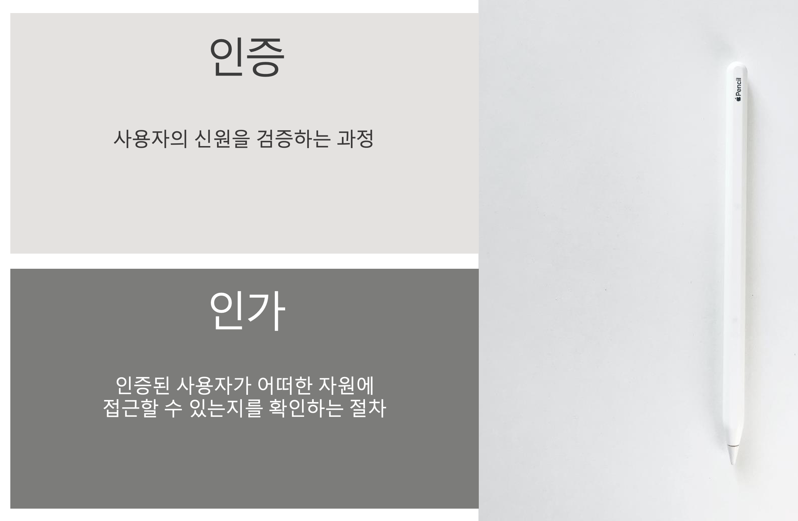

**인증과 인가**는 백엔드 개발자라면 반드시 이해해야 하는 핵심 개념이다. 개념 자체는 단순하지만, 실제로 HTTP의 무상태(stateless) 특성 위에서 이를 구현하려면 상당한 고민이 필요하다. 쿠키, 세션, 토큰, OAuth, OIDC, 그리고 Keycloak 같은 IAM 솔루션까지 -- 인증 시스템은 넓은 스펙트럼을 가지고 있다.

이 글에서는 인증과 인가의 기초 개념에서 출발하여, 세션과 토큰 기반 인증의 차이, JWT와 RFC 표준, Spring Security 구현, 그리고 Keycloak을 활용한 SSO 구축까지 전체 흐름을 정리한다.

---

## 1. 인증 vs 인가

### 인증(Authentication)

인증은 **사용자의 신원을 검증하는 과정**이다. 웹사이트에 로그인할 때 아이디와 비밀번호를 입력하고, 이 정보가 일치하면 서버가 해당 사용자를 인증하는 것이다.

### 인가(Authorization)

인가는 인증된 사용자가 **어떤 자원에 접근할 수 있는지를 확인**하는 절차이다. 인가 과정에서는 사용자 자체가 아닌, 토큰이나 세션을 통해 **접근 권한**만을 확인한다.

### 술집 비유로 이해하기

젊어 보이는 한 사람이 술집에 갔다고 하자. 술을 사기 위해서는 성인이라는 것을 **인증**해야 한다. 신분증을 **직원1**에게 보여주면, 직원1은 이 사람을 기억하여 술을 시킬 때 주문을 받고 제공한다. 이때 술을 제공하는 것이 바로 **인가**에 해당한다.

일반적인 상황에서도 **인증이 먼저** 이루어지고, **인가가 나중에** 이루어진다. 서버 관점에서 이 차이를 HTTP 상태 코드를 통해 명확하게 이해할 수 있다.

### HTTP 401 vs 403

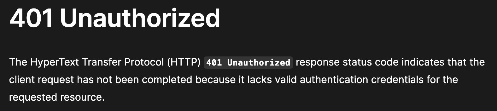

**401 Unauthorized** -- valid authentication credentials이 부족하면 발생한다. 즉, **인증에 실패**한 것이다. 요청 자체가 서버에 제대로 전달되지 않는다.

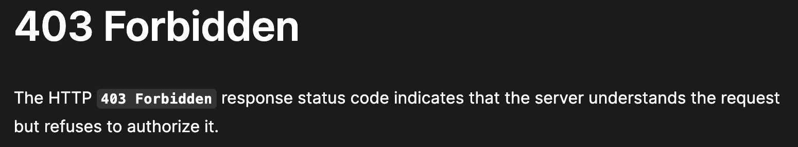

**403 Forbidden** -- 서버가 요청을 이해했지만 인가를 거절한 것이다. 즉, **인가에 실패**한 것이다.

정리하면 다음과 같다.

- **401 (인증 실패)**: `client request has not been completed` -- 서버에 요청이 전달되지 않음
- **403 (인가 실패)**: `the server understands the request but refuses to authorize it` -- 서버에 도달했지만 접근 권한 없음

Spring Security로 구현할 때를 예로 들면, 인증 실패는 Servlet 계층의 필터에서 요청이 차단되어 401이 반환된다. 403은 특정 사용자가 다른 사용자의 리소스에 접근하려 할 때 서버에서 발생시킨다.

---

## 2. 세션 vs 토큰

인증과 인가 구현이 복잡한 근본적인 이유는 **HTTP가 기본적으로 stateless protocol**이라는 점이다.

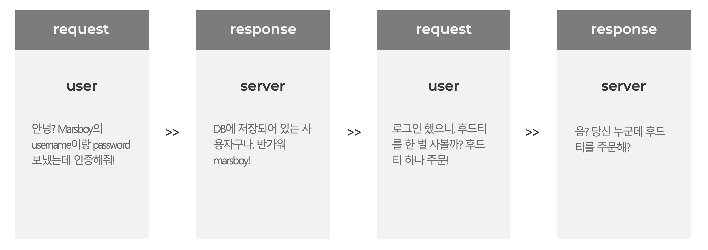

위 다이어그램처럼, 사용자가 로그인에 성공해서 인증되었더라도 다음 요청에서 서버는 해당 사용자를 기억하지 못한다. HTTP 요청은 기본적으로 stateless하기 때문에 서버가 어떤 클라이언트인지 기억할 수 없다.

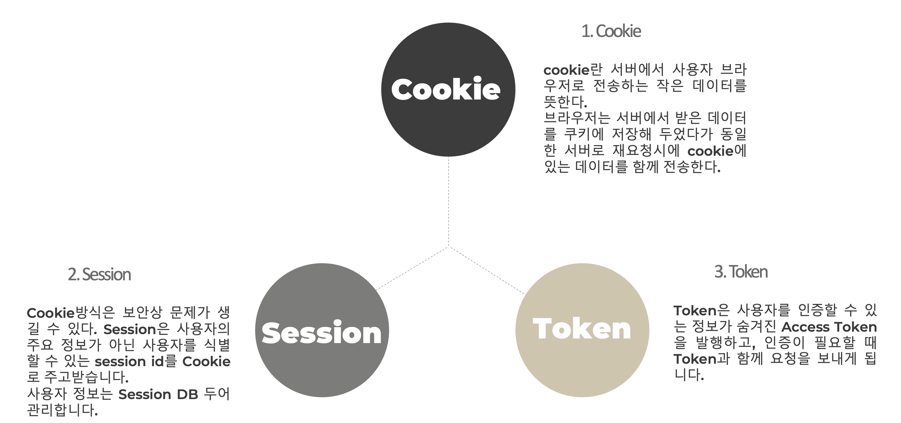

> A stateless protocol is a communication protocol in which the receiver must not retain session state from previous requests. -- Wikipedia

이 문제를 해결하기 위해 서버에서 인증/인가 과정을 특수하게 구현하여 **서버가 클라이언트를 구분할 수 있게 만드는 방법**이 필요하다. 대표적으로 Session 방식과 Token 방식이 있다.

<!-- TODO: 다이어그램 필요 -- Session vs Token 인증 플로우 비교 다이어그램 -->

### 쿠키 방식의 한계

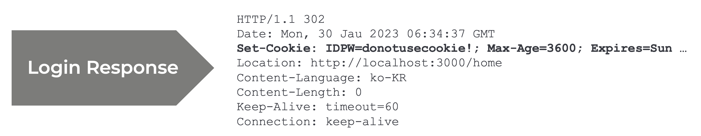
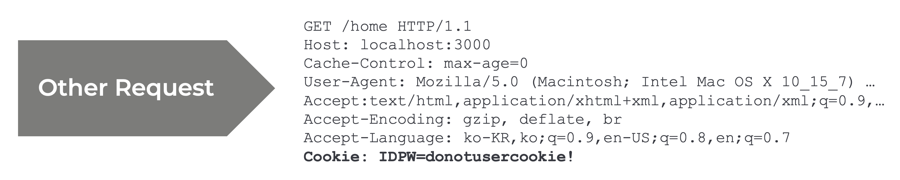

쿠키는 **웹 브라우저의 작은 저장 공간**이다. username과 password를 쿠키에 저장하여 매 HTTP 요청마다 함께 보낼 수 있지만, 쿠키는 손쉽게 탈취할 수 있기 때문에 민감한 정보를 저장하는 것은 매우 위험하다. 이 방식은 일반적으로 사용되지 않는다.

### 세션 기반 인증

쿠키에 민감한 정보를 담을 수 없으므로, 쿠키에는 탈취되더라도 알아볼 수 없는 **Session ID**를 저장하고, 서버 측에 세션 스토어를 두어 Session ID를 key로 민감 정보를 value로 저장한다.

클라이언트가 Session ID와 함께 HTTP 요청을 보내면, 서버는 세션 스토어에서 정보를 조회하여 사용자를 확인하고 인가한다. 세션 스토어로는 Redis 같은 인메모리 데이터 스토어가 주로 사용된다. 데이터베이스 대비 속도가 빠르고, TTL(Time To Live) 기능을 지원하며, 세션 정보는 정합성이 크게 중요하지 않아 캐싱에 적합하기 때문이다.

**장점:**
- Stateful하게 서버에서 클라이언트 정보를 관리하므로, 강제 로그아웃이나 계정 공유자 수 확인(넷플릭스) 같은 유저 관리가 가능하다.

**단점:**
- 세션을 저장할 별도의 DB(Redis 등)를 구비해야 한다.
- 세션 DB의 위치(서버 내부/외부)에 따라 아키텍처 복잡도가 달라진다.

### 토큰 기반 인증

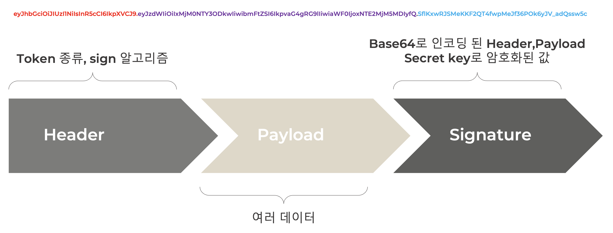

토큰 방식은 기본적으로 **stateless**하다. 서버가 클라이언트의 정보를 들고 있지 않기 때문에, 사용자가 1000배로 증가해도 서버 리소스에 큰 변화가 없다. 서버는 클라이언트가 보낸 토큰의 유효성만 검증하면 된다.

인증/인가에 가장 대표적으로 사용되는 토큰인 **JWT(JSON Web Token)**는 `.`(점)을 기준으로 **Header, Payload, Signature** 세 부분으로 구성된다.

- **Header**: 토큰 종류, 서명 알고리즘 정의
- **Payload**: 사용자 식별에 필요한 최소한의 정보 (민감 데이터 불포함)
- **Signature**: Base64로 인코딩된 Header + Payload + Secret Key를 암호화한 값

서버는 시크릿 키를 통해 Signature를 대조하여 JWT의 유효성을 검증하고, Payload에 담긴 정보를 통해 사용자를 인가한다.

**장점:**
- Stateless하여 서버 리소스가 적게 소모된다.

**단점:**
- 토큰을 클라이언트에서 관리하므로 탈취 위험이 있다.
- Stateful하지 않아 강제 로그아웃 등 유저 관리가 어렵다.

---

## 3. JWT와 RFC 표준

### JWT의 원리

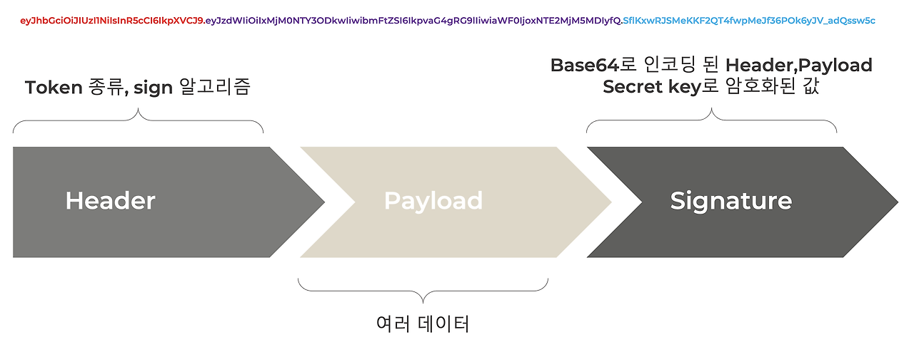

JWT의 Signature는 다음과 같이 생성된다.

```shell
HMACSHA256(
  base64UrlEncode(header) + "." +
  base64UrlEncode(payload),
  secret)
```

SHA256 알고리즘은 **단방향 암호화(해싱)** 알고리즘이다. 암호화된 것을 복호화할 수 없다. 그렇다면 서버는 어떻게 토큰의 유효성을 검증할까?

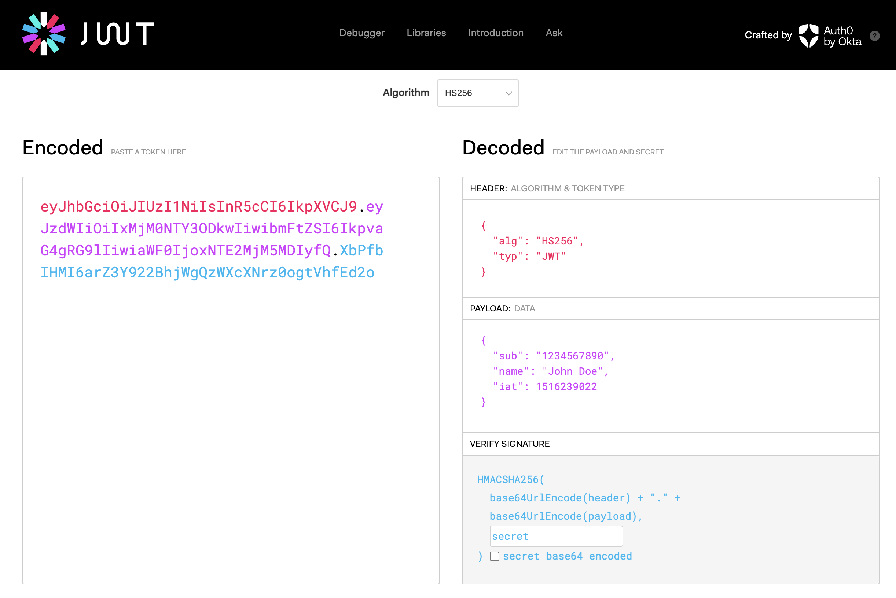

Header와 Payload는 Base64 **인코딩**(encrypt가 아닌 encoding)이므로 간단하게 디코딩할 수 있다.

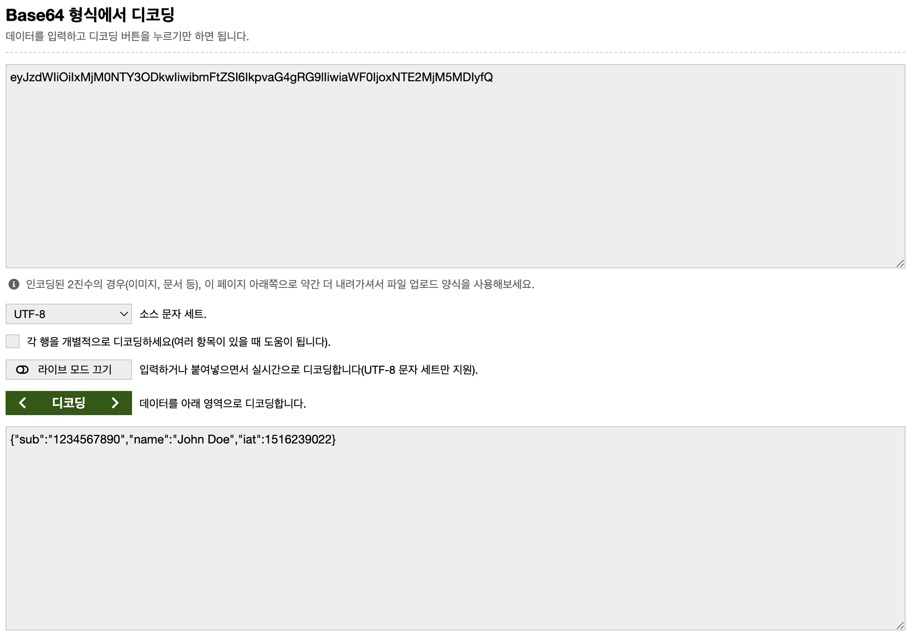

Payload가 쉽게 디코딩되기 때문에 **민감한 정보를 담으면 안 된다**는 것을 알 수 있다. 검증 방식은 Payload를 Secret Key로 SHA256 암호화하여, Signature와 비교하는 것이다.

### RFC 6749: OAuth 2.0 표준

**RFC(Request For Comments)**는 프로토콜이나 기술의 표준 규격을 서술한 문서이다. OAuth 2.0에 대해 다룬 **RFC 6749**에서 Refresh Token에 대한 설명을 보면 다음과 같다.

> Refresh tokens are credentials used to obtain access tokens. Refresh tokens are issued to the client by the authorization server and are used to obtain a new access token when the current access token becomes invalid or expires, or to obtain additional access tokens with identical or narrower scope. -- RFC 6749 [Page 9]

> Unlike access tokens, refresh tokens are intended for use only with authorization servers and are never sent to resource servers. -- RFC 6749 [Page 10]

핵심 내용을 정리하면:
- **Refresh Token**은 Access Token을 재발급하기 위해 사용하는 토큰이다.
- Access Token은 일반적으로 짧은 lifetime을 가진다.
- Refresh Token 구현은 선택 사항이다.
- Refresh Token은 인증 서버에서만 사용되며, 리소스 서버로 전송되지 않는다.

### Access Token / Refresh Token 플로우


<!-- TODO: 다이어그램 필요 -- OAuth 2.0 Access Token / Refresh Token 플로우 다이어그램 -->

RFC 6749 표준에 따른 Access Token + Refresh Token 플로우는 다음과 같다.

1. 최초 인증 시, Access Token과 Refresh Token을 함께 발급하여 클라이언트에게 전달
2. 클라이언트는 Access Token을 사용하여 Resource Server에 리소스 요청
3. Access Token이 만료되어 인가 실패 시, Refresh Token으로 인증 서버에서 Access Token을 재발급
4. 선택적으로 Refresh Token도 함께 재발급 가능

### 토큰 저장 전략

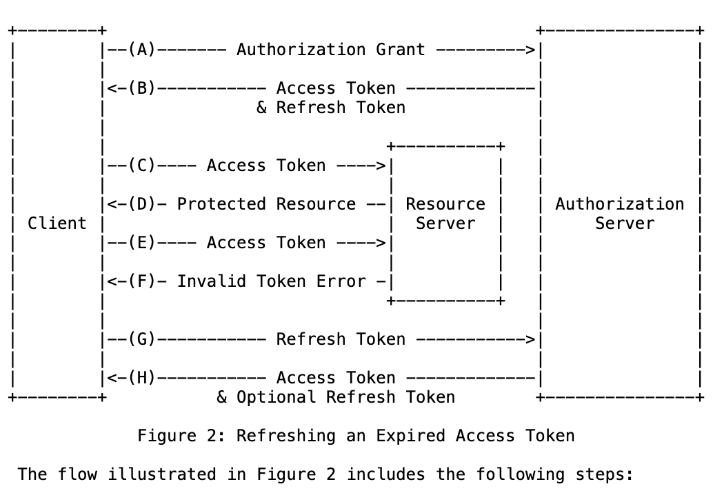

프론트엔드에서의 토큰 저장 전략은 보안과 직결된다.

- **Access Token**: 자바스크립트 로컬 변수에 저장하여, HTTP 요청마다 `Authorization: Bearer` 헤더로 전송
- **Refresh Token**: 쿠키에 저장하되, **HTTP Only + Secure** 옵션으로 저장

이렇게 분리하는 이유는 **CSRF(Cross-Site Request Forgery)** 및 **XSS(Cross-Site Scripting)** 공격을 방어하기 위해서이다.

---

## 4. Spring Security 구현

인증/인가를 Spring Security로 구현할 때, Access Token과 Refresh Token 기반 로직의 핵심은 **필터 체인**과 **인증 프로바이더** 구성이다.

프론트엔드에서는 Axios interceptor를 활용하여 401 응답에 대한 자동 토큰 갱신 로직을 구현할 수 있다. 아래는 구현 예시이다.

```javascript
// apiClient.js
import axios from 'axios';

const getAccessTokenFromLocalStorage = () => {
  return localStorage.getItem('accessToken');
};

const saveAccessTokenToLocalStorage = (token) => {
  localStorage.setItem('accessToken', token);
};

const redirectToLoginPage = () => {
  window.location.href = '/login';
};

const apiClient = axios.create({
  baseURL: 'https://your-api.com',
});

// 요청 인터셉터: Access Token을 Authorization 헤더에 추가
apiClient.interceptors.request.use(
  (config) => {
    const accessToken = getAccessTokenFromLocalStorage();
    if (accessToken) {
      config.headers.Authorization = `Bearer ${accessToken}`;
    }
    return config;
  },
  (error) => Promise.reject(error)
);

// 응답 인터셉터: 401 에러 발생 시 토큰 갱신 처리
apiClient.interceptors.response.use(
  (response) => response,
  async (error) => {
    const originalRequest = error.config;

    if (error.response && error.response.status === 401 && !originalRequest._retry) {
      originalRequest._retry = true;
      try {
        await refreshAccessToken();
        originalRequest.headers.Authorization = `Bearer ${getAccessTokenFromLocalStorage()}`;
        return apiClient(originalRequest);
      } catch (refreshError) {
        redirectToLoginPage();
        return Promise.reject(refreshError);
      }
    }
    return Promise.reject(error);
  }
);

// Access Token 갱신 함수
const refreshAccessToken = async () => {
  try {
    // Refresh Token은 httpOnly 쿠키에 저장되어 있으므로 자동 전송
    const response = await axios.post('https://your-api.com/auth/refresh-token', null, {
      withCredentials: true,
    });
    const newAccessToken = response.data.accessToken;
    saveAccessTokenToLocalStorage(newAccessToken);
    apiClient.defaults.headers.common['Authorization'] = `Bearer ${newAccessToken}`;
  } catch (error) {
    localStorage.removeItem('accessToken');
    throw error;
  }
};

export default apiClient;
```

위 코드의 핵심은 다음과 같다.

1. 모든 요청에 Access Token을 `Bearer` 헤더로 포함시킨다.
2. 401 응답을 받으면 Refresh Token(httpOnly 쿠키로 자동 전송)을 사용하여 Access Token을 재발급받는다.
3. 재발급에 실패하면 로그인 페이지로 리다이렉션한다.

### 실무 사례: Netflix와 우아한형제들

**Netflix**는 **EAS(Edge Application Service)**라는 인증 전용 서비스에서 모든 토큰 처리를 집중시킨다. 유효한 토큰(95%)은 바로 통과시키고, 나머지 5%에 대해서만 갱신이나 키 교체를 수행한다.

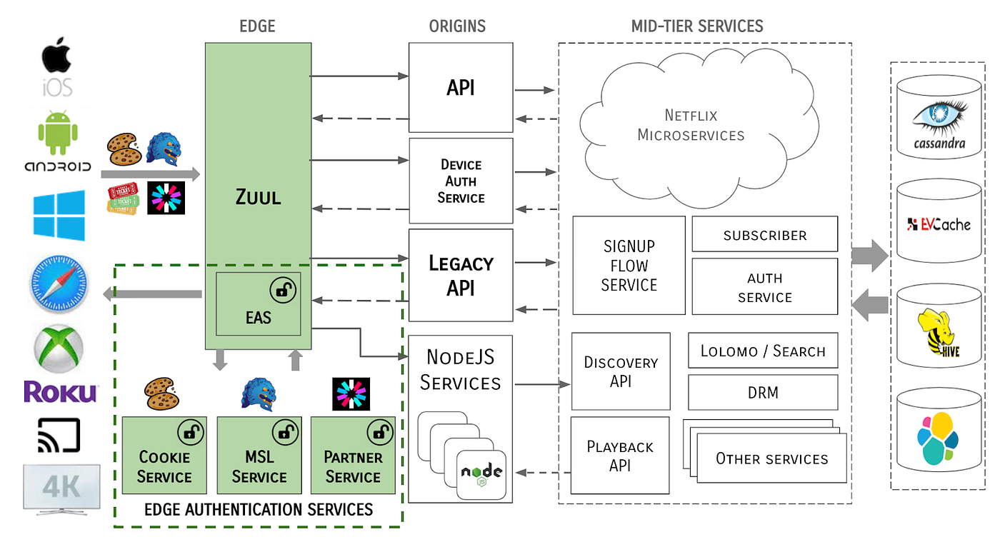
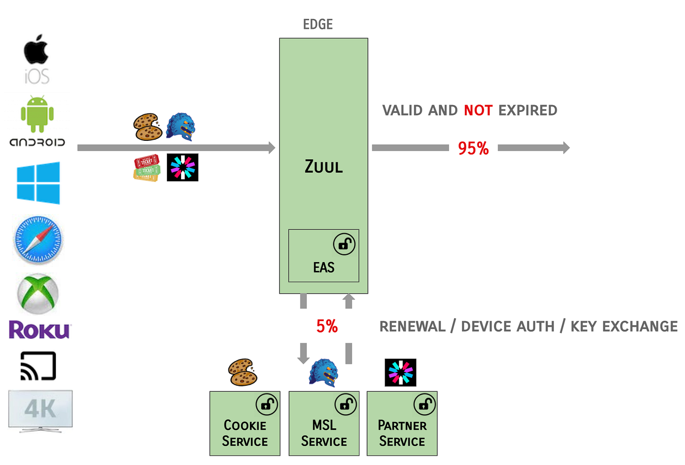

**우아한형제들** 역시 Refresh Token 기반의 인증/인가를 사용하고 있으며, 토큰 발급/재발급 과정의 쿼리 최적화에 AOP를 활용하는 등 실전적인 접근을 하고 있다. 이처럼 Access Token + Refresh Token 패턴은 사실상 업계 표준이다.

---

## 5. Keycloak SSO

### OAuth 2.0은 인가 표준이다

여기서 중요한 구분이 필요하다. **OAuth 2.0은 인증 표준이 아니라**, 제3자 애플리케이션이 리소스에 제한된 접근 권한을 얻도록 하는 **권한 위임(Authorization Delegation) 프레임워크**이다.

> OAuth 2.0 is the industry-standard protocol for authorization. OAuth 2.0 focuses on client developer simplicity while providing specific authorization flows for web applications. -- oauth.net/2/

OAuth가 주는 것은 "너 누구냐"가 아니라 **"이 토큰을 가진 주체가 무엇을 할 수 있냐"**에 초점이 있다. 업계에서 "OAuth 로그인"이라는 표현을 흔하게 사용하지만, 엄밀히 말하면 로그인(인증)을 표준화한 것은 OAuth가 아니다.

### OIDC(OpenID Connect): 인증 레이어

**OIDC는 OAuth 2.0 위에 인증(Identity) 개념을 표준화한 것**이다.

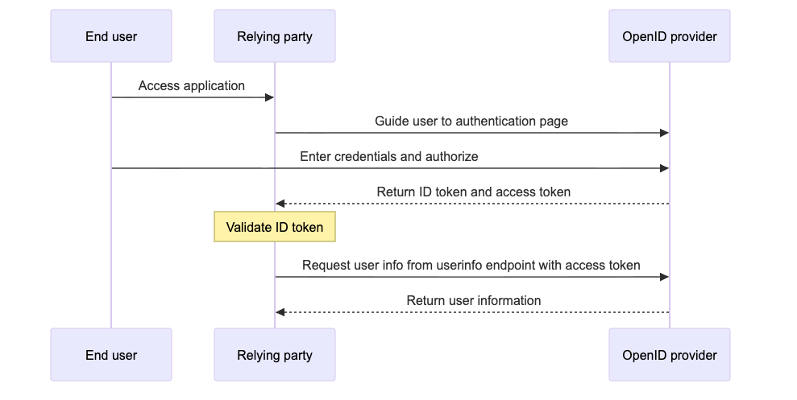

<!-- TODO: 다이어그램 필요 -- Keycloak 기반 OIDC SSO 플로우 다이어그램 -->

OIDC는 세 가지 역할을 도입했다.

- **End User**: 최종 사용자 (OAuth 2.0의 리소스 소유자)
- **Relying Party (RP)**: 클라이언트 애플리케이션 (OAuth 2.0의 클라이언트)
- **OpenID Provider (OP)**: Identity 인증 서비스 공급자 (OAuth 2.0의 Authorization/Resource Server)

우리가 생각하는 일반적인 "다른 플랫폼을 통한 로그인"은 **OIDC + OAuth 2.0**이 결합된 것이다.

### 기타 인증/인가 키워드 정리

| 키워드 | 정체 | 주 목적 | Output | 한 줄 |
|--------|------|---------|--------|-------|
| OAuth 2.0 | 인가 프레임워크 | API 접근 권한 위임 | Access Token (주로 JWT) | 내 대신 API 쓰게 해줘 |
| OIDC | 인증 표준 | 로그인 + 표준 사용자 정보 | ID Token(JWT) + userinfo | 로그인 결과를 표준으로 |
| SAML 2.0 | 인증/SSO 표준 | 엔터프라이즈 SSO | SAML Assertion(XML) | XML로 SSO |
| SSO | 사용자 경험/구성 | 한 번 로그인으로 여러 서비스 | (OIDC/SAML 등으로 구현) | 한 번 로그인하면 끝 |

**SSO(Single Sign-On)**는 프로토콜이 아니라, 한 번 로그인으로 여러 서비스에 재로그인 없이 접근하는 **사용자 경험/구성**을 의미한다. 카카오톡 기반의 다양한 카카오 서비스, 네이버 ID로 네이버 쇼핑/메일/카페를 사용하는 것이 대표적인 예이다.

**SAML(Security Assertion Markup Language)**은 XML 기반의 SSO 표준으로, IDP(Identity Provider)와 SP(Service Provider) 간에 사용자 인증 정보를 교환한다. `saml2aws` 같은 도구를 통해 Google 계정으로 AWS에 접근하는 것이 대표적인 활용 사례이다.

```bash
$ sudo saml2aws login
Using IdP Account default to access GoogleApps https://accounts.google.com/o/saml2/initsso?idpid=...
? Username marsboy@text.com
? Password
Authenticating as marsboy@text.com ...
Check your phone and tap 'Yes' on the prompt. Then press ENTER to continue.
```

### Keycloak 아키텍처

Keycloak은 **오픈소스 IAM(Identity and Access Management) 솔루션**으로, "중앙 인증 허브" 역할을 한다. 핵심 기능은 다음과 같다.

- 애플리케이션/서비스를 중앙에서 관리
- 사용자/세션/권한 관리
- **Identity Brokering**: Google/GitHub 같은 외부 IdP 연동
- **User Federation**: LDAP/AD 같은 기존 사용자 디렉토리 활용
- **Role/Group 기반 권한 모델**: 토큰 Claim에 roles/groups를 실어 서비스 권한과 매핑
- MFA, 세션 관리, 패스워드 정책 같은 보안 기능

Keycloak을 도입하면, Grafana, ArgoCD, 사내 어드민 등 각 서비스가 제각각 계정/비밀번호/정책을 들고 있지 않아도 되고, 인증과 정책을 한 곳으로 모을 수 있다. 퇴사자가 발생했을 때도 Keycloak 계정 하나만 비활성화하면 모든 서비스에 대한 접근이 차단된다.

### 시대생팀 프로젝트 실전 적용

> **시대생팀**은 대학생 커뮤니티 플랫폼 프로젝트를 운영하는 팀으로, 쿠버네티스 기반 인프라에서 Keycloak을 중앙 인증 시스템으로 활용하고 있다.

시대생팀에서는 쿠버네티스 클러스터 이전 과정에서 Keycloak 세팅을 새롭게 진행했다. Grafana, Kiali 등 매니지먼트 툴을 온프레미스에 재배포하면서, Keycloak은 SPOF(Single Point of Failure)를 대비하기 위해 온프레미스에서 클라우드로 이전했다.

#### Keycloak에서 OIDC Client 등록

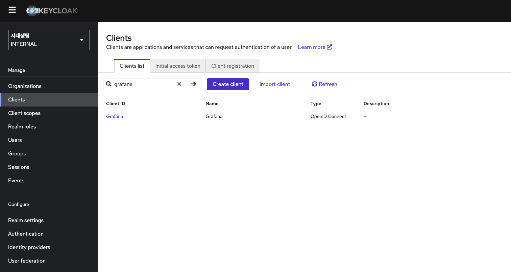

Keycloak의 Realm에서 Client를 등록한다. 이것이 OIDC 용어로 **Relying Party(RP)**에 해당한다. Client ID를 생성하고 Type을 OpenID Connect로 지정한다.

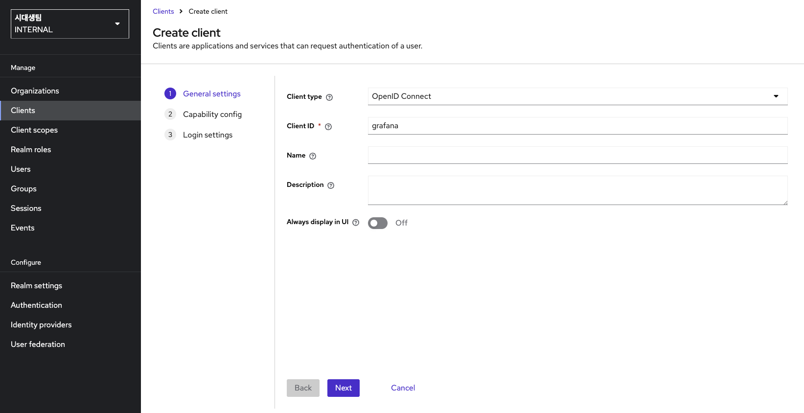

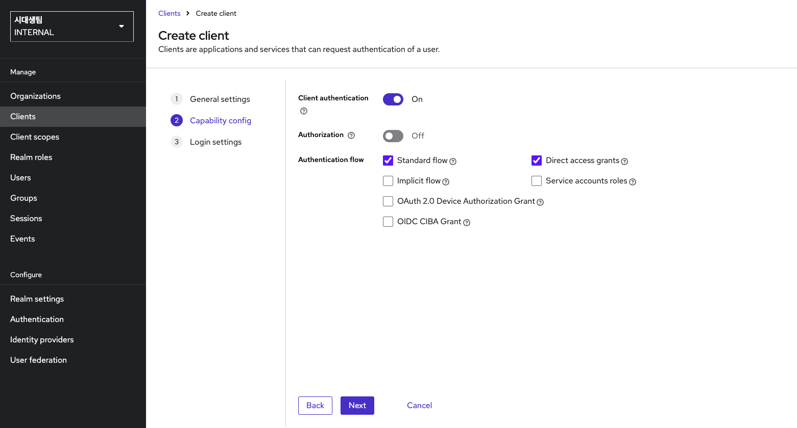

Client Authentication을 On으로 설정하고 클라이언트를 생성하면 RP가 등록된다.

#### Client Secret 확인 및 Role 매핑

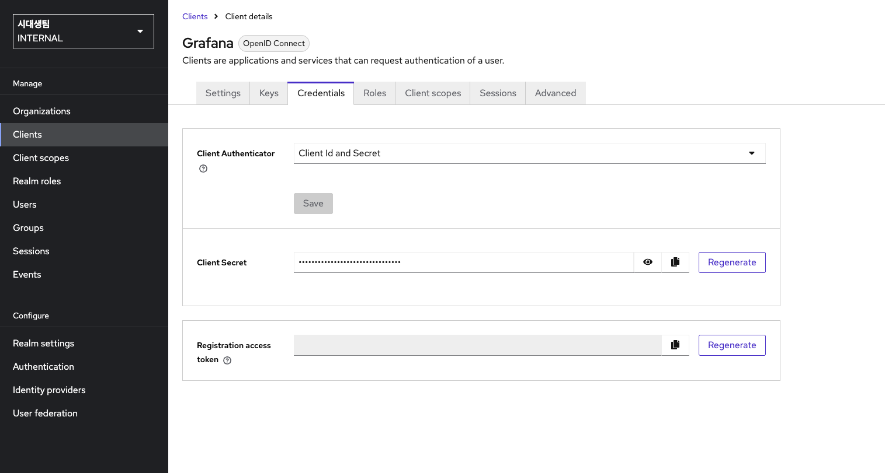

생성된 Client의 Credentials 페이지에서 Client Secret을 확인할 수 있다. 이 Secret이 Grafana에 OIDC를 설정하는 데 사용된다.

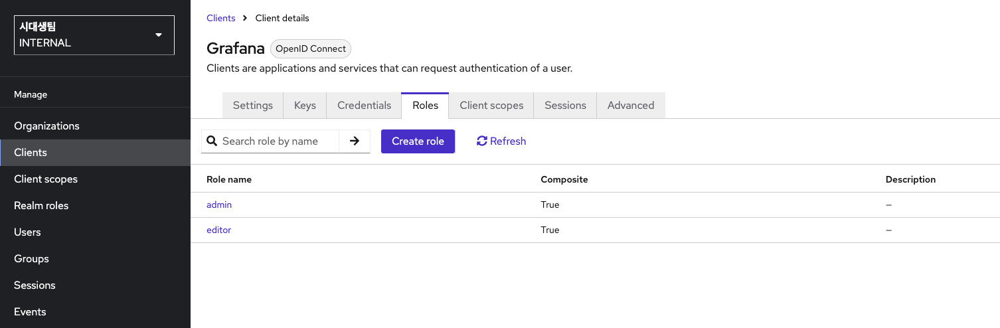

Grafana에서 사용하는 역할 체계(Admin, Editor, Viewer)와 Keycloak에서 정의한 조직 내 역할 체계(sre, developer, manager)가 다르므로, Client의 Roles 탭에서 역할을 생성하고 매핑한다.

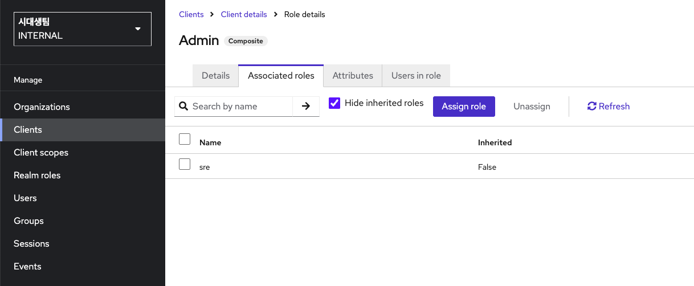

Keycloak 내 역할을 Grafana의 역할에 매칭시키는 설정을 진행한다.

#### Grafana Helm Chart 세팅

Keycloak 쪽에서 Client 설정이 완료되면, Grafana의 Helm Chart `values.yaml`에서 OIDC를 등록한다.

```yaml
grafana:
  grafana.ini:
    auth.generic_oauth:
      enabled: true
      name: Keycloak
      allow_sign_up: true
      client_id: grafana
      client_secret: $__file{/etc/secrets/grafana_oidc_client_secret}
      scopes: "openid profile email"
      auth_url: "https://<KEYCLOAK>/realms/<REALM>/protocol/openid-connect/auth"
      token_url: "https://<KEYCLOAK>/realms/<REALM>/protocol/openid-connect/token"
      api_url: "https://<KEYCLOAK>/realms/<REALM>/protocol/openid-connect/userinfo"
```

설정을 적용하면 Grafana 대시보드에 OIDC 로그인 버튼이 생긴다.

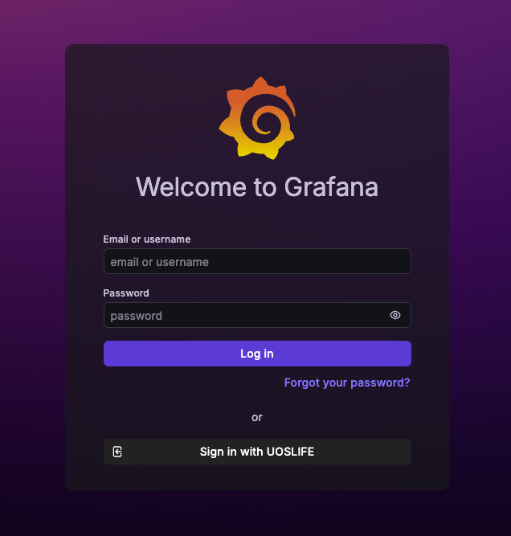

`scopes`에 `openid profile email`을 지정하여 OIDC 표준 엔드포인트(`auth_url`, `token_url`, `api_url`)를 통해 인증이 이루어지는 것을 확인할 수 있다. 이와 동일한 패턴으로 OIDC를 지원하는 다른 매니지먼트 툴에도 Keycloak 기반 SSO를 적용할 수 있다.

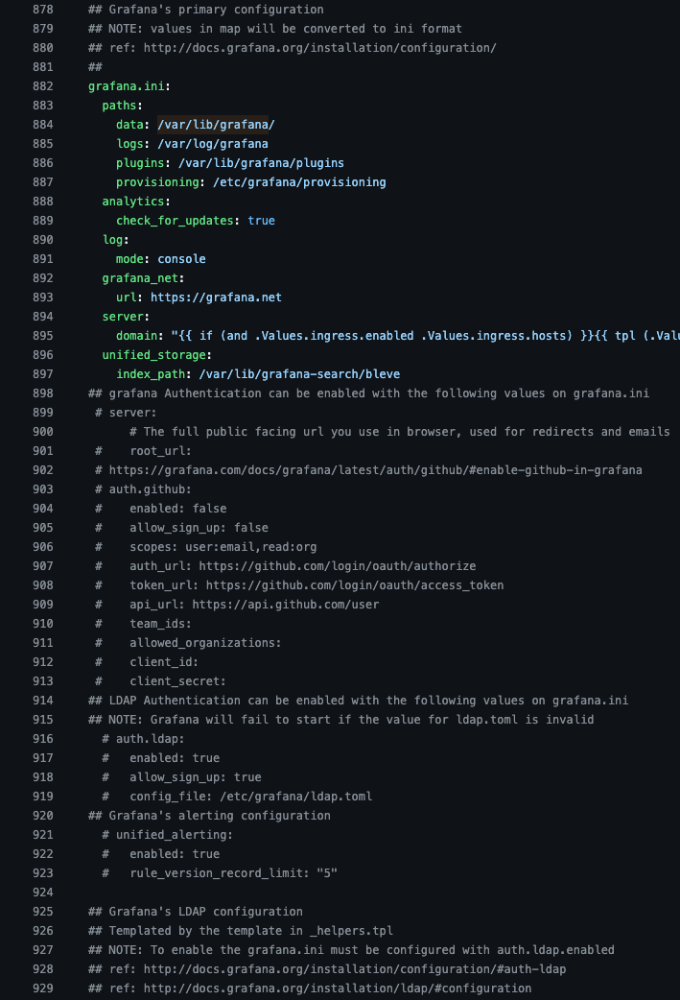

---

## 마치며

인증과 인가는 단순한 개념이지만, 실제 구현 스펙트럼은 넓다. 이 글에서 다룬 내용을 요약하면 다음과 같다.

1. **인증 vs 인가**: 신원 확인(401)과 권한 확인(403)의 차이
2. **세션 vs 토큰**: Stateful과 Stateless, 각각의 트레이드오프
3. **JWT와 RFC 표준**: Access Token + Refresh Token 플로우, RFC 6749 기반 구현
4. **Spring Security**: 필터 체인 기반 인증 프로바이더, 프론트엔드 토큰 갱신 패턴
5. **Keycloak SSO**: OIDC 기반 중앙 인증 허브, Role 매핑, Helm Chart 연동

RFC 표준처럼 이미 well-known 해결책이 있는 영역에서는 빠르게 구현하고, 알려지지 않은 기술적 챌린지에 집중할 수 있도록 기본기를 탄탄히 다지는 것이 중요하다.

### 참고 자료

- [Auth0 -- Authentication vs Authorization](https://auth0.com/intro-to-iam/authentication-vs-authorization)
- [RFC 6749 -- OAuth 2.0 Authorization Framework](https://www.rfc-editor.org/rfc/rfc6749)
- [RFC 7519 -- JSON Web Token (JWT)](https://www.rfc-editor.org/rfc/rfc7519)
- [jwt.io -- Introduction to JWT](https://jwt.io/introduction)
- [oauth.net -- OAuth 2.0](https://oauth.net/2/)
- [Logto -- What is OIDC](https://blog.logto.io/what-is-oidc)
- [Netflix Tech Blog -- Edge Authentication and Token-Agnostic Identity Propagation](https://netflixtechblog.com/edge-authentication-and-token-agnostic-identity-propagation-514e47e0b602)
- [우아한형제들 -- AOP를 이용한 OAuth2 캐시 적용하기](https://techblog.woowahan.com/2617/)
- [Mozilla -- HTTP Response Status Code](https://developer.mozilla.org/en-US/docs/Web/HTTP/Status)
- [Grafana -- Configure Grafana](https://grafana.com/docs/grafana/latest/setup-grafana/configure-grafana/)
- [GitHub -- saml2aws](https://github.com/Versent/saml2aws)
- [GitHub -- Grafana Helm Charts](https://github.com/grafana/helm-charts/blob/main/charts/grafana/values.yaml)
