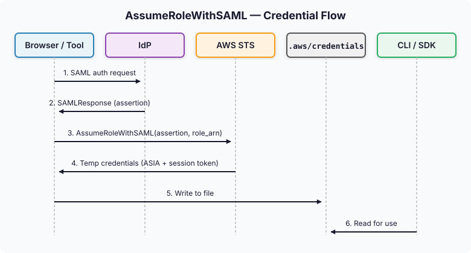

ある日から突然 `saml2aws login` が動かなくなった。正確には、**パスワードマネージャーから使えるように、会社のIdPアカウントにPasskeyを移したその日から**だ。

`--verbose` を付けて実行し直してみると、ログのどこかに「HTMLのパースに失敗した」というメッセージが出ていた。気になって saml2aws のオープンソースを直接覗いてみると、IdPごとの provider 実装はどれも一様に、**IdPのログインページのHTMLを受け取ってフォームをパースする構造**になっていた。通常のパスワード/OTPページを前提に書かれているので、Passkey認証ページが間に挟まった瞬間にセレクタが噛み合わなくなり、そのまま崩れ落ちる。これは「ツールが壊れた」というより、**ヘッドレス自動化が通用しなくなる方向に認証モデルが移りつつある**というシグナルに近かった。

ここから二つの疑問が付いて回ることになった。**AWS CLIはそもそも認証情報をどうやって受け取り、どこに保存しているのか? そして saml2aws を置き換えるなら、構造的に正しい答えはどこにあるのか?** この記事はその二つの問いを追いかけた記録だ。`~/.aws/` ディレクトリの解剖から始めて、一時認証情報を得る五つの経路を比較し、最後に IAM Identity Center がなぜその答えになるのか、というところに着地する。

---

## 1. AWSの認証情報は、結局どこから来るのか

AWS CLIをはじめとするすべてのAWS SDKは、認証情報が必要になるたびに **認証情報解決チェーン**(credential resolution chain)と呼ばれる決まった順序を辿る。まず環境変数を確認し、なければプロファイル設定を見て、それもなければ EC2 インスタンスメタデータやコンテナのロールへと進む。どのSDKでもこの優先順位はほぼ同じだ。

この記事で扱うのはその中の **プロファイルベース**、つまり `~/.aws/` ディレクトリを通じた認証の流れだ。ローカルでCLIを使う開発者にとって、いちばん馴染みのある道でもある。

認証情報は大きく二つに分かれる。

- **長期認証情報**(long-term credentials) — IAM User の access key。`AKIA` で始まり、無期限に有効だ。手動でローテーションしない限り、いつまでも使える。
- **短期認証情報**(short-term credentials) — STSが発行する一時キー。`ASIA` で始まり、`session token` がセットで付いてくる。有効期間は通常1時間から12時間ほど。

`~/.aws/` のディレクトリ構造は、結局のところ「この2種類の認証情報を、どうやって発行してもらい、どこに保存し、どう更新するか」という問いに対する答えだ。各ファイルが何のために存在しているかを理解すれば、問題が起きたときにどこを見ればいいのかが自然に見えてくる。

---

## 2. `~/.aws/` ディレクトリの解剖

### 2.1 `~/.aws/config` — プロファイルの骨格

最も基本となる設定ファイル。`aws configure`、`aws configure sso`、あるいは直接編集することで作られる。プロファイル単位で region、出力フォーマット、そして認証情報の取得方法を定義する。

```ini
[default]
region = ap-northeast-2
output = json

[profile prod]
region = ap-northeast-2
role_arn = arn:aws:iam::123456789012:role/AdminRole
source_profile = default
mfa_serial = arn:aws:iam::111111111111:mfa/hj.kang

[profile prod-sso]
sso_session = teamsparta
sso_account_id = 123456789012
sso_role_name = AdministratorAccess
region = ap-northeast-2

[sso-session teamsparta]
sso_start_url = https://teamsparta.awsapps.com/start
sso_region = ap-northeast-2
sso_registration_scopes = sso:account:access
```

ここでよく混同される細かいポイントが二つある。

一つ目は、`default` プロファイルだけが `[default]` という書き方で、それ以外はすべて `[profile 名前]` の形になり、**`profile` プレフィックスが必須**だという点。これは後で出てくる `credentials` ファイルのルールと違うので、よけいに混同しやすい。

二つ目は、`[sso-session]` セクションが AWS CLI v2 の IAM Identity Center 統合で導入された、比較的新しい概念だという点。複数のプロファイルが **同じ SSO access token を共有**できるようにしてくれる。50個のアカウントにアクセスできるユーザーでもSSOログインは一度で済む、というのはここから来ている。

### 2.2 `~/.aws/credentials` — 平文のキーが置かれる場所

IAM Userのaccess keyを平文で保存するファイル。`aws configure` でキーを入力すると作られる。

```ini
[default]
aws_access_key_id = AKIA...
aws_secret_access_key = ...

[some-temp-profile]
aws_access_key_id = ASIA...
aws_secret_access_key = ...
aws_session_token = ...
```

覚えておくと便利なポイントが三つある。

- `AKIA` で始まるキーは IAM User の **永続的な access key**。
- `ASIA` で始まるキーは **STSが発行した一時認証情報**。この場合 `aws_session_token` が一緒に入っている。
- セクション名は `[プロファイル名]` — `config` ファイルとは違って `profile` プレフィックスは **付かない**。

このファイルは **ISMS-P のようなセキュリティコンプライアンスの観点から、最もリスクの高いファイル**だ。長期キーが平文のままディスクに置かれているからだ。ノートPCを紛失したりバックアップが漏れたりすれば、そのまま流出する。後で見ていくが、「長期キーを `credentials` ファイルに置いて運用する」というやり方は徐々に消えつつある。

### 2.3 `~/.aws/sso/cache/` — SSO トークンの居場所

`aws sso login` または `aws configure sso` でSSOログインすると作られるディレクトリ。二種類のJSONファイルが入る。

**ファイル1**: `{sha1-of-start-url-or-session-name}.json` — 実際の SSO access token が入っている。

```json
{
  "startUrl": "https://teamsparta.awsapps.com/start",
  "region": "ap-northeast-2",
  "accessToken": "eyJlbmMi...",
  "expiresAt": "2026-05-16T20:00:00Z",
  "refreshToken": "...",
  "clientId": "...",
  "clientSecret": "...",
  "registrationExpiresAt": "2026-08-14T..."
}
```

- access token は通常8時間ほど有効。
- refresh token があれば、バックグラウンドで自動的に更新される。
- **このトークン1枚で、SSOセッションからアクセス可能なすべてのアカウントとロールの一時認証情報を発行してもらえる**。だから実質的には `credentials` ファイルよりもさらに機微なファイルになる。

**ファイル2**: `botocore-client-id-{region}.json` — OIDC Dynamic Client Registration の結果。

```json
{
  "clientId": "...",
  "clientSecret": "...",
  "registrationExpiresAt": "2026-08-14T..."
}
```

AWS SSO OIDC にCLIを「クライアント」として登録した情報だ。およそ3か月有効で、ログインのたびに作り直されるわけではない。これが何を意味するかは、4章で IAM Identity Center の流れを見ていくときに再び登場する。

### 2.4 `~/.aws/cli/cache/` — AssumeRole 結果のキャッシュ

`AssumeRole` 系のSTS呼び出し結果をキャッシュするディレクトリ。`role_arn` + `source_profile` を使うプロファイルを使ったときに作られる。

```json
{
  "Credentials": {
    "AccessKeyId": "ASIA...",
    "SecretAccessKey": "...",
    "SessionToken": "...",
    "Expiration": "2026-05-16T20:00:00Z"
  },
  "AssumedRoleUser": {
    "AssumedRoleId": "AROA...:session",
    "Arn": "arn:aws:sts::123456789012:assumed-role/..."
  }
}
```

ファイル名はプロファイル設定(`role_arn`、`role_session_name`、`mfa_serial` など)をハッシュした値になっている。CLIを叩くたびにMFAトークンを聞かれずに済むのは、このキャッシュのおかげだ。期限が切れるまでは、同じ一時認証情報が再利用される。

### 2.5 その他 — 知っておくと便利な周辺ファイル

- `~/.aws/cli/alias` — CLI alias の定義ファイル。
- `~/.aws/models/` — カスタムサービスモデル。
- `*.lock` — 同時実行制御のロックファイル。一瞬だけ現れて消える。

これでディレクトリ構造の大まかな全体像はつかめたはずだ。次はこれらのファイルにどうやって認証情報が書き込まれるのか、その五つの道筋を比較してみよう。

---

## 3. 一時認証情報を得る5つの経路

すべての一時認証情報は、結局のところ **STS API またはその派生** を通じて発行される。どのAPIを、どんなインプットで呼ぶのか、結果がどこに保存され、どう更新されるのか — それが各経路の本質だ。

### 3.1 ひと目でわかる比較表

| 経路 | API | インプット | 結果の保存場所 | 更新方式 |
|---|---|---|---|---|
| **AssumeRole** | `sts:AssumeRole` | source_profile のキー (+ MFA) | `~/.aws/cli/cache/` | 期限切れ時に再呼び出し |
| **AssumeRoleWithSAML** | `sts:AssumeRoleWithSAML` | SAML assertion | `~/.aws/credentials` (saml2aws が直接書き込む) | なし — 再認証が必要 |
| **AssumeRoleWithWebIdentity** | `sts:AssumeRoleWithWebIdentity` | OIDC JWT | メモリまたはトークンファイルのパス | トークンファイル更新時に自動 |
| **SSO** | OIDC Device Auth + `sso:GetRoleCredentials` | SSO access token | 認証情報はメモリまたは一時キャッシュ; access token は `~/.aws/sso/cache/` | refresh token で自動更新 |
| **credential_process** | 外部プロセスの stdout をパース | 任意 (ツールごとに異なる) | ツールごとに異なる (例: aws-vault は OS keychain) | ツール自身が処理 |

### 3.2 5つの経路の本質

**(1) AssumeRole チェーン** — 最も伝統的なやり方だ。`[default]` にIAM Userのキーを置き、`[profile prod]` で `role_arn` + `source_profile = default` を指定してロールを切り替える。MFAを要求するポリシーになっているなら `mfa_serial` も追加する。結果は `cli/cache/` にキャッシュされ、期限が切れるまで再利用される。長期キーがディスク上にないと動かないところが限界点だ。

**(2) AssumeRoleWithSAML** — SAMLベースのSSO環境で使う、STS専用のエンドポイント。saml2aws が内部的に呼んでいたのが、まさにこのAPIだ。SAML assertion を持ってSTSに行くと一時認証情報が返ってきて、それを `~/.aws/credentials` に書き込む、という流れになる。refresh token が存在しないので期限が切れたら最初から再認証が必要だし、イントロで見たとおり、IdPのログインページが Passkey のような非HTML認証に切り替わった瞬間、自動化ツールはそこで止まる。

**(3) AssumeRoleWithWebIdentity** — OIDCのJWTを持ってSTSに行き、認証情報をもらう経路。EKSの **IRSA**(IAM Roles for Service Accounts)、GitHub Actions OIDC、GCP/Azureワークロードからのクロスクラウド認証は、すべてこの経路で動いている。`~/.aws/config` に `web_identity_token_file` と `role_arn` を書いておくと、SDKがトークンファイルを読んでSTSに提出する。人間ではなく、**ワークロードが持ち歩く認証方式**だ。

**(4) SSO**(IAM Identity Center) — 2段階の流れになっている。まず OIDC Device Authorization Grant でユーザーがブラウザ上で認証し、access token を受け取る(これが `~/.aws/sso/cache/` に保存される)。次にその access token を使って `sso:GetRoleCredentials` を呼び、特定のアカウント/ロールの一時認証情報を取得する。面白いのは、受け取った一時認証情報そのものはディスクには別途キャッシュされないことが多く、**access token だけがキャッシュされる**という点だ。

**(5) credential_process** — `~/.aws/config` に `credential_process = /path/to/tool ...` と書いておくと、SDKは認証情報が必要になるたびにそのプロセスを実行し、stdout から JSON を受け取って使う。aws-vault や 1Password CLI といったツールが、SDKの標準に乗り込むための公式フックだ。

### 3.3 ひとつだけ図で

表だけだとなかなか頭に入ってこないので、いちばんややこしい **AssumeRoleWithSAML** の流れを図で押さえておこう。



イントロで触れた saml2aws は、この流れの上の方、**IdPの応答から SAMLResponse を取り出す地点**でちょうど崩れた。IdPがパスワードフォームの代わりに Passkey ページを返してきたせいでフォームのセレクタが噛み合わなくなり、assertion を手に入れられなかったので、その先のSTS呼び出しまで到達することすらできなかった、ということだ。WebAuthn/Passkey はフィッシング耐性のために origin binding と user presence を強制する仕様だが、そのセキュリティ特性が、ちょうどヘッドレス自動化ツールを締め出す特性でもある。これは saml2aws だけの問題ではなく、**自動化された SAML クライアント全般の時代が終わりつつあるというシグナル**だ。そして次の章のテーマがそこから自然に立ち上がってくる — じゃあ、どこへ向かえばいいのか。

---

## 4. では IAM Identity Center は、構造的に何が違うのか

### 4.1 OIDC Device Authorization Grant — 認証とトークン回収の分離

IAM Identity Center は SAML ではなく OIDC を使う。それも **Device Authorization Grant**(RFC 8628)というやや特殊な流れだ。

1. CLIが「これから認証する必要がある」とSSO OIDCエンドポイントにリクエストする。
2. 応答として user code と verification URL を受け取る。
3. CLIはユーザーに **ブラウザでそのURLを開くよう案内**し、バックグラウンドで token endpoint をポーリングする。
4. ユーザーはブラウザ上で自分のIdPに対して認証する — Passkey でも WebAuthn キーでも SAML でも、IdPが望む方式そのままで。
5. 認証が完了するとCLIのポーリングが access token と refresh token を受け取る。

ポイントは **「認証はブラウザで、トークン回収はCLIで」** という分離が成立しているところにある。CLI は認証プロセスに割って入らない。だから Passkey がそのまま動く。saml2aws を殺したまさにあの弱点 — ヘッドレスで IdP ログインを横取りしようとしたという弱点 — がここには存在しない。

### 4.2 更新モデル — 1日1回で十分

- **access token**: 約8時間有効、期限切れ時に refresh token で自動更新。
- **refresh token**: 約90日有効(registration expiry と紐づく)。
- 実質的には **1日1回ほどブラウザで認証して、それ以外は自動** という体感になる。

saml2aws が1時間ごとに切れていたのと比べれば、運用の体感そのものがまるで違う。作業の途中で認証が切れて流れがぶつ切りになる経験が、まるごと消える。

### 4.3 `sso-session` セクションの本当の意味

`~/.aws/config` の `[sso-session teamsparta]` のようなセクションは、ただのグルーピングではなく、**複数のプロファイルが同じ access token を共有する**ということを意味している。50個のAWSアカウントにアクセスできるユーザーが50回ログインせずに、1回のSSOログインですべてのアカウントの一時認証情報を取得できるのは、ここに理由がある。

組織が大きくなりアカウント数が増えるほど、この違いの効きが強くなっていく。1回の認証がユーザーの権限境界全体に自然に広がっていくモデルは、運用する側にとっても使う側にとっても、はるかにシンプルだ。

---

## おわりに

この記事を書いてみてあらためて確認できたのは、**`~/.aws/` の構造は「認証情報をどうやって発行してもらい、どこに保存し、どう更新するか」という問いへの答え**だ、ということだった。各ファイルがどの流れのために存在しているのかを理解しておけば、問題が起きたときにどこを見ればいいのかは自然と見えてくる。

saml2aws が壊れたあの日を振り返ると、それは単にツールが一つ死んだ、という出来事ではなかった。ヘッドレスクライアントが IdP のログイン画面を自動化していた時代、そして長期 access key が平文のままディスクに置かれていても誰も気にしなかった時代 — その二つの時代が同時に終わっていく風景だった。フィッシング耐性のある認証が標準になり、短期認証情報と refresh token がデフォルトになっていく流れは、すでに始まっている。

IAM Identity Center への移行が、単なるツールの入れ替えに見えない理由もそこにある。ブラウザとCLIの分離、refresh token モデル、`sso-session` の共有といった構造的な改善が、まとめて付いてくるからだ。AWSの上で仕事をしている人なら、この流れには遅れずに乗っておいた方がいい。
