AWS를 운영하다 보면 리소스 비용 외에도 예상치 못한 곳에서 비용이 발생하는 경우가 많다. 특히 데이터 전송(Data Transfer) 비용은 아키텍처 설계 단계에서 간과하기 쉬운 항목이다. 이 글에서는 실무에서 직접 겪었던 AWS 비용 최적화 경험을 바탕으로, 데이터 전송 비용 구조, RI와 Savings Plans 선택 기준, 그리고 재해 복구(DR) 전략에 이르기까지 종합적으로 정리해 본다.

---

## 1. 데이터 전송 비용 -- 숨어 있는 트래픽 과금의 함정

### 클라우드는 결국 어딘가의 온프레미스다

**클라우드라는 것은 어딘가에 있는 온프레미스이다.** 한국에는 총 네 개의 AWS 데이터 센터(가용 영역, AZ)가 있으며, 대한민국 리전(`ap-northeast-2`)에서 `a`, `b`, `c`, `d` 네 개의 AZ를 제공한다. 우리가 인터넷을 사용하면 통신사(KT, SKT, LG U+)를 경유해서 트래픽이 흐르게 되고, 해외 사이트에 접속하면 국제 네트워크를 거친다.

직관적으로 생각해 보면, 한국 외부로 나가는 트래픽보다 국내 트래픽이 저렴하고, 같은 데이터센터 내부 트래픽이 가장 저렴할 것이다. 이 원리가 바로 AWS Data Transfer 과금의 핵심이다.

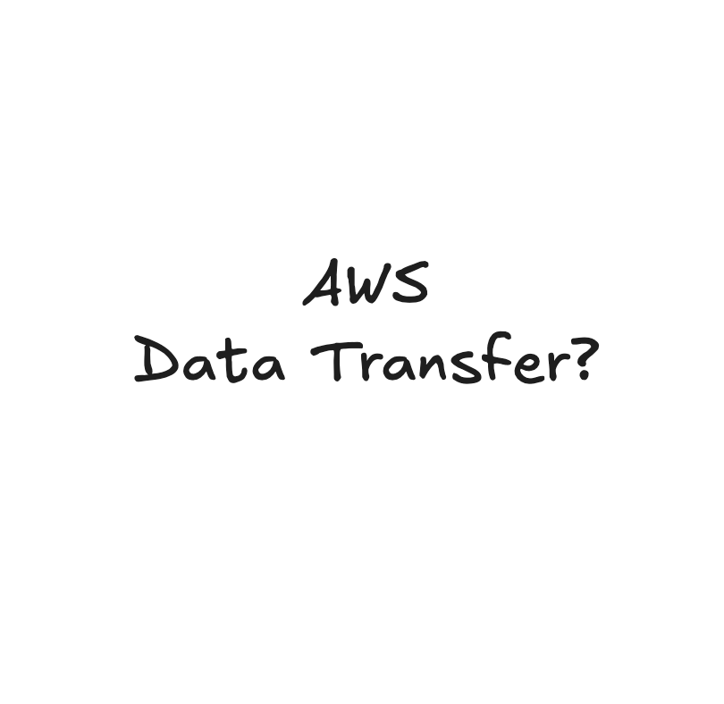

### AWS 데이터 전송 과금 구조

> 참고: [AWS 범용 클라우드 아키텍처의 데이터 전송 비용 알아보기](https://aws.amazon.com/ko/blogs/korea/overview-of-data-transfer-costs-for-common-architectures/)

간단히 요약하면 다음과 같다.

| 트래픽 방향 | 비용 |
|---|---|
| **Inbound** (인터넷 -> AWS) | 무료 |
| **Outbound -> Internet** | $0.126 / GB |
| **Outbound -> Other Region** | $0.08 / GB |
| **Same Region, Other AZ** | $0.02 / GB |
| **Same Region, Same AZ** | **무료** |

자세한 트래픽 비용 시뮬레이션은 [AWS Pricing Calculator - Data Transfer](https://calculator.aws/#/createCalculator/DataTransfer)에서 확인할 수 있다.

### AZ 간 트래픽 -- 가용 영역 선택이 비용을 좌우한다

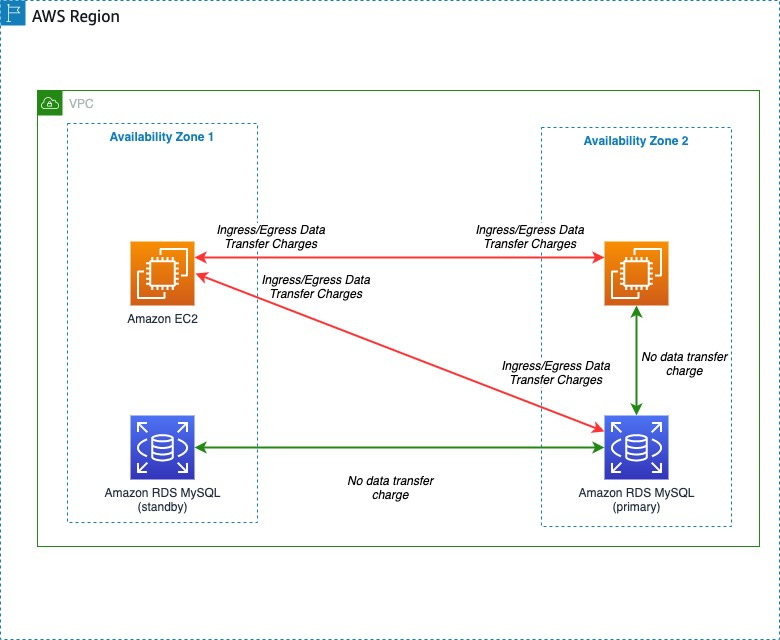
<!-- TODO: AZ 간 트래픽 흐름을 나타내는 아키텍처 다이어그램. 빨간색 화살표(비용 발생)와 초록색 화살표(무료, 예: RDS Replication)를 구분해서 표시 -->

위 그림에서 빨간색 화살표는 비용이 발생하는 구간이고, 초록색 화살표는 비용이 발생하지 않는 구간이다. RDS 간 트래픽이 AZ를 통과하더라도 Replication 기능을 사용하면 추가 트래픽 비용이 발생하지 않는다는 점에 주목하자.

가용 영역을 몇 개 사용할지가 중요한 포인트다.

- **개발 환경**: 가용 영역 한 개면 충분하다
- **프로덕션 환경**: 고가용성 확보를 위해 최소 두 개 이상 필요하다

데이터센터에 화재가 발생하거나 네트워크가 일시적으로 끊기는 상황을 대비하려면 다중 AZ 구성이 필수다. 다만, 개발 환경에서까지 다중 AZ를 사용할 필요는 없다.

### S3 설정 -- VPC 엔드포인트로 트래픽 비용 절감

S3는 이미지나 동영상 같은 고용량 파일을 저장하는 오브젝트 스토리지다. EC2 같은 리소스의 설정을 잘못하면, S3에서 데이터를 가져올 때 인터넷을 경유하게 되어 불필요한 트래픽 비용이 발생할 수 있다.

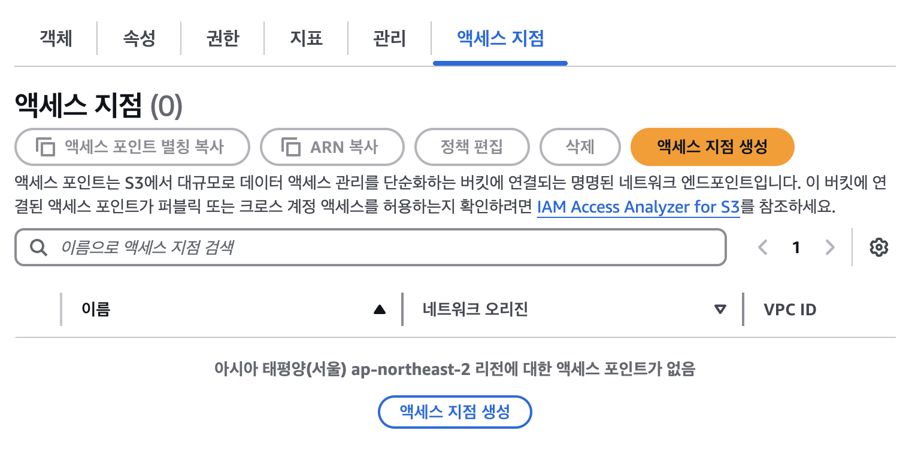

S3 액세스 지점(Access Point)을 생성해서 VPC를 통해 데이터를 전달받도록 설정하자. 그리고 용량이 큰 파일을 업로드할 때는 **데이터를 압축해서 전송**하는 것을 항상 잊지 말자. DynamoDB 같은 리소스에 액세스할 때도 VPC 설정을 통해 트래픽 비용을 절감할 수 있다.

### CloudFront 설정 -- 캐시와 Price Class 활용

S3에서 직접 데이터를 전송하는 대신 CloudFront를 통해 데이터를 전송하면, 캐시 기능으로 상당 부분의 트래픽 비용을 줄일 수 있다.

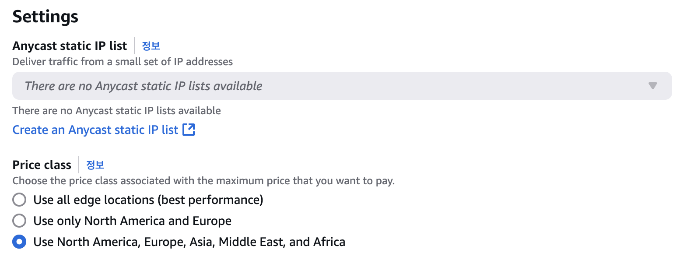

CloudFront의 **Price Class** 설정도 중요하다. AWS는 전 세계 216개의 Edge Location을 보유하고 있다.

| Price Class | Edge Location 수 | 적합한 경우 |
|---|---|---|
| All | 216개 | 글로벌 서비스 |
| 200 | 200개 | 대부분의 리전 커버 |
| 100 | 100개 | 비용 최소화 우선 |

글로벌 서비스가 아니라면 가장 낮은 클래스부터 시작하는 것도 좋다. Price Class는 언제든 변경할 수 있다.

### 개발 환경 비용 절감 팁

- RDS 등 인스턴스 생성 시 **단일 AZ**를 사용해서 AZ 간 트래픽 비용을 절약한다
- 업무 시간 외에는 Lambda 등을 통해 인스턴스를 중단해서 온디맨드 요금을 줄인다

### CloudWatch로 지속적인 모니터링

CloudWatch를 통해 Network In/Out 트래픽을 지속적으로 모니터링하는 것이 중요하다. 특히 다른 AZ에 액세스할 가능성이 있는 EC2, RDS 같은 리소스는 반드시 모니터링해야 한다.

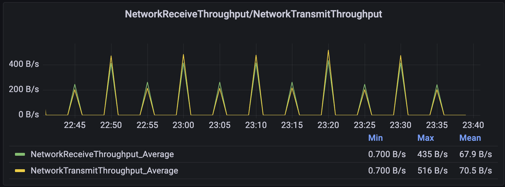

---

## 2. RI vs Savings Plans -- 약정 할인의 두 가지 선택지

AWS 비용에서 가장 큰 비중을 차지하는 것은 컴퓨팅 리소스다. 온디맨드 요금 그대로 사용하면 비용이 상당하지만, 예약 인스턴스(RI)나 세이빙 플랜(SP)을 활용하면 최대 72%까지 할인을 받을 수 있다.

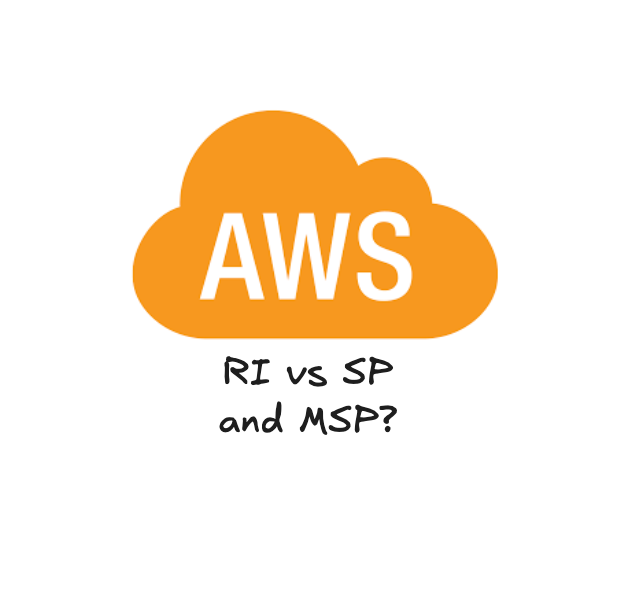

### 예약 인스턴스(Reserved Instance, RI)

> 참고: [AWS 예약형 인스턴스](https://aws.amazon.com/ko/aws-cost-management/aws-cost-optimization/reserved-instances/)

RI는 특정 인스턴스 속성(유형, 리전, OS 등)에 대해 1년 또는 3년 사용을 약정하고, 온디맨드 대비 최대 72%까지 할인을 받는 모델이다.

**RI의 주요 특징:**

- **약정 기반**: 특정 인스턴스 속성(유형, 리전, OS 등)에 대한 사용 약속
- **높은 할인율**: 선결제 비중이 높고 약정 기간이 길수록 할인율이 높다
- **용량 예약 가능**: Zonal RI를 구매하면 해당 AZ에서 인스턴스 용량을 예약할 수 있다
- **두 가지 유형**:
  - **표준 RI(Standard RI)**: 가장 높은 할인율이지만, 구매 후 인스턴스 패밀리/OS/테넌시 변경 불가. 워크로드가 매우 안정적이고 예측 가능할 때 적합
  - **컨버터블 RI(Convertible RI)**: 할인율은 다소 낮지만, 계약 기간 중에도 인스턴스 패밀리/OS/테넌시를 다른 컨버터블 RI로 교환 가능. 워크로드 변경 가능성이 있을 때 유리
- **적용 범위**: 주로 EC2이지만, RDS, Redshift, ElastiCache, OpenSearch 등에도 유사한 예약 모델이 존재

RI는 특정 인스턴스 사용 계획이 확고하고 최대 할인을 원할 때 강력하지만, 약정한 인스턴스를 사용하지 않더라도 비용이 발생하며, 유연성이 부족하다는 점이 단점이다.

### 세이빙 플랜(Savings Plan, SP)

> 참고: [AWS 클라우드 비용 절감 - 절감형 플랜](https://aws.amazon.com/ko/savingsplans/)

SP는 RI와 유사하게 1년 또는 3년 기간 동안 시간당 컴퓨팅 사용량($/hour)을 약정하고, 온디맨드 대비 할인을 받는 유연한 요금 모델이다. SP의 가장 큰 차별점은 **유연성**이다.

**SP의 주요 특징:**

- **약정 기반**: 특정 인스턴스가 아닌, 시간당 컴퓨팅 사용량($/hour)에 대한 약속
- **높은 유연성**: SP 종류에 따라 인스턴스 패밀리, 크기, AZ, 리전, OS, 테넌시는 물론 서비스 종류(EC2, Fargate, Lambda)가 변경되어도 자동 할인 적용
- **상당한 할인율**: 온디맨드 대비 최대 72% 할인 가능
- **관리 용이성**: 구매 후 약정 금액까지 자동 적용되므로 RI보다 관리가 수월
- **두 가지 주요 유형**:
  - **컴퓨팅 SP(Compute Savings Plans)**: 가장 높은 유연성. 리전, 인스턴스 패밀리, OS, 서비스(EC2, Fargate, Lambda)에 관계없이 모든 컴퓨팅 사용량에 자동 적용
  - **EC2 인스턴스 SP(EC2 Instance Savings Plans)**: 특정 리전 내 특정 EC2 인스턴스 패밀리(예: M5, C6g)에 적용. 표준 RI와 유사한 수준의 높은 할인율 제공

SP는 RI의 단점인 유연성 부족을 크게 개선한 모델이며, Fargate나 Lambda 같은 최신 컴퓨팅 서비스까지 포괄할 수 있다. 많은 경우 RI보다 SP가 선호되는 추세다.

### RI vs SP 핵심 비교

| 구분 | 예약 인스턴스(RI) | 세이빙 플랜(SP) |
|---|---|---|
| **주요 할인 대상** | 특정 EC2 인스턴스 속성 (타입, 리전, OS 등) | 컴퓨팅 사용량 ($/시간 약정) |
| **유연성** | 낮음 (표준 RI) ~ 중간 (컨버터블 RI) | 높음 (컴퓨팅 SP) ~ 중간 (EC2 인스턴스 SP) |
| **적용 범위** | 주로 EC2 (RDS 등 개별 RI 존재) | EC2, Fargate, Lambda (컴퓨팅 SP) |
| **관리 편의성** | 상대적 높음 (매칭, 교환 등 관리 필요) | 상대적 낮음 (구매 후 자동 적용) |
| **최대 할인율** | 특정 인스턴스 고정 시 가장 높을 수 있음 | 표준 RI과 유사하나 적용 범위가 넓음 |
| **용량 예약** | Zonal RI의 경우 가능 | 제공 안 함 (재정적 할인 계약) |

### 선택 가이드라인

1. **워크로드가 매우 안정적이고, 특정 EC2 인스턴스 유형을 변경 없이 사용할 것이 확실할 때** -- **표준 RI**가 최적. 특정 AZ 용량 예약이 필요하면 Zonal 표준 RI가 유리하다.

2. **EC2 워크로드 중심이지만, 인스턴스 패밀리/OS 변경 가능성이 있을 때** -- **컨버터블 RI** 또는 **EC2 인스턴스 SP**를 고려하자.

3. **다양한 EC2 인스턴스를 사용하거나, 인프라 변경 계획이 불확실할 때** -- **컴퓨팅 SP**가 가장 강력한 유연성을 제공한다.

4. **Fargate 또는 Lambda 사용량이 많을 때** -- **컴퓨팅 SP**가 유일한 선택지다. RI는 Fargate나 Lambda에 적용되지 않는다.

5. **관리 부담을 최소화하고 싶을 때** -- **SP**가 RI보다 관리가 용이하다.

**RI와 SP의 공존**: 두 가지는 상호 배타적이 아니며 함께 사용할 수 있다. AWS는 먼저 RI 할인을 적용하고, 나머지 온디맨드 사용량에 SP 약정 금액만큼 할인을 적용한다. 예측 가능성이 높은 핵심 워크로드는 표준 RI로, 나머지 유동적인 부분은 SP로 커버하는 **혼합 전략**도 효과적이다.

<!-- TODO: RI와 SP의 할인 적용 우선순위 및 혼합 전략을 시각화한 플로우차트 다이어그램 -->

---

## 3. 재해 복구(DR) -- 비용과 복원력 사이의 트레이드오프

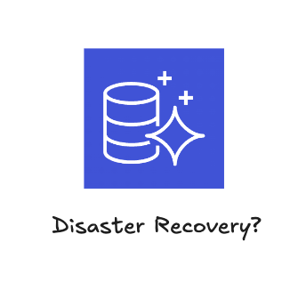

최근 Aurora RDS for Postgres를 버전 업그레이드해야 하는 상황이 있었다. AWS에서 RDS 특정 버전의 지원 기간이 끝나면, 확장 관리 명목으로 꽤 많은 추가 비용이 발생한다. 이 과정에서 RDS 백업과 재해 복구(DR) 전략에 대해 깊이 파고들게 되었다.

### 재해 복구(Disaster Recovery)란?

재해 복구는 자연 재해, 시스템 오류, 사이버 공격 등 예측 불가능한 이유로 IT 인프라가 마비되었을 때, 미리 정의된 복구 목표에 따라 시스템과 데이터를 복원하는 체계적인 프로세스를 말한다.

핵심 지표는 다음 두 가지다.

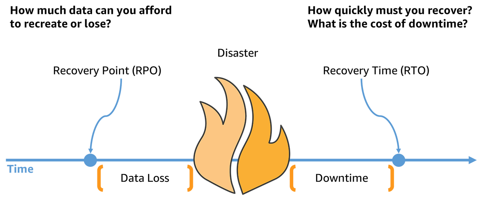
*출처: [AWS DR Architecture - Strategies for Recovery in the Cloud](https://aws.amazon.com/ko/blogs/architecture/disaster-recovery-dr-architecture-on-aws-part-i-strategies-for-recovery-in-the-cloud/)*

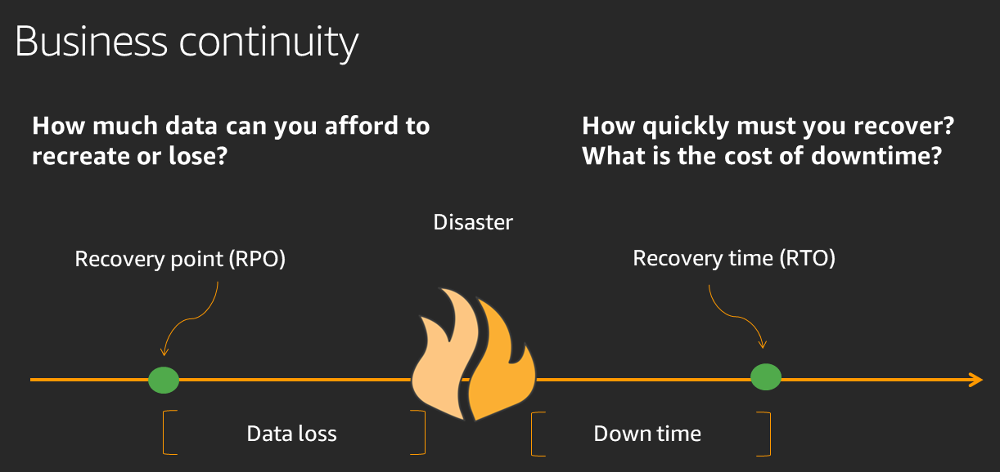
*[AWS] 재해 복구(DR) 목표 - 안정성 원칙*

- **RPO (Recovery Point Objective, 목표 복구 시점)**: 재해 발생 **이전**의 어느 시점까지의 데이터를 복구할 것인가? 즉, 최대 허용 데이터 손실량이다.
- **RTO (Recovery Time Objective, 목표 복구 시간)**: 재해 발생 **이후** 시스템을 정상 상태로 복구하는 데까지 걸리는 최대 허용 시간, 즉 목표 다운타임이다.

RPO와 RTO가 짧을수록 좋지만, 그만큼 비용이 많이 든다. 이 트레이드오프를 이해하는 것이 핵심이다.

### RPO: 데이터를 얼마나 잃을 수 있는가?

RPO는 백업 또는 복제 빈도에 의해 결정된다. 백업 주기가 길수록 장애 시 잃어버릴 데이터가 많아지고, 짧을수록 데이터 손실을 최소화할 수 있다.

#### RDS 기본 스냅샷 (RPO: 24시간)

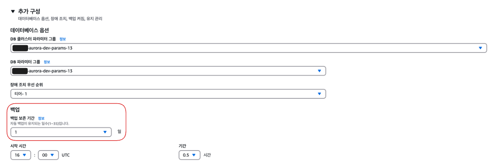

매일 새벽 3시에 자동 스냅샷이 생성된다고 가정하자. 다음날 새벽 2시 59분에 장애가 발생하면, 가장 최신 백업은 거의 24시간 전의 스냅샷이다. 최대 23시간 59분 동안의 데이터를 잃을 수 있으므로 RPO는 **24시간**이 된다.

#### PITR(Point-in-Time Recovery)로 RPO 5분 달성

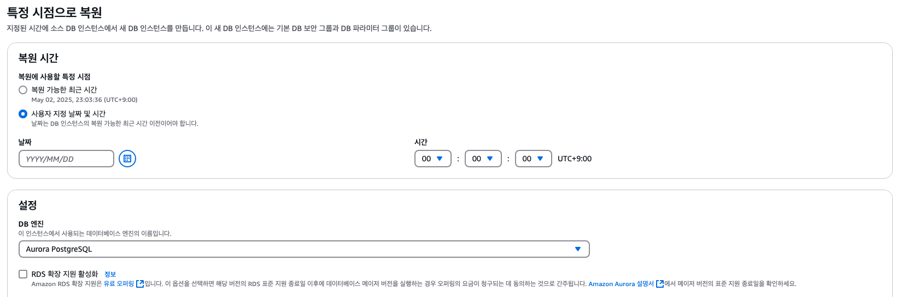

RDS 자동 백업을 활성화하면, 주기적인 스냅샷 생성과 함께 트랜잭션 로그를 **5분 간격**으로 S3에 백업한다. 이 로그 덕분에 장애 발생 5분 전 시점으로 데이터베이스를 복구하는 **시점 복구(PITR)**가 가능해지며, RPO를 **최대 5분**까지 줄일 수 있다.

#### Lambda + S3를 이용한 논리 백업

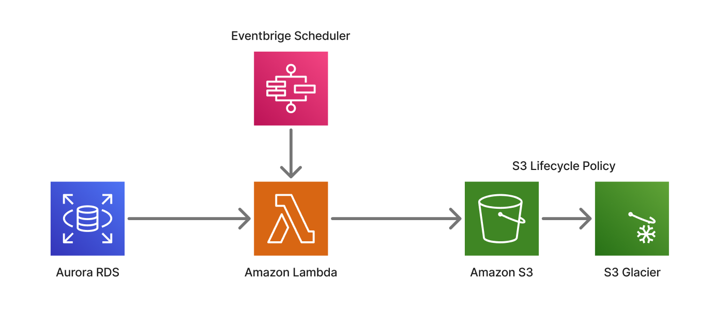

AWS Lambda와 S3를 활용하여 `pg_dumpall` 또는 `mysqldump` 같은 논리 백업을 주기적으로 수행하는 방식도 있다. EventBridge 스케줄러로 Lambda를 실행하고, RDS 내용을 S3에 저장한 뒤, S3 Lifecycle Policy로 오래된 백업을 정리하는 서버리스 아키텍처다.

- 1시간 간격 스케줄러라면 RPO는 1시간
- PITR보다 짧은 RPO를 가지기는 어렵지만, **특정 시점의 완전한 논리 백업본**을 확보할 수 있어 마이그레이션이나 데이터 분석에 활용 가능

최근에는 **AWS Backup** 서비스가 나오면서 이런 복잡한 서버리스 구성 없이도 간편하게 백업을 관리할 수 있다. Aurora의 기본 기능이 충분히 좋기 때문에, 쿠버네티스 크론잡 등의 별도 구성 없이도 안정적인 백업이 가능하다.

### RTO: 얼마나 빨리 복구할 수 있는가?

RTO는 서비스 장애 후 다시 가동될 때까지 허용되는 최대 다운타임이다. 복구 계획의 상세 수준, 자동화 정도, 대기(Standby) 시스템 유무, 기술 팀의 대응 속도 등이 RTO에 영향을 미친다.

#### 백업으로부터 복원 (RTO: 수십 분 ~ 수 시간)

스냅샷이나 PITR 데이터로부터 새 인스턴스를 생성하는 가장 기본적인 방법이다. 데이터베이스 크기에 따라 수십 분에서 몇 시간까지 걸릴 수 있으므로, RTO가 긴 경우에만 적합하다.

#### RDS Multi-AZ 배포 (RTO: 수 분)

Multi-AZ 배포를 설정하면, AWS가 자동으로 다른 AZ에 예비(Standby) DB 인스턴스를 생성하고, 동기식 복제(Synchronous Replication)를 수행한다. 원본 DB에 문제가 발생하면 DNS 엔드포인트를 예비 인스턴스로 자동 전환하는 **자동 장애 조치(Automatic Failover)**가 **수 분 안에** 완료된다.

다만, 예비 인스턴스를 항상 운영해야 하므로 단일 AZ 대비 **약 두 배의 인스턴스 비용**이 발생한다.

#### Amazon Aurora 활용 (RTO: 수 초 ~ 1분 미만)

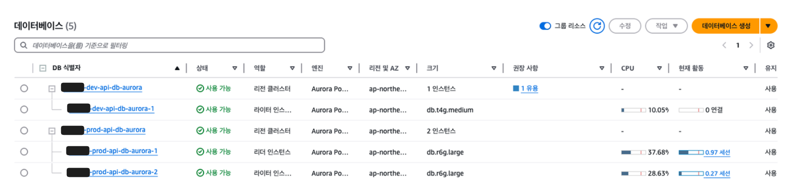

Aurora는 아키텍처 설계 단계부터 고가용성과 빠른 복구를 염두에 뒀다. Writer 인스턴스와 Reader 인스턴스를 분리하며, 최대 15개의 읽기 전용 복제본을 생성할 수 있다.

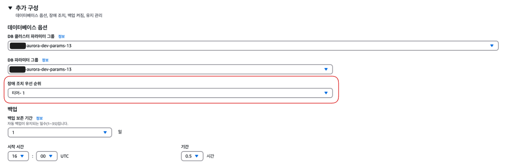

핵심은 **복제본별 장애 조치 우선순위 설정**이다.

- 각 복제본에 Tier 0부터 15까지 우선순위 등급을 지정할 수 있다
- 장애 발생 시 Aurora는 **Tier 0, Tier 1에 속한 복제본**을 최우선으로 승격 시도한다
- 이를 통해 장애 조치 시간을 **1분 미만, 많은 경우 수 초 내**로 단축할 수 있다

이를 스탠바이(Standby) 혹은 핫-로드(hot-load)라 부르며, 장애 발생 시 자동으로 복구가 이루어진다.

> 참고: [Amazon Aurora 추가 장애 복구 제어](https://aws.amazon.com/ko/blogs/korea/additional-failover-control-for-amazon-aurora/)

### DR 전략 요약

| 전략 | RPO | RTO | 비용 |
|---|---|---|---|
| 일일 스냅샷 | 24시간 | 수 시간 | 낮음 |
| PITR (자동 백업) | 5분 | 수십 분 | 낮음 |
| Multi-AZ | 0 (동기 복제) | 수 분 | 중간 (2x 인스턴스) |
| Aurora + Reader 복제본 | 0 (동기 복제) | 수 초 ~ 1분 미만 | 중간~높음 |

<!-- TODO: RPO/RTO와 비용의 상관관계를 보여주는 트레이드오프 곡선 다이어그램 -->

---

## 4. 실전 인사이트

### MSP(Managed Service Provider) 활용

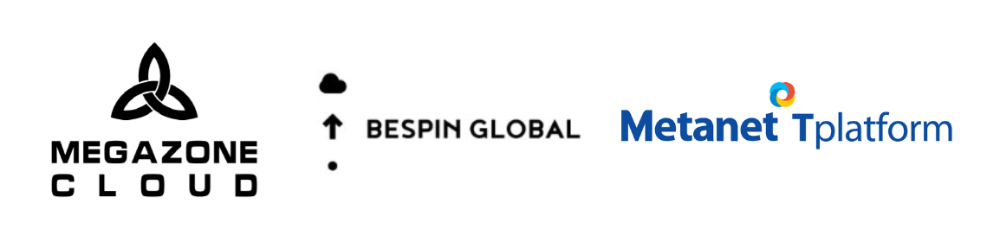
*국내 MSP 3사*

대부분의 비용 분석과 견적은 MSP에 요구하면 전부 작성해 준다. MSP를 경유해서 AWS를 사용하면 다음과 같은 이점이 있다.

- **CloudFront 할인과 함께 AWS 종합적인 할인** 제공
- **Datadog**, **New Relic** 같은 모니터링/보안 서비스도 함께 제공 및 통합 관리
- AWS 비용 확인 플랫폼, 쿠버네티스/Datadog 모니터링 플랫폼 등 제공
- 보안 컨설팅, AWS 컨설팅 등 외부 인력을 통한 인프라 관리 지원

RI와 SP는 비용을 절감하기 위한 효과적인 "도구"이며, MSP는 이 도구를 잘 사용할 수 있도록 돕는 "전문가"다. 도구의 사용법을 알고 전문가와 협력할 때 최적의 결과를 낼 수 있다.

### 비용 절감 체크리스트

실무에서 바로 활용할 수 있는 AWS 비용 최적화 체크리스트를 정리해 보았다.

**데이터 전송 비용**
- [ ] S3 액세스 시 VPC 엔드포인트를 사용하고 있는가?
- [ ] EC2 -> S3 통신이 인터넷을 경유하지 않는가?
- [ ] CloudFront Price Class가 서비스 대상 지역에 맞게 설정되어 있는가?
- [ ] 개발 환경에서 불필요하게 다중 AZ를 사용하고 있지 않은가?
- [ ] CloudWatch로 Network In/Out을 모니터링하고 있는가?

**약정 할인 (RI / SP)**
- [ ] 안정적인 워크로드에 대해 RI 또는 SP를 적용하고 있는가?
- [ ] Fargate, Lambda를 사용한다면 컴퓨팅 SP를 검토했는가?
- [ ] RI와 SP 혼합 전략을 고려해 보았는가?
- [ ] MSP와의 계약을 통해 추가 할인 혜택을 받고 있는가?

**재해 복구**
- [ ] RDS 자동 백업(PITR)이 활성화되어 있는가?
- [ ] 서비스 특성에 맞는 RPO/RTO 목표를 설정했는가?
- [ ] Aurora를 사용한다면 Reader 인스턴스의 장애 조치 우선순위를 설정했는가?
- [ ] 개발 환경과 프로덕션 환경의 DR 전략을 분리했는가?

**기타 비용 절감**
- [ ] 개발 환경은 업무 외 시간에 인스턴스를 중단하고 있는가?
- [ ] RDS 버전 지원 기간이 만료되기 전에 업그레이드 계획이 있는가?
- [ ] 대용량 파일 업로드 시 압축을 적용하고 있는가?

---

## 마치며

AWS 비용 최적화는 단일 전략으로 해결되지 않는다. 데이터 전송 비용은 VPC와 네트워크 기본기에서 시작하고, RI와 SP 선택은 워크로드의 안정성과 변동성에 따라 달라지며, DR 전략은 비즈니스 요구사항에 맞는 RPO/RTO 트레이드오프를 찾아야 한다.

결국 가장 중요한 것은 **자신의 인프라를 정확히 파악하는 것**이다. 어떤 서비스가 얼마나 트래픽을 발생시키는지, 워크로드가 얼마나 안정적인지, 데이터 손실 허용 범위가 어느 정도인지 -- 이 질문들에 명확히 답할 수 있다면, 최적의 비용 전략은 자연스럽게 따라온다.
