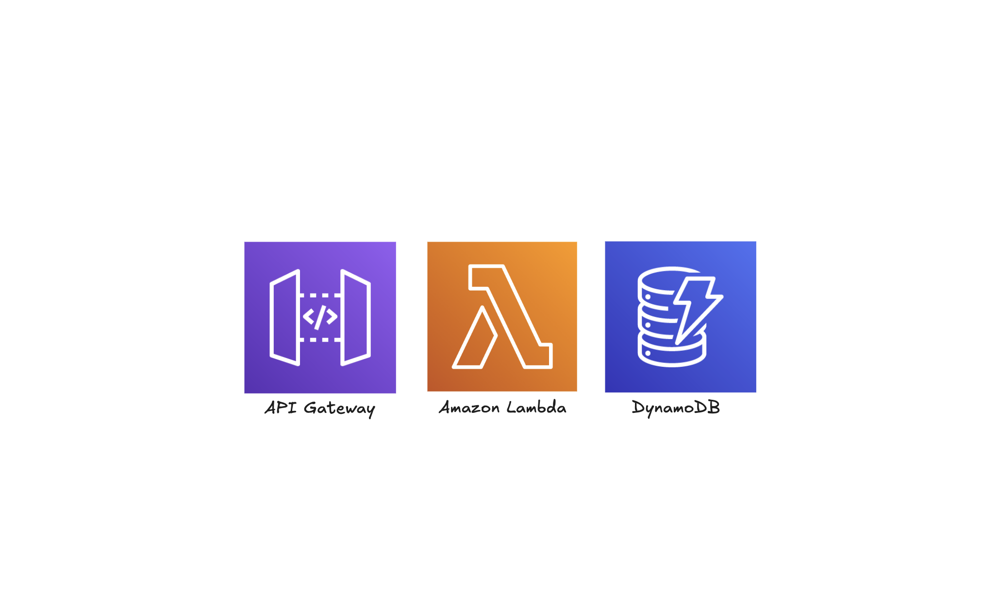

채팅 서비스의 가장 중요한 특징은 **실시간 통신**이다. 일반적인 HTTP API가 요청(Request)과 응답(Response) 패턴으로 동작하는 것과 달리, 채팅에서는 서버와 클라이언트가 지속적으로 연결을 유지하며 양방향으로 데이터를 주고받아야 한다. 이를 가능하게 하는 프로토콜이 바로 **WebSocket**이다.

이 글에서는 WebSocket 프로토콜의 기본 개념부터 시작하여, AWS의 서버리스 서비스인 **API Gateway, Lambda, DynamoDB**를 조합해 실시간 채팅 서버를 구축하는 전 과정을 단계별로 다룬다.

---

## 1. WebSocket 프로토콜

### HTTP vs WebSocket

기존의 HTTP 프로토콜은 **요청-응답(Request-Response)** 기반으로 동작한다. 클라이언트가 서버에 요청을 보내면 서버가 응답을 반환하고, 그 즉시 연결이 종료된다. 이 방식은 웹 페이지 로딩이나 REST API 호출에는 적합하지만, 실시간으로 데이터를 주고받아야 하는 채팅 서비스에는 적합하지 않다.

반면 **WebSocket** 프로토콜은 클라이언트와 서버 간의 **양방향 통신(Full-duplex communication)**을 가능하게 한다. 한 번 연결이 수립되면, 클라이언트와 서버 모두 언제든지 상대방에게 데이터를 전송할 수 있다. 이로 인해 실시간 채팅, 라이브 알림, 주식 시세 등 실시간성이 요구되는 서비스에 널리 사용된다.

| 특성 | HTTP | WebSocket |
|------|------|-----------|
| 통신 방식 | 단방향 (요청-응답) | 양방향 (Full-duplex) |
| 연결 유지 | 요청마다 연결/해제 | 지속적 연결 유지 |
| 오버헤드 | 매 요청마다 헤더 전송 | 최초 핸드셰이크 이후 경량 프레임 |
| 적합한 용도 | REST API, 웹 페이지 | 채팅, 실시간 알림, 스트리밍 |

### 연결 생명주기

WebSocket 연결은 다음과 같은 생명주기를 따른다.

1. **$connect**: 클라이언트가 WebSocket 서버에 최초 연결을 요청한다. HTTP 핸드셰이크를 통해 프로토콜이 업그레이드되며, 연결이 수립된다.
2. **메시지 교환**: 연결이 유지되는 동안 클라이언트와 서버가 자유롭게 메시지를 주고받는다.
3. **$disconnect**: 클라이언트 또는 서버가 연결을 종료한다.

AWS API Gateway에서 WebSocket API를 구축할 때, 이 세 가지 생명주기 이벤트(`$connect`, `$disconnect`, `$default`)에 대응하는 라우트를 설정하게 된다. 추가로 사용자 정의 라우트(예: `sendmessage`)를 등록하여 비즈니스 로직을 처리할 수 있다.

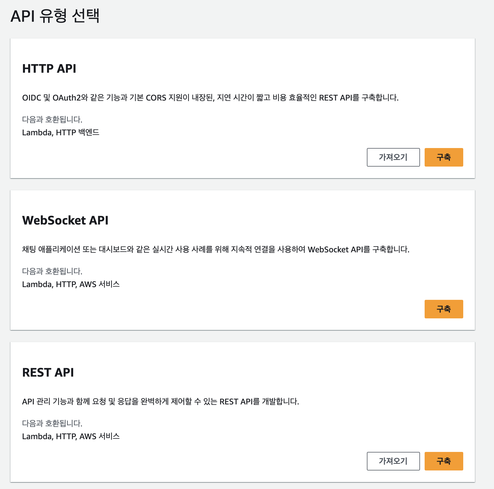

위 스크린샷은 AWS API Gateway 콘솔에서 WebSocket API를 선택하는 화면이다. HTTP API와 별도로 WebSocket API가 제공되는 것을 확인할 수 있다.

---

## 2. AWS 서버리스 아키텍처

### 전체 아키텍처 개요

<!-- TODO: 다이어그램 필요 - 서버리스 채팅 아키텍처 (API GW + Lambda + DynamoDB) -->

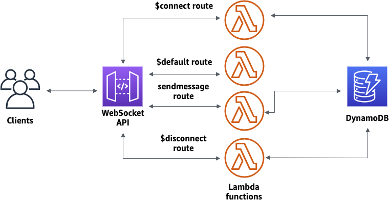

위 다이어그램은 이번에 구축할 서버리스 채팅 서버의 전체 아키텍처이다. 핵심 구성 요소는 다음 세 가지이다.

- **API Gateway (WebSocket API)**: 클라이언트와의 WebSocket 연결을 관리하고, 각 이벤트를 적절한 Lambda 함수로 라우팅한다.
- **Lambda Functions**: 연결 관리(`$connect`, `$disconnect`), 기본 처리(`$default`), 메시지 전송(`sendmessage`) 등 각 이벤트에 대한 비즈니스 로직을 수행한다.
- **DynamoDB**: 현재 연결된 클라이언트의 `connectionId`를 저장하고 관리한다. 메시지를 전송할 때 이 테이블을 스캔하여 모든 연결된 클라이언트에게 메시지를 브로드캐스트한다.

### API Gateway (WebSocket API)

API Gateway의 WebSocket API는 일반적인 HTTP API와는 다른 라우팅 구조를 갖는다. 클라이언트가 보내는 메시지의 특정 필드(라우팅 선택 표현식)를 기준으로 어떤 Lambda 함수를 호출할지 결정한다. 이번 구현에서는 `request.body.action` 필드를 라우팅 키로 사용한다.

기본적으로 제공되는 라우트는 다음과 같다.

- **$connect**: 클라이언트 연결 시 호출
- **$disconnect**: 클라이언트 연결 해제 시 호출
- **$default**: 매칭되는 라우트가 없을 때 호출
- **sendmessage** (사용자 정의): 메시지 전송 시 호출

### Lambda 함수 구성

각 라우트에 대응하는 4개의 Lambda 함수를 작성한다.

| Lambda 함수 | 연결 라우트 | 역할 |
|-------------|------------|------|
| `chat-lambda-connect` | `$connect` | DynamoDB에 connectionId 저장 |
| `chat-lambda-disconnect` | `$disconnect` | DynamoDB에서 connectionId 삭제 |
| `chat-lambda-default` | `$default` | 연결 정보 반환 |
| `chat-lambda-sendmessage` | `sendmessage` | 모든 연결된 클라이언트에 메시지 브로드캐스트 |

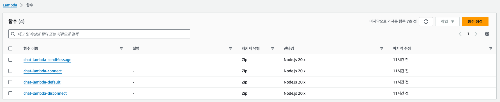

Lambda는 AWS에서 제공하는 서버리스 컴퓨팅 서비스이다. 서버리스(Serverless)란 서버가 없다는 뜻이 아니라, 인프라를 직접 관리할 필요가 없다는 것을 의미한다. 요청이 올 때마다 코드가 실행되며, EC2처럼 24시간 가동되는 것이 아니라 **호출 건수 당 비용**이 발생하기 때문에 일반적으로 비용 효율적이다.

### DynamoDB 연결 관리

DynamoDB는 AWS의 완전관리형 NoSQL 데이터베이스 서비스이다. 이번 채팅 서버에서는 현재 WebSocket으로 연결된 클라이언트의 `connectionId`를 저장하는 용도로 사용한다.

테이블 구조는 매우 단순하다.

| 속성 | 타입 | 설명 |
|------|------|------|
| `connectionId` (파티션 키) | String | WebSocket 연결의 고유 식별자 |

클라이언트가 연결되면 `connectionId`를 테이블에 추가하고, 연결이 해제되면 삭제한다. 메시지를 전송할 때는 이 테이블을 스캔하여 현재 연결된 모든 클라이언트를 조회한다.

---

## 3. 단계별 구현

### Step 1: DynamoDB 테이블 생성

먼저 연결 정보를 저장할 DynamoDB 테이블을 생성한다.

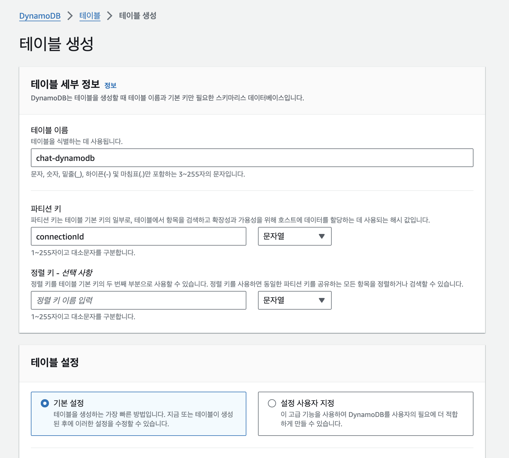

- **테이블 이름**: `chat-dynamodb`
- **파티션 키**: `connectionId` (String)
- 나머지 설정은 기본값을 사용한다.

이 테이블 이름은 이후 Lambda 함수에서 환경 변수로 참조하기 때문에 반드시 기억해 두어야 한다.

### Step 2: IAM 역할 생성

Lambda 함수가 DynamoDB와 API Gateway에 접근할 수 있도록 IAM 역할을 생성한다.

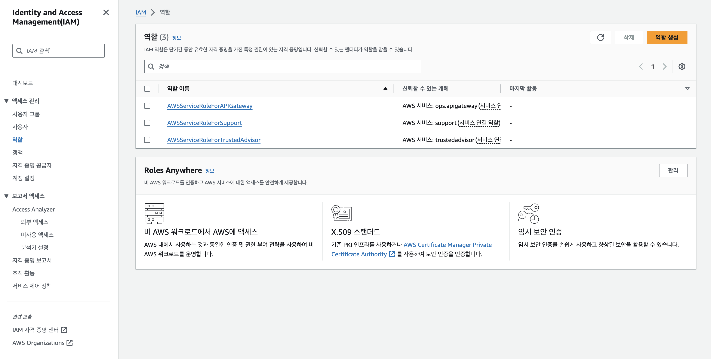

IAM 콘솔에서 **역할 -> 역할 생성**을 클릭한다.

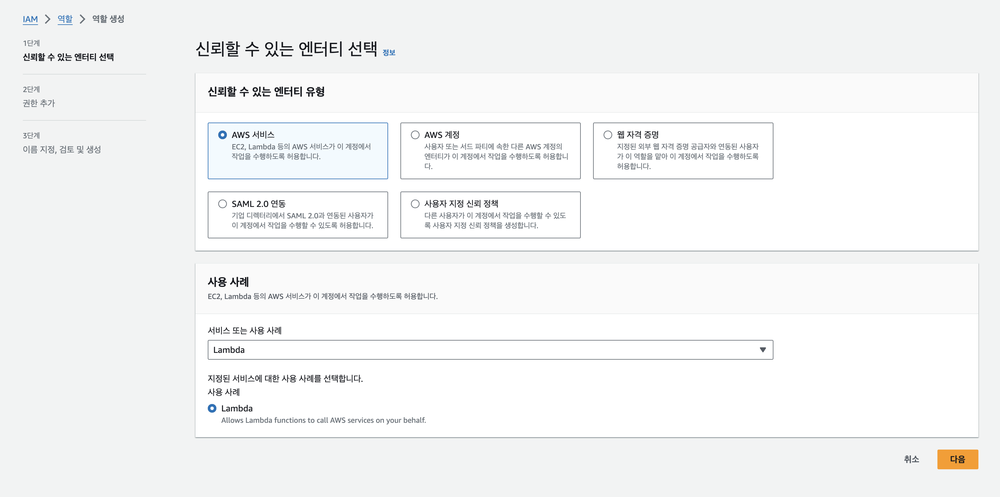

1단계에서 **Lambda**를 신뢰할 수 있는 서비스로 지정한다. IAM 역할은 특정 서비스에게 다른 서비스에 접근할 수 있는 권한을 부여하는 것이므로, Lambda가 이 역할을 사용할 수 있도록 설정한다.

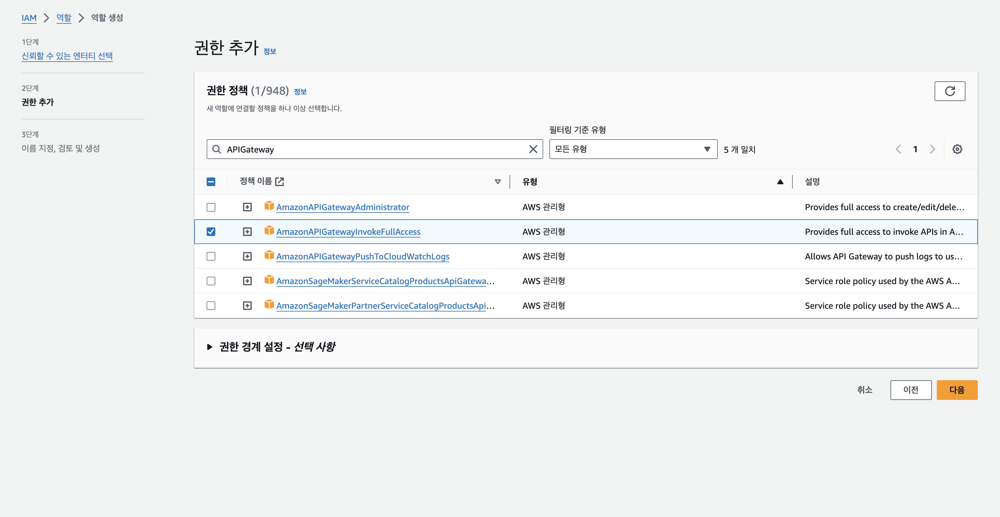

2단계에서 다음 세 가지 정책을 연결한다.

- **AmazonAPIGatewayInvokeFullAccess**: Lambda가 API Gateway와 상호작용할 수 있도록 한다.
- **AmazonDynamoDBFullAccess**: Lambda가 DynamoDB와 통신할 수 있도록 한다.
- **AWSLambdaBasicExecutionRole**: Lambda 함수의 기본 실행 권한(CloudWatch Logs 쓰기 등)을 부여한다.

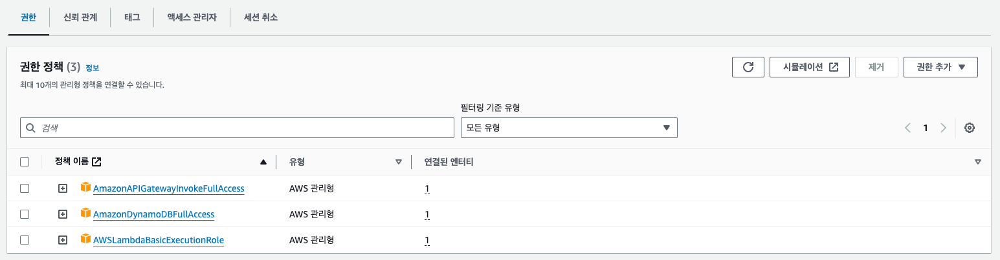

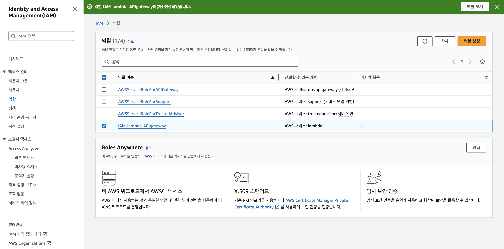

3단계에서 적절한 역할 이름을 입력하고 생성을 완료한다.

> **참고**: 이번 구현에서는 빠른 개발을 위해 FullAccess 정책을 사용하였다. 프로덕션 환경에서는 **최소 권한 원칙(Principle of Least Privilege)**에 따라 필요한 권한만 부여하는 것이 권장된다.

### Step 3: Lambda 함수 생성

Lambda 콘솔에서 함수를 생성한다.

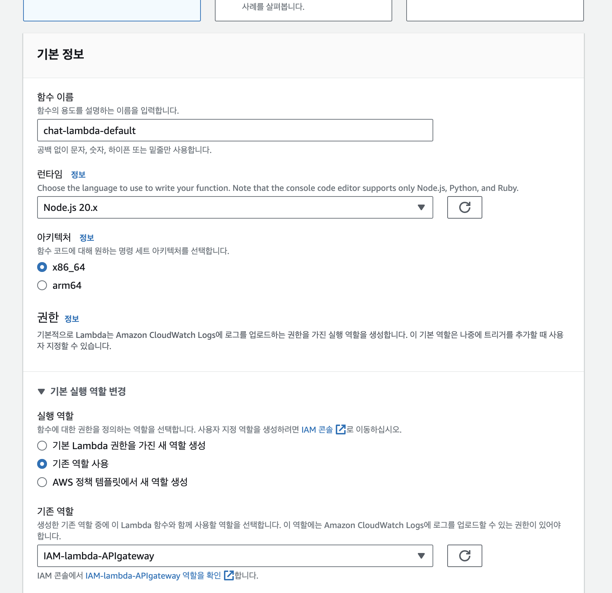

- **런타임**: Node.js 20.x
- **기본 실행 역할**: Step 2에서 생성한 IAM 역할 연결
- 이 과정을 반복하여 4개의 Lambda 함수를 생성한다.

#### 환경 변수 설정

모든 Lambda 함수에 DynamoDB 테이블 이름을 환경 변수로 설정해야 한다.

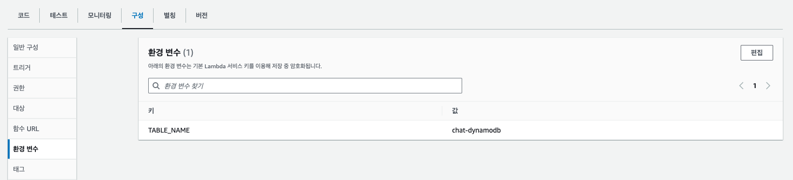

Lambda 콘솔에서 **구성 -> 환경 변수 -> 편집**으로 이동하여 다음을 입력한다.

- **키**: `TABLE_NAME`
- **값**: `chat-dynamodb`

이 환경 변수는 4개 Lambda 함수 모두에 설정해야 한다.

#### connect 함수

클라이언트가 WebSocket에 연결되면 `connectionId`를 DynamoDB에 저장한다.

```javascript
// chat-lambda-connect/index.js
const { DynamoDBClient } = require("@aws-sdk/client-dynamodb");
const { DynamoDBDocumentClient, PutCommand } = require("@aws-sdk/lib-dynamodb");

exports.handler = async function (event) {
  const client = new DynamoDBClient({});
  const docClient = DynamoDBDocumentClient.from(client);
  const command = new PutCommand({
    TableName: process.env.TABLE_NAME,
    Item: {
      connectionId: event.requestContext.connectionId,
    },
  });

  try {
    await docClient.send(command);
  } catch (err) {
    console.log(err);
    return { statusCode: 500 };
  }
  return { statusCode: 200 };
};
```

#### disconnect 함수

클라이언트가 연결을 해제하면 DynamoDB에서 해당 `connectionId`를 삭제한다.

```javascript
// chat-lambda-disconnect/index.js
const { DynamoDBClient } = require("@aws-sdk/client-dynamodb");
const { DynamoDBDocumentClient, DeleteCommand } = require("@aws-sdk/lib-dynamodb");

exports.handler = async function (event) {
  const client = new DynamoDBClient({});
  const docClient = DynamoDBDocumentClient.from(client);
  const command = new DeleteCommand({
    TableName: process.env.TABLE_NAME,
    Key: {
      connectionId: event.requestContext.connectionId,
    },
  });

  try {
    await docClient.send(command);
  } catch (err) {
    console.log(err);
    return { statusCode: 500 };
  }
  return { statusCode: 200 };
};
```

#### default 함수

매칭되는 라우트가 없는 메시지가 들어오면 연결 정보를 반환한다.

```javascript
// chat-lambda-default/index.js
const {
  ApiGatewayManagementApiClient,
  PostToConnectionCommand,
  GetConnectionCommand,
} = require("@aws-sdk/client-apigatewaymanagementapi");

exports.handler = async function (event) {
  let connectionInfo;
  let connectionId = event.requestContext.connectionId;

  const callbackAPI = new ApiGatewayManagementApiClient({
    apiVersion: "2018-11-29",
    endpoint:
      "https://" +
      event.requestContext.domainName +
      "/" +
      event.requestContext.stage,
  });

  try {
    connectionInfo = await callbackAPI.send(
      new GetConnectionCommand({
        ConnectionId: event.requestContext.connectionId,
      })
    );
  } catch (e) {
    console.log(e);
  }

  connectionInfo.connectionID = connectionId;

  await callbackAPI.send(
    new PostToConnectionCommand({
      ConnectionId: event.requestContext.connectionId,
      Data:
        "Use the sendmessage route to send a message. Your info:" +
        JSON.stringify(connectionInfo),
    })
  );
  return { statusCode: 200 };
};
```

#### sendmessage 함수

이 함수가 채팅의 핵심이다. DynamoDB에서 현재 연결된 모든 클라이언트를 조회하고, 발신자를 제외한 나머지 클라이언트에게 메시지를 브로드캐스트한다.

```javascript
// chat-lambda-sendmessage/index.js
const { DynamoDBClient } = require("@aws-sdk/client-dynamodb");
const { DynamoDBDocumentClient, ScanCommand } = require("@aws-sdk/lib-dynamodb");
const {
  ApiGatewayManagementApiClient,
  PostToConnectionCommand,
} = require("@aws-sdk/client-apigatewaymanagementapi");

exports.handler = async function (event) {
  const client = new DynamoDBClient({});
  const docClient = DynamoDBDocumentClient.from(client);
  const ddbcommand = new ScanCommand({
    TableName: process.env.TABLE_NAME,
  });

  let connections;
  try {
    connections = await docClient.send(ddbcommand);
  } catch (err) {
    console.log(err);
    return { statusCode: 500 };
  }

  const callbackAPI = new ApiGatewayManagementApiClient({
    apiVersion: "2018-11-29",
    endpoint:
      "https://" +
      event.requestContext.domainName +
      "/" +
      event.requestContext.stage,
  });

  const message = JSON.parse(event.body).message;

  const sendMessages = connections.Items.map(async ({ connectionId }) => {
    if (connectionId !== event.requestContext.connectionId) {
      try {
        await callbackAPI.send(
          new PostToConnectionCommand({
            ConnectionId: connectionId,
            Data: message,
          })
        );
      } catch (e) {
        console.log(e);
      }
    }
  });

  try {
    await Promise.all(sendMessages);
  } catch (e) {
    console.log(e);
    return { statusCode: 500 };
  }

  return { statusCode: 200 };
};
```

### Step 4: API Gateway 설정

DynamoDB와 Lambda 함수가 모두 준비되었다면, API Gateway를 통해 WebSocket API를 생성한다.

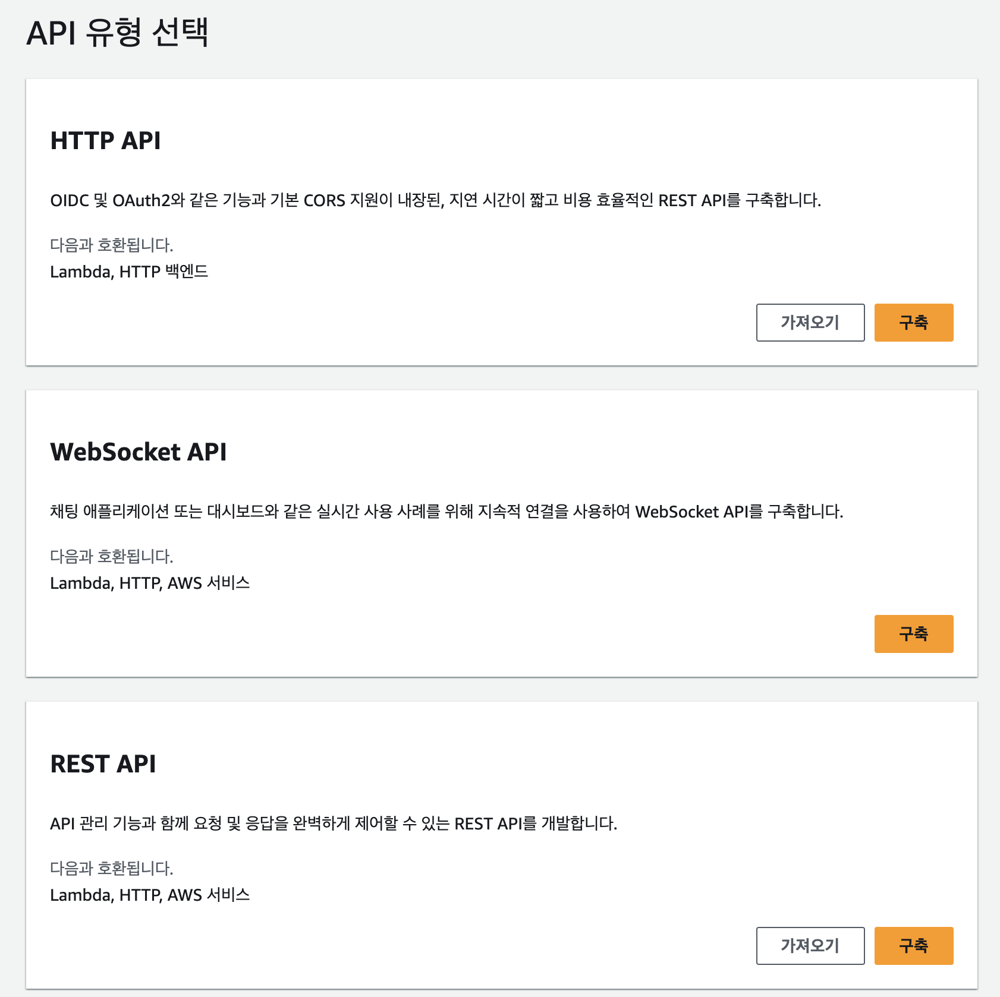

API Gateway 콘솔에서 **WebSocket API**를 선택한다.

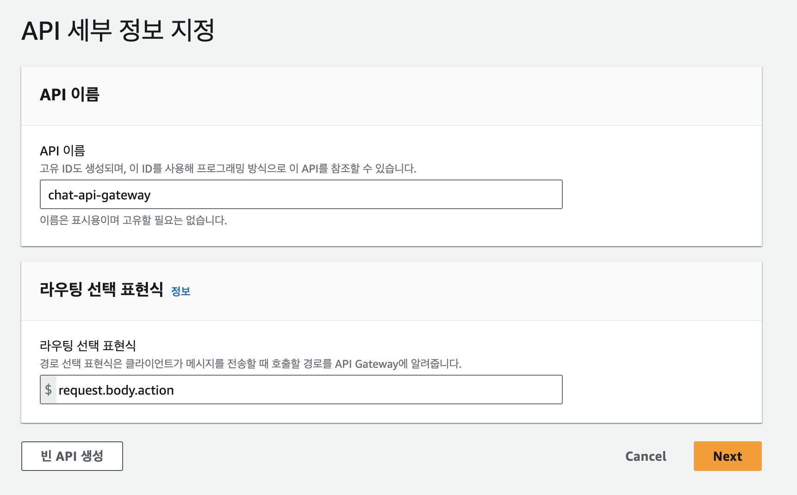

- **API 이름**: 적절한 이름 입력
- **라우팅 선택 표현식**: `request.body.action`

이 표현식은 클라이언트가 보내는 JSON 메시지의 `action` 필드를 기준으로 라우팅을 결정한다는 의미이다.

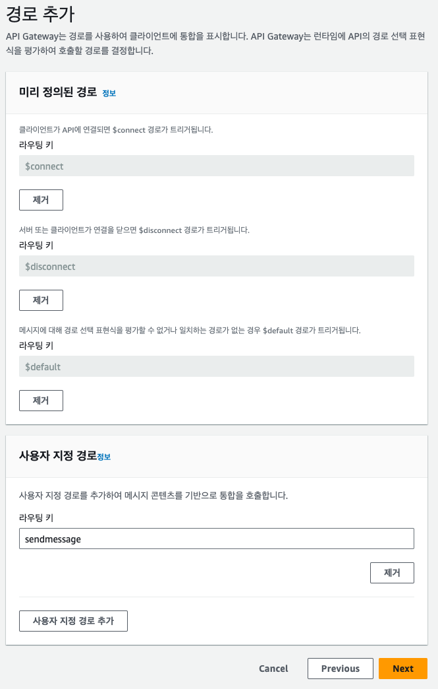

기본 라우트(`$connect`, `$disconnect`, `$default`)를 추가하고, **사용자 지정 경로 추가**를 눌러 `sendmessage`도 추가한다.

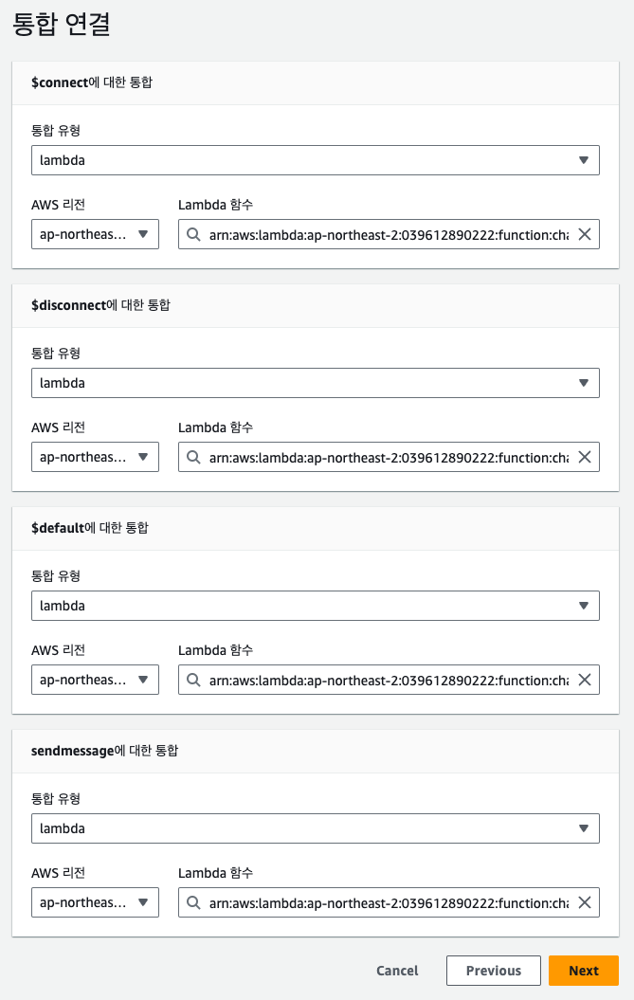

각 라우트에 대응하는 Lambda 함수를 연결한다. 네이밍 컨벤션을 잘 지켰다면 직관적으로 매핑할 수 있다.

- `$connect` -> `chat-lambda-connect`
- `$disconnect` -> `chat-lambda-disconnect`
- `$default` -> `chat-lambda-default`
- `sendmessage` -> `chat-lambda-sendmessage`

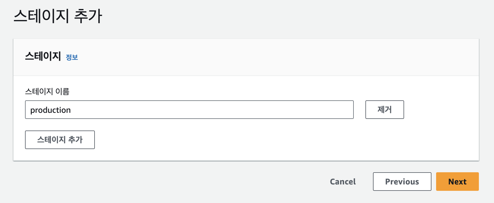

스테이지 이름은 기본값(`production`)을 사용해도 된다.

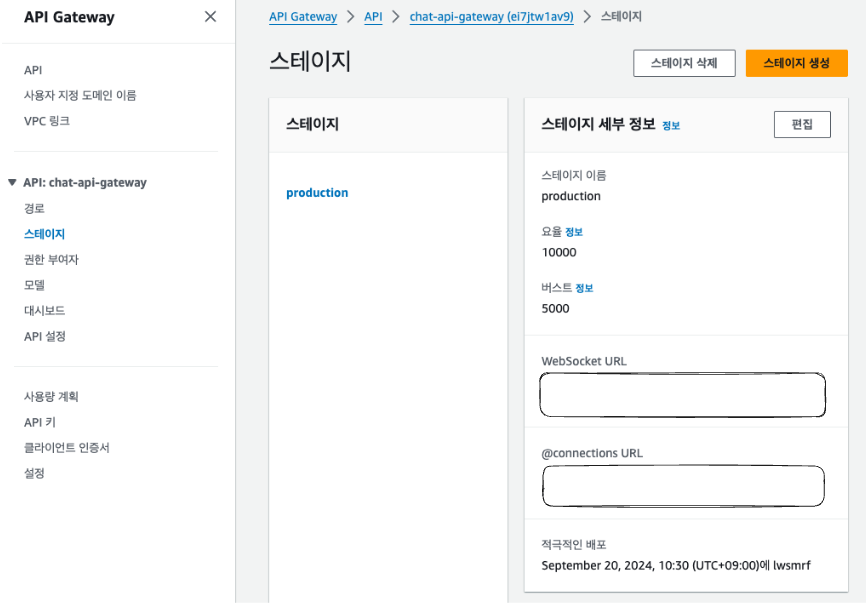

생성이 완료되면 API Gateway 콘솔의 **스테이지** 탭에서 두 가지 URL을 확인할 수 있다.

- **WebSocket URL** (`wss://...`): 클라이언트가 연결할 엔드포인트
- **Connection URL** (`https://...`): Lambda 함수가 내부적으로 사용하는 관리용 엔드포인트

클라이언트 연결에 사용할 **WebSocket URL**을 복사해 둔다.

### Step 5: 클라이언트 통합 및 테스트

채팅 서버 구성이 완료되었다. 이제 `wscat`을 사용하여 WebSocket 서버에 접속하고 테스트한다.

```bash
# wscat 설치
npm install -g wscat
```

API Gateway에서 복사한 WebSocket URL을 사용하여 연결한다.

```bash
# WebSocket 서버에 연결
wscat -c wss://example.execute-api.ap-northeast-2.amazonaws.com/production/
```

메시지를 보낼 때는 JSON 형식으로 `action` 필드와 `message` 필드를 함께 전송한다.

```json
{"action": "sendmessage", "message": "안녕하세요!"}
```

두 개의 터미널을 열어 각각 WebSocket에 연결한 뒤 메시지를 주고받으면 다음과 같은 결과를 확인할 수 있다.

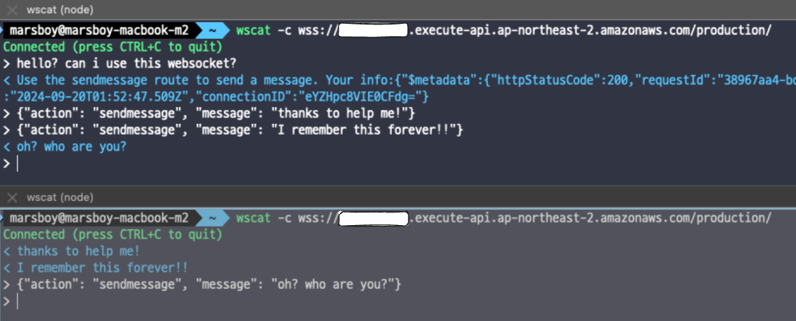

흰색이 본인이 입력한 메시지이고, 파란색이 상대방으로부터 수신한 메시지이다. 실시간으로 메시지가 전달되는 것을 확인할 수 있다.

---

## 4. 분석

### 서버리스 아키텍처의 장단점

#### 장점

- **인프라 관리 불필요**: 서버 프로비저닝, 패치, 스케일링 등을 AWS가 자동으로 처리한다.
- **자동 스케일링**: 연결 수가 증가하면 Lambda가 자동으로 확장되어 트래픽을 처리한다.
- **비용 효율성**: EC2처럼 24시간 과금되는 것이 아니라, 실제 호출 건수와 실행 시간에 대해서만 비용이 발생한다.
- **빠른 개발 속도**: 인프라 설정에 시간을 소비하지 않고 비즈니스 로직에 집중할 수 있다.

#### 단점

- **디버깅의 어려움**: 로컬 환경에서 직접 로그를 확인할 수 없고, CloudWatch를 통해 로그를 조회해야 한다. 터미널에서 바로 보이는 로그에 비해 다소 불편할 수 있다.
- **Cold Start**: Lambda 함수가 일정 시간 호출되지 않으면 콜드 스타트가 발생하여 초기 응답 시간이 길어질 수 있다.
- **연결 제한**: API Gateway WebSocket API는 연결당 최대 2시간의 유휴 시간 제한이 있다.
- **벤더 종속(Vendor Lock-in)**: AWS 서비스에 강하게 의존하게 되어 다른 클라우드로의 마이그레이션이 어려울 수 있다.

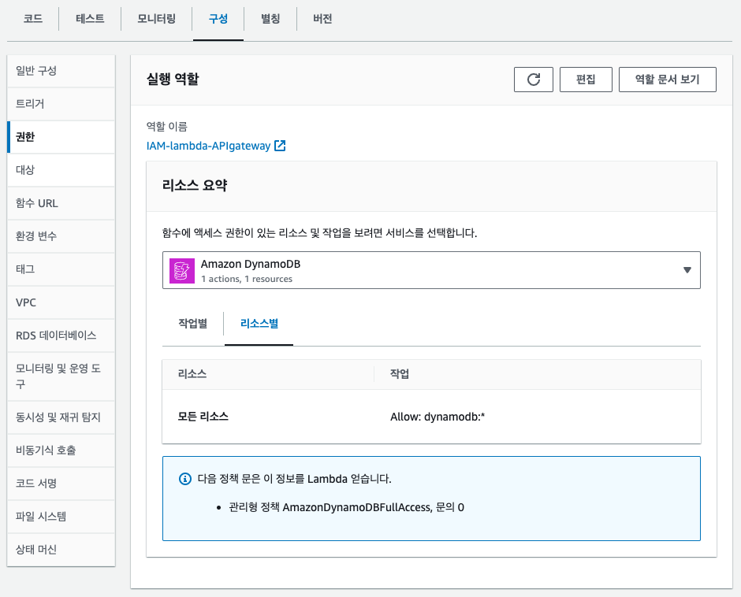

위 스크린샷처럼 FullAccess 정책이 모두 연결된 것을 확인할 수 있다. 프로덕션 환경에서는 반드시 최소 권한 원칙을 적용하여 IAM 정책을 세분화해야 한다.

### 규모별 비용 추정

서버리스 채팅 서버의 비용은 크게 세 가지 서비스의 요금으로 구성된다.

| 서비스 | 과금 기준 | 프리 티어 |
|--------|----------|----------|
| API Gateway (WebSocket) | 메시지 수 + 연결 시간 | 100만 메시지/월 (12개월) |
| Lambda | 요청 수 + 실행 시간 | 100만 요청 + 400,000 GB-초/월 |
| DynamoDB | 읽기/쓰기 용량 단위 | 25 RCU + 25 WCU |

소규모(수십~수백 명)의 채팅 서비스라면 프리 티어만으로도 충분히 운영이 가능하다. EC2 기반으로 동일한 서비스를 운영하는 경우와 비교하면, 트래픽이 적은 시간대에도 인스턴스 비용이 발생하는 EC2보다 서버리스가 훨씬 경제적이다. 다만, 동시 접속자가 수만 명 이상으로 늘어나면 Lambda 호출 비용과 DynamoDB 스캔 비용이 급격히 증가할 수 있으므로, 이 경우에는 전통적인 서버 기반 아키텍처나 DynamoDB 스캔 대신 커넥션 관리 최적화를 고려해야 한다.

### 서버리스 WebSocket이 적합한 경우

서버리스 WebSocket 아키텍처는 다음과 같은 경우에 특히 적합하다.

- **소규모~중규모 실시간 서비스**: 동시 접속자가 수백~수천 명 수준인 경우
- **트래픽 패턴이 불규칙한 서비스**: 특정 시간대에만 사용량이 집중되는 경우
- **MVP 또는 프로토타입**: 빠르게 실시간 기능을 구현하고 검증해야 하는 경우
- **인프라 운영 인력이 제한적인 팀**: 서버 관리에 리소스를 할애하기 어려운 경우

반면, 다음과 같은 경우에는 EC2/ECS 기반의 전통적인 WebSocket 서버가 더 적합할 수 있다.

- **대규모 동시 접속**: 수만 명 이상의 동시 접속이 필요한 경우
- **복잡한 상태 관리**: 서버 측에서 복잡한 세션 상태를 유지해야 하는 경우
- **초저지연 요구사항**: Cold Start가 허용되지 않는 실시간 게임 등

---

## 참고 자료

- [AWS 공식 자습서: WebSocket API, Lambda 및 DynamoDB를 사용하여 WebSocket 채팅 앱 생성](https://docs.aws.amazon.com/ko_kr/apigateway/latest/developerguide/websocket-api-chat-app.html)
- [wscat (npm)](https://www.npmjs.com/package/wscat)
