## Opening: The Minecraft Shader Episode

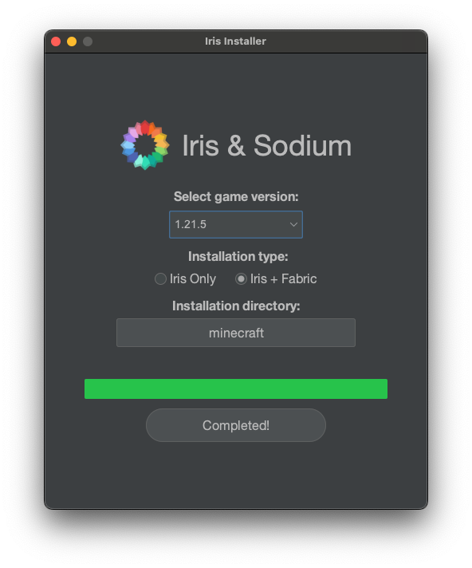

I recently started playing Minecraft with some teammates. Since I'd just bought the supposedly amazing new MacBook M4 Pro, I wanted to install a **shader mod** — a mod that makes Minecraft's graphics look gorgeous. The picture above is the installer for that shader mod.

But here's the thing — I looked it up and **there was no way to install it on MacOS!** Just as I was about to give up in despair, I noticed that the installer file ended with a `.jar` extension. The reason I hadn't even tried installing it on MacOS was that there was no ARM64 version of the installer, so I thought, "Maybe they just don't support MacOS at all?"

Since MacOS is practically a deserted island when it comes to gaming, I figured Mac just wasn't supported. But then it hit me — Minecraft is Java-based, and it uses a `.jar` installer, so... maybe I just need Java installed? I gave it a shot, and oh my god. It just worked. Regardless of what CPU family you're on, all you need is Java.

That's when Java's founding philosophy flashed through my mind: **"Write Once, Run Anywhere."** I'd never liked Java this much before. I actually regretted all those years I'd spent hating it.

This experience naturally raised a question. What exactly is a `.jar` file that it runs regardless of the CPU? Why do some programs require separate downloads for Intel and Apple Silicon, while Java programs just work? The journey to answer these questions is what this post is all about. We'll start with what **builds and compilation** are, then move on to **interpreters**, **JIT compilation**, and finally **CPU architecture**.

---

## 1. Compiler vs Interpreter Basics

### What Is a Build?

First, a **build** is — as the word suggests — the act of constructing something. A build refers to the process (or its result) of converting source code files into standalone software artifacts that can be executed on a computer or phone.

When we run source code, we generally don't execute the source code itself directly. Instead, we run the artifact produced by building that code, and the things that help with this build process are **compilers** and **interpreters**. They transform the code into a level that the computer can understand, and then the computer executes the built code. In other words, when we say **"build"** in programming, we mean the process of turning code into an executable file.

The **"level that a computer can understand"** mentioned above is called **assembly language**.

> In Computer Programming, **assembly language** often referred to simply as assembly and commonly abbreviated as **ASM** or **asm**, is any low-level programming language with a very strong correspondence between the instructions in the language and the architecture's machine code instructions. - **Wikipedia**

**Assembly language** has a one-to-one correspondence with **machine code**. Machine code is — as the name suggests — truly the CPU's language. It's actually made up of 0s and 1s. For example:

```
10110000 01100001
```

This is a **machine code** instruction for an x86 CPU, and when written in **assembly language**, it looks like this:

```asm
mov al, 061h
```

**Assembly language** is still incredibly complex, but at least it's better than staring at raw **machine code**. The problem with machine code is that since it's the CPU's language, it changes every time the CPU changes — and since assembly language maps one-to-one with machine code, it changes too. The idea that your programming language changes every time you switch CPUs... that's just heartbreaking.

To solve this problem, **compilation** was invented. We needed a language system that was closer to human level and more unified. So people started writing source code in languages like C and then **compiling it into assembly to build executables**.

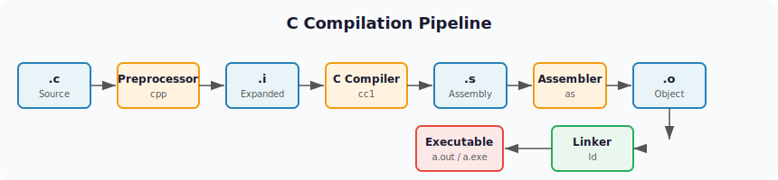

### Compilation

Compilation is the process of **translating the entire source code into machine code at once**.

Languages that get translated directly into assembly in one go include C, C++, and Go. Let's look at the compilation process for the quintessential example, C. As shown in the diagram above, a `.c` source file gets converted into a `.i` file through preprocessing, then the C Compiler converts it to assembly, and the Assembler converts that into machine code.

The key point here is that **to execute C code, it gets converted to assembly, and then to machine code**. Here's a summary of the pros and cons of compilation:

**Pros**
- **Great performance:** Since it executes pre-compiled machine code, performance tends to be excellent.
- **Easy error detection:** The compiler can detect errors during the compilation process.

**Cons**
- **Increased development time:** It takes time to write and compile code. You also need to recompile after making changes, which can make the development process cumbersome.
- **Platform-dependent:** Programs written in compiled languages are tied to specific platforms, reducing portability. (Compiling C with gcc on Windows produces an `a.exe` file, while on Mac it produces `a.out`.)
- **Large file sizes:** Compiled executables can be large, and the compilation process consumes significant memory.

### Interpretation

Interpretation is **translating and executing source code one line at a time**.

Representative interpreted languages include JavaScript, Python, and Ruby. Honestly, it's hard to call any of these 100% interpreted languages. It's not that there's zero compilation involved — I'll explain this when we look at how JavaScript runs.


**JavaScript** is, to put it simply, an object-based scripting programming language used within web browsers. The thing that helps execute JavaScript is called the **V8 engine**.

The **V8 engine** is a high-performance JavaScript and web engine written in C++, led by Google. It's built into Google Chrome. Node.js — which lets you run JavaScript on its own rather than in a browser alongside HTML and CSS — also uses the V8 engine to execute JavaScript.

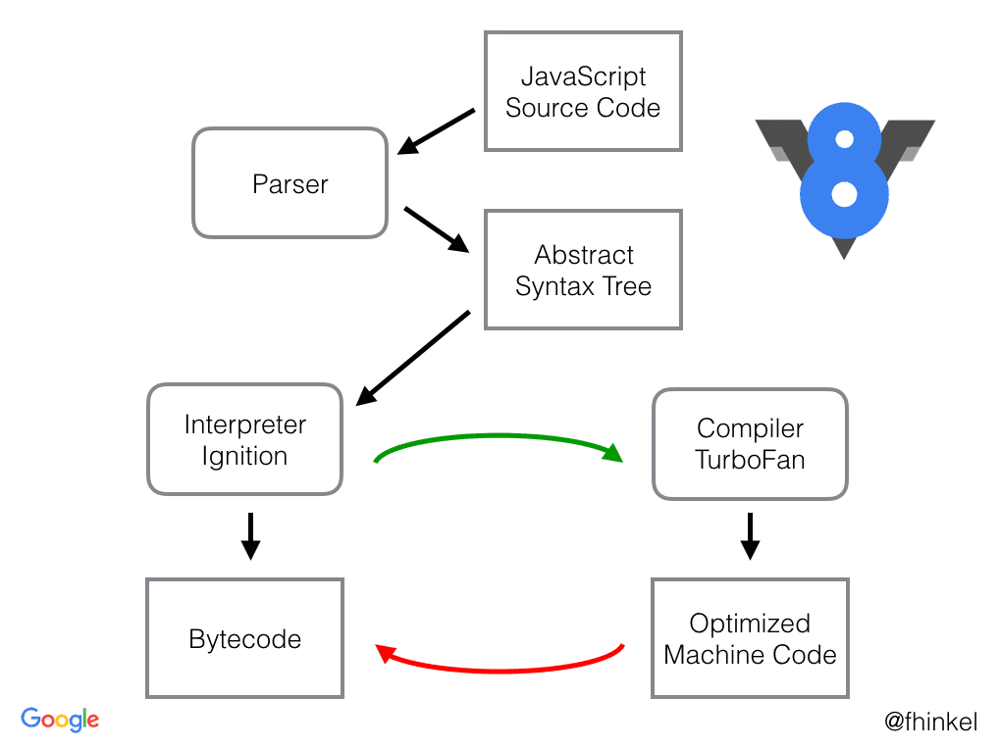

Just like the C compilation process, the individual steps (Parser, Syntax Tree, etc.) are complex in how they work. Looking at the big picture, JavaScript is first **compiled into JavaScript bytecode, then executed line by line through an interpreter**. The reason it's hard to call it a 100% interpreted language is that there is a compilation step involved — but here, the interpreter translates the bytecode into machine code and executes it on the fly.

**Pros**
- **Fast development:** Since it runs source code directly, you can quickly modify and test your code.
- **Good portability:** Generally platform-independent. (Though you do need to install the appropriate interpreter for your platform.)
- **Dynamic type system:** Most interpreted languages use dynamic typing, allowing for flexible and convenient coding.

**Cons**
- **Lower performance:** Generally slower than compiled languages.
- **Delayed error discovery:** Since there's no compilation step, errors are only caught at runtime.

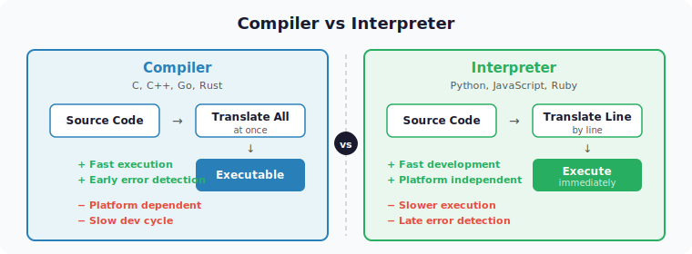

### Hybrid: Java's Approach

The hybrid approach **combines compilation and interpretation**.

The most representative hybrid language is Java. For Java code to run on multiple different CPUs, it needs a different execution model from C/C++. C/C++ directly generates machine code for a specific CPU, which gets loaded into memory and executed directly. So when the CPU changes, the compiler has to change too.

But Java cannot directly generate CPU-specific machine code if it wants the same code to run on different CPUs. Instead, Java generates something called **bytecode (Java bytecode)**, which is then interpreted and executed by the **Java Virtual Machine (JVM)**. By having the JVM act as an interpreter, the same bytecode can run on many different CPUs.

Java source code has the `*.java` extension. Obviously, the CPU can't understand it directly, so it needs to go through a build process to become executable. When you install the **JDK (Java Developer Kit)**, the `javac.exe` inside it compiles `.java` files into `.class` files. These `.class` files become Java **bytecode**.

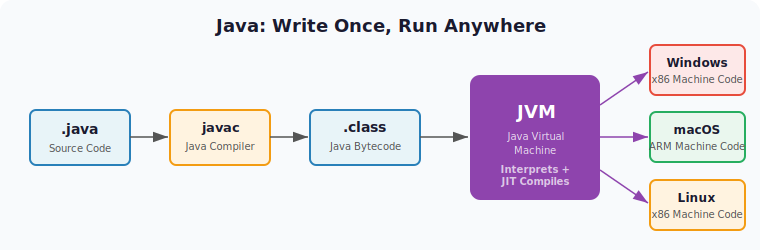

In other words, the same `.class` bytecode can run on **any platform** where a JVM is installed.

Because `.class` files can be recognized by the JVM, this structure is why Java is called a hybrid language — and it overcomes the platform dependency that was a drawback of compiled languages. This is exactly why that `.jar` file for the Minecraft shader just worked on my ARM Mac.

---

## 2. Deep Dive: JIT Compilation and the Interpreter/Compiler Spectrum

In the basics section, we looked at compilers, interpreters, and the hybrid approach. But in reality, programming languages can't be neatly categorized as "this is a compiler language, that's an interpreter language." It's more accurate to think of interpreters and compilers as a **spectrum**.

### How Binary Files Are Executed

In general terms, if the build output is a binary file, people say "this is a compiled language!" — and that's true for C and Go. But even the process of machine code being decoded and executed inside the CPU could be considered a form of interpreting. That's because different CPU architectures interpret the same machine code differently under the hood.

**An interpreter reads and executes source code one piece at a time.** **A compiler merely produces an executable binary — it doesn't execute it.** If you look at how a binary file actually runs, couldn't you argue that this process is a form of interpreting?

Let's look at how a binary file gets executed.

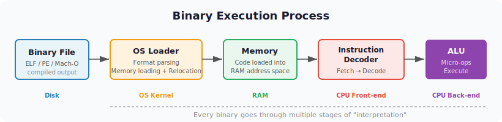

**1. The Loader's Role**
- The OS loads the binary file into memory
- Parses executable file formats like ELF (Linux), PE (Windows), Mach-O (macOS)
- Performs memory address relocation and dynamic linking

**2. CPU-Level Interpretation**
- Binary instructions pass through the CPU's instruction decoder and are broken down into micro-operations
- For example, an x86 instruction like `ADD EAX, EBX` becomes the binary `01 D8` (2 bytes). The instruction decoder interprets this and the ALU performs the actual addition

**3. Microarchitecture Level**
- Complex CISC instructions (x86) are internally converted into multiple RISC-style micro-operations
- This conversion happens in real-time inside Intel and AMD CPUs

You can see that there are multiple stages of **"interpretation"** in the process of executing a binary file. From this perspective, even a binary produced by a C compiler ends up being **"interpreted"** by the OS loader and the CPU.

### JIT (Just-In-Time) Compilation

Even Python is internally compiled to bytecode. There's also a technique called **JIT (Just-In-Time) compilation**. If you run a `.py` source file not with `python` but with a runtime called `pypy`, it partially compiles code using JIT, resulting in significantly faster execution.

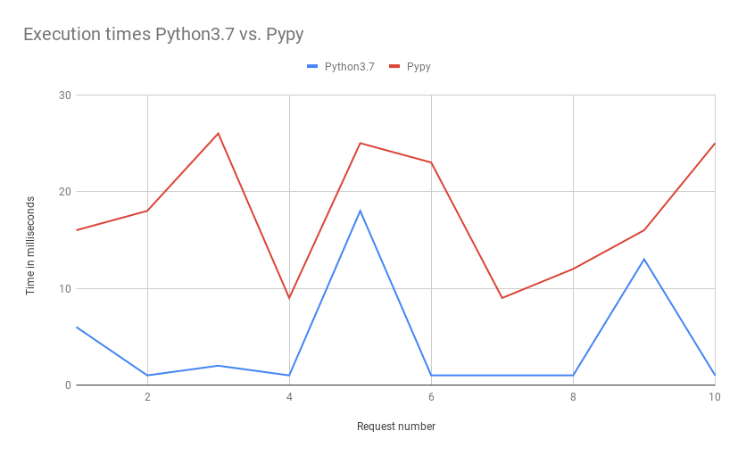
*https://www.ulrich-scheller.de/a-pypy-runtime-for-aws-lambda/*

On Baekjoon (a competitive programming judge), there are cases where source code that times out when run with Python passes when run with PyPy. Node.js also uses JIT through the V8 engine. It starts by interpreting, then JIT-compiles frequently used code.

### The Interpreter and Compiler Spectrum

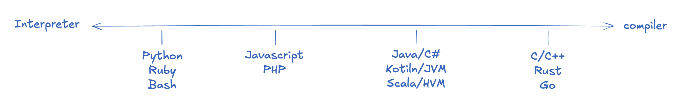
*The interpreter/compiler spectrum of programming languages*

Even languages that sit right next to the compiler end of the spectrum have a bit of interpreting going on when you consider the machine code conversion at the CPU level. And languages like Python do have an internal step that converts to bytecode, though it's not as significant compared to other languages. So even languages that sit right next to the interpreter end also have a bit of compilation involved.

Here's why each representative language sits where it does, from left to right:

- **Python:** When you run a `.py` file with `python3`, it executes the source code as-is.
- **JavaScript:** When you run a `.js` file with `node`, it also executes the source code directly, but because it has employed aggressive JIT compilation strategies and immediate execution optimizations from the start, its compilation footprint is larger than Python's.
- **Java/C#:** Both Java and C# are converted to platform-independent intermediate representations (Java bytecode, IL), which are then interpreted on virtual machines — the JVM and CLR, respectively.
- **C/C++:** Compiled down to binary files that can be executed directly by the OS, with the rest being interpreted according to the OS to control the machine code.

So where would PyPy fit on this spectrum? Based on the above, it would probably be somewhere between Python and JavaScript. The more aggressive the JIT, the further right it moves, and the better the performance. Conversely, languages further left on the interpreter side tend to be easier to use and allow for faster development. If you start a server with `node` and use the `--watch` option to restart whenever the source code changes, you can test your changes almost instantly.

Let's also look at some data comparing programming language performance.

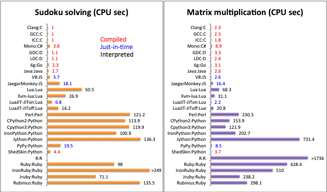
*Execution speed comparison by programming language — compiled languages tend to be faster*

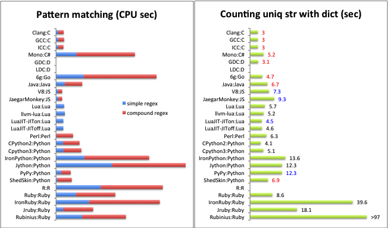
*Execution time comparison when implementing the same algorithm in different languages*

---

## 3. ARM vs x86 Architecture

Earlier, we discussed how binaries produced by compilers differ depending on the CPU. So how exactly do CPU architectures differ?

While installing software and building Docker images, I kept having to specify ARM or AMD settings, and I sometimes forget which is which. They look similar, and I've accidentally entered the wrong one before.

Here's how the architectures of CPU companies can be organized:

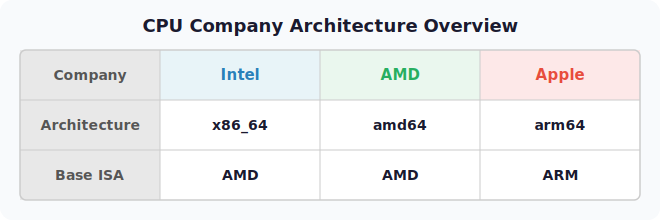

The key takeaway is that **Intel and AMD are in the AMD (x86) family, while Apple is in the ARM family**. So the difference between Intel and AMD CPUs is like the difference between Seoul and Busan dialects, but the difference between AMD and ARM is practically a foreign language — they're simply not compatible.

Every CPU has different machine code. So no matter what code you write, the machine code conversion differs depending on the architecture. Since Intel and AMD have historically evolved together, they're grouped under the AMD family and are sometimes referred to as **x86_64/amd64** as a single label.

### AMD (x86): A Brief History

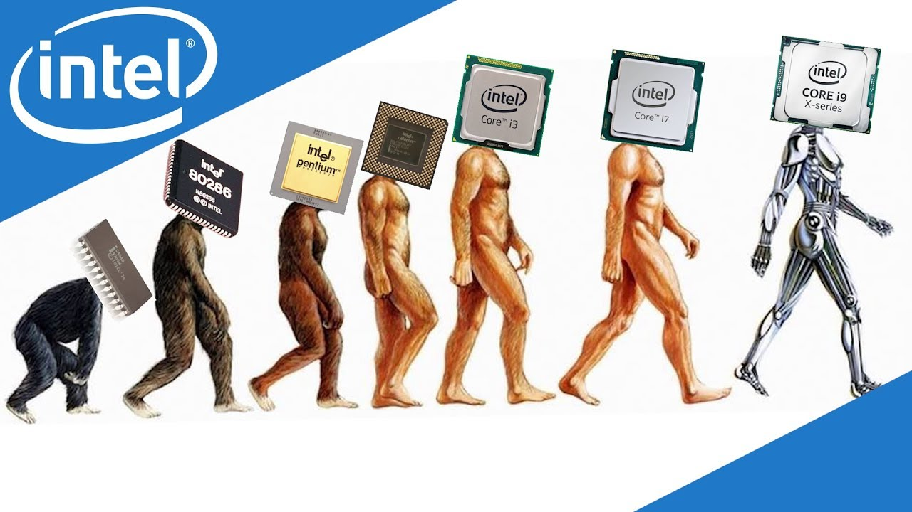
*https://www.youtube.com/watch?v=TqOCC65HkCQ*

**AMD (Advanced Micro Devices)** was founded in 1969 and predates ARM. It served as a **second-source supplier for Intel starting in the 1970s**, then began developing its own processors **in the 1990s** and **announced the AMD64 (x86-64) architecture in 2003**.

A major characteristic of AMD is that it uses the **CISC** approach. **CISC stands for Complex Instruction Set Computer**.
- Complex and diverse instruction sets
- A single instruction can handle multiple operations simultaneously
- Good for complex computations, but consumes more power

### ARM's Journey

**ARM** started in the UK in 1990 and originally stood for **Acorn RISC Machine**. What makes ARM unique is that it doesn't manufacture chips itself — it only licenses its designs. **In the 2010s**, it began dominating the smartphone market, and **in the 2020s, it expanded into desktops and laptops**, gaining massive popularity. **Apple Silicon** is a prime example.

ARM uses the **RISC** approach. **RISC stands for Reduced Instruction Set Computer**.
- Simple and efficient instruction sets
- Each instruction performs only one operation at a time
- Simpler hardware leads to higher power efficiency

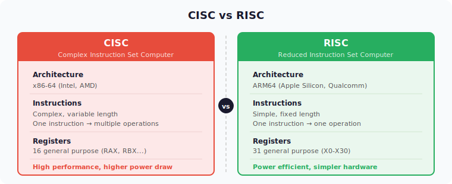

### Register Structure Comparison

**x86-64**
- 16 general-purpose registers (RAX, RBX, RCX, etc.)
- Relatively few, but compensated by complex instructions

**ARM64**
- 31 general-purpose registers (X0-X30)
- More registers mean fewer memory accesses
- Enables efficient data processing

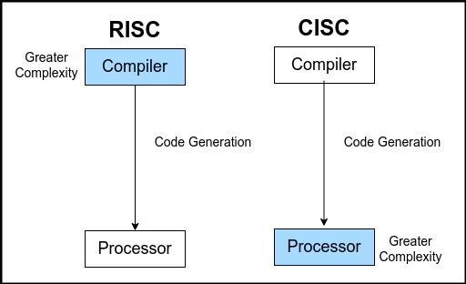
*https://www.tothenew.com/blog/x86-or-arm64-making-sense-of-the-architectural-variations/*

Generally speaking, **ARM wins in power efficiency**, and it has naturally been expanding its market share starting from mobile, where power efficiency matters most. With the arrival of the MacBook M1 and the successive M2, M3, and M4 chips, ARM has been taking over the desktop and laptop markets alongside the Mac Mini.

But every technology has its trade-offs. While x86 does consume more power, **it still has the edge in areas that demand raw performance (gaming, high-performance computing, etc.)**.

There are practical reasons too. AMD (x86), which entered the CPU market back in the 1970s, has weathered every storm imaginable. Technical complexity accumulated through the 16-bit to 32-bit to 64-bit transitions, and because backward compatibility has been maintained all the way back to the 8086 from 1978, design decisions from 40 years ago are still holding it back today. ARM, by contrast, is a supernova — it started with a clean-slate design, aligned with the demands of the mobile era, and arrived at a time when power efficiency is becoming increasingly important.

### Real-World Differences

#### Installer Platforms

If you use a Mac, you've probably seen various options when downloading software. You're asked to choose between **Intel Mac (x86 or AMD)** and **Apple Silicon (M chip or ARM64)**.

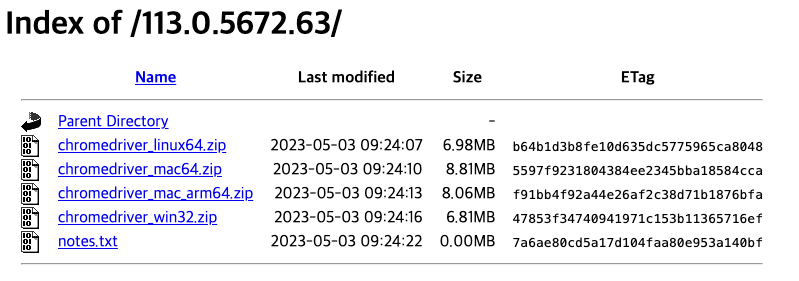
*chromedriver download page*

As shown above, the chromedriver installer comes in multiple versions. This is, of course, because **different CPUs use completely different machine code**. So you always need to choose the installer that matches your platform.

#### Rosetta and Docker Multi-Platform Builds

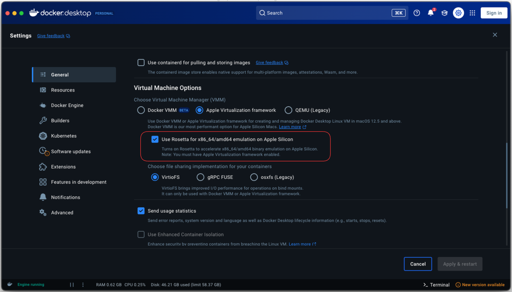
*Emulation*

Looking back at Docker's long history, people used to download a guest OS on top of the host OS to improve the hypervisor setup. Docker solved the OS dependency problem — any Docker image runs fine on the Docker Engine. But CPU dependency was inescapable. That's why you can specify AMD or ARM architecture using the `--platform` parameter when building with Docker.

In particular, if you're using ARM, you can use an emulator called **Rosetta** to run x86_64/amd64 architecture. Sure, there's an overhead from emulation that hurts performance, but it's not bad.

---

## Wrapping Up

A single `.jar` file from a Minecraft shader mod led to quite a long journey. Here's a summary:

1. **Builds and Compilation:** The process of transforming source code into a form that computers can understand. Compilers translate everything at once, while interpreters translate one line at a time.
2. **JIT Compilation and the Spectrum:** Real-world languages can't be neatly divided into compilers and interpreters. Technologies like JIT are pushing interpreter languages further into compilation territory.
3. **ARM vs x86:** Machine code is completely different depending on the CPU architecture. ARM (RISC) excels at power efficiency, x86 (CISC) at raw performance, and Java's "Write Once, Run Anywhere" overcomes this difference through the JVM.

Ultimately, the common thread running through all of this is **abstraction**. Compilers and virtual machines hide the differences in machine code, and runtimes like the JVM bridge the gaps between CPU architectures. As technology advances, these abstraction layers become more sophisticated, allowing developers to solve problems at ever higher levels.

Personally, I think viewing programming languages on a spectrum rather than rigidly categorizing them as compiled or interpreted better reflects reality. The charm of Java that I felt during that Minecraft shader installation experience is ultimately because it occupies just the right spot on that spectrum — compiled to bytecode for performance, yet maintaining platform independence on top of the JVM.

### References

- **Wikipedia:** Assembly language, C, V8, Software build, Java
- **Stranger's LAB:** [Programming Languages and the Build Process](https://st-lab.tistory.com/176)
- **Evans Library:** [How Does the V8 Engine Execute My Code?](https://evan-moon.github.io/2019/06/28/v8-analysis/)
- **Aljjabaegi Programmer:** [Java Compilation Process, JVM Memory Structure, and JVM GC Explained Simply](https://aljjabaegi.tistory.com/387)
- **attractivechaos:** [Programming Language Benchmark](https://attractivechaos.github.io/plb/)
