인프라를 공부하다 보면 Docker라는 기술을 빠짐없이 만나게 된다. 이 글에서는 Docker를 왜 쓰는지부터 시작해서, Dockerfile 작성법, CMD와 ENTRYPOINT의 차이, 멀티 스테이지 빌드를 통한 이미지 경량화, 환경 변수 관리 전략, 그리고 BuildKit과 GitHub Actions를 활용한 CI/CD까지 -- 컨테이너 기반 개발에 필요한 핵심 내용을 하나의 글로 정리한다.

## 왜 Docker인가?

### Docker가 해결하는 문제

어떤 프로그램을 다운로드하는 과정을 생각해 보자. 예를 들어 Redis를 설치한다면 다음과 같은 과정을 거치게 된다.

1. Redis 인스톨러 다운로드
2. 인스톨러 실행
3. 프로그램 설치 완료 및 구동

단순해 보이지만, 이 과정에는 수많은 위험 요소가 숨어 있다. Mac은 `.dmg`, Windows는 `.exe` 파일 확장자를 가진 인스톨러를 사용하며 운영체제마다 인스톨러가 다르다. Mac에서 `.dmg` 파일을 실행하면 `wget`을 필요로 하는데, 일반적으로 `wget`이 없기 때문에 설치 과정에서 에러가 발생하기도 한다.

Docker를 사용하면 이 과정이 한 줄로 줄어든다.

```bash
docker run -it redis
```

이 명령어 하나로 Redis의 설치와 실행이 완료된다. Docker의 가장 큰 장점은 **어떤 프로그램을 다운로드하는 과정을 간단하게 만들어 준다**는 것이다.

### 컨테이너란 무엇인가

> Docker는 컨테이너를 사용하여 응용 프로그램을 더 쉽게 만들고 배포하고 실행할 수 있도록 설계된 도구이며, 컨테이너 기반의 오픈소스 가상화 플랫폼이자 생태계이다.

컨테이너는 다양한 프로그램과 실행 환경을 추상화하고, 동일한 인터페이스를 제공하여 프로그램의 배포 및 관리를 단순하게 해준다. AWS, Azure, Google Cloud 등 어떤 클라우드 서비스에서도 동일하게 작동한다.

하나의 컨테이너 안에 모든 프로그램을 넣는 것은 좋은 설계가 아니다.

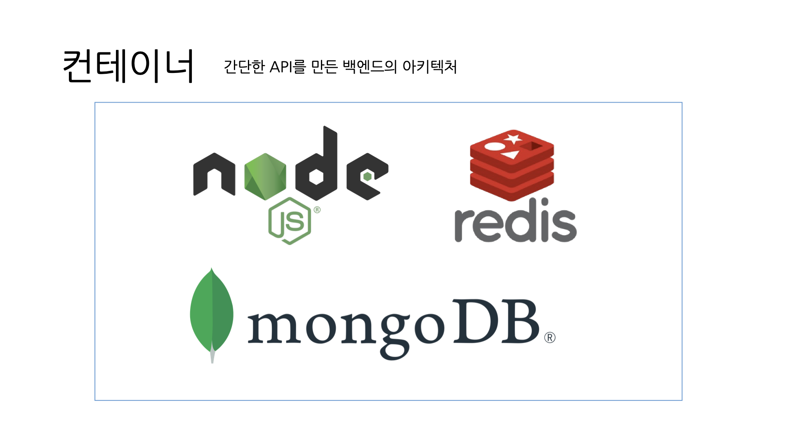

위 구조처럼 컨테이너 안에 여러 프로그램이 실행되고 있으면, 한 프로그램에 문제가 생겨 컨테이너가 다운되었을 때 원인을 찾기 어렵고, 특정 서버를 재시작하면 다른 서버까지 영향을 받는다.

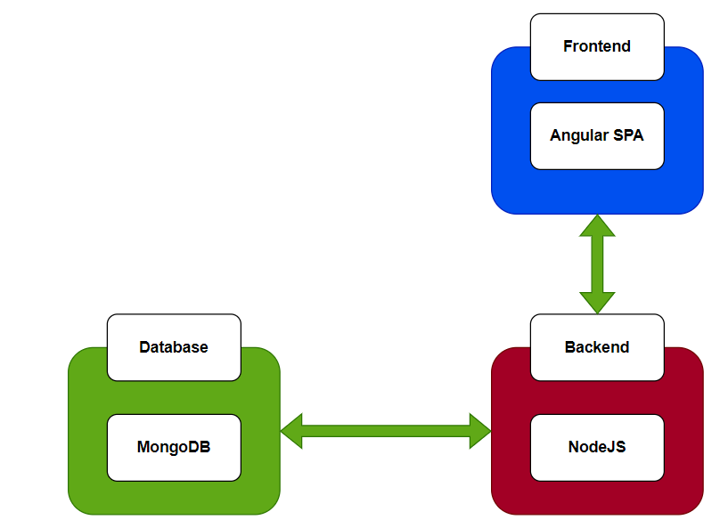

컨테이너 하나에 하나의 프로그램을 실행하면, 컨테이너의 관리가 훨씬 편해진다. Kubernetes 같은 오케스트레이션 도구를 함께 사용하면 강력한 운영 시스템을 구축할 수 있다.

### 이미지란

> 컨테이너 이미지는 코드, 런타임, 시스템 도구, 시스템 라이브러리 및 설정과 같은 응용 프로그램을 실행하는 데 필요한 모든 것을 포함하는 가볍고 독립적이며 실행 가능한 소프트웨어 패키지이다.

핵심은 **도커 컨테이너는 이미지의 인스턴스**라는 것이다. 이미지에 쓰여있는 내용대로 실행하면 컨테이너가 만들어진다. `docker run -it redis` 명령어의 원리는 Redis **이미지를 통해 컨테이너를 만드는 것**이다.

Redis, MongoDB, PostgreSQL 등 잘 알려진 프로그램들의 이미지는 이미 [Docker Hub](https://hub.docker.com/)에 올라와 있어 그대로 가져다 쓰면 된다. 직접 만든 서버는 Dockerfile이라는 스크립트를 작성하여 이미지로 만들어야 하며, 이 과정을 **도커라이징(Dockerizing)**이라고 한다.

### 컨테이너 vs VM: 하이퍼바이저 기반 가상화와의 차이

기존의 가상화 기술인 하이퍼바이저는 가상 머신(VM)을 생성하고 실행하는 프로세스이다.

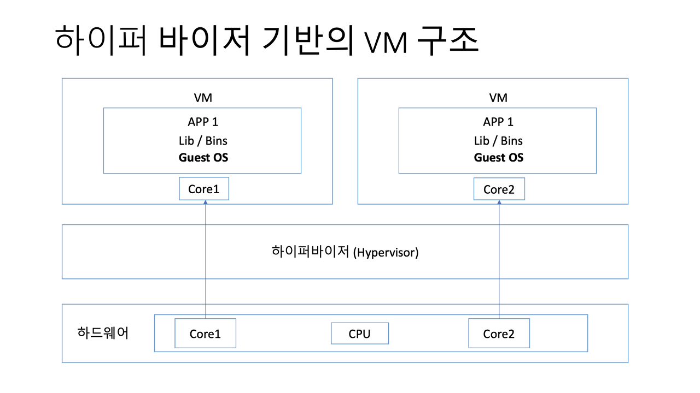

하이퍼바이저 구조에서는 하드웨어의 일부를 각 VM에 할당하면서 게스트 OS까지 포함시킨다. 트래픽이 증가하면 하드웨어 리소스(CPU, 메모리, 디스크)를 추가하고 서버를 재시작해야 하는데, 이는 **버티컬 스케일링(Vertical Scaling)**이라 부른다.

이러한 방식에는 다음과 같은 단점이 있다.

1. **리소스 오버헤드** : 하드웨어와 VM 사이의 중간 계층으로 인한 리소스 낭비
2. **긴 부팅 시간** : 가상 머신을 시작하는 데 컨테이너보다 오래 걸림
3. **리소스 관리 복잡성** : 하드웨어 차원에서 접근해야 하므로 관리가 어려움
4. **스케일링의 어려움** : VM은 무겁고 느리기 때문에 확장이 어려움

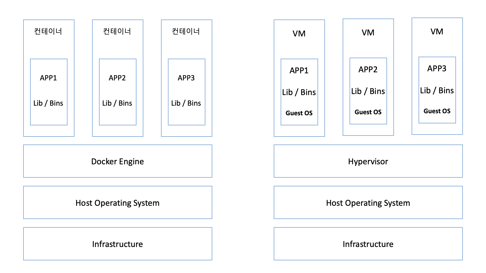

반면 컨테이너는 가상화보다 가볍고 빠르다. 이미지를 통해 컨테이너의 개수를 늘리고, 트래픽을 여러 컨테이너에 분산시키는 방식을 사용한다. 서버를 수평적으로 확장하므로 **호라이즌탈 스케일링(Horizontal Scaling)**이라고 부른다.

<!-- TODO: 다이어그램 필요 - 컨테이너 vs VM 아키텍처를 나란히 비교하는 깔끔한 다이어그램 -->

## Dockerfile 작성법

컨테이너를 만들기 위해서는 먼저 이미지가 필요하고, 이미지를 만들기 위해서는 Dockerfile을 작성해야 한다. Dockerfile에 쓰여있는 대로 명령을 실행하면서 이미지가 만들어진다.

### 기본 명령어

Dockerfile에서 사용하는 주요 명령어는 다음과 같다.

| 명령어 | 설명 |
|--------|------|
| `FROM` | 기본 이미지를 지정. 이 이미지를 기반으로 새 이미지를 생성한다. |
| `RUN` | 컨테이너 내에서 실행할 명령. 패키지 설치 등에 사용한다. |
| `COPY` | 로컬 파일을 컨테이너 내로 복사한다. |
| `WORKDIR` | 이후 명령이 실행될 작업 디렉토리를 지정한다. |
| `ARG` | 빌드 시간에 사용되는 변수를 정의한다. |
| `ENV` | 환경 변수를 설정한다. |
| `EXPOSE` | 컨테이너가 리스닝할 포트를 지정한다. |
| `CMD` | 컨테이너가 시작될 때 실행할 기본 명령을 지정한다. |
| `ENTRYPOINT` | 컨테이너가 시작될 때 반드시 실행할 명령을 지정한다. |

### Node.js 프로젝트의 Dockerfile

Node.js 기반 프로젝트의 Dockerfile 예시를 살펴보자.

```dockerfile
FROM node:18-alpine

WORKDIR /app

COPY . /app/

RUN yarn install

CMD ["tsc", "scraper.ts"]
```

각 줄의 의미는 다음과 같다.

1. **FROM node:18-alpine** : Node 18 버전의 경량 이미지를 기반으로 진행한다.
2. **WORKDIR /app** : 이후 명령어가 `/app` 디렉토리에서 실행된다.
3. **COPY . /app/** : 현재 디렉토리의 모든 파일을 `/app`으로 복사한다.
4. **RUN yarn install** : `package.json`과 `yarn.lock`을 읽고 의존성을 설치한다.
5. **CMD ["tsc", "scraper.ts"]** : TypeScript 파일을 빌드한다.

### .dockerignore로 불필요한 파일 제외하기

위 Dockerfile에서 `COPY . /app/`을 하면 `node_modules`까지 통째로 복사된다. 이미 `RUN yarn install`로 새로 설치할 것이므로 불필요하다. 이 문제는 `.dockerignore` 파일로 해결한다.

> `.dockerignore`는 Dockerfile로 이미지를 빌드할 때 어떤 파일을 제외시킬 것인지 명시하는 파일이다.

```text
.idea
node_modules
.gitignore
README.md
```

`.gitignore`가 Git에서 불필요한 파일을 제외하듯, `.dockerignore`는 Docker 빌드 컨텍스트에서 불필요한 파일을 제외한다. 프로덕션 환경에서 필요 없는 `README.md`, `.gitignore` 등의 파일도 함께 제외하는 것이 좋다.

### Spring Boot 프로젝트의 Dockerfile

Java/Kotlin 기반 프로젝트의 Dockerfile은 조금 다른 패턴을 따른다.

```dockerfile
FROM openjdk:17

WORKDIR /apps

COPY build/libs/*.jar app.jar

EXPOSE 8080

CMD ["java", "-jar", "app.jar"]
```

Node.js 예시와 달리, 여기서는 이미 빌드된 `.jar` 파일만 복사하여 실행한다. Java 계열 언어는 빌드하면 `.jar` 파일이 생성되므로, 로컬에서 먼저 빌드한 후 Dockerfile을 통해 이미지를 만들어야 정상 동작한다.

### Python 프로젝트의 Dockerfile

Python의 경우는 더 간단하다. 빌드 과정 없이 바로 실행할 수 있기 때문이다.

```dockerfile
FROM python:3.10

WORKDIR /app

COPY main.py /app/

CMD ["python3", "main.py"]
```

이 이미지를 통해 컨테이너를 만들자마자 `main.py`가 바로 실행된다.

## CMD vs ENTRYPOINT

Dockerfile을 처음 접하면 `CMD`와 `ENTRYPOINT`의 차이를 잘 모르고 대충 사용하게 된다. 하지만 이 두 명령어를 제대로 이해하면 확장 가능한 Docker 이미지를 설계할 수 있다.

Dockerfile reference에 따르면 두 명령어의 역할은 다음과 같다.

- **ENTRYPOINT** : 컨테이너 내에서 실행되는 프로세스 (executable)
- **CMD** : ENTRYPOINT 프로세스에 제공되는 기본 인수 집합 (commands)

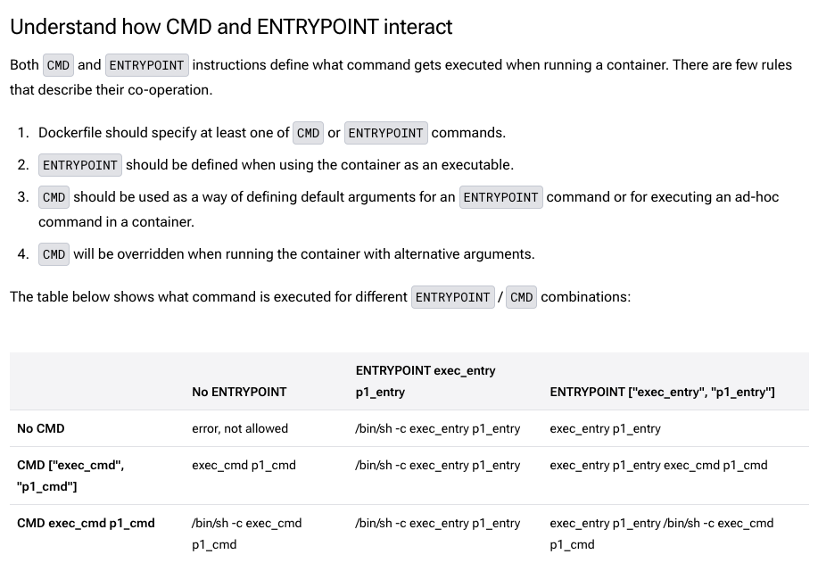

### CMD - 기본 명령 지정

CMD는 도커 이미지를 실행할 때 **어떤 기본 명령이나 인자를 줄 것인가**를 정의한다. 중요한 점은, ENTRYPOINT를 지정하지 않으면 기본적으로 `/bin/sh`가 실행된다는 것이다.

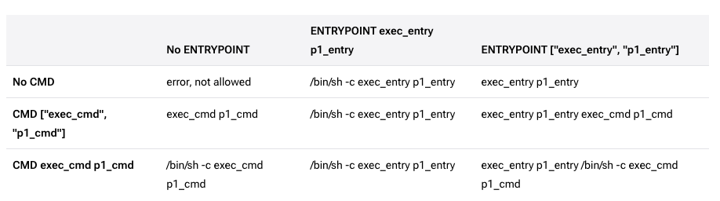

#### exec 형식 (JSON 배열)

쉘을 사용하지 않고 명령어를 직접 실행하는 방식이다. 쉘 특성(파이프, 리다이렉션 등)을 사용할 수 없다.

```dockerfile
FROM alpine:latest
CMD ["echo", "hello"]
```

이 이미지를 실행하면 `hello`가 출력된다. 하지만 다음과 같이 리다이렉션을 시도하면 의도대로 동작하지 않는다.

```dockerfile
FROM alpine:latest
CMD ["echo", "hello", ">", "app.py"]
```

실행 결과는 `hello > app.py`라는 문자열이 그대로 출력된다. exec 형식은 쉘을 거치지 않기 때문에 `>`, `|`, `&&` 등의 쉘 문법을 사용할 수 없다.

#### shell 형식 (일반 문자열)

일반 문자열로 작성하면 앞에 `/bin/sh -c`가 자동으로 붙어 쉘 기능을 사용할 수 있다.

```dockerfile
FROM alpine:latest
CMD echo hello > app.py
```

이 경우 `hello`라는 문자열이 `app.py` 파일에 정상적으로 저장된다. 쉘에서 사용하는 파이프, 변수, 리다이렉션 등의 문법이 모두 동작한다.

### ENTRYPOINT - 실행 파일 지정

ENTRYPOINT는 CMD보다 한 층 낮은 레벨로, 컨테이너가 실행될 때 **반드시 실행되어야 하는 명령**을 정의한다. 핵심적인 차이점은 **ENTRYPOINT는 덮어쓰기가 불가능하지만, CMD는 가능하다**는 것이다.

ENTRYPOINT를 shell 형식으로 사용하면 CMD가 무시되는 예상치 못한 동작이 발생할 수 있다. 따라서 JSON 형식으로 작성하는 것이 권장된다.

```dockerfile
FROM alpine:latest
ENTRYPOINT ["echo","entry"]
CMD ["echo","cmd"]
```

위 이미지를 실행하면 `entry echo cmd`가 출력된다. ENTRYPOINT 뒤에 CMD가 인자로 이어붙는 것이다.

### 확장 가능한 이미지 설계

ENTRYPOINT와 CMD를 조합하면 확장 가능한 이미지를 만들 수 있다. 핵심은 CMD를 덮어쓸 수 있다는 점이다.

```dockerfile
FROM alpine:latest
ENTRYPOINT ["echo"]
CMD ["default message"]
```

기본 실행시에는 CMD에 지정한 기본값이 사용된다.

```bash
$ docker run my-image
default message
```

인자를 넣으면 CMD가 덮어써진다.

```bash
$ docker run my-image "custom message"
custom message
```

#### docker-compose에서 파라미터 주입

```yaml
version: '3'
services:
  echo-service:
    build: .
    command: ["this is docker-compose"]
```

`command` 옵션으로 CMD를 덮어쓸 수 있다.

#### Kubernetes에서 파라미터 주입

```yaml
apiVersion: v1
kind: Pod
metadata:
  name: echo-pod
spec:
  containers:
    - name: echo-container
      image: echo-test-image:latest
      args: ["this is from kubernetes"]
  restartPolicy: Never
```

Kubernetes에서는 `args`로 CMD를 덮어쓸 수 있다. `command` 옵션으로 ENTRYPOINT를 변경할 수도 있지만, 베스트 프랙티스 관점에서 CMD만 `args`로 바꾸는 것이 안전하다.

정리하면, **컨테이너 실행 로직을 ENTRYPOINT로 고정하고, 디폴트 동작을 CMD로 설정**한다. 이렇게 하면 Kubernetes나 docker-compose 같은 오케스트레이션 환경에서 유연하게 런타임 파라미터를 주입할 수 있다.

### CMD가 안 먹힐 때 트러블슈팅

다음과 같이 CMD를 작성하면 제대로 동작하지 않는다.

```dockerfile
CMD ["tsc", "main.ts", "&&", "node", "main.js"]
```

exec 형식은 쉘을 사용하지 않기 때문에 `&&` 같은 쉘 연산자를 인식하지 못한다. 이 경우 해결 방법은 두 가지이다.

**방법 1**: shell 형식 사용

```dockerfile
CMD tsc main.ts && node main.js
```

**방법 2**: 실행 스크립트를 분리하여 `package.json`의 scripts에 정의한 후 호출

```dockerfile
CMD ["yarn", "start"]
```

단, 방법 2는 `package.json`에 대한 의존성이 생기므로, 배포 관련 로직은 Dockerfile 내에서 완전히 격리하는 것이 좋다.

## 멀티 스테이지 빌드

멀티 스테이지 빌드는 Docker 이미지의 크기를 대폭 줄이고 보안성을 높이는 기법이다. 핵심 아이디어는 **빌드 타임과 런타임에서 각각 다른 베이스 이미지를 사용하는 것**이다.

### 왜 베이스 이미지가 중요한가

거의 모든 애플리케이션에는 빌드 타임 종속성과 런타임 종속성 두 가지가 있다. 빌드 타임 종속성은 런타임보다 훨씬 많고, 프로덕션에서는 불필요하다. 최종 이미지에는 프로덕션 종속성만 포함시키면 된다.

다음은 일반적인 Go 프로젝트의 싱글 스테이지 Dockerfile이다.

```dockerfile
FROM golang:1.23

WORKDIR /app
COPY . .

RUN go build -o binary

CMD ["/app/binary"]
```

여기서 `golang:1.23` 이미지는 Go를 빌드할 수 있는 환경과 함께 다양한 운영체제 환경을 포함하고 있어 프로덕션 용도로는 너무 무겁다.

### 멀티 스테이지 빌드 적용

위 Dockerfile을 멀티 스테이지로 변경하면 다음과 같다.

```dockerfile
# Build stage
FROM golang:1.23 AS build

WORKDIR /app
COPY go.* .
RUN go mod download

COPY . .
RUN go build -o binary .

# Runtime stage
FROM gcr.io/distroless/static-debian12:nonroot

COPY --from=build /app/binary /app/binary

ENTRYPOINT ["/app/binary"]
```

`FROM`을 두 번 사용하여 빌드 스테이지와 런타임 스테이지를 분리했다. 빌드 스테이지에서 만든 바이너리만 `COPY --from=build`를 통해 경량 런타임 이미지로 가져온다.

<!-- TODO: 다이어그램 필요 - 멀티 스테이지 빌드 흐름도 (빌드 스테이지 -> 아티팩트 복사 -> 런타임 스테이지) -->

### Spring 프로젝트에 적용하기

Spring 프로젝트에서 흔히 볼 수 있는 싱글 스테이지 Dockerfile은 다음과 같다.

```dockerfile
FROM openjdk:17

ARG JAR_FILE_PATH=build/libs/*.jar
WORKDIR /apps
COPY $JAR_FILE_PATH app.jar
EXPOSE 8080

CMD ["java", "-jar", "app.jar"]
```

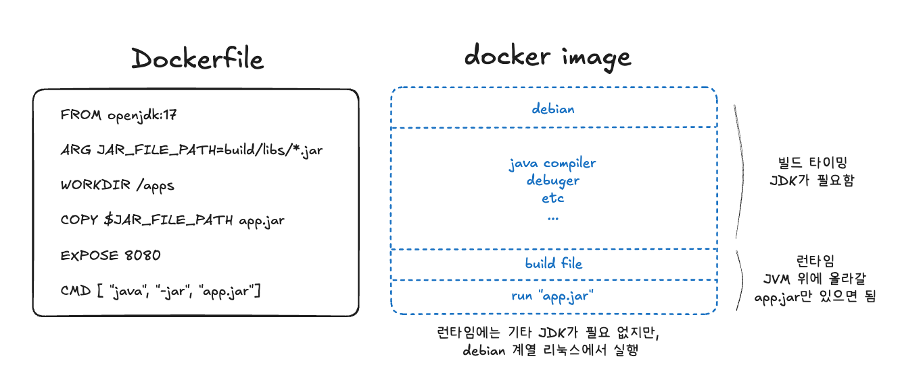

`openjdk:17`은 JDK(Java Developer Kit)를 전부 포함하여 컴파일러, 디버거, 빌드 도구 등이 모두 들어 있다. 런타임에는 이런 것들이 필요 없다.

멀티 스테이지 빌드를 적용하면 다음과 같다.

```dockerfile
# build stage
FROM gradle:7.6.4-jdk17 AS build

WORKDIR /apps
COPY . .
RUN gradle clean build --no-daemon

# runtime stage
FROM openjdk:jre-alpine

WORKDIR /apps
COPY --from=build /apps/build/libs/*.jar app.jar

EXPOSE 8080
CMD ["java", "-jar", "app.jar"]
```

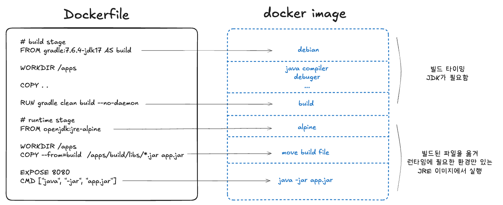

빌드 스테이지에서는 Gradle이 필요하므로 `gradle:7.6.4-jdk17` 이미지를 사용하고, 런타임 스테이지에서는 `.jar` 파일을 실행하기만 하면 되므로 `openjdk:jre-alpine`이라는 경량 이미지를 사용한다.

> `FROM` 절의 `AS` 뒤에 오는 이름(예: `build`)은 참조용이다. `COPY --from=build`에서 이 이름을 사용하므로, 만약 `AS builder`로 지정했다면 `--from=builder`로 맞춰야 한다.

### 결과: 74% 용량 절감

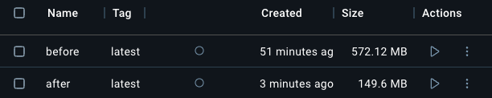

멀티 스테이지 빌드를 적용한 결과, **572MB에서 149MB로** 약 74%의 용량을 줄일 수 있었다.

Docker 이미지를 저장할 때는 날짜나 Git commit ID를 통한 태깅으로 ECR이나 Harbor 등에 저장하게 된다. 이미지가 누적되면 용량 차이가 크게 벌어지므로, **멀티 스테이지 빌드를 통한 이미지 경량화는 거의 필수**라고 할 수 있다.

## Docker의 환경 변수

환경 변수를 어떻게 관리하느냐에 따라 하나의 Docker 이미지를 다양한 환경에서 유연하게 사용할 수 있다. 이 섹션에서는 환경 변수의 기본 개념부터 Docker에서의 우선순위까지 다룬다.

### 환경 변수란

> 환경 변수는 프로세스가 컴퓨터에서 동작하는 방식에 영향을 미치는, 동적인 값의 모임이다. -- Wikipedia

운영체제에서 환경 변수는 시스템의 실행 파일 경로 등을 지정하는 데 쓰인다. 예를 들어 `python main.py` 명령어를 실행하면, OS는 환경 변수에 등록된 Python 경로를 참조하여 실행한다. 환경 변수가 없으면 OS는 이 간단한 명령조차 이해할 수 없다.

애플리케이션 레벨에서도 환경 변수를 사용하는 이유는 명확하다.

- **보안** : 민감한 데이터(Secret Key, Access Token)를 코드에서 분리하여 관리
- **다중 환경** : Local, Staging, Production 등 환경별로 다른 설정 적용
- **호환성** : 클라우드 서비스 및 컨테이너 환경에서 설정을 용이하게 관리

### ARG vs ENV

Dockerfile에서 환경 변수를 설정하는 방법은 크게 두 가지다.

- **ARG** : 이미지를 빌드할 때만 사용되며, `docker build --build-arg VERSION=2.0` 형태로 전달한다.
- **ENV** : 이미지 내부에 기록되며, 컨테이너 실행 시에도 환경 변수로 자동 등록된다. `docker run --env VERSION=2.0` 형태로 오버라이딩할 수 있다.

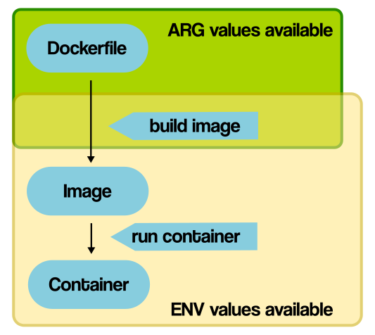

ARG로 설정한 값은 빌드 타임에만 사용 가능하고 이후에는 **변경이 불가능**하다. ENV로 설정한 값은 이미지 내부에 저장되며, 컨테이너 실행 시 리눅스 환경 변수로 등록된다.

확장 가능한 이미지를 만들려면 **ENV**를 사용해야 한다. 외부에서 `DATABASE_URL`이나 `PORT` 등을 달리하여 컨테이너를 띄울 수 있기 때문이다.

### ENV는 리눅스 환경 변수가 된다

Docker 공식 문서에서 ENV에 대해 다음과 같이 설명한다.

> This sets a Linux environment variable we'll need later.
> (나중에 사용할 리눅스 환경 변수를 설정한다.)

실제로 Redis 컨테이너에 접속하여 `env` 명령어를 실행하면, Dockerfile에서 ENV로 정의한 값들이 그대로 환경 변수에 등록되어 있는 것을 확인할 수 있다.

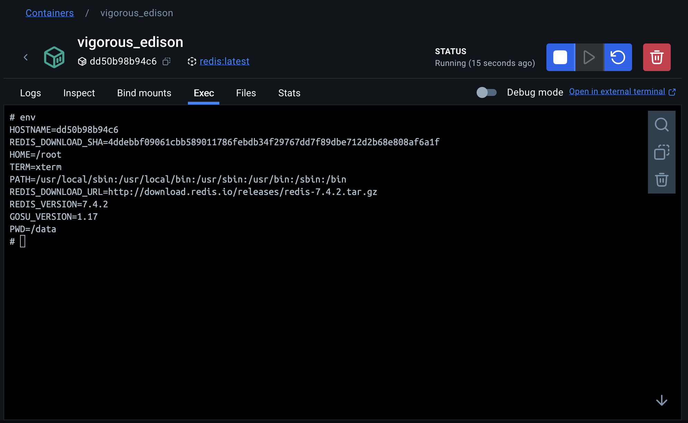

```dockerfile
# Redis 7.4.2의 Dockerfile 일부
ENV REDIS_VERSION 7.4.2
ENV REDIS_DOWNLOAD_URL http://download.redis.io/releases/redis-7.4.2.tar.gz
```

이처럼 ENV로 정의된 값이 그대로 컨테이너의 환경 변수로 들어간다.

### dotenv와 .env 파일의 역할

개발할 때 관습적으로 `.env` 파일을 만들고 dotenv 라이브러리를 사용해왔을 것이다. python-dotenv의 공식 문서에 따르면:

> Python-dotenv는 .env 파일로부터 키-값 쌍을 읽어서 환경 변수로 설정할 수 있습니다. 이는 12-factor 원칙을 따르는 애플리케이션 개발에 도움을 줍니다.

핵심은 dotenv가 **OS 레벨의 환경 변수를 대체**한다는 것이다. 프로덕션에서는 진짜 환경 변수가 주입되겠지만, 개발 환경에서는 매번 환경 변수를 직접 설정하기 번거로우니 `.env` 파일로 대체하는 것이다.

### 환경 변수 우선순위

그렇다면 Dockerfile의 ENV, `.env` 파일, 외부에서 주입하는 환경 변수가 동시에 존재하면 어떤 것이 적용될까? 직접 실험을 통해 확인한 결과는 다음과 같다.

**실험 환경 설정:**

```python
# test.py
import os
from dotenv import load_dotenv

load_dotenv()

print(os.environ.get("DOMAIN"))
```

```text
# .env
DOMAIN=example.org
```

```dockerfile
FROM python:3.10-slim
WORKDIR /app
RUN pip install --no-cache-dir python-dotenv
COPY . .
ENV DOMAIN=thisisdockerfile
CMD ["python", "test.py"]
```

**결과 1**: `docker run` 실행시 Dockerfile의 ENV가 `.env`보다 우선

```bash
$ docker run realtest
thisisdockerfile
```

**결과 2**: `docker run --env`로 주입하면 Dockerfile의 ENV보다 우선

```bash
$ docker run --env DOMAIN=thisisdockerruncli realtest
thisisdockerruncli
```

환경 변수의 우선순위는 다음과 같다. (높은 순서부터)

1. **외부 주입** (docker run --env, docker-compose, Kubernetes)
2. **Dockerfile의 ENV**
3. **.env 파일 + dotenv 라이브러리**

한 문장으로 정리하면 **가장 바깥쪽에서 넣어주는 환경 변수가 적용된다**. `.env` 파일의 바깥에 Dockerfile이 있고, 그 바깥에 docker-compose/Kubernetes가 있는 것과 동일한 우선순위이다.

<!-- TODO: 다이어그램 필요 - 환경 변수 우선순위를 계층적으로 보여주는 다이어그램 (.env < Dockerfile ENV < docker-compose/K8s) -->

> **참고**: python-dotenv의 `load_dotenv(override=True)` 옵션을 사용하면 `.env` 파일의 값을 최우선으로 사용하도록 설정할 수도 있다. 기본값은 `False`이므로 시스템 환경 변수가 우선시된다.

## BuildKit과 CI/CD

Docker 빌드 속도를 획기적으로 개선할 수 있는 BuildKit과, 이를 GitHub Actions에서 활용하는 방법을 살펴보자.

### BuildKit이란

BuildKit은 기존의 Docker 빌더를 대체하는 새로운 빌드 백엔드이다. Docker Desktop과 Docker Engine 23.0 버전부터 기본 빌더로 사용되고 있어, 맥에서 Docker Desktop을 사용한다면 이미 BuildKit을 쓰고 있는 것이다.

BuildKit의 주요 기능은 다음과 같다.

- 캐시를 통한 재빌드 방지
- 병렬 빌드
- 변경된 파일만 증분적으로 전송
- 사용되지 않는 파일 전송 감지 및 스킵

BuildKit이 빠른 이유는 **LLB(Low-Level Build)**라는 기술을 사용하기 때문이다. LLB는 Dockerfile의 `RUN`, `COPY`, `ADD` 같은 명령어를 추상화된 형태로 변환하여, 각각의 입력과 출력을 정의한다. 이를 통해 **변경된 부분만 재빌드하여 다시 합치는 방식**으로 동작한다.

실제로 테스트해 보면, 초기 빌드에 41.6초가 걸린 프로젝트에서 코드를 약간만 수정하고 재빌드하면 1.5초만에 완료된다.

```bash
# 초기 빌드
$ docker build . -f scheduler.dev.dockerfile -t first
[+] Building 41.6s (19/19) FINISHED

# 코드 약간 수정 후 재빌드
$ docker build . -f scheduler.dev.dockerfile -t second
[+] Building 1.5s (19/19) FINISHED
```

### GitHub Actions에서 Buildx 사용하기

GitHub Actions에서 BuildKit의 캐시를 활용하려면 **Buildx**를 사용한다. Buildx는 Docker CLI 플러그인으로, BuildKit을 포함하고 멀티플랫폼 빌드, 향상된 캐싱 메커니즘 등을 지원한다.

GitHub Actions는 매 실행마다 새로운 인스턴스를 띄우기 때문에, 별도의 캐시 설정 없이는 매번 처음부터 빌드하게 된다. 다음과 같이 설정하면 캐시를 활용할 수 있다.

```yaml
- name: Set up Docker Buildx
  uses: docker/setup-buildx-action@v2

- name: Build and push
  uses: docker/build-push-action@v4
  with:
    context: .
    file: ./Dockerfile
    push: true
    tags: user/app:latest
    cache-from: type=gha
    cache-to: type=gha,mode=max
```

### 캐시 동작 방식

Docker 이미지는 여러 레이어로 구성되며, 각 레이어는 Dockerfile의 각 명령어에 대응한다.

```dockerfile
FROM node:14
WORKDIR /app
COPY package.json ./     # 레이어 1
RUN npm install          # 레이어 2
COPY . .                 # 레이어 3
RUN npm run build        # 레이어 4
```

Buildx는 각 레이어의 내용을 해시값으로 변환하여 캐싱한다. 동일한 레이어는 재사용되고, 변경된 레이어부터만 다시 빌드한다. 이것이 Dockerfile에서 자주 변경되지 않는 명령(의존성 설치)을 앞에, 자주 변경되는 명령(소스 코드 복사)을 뒤에 배치하는 이유다.

### 캐시 저장소와 모드

GitHub Actions에서 Buildx 캐시는 `gha` 타입의 GitHub Actions 캐시에 저장된다.

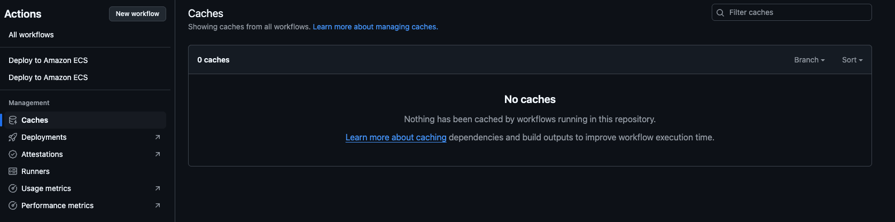

실전에서는 gha 캐시와 레지스트리 캐시를 함께 사용하는 것이 효과적이다.

```yaml
- name: Build and push
  uses: docker/build-push-action@v4
  with:
    context: .
    file: ./Dockerfile
    push: true
    tags: ${{ steps.login-ecr.outputs.registry }}/${{ env.ECR_REPOSITORY }}:${{ github.sha }}
    cache-from: |
      type=gha
      type=registry,ref=${{ steps.login-ecr.outputs.registry }}/${{ env.ECR_REPOSITORY }}:cache
    cache-to: |
      type=gha,mode=max
      type=registry,ref=${{ steps.login-ecr.outputs.registry }}/${{ env.ECR_REPOSITORY }}:cache,mode=max
```

### 태깅 전략

위 workflow에서 눈여겨볼 부분은 태깅이다. `${{ github.sha }}`를 사용하여 Git 커밋 해시를 태그로 사용하고 있다. 이렇게 하면 각 빌드가 어떤 커밋에서 만들어졌는지 추적할 수 있다. 캐시용 이미지는 별도의 `cache` 태그를 사용하여 관리한다.

`cache-to`의 모드 옵션은 다음과 같다.

| 모드 | 설명 |
|------|------|
| `max` | 모든 레이어를 캐시 (가장 완전한 캐싱) |
| `min` | 최종 이미지에 포함되지 않는 레이어만 캐시 |
| `inline` | 이미지 메타데이터에 캐시 정보 포함 |

일반적으로 `mode=max`를 사용하여 모든 레이어를 캐시하는 것이 빌드 속도를 최대한 높이는 방법이다.

## 참고 자료

- [Docker 공식 문서](https://docs.docker.com/)
- [Dockerfile reference](https://docs.docker.com/reference/dockerfile/)
- [Docker BuildKit](https://docs.docker.com/build/buildkit/)
- [How to Build Smaller Container Images: Docker Multi-Stage Builds](https://labs.iximiuz.com/tutorials/docker-multi-stage-builds)
- [Docker ARG, ENV and .env - a Complete Guide](https://vsupalov.com/docker-arg-env-variable-guide/)
- [The Twelve-Factor App - Config](https://12factor.net/ko/config)
- [GitHub Actions에서 도커 캐시를 사용하기 (카카오)](https://fe-developers.kakaoent.com/2022/220414-docker-cache/)
