최근 인공지능 기술이 크게 발전하면서, GPT와 같은 LLM(Large Language Model)을 뒷받침하는 핵심 기술들이 주목받고 있다. 그 중에서도 **Embedding**과 **벡터 데이터베이스(VDB)** 는 검색, 추천, RAG(Retrieval-Augmented Generation) 등 다양한 시스템의 근간이 되는 기술이다.

이 글에서는 Embedding의 기본 개념부터 벡터 데이터베이스인 Milvus를 활용한 검색 엔진 구축, 그리고 매칭/검색/추천 시스템의 근본적인 차이까지 하나의 흐름으로 정리한다.

---

## 1. Embedding이란?

### 개념

**Embedding**은 복잡한 데이터를 고정된 크기의 벡터로 나타내는 기법이다. 128차원, 256차원, 768차원 등 다양한 차원의 벡터로 표현된 것을 embedding이라고 하며, 자연어 처리(NLP)뿐만 아니라 이미지, 오디오 등 다양한 데이터에 적용할 수 있다.


좀 더 구체적으로 설명하면, embedding은 머신러닝 모델에서 파생된 수치 표현으로 비정형 데이터의 **의미적 의미**를 벡터에 담는다. 신경망이나 트랜스포머 아키텍처를 통해 데이터 내의 복잡한 상관관계를 분석하여, 각 데이터 객체를 밀집한 벡터(dense vector)로 변환한다.

데이터가 벡터로 변환되면 벡터 공간에 위치하게 되며, **비슷한 의미를 갖는 데이터들은 비교적 가까운 위치**에 놓이게 된다.

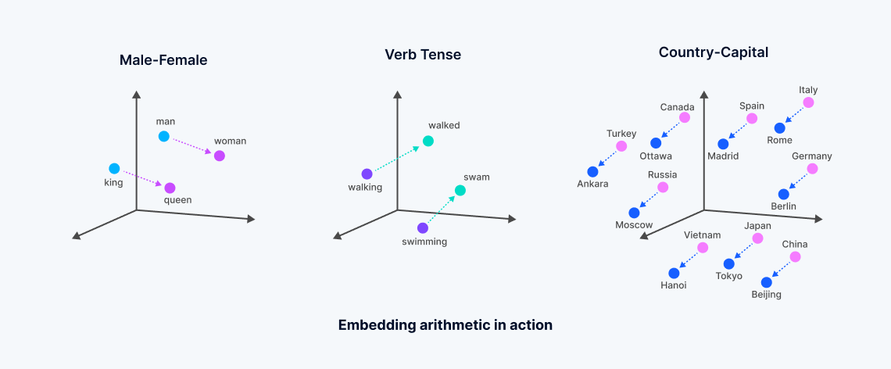

예를 들어, "사과", "딸기", "지하철"이라는 세 단어를 임베딩하면 사과와 딸기는 벡터 공간에서 가깝게 위치하고, 지하철은 상대적으로 멀리 떨어진다. 사람은 경험적으로 이를 직관적으로 알 수 있지만, 컴퓨터는 대량의 데이터를 통한 학습을 거쳐야 이러한 관계를 파악할 수 있다.

이렇게 벡터 공간 위에 데이터를 나타내면, 각 벡터 간의 거리를 구하는 다양한 방법을 통해 검색을 구현한다. 가장 가까운 k개의 이웃을 검색하는 방법을 **k-NN(k-nearest neighbors)** 이라고 한다.

### Embedding 모델

데이터를 벡터값으로 변환하려면 **embedding model**이 필요하다. 데이터 유형에 따라 적합한 모델이 다르다.

- **텍스트**: text embedding model (word2vec, BERT, Sentence-BERT 등)
- **이미지**: image embedding model (ResNet, CLIP 등)
- **멀티모달**: multi-modal embedding model (텍스트, 이미지, 오디오를 동일 벡터 공간에 표현)

이러한 임베딩 모델은 [HuggingFace](https://huggingface.co/models)와 같은 플랫폼에서 다양한 프리셋을 찾아볼 수 있다. 일반적으로 **text2vec**, **image2vec** 같은 네이밍으로 모델을 확인할 수 있다.

### 벡터 거리 측정 방법

벡터 간의 유사도를 측정하는 대표적인 방법은 다음과 같다.

**1. 유클리드 거리 (Euclidean Distance)**

두 벡터 간의 직선 거리를 측정한다. 직관적이고 계산이 간단하지만, 데이터의 크기(스케일)에 민감하다.

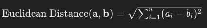

**2. 코사인 유사도 (Cosine Similarity)**

두 벡터 간의 각도를 기반으로 유사성을 측정한다. 값이 1에 가까울수록 동일한 방향, -1에 가까울수록 반대 방향이다. 벡터의 크기에 영향을 받지 않아 텍스트 분석이나 문서 유사도 계산에 널리 사용된다.

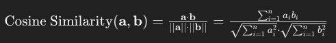

**3. 맨해튼 거리 (Manhattan Distance)**

격자형 도로를 따라 이동하는 방식으로 거리를 측정한다. 차원별로 거리 차이를 합산하기 때문에 고차원 공간에서 유클리드 거리보다 직관적일 수 있다.

**4. 자카드 유사도 (Jaccard Similarity)**

집합 간의 유사성을 측정하는 방법으로, 두 집합의 교집합 크기를 합집합 크기로 나눈 값이다. 이진 벡터나 집합 데이터에서 유용하다.

---

## 2. 벡터 데이터베이스: Milvus

### 왜 벡터 데이터베이스가 필요한가?

임베딩 값은 고차원의 벡터이다. 일반적인 RDB나 Redis에 저장해도 기능적으로는 문제가 없지만, 벡터 검색에 특화된 데이터베이스를 사용하면 성능과 편의성 면에서 큰 이점을 얻을 수 있다.


벡터 데이터베이스가 필요한 이유는 명확하다. 벡터를 통한 검색은 기존 RDB 패러다임과 완전히 다르다. SQL이나 B+ Tree 같은 전통적인 쿼리 최적화 기법이 통하지 않으며, 벡터 데이터에 특화된 인덱싱 방법과 검색 메서드가 필요하다. VDB는 이러한 기능들을 내장하고 있어 파라미터만 전달하면 손쉽게 벡터 검색을 수행할 수 있다.

### 벡터 인덱싱 방법

벡터 데이터베이스의 인덱싱 방법은 RDB의 인덱싱과는 근본적으로 다르다. 대표적인 세 가지 방법을 살펴보자.

#### Flat Index

가장 간단한 인덱싱 방법으로, 별도의 인덱스 없이 벡터를 그대로 저장한다. 모든 벡터를 순차 탐색하여 k개의 최근접 이웃을 찾기 때문에 **가장 정확한 결과**를 제공하지만, 검색 속도가 매우 느리다.

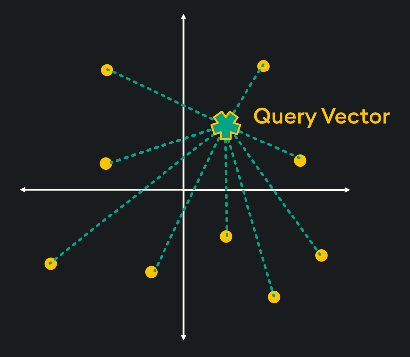

소규모의 저차원 벡터를 다루는 경우에는 나쁘지 않은 성능을 가지고 있다.

#### Graph Index (HNSW)

그래프 기반 인덱스는 노드와 엣지를 사용해 네트워크와 같은 구조를 구성한다. 노드는 벡터 임베딩을 나타내고, 엣지는 임베딩 간의 관계를 나타낸다.

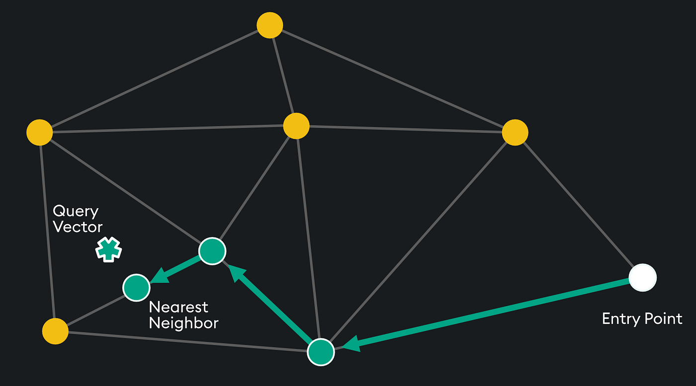

대표적인 구현이 **HNSW(Hierarchical Navigable Small Worlds)** 이다. 두 임베딩 노드가 근접한 정도에 따라 연결되는 근접 그래프로, 각 노드는 "친구 목록"을 가지고 있다. 미리 정의된 진입점(Entry Point)에서 시작하여 쿼리 벡터에 가장 가까운 이웃을 찾을 때까지 연결된 노드를 탐색한다.

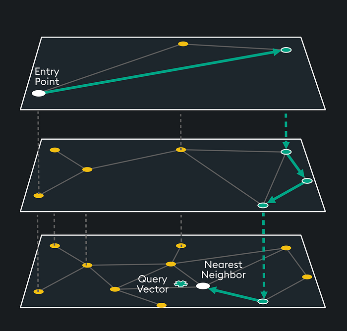

최상위 레이어는 가장 긴 거리를 가지지만 가장 높은 차수의 정점을 포함하고, 하위 레이어로 내려가면서 더 많은 노드를 세밀하게 탐색한다. 고차원 대규모 데이터에 적합한 인덱싱 방법이다.

#### Inverted Index (IVF-PQ)

반전 인덱싱 방법은 검색 엔진에서 널리 사용되는 기법이다. 벡터 공간을 **보르노이 셀(Voronoi cell)** 로 분할하고, 검색 시에는 쿼리 벡터가 위치한 셀과 주변 셀의 가장 가까운 중심점으로 탐색을 제한한다.

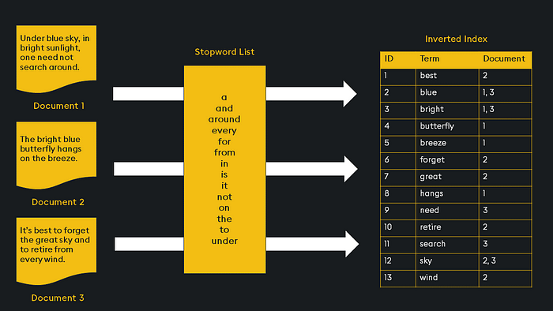

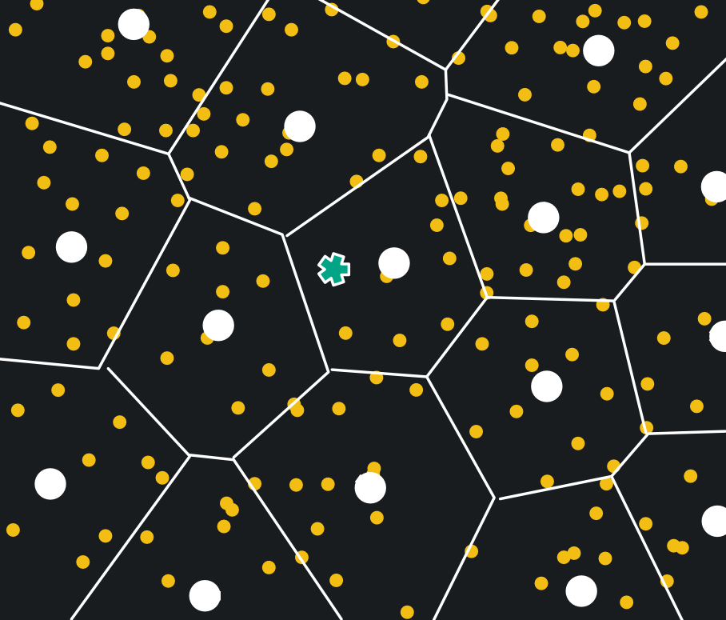

프로브(probe) 매개변수로 탐색 범위를 조절할 수 있다. Product Quantization(PQ)을 함께 사용하면 메모리 사용량과 검색 시간이 크게 줄어든다.

#### HNSW vs IVF-PQ

| 기준 | HNSW | IVF-PQ |
|------|------|--------|
| 속도 | 빠른 검색 성능 | 상대적으로 느림 |
| 정확도 | 약간 낮음 | 정확한 이웃 검색에 강점 |
| 메모리 | 상대적으로 높음 | PQ를 통한 높은 메모리 효율 |
| 적합한 경우 | 빠른 근사 검색이 중요할 때 | 정확도와 메모리 효율이 중요할 때 |

### Milvus란?

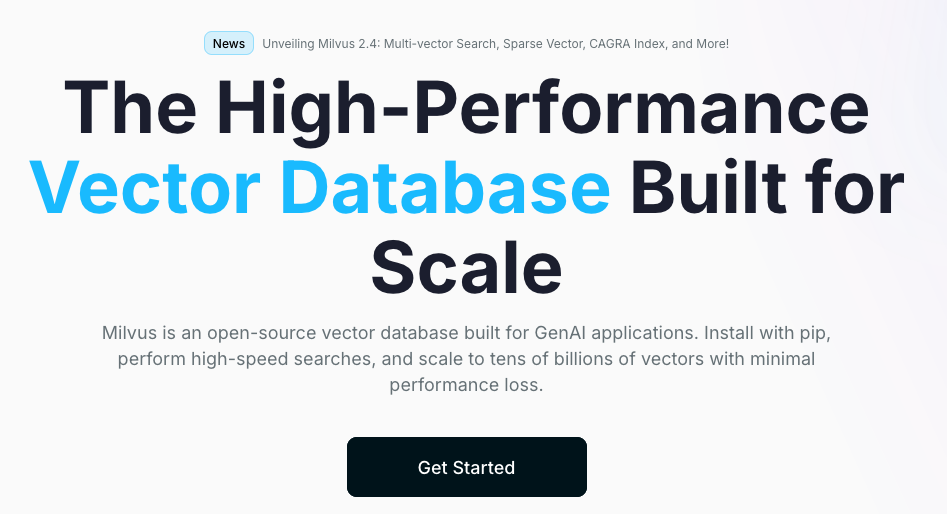

**Milvus(밀버스)** 는 가장 활발한 오픈소스 커뮤니티를 가진 벡터 데이터베이스이다. 연구용으로 많이 사용되며, 기업용으로는 **Pinecone(파인콘)** 이 널리 쓰인다. 직접 VDB를 구축할 인프라가 있는 기업은 Milvus로 마이그레이션하는 경우도 있다.

- [Milvus 공식 문서](https://milvus.io/docs)

Milvus는 크게 두 가지 배포 형태가 있다.
- **milvus-standalone**: 단일 노드에서 실행
- **milvus-distributed**: 클러스터링 구조로 분산 배포

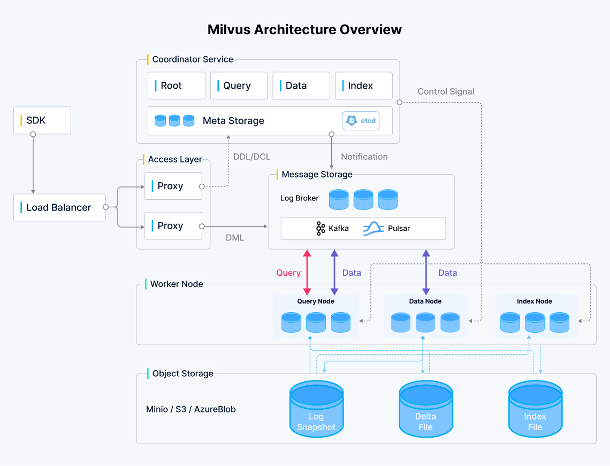

### Docker Compose로 Milvus 띄우기

Docker가 실행된 환경에서 다음 명령어로 Milvus를 실행할 수 있다.

```bash
wget https://github.com/milvus-io/milvus/releases/download/v2.5.0-beta/milvus-standalone-docker-compose.yml -O docker-compose.yml

sudo docker-compose up -d
```

`docker-compose.yml`을 실행하면 세 개의 컨테이너가 뜬다.
- **etcd**: 전역 상태 관리
- **minio**: 객체 저장소
- **milvus-standalone**: 벡터 데이터베이스 (19530번 포트)

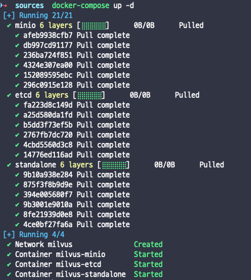

다음은 실제로 사용할 `docker-compose.yml` 전체 내용이다.

```yaml
version: '3.5'

services:
  etcd:
    container_name: milvus-etcd
    image: quay.io/coreos/etcd:v3.5.5
    environment:
      - ETCD_AUTO_COMPACTION_MODE=revision
      - ETCD_AUTO_COMPACTION_RETENTION=1000
      - ETCD_QUOTA_BACKEND_BYTES=4294967296
      - ETCD_SNAPSHOT_COUNT=50000
    volumes:
      - ${DOCKER_VOLUME_DIRECTORY:-.}/volumes/etcd:/etcd
    command: etcd -advertise-client-urls=http://127.0.0.1:2379 -listen-client-urls http://0.0.0.0:2379 --data-dir /etcd
    healthcheck:
      test: ["CMD", "etcdctl", "endpoint", "health"]
      interval: 30s
      timeout: 20s
      retries: 3

  minio:
    container_name: milvus-minio
    image: minio/minio:RELEASE.2023-03-20T20-16-18Z
    environment:
      MINIO_ACCESS_KEY: minioadmin
      MINIO_SECRET_KEY: minioadmin
    ports:
      - "9001:9001"
      - "9000:9000"
    volumes:
      - ${DOCKER_VOLUME_DIRECTORY:-.}/volumes/minio:/minio_data
    command: minio server /minio_data --console-address ":9001"
    healthcheck:
      test: ["CMD", "curl", "-f", "http://localhost:9000/minio/health/live"]
      interval: 30s
      timeout: 20s
      retries: 3

  standalone:
    container_name: milvus-standalone
    image: milvusdb/milvus:v2.5.0-beta
    command: ["milvus", "run", "standalone"]
    security_opt:
    - seccomp:unconfined
    environment:
      ETCD_ENDPOINTS: etcd:2379
      MINIO_ADDRESS: minio:9000
    volumes:
      - ${DOCKER_VOLUME_DIRECTORY:-.}/volumes/milvus:/var/lib/milvus
    healthcheck:
      test: ["CMD", "curl", "-f", "http://localhost:9091/healthz"]
      interval: 30s
      start_period: 90s
      timeout: 20s
      retries: 3
    ports:
      - "19530:19530"
      - "9091:9091"
    depends_on:
      - "etcd"
      - "minio"

networks:
  default:
    name: milvus
```

### pymilvus 기본 사용법

`pymilvus` 패키지를 설치한 후 벡터를 삽입하고 검색하는 기본 코드를 살펴보자.

```bash
pip3 install pymilvus
```

```python
from pymilvus import connections, FieldSchema, CollectionSchema, DataType, Collection, utility

# Milvus 연결
connections.connect("default", host="127.0.0.1", port="19530")

# 전역변수 설정
dimension = 8  # 벡터 차원 설정

# Milvus 컬렉션 스키마 정의
fields = [
    FieldSchema(name="id", dtype=DataType.INT64, is_primary=True, auto_id=False),
    FieldSchema(name="title", dtype=DataType.VARCHAR, max_length=512),
    FieldSchema(name="vector", dtype=DataType.FLOAT_VECTOR, dim=dimension),
]

schema = CollectionSchema(fields, description="Schema to store vector and other related data in Milvus")

# 컬렉션이 이미 있다면 삭제 (create_drop과 같은 기능)
if utility.has_collection("hello_milvus"):
    utility.drop_collection("hello_milvus")

# hello_milvus 컬렉션 생성
hello_milvus = Collection("hello_milvus", schema)

# 더미 데이터 생성
entities = [
    [1, 2, 3, 4],
    ['this', 'is', 'dummy', 'data'],
    [
        [3.2, 7.1, -2.7, 5.4, 0.4, 12.1, -8.3, 4.2],
        [5.1, 9.1, 4.7, -3.6, 8.5, 6.9, -2.0, -1.0],
        [1.2, 7.2, -3.3, 9.7, -6.7, 0.6, 5.7, -4.5],
        [10.1, 2.3, 5.3, 7.4, 3.7, -8.8, -6.9, -1.9]
    ]
]

insert_result = hello_milvus.insert(entities)
hello_milvus.flush()

# 인덱스 생성 및 로드
index_params = {
    "index_type": "IVF_FLAT",
    "metric_type": "L2",
    "params": {"nlist": 128},
}

hello_milvus.create_index("vector", index_params)
hello_milvus.load()

# 검색 파라미터 설정
search_params = {
    "metric_type": "L2",
    "params": {"nprobe": 10},
}

# 검색 실행
query_vector = [[10.1, -2.3, -5.4, 7.5, 3.5, -8.7, 6.1, 1.0]]
result = hello_milvus.search(query_vector, "vector", search_params, limit=2, output_fields=["title"])
print(result)
```

실행 결과:

```
data: ['["id: 4, distance: 313.12, entity: {\'title\': \'data\'}", "id: 3, distance: 399.65, entity: {\'title\': \'dummy\'}"]']
```

위 예제에서는 `L2`(유클리드 거리)를 사용했지만, 실제 검색 엔진에서는 일반적으로 `COSINE`(코사인 유사도)을 사용한다.

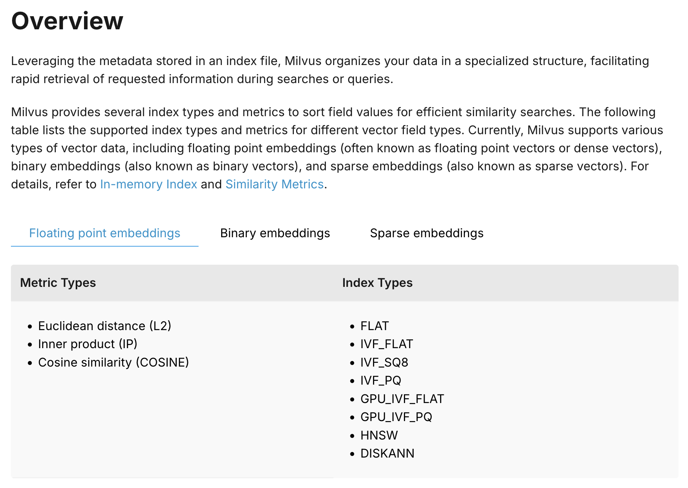

---

## 3. 검색 엔진 구축: Flask + Embedding + Milvus

이제 Embedding 모델과 Milvus를 조합하여 실제 검색 엔진을 구축해 보자. Flask를 통한 API 서버에 임베딩 모델을 연결하고, Milvus에 벡터를 저장하여 검색하는 엔드투엔드 파이프라인을 만든다.

<!-- TODO: 검색 엔진 전체 파이프라인 다이어그램 (사용자 쿼리 -> Flask API -> Embedding Model -> Milvus VDB -> 검색 결과) -->

### 임베딩 모델 선택

한국어 데이터를 다루기 위해 [klue/bert-base](https://huggingface.co/klue/bert-base) 모델을 사용한다. 한국어와 영어의 임베딩에는 큰 차이가 있다. 한국어는 활용형이 많고 불용어가 다양하여 영어에 비해 임베딩 모델의 성능이 떨어질 수 있다. 따라서 한국어에 특화된 모델을 선택하는 것이 중요하다.

### 환경 설정

ML 관련 의존성들이 파이썬 버전의 영향을 크게 받기 때문에, 3.10 버전의 가상환경을 만들어 진행한다.

```bash
# 가상환경 생성
python3.10 -m venv venv

# 가상환경 실행
source venv/bin/activate

# 의존성 설치
pip3 install torch
pip3 install transformers
pip3 install flask
pip3 install pymilvus
```

### 임베딩 모델 테스트

먼저 임베딩 모델이 정상 동작하는지 확인한다.

```python
from transformers import AutoTokenizer, AutoModel
import torch

# 모델 및 토크나이저 로드
model_name = "klue/bert-base"
tokenizer = AutoTokenizer.from_pretrained(model_name)
model = AutoModel.from_pretrained(model_name)

# 문장 입력
sentences = ["안녕하세요.", "한국어 문장 임베딩을 시도해봅니다."]

# 토큰화
inputs = tokenizer(sentences, return_tensors="pt", padding=True, truncation=True, max_length=128)

# 모델 예측
with torch.no_grad():
    outputs = model(**inputs)

# 문장 임베딩 생성 (CLS 토큰 사용)
sentence_embeddings = outputs.last_hidden_state[:, 0, :]

print("Sentence Embeddings:", sentence_embeddings)
```

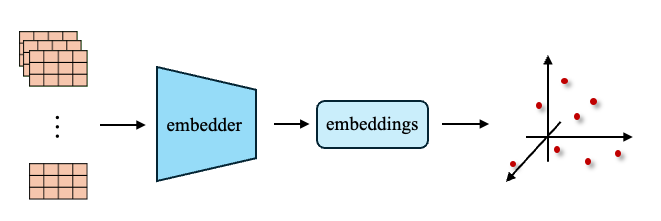

### 전체 소스 코드: 검색 엔진

Flask API 서버, 임베딩 모델, Milvus를 하나로 합친 전체 코드는 다음과 같다. 두 개의 엔드포인트를 제공한다.

- `POST /insert`: 문장을 임베딩하여 Milvus에 저장
- `GET /search`: 쿼리를 임베딩하여 벡터 검색 수행

```python
from flask import Flask, request, jsonify
from transformers import AutoTokenizer, AutoModel
from pymilvus import connections, FieldSchema, CollectionSchema, DataType, Collection, utility
import torch

## flask ##
app = Flask(__name__)

## embedding model ##
model_name = "klue/bert-base"
tokenizer = AutoTokenizer.from_pretrained(model_name)
model = AutoModel.from_pretrained(model_name)


## milvus ##
connections.connect("default", host="127.0.0.1", port="19530")

dimension = 768  # BERT 벡터 차원
fields = [
    FieldSchema(name="title", dtype=DataType.VARCHAR, max_length=512, is_primary=True),
    FieldSchema(name="vector", dtype=DataType.FLOAT_VECTOR, dim=dimension),
]

schema = CollectionSchema(fields, description="Schema to store vector and other related data in Milvus")
collection_name = "text_embeddings"

if utility.has_collection(collection_name):
    utility.drop_collection(collection_name)
collection = Collection(collection_name, schema)

# milvus index
index_params = {
    "index_type": "IVF_FLAT",
    "metric_type": "COSINE",
    "params": {"nlist": 128},
}
collection.create_index("vector", index_params)
collection.load()

# milvus vector search param
search_params = {
    "metric_type": "COSINE",
    "params": {"nprobe": 10},
}


@app.route('/search', methods=['GET'])
def search_vectors():
    query = request.args.get("query", "")
    if not query:
        return jsonify({"error": "Query parameter is missing."}), 400

    inputs = tokenizer(query, return_tensors="pt", padding=True, truncation=True, max_length=128)
    with torch.no_grad():
        outputs = model(**inputs)
    query_vector = outputs.last_hidden_state[:, 0, :].numpy().tolist()

    result = collection.search(query_vector, "vector", search_params, limit=3, output_fields=["title"])

    response = []
    for hits in result:
        for hit in hits:
            response.append({"title": hit.entity.get("title"), "distance": hit.distance})

    return jsonify(response), 200


@app.route('/insert', methods=['POST'])
def insert_vectors():
    data = request.json
    sentences = data.get("sentences", [])

    if not sentences or not isinstance(sentences, list):
        return jsonify({"error": "Invalid input. Provide a list of 'sentences'."}), 400

    # 문장 임베딩 생성
    inputs = tokenizer(sentences, return_tensors="pt", padding=True, truncation=True, max_length=128)
    with torch.no_grad():
        outputs = model(**inputs)
    vectors = outputs.last_hidden_state[:, 0, :].numpy().tolist()

    # Milvus에 데이터 삽입
    entities = [sentences, vectors]
    insert_result = collection.insert(entities)
    collection.flush()

    return jsonify({"inserted_count": len(sentences)}), 200

## start Flask ##
if __name__ == '__main__':
    app.run(host='0.0.0.0', port=8000)
```

### 테스트

`POST /insert`로 테스트 데이터를 삽입한다.

```json
{
  "sentences": [
    "혼자 사는 사람이 쓰기 좋은 진공청소기",
    "바쁜 직장인을 위한 초간단 커피머신",
    "집에서도 전문적인 피자를 만들 수 있는 오븐",
    "알러지 걱정 없는 저자극 침구 세트",
    "게임에 최적화된 고성능 게이밍 키보드",
    "여름철 필수템 초경량 휴대용 선풍기",
    "다이어트를 도와주는 스마트 체중계",
    "가성비 좋은 무선 블루투스 이어폰",
    "캠핑에 최적화된 다기능 LED 랜턴",
    "반려동물을 위한 자동 급식기",
    "업무 효율을 높이는 인체공학 의자",
    "전문가용 4K 고화질 카메라"
  ]
}
```

그 후 `GET /search?query=혼자 사는 개발자`로 검색하면 코사인 유사도 기준 상위 3개의 결과가 반환된다.

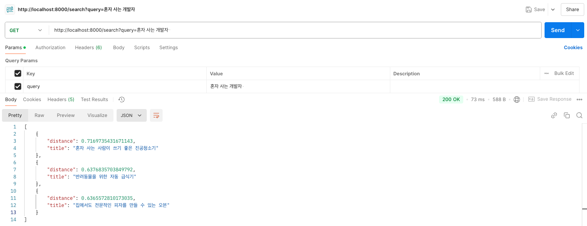

결과가 완벽하지는 않을 수 있다. 이러한 부분에서 **리랭킹(reranking)** 이나 **개인화(personalization)** 같은 후처리를 통해 보다 정교한 검색/추천 시스템을 구축할 수 있다. 주석을 제외하면 90줄 이내로 검색 엔진이 완성된다는 점에서 파이썬 생태계의 강력함을 체감할 수 있다.

---

## 4. 매칭 vs 검색 vs 추천

서비스를 만들다 보면 "A와 B를 짝지어 주고 싶다"는 요구사항을 자주 접하게 된다. 개발자-프로젝트 매칭, 학생-멘토 매칭, 유저-유저 소개팅 등이 대표적인 예시다. 이러한 문제를 다루는 것이 **매칭 시스템(matching system)** 인데, 겉으로 보기에는 검색/추천 시스템과 비슷해 보이지만 근본적으로 다른 접근이 필요하다.

### 매칭 시스템

매칭 문제는 각 요소에 대한 선호도 순서가 주어졌을 때, 두 요소 집합 간에 **안정적인 일치(stable matching)** 를 찾는 문제이다. 여기서 "안정적"이란 현재 파트너보다 서로를 더 선호하는 쌍(blocking pair)이 존재하지 않는 상태를 의미한다.

매칭의 품질 기준은 다음과 같다.
- **안정성(stability)**: blocking pair가 없는 상태
- **최적성(optimality)**: 전체 만족도 최대화
- **공정성(fairness)**: 특정 그룹이 구조적으로 불리하지 않은 매칭

대표적인 알고리즘으로는 **Gale-Shapley 알고리즘**(같은 크기의 두 그룹)과 **Hospital-Resident 알고리즘**(다른 크기의 두 그룹)이 있다. 이 분야는 2012년 노벨 경제학상을 수상한 연구이기도 하다.

### 검색 시스템

**검색 시스템**은 사용자가 **명시적으로** 쿼리를 던지면, 그에 가장 잘 맞는 데이터를 찾아주는 **pull** 모델이다.

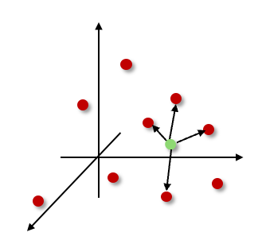

데이터를 벡터 공간 위에 올려놓고, 쿼리도 같은 임베딩 모델로 벡터화한 뒤, 코사인 유사도나 L2 distance로 가장 가까운 데이터를 반환한다.

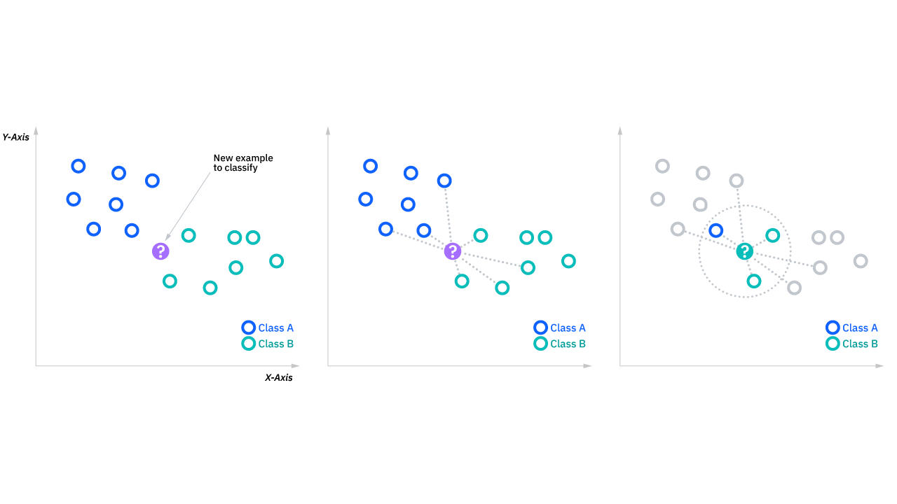

### 추천 시스템

**추천 시스템**은 사용자가 아무 말도 하지 않아도, 그 사용자가 좋아할 만한 것을 먼저 제안하는 **push** 모델이다.


기술적으로 보면 추천 시스템의 핵심에는 **유저-아이템 행렬(user-item matrix)** 이 있다. 행은 유저, 열은 아이템(영상, 상품 등), 칸은 상호작용 기록(별점, 클릭 등)이다.

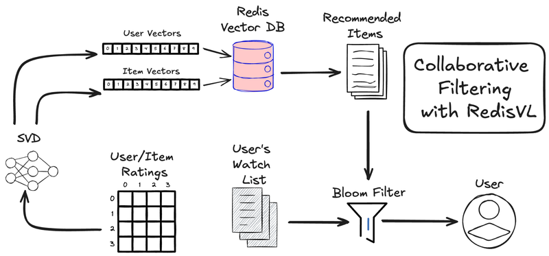

이 행렬을 **행렬 분해(Matrix Factorization)** 로 유저 임베딩과 아이템 임베딩을 학습한다.

1. 유저-아이템 행렬을 두 개의 얇은 행렬로 분해
   - 유저 행렬: 각 유저를 d차원 벡터로 표현
   - 아이템 행렬: 각 아이템을 d차원 벡터로 표현
2. 유저 벡터와 아이템 벡터의 내적(dot product)이 "좋아할 확률"에 비례하도록 학습
3. 학습 후에는 유저 벡터에서 가장 가까운 아이템 벡터를 k개 가져오면 추천 완료

### 세 시스템의 핵심 차이

| 구분 | 매칭 | 검색 | 추천 |
|------|------|------|------|
| 입력 | 양쪽의 선호도 리스트 | 사용자의 명시적 쿼리 | 사용자의 암묵적 행동 데이터 |
| 목표 | 안정적인 쌍(pair) 형성 | 쿼리와 가장 유사한 데이터 반환 | 사용자가 좋아할 아이템 예측 |
| 모델 | 양방향 (양쪽 모두 평가) | 단방향 (쿼리 -> 데이터) | 단방향 (유저 -> 아이템) |
| 핵심 알고리즘 | Gale-Shapley, Hungarian | k-NN, ANN (HNSW, IVF) | CF, MF, Neural CF |
| 대표 사례 | 소개팅, 인턴 매칭, 병원 배정 | Google 검색, 문서 검색 | Netflix, YouTube, 쇼핑몰 |

결국 벡터 공간의 관점에서 보면, **검색은 쿼리 벡터 기준 k-NN**, **추천은 유저 벡터 기준 k-NN**이다. 차이는 "쿼리가 텍스트냐, 유저냐" 정도다. 그래서 실제로 추천 시스템의 후보 생성 단계에서 벡터 DB를 그대로 사용하기도 한다. 반면 매칭 시스템은 양방향 선호도를 고려하기 때문에 근본적으로 다른 알고리즘이 필요하다.

---

## 5. 연구 경험: 테이블 데이터 RAG

학부 연구원으로서 벡터 데이터베이스와 테이블 데이터(.csv)를 활용한 RAG 연구를 진행한 경험이 있다. 연구 내용은 테이블 데이터로 검색하는 시스템, 구체적으로는 쿼리용 테이블 데이터로 **융합하기 좋은 테이블(joinable table)을 찾는** 검색 시스템을 만드는 것이었다.


수많은 .csv 데이터를 Milvus VDB에 임베딩하여 저장하고, 쿼리 시 VDB에서 유사한 테이블을 검색하는 구조였다. 단순한 키워드 매칭이 아니라 테이블의 의미적 유사성을 기반으로 검색하기 위해 RAG 방식에 다양한 부가적 방법을 조합하여 실험을 진행했다.

이 과정에서 다음과 같은 점들을 체감했다.

- **임베딩 모델의 선택**이 검색 품질에 결정적 영향을 미친다
- Milvus의 **인덱싱 파라미터 튜닝**(nlist, nprobe 등)이 속도와 정확도의 트레이드오프를 결정한다
- 테이블 데이터는 일반 텍스트와 구조가 다르기 때문에, 행/열/셀 단위의 임베딩 전략이 필요하다
- Cross-Encoder와 Pre-trained Language Model을 결합하면 검색 정확도를 크게 개선할 수 있다

이 연구는 논문 **"Searching Joinable Table using Cross-Encoder with Pre-trained Language Model"** 으로 정리되었다.

---

## 마치며

Embedding부터 벡터 데이터베이스, 검색 엔진 구축, 그리고 매칭/검색/추천의 차이까지 하나의 흐름으로 정리해 보았다. 핵심을 요약하면 다음과 같다.

1. **Embedding**은 데이터를 벡터 공간에 표현하는 기법이며, 의미적으로 유사한 데이터는 가깝게 위치한다
2. **벡터 데이터베이스**는 이러한 벡터 검색에 특화된 시스템으로, HNSW나 IVF-PQ 같은 인덱싱으로 효율적인 검색을 지원한다
3. **검색 엔진**은 Flask + Embedding Model + Milvus 조합으로 90줄 이내에 구현할 수 있다
4. **매칭/검색/추천**은 겉으로 비슷해 보이지만, 문제 모델링에 따라 완전히 다른 알고리즘을 사용한다

현업에서는 ElasticSearch를 통한 검색이 주류이며, Kibana와 Logstash 등과 함께 ETL 파이프라인을 구축하는 것이 일반적이다. 하지만 의미 기반 검색(semantic search)이 필요한 경우에는 벡터 데이터베이스가 필수적인 선택지가 된다.

### 참고

- [Medium] Vector Indexing: A Roadmap for Vector Databases: https://medium.com/kx-systems/vector-indexing-a-roadmap-for-vector-databases-65866f07daf5
- [Milvus] 공식 문서: https://milvus.io/docs
- [HuggingFace] klue/bert-base: https://huggingface.co/klue/bert-base
- [Wikipedia] Stable matching problem: https://en.wikipedia.org/wiki/Stable_matching_problem
