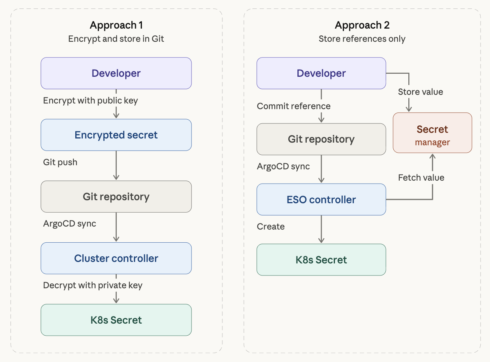
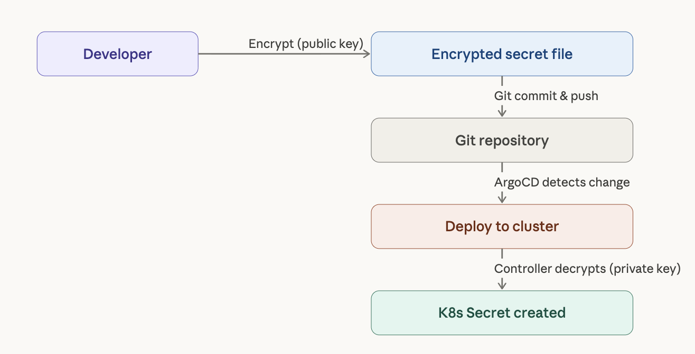
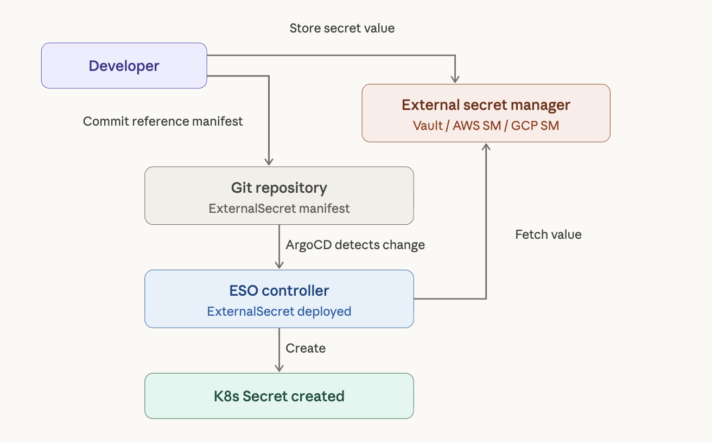
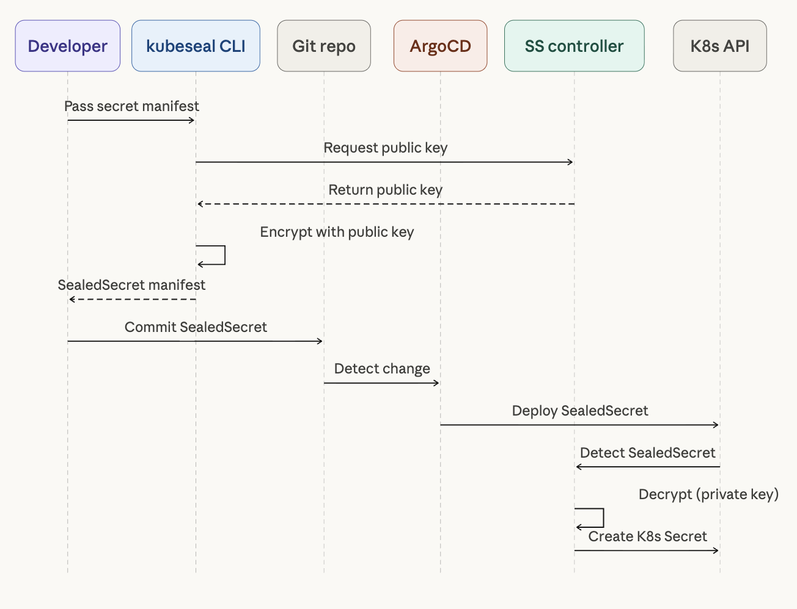
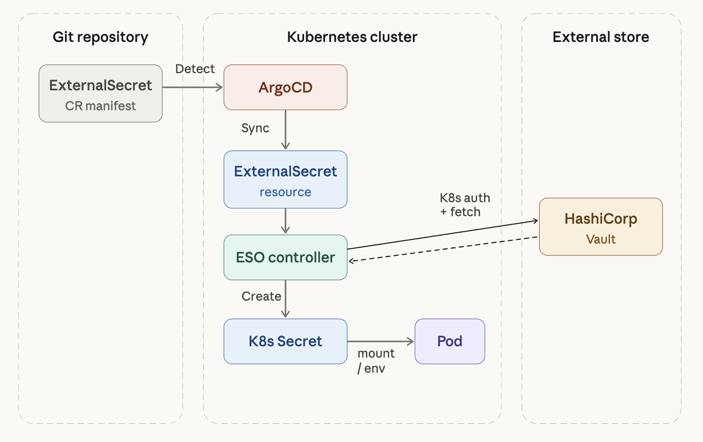
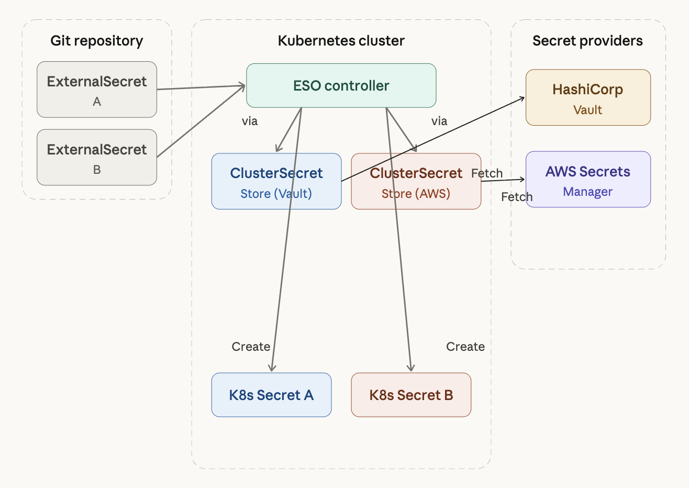
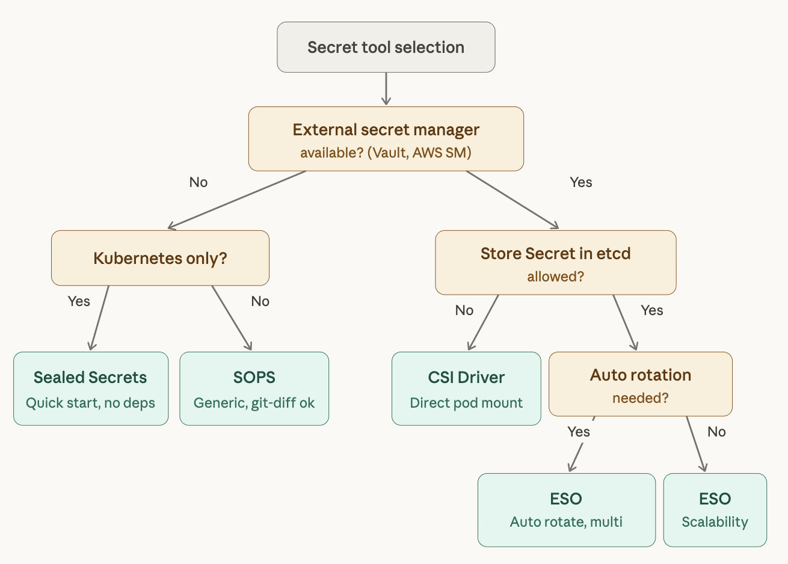

## Introduction

[이전 글]()에서 GitOps의 4가지 핵심 원칙과 ArgoCD 기반의 Pull 방식 배포에 대해 다뤘다. GitOps의 핵심은 Git 레포지토리를 Single Source of Truth(SSOT)로 사용하는 것인데, 여기서 한 가지 근본적인 문제가 발생한다. **Secret은 어떻게 관리할 것인가?**

시대생팀에서도 ArgoCD가 GitHub의 gitops 레포지토리를 바라보도록 설정해두었고, 그 안에 HashiCorp Vault를 Helm chart vendoring 방식으로 띄워서 운영하고 있다. Vault를 처음 초기화했을 때 5개의 Unseal 키를 받고, 3개를 입력해서 unseal하는 과정을 거쳤는데 — 이 과정에서 "Vault의 시크릿을 ArgoCD가 어떻게 실제 변수로 읽어서 사용할 수 있는가?"라는 질문이 생겼다.

결론부터 말하면, **External Secrets Operator**라는 도구를 통해 Vault에 저장된 시크릿을 Kubernetes Secret으로 자동 변환하는 구조를 만들 수 있다. 이 글에서는 이 경험을 바탕으로 GitOps 환경에서 Secret을 안전하게 관리하는 방법론과 각 도구의 특징을 정리한다.

```yaml
# 이런 식으로 Git에 올리면 안 된다
apiVersion: v1
kind: Secret
metadata:
  name: db-credentials
type: Opaque
data:
  password: cGFzc3dvcmQxMjM=  # echo -n "password123" | base64
```

위 매니페스트를 Git에 커밋하는 순간, `echo "cGFzc3dvcmQxMjM=" | base64 -d`만으로 원본 비밀번호가 노출된다. Kubernetes Secret은 base64 인코딩일 뿐 암호화가 아니다. 레포지토리가 private이더라도 Git의 분산 특성상 clone한 모든 로컬 복사본에 비밀번호가 남게 되므로, 한 번이라도 평문으로 커밋되면 이미 유출된 것으로 간주해야 한다.

---

## 1. GitOps에서 Secret이 어려운 이유

GitOps의 원칙을 다시 떠올려보면, 모든 것을 **선언적으로 Git에 정의**하고, 에이전트가 이를 Pull해서 클러스터에 적용한다. 문제는 Secret도 Kubernetes 리소스이기 때문에 GitOps의 원칙에 따르면 Git에 있어야 한다는 점이다.

하지만 보안 원칙은 반대를 요구한다. 민감 정보는 절대 버전 관리 시스템에 평문으로 저장하면 안 된다. 한 번이라도 평문 Secret이 커밋되면, `git log`로 히스토리를 추적해서 되돌리더라도 이미 분산된 모든 복사본에 해당 정보가 남아있다.

이 두 원칙의 충돌을 해결하기 위해 크게 **두 가지 아키텍처 접근법**이 등장했다.



### 접근법 1: 암호화된 Secret을 Git에 저장

Secret을 암호화한 후 Git에 커밋하는 방식이다. 클러스터 내부의 컨트롤러가 복호화해서 Kubernetes Secret으로 변환한다.



대표 도구로는 **Bitnami Sealed Secrets**와 **Mozilla SOPS**가 있다.

### 접근법 2: Secret의 참조(Reference)만 Git에 저장

실제 Secret 값은 외부 시크릿 매니저(HashiCorp Vault, AWS Secrets Manager 등)에 저장하고, Git에는 "어떤 시크릿 매니저의 어떤 키를 가져와라"는 참조만 커밋하는 방식이다.



대표 도구로는 **External Secrets Operator**(ESO)와 **Secrets Store CSI Driver**가 있다.

> ArgoCD 공식 문서에서도 **목적지 클러스터에서 Secret을 생성하는 방식**(접근법 1, 2 모두 해당)을 권장하고 있다. ArgoCD가 매니페스트 생성 과정에서 Secret을 주입하는 방식은 Redis 캐시에 평문이 저장되는 보안 위험이 있고, Sync 작업과 Secret 업데이트가 결합되는 UX 문제가 있기 때문이다.

## 2. Vault의 기본: Unseal 메커니즘 이해하기

External Secrets Operator를 다루기 전에, Vault 자체의 보안 메커니즘을 먼저 이해할 필요가 있다. Vault는 시작할 때 **Sealed 상태**로 올라오며, 이 상태에서는 어떤 시크릿도 읽거나 쓸 수 없다.

### Shamir's Secret Sharing

Vault의 Unseal은 **Shamir's Secret Sharing**이라는 암호학 알고리즘에 기반한다. 초기화(`vault operator init`) 시점에 마스터 키를 N개의 조각(key shares)으로 쪼개고, 그 중 T개(threshold)를 모아야 복원할 수 있게 설정한다.

```bash
# Vault 초기화 — 5개 키 조각, 3개가 threshold
vault operator init -key-shares=5 -key-threshold=3
```

예를 들어 `key-shares=5, key-threshold=3`이면 5개 키 중 3개를 입력해야 unseal이 된다. 한 사람이 마스터 키 전체를 갖고 있으면 single point of compromise가 되니까, 키 조각을 서로 다른 담당자에게 분산하는 것이 원래 의도다.

### 개발 환경 vs 프로덕션의 차이

실제로 Vault를 처음 셋업하면 한 사람이 5개 키를 전부 받고 직접 3개를 입력해서 unseal하게 되는데, 이건 개발 환경에서는 일반적이지만 프로덕션에서는 그대로 쓰면 안 된다. Shamir's Secret Sharing의 분산 의미가 사라지기 때문이다.

프로덕션에서는 보통 두 가지 방식 중 하나를 택한다.

**키 분산**: init 시점에 키 조각을 서로 다른 담당자에게 나눠준다. 5개 키를 5명이 하나씩 갖고, 재시작 시 3명이 각자 자기 키를 입력하는 방식이다. 하지만 소규모 팀에서는 매번 Pod 재시작할 때마다 3명을 모아서 unseal하는 것이 현실적으로 어렵다.

**Auto Unseal**: AWS KMS, GCP Cloud KMS 같은 외부 KMS에 마스터 키 암호화를 위임하면, Vault Pod가 재시작될 때 자동으로 unseal된다. 이것이 사실상 표준이다.

```yaml
# Vault Helm values.yaml — AWS KMS Auto Unseal 설정
server:
  ha:
    enabled: true
    config: |
      seal "awskms" {
        region     = "ap-northeast-2"
        kms_key_id = "arn:aws:kms:ap-northeast-2:123456:key/abcd-1234"
      }
```

Auto Unseal을 사용하면 Shamir 키 조각 자체가 필요 없어지고, 보안 경계가 KMS의 IAM 정책으로 넘어간다. 온프렘 k3s 환경에서도 AWS API만 호출할 수 있으면 되므로, IAM Roles Anywhere 등을 통해 연결할 수 있다.

> 추가로, 초기화 때 받는 **Root Token**은 초기 policy 설정이 끝나면 `vault token revoke`로 폐기하는 것이 정석이다. 이후에는 Kubernetes Auth 같은 identity 기반 인증만 사용해야 한다.

---

## 3. Bitnami Sealed Secrets

Sealed Secrets는 GitOps 환경에서 가장 접근하기 쉬운 Secret 관리 도구다. 별도의 외부 시크릿 매니저 없이 **공개키 암호화**를 활용해서 Secret을 안전하게 Git에 저장할 수 있다.

### 동작 원리

Sealed Secrets는 비대칭 암호화(AES-256-GCM)를 사용한다. 클러스터에 설치된 SealedSecrets 컨트롤러가 키 쌍(공개키/비밀키)을 생성하고, 개발자는 `kubeseal` CLI로 공개키를 사용해 Secret을 암호화한다. 복호화는 클러스터 내부의 컨트롤러만 할 수 있다.



### 설치 및 사용

```bash
# SealedSecrets 컨트롤러 설치
helm repo add sealed-secrets https://bitnami-labs.github.io/sealed-secrets
helm install sealed-secrets sealed-secrets/sealed-secrets \
  --namespace kube-system

# kubeseal CLI 설치 (macOS)
brew install kubeseal
```

일반적인 Kubernetes Secret을 만든 후 `kubeseal`로 암호화하면 된다.

```bash
# 1. 일반 Secret 매니페스트 작성
cat <<EOF > secret.yaml
apiVersion: v1
kind: Secret
metadata:
  name: db-credentials
  namespace: default
type: Opaque
stringData:
  username: admin
  password: super-secret-password
EOF

# 2. kubeseal로 암호화
kubeseal --format yaml < secret.yaml > sealed-secret.yaml

# 3. 원본 삭제, 암호화된 파일만 Git에 커밋
rm secret.yaml
git add sealed-secret.yaml
git commit -m "feat: add encrypted db credentials"
```

생성된 SealedSecret 매니페스트는 다음과 같다.

```yaml
apiVersion: bitnami.com/v1alpha1
kind: SealedSecret
metadata:
  name: db-credentials
  namespace: default
spec:
  encryptedData:
    username: AgBy3i4OJSWK+PiTySYZZA9rO43...  # 암호화된 값
    password: AgCtr8bMOav3wHNEQ14FVg7B2K2...  # 암호화된 값
  template:
    metadata:
      name: db-credentials
      namespace: default
    type: Opaque
```

이 파일은 암호화되어 있으므로 Git에 안전하게 저장할 수 있다. 클러스터에 배포되면 SealedSecrets 컨트롤러가 자동으로 복호화하여 일반 Kubernetes Secret을 생성한다.

### 장단점

Sealed Secrets의 장점은 **외부 의존성이 없다**는 것이다. Vault 같은 별도 인프라 없이 컨트롤러 하나만 설치하면 바로 사용할 수 있고, GitOps 워크플로우와 자연스럽게 통합된다.

반면 **클러스터에 종속적**이라는 한계가 있다. 각 클러스터마다 고유한 키 쌍이 생성되므로, 같은 Secret을 여러 클러스터에 배포하려면 클러스터별로 각각 암호화해야 한다. 멀티 클러스터 환경에서는 관리 부담이 급격히 증가한다. Secret 로테이션도 수동으로 재암호화해야 하는 번거로움이 있고, 런타임 시크릿 관리에는 적합하지 않다.

---

## 4. Mozilla SOPS (Secrets OPerationS)

SOPS는 Kubernetes에 한정되지 않는 범용 암호화/복호화 도구다. YAML, JSON, ENV, INI, BINARY 형식을 지원하며, AWS KMS, GCP KMS, Azure Key Vault, age, PGP 등 다양한 키 관리 백엔드와 통합된다.

### Sealed Secrets와의 핵심 차이

Sealed Secrets는 파일 전체를 암호화하는 반면, SOPS는 **값(value)만 선택적으로 암호화**한다. 암호화된 파일의 구조를 그대로 읽을 수 있어서 코드 리뷰나 `git diff` 확인이 훨씬 수월하다.

또 하나의 중요한 차이는 암/복호화가 일어나는 위치다. Sealed Secrets는 서버사이드(클러스터)에서 처리하지만, SOPS는 **클라이언트 사이드**에서 처리한다. CI/CD 파이프라인에서 복호화 키에 대한 접근 권한이 필요하다는 의미이기도 하다.

```yaml
# SOPS로 암호화된 파일 — 키는 읽히고 값만 암호화됨
apiVersion: v1
kind: Secret
metadata:
  name: db-credentials
type: Opaque
stringData:
  username: ENC[AES256_GCM,data:7WgPOw==,iv:...,tag:...,type:str]
  password: ENC[AES256_GCM,data:K8vXzR5u...,iv:...,tag:...,type:str]
sops:
  kms:
    - arn: arn:aws:kms:ap-northeast-2:123456789012:key/xxxx-xxxx
  lastmodified: "2026-03-26T12:00:00Z"
  version: 3.9.0
```

### 설치 및 사용

```bash
# SOPS 설치 (macOS)
brew install sops

# age 키 생성 (PGP의 현대적 대안)
age-keygen -o age.key
```

`.sops.yaml` 설정 파일로 암호화 대상을 세밀하게 제어할 수 있다.

```yaml
# .sops.yaml
creation_rules:
  - path_regex: \.yaml$
    encrypted_regex: "^(data|stringData)$"
    age: age1ql3z7hjy54pw3hyww5ayyfg7zqgvc7w3j2elw8zmrj2kg5sfn9aqmcac8p
```

```bash
# 암호화
sops -e secret.yaml > secret.enc.yaml

# 인플레이스 편집 (복호화 → 편집 → 저장 시 자동 재암호화)
sops secret.enc.yaml
```

### ArgoCD 통합 시 주의점

SOPS를 ArgoCD와 함께 사용하려면 **KSOPS**(Kustomize SOPS 플러그인)를 활용해야 한다. ArgoCD의 커스텀 이미지를 빌드하거나 Kustomize 플러그인을 설정하는 추가 작업이 필요하다. Flux에서는 SOPS가 네이티브 지원되어 별도 플러그인이 필요 없지만, ArgoCD 환경이라면 이 추가 설정 비용을 고려해야 한다.

### 장단점

SOPS의 강점은 **범용성**이다. Kubernetes Secret 뿐만 아니라 Helm의 `values.yaml`, Terraform의 `.tfvars` 등 어떤 설정 파일이든 암호화할 수 있다. 값만 선택적으로 암호화하기 때문에 `git diff`로 변경 사항을 구조적으로 확인 가능하다는 것도 큰 장점이다. 클라우드 KMS와 통합하면 키 관리 부담도 줄일 수 있다.

단점으로는 ArgoCD와의 통합 시 추가 작업이 필요하다는 점, 팀과 클러스터가 늘어나면 키 배포와 관리가 복잡해진다는 점이 있다.

---

## 5. External Secrets Operator (ESO)

ESO는 현재 GitOps 환경에서 **가장 권장되는** Secret 관리 방식이다. 시대생팀에서도 ArgoCD + Vault 환경에서 ESO를 통해 시크릿을 관리하고 있다. 실제 Secret 값은 외부 시크릿 매니저에 저장하고, Git에는 "어디서 뭘 가져와라"라는 참조만 커밋한다.

### 왜 ESO가 필요한가

GitOps 레포에 실제 시크릿 값을 평문으로 넣으면 안 되지만, ArgoCD는 Git에 있는 매니페스트를 그대로 클러스터에 sync하는 구조라 "Vault에서 꺼내와"라는 걸 알 방법이 없다. ESO가 바로 이 간극을 메워주는 역할을 한다.

전체 체인은 다음과 같다.

```
Git(ExternalSecret CR) → ArgoCD sync → ESO Controller가 감지
  → Vault에서 fetch → K8s Secret 생성 → Pod가 Secret mount/env로 사용
```



### 핵심 CR(Custom Resource) 정리

ESO는 여러 CRD를 제공하며, 역할에 따라 나뉜다.

**1) SecretStore vs ClusterSecretStore**

둘 다 "외부 시크릿 매니저에 어떻게 접속할지"를 정의하며, 스코프가 다르다.

SecretStore는 특정 namespace에 종속된다. 그 namespace의 ExternalSecret만 이 store를 참조할 수 있어서, 팀별로 namespace를 나눠 쓰고 접근 범위를 제한하고 싶을 때 적합하다.

ClusterSecretStore는 클러스터 전역이다. 어떤 namespace의 ExternalSecret이든 참조할 수 있어서, 소규모 팀에서 Vault 하나를 공용으로 쓸 때 편리하다.

```yaml
apiVersion: external-secrets.io/v1beta1
kind: ClusterSecretStore
metadata:
  name: vault-backend
spec:
  provider:
    vault:
      server: "http://vault.vault.svc.cluster.local:8200"
      path: "secret"          # KV 시크릿 엔진 마운트 경로
      version: "v2"           # KV v2 사용 시
      auth:
        kubernetes:
          mountPath: "kubernetes"
          role: "eso-role"     # Vault에 미리 만들어둔 role
          serviceAccountRef:
            name: "external-secrets"
            namespace: "external-secrets"
```

핵심은 `auth` 블록이다. Vault의 Kubernetes Auth Method를 사용하면 ESO의 ServiceAccount 토큰으로 인증하므로 별도 토큰을 Git에 넣을 필요가 없다. Vault 쪽에서 이 role에 어떤 policy를 붙이느냐로 접근 범위를 제어한다.

**2) ExternalSecret**

"뭘 가져올지"를 선언하는 CR이다. 가장 많이 사용하게 되는 리소스다.

```yaml
apiVersion: external-secrets.io/v1beta1
kind: ExternalSecret
metadata:
  name: my-app-secrets
  namespace: production
spec:
  refreshInterval: 1h          # Vault에서 주기적으로 재조회
  secretStoreRef:
    name: vault-backend
    kind: ClusterSecretStore
  target:
    name: my-app-secrets       # 생성될 K8s Secret 이름
    creationPolicy: Owner      # ExternalSecret 삭제 시 Secret도 삭제
  data:
    - secretKey: DB_PASSWORD
      remoteRef:
        key: secret/data/production/my-app
        property: db_password
    - secretKey: API_KEY
      remoteRef:
        key: secret/data/production/my-app
        property: api_key
```

이 매니페스트에는 **실제 Secret 값이 전혀 포함되어 있지 않다**. Vault의 `secret/data/production/my-app` 경로에서 `db_password`, `api_key`를 가져와서 `my-app-secrets`라는 K8s Secret을 만들어달라는 참조만 있을 뿐이다.

`dataFrom`을 사용하면 경로 하나에 있는 모든 키를 통째로 가져올 수도 있다.

```yaml
spec:
  dataFrom:
    - extract:
        key: secret/data/production/my-app
  # Vault 해당 경로의 모든 key-value가 K8s Secret data로 들어감
```

Vault에 키가 많을 때 일일이 매핑하지 않아도 돼서 편리하다.

**3) ClusterExternalSecret**

ExternalSecret의 클러스터 전역 버전이다. 여러 namespace에 동일한 Secret을 배포해야 할 때 사용한다. 와일드카드 TLS 인증서나 공용 이미지 풀 시크릿 같은 것을 여러 namespace에 뿌릴 때 유용하다.

```yaml
apiVersion: external-secrets.io/v1beta1
kind: ClusterExternalSecret
metadata:
  name: shared-tls-cert
spec:
  namespaceSelector:
    matchLabels:
      needs-tls: "true"       # 이 label이 있는 모든 ns에 배포
  externalSecretSpec:
    refreshInterval: 24h
    secretStoreRef:
      name: vault-backend
      kind: ClusterSecretStore
    target:
      name: wildcard-tls
    data:
      - secretKey: tls.crt
        remoteRef:
          key: secret/data/shared/tls
          property: certificate
      - secretKey: tls.key
        remoteRef:
          key: secret/data/shared/tls
          property: private_key
```

**4) PushSecret (역방향)**

반대로 K8s Secret → Vault로 밀어넣는 CR이다. cert-manager가 자동 발급한 인증서를 Vault에 백업하는 등의 용도로 사용한다. 자주 쓰는 것은 아니지만 알아두면 유용하다.

### Vault Kubernetes Auth 설정 (전제 조건)

ESO가 Vault에 접근하려면 Vault 쪽에서 Kubernetes Auth를 활성화하고 적절한 role과 policy를 설정해야 한다. 이것이 전체 체인의 핵심 전제 조건이다.

```bash
# 1. Vault에서 Kubernetes Auth 활성화
vault auth enable kubernetes

# 2. K8s API 서버 정보 등록
vault write auth/kubernetes/config \
  kubernetes_host="https://kubernetes.default.svc"

# 3. ESO가 사용할 role 생성
vault write auth/kubernetes/role/eso-role \
  bound_service_account_names=external-secrets \
  bound_service_account_namespaces=external-secrets \
  policies=my-app-read \
  ttl=1h

# 4. 읽기 전용 policy 생성
vault policy write my-app-read - <<EOF
path "secret/data/*" {
  capabilities = ["read"]
}
EOF
```

이 설정이 되어 있어야 ESO → Vault 인증 체인이 연결된다.

---

## 6. 멀티 프로바이더: Vault + AWS Secrets Manager 병행

ESO의 설계가 뛰어난 이유 중 하나는 **Provider를 추상화**해놓았다는 점이다. SecretStore가 "어디서 가져올지"를, ExternalSecret이 "뭘 가져올지"를 분리해놨기 때문에, 백엔드를 Vault에서 AWS Secrets Manager로 바꿔도 ExternalSecret은 `remoteRef.key` 형식만 약간 달라지고 나머지는 동일하다.

### AWS Secrets Manager용 ClusterSecretStore

```yaml
apiVersion: external-secrets.io/v1beta1
kind: ClusterSecretStore
metadata:
  name: aws-secrets-manager
spec:
  provider:
    aws:
      service: SecretsManager
      region: ap-northeast-2
      auth:
        jwt:
          serviceAccountRef:
            name: external-secrets
            namespace: external-secrets
```

Vault 때 `spec.provider.vault`였던 것이 `spec.provider.aws`로 바뀐 것뿐이다. EKS 환경이라면 IRSA(IAM Roles for Service Accounts)로 깔끔하게 인증할 수 있고, k3s 온프렘 환경이라면 IAM Roles Anywhere 또는 직접 accessKeyID/secretAccessKey를 참조하는 방법을 사용한다.

### ExternalSecret의 차이

ExternalSecret 쪽에서 바뀌는 것은 `secretStoreRef.name`과 `remoteRef.key`의 형식 정도다.

```yaml
apiVersion: external-secrets.io/v1beta1
kind: ExternalSecret
metadata:
  name: my-app-secrets
  namespace: production
spec:
  refreshInterval: 1h
  secretStoreRef:
    name: aws-secrets-manager      # provider만 바뀜
    kind: ClusterSecretStore
  target:
    name: my-app-secrets
  data:
    - secretKey: DB_PASSWORD
      remoteRef:
        key: production/my-app     # AWS SM 시크릿 이름
        property: db_password      # JSON 안의 필드
```

### 하이브리드 구성

ClusterSecretStore를 여러 개 만들면 Vault와 AWS Secrets Manager를 동시에 사용할 수 있다. ExternalSecret의 `secretStoreRef.name`만 바꿔서 시크릿마다 어디서 가져올지 선택하면 된다.



Vault를 메인 프로바이더로 사용하면서 AWS 리소스 관련 시크릿(RDS 비밀번호 등)만 AWS Secrets Manager에서 직접 당겨오는 하이브리드 구성이 현실적이다. ESO는 이 외에도 GCP Secret Manager, Azure Key Vault, 1Password, Doppler 등 다양한 프로바이더를 지원하며, 구조는 전부 동일하고 `spec.provider` 아래 블록만 달라진다.

---

## 7. Secrets Store CSI Driver

Secrets Store CSI Driver는 앞서 다룬 도구들과 접근 방식이 다르다. Kubernetes Secret을 생성하는 대신 **Pod에 볼륨으로 직접 마운트**하는 방식이다. 엄격한 컴플라이언스 요구사항으로 인해 etcd에 Secret을 저장하는 것 자체가 허용되지 않는 환경에서 선택하는 옵션이다.

```yaml
apiVersion: secrets-store.csi.x-k8s.io/v1
kind: SecretProviderClass
metadata:
  name: vault-db-creds
spec:
  provider: vault
  parameters:
    vaultAddress: "https://vault.example.com"
    roleName: "my-app"
    objects: |
      - objectName: "db-password"
        secretPath: "secret/data/db-credentials"
        secretKey: "password"
```

Pod이 스케줄링되면 CSI Driver가 외부 매니저에서 Secret을 가져와 파일로 마운트한다. 기본적으로 볼륨 마운트 방식이므로 환경 변수로 Secret을 주입하거나 이미지 풀 시크릿으로 사용하려면 별도의 sync 설정이 필요하다. DaemonSet으로 배포되기 때문에 노드마다 리소스를 사용한다는 부담도 있다.

실무에서는 **ESO로 대부분의 Secret을 관리**하고, 특수한 컴플라이언스 요구사항이 있는 경우에만 CSI Driver를 병행하는 패턴이 일반적이다.

---

## 8. 도구 비교 및 선택 가이드



| 항목 | Sealed Secrets | SOPS | ESO | CSI Driver |
|------|---------------|------|-----|------------|
| **접근법** | Git에 암호화 저장 | Git에 암호화 저장 | 외부 매니저 참조 | 외부 매니저 참조 |
| **외부 의존성** | 없음 | KMS(선택) | 필수 | 필수 |
| **암호화 단위** | 파일 전체 | 값만 선택적 | 해당 없음 | 해당 없음 |
| **Secret 로테이션** | 수동 재암호화 | 수동 재암호화 | 자동 (refreshInterval) | 자동 |
| **멀티 클러스터** | 클러스터별 별도 암호화 | KMS로 공유 가능 | 동일 매니저 참조 | 동일 매니저 참조 |
| **ArgoCD 통합** | 자연스러움 | KSOPS 필요 | 자연스러움 | 자연스러움 |
| **Flux 통합** | 자연스러움 | 네이티브 지원 | 자연스러움 | 자연스러움 |
| **초기 구축 비용** | 낮음 | 낮음 | 중간~높음 | 중간~높음 |
| **확장성** | 낮음 | 중간 | 높음 | 높음 |
| **멀티 프로바이더** | 불가 | KMS 단위 | 지원 | 지원 |

### 상황별 추천

**소규모 팀, 단일 클러스터, 빠르게 시작하고 싶을 때** → **Sealed Secrets**가 적합하다. 외부 인프라 없이 바로 사용 가능하고 학습 곡선이 낮다.

**GitOps + IaC 통합, Helm values 암호화가 필요할 때** → **SOPS**가 적합하다. Kubernetes에 한정되지 않는 범용성이 강점이다. 다만 ArgoCD 환경이라면 KSOPS 설정에 추가 노력이 필요하다.

**프로덕션 환경, 멀티 클러스터, 자동 로테이션이 필요할 때** → **External Secrets Operator**가 적합하다. 초기 구축 비용이 있지만 장기적으로 가장 운영 부담이 적다. ArgoCD 공식 문서에서도 이 방식을 권장하고 있다.

**etcd에 Secret을 저장하면 안 되는 컴플라이언스 요구사항이 있을 때** → **CSI Driver**를 선택하거나 ESO와 병행한다.

---

## 9. 실전 아키텍처: ESO + Vault + ArgoCD

프로덕션에서 가장 흔히 사용되는 조합을 정리한다. 시대생팀에서도 이와 유사한 구조로 운영하고 있다.

### GitOps 레포지토리 구조

```
gitops/
├── vault/                        # Vault Helm chart vendoring
│   ├── Chart.yaml
│   ├── charts/
│   └── values.yaml
├── external-secrets/             # ESO Helm chart vendoring
│   ├── Chart.yaml
│   ├── charts/
│   └── values.yaml
├── cluster-secret-stores/
│   └── vault-backend.yaml        # ClusterSecretStore
└── apps/
    └── my-app/
        ├── base/
        │   ├── deployment.yaml
        │   ├── service.yaml
        │   └── externalsecret.yaml   # Secret 참조 매니페스트
        └── overlays/
            ├── dev/
            │   └── externalsecret-patch.yaml  # Vault 경로를 dev로
            └── prod/
                └── externalsecret-patch.yaml  # Vault 경로를 prod로
```

Vault와 ESO 모두 동일하게 Helm chart vendoring 방식으로 gitops 레포에 관리한다. 환경별 분리는 Kustomize overlay에서 ExternalSecret의 `remoteRef.key` 경로만 바꿔주면 된다. `secret/data/dev/my-app` → `secret/data/prod/my-app` 식으로 구조는 같고 경로만 다르다.

### ArgoCD Application 배포 순서

ArgoCD에서 이 구조를 사용할 때 **배포 순서가 중요**하다. ESO의 CRD가 먼저 설치되어야 ExternalSecret을 배포할 수 있기 때문이다.

```
1단계: ESO 설치 (CRD 포함)
2단계: ClusterSecretStore 배포
3단계: ExternalSecret이 포함된 앱 배포
```

ArgoCD의 **sync wave**로 이 순서를 제어할 수 있다. Sentry나 다른 CRD 기반 앱을 띄울 때 사용한 것과 동일한 패턴이다.

```yaml
# ESO Application에 sync wave -2 부여
metadata:
  annotations:
    argocd.argoproj.io/sync-wave: "-2"

# ClusterSecretStore에 sync wave -1 부여
metadata:
  annotations:
    argocd.argoproj.io/sync-wave: "-1"

# 나머지 앱은 기본값(0)으로 배포
```

### 배포 E2E 흐름

1. 개발자가 Vault UI 또는 CLI로 `secret/data/production/my-app`에 Secret 값을 저장한다.
2. GitOps 레포지토리에 ExternalSecret 매니페스트를 커밋한다.
3. ArgoCD가 변경을 감지하고 ExternalSecret을 클러스터에 sync한다.
4. ESO Controller가 Vault Kubernetes Auth로 인증 후 Secret 값을 조회한다.
5. ESO가 Kubernetes Secret `my-app-secrets`를 생성한다.
6. Deployment가 해당 Secret을 `envFrom`으로 참조한다.

Secret 값이 Vault에서 변경되면, ESO의 `refreshInterval`에 따라 자동으로 Kubernetes Secret이 업데이트된다. 애플리케이션의 재시작이 필요한 경우 **Stakater Reloader**를 함께 사용하면 Secret 변경 시 자동으로 Rolling Restart를 트리거할 수 있다.

```yaml
apiVersion: apps/v1
kind: Deployment
metadata:
  name: api-server
  annotations:
    reloader.stakater.com/auto: "true"  # Secret 변경 시 자동 재시작
spec:
  template:
    spec:
      containers:
        - name: api-server
          envFrom:
            - secretRef:
                name: my-app-secrets
```

---

## 10. 베스트 프랙티스 정리

GitOps 환경에서 Secret을 관리할 때 공통적으로 지켜야 할 원칙을 정리한다.

### Git 레포지토리에서의 원칙

**평문 Secret은 절대 커밋하지 않는다.** pre-commit hook이나 CI 단계에서 `detect-secrets` 같은 도구로 평문 Secret 커밋을 자동 차단하는 것이 좋다.

```yaml
# .pre-commit-config.yaml 예시
repos:
  - repo: https://github.com/Yelp/detect-secrets
    rev: v1.4.0
    hooks:
      - id: detect-secrets
        args: ['--baseline', '.secrets.baseline']
```

**Secret 관련 매니페스트는 별도 디렉토리로 분리한다.** RBAC이나 코드 리뷰 정책을 Secret 관련 파일에 더 엄격하게 적용할 수 있다.

### 운영에서의 원칙

**Secret 로테이션 정책을 수립한다.** 외부 시크릿 매니저를 사용한다면 자동 로테이션을 설정하고, 암호화 방식을 사용한다면 정기적인 재암호화 일정을 잡는다.

**최소 권한 원칙을 적용한다.** Vault의 Kubernetes Auth에서 role별로 policy를 분리하여, 각 애플리케이션이 자신에게 필요한 Secret만 접근할 수 있도록 한다.

```bash
# my-app은 자기 경로만 읽을 수 있는 policy
vault policy write my-app-read - <<EOF
path "secret/data/production/my-app" {
  capabilities = ["read"]
}
EOF
```

**Vault Root Token은 초기 설정 후 반드시 폐기한다.** 이후에는 Kubernetes Auth 같은 identity 기반 인증만 사용한다.

### ArgoCD 특화 프랙티스

ArgoCD 공식 문서에서는 **목적지 클러스터에서 Secret을 관리하는 방식**을 권장한다. 이유는 세 가지다.

첫째, ArgoCD가 Secret 값에 직접 접근할 필요가 없어 보안 위험이 줄어든다. ArgoCD는 매니페스트를 Redis 캐시에 평문으로 저장하기 때문에, 매니페스트 생성 단계에서 Secret을 주입하면 Redis에 평문 Secret이 캐시된다.

둘째, Secret 업데이트가 앱 Sync와 분리된다. ESO 같은 Operator 방식에서는 Secret이 독립적으로 업데이트되므로, 무관한 배포 과정에서 의도치 않게 Secret이 변경되는 위험이 없다.

셋째, Rendered Manifests 패턴과 호환된다. 이 패턴은 GitOps에서 점점 주류가 되고 있으며, 매니페스트 생성 단계에서 Secret을 주입하는 방식과는 호환되지 않는다.

---

## 마치며

GitOps에서의 Secret 관리는 "Git에 모든 것을 저장한다"는 원칙과 "민감 정보를 보호한다"는 원칙 사이의 균형을 찾는 문제다. [이전 글]()에서 다뤘던 GitOps의 핵심 원칙 — 선언적 정의, 버전 관리, Pull 기반 배포, 지속적 조정 — 을 유지하면서도 Secret을 안전하게 다루려면, 적절한 도구 선택과 운영 프랙티스가 필수적이다.

정리하면 다음과 같다.

**소규모이고 빠르게 시작하고 싶다면 Sealed Secrets**, **프로덕션에서 확장성과 자동화가 필요하다면 External Secrets Operator + Vault(또는 AWS Secrets Manager)** 조합을 권장한다. ArgoCD를 사용하고 있다면, 공식 문서에서 권장하는 대로 Operator 기반의 목적지 클러스터 Secret 관리 방식을 채택하는 것이 장기적으로 가장 안전하고 유지보수가 수월한 선택이다.

ESO는 Provider 추상화 덕분에 Vault에서 시작하더라도, 이후 AWS Secrets Manager나 GCP Secret Manager로의 전환이나 하이브리드 구성이 자유롭다. 이것이 ESO를 선택해야 하는 가장 큰 이유이기도 하다.
