[이전 글]()에서 CNI가 Pod에 IP를 부여하고 노드 간 통신을 가능하게 하는 메커니즘을 다뤘다. veth pair, 브릿지, VXLAN 캡슐화 — 결국 OS 네트워크 프리미티브를 조합해서 "플랫한 L3 네트워크"라는 환상을 만드는 것이었다.

이번 글에서는 그 네트워크 위에 **무엇을 더 쌓아야** 수백 개의 서비스가 안전하게, 관측 가능하게, 선언적으로 통신할 수 있는지를 파헤친다. Istio가 iptables로 트래픽을 투명하게 가로채는 방법, Envoy에게 xDS로 설정을 내려보내는 구조, mTLS로 Zero Trust를 구현하는 원리까지 — 서비스 메시의 내부 동작을 커널 레벨부터 따라간다.

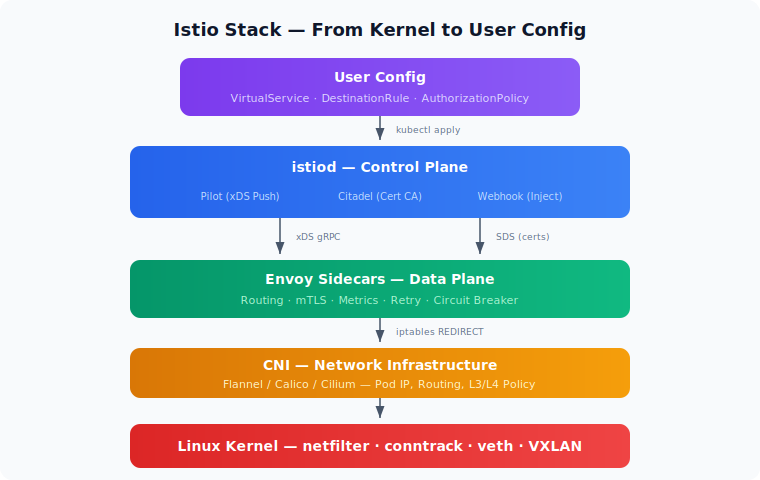

이번 글과 관련한 네트워크 시리즈 포스팅은 다음과 같다.

- [리눅스 네트워크 내부 구조: 인터페이스부터 iptables까지]()
- [쿠버네티스 네트워크의 본질: CNI, VXLAN, 그리고 Pod는 어떻게 통신하는가]()

---

## 전체 아키텍처: Control Plane + Data Plane

[Istio](https://istio.io/)는 Kubernetes 위에서 서비스 간 트래픽 관리, 보안(mTLS), 관측성을 제공하는 오픈소스 서비스 메시다. 앱 코드를 수정하지 않고도 이 모든 기능을 투명하게 적용할 수 있다는 것이 핵심이다.

네트워크를 설명하기 위한 관점에서 istio를 분해해보면, 크게 2가지로 나눌 수 있다.

### Control Plane (istiod)

중앙 관리자. Pilot, Citadel, Galley가 하나로 합쳐진 컴포넌트로, Envoy 프록시들에게 설정을 내려보내는 역할을 한다. Kubernetes API를 watch하면서 Service, Endpoint, VirtualService 같은 리소스 변화를 감지하고, 이를 Envoy가 이해할 수 있는 xDS(discovery service) 설정으로 변환해서 각 사이드카에 push한다.

### Data Plane (Envoy proxies)

실제 트래픽이 흐르는 곳. 모든 Pod에 사이드카로 주입된 Envoy가 트래픽을 가로채서 처리한다.

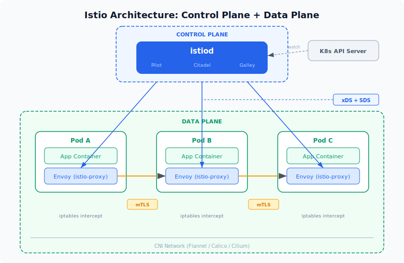

위 그림을 조금 풀어서 설명하면, Pod에 App Container가 뜰 때 istio-proxy라는 사이드카 컨테이너가 함께 뜨게 된다. istio-proxy는 내부적으로 Envoy 프록시를 실행하면서 부트스트랩과 인증서 관리 로직을 추가한 것이기 때문에, "Envoy"와 "istio-proxy"는 사실상 같은 것을 가리킨다.

Pod A에서 Pod B로 요청을 보내면, 앱이 직접 Pod B와 통신하는 것이 아니다. 리눅스 커널의 netfilter가 iptables 규칙을 통해 트래픽을 가로채서 istio-proxy로 넘긴다. 구체적으로는 아웃바운드 트래픽은 OUTPUT 훅에서, 인바운드 트래픽은 PREROUTING 훅에서 각각 Envoy의 리스닝 포트(15001, 15006)로 REDIRECT된다. 결과적으로 **앱은 서로 직접 통신한다고 생각하지만, 실제로는 양쪽의 istio-proxy끼리 통신하는 구조**다.

이 과정에서 istio-proxy끼리는 mTLS(Mutual TLS)로 암호화된 채널을 맺는다. 일반 TLS가 서버만 인증서를 제출하는 것과 달리, mTLS는 클라이언트도 인증서를 제출해서 **양쪽이 서로의 신원을 암호학적으로 검증**한다. 그리고 이 모든 네트워크 설정 — 라우팅 규칙, 인증서, 보안 정책 — 은 상단의 istiod가 xDS라는 프로토콜을 통해 gRPC 스트림으로 각 istio-proxy에 실시간으로 내려보낸다.

---

## 사이드카 주입 메커니즘: Mutating Admission Webhook

### Kubernetes API Server의 요청 처리 파이프라인

`kubectl apply`로 Pod을 생성하면, 그 요청이 API Server에 도달한 뒤 **저장되기 전에** 여러 단계를 거친다:

```
kubectl apply (Pod 생성 요청)
       │
       ▼
  Authentication (인증: 너 누구야?)
       │
       ▼
  Authorization (인가: 너 이 작업 할 권한 있어?)
       │
       ▼
  Mutating Admission Webhooks  ← ★ 여기서 Pod spec을 "변형"할 수 있음
       │
       ▼
  Schema Validation (스키마 검증)
       │
       ▼
  Validating Admission Webhooks  ← 변형은 못 하고, 거부만 가능
       │
       ▼
  etcd에 저장 → Pod 생성 진행
```

**Mutating Admission Webhook**은 이 파이프라인 중간에 끼어들어서 "요청 내용을 수정(mutate)할 수 있는 외부 HTTP 엔드포인트"다. API Server가 Pod 생성 요청을 받으면, 등록된 webhook 서버에 그 요청을 보내고, webhook 서버가 "이 Pod spec에 이런 컨테이너를 추가해"라는 JSON Patch를 응답으로 돌려보내는 구조다.

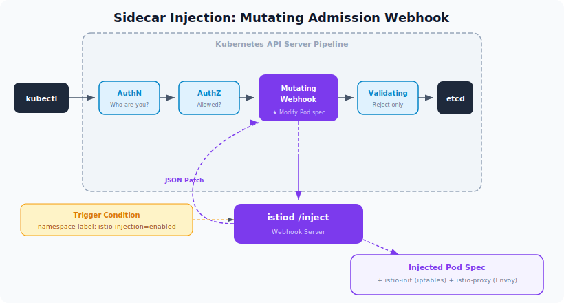

위 그림은 istio를 사용하는 상황에서의 Mutating Admission Webhook이다.

### Istio의 경우 구체적으로

Istio를 설치하면 istiod가 자기 자신을 Mutating Admission Webhook으로 API Server에 등록한다. 이때 "**네임스페이스에 `istio-injection=enabled` 라벨이 있는 경우에만 호출해줘**"라는 조건을 같이 건다.

```yaml
# MutatingWebhookConfiguration (간략화)
apiVersion: admissionregistration.k8s.io/v1
kind: MutatingWebhookConfiguration
metadata:
  name: istio-sidecar-injector
webhooks:
- name: sidecar-injector.istio.io
  clientConfig:
    service:
      name: istiod          # webhook 서버 = istiod
      namespace: istio-system
      path: /inject          # 이 경로로 요청이 감
  namespaceSelector:
    matchLabels:
      istio-injection: enabled   # 이 라벨이 있는 네임스페이스만
  rules:
  - operations: ["CREATE"]
    resources: ["pods"]          # Pod 생성 시에만 동작
```

### 주입 흐름

1. `istio-injection=enabled` 라벨이 붙은 네임스페이스에서 Pod 생성 요청이 들어옴
2. API Server가 "이 네임스페이스에 매칭되는 webhook이 있네" 하고 istiod의 `/inject` 엔드포인트에 Pod spec을 보냄
3. istiod가 Pod spec을 받아서 두 개의 컨테이너를 추가하는 JSON Patch를 응답:
   - **istio-init** (init container) — 기동 시 iptables 규칙을 설정하는 역할
   - **istio-proxy** (sidecar container) — Envoy 프록시 자체
4. API Server가 그 patch를 적용해서 수정된 Pod spec을 etcd에 저장
5. kubelet이 수정된 spec대로 Pod을 띄움 → 사이드카가 같이 뜸

핵심은 **앱 개발자가 Deployment yaml에 Envoy 관련 설정을 전혀 안 써도, webhook이 알아서 끼워넣는다**는 것이다.

Mutating Admission Webhook은 Istio만의 특별한 메커니즘이 아니다. 쿠버네티스 생태계에서 같은 패턴을 쓰는 서비스가 꽤 많다:

- **Vault Agent Injector** — Pod 생성 시 `vault.hashicorp.com/agent-inject: "true"` 어노테이션을 감지해서 Vault Agent 사이드카를 주입한다. 앱이 시크릿을 직접 가져올 필요 없이, 사이드카가 Vault에서 시크릿을 받아 파일로 마운트해준다.
- **Linkerd** — Istio와 같은 서비스 메시지만 더 경량화된 접근. `linkerd.io/inject: enabled` 어노테이션으로 linkerd-proxy 사이드카를 주입한다.
- **AWS App Mesh Controller** — EKS 환경에서 Envoy 사이드카를 자동 주입해서 AWS App Mesh에 연결한다.
- **Cert-manager** — Mutating Webhook으로 Pod이나 Ingress에 TLS 인증서 관련 설정을 자동으로 붙여준다.

패턴은 동일하다 — **특정 라벨이나 어노테이션을 트리거로, Pod spec이 etcd에 저장되기 전에 원하는 컨테이너나 설정을 끼워넣는 것**이다.

비슷한 예로 Prometheus도 어노테이션(`prometheus.io/scrape: "true"`)을 달아서 설정하지만, 동작 방식은 근본적으로 다르다.

- **Istio Mutating Webhook** → Pod spec 자체를 변형한다. 사이드카를 **끼워넣는** 방식. (Push)
- **Prometheus 어노테이션** → Pod은 변하지 않는다. "나 여기 있으니 수집하러 와"라는 힌트만 남기는 방식. (Pull)

둘 다 **라벨/어노테이션이라는 메타데이터를 트리거로 자동화가 동작한다**는 공통점이 있지만, 하나는 Pod을 직접 수정하고 다른 하나는 외부에서 읽어갈 뿐이다.

---

## 트래픽 인터셉트의 핵심: iptables 리다이렉트

istio-init 컨테이너가 설정하는 iptables 규칙의 핵심 로직:

```bash
# 1. ISTIO_REDIRECT 체인 생성 — 모든 트래픽을 Envoy의 15001 포트로 보냄
iptables -t nat -N ISTIO_REDIRECT
iptables -t nat -A ISTIO_REDIRECT -p tcp -j REDIRECT --to-ports 15001

# 2. ISTIO_IN_REDIRECT — 인바운드 트래픽을 Envoy의 15006 포트로
iptables -t nat -N ISTIO_IN_REDIRECT
iptables -t nat -A ISTIO_IN_REDIRECT -p tcp -j REDIRECT --to-ports 15006

# 3. OUTPUT 체인 — Pod에서 나가는 트래픽 가로채기
iptables -t nat -A OUTPUT -p tcp -j ISTIO_OUTPUT

# 4. PREROUTING 체인 — Pod으로 들어오는 트래픽 가로채기
iptables -t nat -A PREROUTING -p tcp -j ISTIO_INBOUND
```

netfilter의 5개 훅 포인트 중에서 **PREROUTING**과 **OUTPUT**이 사용된다. nat 테이블의 REDIRECT 타겟을 써서, 목적지 포트를 Envoy가 리스닝하는 포트로 바꿔버리는 구조다.

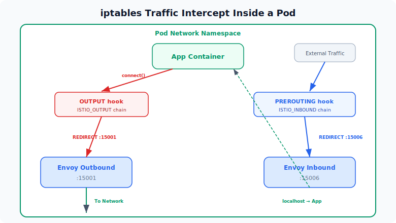

### 무한루프 방지

여기서 한 가지 문제가 생긴다. Envoy도 결국 같은 Pod 안에서 트래픽을 보내는 프로세스다. Envoy가 외부로 보내는 트래픽이 다시 OUTPUT 훅에 잡혀서 자기 자신에게 REDIRECT되면 무한루프에 빠진다.

해결책은 단순하다. istio-proxy 컨테이너는 **UID 1337**로 실행되도록 고정되어 있고, iptables 규칙에서 `--uid-owner 1337`로 나가는 트래픽은 RETURN(인터셉트 건너뜀)시킨다. 즉 "UID 1337이 보낸 패킷이면 → 이미 Envoy가 처리한 트래픽이니까 그냥 보내라"는 뜻이다.

```bash
# Envoy(UID 1337)가 보내는 트래픽은 인터셉트하지 않음
iptables -t nat -A ISTIO_OUTPUT -m owner --uid-owner 1337 -j RETURN
```

### 원래 목적지 복원: SO_ORIGINAL_DST

iptables REDIRECT는 패킷의 목적지 주소를 `127.0.0.1:15001`로 바꿔버린다. 그러면 Envoy는 원래 이 패킷이 어디로 가려던 건지 어떻게 알 수 있을까?

리눅스 커널의 **conntrack**(connection tracking)이 답이다. conntrack은 NAT 변환을 수행할 때 원래 목적지 정보를 커널 내부에 기록해둔다. Envoy는 소켓에 `SO_ORIGINAL_DST` 옵션을 사용해서 이 정보를 조회하면, REDIRECT 전의 원래 목적지 IP와 포트를 복원할 수 있다.

결국 Istio의 트래픽 인터셉트는 **netfilter 훅 → iptables nat REDIRECT → conntrack의 원래 목적지 기록 → SO_ORIGINAL_DST로 복원**이라는 리눅스 커널 네트워크 스택의 기능들을 조합한 구조다.

---

## 실제 요청 흐름 (Pod A → Pod B)

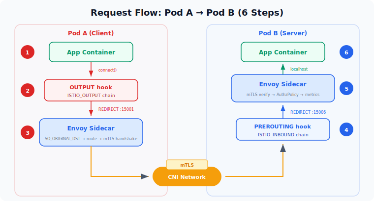

앱 입장에서는 Pod B에 직접 요청을 보내고 직접 응답을 받았다고 느낀다. 하지만 실제로는 다르다 — 모든 트래픽은 OUTPUT과 PREROUTING 훅을 통해 앱에 닿기 전에 Envoy가 먼저 받아서 처리한다. 자세한 스텝은 아래와 같다.

1. **App Container (Pod A)** — 앱이 Pod B의 Service IP:Port로 `connect()` 호출
2. **OUTPUT hook** — netfilter가 ISTIO_OUTPUT 체인에서 매칭, 목적지를 `127.0.0.1:15001`(Envoy outbound)로 REDIRECT
3. **Envoy Sidecar (Pod A)** — `SO_ORIGINAL_DST`로 원래 목적지를 복원하고, xDS 설정에 따라 라우팅 결정(load balancing, retry, timeout 등). istiod가 발급한 인증서로 mTLS 핸드셰이크를 시작하고, Pod B의 실제 IP로 새 연결을 생성
4. **PREROUTING hook** — Pod B에 도착한 트래픽을 ISTIO_INBOUND 체인에서 `127.0.0.1:15006`(Envoy inbound)으로 REDIRECT
5. **Envoy Sidecar (Pod B)** — mTLS 검증, AuthorizationPolicy 체크, 메트릭 수집 후 localhost를 통해 앱 포트로 전달
6. **App Container (Pod B)** — 앱이 요청을 받음. 앱 입장에서는 직접 받은 것처럼 보임

**핵심: 앱은 상대 앱과 직접 통신한다고 생각하지만, 실제로는 양쪽의 Envoy끼리 통신하는 것이다.** 이 구조 덕분에 앱 코드를 전혀 수정하지 않고도 mTLS, 리트라이, 메트릭 수집 등이 투명하게 동작한다.

### Envoy가 제공하는 기능들

이 사이드카 구조 덕분에 앱 코드 수정 없이:

- **트래픽 관리** — VirtualService, DestinationRule로 가중치 기반 라우팅, 카나리 배포, 서킷 브레이커, 리트라이, 타임아웃을 선언적으로 설정
- **보안** — Pod 간 통신이 자동으로 mTLS로 암호화. PeerAuthentication, AuthorizationPolicy로 L7 레벨(HTTP path, method까지) 접근 제어
- **관측성(Observability)** — 모든 요청의 지연시간, 성공률, 처리량을 자동 수집하여 Prometheus 메트릭으로 노출, 분산 트레이싱 헤더 전파, 액세스 로그

---

## Pilot, Citadel, Galley → istiod 통합

Istio 초기 버전(1.4 이전)에는 Control Plane이 별도의 마이크로서비스 3개로 분리돼 있었다.

### Pilot — 트래픽 관리의 두뇌

**"Envoy에게 트래픽을 어떻게 라우팅할지 알려주는 역할."**

Kubernetes의 Service, Endpoint, 그리고 Istio의 VirtualService, DestinationRule 같은 리소스를 watch하면서, 이 정보를 Envoy가 이해하는 **xDS API**(LDS, RDS, CDS, EDS)로 변환해서 각 사이드카에 gRPC 스트림으로 내려보냄. Envoy가 "이 요청은 어디로 보내야 해?", "리트라이는 몇 번?", "타임아웃은?" 같은 걸 아는 건 전부 Pilot이 내려보낸 설정 덕분이다.

### Citadel — 보안 담당 (인증서 관리)

**"서비스 간 mTLS에 쓰이는 인증서를 발급하고 갱신하는 CA(Certificate Authority)."**

각 Envoy 사이드카는 기동할 때 Citadel에게 자기 서비스 ID에 해당하는 X.509 인증서를 요청하고, Citadel이 서명해서 내려준다. 이 인증서가 있어야 Pod A의 Envoy와 Pod B의 Envoy가 서로 mTLS 핸드셰이크를 할 수 있다. 인증서 만료 전 자동 갱신도 Citadel이 담당했다.

### Galley — 설정 검증 및 배포

**"사용자가 작성한 Istio 설정(VirtualService, DestinationRule 등)을 검증하고, 정규화해서 다른 컴포넌트에 전달하는 중간 계층."**

설정이 올바른지 체크하고, 내부 포맷으로 변환하는 전처리기 역할이었다. 다른 컴포넌트가 Kubernetes API를 직접 찔러야 하는 부분을 Galley이 추상화해주려 했다.

### 왜 합쳤나 → istiod

이 3개가 따로 돌아가면서 생긴 문제들:

- **운영 복잡도** — 3개의 Deployment를 각각 배포, 모니터링, 스케일링해야 했음
- **컴포넌트 간 통신** — 서로 네트워크로 통신하다 보니 장애 포인트가 늘어남
- **리소스 오버헤드** — 각각이 별도 프로세스로 메모리와 CPU를 잡아먹음
- **Galley의 존재 의의** — 실제로는 Pilot이 Kubernetes API를 직접 watch하는 게 더 효율적이라, Galley의 추상화 계층이 오히려 복잡도만 추가

Istio 1.5부터 이 세 기능을 **하나의 바이너리 `istiod`로 통합**:

```
istiod = Pilot(트래픽 설정 배포)
       + Citadel(인증서 발급/갱신)
       + Galley(설정 검증)
```

기능은 동일한데 하나의 프로세스에서 돌아가는 것. istiod의 "d"는 Unix 전통의 daemon 네이밍이다 (`sshd`, `httpd`처럼).

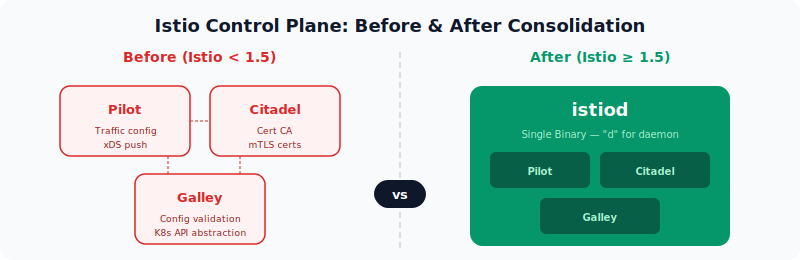

**Before (Istio < 1.5):**

- 3개의 별도 Deployment를 관리해야 함
- 컴포넌트 간 네트워크 호출 필요
- Galley가 불필요한 복잡성을 추가

**After (Istio >= 1.5):**

- 단일 Deployment로 운영이 간편
- 프로세스 내 호출로 네트워크 오버헤드 제거
- 리소스 사용량 감소

---

## Envoy와 Istio의 관계

지금까지 Envoy와 istio-proxy를 혼용해서 썼는데, 이 둘의 관계를 정확히 짚고 넘어가자.

### Envoy는 독립 프로젝트다

**Envoy는 Istio의 일부가 아니다.** 원래 Lyft에서 만든 독립적인 오픈소스 프록시로, 현재는 CNCF graduated 프로젝트다. Istio가 나오기 전부터 존재했고, Istio 없이도 단독으로 쓸 수 있다.

Envoy 자체가 할 수 있는 것들:

- L7 프로토콜 인식 (HTTP/1.1, HTTP/2, gRPC, TCP, MongoDB, Redis 등)
- 로드밸런싱 (Round Robin, Least Request, Ring Hash 등)
- 서킷 브레이커, 리트라이, 타임아웃
- TLS termination / origination
- 관측성 (메트릭, 트레이싱, 액세스 로그)
- 동적 설정 변경 (재시작 없이 xDS API를 통해)

마지막 포인트가 핵심이다 — Envoy는 **설정을 외부에서 동적으로 주입받을 수 있도록 xDS라는 API 인터페이스를 제공**한다.

### Istio는 뭘 하나?

Envoy는 혼자서도 강력하지만, **수십~수백 개의 Envoy를 누가 관리하느냐**는 문제가 있다. Pod이 100개면 Envoy도 100개인데, 각각에게 설정 변경을 알려줘야 한다. Istio는 바로 이 **관리 문제를 해결하는 Control Plane**이다.

비유:

- **Envoy** = 각 교차로에 서 있는 교통경찰. 직접 차량(패킷)을 통제하는 능력이 있음.
- **Istio(istiod)** = 중앙 교통관제센터. 모든 교통경찰에게 실시간으로 지시를 내려보냄.

### istio-proxy = Envoy + a

`kubectl describe pod`에서 보이는 `istio-proxy` 컨테이너는 **Envoy 바이너리 + Istio가 추가한 부트스트랩 로직**이다.

```
istio-proxy 컨테이너 안에서 돌아가는 것:

1. pilot-agent (Istio가 만든 래퍼)
   ├── Envoy 프로세스를 시작하고 관리
   ├── istiod에서 초기 부트스트랩 설정을 가져옴
   ├── 인증서 갱신 처리
   ├── Envoy 헬스체크
   └── Envoy가 죽으면 재시작

2. Envoy (실제 프록시 엔진)
   ├── pilot-agent가 넘겨준 부트스트랩 설정으로 기동
   ├── istiod에 xDS gRPC 연결을 맺고 설정 수신
   └── 실제 트래픽 처리 (라우팅, mTLS, 메트릭 등)
```

**istio-proxy 컨테이너 안에서 실제 트래픽을 처리하는 엔진은 Envoy가 맞다. 다만 Istio가 pilot-agent라는 래퍼로 감싸서 라이프사이클 관리와 istiod 연동을 추가한 것이다.**

### xDS 표준 인터페이스의 의미

이 분리 덕분에:

- **Envoy는 Istio 외에도 여러 Control Plane과 붙을 수 있다.** AWS App Mesh, Consul Connect, Gloo Edge 같은 것들도 Envoy를 데이터 플레인으로 쓰면서 자기만의 Control Plane을 제공한다.
- **Istio도 Envoy 외의 프록시를 데이터 플레인으로 쓸 수 있다.** Ambient Mesh의 ztunnel이 이 케이스다 — Envoy가 아니라 Rust로 새로 작성한 L4 전용 프록시인데, istiod의 xDS를 통해 설정을 받는다.

```
istiod (Control Plane)
   │
   │ xDS API (표준 인터페이스)
   │
   ├──▶ Envoy (사이드카 / waypoint)  — L7 전체 기능
   │
   └──▶ ztunnel (Rust, 노드 레벨)    — L4 특화, 경량
```

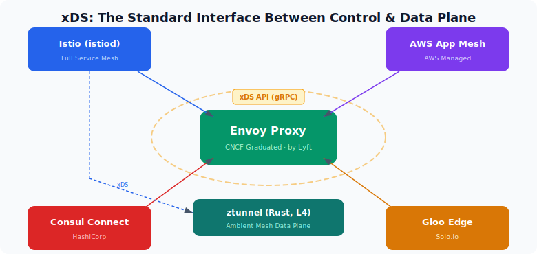

---

## xDS 프로토콜 딥다이브

앞에서 istiod가 Envoy에게 설정을 전달한다고 했는데, 그 "전달"의 구체적인 프로토콜이 바로 xDS다.

### xDS 구성 요소

xDS는 "x Discovery Service"의 약자로, x에 여러 글자가 들어가면서 각각 다른 종류의 설정을 담당한다:

| xDS | 이름 | 역할 |
|-----|------|------|
| **LDS** | Listener Discovery Service | 어떤 포트에서 트래픽을 받을지 |
| **RDS** | Route Discovery Service | 받은 트래픽을 어떤 규칙으로 라우팅할지 |
| **CDS** | Cluster Discovery Service | 라우팅 대상(upstream 그룹)이 뭔지 |
| **EDS** | Endpoint Discovery Service | 각 upstream 그룹의 실제 Pod IP:Port가 뭔지 |
| **SDS** | Secret Discovery Service | mTLS에 쓸 인증서와 키 |

이 5개가 조합되면 Envoy가 트래픽을 처리하는 데 필요한 모든 정보가 완성된다.

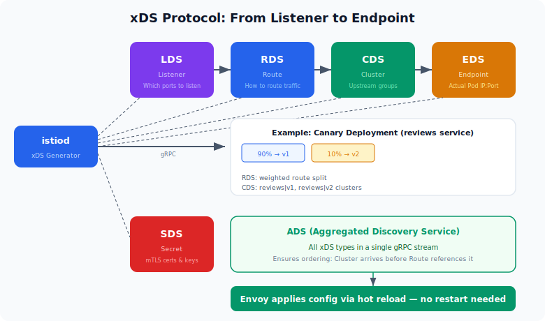

### 구체적 예시: 카나리 배포

`reviews` 서비스로 가는 트래픽의 90%를 v1으로, 10%를 v2로 보내는 설정:

```yaml
# 사용자가 작성하는 Istio CRD
apiVersion: networking.istio.io/v1beta1
kind: VirtualService
metadata:
  name: reviews-route
spec:
  hosts:
  - reviews
  http:
  - route:
    - destination:
        host: reviews
        subset: v1
      weight: 90
    - destination:
        host: reviews
        subset: v2
      weight: 10
---
apiVersion: networking.istio.io/v1beta1
kind: DestinationRule
metadata:
  name: reviews-dest
spec:
  host: reviews
  subsets:
  - name: v1
    labels:
      version: v1
  - name: v2
    labels:
      version: v2
```

istiod가 이를 xDS로 변환하면:

```
[LDS] Listener 설정
  "0.0.0.0:15001에서 아웃바운드 트래픽을 받아라"
  "Host 헤더가 'reviews'이면 → Route Config 'reviews-route'를 사용해라"
         │
         ▼
[RDS] Route 설정
  "reviews-route:"
  "  90% → Cluster 'reviews.default.svc.cluster.local|v1'"
  "  10% → Cluster 'reviews.default.svc.cluster.local|v2'"
         │
         ▼
[CDS] Cluster 설정
  "reviews|v1: 로드밸런싱=RoundRobin, 서킷브레이커=5xx 3회시 차단"
  "reviews|v2: 로드밸런싱=RoundRobin, 서킷브레이커=5xx 3회시 차단"
         │
         ▼
[EDS] Endpoint 설정
  "reviews|v1 의 실제 엔드포인트: [10.244.1.5:8080, 10.244.2.8:8080]"
  "reviews|v2 의 실제 엔드포인트: [10.244.3.2:8080]"
         │
         ▼
[SDS] Secret 설정
  "이 Envoy의 인증서: <X.509 cert>, 키: <private key>"
  "신뢰할 CA: <root cert>"
```

### gRPC 스트리밍으로 실시간 동기화

xDS는 **양방향 gRPC 스트림**을 사용한다. 핵심은 **Envoy가 istiod에게 연결을 먼저 맺는다**는 점이다:

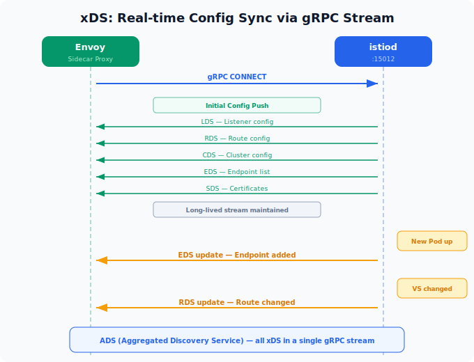

모든 xDS를 하나의 gRPC 스트림으로 합쳐서 보내는 방식을 **ADS**(Aggregated Discovery Service)라고 한다. LDS/RDS/CDS/EDS가 따로 오면 순서가 꼬일 수 있기 때문에(예: Route가 참조하는 Cluster가 아직 안 옴), 하나의 스트림에서 순서를 보장하며 보낸다.

### istiod 내부 처리 흐름

```text
[Kubernetes API Server]
     │
     │  Watch (Service, Endpoint, Pod, Istio CRDs)
     │
     ▼
[istiod: Config Controller]
     │
     │  "reviews Service의 Endpoint가 변경됐다"
     │  "VirtualService 'reviews-route'가 새로 생겼다"
     │
     ▼
[istiod: xDS Generator]
     │
     │  변경된 리소스 → 영향받는 Envoy들 계산
     │  → 해당 Envoy에 맞는 xDS 설정 생성
     │
     │  ★ 핵심: 모든 Envoy에 같은 설정을 보내는 게 아님
     │    각 Envoy의 위치(어떤 Pod, 어떤 네임스페이스)에 따라
     │    필요한 설정만 골라서 보냄
     │
     ▼
[istiod: xDS Server]
     │
     │  변경된 설정을 해당 Envoy들의 gRPC 스트림으로 Push
     │
     ▼
[각 Envoy] ── 설정 적용 (hot reload, 재시작 없음)
```

### VirtualService 변경 시 전체 흐름

```text
① kubectl apply -f virtualservice.yaml
     │
     ▼
② K8s API Server가 VirtualService 리소스를 etcd에 저장
     │
     ▼
③ istiod가 watch하고 있다가 변경 이벤트 수신
     │
     ▼
④ istiod가 해당 VirtualService에 영향받는 Envoy들을 계산
     │
     ▼
⑤ 각 Envoy에 맞는 RDS(Route) 설정을 생성
     │
     ▼
⑥ 이미 열려있는 gRPC 스트림을 통해 해당 Envoy들에 Push
     │
     ▼
⑦ Envoy가 새 Route 설정을 hot reload로 즉시 적용
     │
     ▼
⑧ 다음 요청부터 새 라우팅 규칙이 적용됨
     (기존 연결은 영향 없음, 새 연결부터 적용)
```

이 전체 과정이 **재시작 없이, 수 초 이내에** 일어난다.

### 실제 확인 명령어

```bash
# 특정 Pod의 Envoy가 가진 Listener 설정 (LDS)
istioctl proxy-config listeners <pod-name>

# Route 설정 (RDS)
istioctl proxy-config routes <pod-name>

# Cluster 설정 (CDS)
istioctl proxy-config clusters <pod-name>

# Endpoint 설정 (EDS)
istioctl proxy-config endpoints <pod-name>

# 전체 설정을 JSON으로 덤프
istioctl proxy-config all <pod-name> -o json
```

이 명령들은 해당 Pod의 Envoy admin API(15000 포트)에 접속해서 현재 적용된 xDS 설정을 읽어온다.

---

## istiod의 배치와 동작

### istiod는 워커 노드에 뜬다

istiod는 **일반 워커 노드에 뜨는 평범한 Deployment**다. 마스터 노드(K8s Control Plane 노드)에 뜨는 게 아니다. "Istio Control Plane"이라는 용어 때문에 헷갈릴 수 있지만, 이는 **Istio의 Control Plane**이지 **Kubernetes의 Control Plane**(API Server, etcd, scheduler 등)과는 별개다.

```
Kubernetes Cluster
├── Master Node (K8s Control Plane)
│   ├── kube-apiserver
│   ├── etcd
│   ├── kube-scheduler
│   └── kube-controller-manager
│
├── Worker Node 1
│   ├── kubelet
│   ├── istiod (Istio Control Plane) ← 여기에 스케줄링될 수 있음
│   ├── Pod A + istio-proxy
│   └── Pod B + istio-proxy
│
├── Worker Node 2
│   ├── kubelet
│   ├── Pod C + istio-proxy
│   └── Pod D + istio-proxy
```

```yaml
# istiod Deployment (간략화)
apiVersion: apps/v1
kind: Deployment
metadata:
  name: istiod
  namespace: istio-system
spec:
  replicas: 1          # 프로덕션에서는 2-3으로 HA 구성
  template:
    spec:
      containers:
      - name: discovery
        image: istio/pilot:1.24.0
        ports:
        - containerPort: 15010  # xDS gRPC (plaintext)
        - containerPort: 15012  # xDS gRPC (mTLS)
        - containerPort: 443    # Webhook (사이드카 주입)
        - containerPort: 15014  # 모니터링
```

Kubernetes scheduler가 리소스 상황에 따라 아무 워커 노드에나 배치한다. Service로 노출되니까 어떤 노드에 있든 모든 Envoy가 접근할 수 있다.

---

## mTLS와 Zero Trust

### TLS vs mTLS

#### 일반 TLS (HTTPS)

브라우저로 `https://github.com`에 접속할 때 일어나는 일:

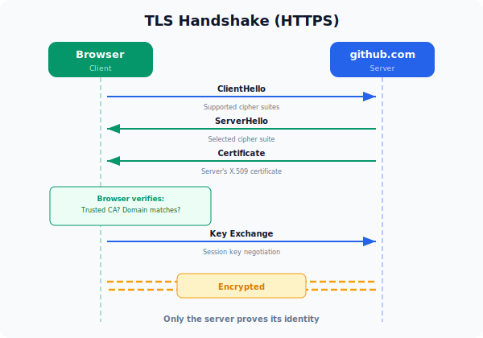

일반 TLS의 핵심 특징: **서버만 자기가 누구인지 증명한다.** 클라이언트는 인증서를 제출하지 않는다.

#### mTLS (Mutual TLS)

**클라이언트도 자기가 누구인지 인증서로 증명**한다:

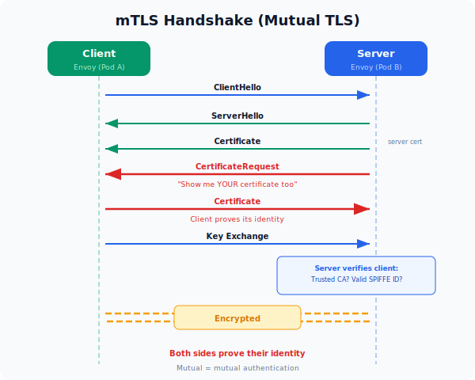

**Mutual = 상호적.** 양쪽이 서로에게 "너 누구야?"를 물어보고, 양쪽 다 인증서로 답한다.

### 왜 Kubernetes에서 mTLS가 필요한가

일반 Kubernetes 클러스터에서 Pod 간 통신은 기본적으로 **평문**이다. 이게 문제가 되는 이유:

- 노드의 네트워크에 접근할 수 있는 누군가가 패킷을 캡처하면 내용이 다 보임
- Pod A가 Pod B에 요청을 보낼 때, Pod B는 "이게 정말 Pod A가 보낸 건지" 구별할 방법이 없음

이것이 **Zero Trust**의 핵심 전제다 — "네트워크 위치(같은 클러스터, 같은 VLAN 등)를 신뢰의 근거로 쓰지 않겠다." 대신 모든 통신에서 상대방의 **신원**(identity)을 암호학적으로 검증한다.

### Istio에서 mTLS가 동작하는 원리

#### Step 1: 워크로드 ID 체계 — SPIFFE

Istio는 각 워크로드에 **SPIFFE ID**(Secure Production Identity Framework for Everyone)라는 고유 신원을 부여한다:

```
spiffe://cluster.local/ns/default/sa/reviews
         ───────────── ────────── ──────────
          trust domain  namespace  service account
```

이 ID는 Kubernetes의 ServiceAccount에 매핑된다. Pod이 어떤 ServiceAccount로 실행되느냐에 따라 SPIFFE ID가 결정된다.

#### Step 2: 인증서 발급 과정

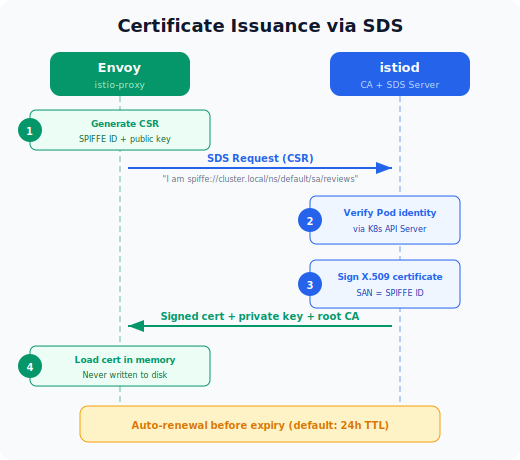

Envoy가 기동하면 istiod에게 SDS 요청으로 인증서를 요청한다. istiod는 K8s API Server를 통해 해당 Pod의 ServiceAccount를 검증한 뒤, 서명된 X.509 인증서와 개인키를 발급해서 돌려준다.

#### Step 3: 실제 mTLS 핸드셰이크

Pod A(productpage)가 Pod B(reviews)에 요청을 보낼 때를 그림으로 나타내면 다음과 같다.

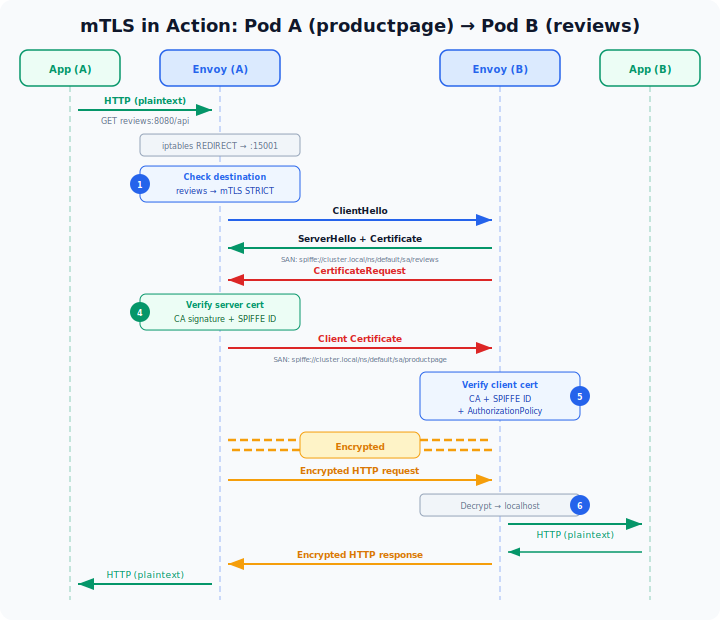

중요한 것은 앱은 이 흐름을 모른다는 것이 핵심이다. 위에서 계속 일관되게 모든 트래픽의 처리는 Envoy가 하고 있다. mTLS도 마찬가지로 Envoy가 하고 있다. 

이 전체 과정에서 앱은:

- 평문 HTTP를 보냄 → Envoy가 암호화
- 평문 HTTP를 받음 → Envoy가 복호화
- 인증서를 관리할 필요 없음 → Envoy + istiod가 자동 처리
- 코드에 TLS 관련 로직이 전혀 없어도 됨

### mTLS + AuthorizationPolicy = Zero Trust

mTLS만으로는 "암호화 + 상호 인증"이다. 여기에 Istio의 AuthorizationPolicy를 더하면 "**누가 누구에게 접근할 수 있는지**"까지 제어할 수 있다:

```yaml
apiVersion: security.istio.io/v1
kind: AuthorizationPolicy
metadata:
  name: reviews-policy
  namespace: default
spec:
  selector:
    matchLabels:
      app: reviews
  rules:
  - from:
    - source:
        principals:
        - "cluster.local/ns/default/sa/productpage"  # 이 SPIFFE ID만
    to:
    - operation:
        methods: ["GET"]           # GET만 허용
        paths: ["/api/reviews/*"]  # 이 경로만 허용
```

네트워크 IP가 아니라 **암호학적으로 검증된 워크로드 신원**을 기준으로 판단하는 것이 Zero Trust의 핵심이다.

```
전통적 네트워크 보안:
  "10.244.1.0/24 대역에서 온 트래픽은 허용" ← IP 기반, 스푸핑 가능

Zero Trust (Istio mTLS):
  "spiffe://cluster.local/ns/default/sa/productpage 가
   서명된 인증서로 자신을 증명한 경우에만 허용" ← 암호학적 검증
```

### mTLS 모드

```yaml
apiVersion: security.istio.io/v1
kind: PeerAuthentication
metadata:
  name: default
  namespace: istio-system   # 메시 전체 적용
spec:
  mtls:
    mode: STRICT    # or PERMISSIVE
```

- **PERMISSIVE** — mTLS와 평문 둘 다 받아들임. 메시에 아직 포함 안 된 서비스가 있을 때 사용. Istio를 점진적으로 도입할 때 유용.
- **STRICT** — mTLS만 허용. 인증서 없이 오는 평문 트래픽은 거부. 완전한 Zero Trust.

---

## Istio + CNI 조합 (Cilium, Calico, Flannel)

지금까지 Istio가 트래픽을 어떻게 가로채고(iptables), 어떻게 라우팅하고(xDS), 어떻게 암호화하는지(mTLS) 봤다. 그런데 이 모든 것은 **Pod 간 네트워크가 이미 동작하고 있다는 전제** 위에 있다. 그 "Pod 간 네트워크"를 만들어주는 것이 바로 CNI다. Istio는 CNI 위에서 동작하기 때문에, 어떤 CNI를 쓰느냐에 따라 Istio의 동작 방식과 성능이 달라진다.

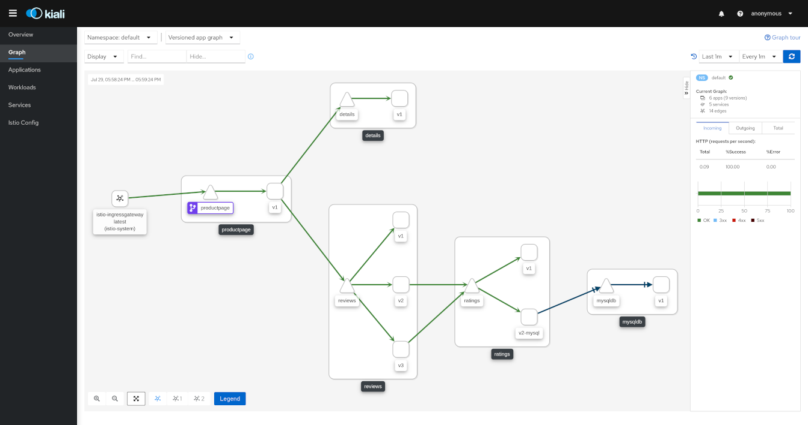
<small>출처: https://pre-v1-41.kiali.io/documentation/v1.36/features/</small>

서비스 메시를 도입하면 위와 같이 서비스 간 트래픽 흐름을 실시간으로 시각화할 수 있다. 이 대시보드는 [Kiali](https://kiali.io/)로, Istio와 함께 사용하는 대표적인 관측 도구다.

### CNI vs Service Mesh: 레이어가 다르다

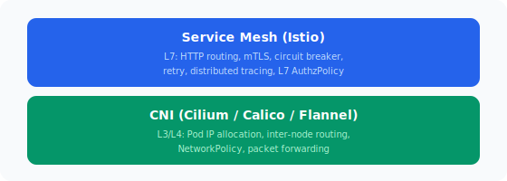

**CNI**는 "Pod이 IP를 받고 다른 Pod과 통신할 수 있게 해주는 기본 네트워크 인프라"이고, **Service Mesh**는 "그 위에서 애플리케이션 레벨의 트래픽을 정교하게 제어하는 계층"이다.

### Flannel + Istio

가장 단순한 조합. Flannel은 L3 오버레이(VXLAN)만 하고, NetworkPolicy도 지원 안 하니까 Istio와 충돌할 일이 거의 없다. 하지만 Flannel이 해주는 게 적어서, 네트워크 정책은 전부 Istio의 AuthorizationPolicy에 의존하게 된다. k3s의 기본 CNI가 Flannel이라 가장 쉽게 시작할 수 있는 조합.

### Calico + Istio

Calico가 L3/L4 NetworkPolicy를 담당하고, Istio가 L7 정책을 담당하는 **계층적 보안** 구조를 만들 수 있다. Calico와 Istio Ambient Mesh를 결합하면 ztunnel이 모든 트래픽을 암호화하고 ID를 검증하며, Calico가 CNI 레벨에서 어떤 연결이 허용되는지를 제어하는 심층 방어 전략을 구현할 수 있다.

### Cilium + Istio

Cilium이 커널 레벨 네트워킹(IP 관리, 라우팅, L3/L4 정책)을 처리하고, Istio가 애플리케이션 계층(HTTP 라우팅, mTLS ID, 세밀한 인가 정책, 트래픽 쉐이핑)을 처리하는 것이 권장 접근법이다. 다만 Cilium의 `kubeProxyReplacement`이 eBPF 소켓 레벨 로드밸런싱을 수행하면 Istio의 iptables REDIRECT를 우회할 수 있으므로, `socketLB.hostNamespaceOnly: true` 설정이 필요하다.

---

## 전체 그림 정리

### 계층 구조

```
사용자가 작성하는 것:
  VirtualService, DestinationRule, AuthorizationPolicy (Istio CRDs)
          │
          ▼
istiod가 하는 것:
  K8s 리소스 + Istio CRD → xDS 설정으로 변환 → 각 Envoy에 gRPC로 푸시
  + 인증서 발급/갱신 (CA)
  + Mutating Webhook으로 사이드카 자동 주입
          │
          ▼
Envoy(istio-proxy)가 하는 것:
  xDS로 받은 설정에 따라 실제 트래픽 처리
  - 라우팅, 로드밸런싱, 리트라이
  - mTLS 핸드셰이크
  - 메트릭 수집, 트레이싱 헤더 전파
  - 인가 정책 적용
          │
          ▼
iptables(또는 eBPF)가 하는 것:
  앱 ↔ Envoy 사이의 투명한 트래픽 리다이렉트
  (앱은 자기가 직접 통신한다고 생각함)
```

### 의존 관계 요약

```
netfilter (커널)
  └── iptables 규칙으로 트래픽을 Envoy로 REDIRECT
        └── Envoy (istio-proxy)
              ├── xDS로 istiod에서 받은 라우팅 규칙 적용
              ├── SDS로 istiod에서 받은 인증서로 mTLS 수행
              ├── SPIFFE ID 기반 상호 인증
              └── AuthorizationPolicy로 L7 인가 결정
                    └── istiod (Control Plane)
                          ├── K8s API watch → xDS 설정 생성/배포
                          ├── CA로서 인증서 발급/갱신
                          └── Webhook으로 사이드카 자동 주입
```

**결론: "커널의 netfilter가 트래픽을 가로채고 → Envoy가 처리하고 → istiod가 관리한다"는 3계층 구조에서, mTLS는 Envoy 계층에서 수행되는 암호화/인증 메커니즘이고, 그 인증서 라이프사이클을 istiod가 자동으로 관리해주는 것이다.**

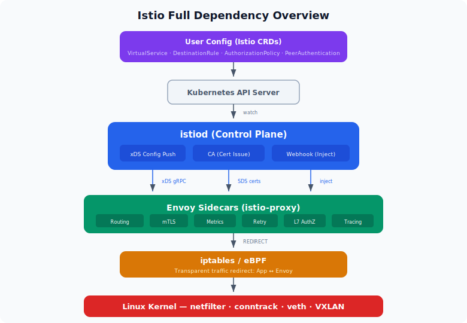

## 마치며

결국 Istio는 "커널의 netfilter가 트래픽을 가로채고 → Envoy가 처리하고 → istiod가 관리한다"는 3계층 구조다. 앱 코드를 한 줄도 바꾸지 않으면서 mTLS, 트래픽 라우팅, 관측성을 얻을 수 있는 이유는 이 계층들이 투명하게 동작하기 때문이다. 이전 글에서 다뤘던 netfilter, iptables, CNI 같은 커널/네트워크 기반 지식이 있으면 Istio의 동작 원리가 훨씬 자연스럽게 이해될 것이다.

