> Write once, run anywhere - 한 번 쓰면, 어디서든 실행된다.

Java를 대표하는 이 문구는 1990년대 중반부터 지금까지 유효하다. 백엔드 개발자라면 한 번쯤은 접하게 되는 Java와 Spring -- 이 글에서는 Java가 왜 멀티스레드 언어인지, Spring Boot가 어떻게 이를 활용하여 대규모 트래픽을 처리하는지, 그리고 Node.js와 어떤 구조적 차이가 있는지를 정리한다.

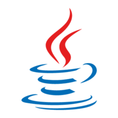

---

## 1. Java의 역사와 철학

### 탄생 배경

Java의 역사는 1990년대 초반으로 거슬러 올라간다. 원래 **오크(Oak)**라는 이름으로 **선 마이크로시스템즈(Sun Microsystems)**의 프로젝트에서 탄생했다. 이 프로젝트의 원래 목표는 소비자 가전제품을 위한 언어 개발이었지만, 오크는 특정 플랫폼에 국한되지 않는 범용적인 프로그래밍 언어로 발전하게 됐다.

창시자인 제임스 고슬링(James Gosling)이 자바 커피 애호가였기에 자바 커피의 원산지인 자바(Java) 섬에서 이름을 따왔다. 1995년에 정식 발표된 이후, Java는 폭발적인 인기를 끌게 되었다.

### JVM과 바이트코드

Java를 다른 컴파일 언어와 구분 짓는 가장 큰 특징은 컴파일된 코드가 **크로스 플랫폼**이라는 것이다. Java 컴파일러는 `.java` 파일을 **바이트코드(bytecode)**라는 특수한 바이너리 형태로 변환하고, 이 바이트코드를 실행하기 위해 **JVM(Java Virtual Machine)**이 필요하다. JVM은 자바 바이트코드를 어느 플랫폼에서나 동일한 형태로 실행시킨다.

C 언어와 비교하면 그 차이가 분명해진다.

- **C 언어**: 소스 코드를 컴파일하면 CPU가 직접 실행할 수 있는 실행 파일이 생성된다. 하지만 이 실행 파일은 OS와 CPU 아키텍처에 종속된다. Windows에서는 `a.exe`, macOS에서는 `a.out`이 나오는 식이다.
- **Java**: 소스 코드를 JVM이 이해할 수 있는 수준(바이트코드)까지만 컴파일한다. 나머지는 JVM이 인터프리팅하여 애플리케이션을 실행한다.

이러한 구조 때문에 Java는 컴파일러와 인터프리터의 속성을 모두 가진 **하이브리드** 언어로 분류된다. 1990년대 중반에 크로스 플랫폼을 실현했다는 것은 당시로서는 혁신적인 아이디어였다.

### Java의 다섯 가지 철학

1991년에 발표된 Java의 다섯 가지 핵심 철학은 다음과 같다.

1. **객체 지향 방법론**을 사용해야 한다.
2. 같은 프로그램(바이트코드)이 **여러 운영 체제**에서 실행될 수 있어야 한다.
3. 컴퓨터 **네트워크 접근 기능**이 기본으로 탑재되어 있어야 한다.
4. **원격 코드**를 안전하게 실행할 수 있어야 한다.
5. 다른 객체 지향 언어들의 **좋은 부분만** 가져와 사용하기 편해야 한다.

C++가 1983년에 발표되면서 객체 지향 개념이 확산되기 시작했고, 1990년대에 접어들면서 소프트웨어 공학의 핵심 패러다임으로 자리 잡았다. 객체지향의 재사용성, 확장성, 유지보수 용이성을 품은 Java의 등장은 큰 여파를 몰고 올 수밖에 없었다.

### Java EE에서 Jakarta EE로

Java의 인기와 함께 다양한 에디션이 등장했다.

- **Java SE (Standard Edition)**: 핵심 API와 기능을 제공하는 표준 JDK
- **Java EE (Enterprise Edition)**: 서버 개발에 특화된 에디션으로 **JSP**와 **Servlet** 등 포함
- **Java ME (Micro Edition)**: 임베디드 기기에 특화된 에디션

특히 Java EE에 포함된 **Servlet**은 복잡한 HTTP 통신을 개발자가 손쉽게 처리할 수 있게 해주는 인터페이스로, 웹 개발의 생산성을 획기적으로 높였다.

```java
@WebServlet(name = "helloServlet", urlPatterns = "/hello")
public class HelloServlet extends HttpServlet {
    @Override
    protected void service(HttpServletRequest request, HttpServletResponse response)
            throws ServletException, IOException {
        String username = request.getParameter("username");
        response.setContentType("text/plain");
        response.setCharacterEncoding("utf-8");
        response.getWriter().write("hello " + username);
    }
}
```

선 마이크로시스템즈가 2010년 오라클에 인수된 후, Java EE의 발전 방향에 대한 커뮤니티의 우려가 커졌다. 결국 오라클은 2017년 Java EE를 **Eclipse Foundation**에 이전하기로 결정했고, 상표권 문제로 **Jakarta EE**라는 이름으로 변경되었다. 이를 통해 커뮤니티 주도의 오픈소스 개발이 본격화되었다.

Spring 프레임워크의 탄생도 이런 맥락에 있다. 2000년대 초반 Java 애플리케이션의 표준이었던 EJB의 복잡함에 불만을 품은 로드 존슨(Rod Johnson)이 _Expert One-on-One J2EE Design and Development_ 라는 책을 출판했고, 이것이 하이버네이트(Hibernate)와 결합되어 2003년에 **Spring Framework**가 탄생했다. "EJB의 겨울 뒤에 봄이 온다"는 의미로 Spring이라는 이름이 붙었다.

---

## 2. Spring의 멀티스레딩 아키텍처

### 프로세스와 스레드 기초

Spring의 멀티스레딩을 이해하려면 먼저 프로세스와 스레드의 개념을 짚어야 한다.

**프로그램**은 디스크에 저장된 데이터이고, 이를 실행시키면 **메모리에 적재**되어 **프로세스**가 된다. CPU는 메모리에 있는 다양한 프로세스들을 빠르게 전환하며 실행해서, 여러 프로세스가 동시에 돌아가는 것처럼 보이게 한다.

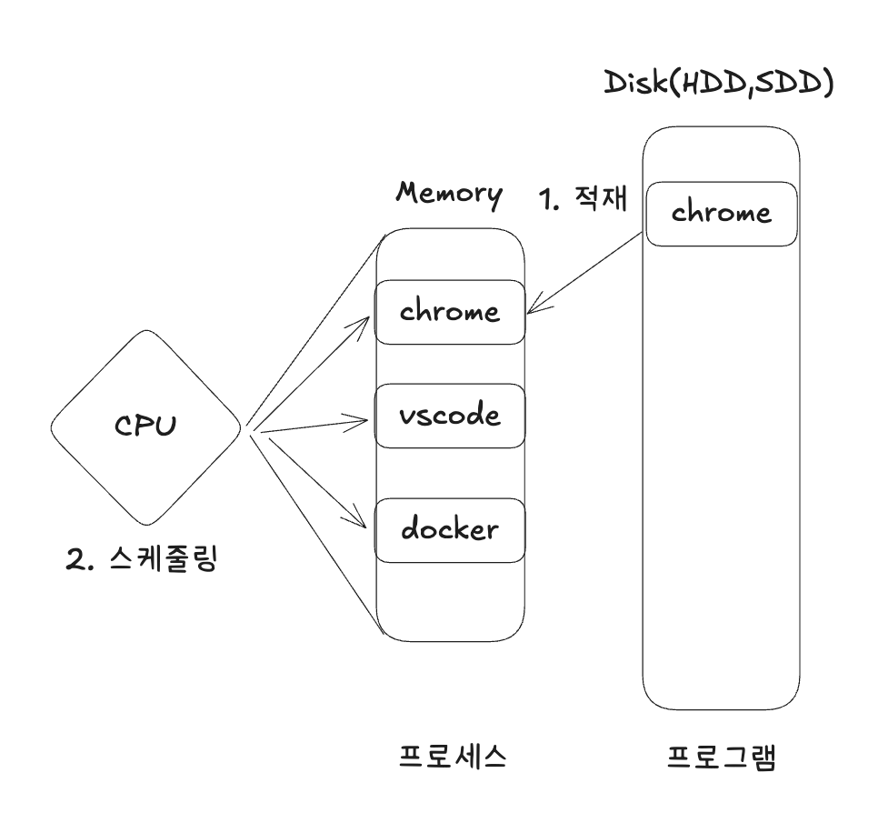

프로세스는 **code, data, heap, stack** 네 가지 영역으로 구성된다.

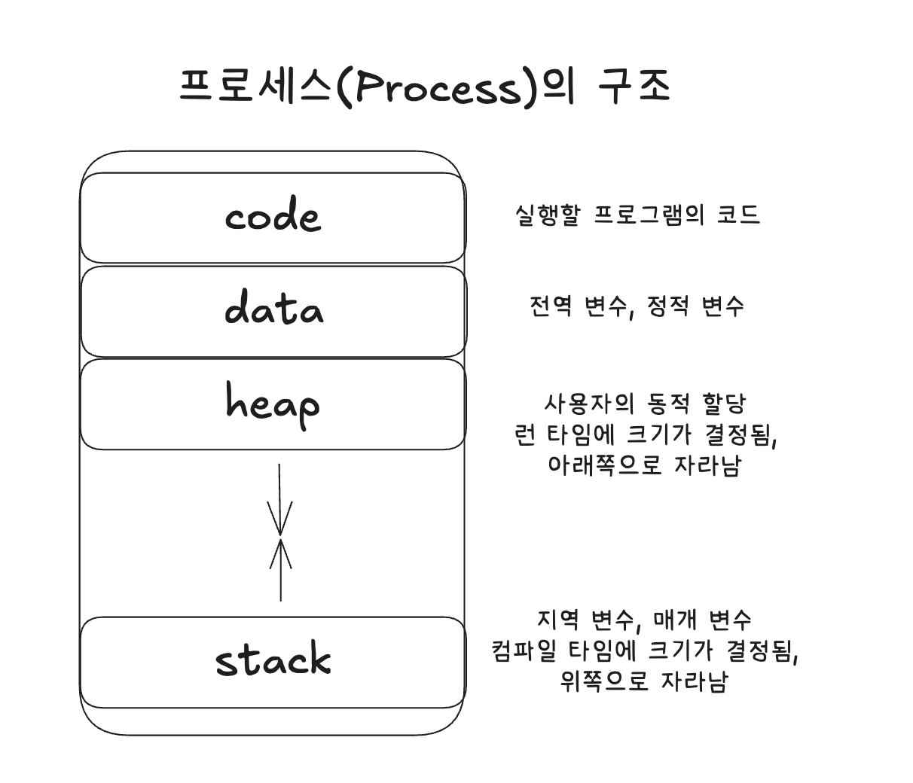

### 싱글스레드 vs 멀티스레드

하나의 stack을 가진 프로세스를 **싱글스레드(single thread)**라고 한다. **스레드(thread)**란 프로세스 안의 더 작은 실행 단위를 말한다.

**멀티스레드(multi thread)**는 하나의 프로세스 안에서 여러 stack을 두어 다양한 작업을 동시에 처리하는 것처럼 보이게 한다. 핵심은 **code, data, heap 영역을 스레드들이 공유**한다는 점이다. 이 덕분에 싱글스레드 프로세스를 여러 개 띄우는 것보다 오버헤드가 적다.

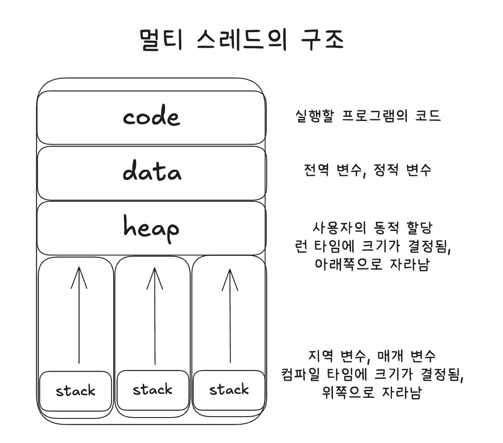

하지만 멀티스레드에는 치명적인 제약이 있다. 여러 스레드가 공유 데이터에 동시에 접근하여 값을 변경하려 하면 **동시성 문제(Concurrency Problem)**가 발생한다. 이를 방지하기 위해 스핀락(Spinlock), 세마포어(Semaphore) 등의 동기화 메커니즘이 필요하다.

### Java의 멀티스레드 구현

Java는 언어 레벨에서 두 가지 방식으로 멀티스레드를 지원한다.

**Thread 클래스 상속 방식:**

```java
public class MyThread extends Thread {
    public void run() {
        System.out.println("Thread 실행!");
    }
}
new MyThread().start();
```

**Runnable 인터페이스 구현 방식:**

```java
public class MyRunnable implements Runnable {
    public void run() {
        System.out.println("Runnable 실행!");
    }
}
new Thread(new MyRunnable()).start();
```

직접 멀티스레드를 구현할 때는 **Lock**과 **synchronized** 키워드를 통해 동기화를 직접 관리해야 한다. 하지만 Spring Boot에서는 **스레드풀(Thread Pool)** 개념을 통해 이를 훨씬 편리하게 다룰 수 있다.

### Tomcat의 스레드풀

**스레드풀(Thread Pool)**은 멀티스레딩을 효율적으로 관리하기 위해 스레드를 미리 생성해 둔 풀이다. 새 작업이 요청되면 풀에 있는 유휴 스레드가 작업을 수행하고, 작업이 끝나면 스레드는 다시 풀에 반환된다. 이를 통해 스레드 생성/소멸의 오버헤드를 줄이고 응답 시간을 단축할 수 있다.

Spring Boot에서 스레드풀 관리는 정확히 말하면 Spring Boot 자체가 아니라, 내장된 **Tomcat(서블릿 컨테이너)**이 담당한다.

<!-- TODO: Spring Boot 요청 처리 흐름 다이어그램 추가 (Client -> Tomcat Thread Pool -> DispatcherServlet -> Controller -> Service -> Repository) -->

**Tomcat**은 HTTP 요청을 처리하는 서블릿 컨테이너다. 복잡한 HTTP Request 구조를 개발자 대신 파싱해준다.


초기 Tomcat(3.2 이전)에서는 요청마다 스레드를 새로 생성하고 작업 후 소멸시켰다. 동시다발적 요청에 대해 매번 스레드를 만드는 것은 큰 부하를 유발했기 때문에, 스레드를 미리 생성하여 풀에 보관하는 방식으로 전환되었다.

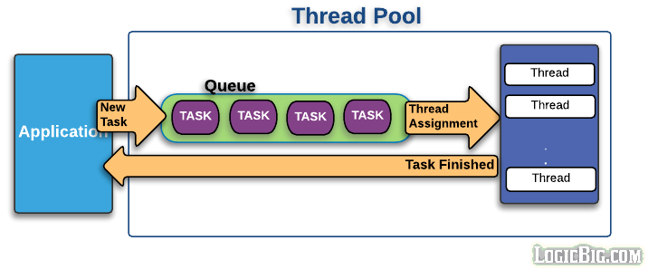

<!-- TODO: 스레드풀 내부 동작 다이어그램 추가 (Request Queue -> Idle Thread 할당 -> 작업 수행 -> Thread 반환) -->

HTTP Request가 들어오면 Queue에 Task가 전달되고, idle 상태의 스레드가 작업을 할당받는다. `application.yaml`에서 스레드풀을 설정할 수 있다.

```yaml
server:
  tomcat:
    threads:
      max: 200        # 생성할 수 있는 thread의 총 개수
      min-spare: 10   # 항상 활성화되어 있는(idle) thread의 개수
    accept-count: 100  # 작업 큐의 사이즈
```

기본적으로 최대 200개의 스레드를 생성할 수 있으며, 최소 10개의 유휴 스레드를 유지한다. 작업 큐에는 최대 100개의 대기 작업을 보관할 수 있다. 이 값들은 CPU 사용량과 요청 패턴에 따라 적절히 조정해야 한다.

### HikariCP 커넥션풀

서블릿 컨테이너인 Tomcat이 요청 자체를 멀티스레드로 처리한다는 것을 알았다. 그렇다면 데이터베이스와의 연결은 어떻게 처리될까?

DB에 데이터를 읽고 쓸 때마다 커넥션을 새롭게 생성하는 것 자체가 큰 오버헤드를 갖고 있다. 이를 해결하기 위해 스레드풀과 동일한 발상으로 **커넥션풀(Connection Pool)**을 사용한다. 커넥션을 미리 만들어 두고 필요할 때 가져다 쓰는 것이다.


Spring 진영에서 데이터베이스 연결에 사용하는 표준 인터페이스가 **JDBC(Java Database Connectivity)**이다. Spring Boot 2.0부터는 **HikariCP**가 기본 커넥션풀로 채택되었다. `application.yaml`에서 다음과 같이 설정한다.

```yaml
spring:
  datasource:
    url: jdbc:mysql://localhost:3306/mydb
    username: myuser
    password: mypassword
    hikari:
      maximum-pool-size: 10        # 최대 커넥션 수
      connection-timeout: 5000     # 커넥션 획득 대기 시간(ms)
      connection-init-sql: SELECT 1
      validation-timeout: 2000     # 커넥션 유효성 검사 시간(ms)
      minimum-idle: 10             # 최소 유휴 커넥션 수
      idle-timeout: 600000         # 유휴 커넥션 유지 시간(ms)
      max-lifetime: 1800000        # 커넥션 최대 수명(ms)
```

멀티스레드 환경에서 동시에 데이터를 쓸 때 발생하는 동시성 문제는 HikariCP와 데이터베이스의 트랜잭션 메커니즘이 처리해준다.

정리하면, Spring Boot가 **멀티스레드 애플리케이션**이라 불리는 이유는 다음과 같다.

1. **Tomcat 스레드풀**: HTTP 요청을 멀티스레드로 처리
2. **HikariCP 커넥션풀**: DB I/O를 멀티스레드로 처리
3. **JVM**: Java의 Thread 클래스와 바이트코드 실행 자체를 멀티스레드로 관리

이 전체 파이프라인이 처음부터 끝까지 멀티스레드로 동작하는 것이다.

---

## 3. Node.js vs Java/Spring: 구조적 비교

Node.js와 Java/Spring은 동시성 처리 방식에서 근본적인 차이를 보인다.

### Node.js: 싱글스레드 이벤트 루프

Node.js는 **싱글스레드 이벤트 루프** 모델을 사용한다. 메인 스레드 하나가 이벤트 루프를 돌면서 들어오는 요청을 처리한다. I/O 작업(파일 읽기, DB 쿼리, 네트워크 요청 등)은 **비동기(non-blocking)**로 처리되어, I/O 완료 시 콜백이 이벤트 큐에 등록되고 이벤트 루프가 이를 처리한다.

```
[요청 1] ──> [이벤트 루프 (싱글스레드)] ──> [비동기 I/O] ──> [콜백 실행]
[요청 2] ──>         |                  ──> [비동기 I/O] ──> [콜백 실행]
[요청 3] ──>         |                  ──> [비동기 I/O] ──> [콜백 실행]
```

### Java/Spring: 멀티스레드풀

Java/Spring은 **멀티스레드풀** 모델을 사용한다. Tomcat이 관리하는 스레드풀에서 각 요청마다 별도의 스레드를 할당하여 처리한다. 각 스레드는 요청의 시작부터 응답까지 동기적(blocking)으로 처리하는 것이 기본이다.

```
[요청 1] ──> [스레드 1] ──> [DB 커넥션 1] ──> [응답]
[요청 2] ──> [스레드 2] ──> [DB 커넥션 2] ──> [응답]
[요청 3] ──> [스레드 3] ──> [DB 커넥션 3] ──> [응답]
```

### 비교 요약

| 항목 | Node.js | Java/Spring |
|------|---------|-------------|
| **스레딩 모델** | 싱글스레드 이벤트 루프 | 멀티스레드풀 (Tomcat) |
| **I/O 처리** | 비동기 논블로킹 | 동기 블로킹 (기본) |
| **동시성 구현** | 이벤트 루프 + 콜백/Promise | 스레드풀 + 동기화 메커니즘 |
| **CPU 집약 작업** | 메인 스레드 블로킹 위험 | 별도 스레드에서 병렬 처리 가능 |
| **메모리 사용** | 상대적으로 적음 | 스레드당 메모리 할당 필요 |
| **DB 연결** | 비동기 드라이버 | HikariCP 커넥션풀 |
| **확장 방식** | 클러스터 모듈 (프로세스 복제) | 스레드풀 크기 조정 |

### 각 모델의 장점

**Node.js의 강점:**
- I/O 바운드 작업에서 높은 처리량
- 적은 메모리로 많은 동시 연결 처리 가능
- 간결한 비동기 코드 (async/await)
- 실시간 애플리케이션(채팅, 스트리밍)에 적합

**Java/Spring의 강점:**
- CPU 집약적 작업에서 진정한 병렬 처리 가능
- 성숙한 동시성 제어 메커니즘 (synchronized, Lock, Concurrent 패키지)
- 대규모 엔터프라이즈 시스템에서 검증된 안정성
- 스레드 단위의 직관적인 디버깅과 스택 트레이스

> 대규모의 트래픽 처리는 스프링부트가 가장 잘한다.

이런 말을 자주 듣게 되는 이유가 바로 여기에 있다. JVM의 멀티스레드 지원, Tomcat의 스레드풀, HikariCP의 커넥션풀이 유기적으로 결합하여 높은 처리량과 안정성을 보장하기 때문이다.

---

## 4. 부록: Maven vs Gradle -- 빌드 도구 비교

Java/Spring 생태계를 이야기할 때 빌드 도구를 빼놓을 수 없다. Spring Initializr(start.spring.io)에서 프로젝트를 생성할 때 가장 먼저 선택하게 되는 것이 바로 빌드 도구이다.

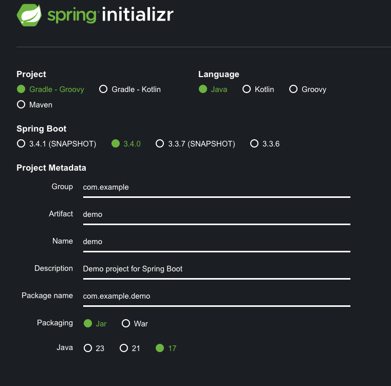

### Ant: 초창기 빌드 도구

2000년대 초반, Java 빌드 도구의 시작은 **Ant**였다. Ant는 **명령형(Imperative)** 방식으로 빌드 프로세스의 모든 단계를 `build.xml`에 명시적으로 기술해야 했다.

```xml
<?xml version="1.0" encoding="UTF-8"?>
<project name="MyAntProject" default="compile" basedir=".">
    <property name="src.dir" value="src"/>
    <property name="build.dir" value="build"/>

    <target name="init">
        <mkdir dir="${build.dir}"/>
    </target>

    <target name="compile" depends="init">
        <javac srcdir="${src.dir}" destdir="${build.dir}"/>
    </target>

    <target name="jar" depends="compile">
        <jar destfile="MyAntProject.jar" basedir="${build.dir}"/>
    </target>

    <target name="clean">
        <delete dir="${build.dir}"/>
        <delete file="MyAntProject.jar"/>
    </target>
</project>
```

빌드의 모든 단계를 세밀하게 제어할 수 있다는 장점이 있었지만, 의존성 관리를 위해 별도 도구(Ivy)가 필요했고, 프로젝트가 커질수록 유지보수가 어려웠다.

### 명령형 vs 선언형 패러다임

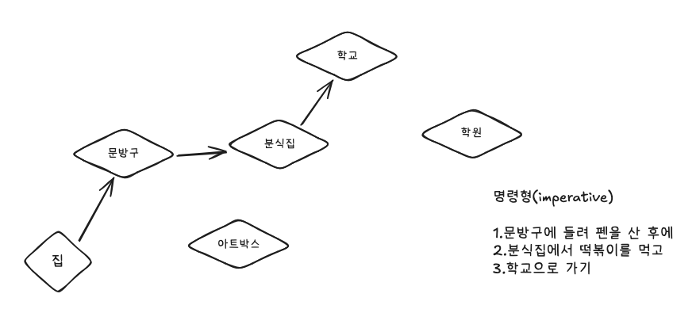

**명령형(Imperative)**: 프로그램이 _어떻게_ 동작해야 하는지를 단계별로 명시한다. 빌드 스크립트에서 순서에 맞춰 하나하나씩 명시적으로 코드를 작성해야 한다.

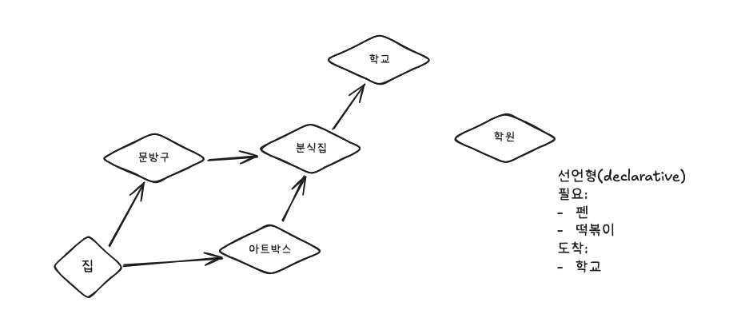

**선언형(Declarative)**: 프로그램이 _무엇을_ 해야 하는지만 기술한다. 실행 방법은 빌드 도구에 위임한다. npm, pip, gem 등 현대 패키지 매니저들이 모두 이 패러다임을 따른다.

### Maven: 선언형의 등장

**Maven**은 Ant의 한계를 보완하기 위해 2004년에 등장했다. 가장 큰 특징은 **선언형** 방식이라는 점이다. 중앙 저장소(Maven Central Repository)를 활용하여 의존성을 자동으로 관리한다.

```xml
<project xmlns="http://maven.apache.org/POM/4.0.0"
         xmlns:xsi="http://www.w3.org/2001/XMLSchema-instance"
         xsi:schemaLocation="http://maven.apache.org/POM/4.0.0
                             http://maven.apache.org/xsd/maven-4.0.0.xsd">
    <modelVersion>4.0.0</modelVersion>

    <groupId>com.example</groupId>
    <artifactId>MyMavenProject</artifactId>
    <version>1.0.0</version>
    <packaging>jar</packaging>

    <dependencies>
        <dependency>
            <groupId>junit</groupId>
            <artifactId>junit</artifactId>
            <version>4.13.2</version>
            <scope>test</scope>
        </dependency>
    </dependencies>

    <build>
        <plugins>
            <plugin>
                <groupId>org.apache.maven.plugins</groupId>
                <artifactId>maven-compiler-plugin</artifactId>
                <version>3.8.1</version>
                <configuration>
                    <source>1.8</source>
                    <target>1.8</target>
                </configuration>
            </plugin>
        </plugins>
    </build>
</project>
```

의존성만 선언하면 Maven이 알아서 다운로드하고 빌드 프로세스를 진행한다. 유지보수 측면에서도 한 끗 차이로 빌드가 실패하는 문제를 줄일 수 있었다. 다만 XML 기반 설정의 가독성 문제와, 선언형의 한계로 인한 세밀한 제어의 어려움이 단점이었다.

### Gradle: 두 세계의 장점

**Gradle**은 2009년에 등장한 현대적인 빌드 도구로, Ant와 Maven의 장점을 결합하고 단점을 개선했다. **Groovy** 또는 **Kotlin DSL**을 사용하여 빌드 스크립트를 작성한다.

```groovy
plugins {
    id 'java'
}

group 'com.example'
version '1.0.0'

repositories {
    mavenCentral()
}

dependencies {
    testImplementation 'junit:junit:4.13.2'
}

compileJava {
    sourceCompatibility = '1.8'
    targetCompatibility = '1.8'
}
```

XML에 비해 훨씬 간결하고 읽기 쉽다. Maven과 Ivy 리포지토리를 모두 지원하므로, 명령형과 선언형 패러다임을 상황에 따라 적절히 혼용할 수 있다.

Gradle의 또 다른 강점은 **성능**이다.

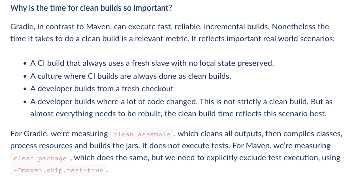

**병렬 빌드**와 **빌드 캐싱(Gradle Cache)**, 그리고 **Incremental Builds** 방식을 통해 Maven 대비 최대 85배까지 빠른 성능을 보여준다.

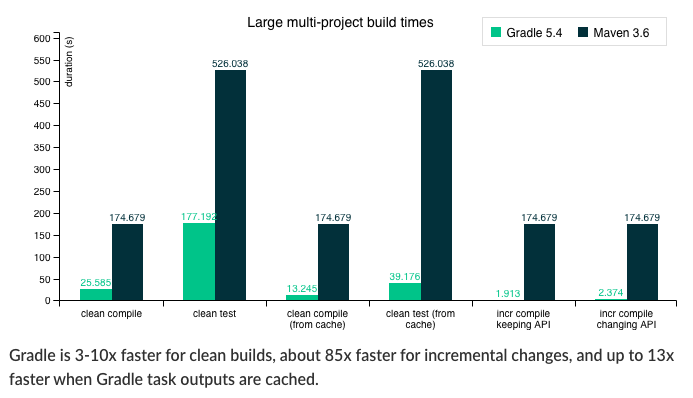
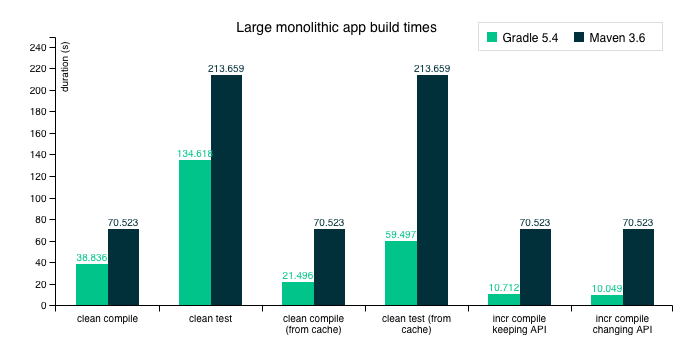

### Gradle Wrapper (gradlew)

프로젝트 루트에 있는 `gradlew` 파일은 **Gradle Wrapper**로, 팀원 간이나 CI 서버(Jenkins, GitHub Actions 등)에서 동일한 Gradle 버전으로 빌드할 수 있게 보장한다. Gradle이 설치되어 있지 않은 환경에서도 자동으로 필요한 버전을 다운로드하여 빌드를 수행한다.

### 마이그레이션 고려사항

| 항목 | Maven | Gradle |
|------|-------|--------|
| **설정 형식** | XML (`pom.xml`) | Groovy/Kotlin DSL (`build.gradle`) |
| **패러다임** | 선언형 | 선언형 + 명령형 혼합 |
| **빌드 속도** | 상대적으로 느림 | 병렬 빌드/캐싱으로 빠름 |
| **유연성** | 제한적 | 높음 |
| **학습 곡선** | 낮음 | 중간 |
| **생태계 성숙도** | 매우 높음 | 높음 (빠르게 성장) |

기존 Maven 프로젝트를 Gradle로 마이그레이션할 때는 `gradle init` 명령을 활용할 수 있다. 다만 대규모 레거시 프로젝트에서는 Maven의 안정성과 광범위한 플러그인 생태계가 오히려 장점이 될 수 있으므로, 프로젝트의 규모와 팀의 상황을 고려하여 결정해야 한다.

---

## 참고 자료

- [Oracle] Introduction to Java: https://www.oracle.com/java/technologies/introduction-to-java.html
- [Wikipedia] 자바 (프로그래밍 언어): https://ko.wikipedia.org/wiki/자바_(프로그래밍_언어)
- [velog] 스프링부트는 어떻게 다중 요청을 처리할까?: https://velog.io/@sihyung92/how-does-springboot-handle-multiple-requests
- [velog] Spring-DB커넥션풀과 Hikari CP 알아보기: https://velog.io/@miot2j/Spring-DB커넥션풀과-Hikari-CP-알아보기
- [Gradle] Gradle vs Maven Performance: https://gradle.org/gradle-vs-maven-performance/
