> Write once, run anywhere.

This iconic phrase has defined Java since the mid-1990s and remains relevant today. If you're a backend developer, you've almost certainly encountered Java and Spring at some point. This article explores why Java is a multithreaded language, how Spring Boot leverages this to handle large-scale traffic, and how it structurally differs from Node.js.

---

## 1. The History and Philosophy of Java

### Origins

Java's history goes back to the early 1990s. It was originally born under the name **Oak** as part of a project at **Sun Microsystems**. The project's original goal was to develop a language for consumer electronics, but Oak evolved into a general-purpose programming language not confined to any specific platform.

Its creator, James Gosling, was a coffee enthusiast, so the language was named after the island of Java — the origin of Java coffee. After its official release in 1995, Java gained explosive popularity.

### JVM and Bytecode

The key feature that distinguishes Java from other compiled languages is that its compiled code is **cross-platform**. The Java compiler converts `.java` files into a special binary format called **bytecode**, and a **JVM** (Java Virtual Machine) is required to execute this bytecode. The JVM runs Java bytecode identically on any platform.

The difference becomes clear when compared to C:

- **C**: Compiling source code produces an executable that the CPU can run directly. However, this executable is tied to a specific OS and CPU architecture — `a.exe` on Windows, `a.out` on macOS.
- **Java**: Source code is compiled only to the level the JVM can understand (bytecode). The JVM then interprets and executes the application.

Because of this architecture, Java is classified as a **hybrid** language with properties of both a compiler and an interpreter. Achieving cross-platform compatibility in the mid-1990s was a groundbreaking idea at the time.

You might wonder, "Isn't an interpreted approach slow?" Early JVMs were indeed slow, but modern JVMs include a **JIT compiler** (Just-In-Time Compiler). The JIT compiler detects frequently called **hot code** paths during execution and converts them to **native code** for the target platform, caching the result. When the same code is called again, it runs as native code without interpretation.

Thanks to this, Java has a **warm-up** characteristic where it gets progressively faster at runtime. A sufficiently warmed-up Java application can achieve performance comparable to C/C++.

### Java's Current Standing

Even after 30 years, Java remains strong. According to JetBrains' 2024 Developer Ecosystem Survey, Java continues to be one of the most widely used programming languages, maintaining dominant market share especially in enterprise backend development.

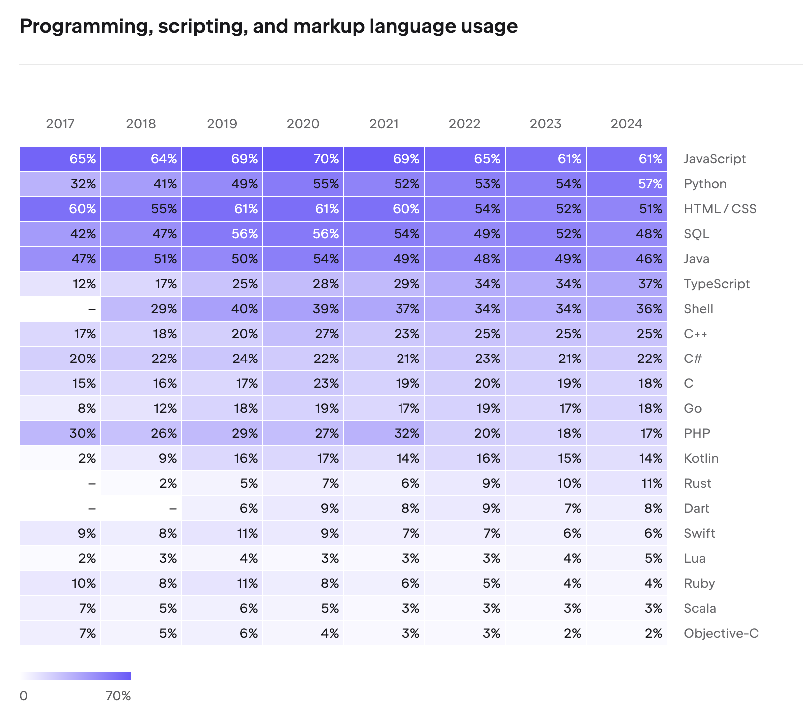

The reason Java is chosen for mission-critical systems in finance, telecommunications, and government is trust in its **stability**, **mature ecosystem**, and **backward compatibility**. The fact that code written in Java 8 runs without issues on Java 21 is a strength rarely found in other languages.

### The Five Pillars of Java's Philosophy

The five core principles of Java, published in 1991, are as follows:

1. It must use **object-oriented methodology**.
2. The same program (bytecode) must be able to run on **multiple operating systems**.
3. Built-in **networking capabilities** must be included by default.
4. It must be able to execute **remote code** securely.
5. It should adopt the **best parts** of other object-oriented languages and be easy to use.

C++ was introduced in 1983, spreading object-oriented concepts, which became a core software engineering paradigm by the 1990s. Java's arrival — embracing OOP's reusability, extensibility, and maintainability — was bound to make a massive impact.

These five principles became the compass guiding the evolution of the Java ecosystem. Cross-platform support (2) was realized by the JVM, networking (3) and remote code execution (4) by Servlets and EJB, and object orientation (1) and ease of use (5) by the Spring Framework.

### JDK and Java Editions

To develop Java programs, you need the **JDK** (Java Development Kit). The JDK includes the Java compiler (`javac`), JVM, standard libraries, debugger, and all other development tools. If you only need to **run** Java programs, the **JRE** (Java Runtime Environment) suffices. The JRE contains only the JVM and standard libraries, making it a subset of the JDK. Starting with Java 11, the JRE is no longer distributed separately and is integrated into the JDK.

As Java's popularity grew, various editions emerged for different use cases:

- **Java SE** (Standard Edition): The base edition containing the JVM, core APIs, and standard libraries. When we say "install the JDK," we're installing a Java SE implementation.
- **Java EE** (Enterprise Edition): An edition that adds server development specifications on top of Java SE. It includes APIs for enterprise environments such as **Servlet**, **JSP**, and **EJB**.
- **Java ME** (Micro Edition): An edition specialized for resource-constrained environments like embedded and mobile devices.

### Servlets and the Web Development Revolution

**Servlet** is what brought Java's third (networking) and fourth (remote code execution) principles to life in web development. A Servlet is a server-side component included in Java EE that receives HTTP requests, processes them, and returns responses. Before Servlets, generating dynamic content on web servers required CGI (Common Gateway Interface), which had an inefficient architecture of creating a new process for each request. Servlets switched this to a thread-based approach, improving both performance and productivity.

```java
@WebServlet(name = "helloServlet", urlPatterns = "/hello")
public class HelloServlet extends HttpServlet {
    @Override
    protected void service(HttpServletRequest request, HttpServletResponse response)
            throws ServletException, IOException {
        String username = request.getParameter("username");
        response.setContentType("text/plain");
        response.setCharacterEncoding("utf-8");
        response.getWriter().write("hello " + username);
    }
}
```

### From Java EE to Jakarta EE, and the Rise of Spring

With Servlets and EJB at its core, Java EE became the standard for enterprise development. However, while EJB's philosophy was sound, the reality was different. Dozens of lines of XML configuration, complex interface implementations, and heavy application server dependencies led to growing frustration: "Why does implementing simple business logic require so much code?"

In the early 2000s, Rod Johnson, frustrated by this complexity, published _Expert One-on-One J2EE Design and Development_. The lightweight container idea presented in this book, combined with Hibernate, gave birth to the **Spring Framework** in 2003. The name "Spring" signified "spring comes after the winter of EJB."

Spring inherited Java's five principles while maximizing **developer convenience**. Through Dependency Injection (DI) and Aspect-Oriented Programming (AOP), it preserved the benefits of OOP while drastically reducing boilerplate code. It also utilized Servlets internally but abstracted web development so that developers could work with annotations like `@Controller` and `@RequestMapping` without directly dealing with the Servlet API.

Meanwhile, after Sun Microsystems was acquired by Oracle in 2010, community concerns grew about the direction of Java EE. Eventually, Oracle decided to transfer Java EE to the **Eclipse Foundation** in 2017, and it was renamed to **Jakarta EE** due to trademark issues. This enabled full-scale community-driven open-source development.

---

## 2. Spring's Multithreading Architecture

### Process and Thread Basics

To understand Spring's multithreading, we first need to cover the concepts of processes and threads.

A **program** is data stored on disk. When executed, it is **loaded into memory** and becomes a **process**. The CPU rapidly switches between various processes in memory, creating the illusion that multiple processes run simultaneously.

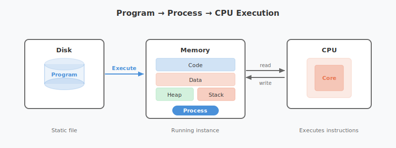

A process consists of four memory regions: **code, data, heap, and stack**.

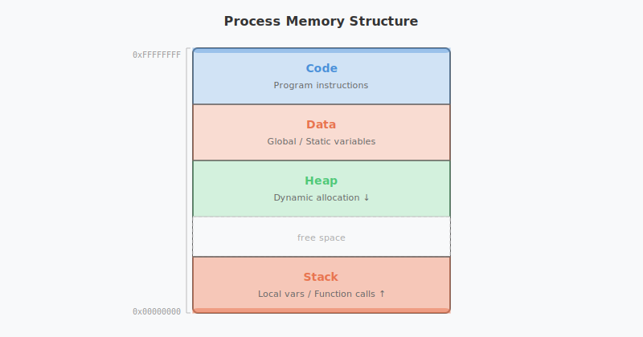

Each region serves the following purpose:

- **Code**: Stores the compiled program instructions (machine code). It is read-only, and all functions and logic that the process executes reside here.
- **Data**: Stores global variables and `static` variables. Allocated at program start and persists until termination.
- **Heap**: A memory region for **dynamic allocation** using keywords like `new`. Developers request memory at runtime as needed and free it when done. In Java, the GC (Garbage Collector) handles this deallocation automatically.
- **Stack**: Stores **local variables**, parameters, and return addresses created during function calls. A stack frame is pushed with each function call and popped when the function returns.

In the diagram, you'll notice memory addresses are labeled with `0xFFFFFFFF` (high address) at the top and `0x00000000` (low address) at the bottom. This represents the **virtual memory address space** that the OS assigns to each process. On a 32-bit system, each process has an address space ranging from 0 to approximately 4GB (`0xFFFFFFFF`).

The key design here is the **growth direction of Heap and Stack**. The Heap grows from low to high addresses (↓), while the Stack grows from high to low addresses (↑). Since the two regions expand in opposite directions, the free space between them is utilized as efficiently as possible. If both grew in the same direction, one running out of space couldn't leverage the other's remaining capacity. This design allows the Heap and Stack to share available space flexibly.

### Single-threaded vs. Multithreaded

A process with a single stack is called **single-threaded**. A **thread** is a smaller unit of execution within a process.

**Multithreading** creates multiple stacks within a single process, making it appear as though various tasks are processed simultaneously. The key point is that **threads share the code, data, and heap regions**. This makes multithreading less resource-intensive than running multiple single-threaded processes.

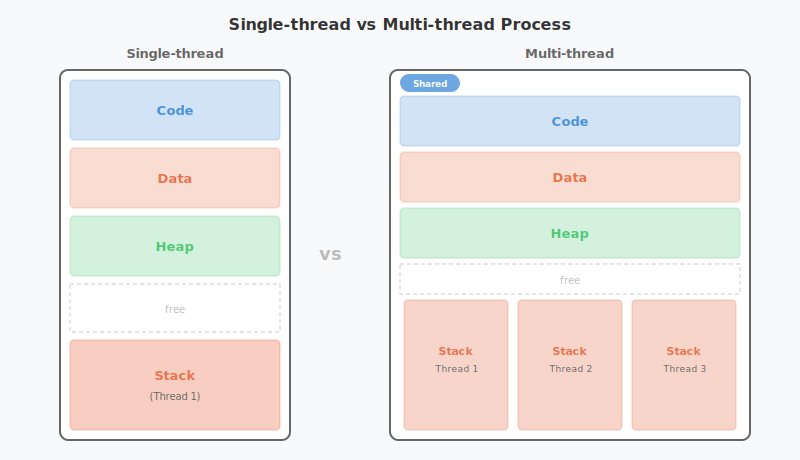

However, multithreading comes with a critical caveat. When multiple threads access and modify shared data simultaneously, **concurrency problems** arise. Consider this simple example:

```java
public class Counter {
    private int count = 0;

    public void increment() {
        count++;  // read → modify → write: these three steps are not atomic
    }

    public int getCount() {
        return count;
    }
}
```

If two threads call `increment()` simultaneously, both may read the same value, add 1, and store it — resulting in only a single increment. This is known as a **race condition**. The `synchronized` keyword can prevent this:

```java
public class Counter {
    private int count = 0;

    public synchronized void increment() {
        count++;  // only one thread can execute at a time
    }

    public synchronized int getCount() {
        return count;
    }
}
```

Beyond `synchronized`, Java provides various synchronization mechanisms including spinlocks, semaphores, and `AtomicInteger` from the `java.util.concurrent` package.

> **A Common Pitfall in Spring**: Spring's default bean scope is **Singleton**. This means all request threads **share the same bean instance**. If you store state (instance variables) in a bean, you'll encounter the exact same concurrency issues described above. Spring beans should always be designed as **stateless**.

```java
// BAD - Storing state in a singleton bean causes data corruption across threads
@Service
public class OrderService {
    private int todayOrderCount = 0;  // shared by all threads!

    public void placeOrder() {
        todayOrderCount++;  // Race condition occurs
    }
}

// GOOD - Delegate state to a DB or external store
@Service
public class OrderService {
    private final OrderRepository orderRepository;

    public void placeOrder(Order order) {
        orderRepository.save(order);  // DB transactions handle concurrency
    }
}
```

### Java's Multithreading Implementation

Java supports multithreading at the language level in two ways:

**Extending the Thread class:**

```java
public class MyThread extends Thread {
    public void run() {
        System.out.println("Thread running!");
    }
}
new MyThread().start();
```

**Implementing the Runnable interface:**

```java
public class MyRunnable implements Runnable {
    public void run() {
        System.out.println("Runnable running!");
    }
}
new Thread(new MyRunnable()).start();
```

When implementing multithreading directly, you must manage synchronization manually using **Lock** and `synchronized`. However, Spring Boot makes this far more convenient through the concept of **thread pools**.

### Tomcat's Thread Pool

A **thread pool** is a pool of pre-created threads designed to manage multithreading efficiently. When a new task arrives, an idle thread from the pool handles it, and once the task is complete, the thread returns to the pool. This reduces the overhead of creating and destroying threads, improving response times.

In Spring Boot, thread pool management is handled not by Spring Boot itself, but by the embedded **Tomcat** (servlet container).

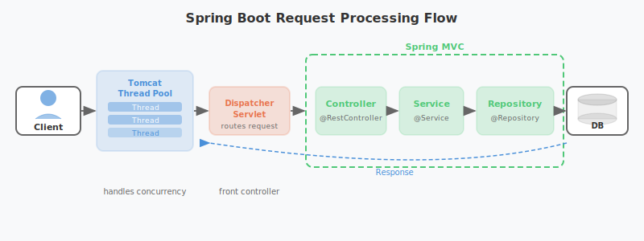

The key player in this diagram is the **DispatcherServlet**. It implements Spring MVC's **Front Controller** pattern, receiving all HTTP requests at a single entry point and routing them to the appropriate Controller. The reason developers can define request handling with just `@RequestMapping` annotations — without mapping servlets to individual URLs — is thanks to DispatcherServlet.

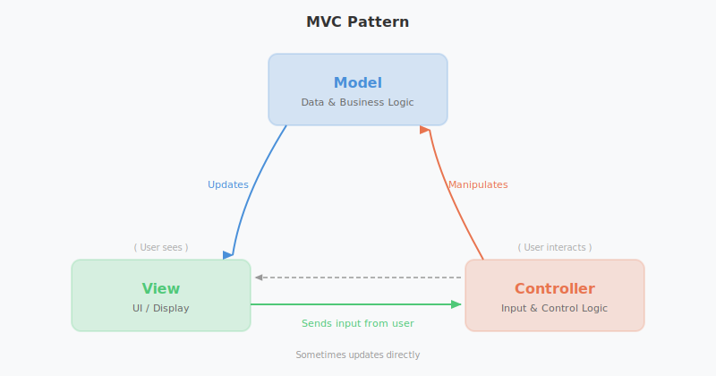

**Tomcat** is a servlet container that processes HTTP requests. It parses the complex HTTP request structure on behalf of the developer.

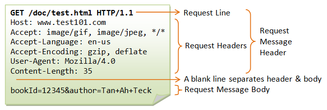

In early versions of Tomcat (before 3.2), a new thread was created for each request and destroyed afterward. Creating threads on-the-fly for concurrent requests caused significant overhead, so the approach shifted to pre-creating threads and maintaining them in a pool.

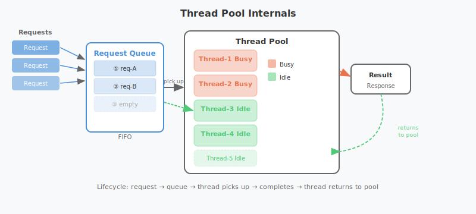

When an HTTP request arrives, a task is placed in a queue, and an idle thread picks it up. You can configure the thread pool in `application.yaml`:

```yaml
server:
  tomcat:
    threads:
      max: 200        # maximum number of threads
      min-spare: 10   # number of always-active (idle) threads
    accept-count: 100  # task queue size
```

By default, up to 200 threads can be created, with a minimum of 10 idle threads maintained. The task queue can hold up to 100 pending tasks. These values should be tuned according to CPU usage and request patterns.

### HikariCP Connection Pool

We've seen that Tomcat, the servlet container, handles requests using multiple threads. But how are database connections managed?

Creating a new connection every time data is read from or written to the database carries significant overhead. To solve this, a **connection pool** is used — the same concept as a thread pool. Connections are pre-created and reused as needed.

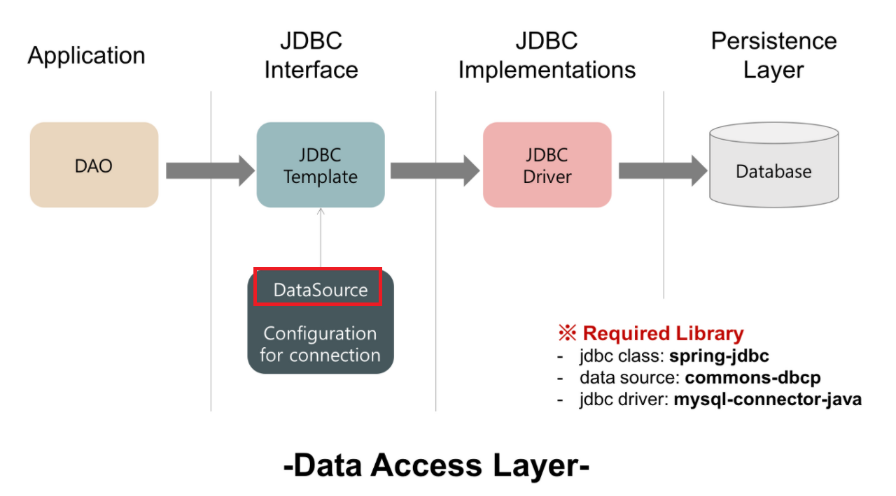

The standard interface for database connectivity in the Spring ecosystem is **JDBC** (Java Database Connectivity). Since Spring Boot 2.0, **HikariCP** has been the default connection pool. It can be configured in `application.yaml`:

```yaml
spring:
  datasource:
    url: jdbc:mysql://localhost:3306/mydb
    username: myuser
    password: mypassword
    hikari:
      maximum-pool-size: 10        # maximum number of connections
      connection-timeout: 5000     # connection acquisition wait time (ms)
      connection-init-sql: SELECT 1
      validation-timeout: 2000     # connection validation time (ms)
      minimum-idle: 10             # minimum number of idle connections
      idle-timeout: 600000         # idle connection retention time (ms)
      max-lifetime: 1800000        # maximum connection lifetime (ms)
```

Concurrency issues that arise when multiple threads write data simultaneously are handled by HikariCP and the database's transaction mechanisms.

In summary, Spring Boot is called a **multithreaded application** for the following reasons:

1. **Tomcat Thread Pool**: Handles HTTP requests with multiple threads
2. **HikariCP Connection Pool**: Handles DB I/O with multiple threads
3. **JVM**: Manages Java's Thread class and bytecode execution itself in a multithreaded manner

The entire pipeline operates with multithreading from start to finish.

### Virtual Threads: Java 21's Game Changer

Traditional Java threads are **platform threads** that map 1:1 to OS threads. OS threads are expensive to create (approximately 1MB of stack memory each), and creating thousands of them causes context-switching overhead to spike. This is the fundamental reason thread pools exist.

**Virtual Threads**, officially introduced in Java 21, fundamentally solve this limitation. As lightweight threads managed by the JVM, they use an **M:N threading model** that maps many virtual threads onto a smaller number of OS threads.

```java
// Traditional platform thread
Thread platformThread = new Thread(() -> {
    System.out.println("Platform Thread");
});

// Virtual Thread - extremely low creation cost
Thread virtualThread = Thread.ofVirtual().start(() -> {
    System.out.println("Virtual Thread");
});

// Even millions of Virtual Threads are possible
try (var executor = Executors.newVirtualThreadPerTaskExecutor()) {
    for (int i = 0; i < 1_000_000; i++) {
        executor.submit(() -> {
            Thread.sleep(Duration.ofSeconds(1));
            return "Done";
        });
    }
}
```

The key advantage of Virtual Threads is that **they don't hold an OS thread during blocking I/O**. When entering an I/O wait state, the JVM unmounts the virtual thread from the OS thread and mounts another virtual thread in its place. This maximizes concurrency without being constrained by thread pool size.

Starting with Spring Boot 3.2, you can switch Tomcat's request handling to Virtual Threads with a single configuration line:

```yaml
spring:
  threads:
    virtual:
      enabled: true
```

This setting alone can dramatically improve throughput without modifying any existing synchronous blocking code.

### Spring WebFlux: The Reactive Alternative

Before Virtual Threads, the Spring ecosystem's approach to achieving high concurrency was **Spring WebFlux**. It brought a **non-blocking reactive** model — similar to Node.js — to Java/Spring.

```java
@GetMapping("/users/{id}")
public Mono<User> getUser(@PathVariable String id) {
    return userRepository.findById(id);  // non-blocking return
}
```

WebFlux runs on **Netty** and uses an event loop pattern. It can achieve high throughput with fewer threads, but the steep learning curve of reactive programming and compatibility issues with existing JDBC-based libraries were drawbacks.

With the arrival of Virtual Threads, it became possible to achieve concurrency comparable to WebFlux while maintaining the familiar synchronous code style. For this reason, the current trend is to consider Virtual Threads first for new projects, and to choose WebFlux only when streaming or backpressure control is needed.

---

## 3. Node.js vs. Java/Spring: A Structural Comparison

Node.js and Java/Spring differ fundamentally in how they handle concurrency.

### Node.js: Single-threaded Event Loop

Node.js uses a **single-threaded event loop** model. A single main thread runs the event loop, processing incoming requests. I/O operations (file reads, DB queries, network requests, etc.) are handled **asynchronously** (non-blocking) — when I/O completes, callbacks are registered in the event queue and processed by the event loop.

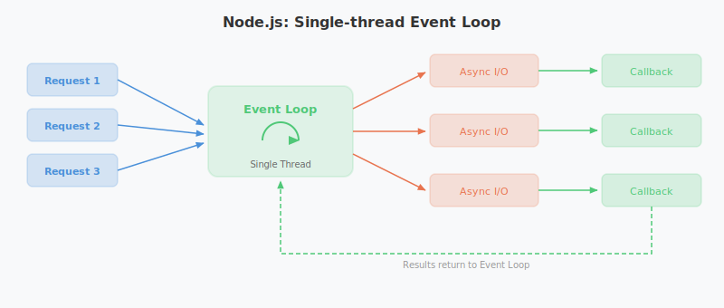

However, "single-threaded" only applies to the **event loop itself**. Inside Node.js is a C library called **libuv**, and operations like file system I/O and DNS lookups — which the OS doesn't support asynchronously — are handled by libuv's **thread pool** (4 threads by default). Network I/O leverages the OS's epoll/kqueue, bypassing the thread pool entirely. In other words, Node.js presents a single-threaded model to developers while internally utilizing multithreading where needed.

### Java/Spring: Multithread Pool

Java/Spring uses a **multithread pool** model. Tomcat's thread pool assigns a separate thread to each request. By default, each thread processes the request synchronously (blocking) from start to finish.

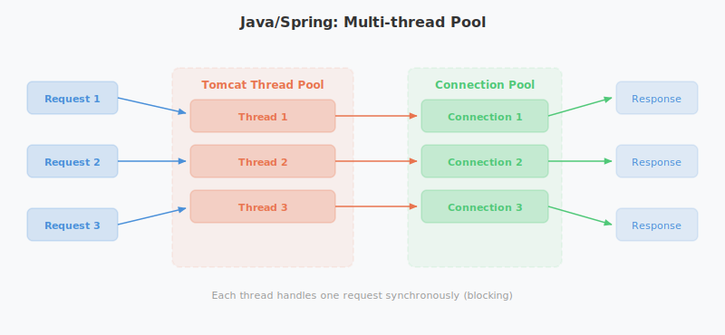

### Comparison Summary

| Category | Node.js | Java/Spring |
|----------|---------|-------------|
| **Threading Model** | Single-threaded event loop | Multithread pool (Tomcat) |
| **I/O Handling** | Asynchronous non-blocking | Synchronous blocking (default) |
| **Concurrency Mechanism** | Event loop + callbacks/Promises | Thread pool + synchronization |
| **CPU-intensive Tasks** | Risk of blocking main thread | Parallel processing in separate threads |
| **Memory Usage** | Relatively low | Per-thread memory allocation required |
| **DB Connectivity** | Async drivers | HikariCP connection pool |
| **Scaling Strategy** | Cluster module (process replication) | Thread pool size adjustment |

### Strengths of Each Model

**Node.js Strengths:**
- High throughput for I/O-bound workloads
- Handles many concurrent connections with low memory
- Clean asynchronous code (async/await)
- Well-suited for real-time applications (chat, streaming)

**Java/Spring Strengths:**
- True parallel processing for CPU-intensive tasks
- Mature concurrency control mechanisms (synchronized, Lock, Concurrent package)
- Battle-tested reliability in large-scale enterprise systems
- Intuitive per-thread debugging and stack traces

> "Spring Boot handles large-scale traffic best."

You'll hear this often, and this is exactly why. The JVM's multithreading support, Tomcat's thread pool, and HikariCP's connection pool work together organically to deliver high throughput and stability.

---

## 4. Conclusion

For 30 years, Java has upheld the "Write Once, Run Anywhere" philosophy, and the Spring ecosystem built on top of it has become the de facto standard for enterprise backends.

Here's a summary of the key points covered in this article:

1. **JVM bytecode + multithreading** support forms the foundation of Java.
2. The **Tomcat thread pool** handles HTTP requests and the **HikariCP connection pool** handles DB I/O with multithreading, enabling Spring Boot's high throughput.
3. **Virtual Threads** (Java 21) represent a new paradigm that maximizes concurrency beyond the limits of OS threads.
4. Node.js's single-threaded event loop and Java/Spring's multithread pool each have their strengths — the right choice depends on **workload characteristics**.

There's no single right answer in technology choices. What matters is understanding **why each technology was designed the way it was** and picking the right tool for the problem at hand.

---

## References

- [Oracle] Introduction to Java: https://www.oracle.com/java/technologies/introduction-to-java.html
- [Wikipedia] Java (programming language): https://ko.wikipedia.org/wiki/자바_(프로그래밍_언어)
- [JetBrains] The State of Developer Ecosystem 2023: https://www.jetbrains.com/lp/devecosystem-2023/
- [velog] How does Spring Boot handle multiple requests?: https://velog.io/@sihyung92/how-does-springboot-handle-multiple-requests
- [velog] Spring DB Connection Pool and Hikari CP: https://velog.io/@miot2j/Spring-DB커넥션풀과-Hikari-CP-알아보기
- [Gradle] Gradle vs Maven Performance: https://gradle.org/gradle-vs-maven-performance/
- [JEP 444] Virtual Threads: https://openjdk.org/jeps/444
- [Spring Blog] Spring Boot 3.2 Virtual Threads: https://spring.io/blog/2023/09/09/all-together-now-spring-boot-3-2-graalvm-native-images-java-21-and-virtual
