[이전 글]()에서 Java와 Spring의 멀티스레드 아키텍처를 다뤘다. 요청 하나당 스레드 하나를 할당하고, Lock과 동기화 메커니즘으로 공유 자원을 관리하는 전통적인 멀티스레드 모델이었다. 그런데 같은 서버 사이드 영역에서, 이와 완전히 반대되는 철학을 가진 진영이 있다. 바로 **JavaScript와 Node.js**이다.

자바스크립트는 **싱글스레드 기반이며 논블로킹 패러다임의 비동기적 동시성 언어**이다. Lock도 없고, 세마포어도 없고, 데드락도 없다. 그런데 어떻게 싱글스레드로 수만 개의 동시 연결을 처리할 수 있을까? 그리고 Node.js는 정말 싱글스레드인가, 아니면 멀티스레드인가? 이 논쟁은 왜 끝나지 않는 것일까?

이 글에서는 세 가지 주제를 하나의 흐름으로 엮어 다룬다. 먼저 자바스크립트의 이벤트 루프가 싱글스레드 환경에서 어떻게 비동기 처리를 구현하는지 분석하고, Node.js가 "싱글스레드인가, 멀티스레드인가?"라는 오래된 논쟁에 대해 libuv와 함께 답을 찾아본다. 마지막으로 콜백에서 async/await까지 비동기 프로그래밍 패러다임의 진화를 정리한다.

---

## 1. JavaScript 이벤트 루프

Javascript는 싱글스레드인지 멀티스레드인지 알기 위해서는 먼저 이벤트 루프라는 개념에 대해서 알아야 한다.

### V8 엔진의 구조

자바스크립트를 실행하는 **V8 엔진**은 구글에서 제작한 C++로 작성된 자바스크립트 엔진이다. 구글 크롬에 탑재되어 자바스크립트를 작동시키는 역할을 하며, 오픈소스이기 때문에 Node.js에서도 활용한다.

V8 엔진의 작동 원리는 다음과 같다.

1. 자바스크립트 소스 코드를 **파서**(Parser)에게 넘긴다.
2. 파서는 소스 코드를 **AST**(Abstract Syntax Tree, 추상 구문 트리)로 변환한다.
3. AST를 **Ignition** 인터프리터에게 넘기면 자바스크립트를 **바이트 코드**로 변환한다.
4. 바이트 코드를 실행하면서 자주 실행되는 코드는 **TurboFan** 컴파일러로 보내 최적화된 머신 코드로 컴파일한다.

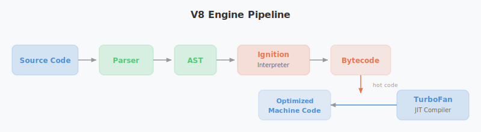

위 과정이 자바스크립트를 실행하는 V8 엔진의 원리이다.

### 싱글 콜 스택과 비동기 처리

> "싱글 스레드 == 싱글 콜 스택 == 한 번에 한 줄의 코드를 실행한다는 것" - Philip Roberts

V8 엔진은 **하나의 Call Stack**을 가지고 있다. 구조적으로 한 번에 하나밖에 처리하지 못하는 명실상부한 싱글스레드 언어이다. 그런데 어떻게 이런 싱글스레드 언어가 멀티스레드와 유사한 퍼포먼스를 낼 수 있을까?

그 비밀은 바로 **Web APIs**, **이벤트 루프**(Event Loop), **콜백 큐**(Callback Queue)의 협력에 있다.

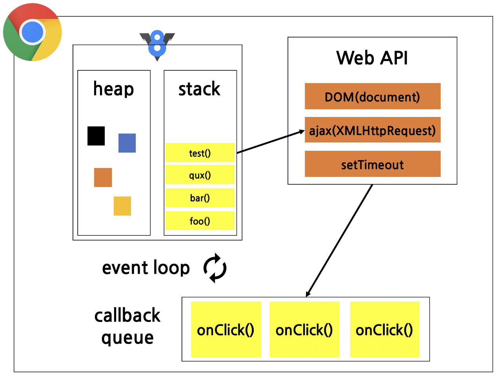

위 그림은 크롬 브라우저에 탑재된 자바스크립트 런타임 환경이다. 그림을 보면 V8이라는 로고와 함께 하나의 힙과 하나의 콜 스택이 있는 것을 볼 수 있다. 즉 V8 엔진이 실행시키는 자바스크립트는 일반적으로 하나의 콜 스택을 사용한다.

V8 엔진의 Call Stack 옆에 Web APIs, Callback Queue, Event Loop가 함께 동작한다. 비동기 처리를 지원하는 작업들(예: `setTimeout`, 네트워크 요청)은 **Web APIs**에서 처리되고, 작업이 끝나면 **Callback Queue**로 보내진다. 이후 **Event Loop**가 이를 감지하여 Call Stack이 비었을 때 적절하게 함수를 집어넣는다.

즉, 브라우저 레벨에서는 Web APis와 Callback Queue의 도움으로 비동기적으로 동작하게 되며, 싱글스레드이면서도 비동기 기반으로 괜찮은 퍼포먼스를 보일 수 있는 것이다. 이번에는 동기와 비동기 처리에 대해서 살펴보자.

### 동기 함수의 실행 흐름

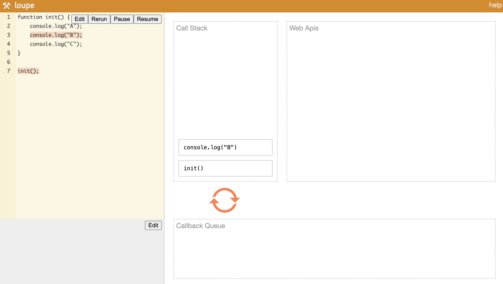

비동기 함수가 없는 일반적인 경우를 살펴보자. `init()` 함수를 호출하면 해당 함수 안에 있는 `console.log`가 **Call Stack**에 쌓인다. 쌓인 `console.log`는 바로 처리되며, 모든 처리가 끝나면 마지막으로 `init` 함수가 Call Stack에서 제거되면서 실행이 종료된다.

### 비동기 함수의 실행 흐름

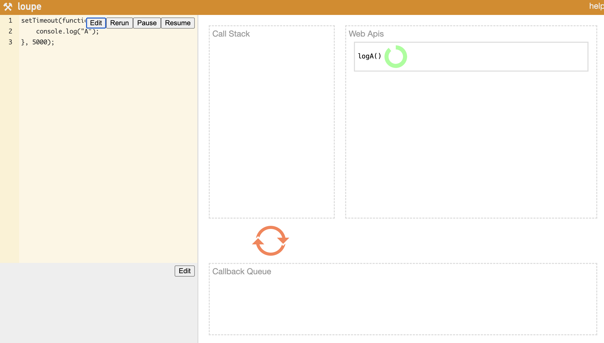

가장 대표적인 비동기 함수는 `setTimeout`이다. `setTimeout`과 같은 비동기 함수는 먼저 **Call Stack**에 올라간 다음 **Web APIs**로 이동한다. Web APIs 내에서 타이머 동작을 마치면 **콜백 함수**를 Callback Queue에 집어넣고, Event Loop가 이를 하나씩 Call Stack으로 올려 보낸다.

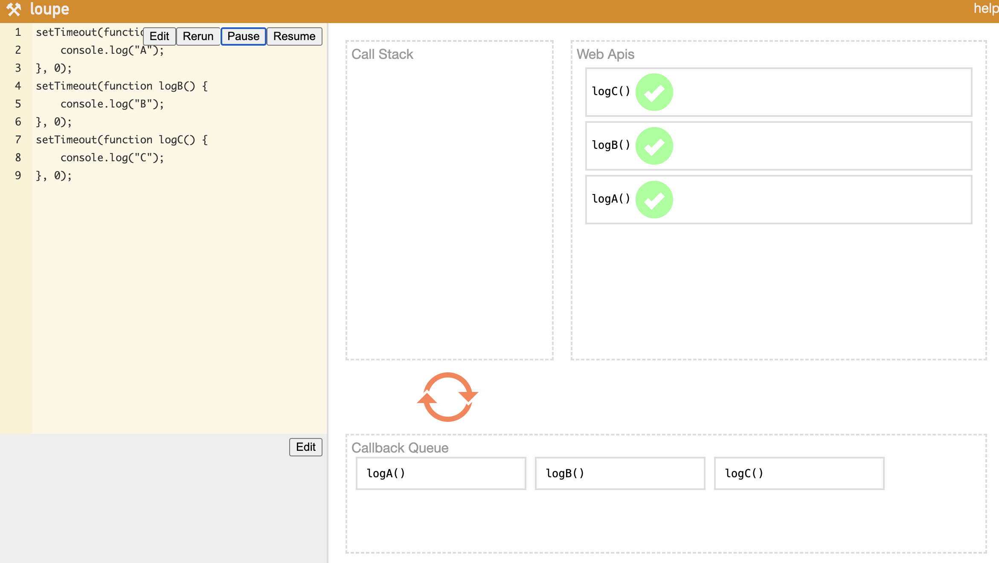

`setTimeout`을 여러 개 사용하는 경우, 소스 코드를 한 줄씩 훑으며 차례대로 Call Stack에 갔다가 Web APIs로 보내진다. 그 후 각 콜백 함수가 처리 완료되면 **Callback Queue**에 쌓이고, Event Loop가 하나씩 Call Stack으로 보낸다. 이런 메커니즘 덕분에 **Call Stack, Web APIs, Callback Queue, Event Loop**가 상호작용하면서 싱글스레드 기반의 자바스크립트가 멀티스레드에 뒤지지 않는 퍼포먼스를 발휘할 수 있는 것이다.

---

## 2. Node.js 스레딩 모델

이벤트 루프 덕분에 싱글스레드인 자바스크립트가 비동기 처리를 할 수 있다는 것을 알았다. 그런데 이 메커니즘이 브라우저를 벗어나 서버 사이드로 넘어오면 이야기가 달라진다. Node.js는 이 구조를 어떻게 가져왔고, 그래서 정말 싱글스레드인 것일까?

### Node.js란 무엇인가

Node.js 공식 홈페이지의 소개에 따르면 다음과 같다.

> Node.js는 오픈소스 및 크로스 플랫폼 자바스크립트 런타임 환경입니다. Node.js는 구글 크롬의 핵심인 V8 자바스크립트 엔진을 브라우저 외부에서 실행합니다.

핵심은 **브라우저 외부에서 실행한다**는 점이다. 자바스크립트는 원래 웹사이트를 위해 태어난 언어로, 1995년 넷스케이프 커뮤니케이션즈의 브렌던 아이크에 의해 개발되었다. 웹 브라우저에서 HTML, CSS와 함께 동작하는 V8 엔진을, 브라우저 밖에서도 독립적으로 실행할 수 있게 만든 것이 바로 **Node.js**이다.

자바스크립트는 그 자체로 혼자서 실행하기 어렵다. 브라우저 내에서 Web APIs와 함께 실행되는데, Node.js는 Web APIs 대신에 libuv를 사용해서 비동기 기반으로 퍼포먼스를 끌어올린다.

### 싱글스레드인가, 멀티스레드인가?

자바스크립트는 이견 없이 태생부터 싱글스레드이다. 하지만 Node.js를 싱글스레드로 보느냐 멀티스레드로 보느냐에 대해서는 관점 차이가 있다. 결론부터 말하면 **"둘 다 맞다"** — 어디에 초점을 맞추느냐에 달려 있다.

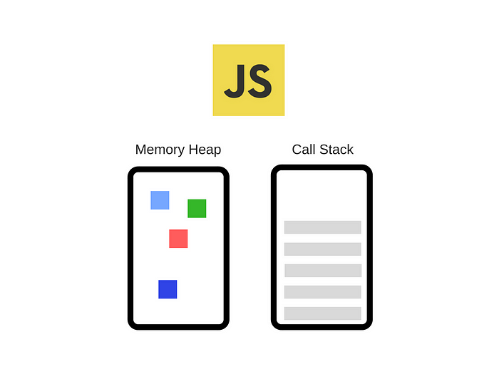

자바스크립트는 하나의 **콜 스택**(Call Stack)을 가지고 있으며, 콜 스택에 있는 작업을 하나씩 처리해나가는 싱글스레드 방식으로 동작한다. **Memory Heap**에는 변수와 같은 정보가 저장되고, 함수를 실행하면 Call Stack에 하나씩 쌓인다.

### 블로킹 vs 논블로킹, 동기 vs 비동기

자바스크립트의 이벤트 루프를 이해하려면 먼저 **블로킹/논블로킹**과 **동기/비동기**의 차이를 알아야 한다.

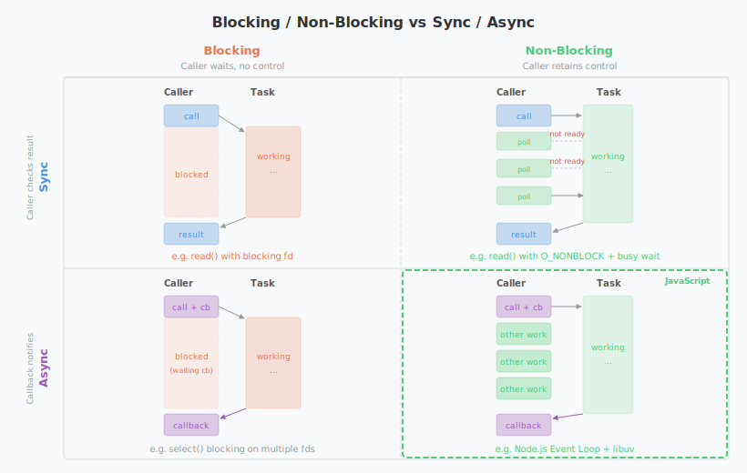

- **블로킹 vs 논블로킹**: 특정 함수를 실행하는 동안 다른 일을 할 수 있는가의 여부이다. 블로킹은 함수가 끝날 때까지 대기해야 하며, 논블로킹은 다른 일을 병행할 수 있다. **제어 권한의 유무**가 핵심이다.
- **동기 vs 비동기**: 작업 완료를 누가 확인하는가의 차이이다. 동기 작업은 호출한 측에서 완료 여부를 직접 확인하며, 비동기 작업은 **콜백**(Callback)이 완료를 알려준다.

자바스크립트가 싱글스레드이면서도 멀티스레드에 뒤처지지 않는 이유는 바로 **논블로킹 비동기 방식**으로 동작하기 때문이다. 특정 작업을 콜백으로 실행한 다음 다른 작업을 수행하고, 비동기 작업이 처리되어 콜백 함수가 돌아오면 그때 그 결과를 처리하는 방식이다.

### 비동기 함수와 비동기 동작의 차이

자바스크립트에서 `async`와 `await` 키워드는 각각 다음과 같은 역할을 한다.

- **async**: 함수 앞에 붙이면 해당 함수는 자동으로 `Promise`를 반환하는 **비동기 함수**가 된다.
- **await**: 비동기 함수가 완료될 때까지 **기다린 후** 결과를 반환한다.

중요한 점은, **비동기 함수 자체가 별도로 처리되는 것이 아니라, 비동기 함수 안의 비동기 동작이 별도로 처리된다**는 것이다.

```javascript
async function example() {
    console.log("1. 함수 시작");

    setTimeout(() => {
        console.log("2. 비동기 작업(setTimeout) 완료");
    }, 2000); // 2초 후 실행

    console.log("3. 함수 종료");
}
```

위 코드에서 `setTimeout()`은 비동기 동작이다. 실행하면 1번과 3번이 먼저 출력되고, 2초 후에 2번이 출력된다. `setTimeout`에서 멈추지 않고 나머지 코드가 먼저 실행되는 것이 핵심이다.

`await`를 사용하면 비동기 동작의 완료를 기다릴 수 있다.

```javascript
function delay(ms) {
    return new Promise(resolve => setTimeout(resolve, ms));
}

async function example() {
    console.log("1. 함수 시작");

    await delay(2000); // 2초 기다림 (비동기 동작)

    console.log("2. 2초 후 실행됨");
}

example();
console.log("3. 함수 실행 후 다른 작업 수행");
```

위 코드는 `example()` 함수 실행 중 `await`을 만나면, `example()` 내부에서는 2초를 기다리지만 자바스크립트는 논블로킹 방식으로 동작하므로 `"3. 함수 실행 후 다른 작업 수행"`이 먼저 출력된다. 2초 후에야 `"2. 2초 후 실행됨"`이 출력된다.

만약 `await` 없이 성급하게 비동기 함수의 결과를 확인하면, 아직 완료되지 않은 **Promise** 객체가 반환된다.

```javascript
async function example() {
    return delay(2000); // await을 사용하지 않음
}

console.log(example()); // Promise { <pending> }
```

### 이벤트 루프의 동작 구조


자바스크립트를 실행하면 콜 스택에 있는 함수를 하나씩 싱글스레드로 처리한다. 논블로킹 비동기 방식으로 동작하려면, 비동기 작업을 대신 처리해줄 존재가 필요하다.

- **웹 브라우저 환경**: **Web APIs**가 멀티스레드 형식으로 비동기 작업을 처리한다.
- **Node.js 환경**: **libuv**가 멀티스레드를 지원하여 비동기 작업을 처리한다.

바로 이 지점에서 **자바스크립트를 멀티스레드라고 볼 수 있는 관점**이 나온다. Web APIs와 libuv는 각각 멀티스레드로 동작하며, Java의 스레드풀처럼 libuv 또한 스레드풀을 가지고 있다. libuv의 기본 스레드풀 크기는 **4개**이며, 환경 변수 `UV_THREADPOOL_SIZE`로 최대 1024개까지 조정할 수 있다.

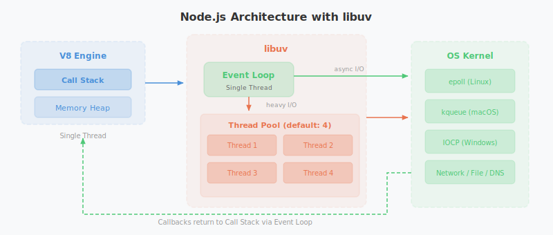

### Callback Queue: Task Queue와 Microtask Queue

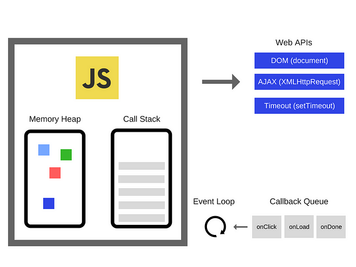

자바스크립트에서 실행된 모든 함수는 먼저 콜 스택으로 들어온다. 그중 비동기 함수는 Web APIs(또는 libuv)를 호출하고, 완료된 콜백 함수를 **콜백 큐**에 집어넣는다.

콜백 큐는 사실 하나가 아니라 **두 개**이다.

- **Task Queue**: `setTimeout`, `setInterval` 등이 완료된 후 실행될 콜백이 대기하는 곳
- **Microtask Queue**: `Promise.then()`, `MutationObserver` 등의 작업이 들어가는 큐

**Microtask Queue가 우선순위가 더 높다.** 이벤트 루프가 한 사이클을 돌 때마다 가장 먼저 실행되며, 대부분 즉시 실행될 필요가 있는 중요한 비동기 로직들이 이곳에 들어간다.

#### Node.js의 `process.nextTick()`

Node.js 환경에서는 한 가지 더 알아야 할 것이 있다. `process.nextTick()`으로 등록된 콜백은 **Microtask Queue보다도 먼저 실행된다.** 정확히는, 이벤트 루프의 각 단계가 전환될 때마다 `nextTickQueue`가 가장 먼저 비워지고, 그 다음 Microtask Queue, 마지막으로 Task Queue 순서로 처리된다.

```javascript
setTimeout(() => console.log("1. Task Queue (setTimeout)"), 0);

Promise.resolve().then(() => console.log("2. Microtask Queue (Promise)"));

process.nextTick(() => console.log("3. nextTickQueue (process.nextTick)"));

console.log("4. Call Stack (동기 코드)");

// 실행 순서:
// 4. Call Stack (동기 코드)
// 3. nextTickQueue (process.nextTick)
// 2. Microtask Queue (Promise)
// 1. Task Queue (setTimeout)
```

실행 순서를 보면 동기 코드가 가장 먼저 실행되고, 그 다음 `process.nextTick()`, `Promise`, `setTimeout` 순서이다. 이 우선순위를 정리하면 다음과 같다.

| 우선순위 | 큐 | 대표 API |
|----------|------|----------|
| 1 (최우선) | nextTickQueue | `process.nextTick()` |
| 2 | Microtask Queue | `Promise.then()`, `queueMicrotask()` |
| 3 | Task Queue | `setTimeout()`, `setInterval()`, `setImmediate()` |

> `process.nextTick()`을 과도하게 사용하면 이벤트 루프가 다음 단계로 넘어가지 못하는 **I/O starvation** 문제가 발생할 수 있다. Node.js 공식 문서에서도 대부분의 경우 `queueMicrotask()`나 `setImmediate()`를 권장한다.

### Event Loop의 6단계

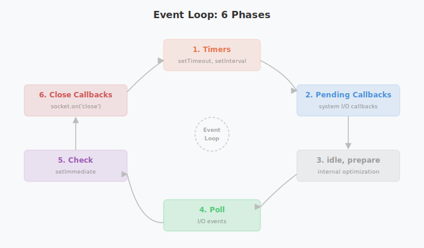

"이벤트 루프가 한 사이클을 돈다"라는 표현에서 **Loop**는 6개의 단계(Phase)를 순환한다는 의미이다. 각 단계에서 비동기 작업의 실행 순서를 결정하며, 그 구성은 다음과 같다.

1. **Timers**: `setTimeout()`, `setInterval()` 콜백 실행
2. **Pending Callbacks**: 일부 시스템 I/O 작업의 콜백 실행 (TCP 오류 등)
3. **idle, prepare**: 내부적인 최적화 작업 수행 (libuv 최적화)
4. **Poll**: 대기 중인 I/O 이벤트를 확인하고 처리
5. **Check**: `setImmediate()` 콜백 실행
6. **Close Callbacks**: `socket.on('close', callback)` 같은 닫기 이벤트 실행

웹 브라우저에서는 **Chromium** 같은 브라우저 엔진이 이벤트 루프의 구현을 담당하고, Node.js에서는 **libuv**가 이 역할을 수행한다.

### Node.js는 공식적으로 싱글스레드

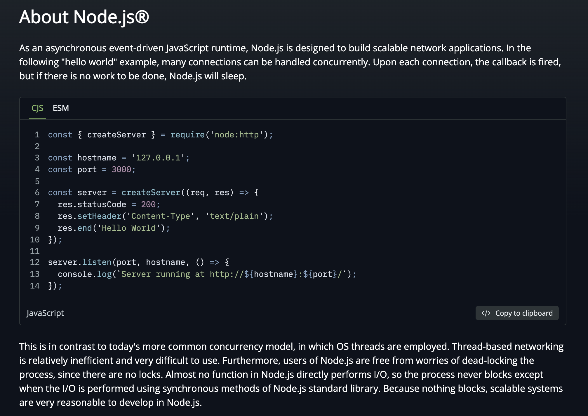

[Node.js 공식 문서(About Node.js)](https://nodejs.org/en/about)를 보면, Node.js는 **싱글스레드**임을 명확히 내세운다. 가장 결정적인 증거는 **Node.js 사용자에게는 Lock이 없다**는 것이다.

멀티스레드 환경에서는 하나의 자원에 동시에 접근하는 여러 스레드에 대해 **데드락**(Deadlock)을 방지하기 위한 스핀락, 세마포어, 뮤텍스 등의 동기화 메커니즘이 필요하다. 하지만 Node.js에는 이런 것이 없다 — 이것이 Node.js가 싱글스레드라는 강력한 반증이다.

> 논블로킹과 블로킹의 차이에 대해 더 자세히 알고 싶다면, Node.js 공식 문서의 [Overview of Blocking vs Non-Blocking](https://nodejs.org/learn/asynchronous-work/overview-of-blocking-vs-non-blocking)을 참고하자.

정리하면 다음과 같다.

| 관점 | 근거 |
|------|------|
| **싱글스레드** | 자바스크립트 자체는 하나의 콜 스택으로 동작하며, Lock 메커니즘이 없다 |
| **멀티스레드** | libuv가 스레드풀을 가지고 비동기 I/O를 멀티스레드로 처리한다 |

둘 다 틀린 말은 아니다. 다만 **메인 실행 흐름**(자바스크립트 코드 실행)은 싱글스레드이고, **비동기 I/O 처리를 돕는 libuv**는 멀티스레드라는 것이 정확한 설명이다.

### 싱글스레드의 아킬레스건: CPU 집약적 작업

Node.js의 이벤트 루프는 I/O 작업에는 강력하지만, **CPU 집약적 작업**에는 치명적인 약점을 가지고 있다. 이벤트 루프는 하나의 스레드에서 돌아가기 때문에, 하나의 작업이 CPU를 오래 점유하면 **이벤트 루프 자체가 블로킹**되어 다른 모든 요청이 멈춘다.

```javascript
// 이벤트 루프를 블로킹하는 예시
app.get("/heavy", (req, res) => {
    // 50억 번의 반복 — 이 동안 다른 모든 요청이 대기
    let sum = 0;
    for (let i = 0; i < 5_000_000_000; i++) {
        sum += i;
    }
    res.json({ result: sum });
});

app.get("/health", (req, res) => {
    // /heavy가 끝날 때까지 이 요청도 응답하지 못한다
    res.json({ status: "ok" });
});
```

대용량 JSON 파싱, 이미지 리사이징, 암호화 연산, 복잡한 정규식 매칭 등이 대표적인 CPU 집약적 작업이다. 이런 작업이 이벤트 루프에서 직접 실행되면, 해당 작업이 끝날 때까지 서버 전체가 응답 불능 상태에 빠진다.

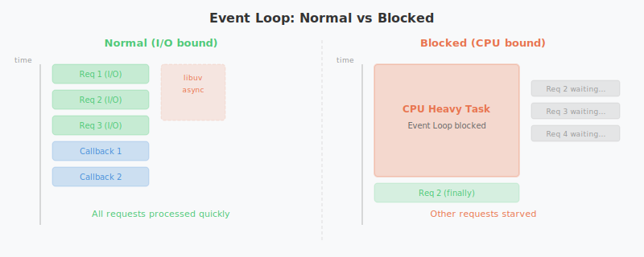

### Worker Threads: Node.js의 멀티스레드 해법

Node.js 10.5부터 도입된 **Worker Threads**는 이 문제에 대한 공식적인 해법이다. 메인 스레드와 별도의 스레드에서 자바스크립트를 실행할 수 있게 해주며, 각 Worker는 **독립적인 V8 인스턴스**와 이벤트 루프를 가진다.

```javascript
// main.js — 메인 스레드
const { Worker } = require("worker_threads");

app.get("/heavy", (req, res) => {
    const worker = new Worker("./heavy-task.js");

    worker.on("message", (result) => {
        res.json({ result }); // Worker가 끝나면 응답
    });

    worker.on("error", (err) => {
        res.status(500).json({ error: err.message });
    });
});
```

```javascript
// heavy-task.js — Worker 스레드
const { parentPort } = require("worker_threads");

let sum = 0;
for (let i = 0; i < 5_000_000_000; i++) {
    sum += i;
}

parentPort.postMessage(sum); // 결과를 메인 스레드로 전달
```

Worker Threads의 핵심적인 특징은 다음과 같다.

- 각 Worker는 **독립적인 V8 인스턴스**를 가지므로 메인 스레드의 이벤트 루프를 블로킹하지 않는다
- `SharedArrayBuffer`를 통해 스레드 간 메모리를 공유할 수 있다
- `postMessage()`로 스레드 간 메시지를 주고받는다 (웹 브라우저의 Web Worker와 유사한 패턴)
- Java의 스레드와 달리, 공유 자원에 대한 **Lock이 여전히 불필요**하다 — 메시지 패싱 방식이기 때문이다

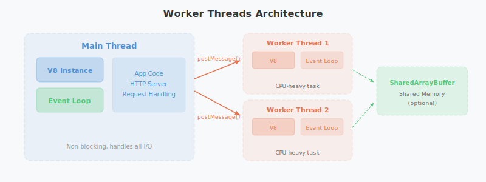

### Cluster 모듈: 멀티코어 CPU 활용

Worker Threads가 하나의 프로세스 안에서 스레드를 늘리는 방식이라면, **Cluster 모듈**은 아예 **프로세스 자체를 복제**하여 멀티코어 CPU를 활용하는 방식이다.

```javascript
const cluster = require("cluster");
const http = require("http");
const os = require("os");

if (cluster.isPrimary) {
    const numCPUs = os.cpus().length;
    console.log(`Primary process ${process.pid} is running`);
    console.log(`Forking ${numCPUs} workers...`);

    // CPU 코어 수만큼 Worker 프로세스 생성
    for (let i = 0; i < numCPUs; i++) {
        cluster.fork();
    }

    cluster.on("exit", (worker) => {
        console.log(`Worker ${worker.process.pid} died. Restarting...`);
        cluster.fork(); // 죽은 Worker 자동 재시작
    });
} else {
    // 각 Worker 프로세스가 동일한 포트를 공유
    http.createServer((req, res) => {
        res.writeHead(200);
        res.end(`Handled by worker ${process.pid}\n`);
    }).listen(8000);
}
```

Cluster의 동작 원리는 다음과 같다.

- **Primary 프로세스**가 여러 개의 **Worker 프로세스**를 `fork()`로 생성한다
- 각 Worker 프로세스는 **독립적인 Node.js 인스턴스**(V8 엔진 + 이벤트 루프)를 가진다
- OS 레벨에서 들어오는 네트워크 요청을 Worker들에게 **라운드 로빈** 방식으로 분배한다
- Worker가 죽으면 Primary가 이를 감지하고 새로운 Worker를 생성할 수 있다

실무에서는 Cluster 모듈을 직접 사용하기보다 **PM2** 같은 프로세스 매니저를 사용하는 경우가 많다. `pm2 start app.js -i max` 한 줄이면 CPU 코어 수만큼 프로세스를 자동으로 생성하고, 무중단 재시작과 로그 관리까지 처리해준다.

| 방식 | 단위 | 메모리 | 통신 방식 | 주요 용도 |
|------|------|--------|-----------|-----------|
| **Worker Threads** | 스레드 | 공유 가능(`SharedArrayBuffer`) | `postMessage()` | CPU 집약적 연산 |
| **Cluster** | 프로세스 | 독립 | IPC(프로세스 간 통신) | 멀티코어 활용, 수평 확장 |

---

## 3. 비동기 프로그래밍 패러다임의 진화

지금까지 이벤트 루프와 libuv가 **어떻게** 비동기를 처리하는지 내부 메커니즘을 살펴봤다. 그렇다면 개발자는 이 비동기를 코드로 **어떻게 표현**해왔을까? 앞서 `async/await`의 동작 방식을 간단히 살펴봤지만, 여기서는 자바스크립트 비동기 처리 방식이 언어의 성장과 함께 **왜, 어떤 순서로** 진화해 왔는지를 정리한다.

### Callbacks: 시작점

자바스크립트 비동기 처리의 원형은 **콜백 함수**이다. 비동기 작업이 완료되면 미리 전달해 둔 함수를 호출하는 방식이다.

```javascript
function fetchData(callback) {
    setTimeout(() => {
        callback(null, { id: 1, name: "marsboy" });
    }, 1000);
}

fetchData((error, data) => {
    if (error) {
        console.error("에러 발생:", error);
        return;
    }
    console.log("데이터:", data);
});
```

단순한 경우에는 직관적이지만, 비동기 작업이 중첩되면 이른바 **콜백 지옥**(Callback Hell)이 발생한다.

```javascript
// 콜백 지옥의 예시
getUser(userId, (error, user) => {
    getOrders(user.id, (error, orders) => {
        getOrderDetails(orders[0].id, (error, details) => {
            getShippingInfo(details.shippingId, (error, shipping) => {
                console.log("배송 정보:", shipping);
                // 점점 깊어지는 들여쓰기...
            });
        });
    });
});
```

코드의 가독성이 극단적으로 떨어지고 에러 처리도 각 단계마다 반복해야 하는 문제가 있었다.

### Promises: 체이닝의 등장

ES6(2015)에서 도입된 **Promise**는 콜백 지옥을 해결하기 위해 등장했다. 비동기 작업의 결과를 나타내는 객체로, `then()`과 `catch()`를 통해 체이닝 방식으로 비동기 흐름을 제어한다.

```javascript
function fetchUser(userId) {
    return new Promise((resolve, reject) => {
        setTimeout(() => {
            resolve({ id: userId, name: "marsboy" });
        }, 1000);
    });
}

fetchUser(1)
    .then(user => getOrders(user.id))
    .then(orders => getOrderDetails(orders[0].id))
    .then(details => getShippingInfo(details.shippingId))
    .then(shipping => console.log("배송 정보:", shipping))
    .catch(error => console.error("에러 발생:", error));
```

콜백 지옥의 깊은 들여쓰기가 평탄화되었고, `.catch()` 하나로 전체 체인의 에러를 한곳에서 처리할 수 있게 되었다.

Promise의 세 가지 상태는 다음과 같다.
- **Pending**: 아직 처리가 완료되지 않은 상태 (`Promise { <pending> }`)
- **Fulfilled**: 처리가 성공적으로 완료된 상태
- **Rejected**: 처리가 실패한 상태

### async/await: 동기식 코드처럼 작성하기

ES2017에서 도입된 `async/await`는 Promise 기반 코드를 마치 동기 코드처럼 작성할 수 있게 해주는 문법적 설탕(Syntactic Sugar)이다.

```javascript
async function getShippingInfoForUser(userId) {
    try {
        const user = await fetchUser(userId);
        const orders = await getOrders(user.id);
        const details = await getOrderDetails(orders[0].id);
        const shipping = await getShippingInfo(details.shippingId);

        console.log("배송 정보:", shipping);
        return shipping;
    } catch (error) {
        console.error("에러 발생:", error);
    }
}
```

위 코드는 비동기 작업임에도 불구하고 마치 동기 코드처럼 위에서 아래로 순서대로 읽힌다. `try/catch`를 사용한 에러 처리도 동기 코드와 동일한 패턴이다.

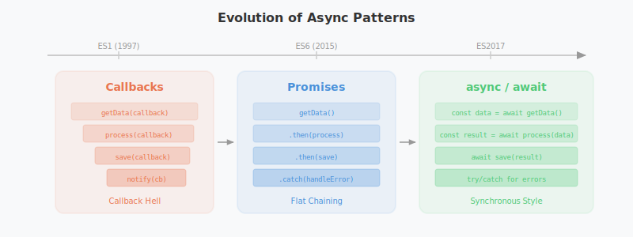

### 비동기 패러다임 비교

| 방식 | 도입 시기 | 장점 | 단점 |
|------|-----------|------|------|
| **Callbacks** | ES1 (1997) | 단순하고 직관적 | 콜백 지옥, 에러 처리 복잡 |
| **Promises** | ES6 (2015) | 체이닝, 통합 에러 처리 | `then()` 체인이 길어질 수 있음 |
| **async/await** | ES2017 | 동기식 가독성, `try/catch` 지원 | 최상위 레벨에서의 사용 제한 (ESM 모듈에서 해결) |

---

## 4. Java/Spring vs Node.js: 언제 무엇을 선택할 것인가

이벤트 루프의 구조, Node.js의 스레딩 모델, 비동기 패러다임의 진화까지 살펴봤다. 이제 처음 던졌던 질문으로 돌아가보자. [이전 글]()의 Java/Spring 멀티스레드 모델과 비교하면, 결국 어떤 상황에서 어떤 도구를 선택해야 할까?

두 모델은 근본적으로 다른 철학을 가지고 있다. 둘 중 어느 것이 "더 좋다"가 아니라, **해결하려는 문제의 성격에 따라 적합한 도구가 다르다.**

### 구조적 차이 요약

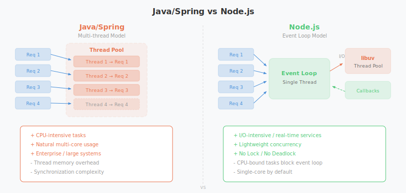

| 항목 | Java/Spring | Node.js |
|------|-------------|---------|
| **동시성 모델** | 멀티스레드 (thread-per-request) | 싱글스레드 이벤트 루프 |
| **I/O 처리** | 스레드가 블로킹 I/O를 대기 | libuv가 논블로킹 비동기로 처리 |
| **CPU 활용** | 멀티스레드로 자연스럽게 멀티코어 활용 | 기본적으로 싱글코어, Cluster/Worker로 확장 |
| **동기화** | Lock, synchronized, 세마포어 등 필요 | Lock 불필요 (메시지 패싱) |
| **메모리** | 스레드당 스택 메모리 할당 | 이벤트 루프 하나로 경량 |
| **생태계** | 엔터프라이즈, 금융, 대규모 시스템 | 실시간 서비스, API 서버, MSA |

### Node.js가 유리한 경우

- **I/O 집약적 서비스**: 채팅 서버, 실시간 알림, API 게이트웨이처럼 대량의 동시 연결을 유지하면서 DB나 외부 API 호출을 많이 하는 서비스. 스레드 하나로 수만 개의 동시 연결을 처리할 수 있다.
- **빠른 프로토타이핑**: npm 생태계의 풍부한 패키지와 JavaScript의 유연함 덕분에 빠르게 MVP를 만들어야 할 때 유리하다.
- **실시간 양방향 통신**: WebSocket 기반의 실시간 서비스(게임 서버, 협업 도구)에서 이벤트 루프의 논블로킹 특성이 빛을 발한다.
- **SSR**(Server-Side Rendering): 프론트엔드와 백엔드 모두 JavaScript로 통일할 수 있어, Next.js 같은 풀스택 프레임워크의 기반이 된다.

### Java/Spring이 유리한 경우

- **CPU 집약적 서비스**: 대용량 데이터 처리, 복잡한 비즈니스 로직 연산, 배치 작업 등. 멀티스레드로 CPU 코어를 자연스럽게 활용한다.
- **엔터프라이즈 시스템**: 트랜잭션 관리, 복잡한 도메인 모델, 레거시 시스템 연동이 필요한 금융/공공 시스템에서 Spring의 성숙한 생태계가 강점이다.
- **타입 안정성이 중요한 대규모 프로젝트**: 정적 타입 시스템과 컴파일 타임 검증이 대규모 팀에서의 협업과 유지보수에 유리하다.
- **Virtual Threads**(Java 21): Java 21의 가상 스레드는 Node.js의 장점이었던 경량 동시성을 Java 진영에서도 사용할 수 있게 만들었다. 스레드당 메모리 오버헤드가 극적으로 줄어들어, I/O 집약적 서비스에서도 Java의 경쟁력이 높아졌다.

> 최근에는 경계가 점점 흐려지고 있다. Node.js는 Worker Threads로 CPU 작업을 처리하고, Java는 Virtual Threads로 경량 동시성을 확보하면서, 서로의 약점을 보완하는 방향으로 진화하고 있다. 기술 선택은 "무엇이 더 좋은가"보다 "**팀의 역량과 서비스의 특성에 무엇이 더 맞는가**"로 결정해야 한다.

---

## 마치며

자바스크립트는 웹 페이지의 동적 기능을 위해 태어난 언어이다. 태생적으로 싱글스레드라는 제약을 안고 시작했지만, 이벤트 루프와 논블로킹 비동기 패러다임이라는 독특한 방식으로 이 한계를 극복해냈다.

Node.js는 이 자바스크립트를 브라우저 밖으로 꺼내어 서버 사이드에서도 동작할 수 있게 만들었고, libuv를 통해 비동기 I/O를 멀티스레드로 처리하면서도 개발자에게는 싱글스레드의 단순함을 유지해주었다. Lock도 없고 데드락도 없으니, 개발자 입장에서는 복잡한 동기화 문제를 걱정하지 않아도 된다. CPU 집약적 작업이라는 아킬레스건도 Worker Threads와 Cluster 모듈로 보완하면서, Node.js는 점점 더 넓은 영역에서 활약하고 있다.

[이전 글]()에서 살펴본 Java/Spring의 멀티스레드 모델과 이번 글의 Node.js 이벤트 루프 모델은 동시성이라는 같은 문제를 완전히 다른 방식으로 풀어낸다. 어느 쪽이 우월하다기보다는, 서비스의 특성과 팀의 역량에 맞는 도구를 선택하는 것이 가장 중요하다.

1995년에 브렌던 아이크가 10일 만에 만들었다는 이 언어가, 30년이 지난 지금까지 웹 생태계의 핵심으로 자리 잡고 있다는 것은 정말 경이로운 일이다. 콜백에서 Promise로, 다시 async/await로 진화해온 비동기 프로그래밍 패러다임의 발전이 그 증거이다.

---

## 부록: 웹 브라우저의 역사

본문에서 V8, Chromium, WebKit 같은 용어가 자주 등장했다. 이 엔진들이 어디서 왔는지, 그리고 자바스크립트가 왜 브라우저를 위한 싱글스레드 언어로 태어났는지를 이해하려면 웹 브라우저의 역사를 알아두면 좋다.

### 1955년생 전설의 IT 3인방과 WWW의 탄생

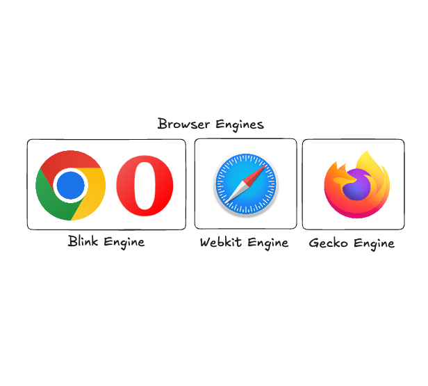

컴퓨터 세상에는 전설적인 1955년생 세 명이 있다. 마이크로소프트의 **빌 게이츠**, 애플의 **스티브 잡스**, 그리고 구글의 **에릭 슈미트**가 가장 유명하다. 여기에 **WWW**(World Wide Web)의 창시자인 **팀 버너스 리**를 추가하는 사람들도 있다.

팀 버너스 리는 1989년 스위스 제네바에 위치한 유럽 입자 물리 연구실(CERN)에서 근무하던 도중, 논문 참조 정보를 쉽게 연결하기 위한 시스템을 고안했다. 이것이 바로 WWW의 시작이다. 하이퍼링크를 통해 논문에서 다른 논문으로 바로 연결될 수 있게 하려는 목적이었고, 이 과정에서 **HTML**(하이퍼텍스트 마크업 언어), **HTTP**(하이퍼텍스트 전송 프로토콜), **URL**(통합 자원 식별자) 등이 개발되었다.

놀라운 점은, 팀 버너스 리가 이 기술들을 특허도 내지 않고 무료로 공개했다는 것이다. 이를 계기로 정적 콘텐츠를 손쉽게 확인할 수 있는 웹 브라우저가 탄생하기 시작했고, 치열한 브라우저 전쟁의 서막이 열렸다.

### 브라우저 전쟁: Netscape Navigator vs Internet Explorer


1990년대 중반부터 2000년대 초반까지, **Netscape Navigator**와 **Microsoft Internet Explorer**(IE)는 웹 브라우저의 점유율을 놓고 치열하게 경쟁했다. 이 기간은 **브라우저 전쟁**이라고 불리며, 인터넷의 발전과 웹 기술의 진화를 가속화한 시기였다.

1994년, **Netscape Communications**가 Netscape Navigator를 출시하여 웹 브라우저 시장을 점령하기 시작했다. 컴퓨터의 보급이 빠르게 일어나던 시기와 맞물려 약 1년 만에 80%의 점유율을 확보했다.

하지만 인터넷의 잠재력을 깨달은 **Microsoft**가 1995년 Windows 95 출시와 함께 Internet Explorer 1.0을 선보였다. 넷스케이프가 유료로 브라우저를 판매하던 것과 달리, IE는 무료로 제공되었으며 윈도우즈 운영체제에 통합되어 함께 배포되었다. 운영체제 레벨에서 IE를 밀어준 결과, 1997년 이후 IE의 점유율은 급격히 상승하여 2000년대 초반에는 90% 이상을 차지하게 되었다.

### 넷스케이프의 최후의 한 발: 오픈소스


IE의 점유율을 더 이상 이길 수 없다고 판단한 Netscape는 1998년, 브라우저의 **소스 코드를 공개**하기로 결정한다. 이렇게 웹 브라우저의 오픈소스가 풀렸고, **Mozilla 재단**이 이를 이어받아 Mozilla 프로젝트를 시작했다.

이 프로젝트를 통해 탄생한 것이 바로 **Mozilla Firefox**이다. 2002년 Phoenix라는 이름으로 개발을 시작하여, Firebird를 거쳐 2004년 Firefox 1.0이 출시되었다. Firefox는 **최근 닫은 탭 열기, 세션 복구, 피싱 필터, 오디오 및 비디오 기본 지원** 등 당시로서는 혁신적인 기능들을 제공하며 빠르게 사용자를 확보했다.

결정적으로 2008년에 등장한 **Google Chrome**이 IE에 강력한 타격을 입혔다. Chrome은 V8 자바스크립트 엔진을 탑재하여 압도적인 속도를 자랑했고, IE는 가장 무겁고 느린 브라우저로 전락했다. 결국 마이크로소프트는 2022년 6월 15일에 인터넷 익스플로러의 지원을 종료했다.

### 렌더링 엔진과 자바스크립트 엔진


웹 브라우저 내부에는 **렌더링 엔진**이 탑재되어 있다. HTML, CSS, JavaScript 등을 해석하여 시각적인 요소로 보여주는 역할을 한다. 주요 렌더링 엔진의 계보는 다음과 같다.

- **WebKit**: 2001년 Apple이 KHTML과 KJS 엔진을 기반으로 개발. Safari와 iOS용 모든 브라우저에 사용된다. 모바일 환경에 최적화되어 있으며, Apple의 정책상 iOS에서는 반드시 WebKit을 사용해야 한다.
- **Blink**: 2013년 Google이 WebKit을 포크(fork)하여 개발한 엔진. Chrome, Edge, Opera 등에서 사용되며, V8 자바스크립트 엔진과 함께 **Chromium** 프로젝트를 구성한다.
- **Gecko**: Netscape가 개발을 시작한 후 Mozilla 재단이 이어받은 오픈소스 엔진. Firefox에서 사용되며 강력한 웹 표준 지원과 보안 기능이 특징이다.

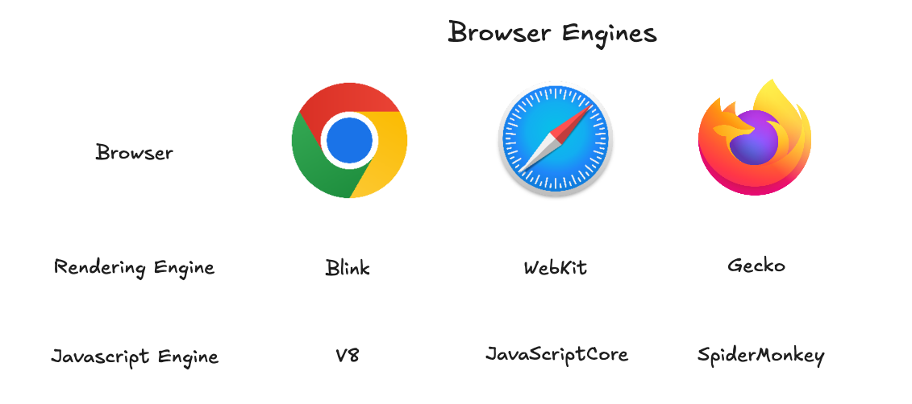

위 표에서 볼 수 있듯이 Chrome은 Blink + V8, Safari는 WebKit + JavaScriptCore, Firefox는 Gecko + SpiderMonkey 조합을 사용한다. 여기서 자주 언급되는 **Chromium**은 Blink 렌더링 엔진과 V8 자바스크립트 엔진의 조합을 의미한다.

> iOS의 Chrome도 겉모습은 Chromium처럼 보이지만, 내부적으로는 Apple 정책에 따라 WebKit을 사용하여 렌더링을 진행한다. 프론트엔드 개발자들이 iOS 환경에서 고생하는 이유가 바로 이 WebKit 렌더링 엔진의 특수성 때문이다.

---

## 참고 자료

- **[maybe.works]** The History of Web Browsers: Full Guide: [https://maybe.works/blogs/browser-wars-the-history-of-browsers-and-chromium-victory](https://maybe.works/blogs/browser-wars-the-history-of-browsers-and-chromium-victory)
- **[Node.js]** Introduction to Node.js: [https://nodejs.org/ko/learn/getting-started/introduction-to-nodejs](https://nodejs.org/ko/learn/getting-started/introduction-to-nodejs)
- **[Evans Library]** V8 엔진은 어떻게 내 코드를 실행하는 걸까?: [https://evan-moon.github.io/2019/06/28/v8-analysis/](https://evan-moon.github.io/2019/06/28/v8-analysis/)
- **[JSConf]** What the heck is the event loop anyway?: [https://www.youtube.com/watch?v=8aGhZQkoFbQ](https://www.youtube.com/watch?v=8aGhZQkoFbQ)
- **[BlaCk_Log]** 동시성, 병렬, 비동기, 논블럭킹과 컨셉들: [https://black7375.tistory.com/90](https://black7375.tistory.com/90)
- **[Alexander Zlatkov]** How JavaScript works: [https://medium.com/sessionstack-blog/how-does-javascript-actually-work-part-1-b0bacc073cf](https://medium.com/sessionstack-blog/how-does-javascript-actually-work-part-1-b0bacc073cf)
- **[helloinyong]** Node.js가 왜 싱글 스레드로 불리는 지 "정확한 이유": [https://helloinyong.tistory.com/350](https://helloinyong.tistory.com/350)
