Jenkins를 활용한 CI/CD 파이프라인을 구축하면서 알게 된 내용을 정리한다. Docker 컨테이너 환경에서 Jenkins를 운영할 때 반드시 이해해야 하는 DinD와 DooD 개념부터 시작하여, 온프레미스 환경에서 Jenkins를 설치하고 파이프라인을 구성하는 방법, 그리고 파라미터를 활용하여 유연한 빌드 환경을 만드는 방법까지 다룬다.

## 1. DinD vs DooD: Docker 컨테이너에서 Docker 사용하기

Jenkins를 Docker 컨테이너로 띄우고, 그 안에서 다른 컨테이너를 빌드하고 실행해야 하는 상황은 CI/CD에서 빈번하게 발생한다. 이때 두 가지 접근 방식이 있다.


<!-- TODO: 다이어그램 필요 - DinD vs DooD 아키텍처 비교도 (호스트 Docker 데몬과 컨테이너 간의 관계를 시각적으로 표현) -->

### DinD (Docker in Docker)

DinD는 말 그대로 Docker를 컨테이너 안에 설치하여 실행하는 방법이다. 하나의 Docker 컨테이너 내부에서 또 다른 Docker 데몬이 동작하여 그 안에서 추가적인 컨테이너를 생성하고 관리할 수 있다.

즉, 도커 가상환경 위에 또 도커 가상환경을 올리는 셈이다. 이 방식은 호스트에서 `docker ps` 등의 명령으로 내부 컨테이너가 제대로 보이지 않으며, 설정 및 관리가 복잡하기 때문에 디버깅이 어렵다는 단점이 있다.

### DooD (Docker out of Docker)

DooD는 호스트 Docker 데몬이 사용하는 **socket**을 공유하여 컨테이너에서 호스트의 Docker 데몬을 직접 제어하는 방식이다. `docker run` 명령어에 소켓 볼륨을 마운트하여 설정한다.

```bash
docker run -v /var/run/docker.sock:/var/run/docker.sock ...
```

이 명령어를 통해 `-v` 파라미터로 호스트의 Docker 소켓을 공유하면, 컨테이너 내부에서 호스트 레벨의 Docker를 직접 제어할 수 있다. 성능이 우수하고 관리가 편리하지만, DinD에 비해 격리성은 떨어진다.

### DinD vs DooD 비교

| 특징 | DinD | DooD |
|------|------|------|
| **구성 방식** | 컨테이너 내에 Docker 데몬 실행 | 호스트의 Docker 데몬을 사용 |
| **격리성** | 호스트와 격리된 독립 환경 | 호스트와 공유되는 환경 |
| **성능** | 오버헤드 존재 | 성능 우수 |
| **보안** | `--privileged`로 인한 보안 위험 | 소켓 마운트로 인한 보안 위험 |
| **복잡성** | 설정 및 관리 복잡 | 설정 간단 |
| **사용 사례** | 독립된 테스트 환경 필요 시 | CI/CD 파이프라인 등에서 빠른 빌드 필요 시 |

각각 장단점이 있으나, Docker에서 공식적으로 권장하는 방법은 **DooD**이다. 관리의 편의성과 성능 측면에서 특별한 상황이 아니라면 DooD가 보편적인 선택이다.

### Jenkins에서의 DooD 구현

Jenkins를 Docker로 띄우면서 DooD를 구현하려면 먼저 아래의 명령어로 소켓을 마운트하여 실행한다.

```bash
docker run -d --name jenkins \
    -u jenkins \
    -p 8080:8080 \
    -p 50000:50000 \
    -v jenkins_home:/var/jenkins_home \
    -v /var/run/docker.sock:/var/run/docker.sock \
    jenkins/jenkins:lts
```

소켓을 볼륨으로 연결한 후, 컨테이너에 직접 접속하여 Docker CLI를 설치하고 권한을 설정해야 한다.

```bash
# Jenkins 컨테이너로 접속
docker exec -it jenkins /bin/bash

# Docker CLI 설치
apt-get update && apt-get install -y docker.io

# Docker 소켓의 그룹 ID를 확인
ls -l /var/run/docker.sock

# 위 명령어로 얻은 그룹 ID를 바탕으로, Docker 그룹을 생성하고 Jenkins 사용자에게 권한 부여
groupadd -for -g <GROUP_ID> docker
usermod -aG docker jenkins
```

이렇게 Jenkins 사용자에게 Docker 권한을 부여하면, Jenkins에서 호스트 Docker 데몬을 이용하여 같은 레이어에 새로운 컨테이너를 생성할 수 있게 된다.

---

## 2. 온프레미스 Jenkins 구축

AWS 기반 CI/CD 파이프라인에서 온프레미스로 전환하게 된 배경은 비용과 성능 문제가 있었다. 자세한 내용은 [AWS 프로덕션 배포 가이드]()를 참고하세요.

이 섹션에서는 온프레미스 서버에 Jenkins를 설치하고, Docker 기반 CI/CD 파이프라인을 구성하는 과정을 다룬다.

### Jenkins란?

**Jenkins**는 오픈 소스 CI/CD 도구로, 빌드, 테스트, 배포 작업을 자동화해 주는 서버이다. 오픈 소스로 광범위하게 확장되어 있어 다양한 플러그인을 설치할 수 있으며, GitHub 및 GitLab과의 통합도 잘 되어 있다. Jenkins 내부적인 DSL을 사용하기 때문에 초반에는 적응이 필요하지만, 제대로 다루게 되면 CI/CD 외에도 다양한 자동화 작업을 수행할 수 있다.

Jenkins에서 가장 중요한 것은 **파이프라인**이다. 파이프라인을 통해 일련의 CI/CD 작업을 정의할 수 있으며, 이는 **Jenkinsfile**이라는 파일에 코드로 작성한다.

### 서버 아키텍처

하나의 서버에 Jenkins와 애플리케이션 서버를 함께 띄우는 구성을 살펴보자.

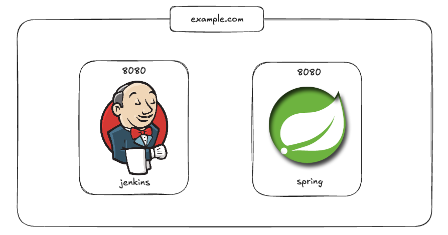

Nginx Proxy Manager(NPM)를 활용하면 서버로 들어오는 트래픽을 서브도메인 기반으로 분산시킬 수 있다.

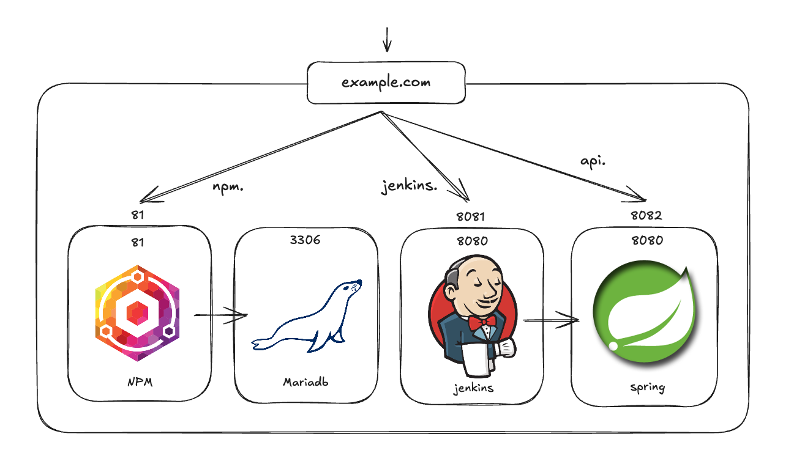

외부에서 접근하지 않는 MariaDB를 제외하고는 모두 포트 바인딩을 통해 외부로 노출시킨다. Jenkins와 Spring이 같은 포트를 사용하기 때문에 적절히 포트를 변경하여 배포한다. NPM을 통해 `jenkins.`, `api.` 등의 서브도메인으로 들어오는 80번 포트 트래픽을 HTTPS로 분산시켜 주는 구성이다.

<!-- TODO: 다이어그램 필요 - 전체 파이프라인 플로우 (GitHub Push -> Webhook -> Jenkins -> Docker Build -> Deploy) -->

### Docker Compose로 환경 구성

Jenkins, NPM, MariaDB를 한 번에 띄우는 `docker-compose.yml`을 작성한다.

```yaml
version: '3.8'
services:
  jenkins:
    image: jenkins/jenkins:lts
    restart: always
    container_name: jenkins
    user: root
    ports:
      - '8081:8080'
      - '50000:50000'
    volumes:
      - /var/run/docker.sock:/var/run/docker.sock
      - jenkins_data:/var/jenkins_home

  npm:
    image: 'jc21/nginx-proxy-manager:latest'
    restart: unless-stopped
    ports:
      - '80:80'
      - '443:443'
      - '81:81'
    environment:
      DB_MYSQL_HOST: "db"
      DB_MYSQL_PORT: 3306
      DB_MYSQL_USER: "npm"
      DB_MYSQL_PASSWORD: "npm"
      DB_MYSQL_NAME: "npm"
    volumes:
      - ./data:/data
      - ./letsencrypt:/etc/letsencrypt
    depends_on:
      - db

  maria-db:
    image: 'jc21/mariadb-aria:latest'
    restart: unless-stopped
    environment:
      MYSQL_ROOT_PASSWORD: 'npm'
      MYSQL_DATABASE: 'npm'
      MYSQL_USER: 'npm'
      MYSQL_PASSWORD: 'npm'
      MARIADB_AUTO_UPGRADE: '1'
    volumes:
      - ./mysql:/var/lib/mysql

volumes:
  jenkins_data:
```

`docker-compose up -d`로 실행하면 세 개의 컨테이너가 동시에 실행된다. Jenkins 컨테이너에 접속하여 Docker CLI를 설치하는 과정은 앞서 DooD 섹션에서 다룬 것과 동일하다.

```bash
docker exec -it jenkins /bin/bash
apt-get update && apt-get install -y docker.io
```

### Jenkins 초기 설정

Jenkins에 처음 접속하면 초기 비밀번호를 입력해야 한다.

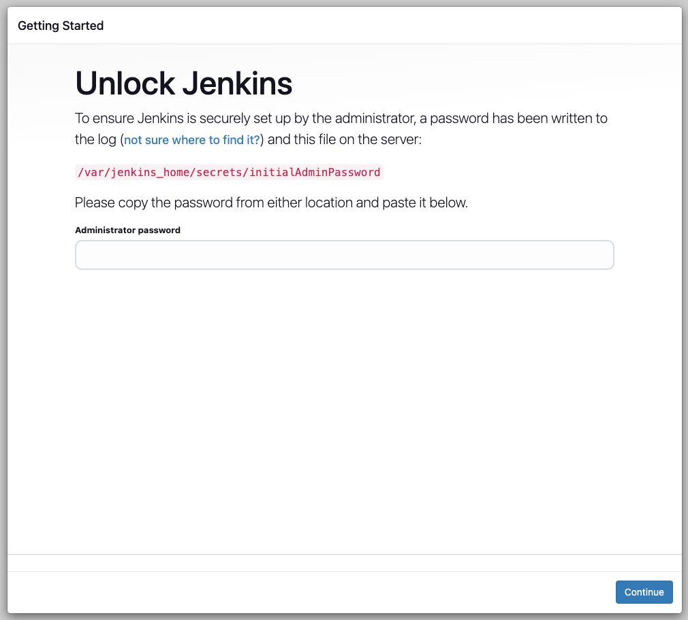

컨테이너에 접속하여 초기 비밀번호를 확인한다.

```bash
docker exec -it jenkins /bin/bash
cat /var/jenkins_home/secrets/initialAdminPassword
```

비밀번호를 입력한 후 **Install suggested plugins**를 클릭하여 기본 플러그인을 설치한다.

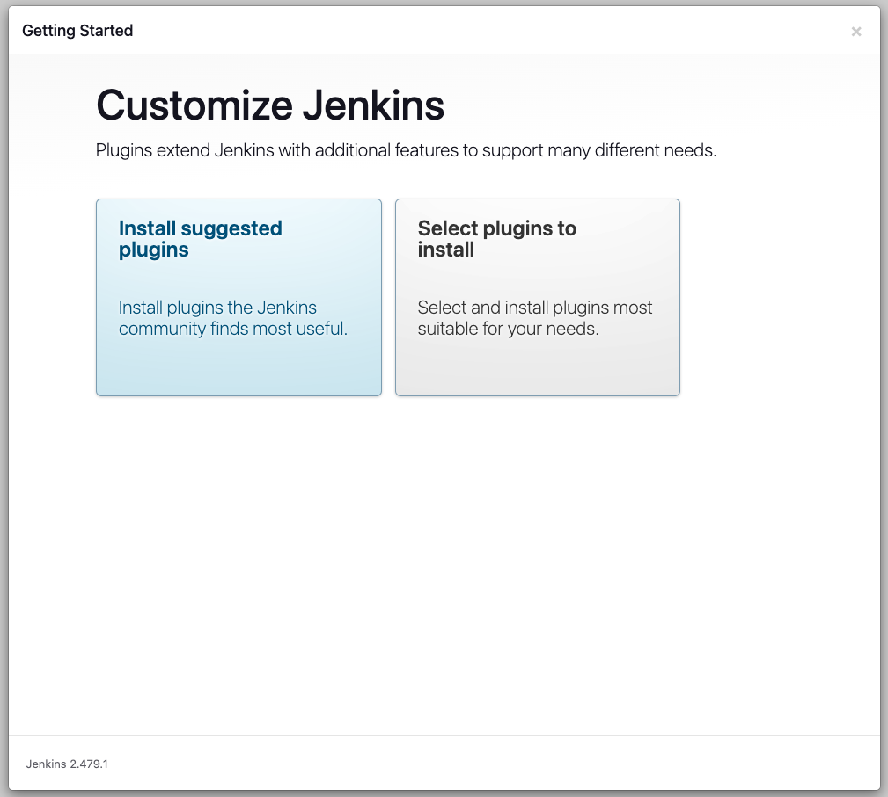

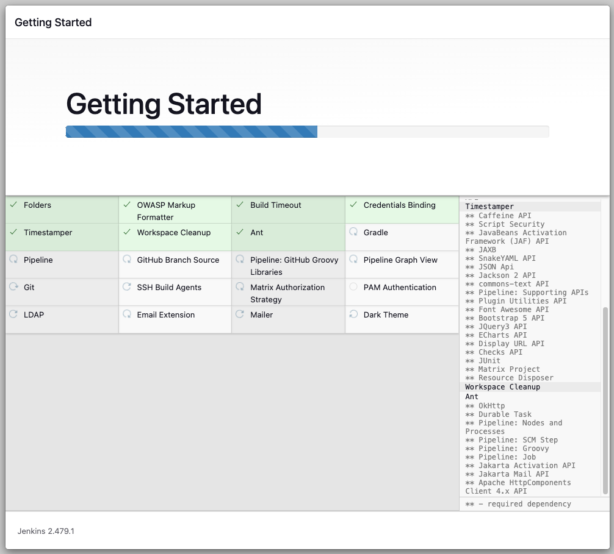

플러그인 설치가 완료되면 계정을 생성하고 URL을 지정한 후 대시보드에 접속할 수 있다.

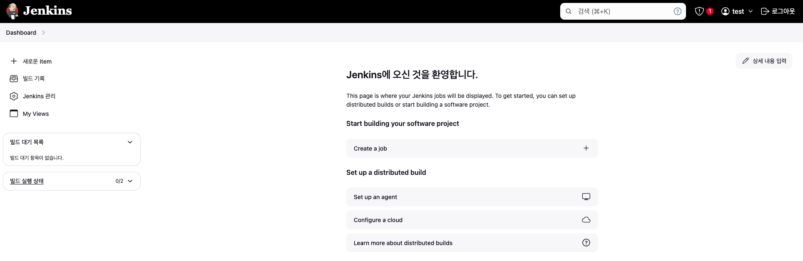

### 파이프라인 생성

대시보드 왼측의 **새로운 Item**을 통해 파이프라인을 생성한다.

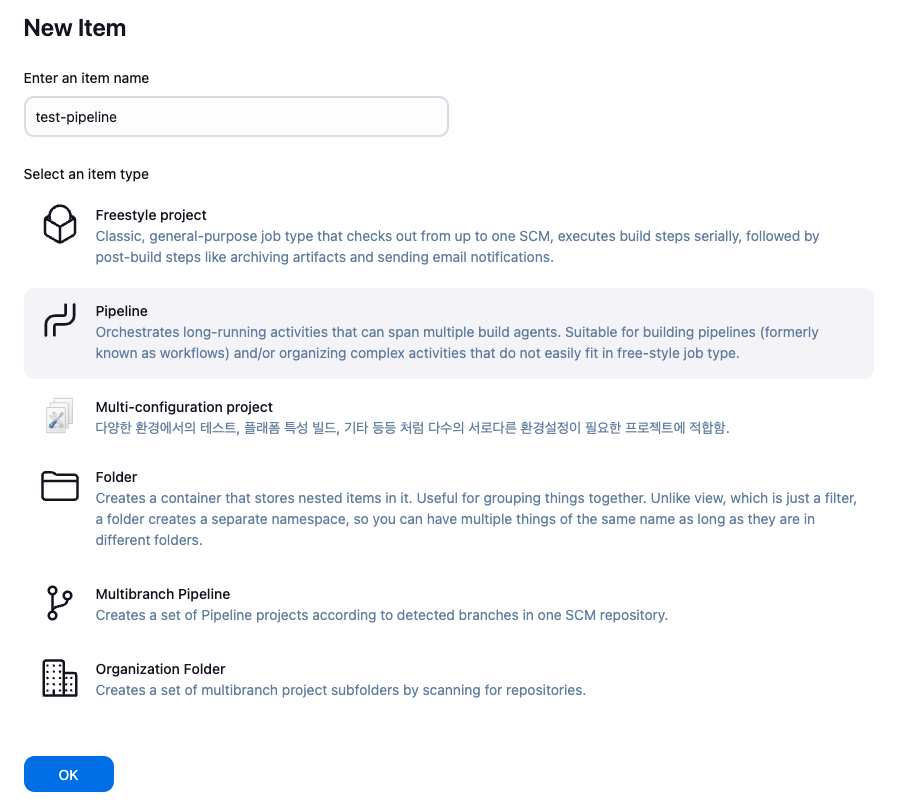

Item name을 지정하고 **Pipeline**을 선택한다.

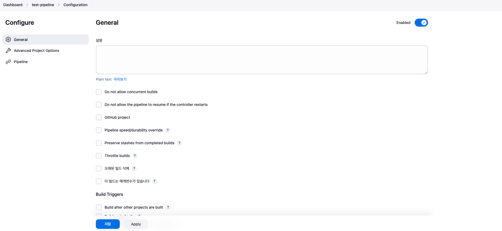

파이프라인 설정에서 **이 빌드는 매개변수가 있습니다** 옵션을 활성화하면 다양한 타입의 매개변수를 정의할 수 있다. 자세한 파라미터 활용법은 3장에서 다룬다.

### CI/CD 파이프라인 코드

Git 프로젝트를 불러와서 Docker 기반으로 빌드하고 배포하는 파이프라인 예시를 살펴보자.

```groovy
pipeline {
    agent any
    environment {
        DOCKER_IMAGE = 'your-project:latest'
        CONTAINER_NAME = 'your-project'
    }

    parameters {
        text(name: 'ENV_FILE', defaultValue: '', description: '.env 파일의 내용')
    }

    stages {
        stage('Pull Code') {
            steps {
                git url: 'https://github.com/your-project.git', branch: 'main'
            }
        }

        stage('Create .env File') {
            steps {
                script {
                    writeFile file: 'src/main/resources/.env', text: params.ENV_FILE
                }
            }
        }

        stage('Gradle Build') {
            steps {
                script {
                    sh './gradlew clean build'
                }
            }
        }

        stage('Build Docker Image') {
            steps {
                script {
                    sh "docker build -t ${DOCKER_IMAGE} ."
                }
            }
        }

        stage('Stop Running Container') {
            steps {
                script {
                    sh "docker stop ${CONTAINER_NAME} || true"
                    sh "docker rm ${CONTAINER_NAME} || true"
                }
            }
        }

        stage('Run New Container') {
            steps {
                script {
                    sh "docker run -d --name ${CONTAINER_NAME} -p 8080:8080 ${DOCKER_IMAGE}"
                }
            }
        }
    }
}
```

이 파이프라인은 다음과 같은 단계로 구성되어 있다.

1. **Pull Code** - Git 저장소에서 코드를 가져온다.
2. **Create .env File** - 파라미터로 전달받은 환경변수 파일을 생성한다.
3. **Gradle Build** - 프로젝트를 빌드한다.
4. **Build Docker Image** - Docker 이미지를 생성한다.
5. **Stop Running Container** - 기존 실행 중인 컨테이너를 중지하고 제거한다.
6. **Run New Container** - 새로운 컨테이너를 실행한다.

### GitHub Webhook 연동

파이프라인이 GitHub push 이벤트에 자동으로 트리거되도록 Webhook을 설정한다.

먼저, Jenkins 파이프라인 설정에서 **GitHub hook trigger for GITScm polling**을 활성화한다.

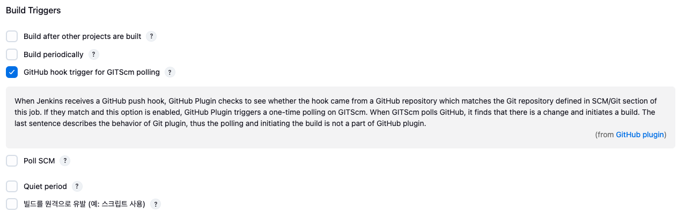

그리고 GitHub 저장소의 Settings > Webhooks에서 Jenkins URL을 등록한다. 여기서 중요한 포인트는 Jenkins URL 뒤에 **`/github-webhook/`**을 붙여야 한다는 점이다.

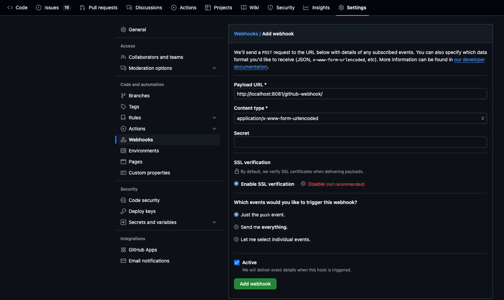

이를 통해 push 이벤트가 발생했을 때 자동으로 Jenkins 파이프라인이 실행된다.

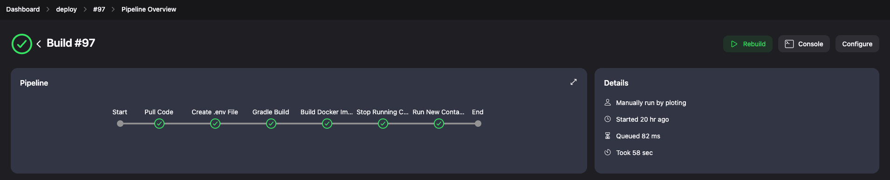

---

## 3. Jenkins 파라미터 활용

빌드의 핵심은 매개변수를 적절히 활용하는 데 있다. Jenkins에서는 파라미터화된 빌드를 통해 동일한 파이프라인으로 다양한 환경과 옵션을 유연하게 처리할 수 있다. 이러한 확장성을 고려한 아키텍처를 만들기 위해 각 파라미터 타입의 사용법과 활용 방법을 살펴보자.

### 파이프라인 생성 및 파라미터 설정

Jenkins 대시보드에서 **New Item**을 클릭하여 Pipeline을 생성한다.

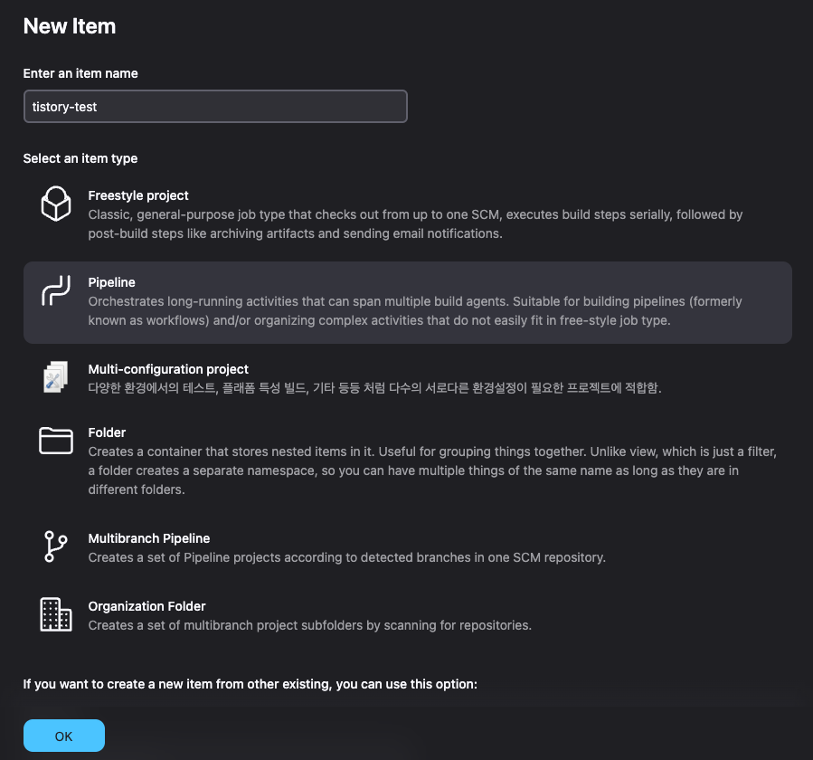

파이프라인 설정에서 **이 빌드는 매개변수가 있습니다** 항목을 활성화하면 다양한 매개변수를 추가할 수 있다.

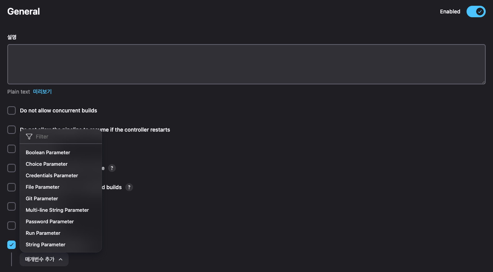

Boolean, Choice, Credentials, File, Git, Multi-line String, Password, Run, String 등 다양한 파라미터 타입을 지원한다.

### Boolean Parameter

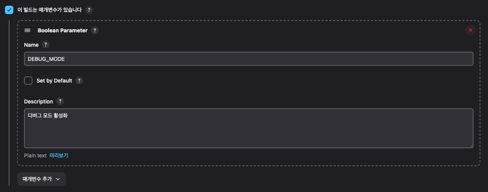

```groovy
pipeline {
    agent any
    parameters {
        booleanParam(name: 'DEBUG_MODE', defaultValue: false, description: '디버그 모드 활성화')
    }
    stages {
        stage('Example') {
            steps {
                sh 'echo "DEBUG_MODE는 ${DEBUG_MODE} 입니다."'
            }
        }
    }
}
```

불리언 파라미터는 `true`/`false` 값을 설정할 수 있다. `DEBUG_MODE`를 켜고 끄는 것처럼 기능을 토글하는 용도로 사용한다.

### Choice Parameter

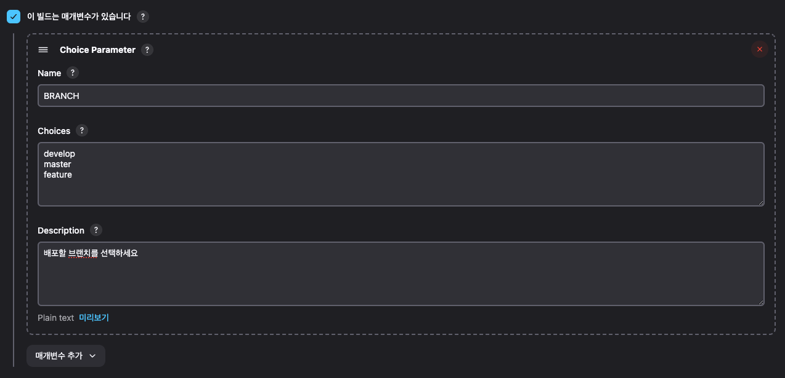

```groovy
pipeline {
    agent any
    parameters {
        choice(name: 'BRANCH', choices: ['develop', 'master', 'feature'], description: '배포할 브랜치를 선택하세요')
    }
    stages {
        stage('Checkout') {
            steps {
                sh 'echo "선택된 브랜치는 ${BRANCH} 입니다."'
                git branch: "${BRANCH}", url: 'https://github.com/your-repo.git'
            }
        }
    }
}
```

Choice Parameter는 미리 정의된 선택지 중 하나를 고를 수 있다. **production**과 **staging** 서버를 나누어 배포할 때 특히 유용하다.

> **주의**: Jenkinsfile에서 choice 항목을 정의하지 않고 콘솔에서만 추가하면, 파이프라인을 다시 실행할 때 설정이 사라지는 휘발성 문제가 있다. 다른 파라미터 타입에서도 유사한 동작이 발생할 수 있으므로, 반드시 Jenkinsfile에 선언하는 것을 권장한다.

### Credentials Parameter

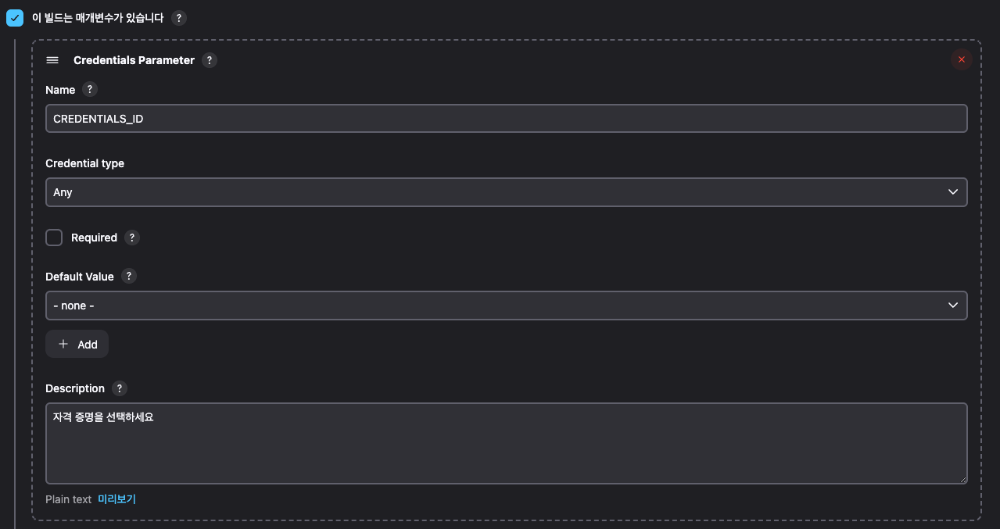

```groovy
pipeline {
    agent any
    parameters {
        credentials(name: 'CREDENTIALS_ID', description: '자격 증명을 선택하세요')
    }
    stages {
        stage('Use Credentials') {
            steps {
                withCredentials([usernamePassword(credentialsId: "${CREDENTIALS_ID}", passwordVariable: 'PASSWORD', usernameVariable: 'USERNAME')]) {
                    sh 'echo "사용자 이름은 $USERNAME 입니다."'
                }
            }
        }
    }
}
```

Credentials Parameter는 보안을 위해 직접 노출되지 않는 파라미터 전달 방법이다. `withCredentials` 블록 내에서만 접근이 가능하며, API 키나 config key 등 보안 관련 키를 안전하게 전달할 수 있다.

### File Parameter

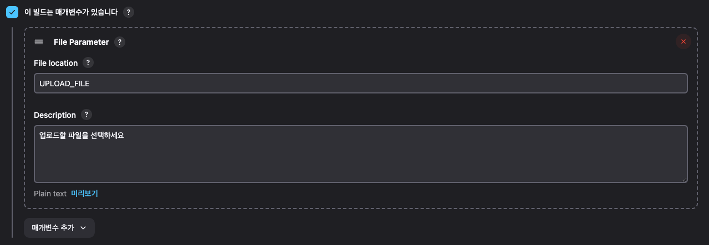

```groovy
pipeline {
    agent any
    parameters {
        file(name: 'UPLOAD_FILE', description: '업로드할 파일을 선택하세요')
    }
    stages {
        stage('Use File') {
            steps {
                sh 'echo "업로드된 파일 경로는 ${UPLOAD_FILE} 입니다."'
            }
        }
    }
}
```

File Parameter는 파일 업로드를 통해 빌드에 필요한 파일을 전달하는 방식이다. `UPLOAD_FILE`이라는 이름으로 설정하면 루트 디렉터리에 해당 파일이 업로드된다. 특정 경로에 파일을 배치하려면 `./src/resources/.env`와 같이 경로를 포함한 이름을 지정해야 한다. 매번 빌드할 때마다 파일을 첨부해야 한다는 점에 유의하자.

### Git Parameter

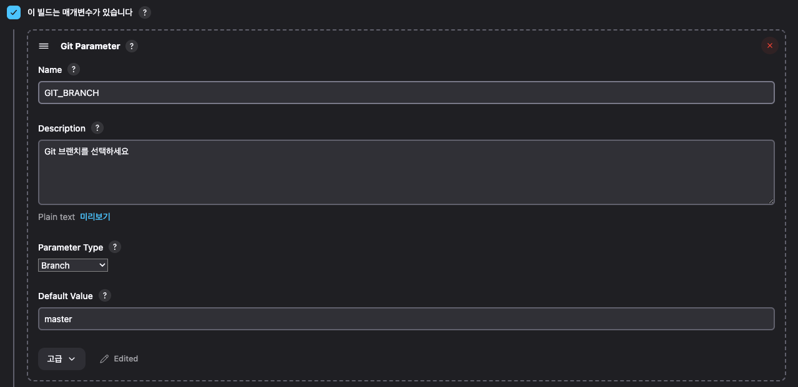

```groovy
pipeline {
    agent any
    parameters {
        gitParameter(name: 'GIT_BRANCH', type: 'PT_BRANCH', defaultValue: 'master', description: 'Git 브랜치를 선택하세요')
    }
    stages {
        stage('Checkout') {
            steps {
                sh 'echo "선택된 Git 브랜치는 ${GIT_BRANCH} 입니다."'
                git branch: "${GIT_BRANCH}", url: 'https://github.com/your-repo.git'
            }
        }
    }
}
```

Git Parameter는 브랜치와 Tag를 정교하게 선택하여 배포할 수 있게 해 준다. 앞서 본 Choice Parameter로도 브랜치를 선택할 수 있지만, Git Parameter는 실제 저장소의 브랜치 목록을 자동으로 가져와 보다 정확한 선택이 가능하다.

### Multi-line String Parameter

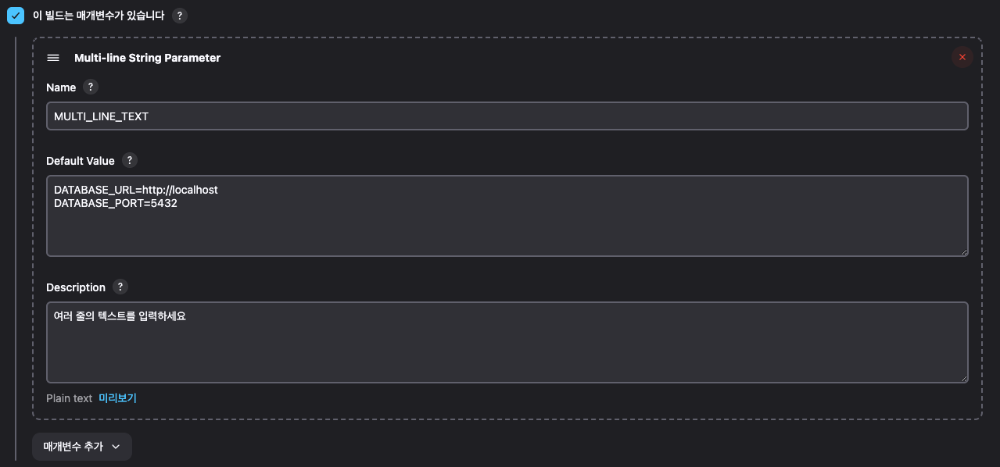

```groovy
pipeline {
    agent any
    parameters {
        text(name: 'MULTI_LINE_TEXT', defaultValue: '', description: '여러 줄의 텍스트를 입력하세요')
    }
    stages {
        stage('Use Text') {
            steps {
                sh 'echo "입력된 텍스트는 다음과 같습니다:\n${MULTI_LINE_TEXT}"'
            }
        }
    }
}
```

`.env` 파일 내용이나 스크립트와 같이 여러 줄의 텍스트를 입력해야 할 때 사용한다.

> **알려진 이슈**: `defaultValue`를 빈 문자열(`''`)로 설정하면, 콘솔에서 수동으로 설정한 파라미터 값이 초기화되는 버그가 존재한다. 이는 수동 빌드 시에만 해당하며, Webhook을 통한 자동 빌드에서는 영향이 없다.

### Password Parameter

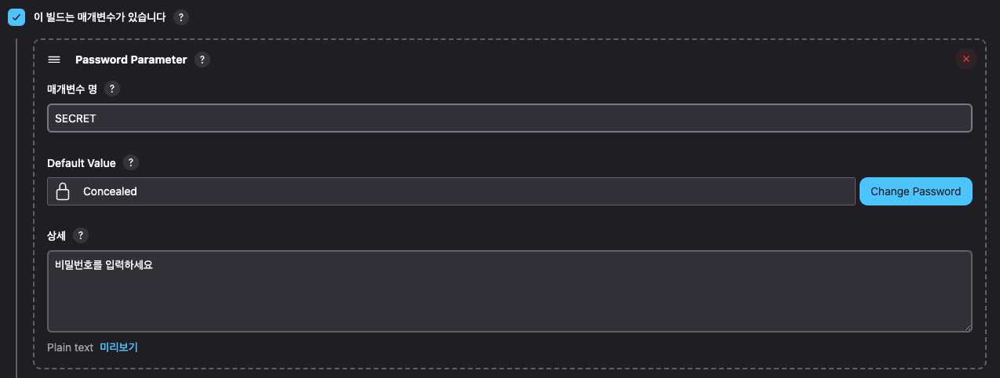

```groovy
pipeline {
    agent any
    parameters {
        password(name: 'SECRET', defaultValue: '', description: '비밀번호를 입력하세요')
    }
    stages {
        stage('Use Password') {
            steps {
                sh 'echo "비밀 값이 입력되었습니다."'
            }
        }
    }
}
```

Password Parameter는 Jenkinsfile 내에서 접근 가능하지만, 보안상의 이유로 값을 출력하거나 로그에 남기지 않아야 하는 경우에 사용한다. API 키, 비밀번호 등 민감한 정보를 안전하게 입력해야 할 때 적합하다.

### Run Parameter

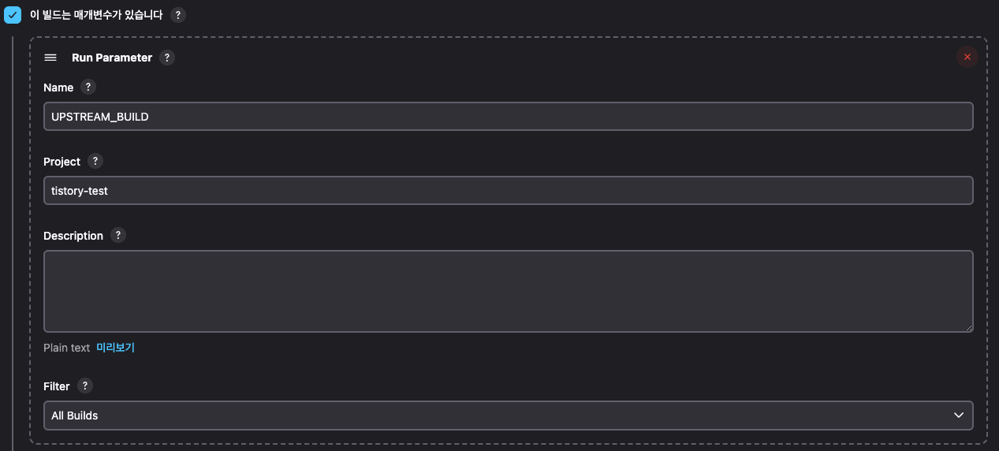

```groovy
pipeline {
    agent any
    parameters {
        run(name: 'UPSTREAM_BUILD', job: 'OtherJob', description: '이전 빌드를 선택하세요')
    }
    stages {
        stage('Use Run') {
            steps {
                sh 'echo "선택된 빌드는 ${UPSTREAM_BUILD} 입니다."'
            }
        }
    }
}
```

Run Parameter는 다른 Job의 특정 빌드 결과를 참조하거나, 해당 빌드의 결과물을 사용할 때 쓰인다.

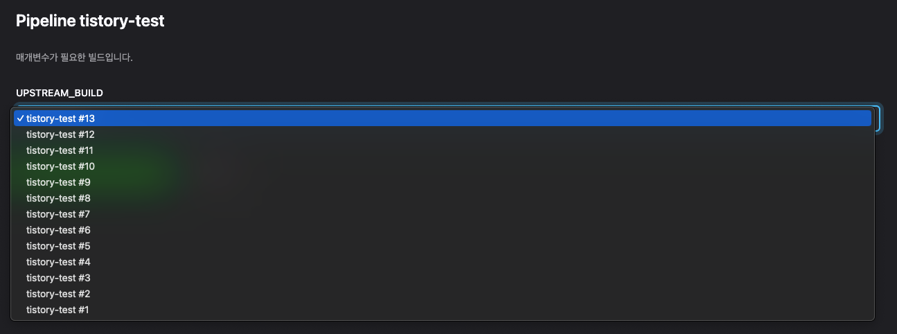

특정 Job을 선택하여 해당 빌드의 아티팩트를 활용할 수 있다.

### 파라미터 종합 활용 예시

다양한 파라미터를 조합하여 실전 파이프라인에서 활용하는 종합 예시를 살펴보자.

```groovy
pipeline {
    agent any
    parameters {
        booleanParam(name: 'DEPLOY_TO_PRODUCTION', defaultValue: false, description: 'Production에 배포할지 여부')
        choice(name: 'ENVIRONMENT', choices: ['development', 'staging', 'production'], description: '배포할 환경 선택')
        credentials(name: 'AWS_CREDENTIALS', description: 'AWS 자격증명')
        file(name: 'CONFIG_FILE', description: '빌드에 필요한 설정 파일')
        text(name: 'LONG_TEXT', description: '추가 설명을 입력하세요')
        password(name: 'DB_PASSWORD', description: '데이터베이스 비밀번호')
        run(name: 'PREVIOUS_BUILD', job: 'my-other-job', description: '참조할 이전 빌드 선택')
        string(name: 'USERNAME', defaultValue: 'default_user', description: '사용자 이름')
        text(name: 'PEM_KEY', description: 'master.pem 파일의 내용')
    }
    stages {
        stage('Example') {
            steps {
                script {
                    echo "DEPLOY_TO_PRODUCTION: ${params.DEPLOY_TO_PRODUCTION}"
                    echo "ENVIRONMENT: ${params.ENVIRONMENT}"
                    echo "USERNAME: ${params.USERNAME}"
                }
            }
        }
    }
}
```

`parameters` 블록에 정의한 후, `params.USERNAME`과 같이 `params` 객체를 통해 파이프라인 어디서든 참조할 수 있다.

---

## 마치며

이 글에서는 Jenkins CI/CD 파이프라인 구축의 전체 흐름을 다루었다. Docker 컨테이너 환경에서 DooD 방식으로 Jenkins를 운영하는 방법, Docker Compose를 활용한 온프레미스 환경 구성, GitHub Webhook을 통한 자동 배포, 그리고 다양한 파라미터를 활용한 유연한 파이프라인 설정까지 살펴보았다.

핵심 포인트를 정리하면 다음과 같다.

- **DooD 방식**을 사용하여 Docker 소켓을 공유하면 성능과 관리 편의성을 모두 확보할 수 있다.
- **Docker Compose**를 활용하면 Jenkins, NPM, DB 등 여러 서비스를 한 번에 관리할 수 있다.
- **GitHub Webhook**을 연동하면 코드 push 시 자동으로 파이프라인이 실행된다.
- **파라미터화된 빌드**를 통해 하나의 파이프라인으로 다양한 환경과 설정에 대응할 수 있다.

Jenkins는 초기 설정에 다소 시간이 걸리지만, 한 번 구축해 두면 안정적이고 유연한 CI/CD 환경을 제공한다.
