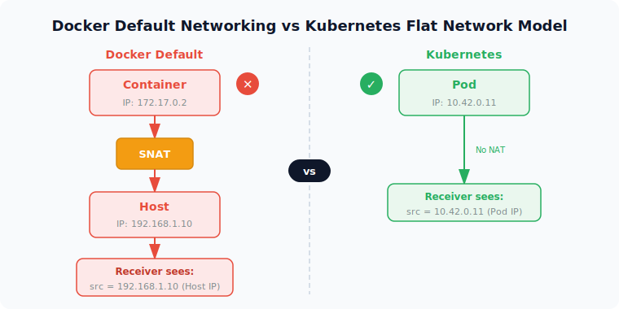
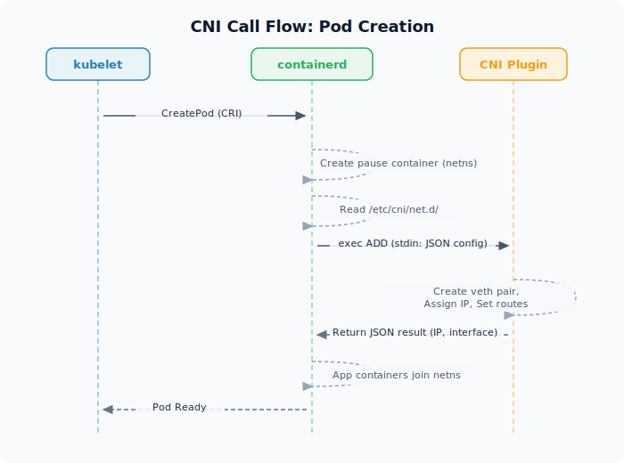
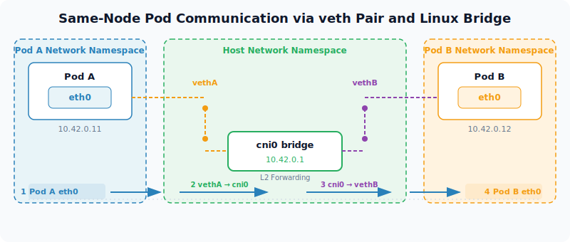
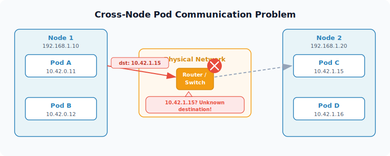
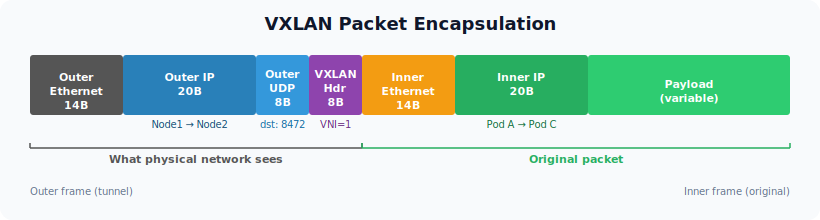
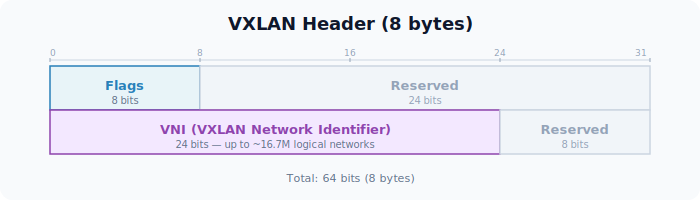
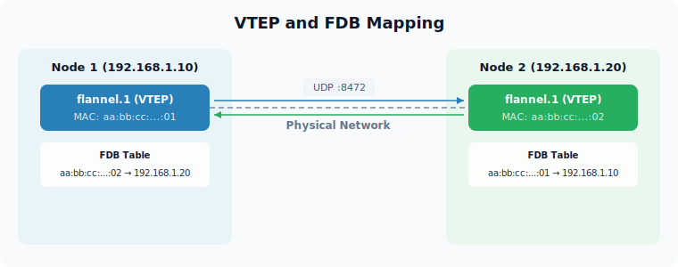
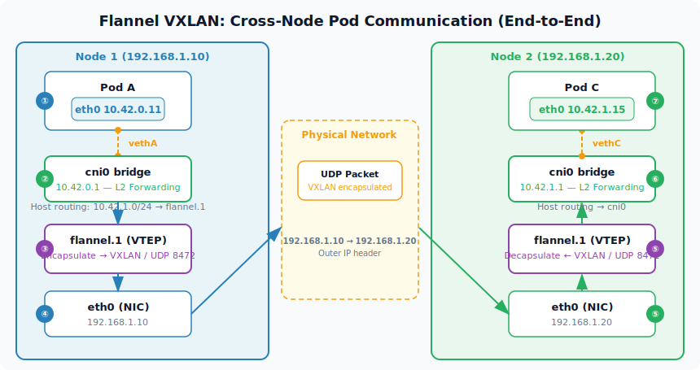
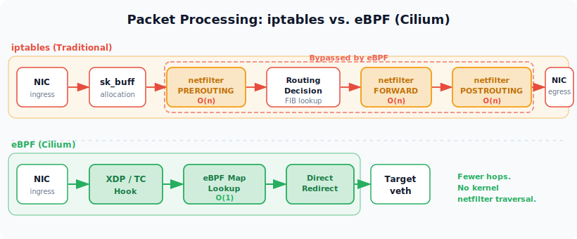

[이전 글]()에서 OS 레벨의 네트워크 구조를 다뤘다. 네트워크 인터페이스, 이더넷 프레임, 라우팅 테이블, Netfilter/iptables까지 — 패킷이 커널 안에서 실제로 어떻게 움직이는지를 따라갔다.

이번 글에서는 한 단계 위로 올라간다. 쿠버네티스가 이 OS 네트워크 스택 위에 **무엇을 쌓아서** 수백, 수천 개의 Pod가 마치 하나의 네트워크에 있는 것처럼 통신하게 만드는지를 파헤친다. CNI라는 계약, veth pair라는 가상 케이블, VXLAN이라는 터널 — 결국 이 모든 것은 OS가 이미 제공하는 네트워크 프리미티브를 조합한 것이다.

---

## 쿠버네티스의 네트워크 모델

쿠버네티스는 네트워크 구현을 **전혀 제공하지 않는다.** 대신 세 가지 근본적인 요구사항만 선언한다.

1. **모든 Pod는 NAT 없이 다른 모든 Pod와 통신할 수 있어야 한다**
2. **모든 노드는 NAT 없이 모든 Pod와 통신할 수 있어야 한다**
3. **Pod가 자기 자신이라고 인식하는 IP가 다른 Pod가 보는 IP와 같아야 한다**

한 마디로 **클러스터 전체가 하나의 플랫한 L3 네트워크처럼 보여야 한다**는 것이다.



왜 이런 모델을 선택했을까? Docker의 기본 네트워킹에서 답을 찾을 수 있다. Docker 기본 모드에서는 컨테이너가 외부와 통신할 때 호스트 IP로 SNAT된다. 수신 측에서 보는 소스 IP가 실제 컨테이너 IP가 아니라 호스트 IP가 되는 것이다. 이러면 로깅, 보안 정책, 서비스 디스커버리가 전부 꼬인다. 쿠버네티스는 이 문제를 원천적으로 없애기 위해 "NAT 없는 플랫 네트워크"를 요구했다.

하지만 현실 세계의 물리 네트워크는 플랫하지 않다. 노드들은 다른 서브넷에 있을 수 있고, 중간에 라우터가 있고, 클라우드 VPC가 Pod IP를 알 리 없다. **이 이상과 현실의 간극을 메우는 것이 CNI 플러그인의 역할**이다.

---

## CNI (Container Network Interface) — 구현이 아닌 계약

CNI는 CNCF 프로젝트로, 컨테이너의 네트워크 연결을 설정하고 해제하는 **인터페이스 스펙**이다. 핵심은 "CNI는 네트워킹 솔루션이 아니라 계약(contract)"이라는 점이다. veth를 쓸지, VXLAN을 쓸지, BGP를 쓸지 — CNI 스펙은 이에 대해 아무것도 규정하지 않는다. 그건 전부 플러그인 구현체의 영역이다.

### 스펙이 정의하는 것

**바이너리 인터페이스:** CNI 플러그인은 `/opt/cni/bin/`에 위치한 실행 파일이다. 컨테이너 런타임(containerd, CRI-O)이 이 바이너리를 직접 exec한다. stdin으로 JSON 설정을 받고, stdout으로 결과를 반환하는 단순한 구조다.

**오퍼레이션:** `ADD`(컨테이너를 네트워크에 연결), `DEL`(연결 해제), `CHECK`(상태 확인), `VERSION` — 이 네 가지뿐이다.

### Pod 생성 시 CNI 호출 흐름

Pod 하나가 생성될 때 네트워크가 어떻게 준비되는지 따라가 보면:



```
1. kubelet → CRI를 통해 containerd에 Pod 생성 요청
2. containerd → pause 컨테이너를 만들어 network namespace 확보
3. containerd → /etc/cni/net.d/ 에서 CNI 설정 파일 읽음
4. CNI 바이너리 exec → ADD 호출
5. CNI 플러그인 → veth pair 생성, IP 할당, 라우팅 설정
6. 결과(할당된 IP, 인터페이스 정보)를 JSON으로 반환
7. 실제 애플리케이션 컨테이너들이 이 namespace에 합류
```

여기서 2단계의 **pause 컨테이너**가 중요하다. 애플리케이션 컨테이너가 재시작되더라도 network namespace는 pause 컨테이너가 유지하고 있기 때문에 IP가 보존된다.

### CNI Chaining

하나의 Pod에 여러 CNI 플러그인을 체인으로 연결할 수 있다. 예를 들어 `calico → bandwidth → portmap`처럼 메인 플러그인이 네트워크를 구성하고, 이후 플러그인들이 QoS나 포트 매핑을 추가하는 방식이다.

---

## 같은 노드 내 Pod 통신

Pod가 생성되면 커널은 별도의 **network namespace**를 만든다. [이전 글]()에서 다뤘던 네트워크 인터페이스, 라우팅 테이블, iptables 규칙 — 이 모든 것이 namespace마다 독립적으로 존재한다. Pod는 말 그대로 자기만의 네트워크 세상을 갖는다.

격리된 namespace를 호스트와 연결하기 위해 **veth pair**를 사용한다. veth pair는 가상 이더넷 케이블이다. 한쪽 끝(eth0)은 Pod namespace 안에, 다른 쪽 끝(vethXXXX)은 호스트 namespace에 존재한다. 한쪽에 패킷을 넣으면 다른 쪽에서 나오는 커널 내부의 파이프다.



Flannel의 경우, 호스트 namespace 쪽 veth들은 **cni0**이라는 Linux 브릿지에 연결된다.

**같은 노드 내 Pod A → Pod B 통신 경로:**

1. Pod A에서 패킷 생성 (src: 10.42.0.11, dst: 10.42.0.12)
2. Pod A의 eth0 → vethA를 통해 호스트 namespace로
3. cni0 브릿지가 MAC 주소 테이블을 보고 vethB로 포워딩
4. vethB → Pod B의 eth0

순수한 L2 브릿지 동작이라 **캡슐화 오버헤드가 전혀 없다.** 이전 글에서 다뤘던 이더넷 프레임의 MAC 기반 포워딩이 그대로 작동하는 것이다.

---

## 다른 노드 간 Pod 통신 — 핵심 문제

같은 노드 안에서는 브릿지 하나로 충분했다. 하지만 다른 노드에 있는 Pod와 통신하려면 이야기가 완전히 달라진다.

```
[Node 1: 192.168.1.10]              [Node 2: 192.168.1.20]
  Pod A: 10.42.0.11                   Pod C: 10.42.1.15
  Pod B: 10.42.0.12                   Pod D: 10.42.1.16
```

Pod A(10.42.0.11)가 Pod C(10.42.1.15)로 패킷을 보내려 할 때:

- 10.42.1.15라는 IP는 Node 2 안에서만 의미 있는 주소다
- 물리 네트워크의 라우터는 Pod CIDR(10.42.0.0/16)을 전혀 모른다
- 패킷이 Node 1을 벗어나는 순간, 물리 네트워크는 이 패킷을 어디로 보내야 할지 알 수 없다



해결 방법은 크게 두 가지다:

| 방식 | 핵심 아이디어 | 대표 구현 |
|------|-------------|----------|
| **오버레이** | 원본 패킷을 감싸서 물리 네트워크가 이해하는 주소로 전달 | Flannel VXLAN, Cilium Geneve |
| **언더레이** | 물리 네트워크에 Pod 대역 라우팅을 직접 가르친다 | Calico BGP |

---

## VXLAN — L2 프레임을 UDP로 감싸는 터널

### 핵심 아이디어

VXLAN(Virtual eXtensible LAN)의 핵심은 단순하다: **L2 이더넷 프레임을 UDP 패킷 안에 넣어서 L3 네트워크를 통해 전달한다.**

[이전 시리즈]()에서 다뤘던 WireGuard가 "IP 패킷을 UDP로 감싸서 보내는" 캡슐화와 같은 패턴이지만, 감싸는 대상이 IP 패킷이 아니라 **이더넷 프레임 전체**라는 점이 다르다.

VXLAN의 원래 목적은 "물리적으로 떨어진 네트워크를 하나의 L2 세그먼트처럼 보이게 만드는 것"이다. 데이터센터에서 VLAN의 4,096개 ID 제한을 넘기 위해 만들어진 기술인데, 쿠버네티스 오버레이 네트워크에 재활용되었다.

### 캡슐화 구조



바깥에서부터 보면: 외부 Ethernet 헤더(src=Node1 MAC, dst=Node2 MAC), 외부 IP(src=192.168.1.10, dst=192.168.1.20), 외부 UDP(dst=8472, Linux VXLAN 기본 포트), VXLAN 헤더(VNI=1), 그리고 안쪽에 내부 Ethernet(Pod A MAC → Pod C MAC), 내부 IP(10.42.0.11 → 10.42.1.15), Payload 순이다.

물리 네트워크 입장에서 이 패킷은 "Node 1이 Node 2에게 보내는 평범한 UDP 패킷"이다. 내부에 이더넷 프레임이 통째로 들어 있다는 사실은 알 수도, 알 필요도 없다.

### 오버헤드 계산

| 구성 요소 | 크기 |
|---|---|
| 외부 IP 헤더 | 20 bytes |
| 외부 UDP 헤더 | 8 bytes |
| VXLAN 헤더 | 8 bytes |
| 내부 Ethernet 헤더 | 14 bytes |
| **합계** | **50 bytes** |

MTU 1500 환경에서 VXLAN을 쓰면, 내부 패킷은 **1450바이트**까지만 사용할 수 있다. Flannel이 Pod 인터페이스의 MTU를 1450으로 설정하는 이유가 바로 이 50바이트 오버헤드 때문이다.

WireGuard와 비교하면:

| 캡슐화 방식 | 오버헤드 | 암호화 | 유효 MTU (1500 기준) |
|---|---|---|---|
| VXLAN | 50 bytes | 없음 | 1450 |
| WireGuard | 60 bytes | ChaCha20-Poly1305 | 1440 |
| VXLAN + WireGuard | 110 bytes | 있음 | 1390 |

### VXLAN 헤더와 VNI



**VNI** (VXLAN Network Identifier)는 24비트로, 약 1,677만 개의 논리적 네트워크를 생성할 수 있다. VLAN의 12비트(4,096개) 대비 압도적이다. Flannel에서는 보통 VNI=1을 사용한다.

---

## VTEP과 FDB — VXLAN의 주소 학습 메커니즘

VXLAN 캡슐화를 수행하려면 "이 Pod의 패킷을 **어떤 노드로** 보내야 하는가"를 알아야 한다. 이 역할을 하는 것이 VTEP과 FDB다.

### VTEP (VXLAN Tunnel End Point)

Flannel 환경에서 각 노드에 생성되는 `flannel.1` 디바이스가 VTEP이다. 이 디바이스가 캡슐화와 디캡슐화를 수행한다.

### FDB (Forwarding Database)

VTEP은 "내부 MAC 주소를 어떤 외부 IP로 매핑할 것인가"를 **FDB**(Forwarding Database)로 관리한다.



```bash
# FDB 확인
bridge fdb show dev flannel.1
# aa:bb:cc:dd:ee:ff dst 192.168.1.20 self permanent
# → "이 MAC 주소를 가진 VTEP은 192.168.1.20에 있다"
```

WireGuard의 cryptokey routing과 개념적으로 대응된다:

| | WireGuard | VXLAN |
|---|---|---|
| 매핑 | IP 대역 → public key(피어) | MAC → VTEP IP |
| 관리 주체 | Tailscale coordination 서버 | Flannel flanneld |

### BUM 트래픽 문제와 Flannel의 해결

**BUM (Broadcast, Unknown unicast, Multicast)** — 일반 L2 네트워크에서 스위치가 목적지 MAC을 모르면 모든 포트로 플러딩한다. VXLAN에서는 "모든 포트"가 "모든 원격 VTEP"을 의미하게 되어 심각한 확장성 문제가 발생한다.

순수 VXLAN 스펙은 멀티캐스트 그룹으로 BUM 트래픽을 전파하지만, 대부분의 클라우드 환경은 멀티캐스트를 지원하지 않는다.

**Flannel의 해결책:** flanneld가 **컨트롤 플레인에서 FDB와 ARP 엔트리를 미리 채워넣는다(prepopulate)**. 노드가 클러스터에 조인하면 flanneld가 모든 노드의 FDB와 ARP 테이블에 정보를 직접 주입한다.

```bash
# Flannel이 자동 관리하는 ARP 엔트리
ip neigh show dev flannel.1
# 10.42.1.0 lladdr aa:bb:cc:dd:ee:ff PERMANENT
# → flanneld가 미리 넣어준 것, 실제 ARP 브로드캐스트 불필요
```

이는 "**데이터플레인의 문제를 컨트롤 플레인으로 끌어올려서 해결**"하는 패턴이다. Tailscale의 coordination 서버가 피어 정보를 미리 배포하는 것과 정확히 같은 구조다.

---

## Flannel + VXLAN 노드 간 통신 전체 흐름

지금까지 배운 모든 개념을 하나로 엮어보자. Pod A(Node 1, 10.42.0.11)에서 Pod C(Node 2, 10.42.1.15)로 패킷을 보내는 전체 경로다.



### Node 1 (송신)

**1단계 — Pod 내부 라우팅 결정:**
Pod A namespace의 라우팅 테이블은 단순하다.

```
default via 10.42.0.1 dev eth0
```

10.42.1.15는 로컬 서브넷이 아니므로 default route를 타고 eth0(veth의 Pod 쪽 끝)으로 나간다.

**2단계 — 호스트 namespace 도착, 라우팅 결정:**
호스트의 라우팅 테이블에서 핵심 엔트리:

```
10.42.0.0/24 dev cni0                      # 로컬 Pod 대역 → 브릿지
10.42.1.0/24 via 10.42.1.0 dev flannel.1   # Node 2의 Pod 대역 → VXLAN 디바이스
```

목적지 10.42.1.15는 10.42.1.0/24에 매칭 → `flannel.1` 디바이스로 전달.

**3단계 — VXLAN 캡슐화:**
`flannel.1`(VTEP)에 패킷이 들어오면 커널 VXLAN 모듈이:

1. FDB 조회 → "10.42.1.0/24 대역은 Node 2(192.168.1.20)에 있다"
2. 원본 패킷을 내부 Ethernet 프레임으로 감쌈
3. VXLAN 헤더(VNI=1) 추가
4. 외부 UDP 헤더(dst port=8472) 추가
5. 외부 IP 헤더(src=192.168.1.10, dst=192.168.1.20) 추가

**4단계 — 물리 네트워크 전송:**
호스트의 실제 NIC(eth0)를 통해 전송. 물리 네트워크는 평범한 UDP 패킷으로 처리.

### Node 2 (수신)

**5단계 — VXLAN 디캡슐화:**
커널이 UDP 포트 8472를 보고 VXLAN 모듈로 전달 → 외부 헤더를 벗기고 내부 이더넷 프레임 추출.

**6단계 — 호스트 라우팅 → Pod 전달:**
디캡슐화된 패킷(dst=10.42.1.15)은 `10.42.1.0/24 dev cni0` 라우트를 타고 cni0 브릿지 → Pod C의 veth로 전달.

**7단계 — Pod C 수신:**
Pod C가 보는 소스 IP는 10.42.0.11 (Pod A의 실제 IP). NAT이 없으므로 쿠버네티스 네트워크 모델 충족.

---

## 오버레이 vs 언더레이

| | 오버레이 (Flannel VXLAN 등) | 언더레이 (Calico BGP) |
|---|---|---|
| **물리 네트워크 요구** | 없음 — 어디서든 동작 | BGP 지원 필수 |
| **캡슐화 오버헤드** | 50 bytes (VXLAN) | 없음 |
| **적합한 환경** | 클라우드, 이기종 인프라 | 온프레미스, BGP 가능 환경 |
| **성능** | 캡슐화 CPU 비용 발생 | 최대 성능 |
| **디버깅** | 패킷 캡처 시 이중 헤더 | 일반 라우팅과 동일 |

대부분의 관리형 쿠버네티스(EKS, GKE, AKS)와 경량 배포판(k3s)에서는 오버레이가 기본이다. 물리 네트워크를 건드리지 않아도 되는 편의성이 약간의 성능 오버헤드보다 대부분의 경우 더 가치 있기 때문이다.

### NIC 하드웨어 오프로딩

VXLAN은 오래된 표준이라 대부분의 서버급 NIC가 하드웨어 오프로딩을 지원한다:

```bash
ethtool -k eth0 | grep vxlan
# tx-udp_tnl-segmentation: on        # 캡슐화를 NIC가 수행
# tx-udp_tnl-csum-segmentation: on   # 체크섬도 NIC가 처리
```

캡슐화된 패킷에 대해서도 TSO(TCP Segmentation Offload)와 GRO(Generic Receive Offload)가 작동하므로, 실제 CPU 오버헤드는 이론적 수치보다 훨씬 적다.

---

## CNI 플러그인 비교: Calico, Cilium, 그리고 eBPF

지금까지 Flannel을 예시로 CNI의 기본 동작을 살펴봤다. Flannel은 오직 오버레이 네트워크 구성만 담당하며, NetworkPolicy가 없고, BGP도 없고, L7 처리도 없다. 실제 프로덕션에서는 더 많은 기능이 필요한데, 여기서 Calico와 Cilium이 등장한다.

### Calico — netfilter 위에 쌓은 성숙한 아키텍처

Calico는 Linux 커널의 라우팅 스택과 iptables를 그대로 활용한다. [이전 글]()에서 다뤘던 netfilter의 다섯 가지 훅 중 주로 `FORWARD` 체인에 규칙을 삽입하여 NetworkPolicy를 구현한다.

**노드 간 통신 모드 세 가지:**

| 모드 | 캡슐화 | 오버헤드 | 특징 |
|------|--------|---------|------|
| BGP | 없음 | 0 bytes | 물리 네트워크에 Pod 라우트를 직접 광고 |
| VXLAN | L2 over UDP | 50 bytes | 클라우드 환경에서 사용 |
| IPIP | IP-in-IP | 20 bytes | VXLAN보다 가볍지만 호환성 이슈 가능 |

각 노드에서 **Felix**(DaemonSet)가 iptables 규칙과 라우트를 관리하고, **BIRD**가 BGP 데몬 역할을 한다. Kubernetes 표준 NetworkPolicy를 완전 지원하면서, `GlobalNetworkPolicy` 같은 자체 CRD로 확장도 가능하다.

### Cilium — eBPF로 netfilter를 우회하다

Cilium의 핵심 아이디어는 "**netfilter를 우회하자**"이다.

eBPF(extended Berkeley Packet Filter)는 커널 소스를 수정하지 않고도 커널 내부에서 샌드박스된 프로그램을 실행할 수 있게 해주는 기술이다. Cilium은 이 eBPF 프로그램을 **TC(Traffic Control) 훅**과 **XDP(eXpress Data Path) 훅**에 직접 부착한다. 이 훅들은 netfilter보다 **훨씬 앞단**에서 동작한다.

```
전통적 경로 (iptables):
  NIC → netfilter PREROUTING → routing → netfilter FORWARD → NIC

Cilium 경로 (eBPF):
  NIC → XDP/TC eBPF 프로그램 → 직접 redirect → 대상 Pod veth
```

iptables가 수천 개의 규칙을 **선형 탐색**(O(n))하는 반면, Cilium은 **eBPF 맵**(해시 테이블)을 사용하여 **O(1) 룩업**으로 정책을 평가한다. Service가 1,000개일 때 iptables는 최악의 경우 1,000번 비교가 필요하지만, Cilium은 해시 한 번이면 된다.



**Cilium이 추가로 제공하는 것들:**

- **kube-proxy 완전 대체**: Service VIP → backend Pod 매핑을 eBPF 맵에 저장하고 TC 훅에서 DNAT 수행
- **Identity 기반 보안**: IP가 아닌 label 기반의 numeric identity로 정책 적용. Pod IP가 변경되어도 label이 같으면 정책 유지
- **Hubble**: eBPF로 수집한 네트워크 플로우를 L7(HTTP, gRPC, Kafka, DNS)까지 관측. 별도의 사이드카 없이 커널 레벨에서 관측 가능

### 구조적 비교

| 관점 | Calico (iptables) | Cilium (eBPF) |
|---|---|---|
| **패킷 처리 위치** | netfilter 훅 | TC/XDP eBPF 훅 |
| **정책 룩업** | O(n) 선형 탐색 | O(1) 해시 룩업 |
| **정책 업데이트** | 체인 전체 재작성 | 맵 엔트리 원자적 업데이트 |
| **kube-proxy** | 별도 운용 | 완전 대체 |
| **보안 모델** | IP 기반 | Identity(label) 기반 |
| **L7 처리** | 없음 | Envoy 내장 + Hubble |
| **커널 요구사항** | 특별 요구 없음 | 4.19+ (권장 5.10+) |

Cilium 하나가 Flannel(오버레이) + Calico(정책) + kube-proxy(서비스 로드밸런싱)를 대체할 수 있다. 다만 커널 버전 요구사항이 있고, eBPF 기반이라 디버깅 도구(`bpftool`, `cilium monitor`)가 다르다는 점은 운영 시 고려해야 한다.

---

## 부록: 환경 확인 명령어

```bash
# CNI 바이너리 확인
ls /opt/cni/bin/

# CNI 설정 확인
ls /etc/cni/net.d/
cat /etc/cni/net.d/*.conflist

# 어떤 CNI가 돌고 있는지
kubectl get pods -n kube-system | grep -E "calico|flannel|cilium"

# VXLAN 디바이스 확인
ip -d link show flannel.1

# FDB 확인
bridge fdb show dev flannel.1

# ARP 엔트리 확인
ip neigh show dev flannel.1

# VXLAN 오프로드 확인
ethtool -k eth0 | grep vxlan

# Pod 인터페이스 MTU 확인 (1450이면 VXLAN 50바이트 오버헤드 반영)
kubectl exec <pod> -- ip link show eth0

# k3s 시작 옵션 확인
cat /etc/systemd/system/k3s.service
```
