쿠버네티스를 운영하다 보면, 가장 먼저 부딪히는 문제 중 하나가 "트래픽을 어떻게 제어할 것인가"이다. 단순한 클러스터 내부 통신부터 시작해서, 외부에서의 접근, 도메인 기반 라우팅, 그리고 서비스 메시까지 -- 쿠버네티스 네트워킹은 점점 더 정교한 방향으로 발전해 왔다.

이 글에서는 쿠버네티스의 네트워킹 계층이 어떻게 진화하는지를 하나의 흐름으로 정리한다. **Service** 리소스의 기본 개념에서 출발하여, **Ingress**를 통한 L7 라우팅, 온프레미스 환경에서의 **MetalLB**, 그리고 최종적으로 **Istio Gateway**까지의 여정을 실전 YAML 설정과 함께 다룬다.

<!-- TODO: 다이어그램 필요 - 네트워킹 진화 흐름도 (ClusterIP -> NodePort -> Ingress -> MetalLB + Istio Gateway) -->

---

## 1. Service 타입: 쿠버네티스 네트워킹의 기초

쿠버네티스에서 가장 먼저 접하게 되는 트래픽 관련 리소스가 **Service**이다. Service는 특정 Pod에 대하여 안정적인 네트워크 엔드포인트를 제공하는 추상화된 객체로, 전략(ClusterIP, NodePort, LoadBalancer)에 따라 접근 방식이 달라진다.

### Service는 어떻게 동작하는가?

Service를 단순하게 이해하면, 특정 Pod의 포트를 뚫어주는 역할이라고 생각하기 쉽다.

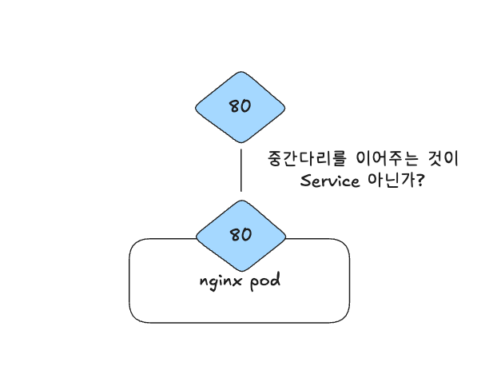

하지만 핵심은 Service가 **특정 노드에 귀속되지 않는다**는 점이다. Pod는 재시작될 때마다 새로운 IP를 할당받기 때문에, Service는 단순히 하나의 Pod에 달라붙는 것이 아니라 **클러스터 전체에 라우팅 테이블을 생성**한다.

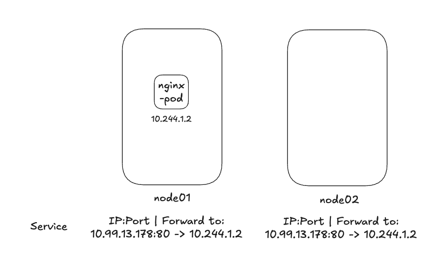

Service 워크로드를 배포하면 각 노드에 라우팅 테이블이 만들어지고, **Kube-Proxy**가 이 설정을 각 노드에 전파한다. 덕분에 다른 노드에 있는 Pod에서도 대상 Pod의 포트에 접근할 수 있게 된다.

기본적인 Service 매니페스트는 다음과 같다:

```yaml
apiVersion: v1
kind: Service
metadata:
  name: nginx-service
spec:
  selector:
    name: my-nginx
  ports:
  - protocol: TCP
    port: 80
    targetPort: 80
```

여기서 `selector`가 핵심이다. Pod을 배포할 때 지정한 라벨과 일치시켜야 Service가 올바른 대상으로 트래픽을 보낼 수 있다.

### 클러스터 내부 vs 외부

Service와 Ingress를 제대로 이해하려면, 먼저 "내부"와 "외부"의 경계를 명확히 짚어야 한다.

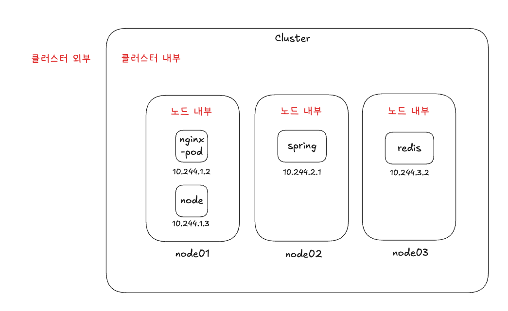

nginx-pod를 기준으로 생각하면, 같은 노드의 다른 Pod, 다른 노드의 Pod, 그리고 클러스터 바깥의 클라이언트까지 다양한 접근 지점이 있다. 이 각각의 시나리오에 따라 사용할 네트워킹 전략이 달라진다.

### Cluster DNS

Service를 배포하면 쿠버네티스의 **CoreDNS**를 통해 DNS 이름으로 접근할 수 있다. 예를 들어 spring pod에서 redis에 접근하려면:

```bash
host: redis.redis.svc.cluster.local
```

`POD_NAME.NAMESPACE.svc.cluster.local` 형식으로 접근하면 된다. 같은 네임스페이스에 있는 경우에는 더 간단하게 접근할 수도 있다:

```bash
curl http://nginx-pod
```

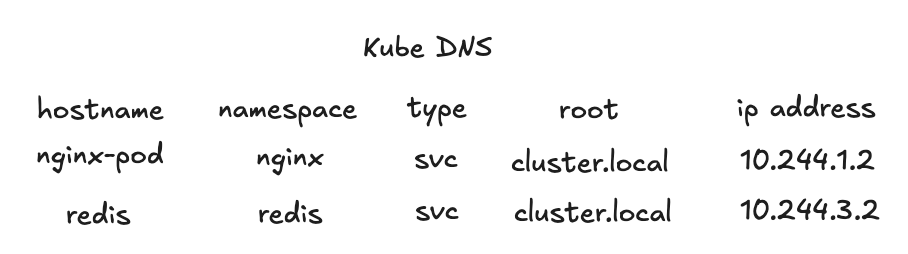

이처럼 위치에 따라 다른 호스트명을 사용해 접근할 수 있으며, Pod의 IP가 바뀌더라도 DNS 이름은 유지된다.

### ServiceTypes 비교

Service는 세 가지 타입을 제공한다:

| 타입 | 접근 범위 | 특징 |
|------|----------|------|
| **ClusterIP** | 클러스터 내부 전용 | 기본값. 내부 서비스 간 통신에 사용 |
| **NodePort** | 클러스터 외부에서 접근 가능 | 30000-32767 포트 범위로 노출 |
| **LoadBalancer** | 외부 로드밸런서 연동 | 클라우드 환경에서 자동 프로비저닝 |

#### ClusterIP

**ClusterIP**는 기본값으로, 클러스터 내부에서만 접근할 수 있다. Docker 컨테이너에서 포트 바인딩을 하지 않으면 외부 접근이 안 되는 것과 비슷한 개념이다.

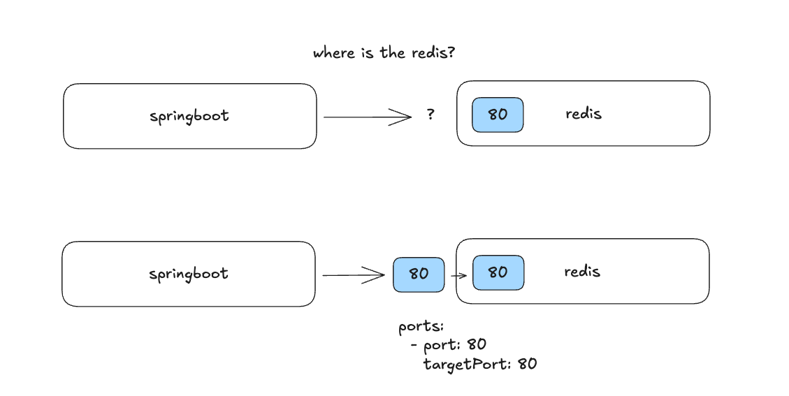

데이터베이스(MySQL, PostgreSQL), 인메모리 데이터 스토어(Redis, Valkey), 메시지 큐(Celery, RabbitMQ) 등 클러스터 내부에서만 접근하면 되는 서비스에 적합하다.

#### NodePort

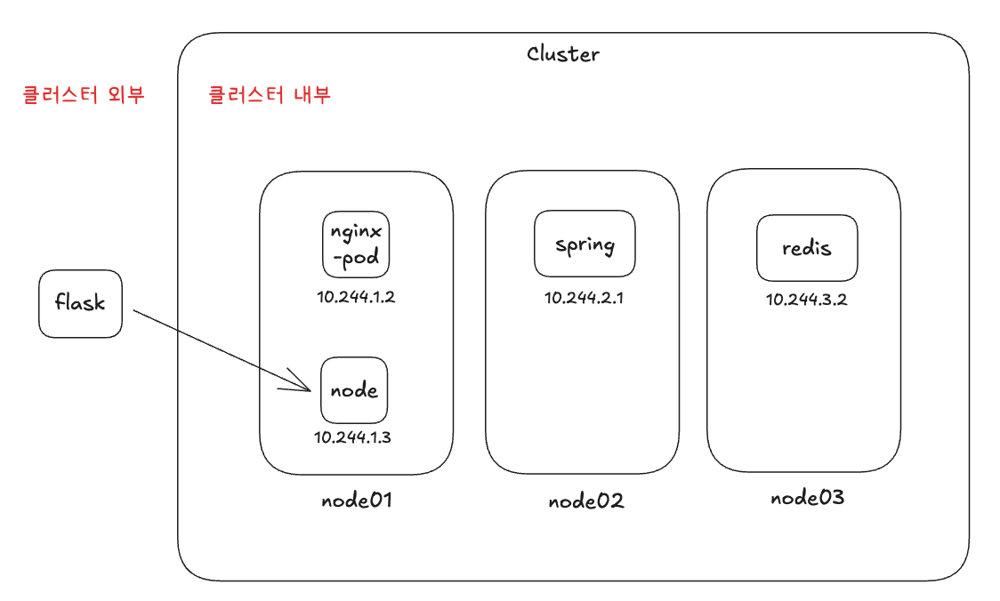

**NodePort**는 `type: NodePort`로 지정하면 클러스터 외부에서도 접근 가능하게 된다. 쿠버네티스는 외부 접근용으로 **30000-32767** 범위의 포트만 할당한다.

```yaml
apiVersion: v1
kind: Service
metadata:
  name: nginx-service
spec:
  type: NodePort
  selector:
    name: nginx
  ports:
  - port: 80
    targetPort: 80
#    nodePort: 30080  # 지정하지 않으면 랜덤 할당
```

> **포트 범위에 대한 참고사항**: 0-1023은 Well-known 포트(HTTP, HTTPS 등)로 예약되어 있고, 32768-65535는 ephemeral port(임시 포트)로 리눅스 시스템이 사용하기 때문에, 쿠버네티스는 그 사이인 30000-32767을 사용한다.

하지만 NodePort를 사용하면 `http://<노드IP>:<NodePort>` 형태로 접속해야 하므로 사용자 경험이 좋지 않다. DNS A 레코드를 설정하더라도 포트 번호를 붙여야 한다는 사실은 변하지 않는다.

---

## 2. Ingress: L7 레이어의 트래픽 라우팅

**Ingress**는 클러스터 외부에서 내부 서비스로 들어오는 HTTP(S) 트래픽에 대한 **규칙 기반 라우팅을 정의**하는 리소스이다. NodePort의 단점을 해결하면서, 도메인 기반 라우팅, SSL 종료, L7 로드밸런싱 등의 기능을 제공한다.

Ingress를 사용하기 위해서는 두 가지를 설정해야 한다:

1. **Ingress Resource**: 라우팅 규칙을 정의하는 쿠버네티스 매니페스트
2. **Ingress Controller**: 실제 트래픽 처리를 담당하는 서드파티 구현체 (Nginx, HAProxy, Traefik, Istio 등)

<!-- TODO: 다이어그램 필요 - Ingress의 트래픽 흐름 (외부 요청 -> Ingress Controller -> Service -> Pod) -->

### Path 기반 라우팅

같은 도메인에서 경로에 따라 다른 서비스로 라우팅할 수 있다:

```yaml
apiVersion: networking.k8s.io/v1
kind: Ingress
metadata:
  name: ingress-path
spec:
  rules:
  - http:
      paths:
      - path: /book
        pathType: Prefix
        backend:
          service:
            name: book-service
            port:
              number: 80
      - path: /coffee
        pathType: Prefix
        backend:
          service:
            name: coffee-service
            port:
              number: 80
```

`www.example.com/book`이나 `www.example.com/coffee`로 접근하면 각각 다른 서비스로 라우팅된다. 유효하지 않은 경로에 대해서는 기본 백엔드를 설정하여 404 에러 페이지를 제공할 수도 있다.

### 서브도메인 기반 라우팅

```yaml
apiVersion: networking.k8s.io/v1
kind: Ingress
metadata:
  name: ingress-subdomain
spec:
  rules:
  - host: book.example.com
    http:
      paths:
      - path: /
        pathType: Prefix
        backend:
          service:
            name: book-service
            port:
              number: 80
  - host: coffee.example.com
    http:
      paths:
      - path: /
        pathType: Prefix
        backend:
          service:
            name: coffee-service
            port:
              number: 80
```

### Ingress Controller 설정 (nginx-ingress)

Ingress Controller로 가장 널리 사용되는 nginx를 설정하는 방법은 다음과 같다.

먼저, ingress-nginx를 설치한다:

```bash
kubectl apply -f https://raw.githubusercontent.com/kubernetes/ingress-nginx/main/deploy/static/provider/cloud/deploy.yaml
```

그 후, Ingress 매니페스트에 어떤 컨트롤러를 사용할지 annotation으로 명시한다:

```yaml
apiVersion: networking.k8s.io/v1
kind: Ingress
metadata:
  name: my-ingress
  annotations:
    kubernetes.io/ingress.class: "nginx"  # Nginx Ingress Controller 사용을 명시
spec:
  rules:
  - host: book.example.com
    http:
      paths:
      - path: /
        pathType: Prefix
        backend:
          service:
            name: book-service
            port:
              number: 80
```

Helm을 사용하고 있다면 더 간편하게 설치할 수도 있다. 핵심은 Ingress 리소스만으로는 동작하지 않고, 반드시 Ingress Controller가 함께 배포되어야 한다는 점이다.

---

## 3. 온프레미스를 위한 MetalLB

### 왜 베어메탈에서 MetalLB가 필요한가?

클라우드 환경(AWS, GCP 등)에서는 `type: LoadBalancer`를 설정하면 클라우드 공급자의 로드밸런서가 자동으로 생성된다. 하지만 온프레미스 환경에서는 이런 매니지드 로드밸런서가 없기 때문에 EXTERNAL-IP가 계속 `<pending>` 상태로 남는다.

**MetalLB**는 이 빈자리를 채워주는 소프트웨어 로드밸런서다. Controller + Speaker로 구성되어, **외부에서 접근 가능한 VIP(Virtual IP)를 쿠버네티스 서비스에 할당**하고 네트워크에 광고하는 역할을 한다.

쿠버네티스 공식 문서에서도 다음과 같이 설명한다:

> On cloud providers which support external load balancers, setting the type field to LoadBalancer provisions a load balancer for your Service.

베어메탈에서는 이 부분을 직접 구현해야 하며, MetalLB가 그 역할을 담당한다.

### NodePort vs LoadBalancer 매니페스트 비교

NodePort는 30000번대 포트를 사용하므로 실서비스에 부적합하다:

```yaml
apiVersion: v1
kind: Service
metadata:
  name: my-service
spec:
  type: NodePort
  selector:
    app.kubernetes.io/name: MyApp
  ports:
    - port: 80
      targetPort: 80
      nodePort: 30007
```

반면 LoadBalancer는 정식 IP를 노출시킬 수 있다:

```yaml
apiVersion: v1
kind: Service
metadata:
  name: my-service
spec:
  selector:
    app.kubernetes.io/name: MyApp
  ports:
    - protocol: TCP
      port: 80
      targetPort: 9376
  clusterIP: 10.0.171.239
  type: LoadBalancer
status:
  loadBalancer:
    ingress:
    - ip: 192.0.2.127
```

### MetalLB 설치 및 설정

#### 1단계: 사전 설정

먼저 kube-proxy의 strictARP를 활성화한다:

```bash
kubectl edit configmap -n kube-system kube-proxy
```

```yaml
apiVersion: kubeproxy.config.k8s.io/v1alpha1
kind: KubeProxyConfiguration
mode: "ipvs"
ipvs:
  strictARP: true
```

#### 2단계: MetalLB 설치

```bash
kubectl apply -f https://raw.githubusercontent.com/metallb/metallb/v0.15.2/config/manifests/metallb-native.yaml
```

설치 후 확인하면 Controller와 Speaker가 정상적으로 동작하는 것을 볼 수 있다:

```
$ kubectl get all -n metallb-system
NAME                             READY   STATUS    RESTARTS   AGE
pod/controller-78fb49f59-dwvrf   1/1     Running   0          3m55s
pod/speaker-pgdh2                1/1     Running   0          3m55s

NAME                     DESIRED   CURRENT   READY   UP-TO-DATE   AVAILABLE
daemonset.apps/speaker   1         1         1       1            1
```

하지만 이 상태에서도 EXTERNAL-IP는 여전히 `<pending>`이다. IP Pool과 Advertisement 설정이 추가로 필요하다.

#### 3단계: IP Pool 및 L2 Advertisement 설정

IP Pool을 설정한다 (`metallb-ip-address.yaml`):

```yaml
apiVersion: metallb.io/v1beta1
kind: IPAddressPool
metadata:
  name: first-pool
  namespace: metallb-system
spec:
  addresses:
  - 192.168.1.240-192.168.1.250
```

L2 Advertisement를 설정한다 (`metallb-l2.yaml`):

```yaml
apiVersion: metallb.io/v1beta1
kind: L2Advertisement
metadata:
  name: example
  namespace: metallb-system
spec:
  ipAddressPools:
  - first-pool
```

두 파일을 `kubectl apply`로 적용하면 EXTERNAL-IP가 할당된다:

```
$ kubectl get svc metallb-demo -o wide
NAME           TYPE           CLUSTER-IP     EXTERNAL-IP     PORT(S)        AGE   SELECTOR
metallb-demo   LoadBalancer   10.96.17.184   192.168.1.240   80:32399/TCP   18m   app=metallb-demo
```

### MetalLB의 구성 요소: Controller와 Speaker

MetalLB는 크게 두 가지 컴포넌트로 구성된다:

- **Controller (Deployment)**: 쿠버네티스 API를 watch하면서 `type: LoadBalancer` 서비스가 생성/변경될 때 `IPAddressPool`에서 사용 가능한 IP를 선택하여 할당한다.
- **Speaker (DaemonSet)**: 각 노드마다 하나씩 실행되며, Controller가 결정한 할당 정보를 기반으로 L2 모드에서는 ARP/NDP, BGP 모드에서는 라우터와 BGP 세션을 통해 VIP를 네트워크에 광고한다.

### L2 모드

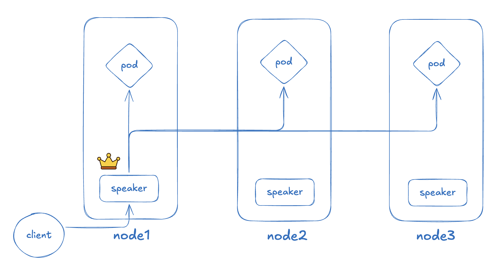

L2 모드에서는 리더로 선출된 Speaker가 ARP를 통해 VIP의 소유를 네트워크에 알린다. 클라이언트가 "이 IP를 가진 MAC 주소는 뭐야?"라고 물으면 리더 Speaker가 응답하는 구조이다.

**L2Advertisement** 리소스로 "어떤 IP 풀을 L2로 광고할지"를 정해두면, 해당 풀에서 할당된 VIP에 대해 Speaker 하나가 대표로 ARP 응답을 한다. 트래픽이 리더 Speaker에 도달하면 iptables를 통해 부하 분산을 수행한다. 장애가 발생하면 리더가 다른 노드로 넘어가고, 새 노드가 ARP를 다시 전파하면서 VIP를 인계받는다.

### BGP 모드

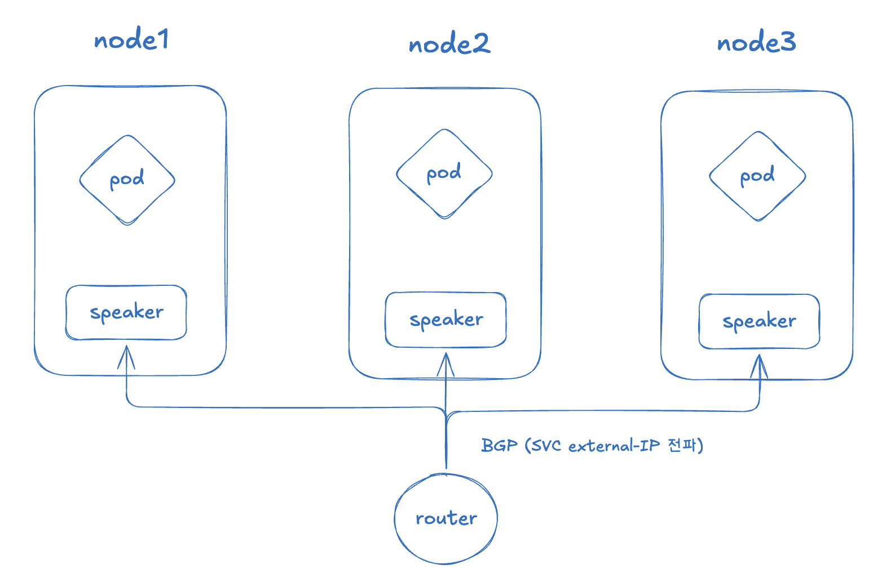

BGP 모드는 L2 모드와 달리, VIP를 한 노드가 독점하지 않는다. **각 노드의 Speaker가 라우터와 BGP 세션을 맺고 VIP 경로를 직접 광고**한다.

라우터 입장에서는 "이 VIP로 가는 경로가 node1, node2, node3에 모두 있다"고 보이게 되어, **ECMP(Equal-Cost Multi-Path)**로 트래픽을 여러 노드에 분산할 수 있다. L2 모드에서 발생할 수 있는 "한 노드에만 트래픽이 몰리는 병목"을 피할 수 있고, 노드 장애 시에도 BGP 세션 종료를 통해 비교적 빠르게 라우트를 갱신할 수 있다.

| 비교 항목 | L2 모드 | BGP 모드 |
|----------|---------|---------|
| 설정 복잡도 | 낮음 | 높음 (라우터 설정 필요) |
| 트래픽 분산 | 리더 노드에 집중 | ECMP로 균등 분산 |
| 장애 복구 | ARP 재전파 | BGP 세션 종료로 빠른 갱신 |
| 네트워크 요구사항 | 같은 L2 도메인 | BGP 지원 라우터 |

> **참고**: MetalLB는 라우팅 프로토콜을 사용하기 때문에, 도입 전에 네트워크 엔지니어와 사전 협의가 필요하다. 문제 발생 시 원인 파악 속도에도 영향을 준다.

---

## 4. Istio Gateway: 서비스 메시로의 진화

### nginx-ingress에서 Istio로 전환하는 이유

기존에 nginx-ingress를 사용하고 있던 온프레미스 환경에서 Istio Gateway로 전환하게 된 핵심 이유는 다음과 같다:

1. **ingress-NGINX의 지원 종료**: ingress-NGINX가 2026년 3월까지 best-effort 유지보수 후 리타이어 예정으로, 이후 릴리즈/버그픽스/보안패치가 제공되지 않는다.
2. **Kubernetes Gateway API 지원**: Istio가 Kubernetes Gateway API를 지원하며, 장기적으로 트래픽 매니지먼트의 표준 API로 자리잡는 방향성이 명확하다.
3. **서비스 메시의 이점**: 트래픽 관찰, 보안 정책, 세밀한 라우팅 등 부가 기능이 풍부하다.

### 서비스 메시란?

Istio는 **서비스 메시(Service Mesh)** 플랫폼이다. 서비스 메시란, 마이크로서비스 간의 네트워크 통신을 인프라 레벨에서 관리하는 전용 계층을 말한다. 각 서비스 옆에 사이드카 프록시(Envoy)를 배치하여, 애플리케이션 코드 수정 없이 트래픽 제어, 보안, 관찰 가능성(Observability)을 확보할 수 있다.

### Ingress의 한계: 왜 Istio Gateway가 필요한가?

실제 온프레미스 환경에서의 상황을 예시로 살펴보자.

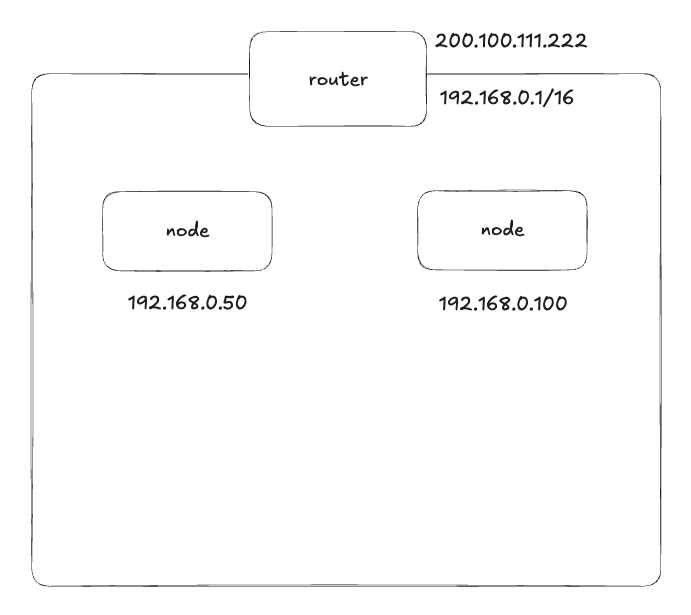

쿠버네티스 클러스터를 구축하고 같은 네트워크에 노드를 추가하면 다음과 같은 구조가 된다:

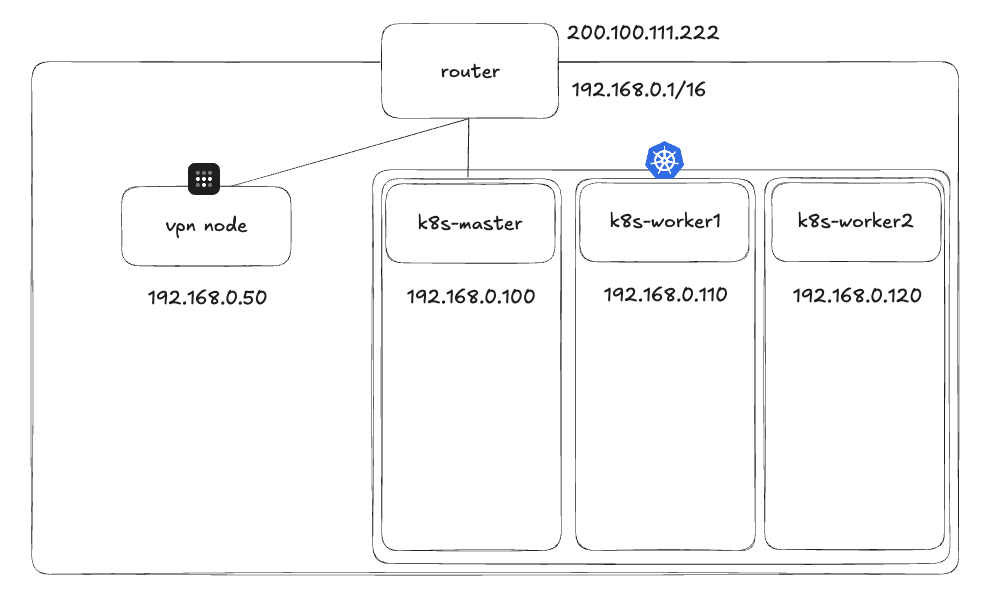

공유기 내의 노드들은 `192.168.0.0/16` 대역의 IP를 받게 된다. 이 상황에서 클러스터 안의 파드를 외부에서 접근 가능하게 해야 하는데, MetalLB를 통해 LoadBalancer 타입으로 IP를 할당받더라도 문제가 남는다.

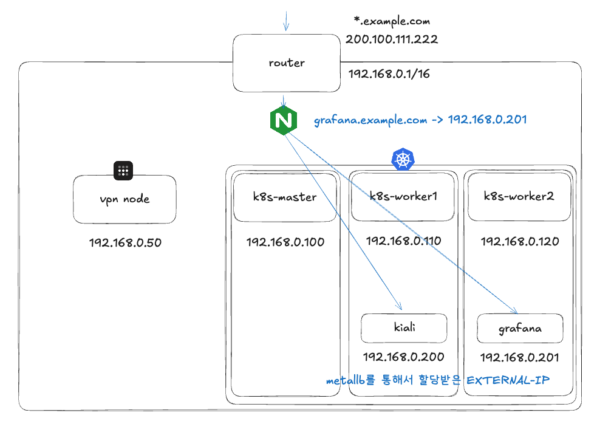

예를 들어 worker nodes에 떠 있는 Kiali나 Grafana 대시보드가 `192.168.0.200-201`을 할당받았다고 하더라도, **서브도메인 기반의 L7 라우팅**을 위해서는 결국 앞단에 Nginx 같은 별도의 프록시를 붙여야 한다. 이는 클러스터 외부에 추가적인 관리 포인트를 만든다.

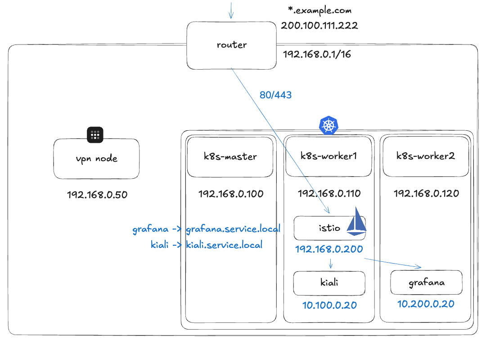

**Istio Gateway를 사용하면** 모든 80/443 요청을 클러스터 안에 있는 Istio Gateway가 받아서, 내부적으로 서브도메인별로 적절한 파드에 라우팅할 수 있다. 앞단에 복잡한 프록시 설정을 둘 필요가 없고, 서비스 메시를 통한 트래픽 관찰도 가능해진다.

### 기존 구조 vs Istio 구조 비교

기존의 **Service + Ingress + ingress-nginx** 조합과 Istio 기반 구조는 다음과 같이 대응된다:

| 기존 구조 | Istio 구조 | 역할 |
|----------|-----------|------|
| Service | Service (그대로 사용) | Pod 엔드포인트 추상화 |
| Ingress | Gateway | 진입점 정의 (포트/프로토콜/TLS) |
| Ingress Controller (nginx) | Istio IngressGateway (Envoy) | 실제 트래픽 처리 |
| Ingress rules | VirtualService | 라우팅 규칙 정의 |

### Gateway와 VirtualService

Istio Gateway는 **"메시 가장자리(edge)에서 들어오는 HTTP/TCP 트래픽을 받는 Envoy 프록시 설정"**이다. 어떤 포트를 열지, 어떤 프로토콜을 쓸지, TLS/SNI 설정을 어떻게 할지 등을 선언한다.

#### Gateway 리소스

```yaml
apiVersion: networking.istio.io/v1beta1
kind: Gateway
metadata:
  name: demo-gateway
  namespace: istio-system
spec:
  selector:
    istio: ingressgateway   # 어떤 gateway(Envoy) 워크로드에 적용할지
  servers:
  - port:
      number: 80
      name: http
      protocol: HTTP
    hosts:
    - "app.demo.local"      # Host 헤더 기준으로 매칭
```

이 설정으로 Envoy가 **80 포트에서 HTTP 요청을 받을 Listener**를 생성한다. 하지만 "받기"만 열어준 상태이고, "어디로 보낼지"는 VirtualService가 결정한다.

> **중요**: Gateway는 Envoy 프록시 설정(L7)일 뿐, 외부 트래픽이 실제로 프록시 Pod까지 도달하게 만드는 것은 사용자의 책임이다. 온프레미스에서는 MetalLB가 이 역할을 담당한다.

#### VirtualService 리소스

```yaml
apiVersion: networking.istio.io/v1beta1
kind: VirtualService
metadata:
  name: demo-vs
  namespace: demo
spec:
  hosts:
  - "app.demo.local"
  gateways:
  - istio-system/demo-gateway
  http:
  - match:
    - uri:
        prefix: /
    route:
    - destination:
        host: demo-app.demo.svc.cluster.local
        port:
          number: 8080
```

`app.demo.local`로 들어온 요청을 `demo-app` 서비스의 8080 포트로 라우팅한다.

#### HTTPS 리다이렉트 설정

실무에서 자주 사용하는 HTTP -> HTTPS 리다이렉트 설정은 다음과 같다:

```yaml
apiVersion: networking.istio.io/v1beta1
kind: Gateway
metadata:
  name: demo-gateway
  namespace: istio-system
spec:
  selector:
    istio: ingressgateway
  servers:
  # 1) 80으로 들어오면 HTTPS로 리다이렉트
  - port:
      number: 80
      name: http
      protocol: HTTP
    hosts:
    - "app.demo.local"
    tls:
      httpsRedirect: true

  # 2) 443에서 TLS 종료(termination) 후 HTTP 라우팅
  - port:
      number: 443
      name: https
      protocol: HTTPS
    hosts:
    - "app.demo.local"
    tls:
      mode: SIMPLE
      credentialName: app-demo-tls   # istio-system 네임스페이스의 TLS Secret 참조
```

### 실습: Minikube에서 Istio Gateway 구성하기

로컬 환경에서 직접 검증할 수 있도록 minikube 기반의 실습 과정을 정리한다.

#### 1단계: MetalLB 설치 및 설정

```bash
kubectl apply -f https://raw.githubusercontent.com/metallb/metallb/v0.15.3/config/manifests/metallb-native.yaml
```

minikube의 IP 대역에 맞춰 MetalLB를 설정한다 (보통 minikube는 `192.168.49.2`를 사용한다):

```yaml
apiVersion: metallb.io/v1beta1
kind: IPAddressPool
metadata:
  name: minikube-pool
  namespace: metallb-system
spec:
  addresses:
  - 192.168.49.100-192.168.49.120
---
apiVersion: metallb.io/v1beta1
kind: L2Advertisement
metadata:
  name: minikube-l2
  namespace: metallb-system
spec:
  ipAddressPools:
  - minikube-pool
```

#### 2단계: Istio 설치

```bash
istioctl install -y
```

설치가 완료되면 Istio 로고(배 모양)가 터미널에 출력된다.

#### 3단계: 샘플 앱 배포

네임스페이스를 생성하고 istio-injection을 활성화한다:

```bash
kubectl create ns demo
kubectl label ns demo istio-injection=enabled
```

샘플 앱을 배포한다:

```bash
# httpbin
kubectl -n demo apply -f https://raw.githubusercontent.com/istio/istio/release-1.24/samples/httpbin/httpbin.yaml

# sleep (클러스터 내부 테스트용)
kubectl -n demo apply -f https://raw.githubusercontent.com/istio/istio/release-1.24/samples/sleep/sleep.yaml
```

MetalLB에 의해 istio-ingressgateway에 EXTERNAL-IP가 할당되었는지 확인한다:

```bash
$ kubectl -n istio-system get svc istio-ingressgateway -o wide
NAME                   TYPE           CLUSTER-IP       EXTERNAL-IP      PORT(S)                                      AGE
istio-ingressgateway   LoadBalancer   10.102.207.200   192.168.49.100   15021:30656/TCP,80:31952/TCP,443:31816/TCP   82m
```

#### 4단계: Gateway 및 VirtualService 적용

Gateway를 설정한다:

```yaml
apiVersion: networking.istio.io/v1beta1
kind: Gateway
metadata:
  name: demo-gateway
  namespace: istio-system
spec:
  selector:
    istio: ingressgateway
  servers:
  - port:
      number: 80
      name: http
      protocol: HTTP
    hosts:
    - "httpbin.demo.local"
```

VirtualService를 설정한다:

```yaml
apiVersion: networking.istio.io/v1beta1
kind: VirtualService
metadata:
  name: httpbin-vs
  namespace: demo
spec:
  hosts:
  - "httpbin.demo.local"
  gateways:
  - istio-system/demo-gateway
  http:
  - match:
    - uri:
        prefix: /
    route:
    - destination:
        host: httpbin
        port:
          number: 8000
```

#### 5단계: 검증

minikube 환경에서는 `minikube tunnel`을 사용하여 LoadBalancer 서비스에 대한 접근 경로를 연다:

```bash
minikube tunnel
```

```
$ minikube tunnel
  Tunnel successfully started
  NOTE: Please do not close this terminal as this process must stay alive...
  Starting tunnel for service istio-ingressgateway.
```

Host 헤더를 지정하여 라우팅을 검증한다:

```bash
curl -H "Host: httpbin.demo.local" http://127.0.0.1/headers
```

클러스터 내부에서 검증하고 싶다면, sleep Pod에 exec로 접속하여 테스트할 수도 있다:

```bash
SLEEP_POD=$(kubectl -n demo get pod -l app=sleep -o jsonpath='{.items[0].metadata.name}')
kubectl -n demo exec -it $SLEEP_POD -c sleep -- \
  curl -H "Host: httpbin.demo.local" http://192.168.49.100/headers
```

정상적으로 요청 헤더가 반환되면 Istio Gateway 설정이 완료된 것이다.

---

## 정리: 네트워킹 계층의 발전 흐름

쿠버네티스 네트워킹은 요구사항의 복잡도에 따라 점진적으로 발전한다:

<!-- TODO: 다이어그램 필요 - 전체 트래픽 흐름 요약 (외부 클라이언트 -> MetalLB VIP -> Istio Gateway (Envoy) -> VirtualService -> Service -> Pod) -->

| 단계 | 기술 | 해결하는 문제 |
|------|------|-------------|
| 1 | ClusterIP | 클러스터 내부 서비스 간 통신 |
| 2 | NodePort | 외부에서의 접근 (포트 제약 존재) |
| 3 | Ingress + nginx | L7 라우팅, 도메인 기반 분기, SSL |
| 4 | MetalLB | 온프레미스에서 LoadBalancer 타입 사용 |
| 5 | Istio Gateway | 서비스 메시, 고급 트래픽 관리, 관찰 가능성 |

각 단계가 이전 단계의 한계를 보완하면서 발전하는 구조이며, 반드시 모든 단계를 거칠 필요는 없다. 클라우드 환경에서는 MetalLB가 불필요하고, 단순한 서비스라면 Ingress만으로 충분할 수 있다. 중요한 것은 각 기술이 **어떤 문제를 해결하는지**를 이해하고, 자신의 환경에 맞는 선택을 하는 것이다.

---

## 참고 자료

- [Kubernetes 공식 문서 - Service](https://kubernetes.io/ko/docs/concepts/services-networking/service/)
- [Kubernetes 공식 문서 - Ingress](https://kubernetes.io/ko/docs/concepts/services-networking/ingress/)
- [MetalLB 공식 문서 - Installation](https://metallb.io/installation/)
- [MetalLB 공식 문서 - Configuration (Layer 2)](https://metallb.io/configuration/#layer-2-configuration)
- [Istio 공식 문서 - Gateway](https://istio.io/latest/docs/reference/config/networking/gateway/)
- [Istio 공식 문서 - Ingress Gateways](https://istio.io/latest/docs/tasks/traffic-management/ingress/ingress-control/)
- [Coursera - Ephemeral Ports](https://www.coursera.org/articles/ephemeral-ports)
