One of the first problems you run into while operating Kubernetes is "how do I get traffic into the cluster?" Starting from internal communication and moving through external access, domain-based routing, and finally the service mesh — the technologies in this space did not replace one another. Each layer accumulated on top of the limits the previous one ran into.

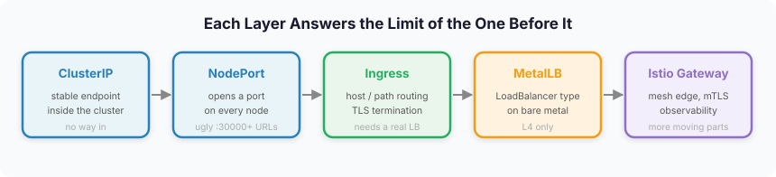

This post follows that order. Starting from the basics of the **Service** resource, it works through L7 routing with **Ingress**, **MetalLB** for on-premises environments, and finally **Istio Gateway**, with real YAML along the way.

Two other posts cover the same cluster network at different layers. How Pod-to-Pod communication actually happens is in [CNI and Kubernetes networking](), and the internals of how Istio injects sidecars and intercepts traffic are in [an Istio deep dive](). This post sits between them, covering **the path external traffic takes to cross the cluster boundary**.

---

## 1. Service Types: The Basis of Kubernetes Networking

The first traffic-related resource you meet in Kubernetes is the **Service**. A Service is an abstraction that provides a stable network endpoint for a set of Pods, and how you reach it depends on the strategy you pick (ClusterIP, NodePort, LoadBalancer).

### How Does a Service Work?

The easy way to picture a Service is as something that punches a hole through to a specific Pod's port.

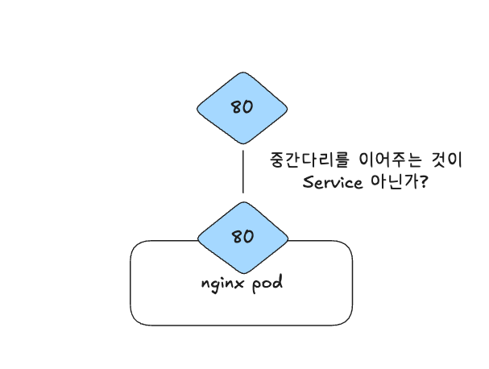

The important part, though, is that a Service is **not bound to a particular node**. Because a Pod gets a new IP every time it restarts, a Service does not simply attach itself to one Pod — it **creates a routing table across the whole cluster**.

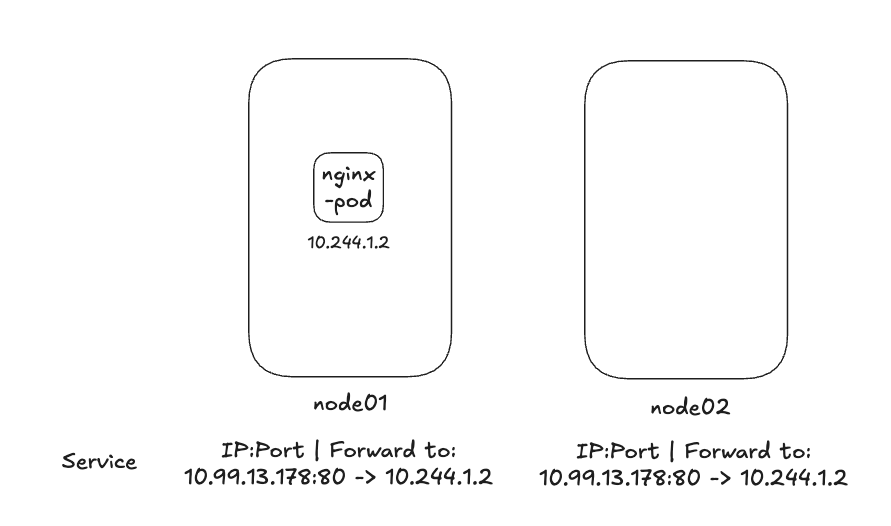

When you deploy a Service workload, a routing table is created on each node, and **kube-proxy** propagates that configuration to every node. That is what lets a Pod on one node reach a port on a Pod sitting on another.

A basic Service manifest looks like this.

```yaml
apiVersion: v1
kind: Service
metadata:
  name: nginx-service
spec:
  selector:
    name: my-nginx
  ports:
  - protocol: TCP
    port: 80
    targetPort: 80
```

The `selector` is the key part. It has to match the label you set when deploying the Pod, or the Service will not send traffic to the right target.

### Inside vs. Outside the Cluster

To understand Service and Ingress properly, the boundary between "inside" and "outside" has to be clear first.

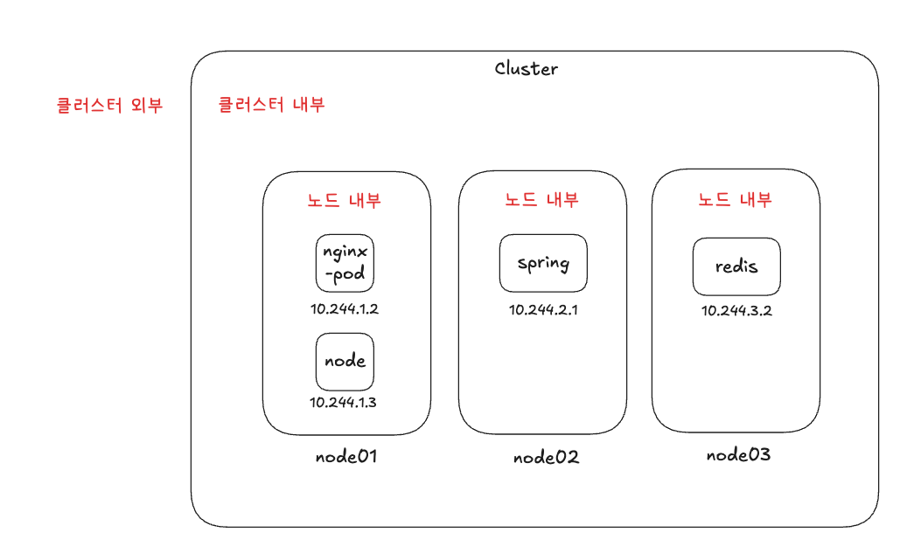

Taking an nginx-pod as the reference point, there are several possible access points: another Pod on the same node, a Pod on a different node, and a client outside the cluster entirely. The networking strategy you use differs per scenario.

### Cluster DNS

Once a Service is deployed, it becomes reachable by DNS name through Kubernetes' **CoreDNS**. For example, to reach the redis Service in the redis namespace from a spring pod, you use this address.

```bash
host: redis.redis.svc.cluster.local
```

Note that this name points at a **Service**, not a Pod. The format is `SERVICE_NAME.NAMESPACE.svc.cluster.local` — the first `redis` is the Service name and the second is the namespace. Within the same namespace, the Service name alone is enough.

```bash
curl http://nginx-service
```

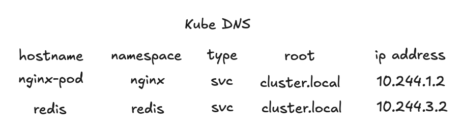

So the hostname you use depends on where you are calling from, and the DNS name stays stable even when a Pod's IP changes.

### Comparing Service Types

A Service comes in three types.

| Type | Reach | Notes |
|------|----------|------|
| **ClusterIP** | Cluster-internal only | The default. Used for internal service-to-service traffic |
| **NodePort** | Reachable from outside the cluster | Exposed on a port in the 30000-32767 range |
| **LoadBalancer** | Integrates with an external load balancer | Provisioned automatically in cloud environments |

#### ClusterIP

**ClusterIP** is the default and is reachable only from inside the cluster. It is a similar idea to a Docker container being unreachable from outside unless you bind a port.

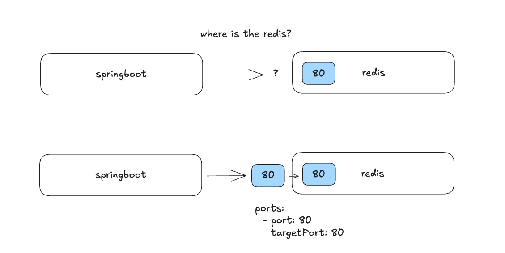

It suits services that only need to be reached from within the cluster: databases (MySQL, PostgreSQL), in-memory stores (Redis, Valkey), message queues (Celery, RabbitMQ), and the like.

#### NodePort

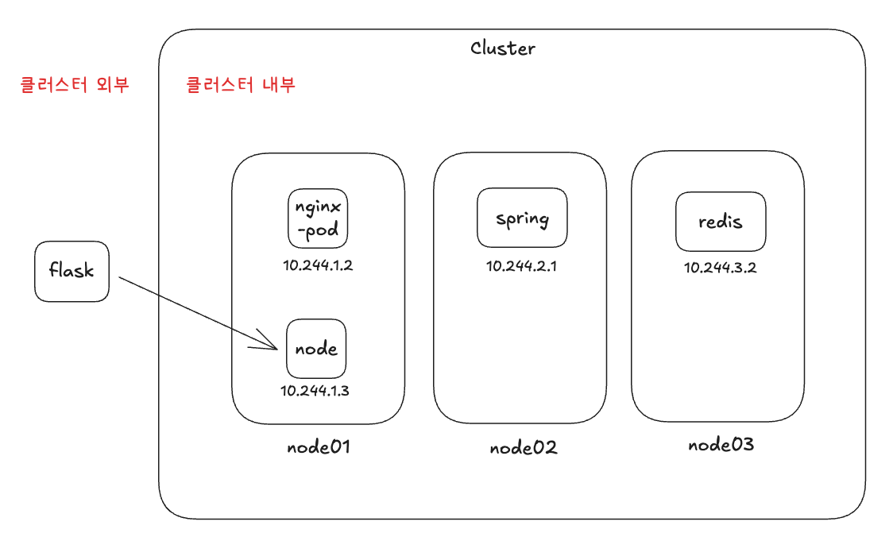

Setting `type: NodePort` makes a Service reachable from outside the cluster. Kubernetes allocates only ports in the **30000-32767** range for external access.

```yaml
apiVersion: v1
kind: Service
metadata:
  name: nginx-service
spec:
  type: NodePort
  selector:
    name: nginx
  ports:
  - port: 80
    targetPort: 80
#    nodePort: 30080  # assigned at random when omitted
```

> **A note on port ranges**: 0-1023 are reserved as well-known ports (HTTP, HTTPS, and so on), and 32768-65535 are ephemeral ports used by the Linux system, so Kubernetes uses the range in between, 30000-32767.

But using NodePort means connecting through `http://<node-IP>:<NodePort>`, which is a poor user experience. Even with a DNS A record in place, the port number still has to be appended.

---

## 2. Ingress: Traffic Routing at L7

Having to carry a port number around in the URL is exactly the kind of friction that leads to "I want to reach this by domain name." Ingress fills that gap.

**Ingress** is a resource that **defines rule-based routing** for HTTP(S) traffic entering the cluster from outside. It solves NodePort's shortcomings while providing domain-based routing, TLS termination, and L7 load balancing.

Using Ingress requires two things.

1. **The Ingress resource**: the Kubernetes manifest that defines the routing rules
2. **An Ingress Controller**: the third-party implementation that actually handles the traffic (Nginx, HAProxy, Traefik, Istio, and others)

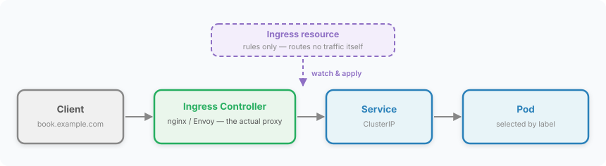

This is an easy point to get confused about. The Ingress resource is **only a declaration of rules; what actually receives and forwards packets is the proxy running as the Controller**. That is why creating an Ingress manifest without deploying a Controller does nothing at all.

### Path-Based Routing

Within the same domain, you can route to different services by path.

```yaml
apiVersion: networking.k8s.io/v1
kind: Ingress
metadata:
  name: ingress-path
spec:
  rules:
  - http:
      paths:
      - path: /book
        pathType: Prefix
        backend:
          service:
            name: book-service
            port:
              number: 80
      - path: /coffee
        pathType: Prefix
        backend:
          service:
            name: coffee-service
            port:
              number: 80
```

Requests to `www.example.com/book` and `www.example.com/coffee` are routed to different services. You can also configure a default backend to serve a 404 page for paths that do not match.

### Subdomain-Based Routing

```yaml
apiVersion: networking.k8s.io/v1
kind: Ingress
metadata:
  name: ingress-subdomain
spec:
  rules:
  - host: book.example.com
    http:
      paths:
      - path: /
        pathType: Prefix
        backend:
          service:
            name: book-service
            port:
              number: 80
  - host: coffee.example.com
    http:
      paths:
      - path: /
        pathType: Prefix
        backend:
          service:
            name: coffee-service
            port:
              number: 80
```

### Configuring an Ingress Controller (nginx-ingress)

Here is how to set up nginx, the most widely used Ingress Controller.

First, install ingress-nginx.

```bash
kubectl apply -f https://raw.githubusercontent.com/kubernetes/ingress-nginx/main/deploy/static/provider/cloud/deploy.yaml
```

Then state in the Ingress manifest which controller should handle it.

```yaml
apiVersion: networking.k8s.io/v1
kind: Ingress
metadata:
  name: my-ingress
spec:
  ingressClassName: nginx # which Ingress Controller handles this
  rules:
  - host: book.example.com
    http:
      paths:
      - path: /
        pathType: Prefix
        backend:
          service:
            name: book-service
            port:
              number: 80
```

Older examples often use the `kubernetes.io/ingress.class` annotation, but that approach was deprecated in Kubernetes 1.18; the `spec.ingressClassName` field above is what is used now.

If you are on Helm, installation is simpler still. The key point is that an Ingress resource alone does nothing — an Ingress Controller must be deployed alongside it.

---

## 3. MetalLB for On-Premises

Once L7 routing is handled by Ingress, one problem remains: how do you expose the Ingress Controller itself to the outside world? In the cloud that is one line — `type: LoadBalancer` — but on-premises it is not.

### Why Bare Metal Needs MetalLB

In cloud environments (AWS, GCP, and so on), setting `type: LoadBalancer` provisions a load balancer from the cloud provider automatically. On-premises there is no such managed load balancer, so EXTERNAL-IP stays stuck at `<pending>`.

**MetalLB** is the software load balancer that fills that gap. Made up of a Controller and Speakers, it **assigns an externally reachable VIP (Virtual IP) to a Kubernetes Service** and advertises it to the network.

The official Kubernetes documentation puts it this way.

> On cloud providers which support external load balancers, setting the type field to LoadBalancer provisions a load balancer for your Service.

On bare metal that part has to be implemented yourself, and MetalLB is what takes it on.

### NodePort vs. LoadBalancer Manifests

NodePort uses ports in the 30000 range, which makes it unsuitable for production.

```yaml
apiVersion: v1
kind: Service
metadata:
  name: my-service
spec:
  type: NodePort
  selector:
    app.kubernetes.io/name: MyApp
  ports:
    - port: 80
      targetPort: 80
      nodePort: 30007
```

LoadBalancer, on the other hand, can expose a proper IP.

```yaml
apiVersion: v1
kind: Service
metadata:
  name: my-service
spec:
  selector:
    app.kubernetes.io/name: MyApp
  ports:
    - protocol: TCP
      port: 80
      targetPort: 9376
  clusterIP: 10.0.171.239
  type: LoadBalancer
status:
  loadBalancer:
    ingress:
    - ip: 192.0.2.127
```

### Installing and Configuring MetalLB

#### Step 1: Prerequisites

First, enable strictARP on kube-proxy.

```bash
kubectl edit configmap -n kube-system kube-proxy
```

```yaml
apiVersion: kubeproxy.config.k8s.io/v1alpha1
kind: KubeProxyConfiguration
mode: "ipvs"
ipvs:
  strictARP: true
```

#### Step 2: Install MetalLB

```bash
kubectl apply -f https://raw.githubusercontent.com/metallb/metallb/v0.15.2/config/manifests/metallb-native.yaml
```

Checking after installation shows the Controller and Speaker running normally.

```
$ kubectl get all -n metallb-system
NAME                             READY   STATUS    RESTARTS   AGE
pod/controller-78fb49f59-dwvrf   1/1     Running   0          3m55s
pod/speaker-pgdh2                1/1     Running   0          3m55s

NAME                     DESIRED   CURRENT   READY   UP-TO-DATE   AVAILABLE
daemonset.apps/speaker   1         1         1       1            1
```

Even in this state, though, EXTERNAL-IP is still `<pending>`. An IP pool and an advertisement configuration are needed on top.

#### Step 3: IP Pool and L2 Advertisement

Configure an IP pool (`metallb-ip-address.yaml`).

```yaml
apiVersion: metallb.io/v1beta1
kind: IPAddressPool
metadata:
  name: first-pool
  namespace: metallb-system
spec:
  addresses:
  - 192.168.1.240-192.168.1.250
```

Configure the L2 advertisement (`metallb-l2.yaml`).

```yaml
apiVersion: metallb.io/v1beta1
kind: L2Advertisement
metadata:
  name: example
  namespace: metallb-system
spec:
  ipAddressPools:
  - first-pool
```

Applying both files with `kubectl apply` gets an EXTERNAL-IP assigned.

```
$ kubectl get svc metallb-demo -o wide
NAME           TYPE           CLUSTER-IP     EXTERNAL-IP     PORT(S)        AGE   SELECTOR
metallb-demo   LoadBalancer   10.96.17.184   192.168.1.240   80:32399/TCP   18m   app=metallb-demo
```

### MetalLB's Components: Controller and Speaker

MetalLB consists of two components.

- **Controller (Deployment)**: watches the Kubernetes API and, when a `type: LoadBalancer` Service is created or changed, picks an available IP from an `IPAddressPool` and assigns it.
- **Speaker (DaemonSet)**: runs one per node and, based on what the Controller assigned, advertises the VIP to the network — via ARP/NDP in L2 mode, or a BGP session with a router in BGP mode.

### L2 Mode

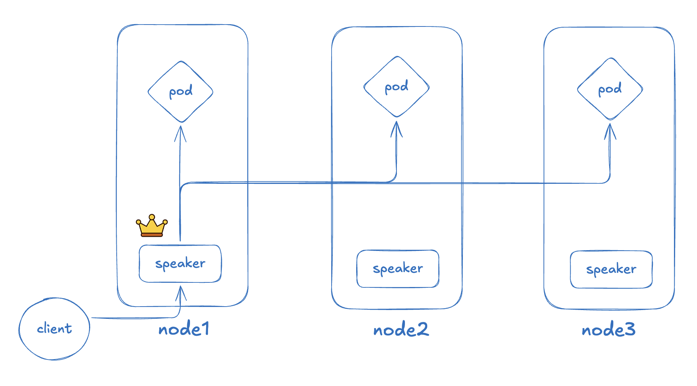

In L2 mode, a Speaker elected as leader announces ownership of the VIP over ARP. When a client asks "what MAC address holds this IP?", the leader Speaker is the one that answers.

The **L2Advertisement** resource decides "which IP pool gets advertised over L2," and one Speaker answers ARP on behalf of every VIP allocated from that pool. Once traffic reaches the leader Speaker, iptables handles load distribution. If a failure occurs, leadership moves to another node, which re-broadcasts ARP and takes over the VIP.

### BGP Mode

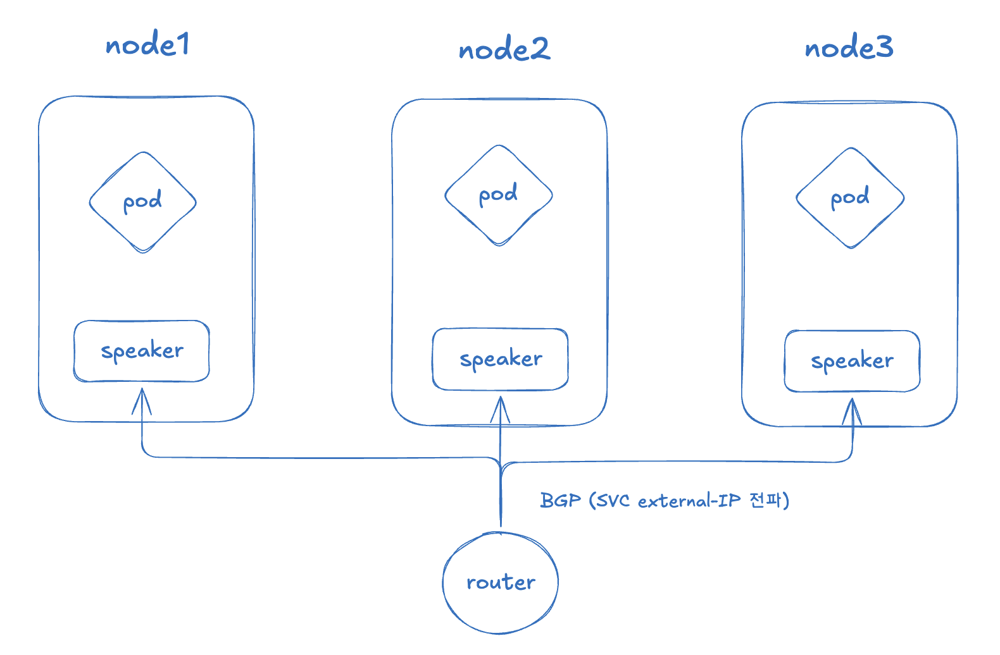

Unlike L2 mode, BGP mode does not let a single node monopolize the VIP. **Each node's Speaker establishes a BGP session with the router and advertises the VIP route directly.**

From the router's point of view, "the route to this VIP exists on node1, node2, and node3," so traffic can be spread across nodes with **ECMP** (Equal-Cost Multi-Path). It avoids the bottleneck of all traffic landing on one node in L2 mode, and node failures update routes relatively quickly through BGP session teardown.

| Aspect | L2 mode | BGP mode |
|----------|---------|---------|
| Setup complexity | Low | High (router configuration required) |
| Traffic distribution | Concentrated on the leader node | Evenly spread via ECMP |
| Failure recovery | ARP re-broadcast | Fast update via BGP session teardown |
| Network requirements | Same L2 domain | BGP-capable router |

> **Note**: because MetalLB speaks routing protocols, adopting it calls for a conversation with your network engineers beforehand. It also affects how quickly you can diagnose problems when they occur.

---

## 4. Istio Gateway: Evolving Into a Service Mesh

At this point the path that takes external traffic and delivers it to a service is complete. In practice, though, situations arise where this setup is not enough — and that is where the service mesh comes in.

### Why Move from nginx-ingress to Istio

The core reasons for moving an on-premises environment that had been running nginx-ingress over to Istio Gateway:

1. **ingress-NGINX reached end of life**: the community-maintained `kubernetes/ingress-nginx` was retired at the end of March 2026. The final release was on March 19, 2026, the repository has been archived read-only, and no bug fixes or security patches are produced from here on. (The separate F5-maintained `nginxinc/kubernetes-ingress` project is still maintained.)
2. **Kubernetes Gateway API support**: Istio supports the Kubernetes Gateway API, and the direction of travel toward it as the standard traffic management API is clear.
3. **Benefits of the service mesh**: rich extras such as traffic observability, security policy, and fine-grained routing.

### What Is a Service Mesh?

Istio is a **service mesh** platform. A service mesh is a dedicated layer that manages network communication between microservices at the infrastructure level. By placing a sidecar proxy (Envoy) next to each service, it delivers traffic control, security, and observability without modifying application code.

### The Limits of Ingress: Why Istio Gateway?

Let's look at a real on-premises situation as an example.

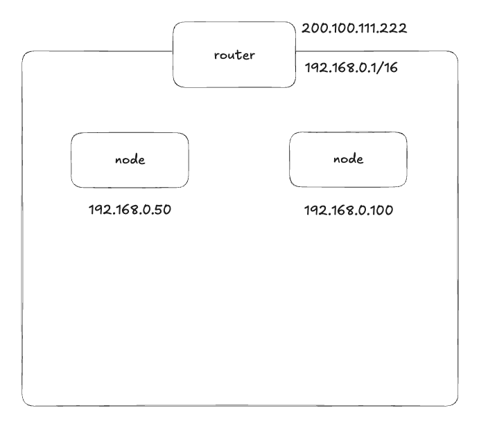

Building a Kubernetes cluster and adding nodes on the same network gives you this structure.

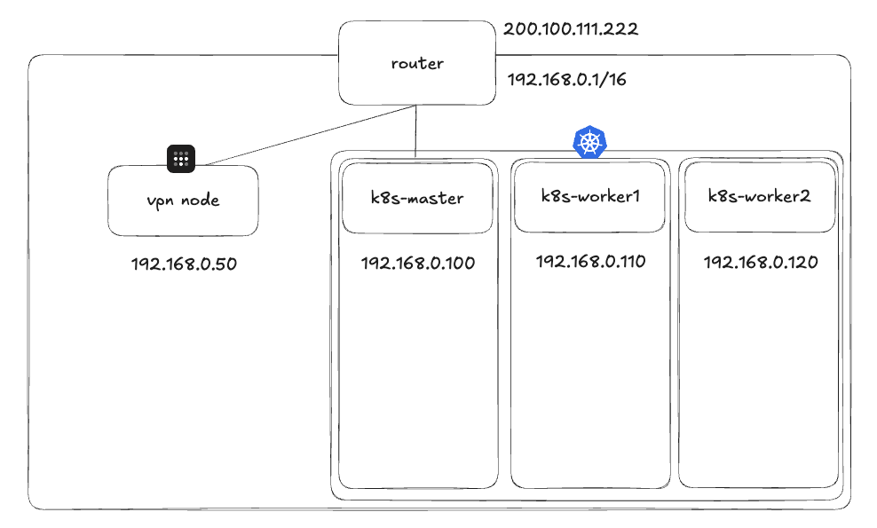

Nodes behind the router get IPs in the `192.168.0.0/16` range. In this situation the Pods inside the cluster have to be made reachable from outside, and even after MetalLB hands out an IP through a LoadBalancer-type Service, a problem remains.

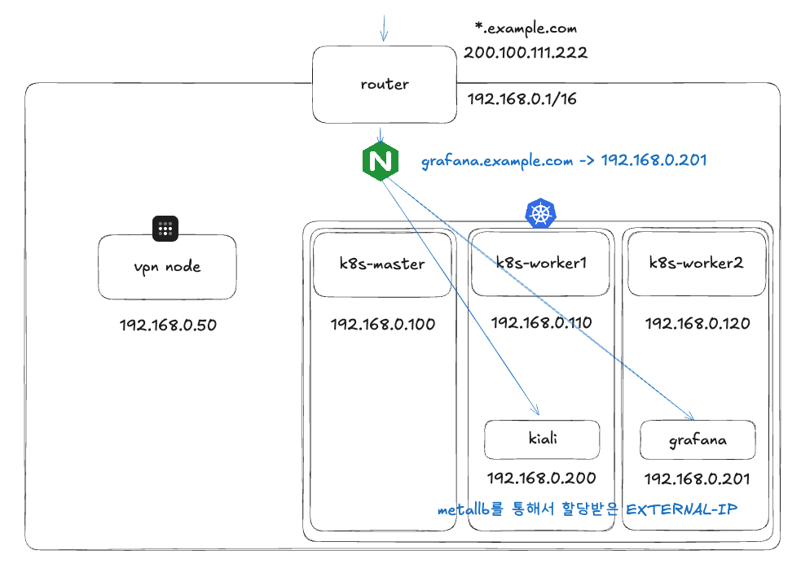

Suppose the Kiali and Grafana dashboards running on the worker nodes were assigned `192.168.0.200-201`. To get **subdomain-based L7 routing**, you still end up putting a separate proxy such as Nginx in front. That creates one more management point outside the cluster.

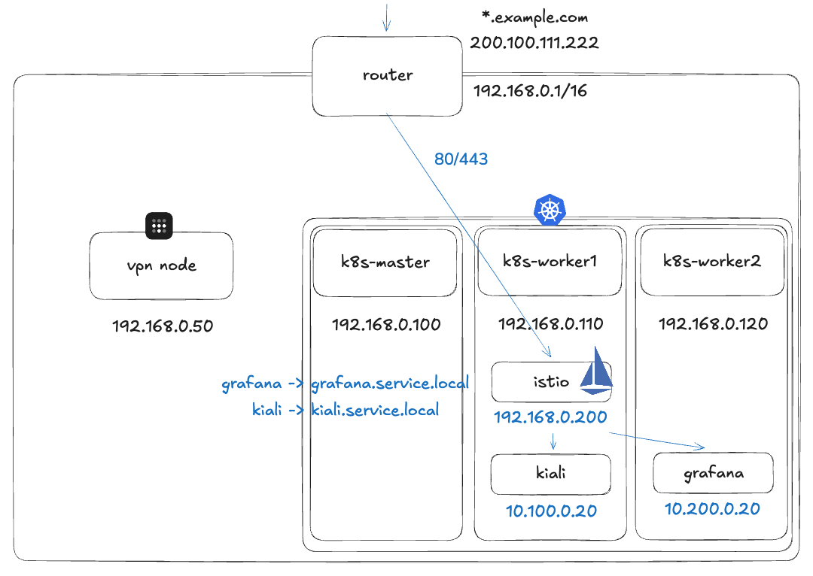

**With Istio Gateway**, every request on 80/443 is received by the Istio Gateway inside the cluster and routed internally to the right Pod by subdomain. There is no need for a complicated proxy sitting in front, and traffic observability comes with the mesh.

### The Old Structure vs. the Istio Structure

The familiar **Service + Ingress + ingress-nginx** combination maps onto the Istio-based structure like this.

| Old structure | Istio structure | Role |
|----------|-----------|------|
| Service | Service (unchanged) | Abstraction over Pod endpoints |
| Ingress | Gateway | Defines the entry point (port/protocol/TLS) |
| Ingress Controller (nginx) | Istio IngressGateway (Envoy) | Handles the actual traffic |
| Ingress rules | VirtualService | Defines routing rules |

### Gateway and VirtualService

An Istio Gateway is **"Envoy proxy configuration for receiving HTTP/TCP traffic at the edge of the mesh."** It declares which ports to open, which protocols to use, and how TLS/SNI should be handled.

#### The Gateway Resource

```yaml
apiVersion: networking.istio.io/v1beta1
kind: Gateway
metadata:
  name: demo-gateway
  namespace: istio-system
spec:
  selector:
    istio: ingressgateway   # which gateway (Envoy) workload this applies to
  servers:
  - port:
      number: 80
      name: http
      protocol: HTTP
    hosts:
    - "app.demo.local"      # matched on the Host header
```

This configuration makes Envoy create a **listener that accepts HTTP requests on port 80**. But it only opens the door for "receiving" — where the request goes next is decided by the VirtualService.

> **Important**: a Gateway is only Envoy proxy configuration (L7). Getting external traffic to actually reach the proxy Pod is your responsibility. On-premises, MetalLB is what takes on that role.

#### The VirtualService Resource

```yaml
apiVersion: networking.istio.io/v1beta1
kind: VirtualService
metadata:
  name: demo-vs
  namespace: demo
spec:
  hosts:
  - "app.demo.local"
  gateways:
  - istio-system/demo-gateway
  http:
  - match:
    - uri:
        prefix: /
    route:
    - destination:
        host: demo-app.demo.svc.cluster.local
        port:
          number: 8080
```

Requests arriving for `app.demo.local` get routed to port 8080 of the `demo-app` service.

#### HTTPS Redirect

The HTTP → HTTPS redirect used constantly in practice looks like this.

```yaml
apiVersion: networking.istio.io/v1beta1
kind: Gateway
metadata:
  name: demo-gateway
  namespace: istio-system
spec:
  selector:
    istio: ingressgateway
  servers:
  # 1) anything arriving on 80 is redirected to HTTPS
  - port:
      number: 80
      name: http
      protocol: HTTP
    hosts:
    - "app.demo.local"
    tls:
      httpsRedirect: true

  # 2) TLS terminates on 443, then routes as HTTP
  - port:
      number: 443
      name: https
      protocol: HTTPS
    hosts:
    - "app.demo.local"
    tls:
      mode: SIMPLE
      credentialName: app-demo-tls   # references a TLS Secret in the istio-system namespace
```

### Hands-On: Istio Gateway on Minikube

Here is a minikube-based walkthrough you can verify locally.

#### Step 1: Install and Configure MetalLB

```bash
kubectl apply -f https://raw.githubusercontent.com/metallb/metallb/v0.15.3/config/manifests/metallb-native.yaml
```

Configure MetalLB to match minikube's IP range (minikube usually uses `192.168.49.2`).

```yaml
apiVersion: metallb.io/v1beta1
kind: IPAddressPool
metadata:
  name: minikube-pool
  namespace: metallb-system
spec:
  addresses:
  - 192.168.49.100-192.168.49.120
---
apiVersion: metallb.io/v1beta1
kind: L2Advertisement
metadata:
  name: minikube-l2
  namespace: metallb-system
spec:
  ipAddressPools:
  - minikube-pool
```

#### Step 2: Install Istio

```bash
istioctl install -y
```

When installation finishes, the Istio logo (a ship) prints to the terminal.

#### Step 3: Deploy the Sample Apps

Create a namespace and enable istio-injection.

```bash
kubectl create ns demo
kubectl label ns demo istio-injection=enabled
```

Deploy the sample apps.

```bash
# httpbin
kubectl -n demo apply -f https://raw.githubusercontent.com/istio/istio/release-1.24/samples/httpbin/httpbin.yaml

# sleep (for testing from inside the cluster)
kubectl -n demo apply -f https://raw.githubusercontent.com/istio/istio/release-1.24/samples/sleep/sleep.yaml
```

Check that MetalLB assigned an EXTERNAL-IP to istio-ingressgateway.

```bash
$ kubectl -n istio-system get svc istio-ingressgateway -o wide
NAME                   TYPE           CLUSTER-IP       EXTERNAL-IP      PORT(S)                                      AGE
istio-ingressgateway   LoadBalancer   10.102.207.200   192.168.49.100   15021:30656/TCP,80:31952/TCP,443:31816/TCP   82m
```

#### Step 4: Apply the Gateway and VirtualService

Configure the Gateway.

```yaml
apiVersion: networking.istio.io/v1beta1
kind: Gateway
metadata:
  name: demo-gateway
  namespace: istio-system
spec:
  selector:
    istio: ingressgateway
  servers:
  - port:
      number: 80
      name: http
      protocol: HTTP
    hosts:
    - "httpbin.demo.local"
```

Configure the VirtualService.

```yaml
apiVersion: networking.istio.io/v1beta1
kind: VirtualService
metadata:
  name: httpbin-vs
  namespace: demo
spec:
  hosts:
  - "httpbin.demo.local"
  gateways:
  - istio-system/demo-gateway
  http:
  - match:
    - uri:
        prefix: /
    route:
    - destination:
        host: httpbin
        port:
          number: 8000
```

#### Step 5: Verify

On minikube, `minikube tunnel` opens the access path to LoadBalancer services.

```bash
minikube tunnel
```

```
$ minikube tunnel
  Tunnel successfully started
  NOTE: Please do not close this terminal as this process must stay alive...
  Starting tunnel for service istio-ingressgateway.
```

Verify the routing by specifying the Host header.

```bash
curl -H "Host: httpbin.demo.local" http://127.0.0.1/headers
```

To verify from inside the cluster instead, exec into the sleep Pod and test from there.

```bash
SLEEP_POD=$(kubectl -n demo get pod -l app=sleep -o jsonpath='{.items[0].metadata.name}')
kubectl -n demo exec -it $SLEEP_POD -c sleep -- \
  curl -H "Host: httpbin.demo.local" http://192.168.49.100/headers
```

When the request headers come back correctly, the Istio Gateway configuration is done.

---

## Closing Thoughts

Summarizing each layer covered here in one line:

| Step | Technology | Problem it solves |
|------|------|-------------|
| 1 | ClusterIP | Service-to-service communication inside the cluster |
| 2 | NodePort | External access (with port constraints) |
| 3 | Ingress + Controller | L7 routing, domain-based branching, TLS termination |
| 4 | MetalLB | LoadBalancer type on-premises |
| 5 | Istio Gateway | Service mesh, advanced traffic management, observability |

And in that final configuration, the full path a single request travels looks like this.

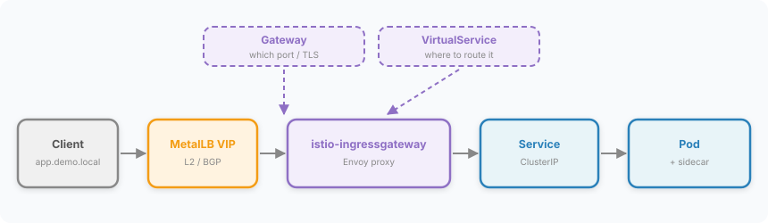

What became clear while writing this is that these five are not alternatives competing with each other. Using Istio Gateway does not make Service disappear, and if MetalLB does not claim a VIP, Envoy never even gets the chance to receive traffic. Remove one box from the diagram above and everything after it stops. A new layer does not hide the ones beneath it — it sits on top of them, which is why, when something breaks, asking "which box did it stop at?" is the fastest diagnosis available.

Equally, there is no need to pass through every stage. In the cloud MetalLB is unnecessary, and for a simple service Ingress alone is enough. Once you know **which limit each technology is an answer to**, you can decide whether to adopt it by asking whether that limit exists in your environment at all.

Next I want to write up **Gateway API**, the successor to Ingress. The retirement of ingress-NGINX made it the de facto migration path, and since Istio supports both its own Gateway resource and the Gateway API, which one to pick for a new build has become a genuine decision.

---

### References

- [Kubernetes Docs - Service](https://kubernetes.io/docs/concepts/services-networking/service/)
- [Kubernetes Docs - Ingress](https://kubernetes.io/docs/concepts/services-networking/ingress/)
- [MetalLB Docs - Installation](https://metallb.io/installation/)
- [MetalLB Docs - Configuration (Layer 2)](https://metallb.io/configuration/#layer-2-configuration)
- [Istio Docs - Gateway](https://istio.io/latest/docs/reference/config/networking/gateway/)
- [Istio Docs - Ingress Gateways](https://istio.io/latest/docs/tasks/traffic-management/ingress/ingress-control/)
- [Coursera - Ephemeral Ports](https://www.coursera.org/articles/ephemeral-ports)
- [Kubernetes Blog — Ingress NGINX: Statement from the Steering and Security Response Committees](https://www.kubernetes.io/blog/2026/01/29/ingress-nginx-statement/)
- [Kubernetes Docs - Ingress Controllers](https://kubernetes.io/docs/concepts/services-networking/ingress-controllers/)
