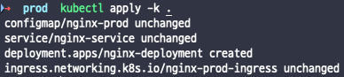
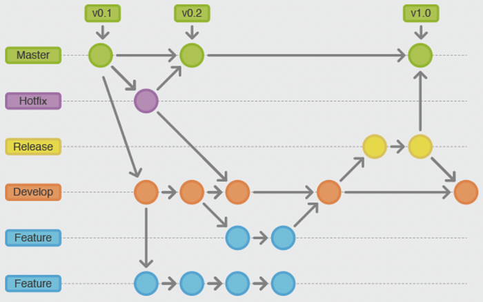
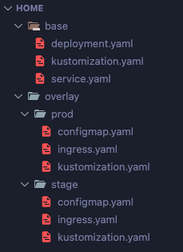
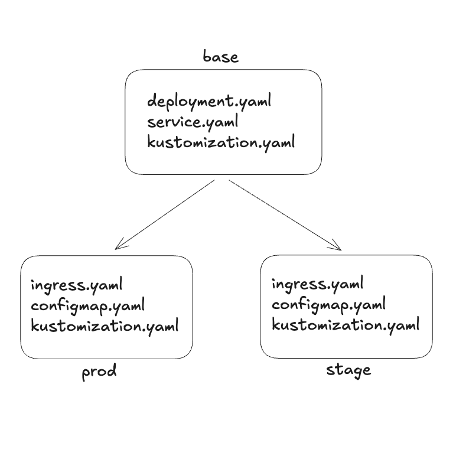
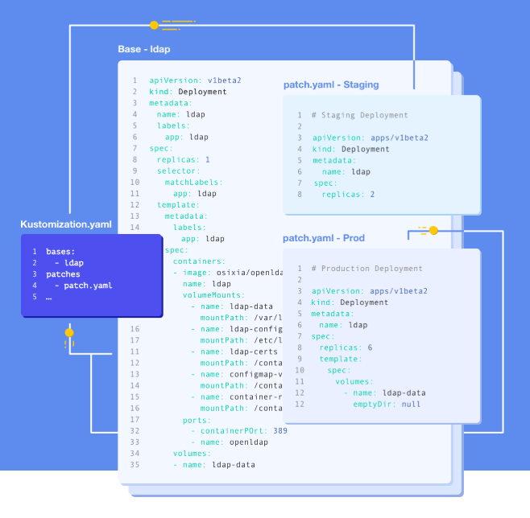
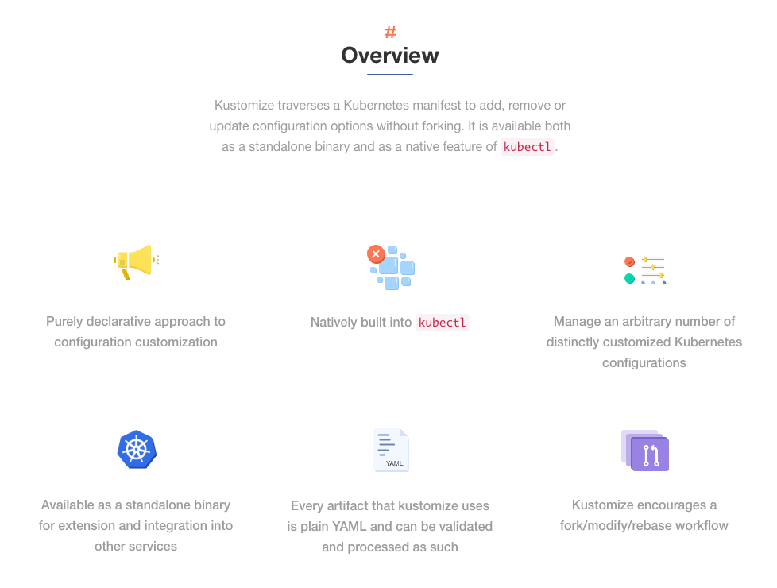
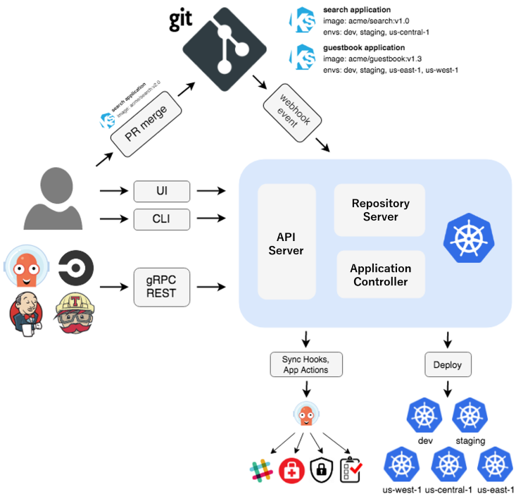

同じアプリケーションをdev、staging、prodにデプロイしていると、YAMLが環境の数だけ複製されていきます。中身のほとんどは同じで、replicasが一つ、ドメインが一つ、ConfigMapの値がいくつか違うだけなのに、その数行のためにファイル全体が三つに増えます。片方だけ直して他方を直し忘れる事故は、たいていこの地点で起こります。

**Kustomize** はこの問題を継承で解く道具です。Kubernetesのオブジェクトを思いどおりに変形できるようにする宣言型の設定管理ツールであり、共通のリソースをbaseに置き、環境ごとの差分だけをoverlayに宣言する構造が核心です。



Kustomizeは最初からkubectlの一部だったわけではありません。2018年5月にGoogleがSIG-CLIのサブプロジェクトとして公開した独立したCLIで、リポジトリも `kubernetes-sigs/kustomize` として別にありました。正確には外部ベンダーが作ったサードパーティというより、Kubernetesプロジェクトの中から生まれた独立したツールでしたが、いずれにせよ使うにはバイナリを別途インストールする必要があった点は同じです。

それが変わったのが **2019年3月のkubectl v1.14** です。`kustomize build` のフローがkubectlに統合されたことで `kubectl apply -k` の一行で使えるようになり、現在ではKubernetesの公式ドキュメントが宣言的な管理方法としてKustomizeを案内しています。別途インストールせずにすぐ使えるという点が、Helmと分かれる最初のポイントです。

ただし一つ知っておきたいことがあります。kubectlに内蔵されたバージョンと、独立したバイナリのバージョンが長いあいだ食い違っていました。

| kubectlのバージョン | 内蔵されているkustomize     |
| ------------------- | --------------------------- |
| v1.14 〜 v1.20      | v2.0.3（固定されたまま）    |
| v1.21以降           | v4.0.5から定期的に更新       |

kubectl v1.14に入ったのはkustomize v2.0.3で、このバージョンがkubectl v1.20まで2年近く固定されたままでした。kubectl v1.21になってようやくv4.0.5へ上がり、以降は定期的に更新されています。そのため古いクラスタのkubectlで新しい文法を使うと、ドキュメントどおりに動かないことがあります。後ほど扱う `patches` や `replicas` フィールドが代表例で、ドキュメントと挙動が違うときは `kubectl version` と `kustomize version` を先に見比べるのが近道です。

この記事では、宣言的管理という概念から出発してBase/Overlay構造とパッチ戦略、実際のプロジェクト構成、そしてHelmとの比較までを扱います。

---

## 1. 宣言的(Declarative) vs 命令的(Imperative)

Kustomizeを理解するには、Kubernetesがリソースを扱う二つの方式を区別するところから始める必要があります。リソースの管理方式は大きく **命令的な方式** と **宣言的な方式** に分かれます。

### 命令的(Imperative)な方式

命令的な方式は「何をどうしろ」と一つひとつ命令を出していく方式です。たとえば次のように個別のコマンドでリソースを直接操作します。

```bash
kubectl create deployment nginx --image=nginx
kubectl scale deployment nginx --replicas=3
kubectl expose deployment nginx --port=80
```

単純な作業には便利ですが、環境が複雑になるほどどのコマンドが実行されたのかを追いにくくなり、再現性も落ちます。何より、クラスタの現在の状態を説明する文書がどこにも残りません。

### 宣言的(Declarative)な方式

宣言的な方式は「最終的な状態はこうであるべきだ」をYAMLファイルに記述し、Kubernetesが現在の状態と比較して必要な変更だけを適用する方式です。

```bash
kubectl apply -f deployment.yaml
```

宣言的な方式の利点は次のとおりです。

- **冪等性**(Idempotency): 同じコマンドを何度実行しても結果が同じです。
- **バージョン管理**: YAMLファイルをGitで管理できるため、変更履歴を追跡できます。
- **自動的な収束**: 現在のクラスタの状態と宣言された状態が異なれば、差分だけが自動的に反映されます。

実務でKubernetesを扱うときは、おおむね命令的な方式より宣言的な方式が優勢です。複数人でクラスタを管理する状況では同僚が何を変えたのかを知る必要がありますが、変更がコードとして残っていなければ確認する手段がないからです。

Kustomizeはこの宣言的な方式をさらに強力にしてくれる道具です。`kubectl apply -k` でKustomizeが組み立てたリソースを適用すると、変更のないリソースは `unchanged` として、変更が必要なリソースだけが `created` または `configured` として処理されます。



上のスクリーンショットのように、すでに存在するリソースは `unchanged` と表示され、新しく追加されたものだけが `created` として生成されます。コマンドを何度実行しても結果が同じであること、これが宣言型の管理の核心です（これを冪等であると言います）。

---

## 2. Base/Overlay構造

宣言的管理が何かを整理したので、次はKustomizeがその上で何を足してくれるのかを見ていきます。

### なぜマルチ環境の管理が必要なのか

Kubernetesでサービスを運用していると、複数のステージにサーバーをデプロイする状況が出てきます。組織の規模やプロダクトの性格によって構成は変わりますが、一般的には次のように単純化できます。

```
Dev → Staging → Prod
```



上の図のように、Gitのブランチ戦略に沿ってデプロイ環境が決まるケースが多いです。masterブランチはProduction、releaseブランチはStaging、developブランチはDev環境に対応します。そして環境ごとに、URL、データベースの接続情報、コンピューティングリソースの割り当てといった設定が微妙に変わってきます。

この「わずかな違い」をどう宣言的に管理するか。これがKustomizeのBase/Overlay構造が解く問題です。

### Base/Overlayの考え方

Kustomizeの核心にあるのは **継承** です。基本となるリソース定義を `base` ディレクトリに置き、環境ごとの差分だけを `overlay` ディレクトリに定義します。



上のように `base` にはdeployment.yamlやservice.yamlといった共通リソースを置き、`overlay` 配下の各環境（prod、stage）にはその環境に固有のconfigmap.yamlやingress.yamlを配置します。

### Baseのkustomization.yaml

`base` ディレクトリの `kustomization.yaml` は共通リソースを登録します。

```yaml
apiVersion: kustomize.config.k8s.io/v1beta1
kind: Kustomization

resources:
  - deployment.yaml
  - service.yaml
```

### Overlayのkustomization.yaml

各環境の `kustomization.yaml` ではbaseを継承し、その環境のリソースを追加します。

```yaml
apiVersion: kustomize.config.k8s.io/v1beta1
kind: Kustomization

resources:
  - ../../base
  - configmap.yaml
  - ingress.server.yaml
```

`resources` フィールドに `../../base` を指定すると、baseのすべてのリソースを継承します。その上に、その環境だけに必要なConfigMapやIngressを追加で宣言していく形です。



まとめると、一つのbaseを複数のoverlayが共有する構造です。新しい環境が必要になれば、overlayの下にディレクトリを一つ増やして、変わるファイルをいくつか書くだけで済みます。環境が増えても共通部分は一か所にしか存在しません。

環境ごとに分かれるものは、だいたい決まっています。prodとstageで異なる環境変数を使うためConfigMapとSecretがoverlayに分離され、Ingressは `api.example.com` と `api.dev.example.com` のようにサブドメインを別々に割り当てるために分離されます。

さらに、baseのDeploymentでreplicasを2と定義していても、overlayとして作った別の環境（たとえばtest）ではPodが一つで足りるなら、継承した `kustomization.yaml` の側でreplicasを変更できます。

このとき、わざわざパッチファイルを作る必要すらありません。Kustomizeはよく使う変形を `kustomization.yaml` のフィールドとして内蔵しているので、継承の宣言のすぐ横に数行書けば終わります。

```yaml
# overlays/test/kustomization.yaml
apiVersion: kustomize.config.k8s.io/v1beta1
kind: Kustomization

resources:
  - ../../base
  - configmap.yaml
  - ingress.yaml

namespace: test
namePrefix: test-

replicas:
  - name: nginx-deployment
    count: 1

images:
  - name: nginx
    newTag: 1.25-alpine
```

それぞれのフィールドの役割は次のとおりです。

- `namespace`: このoverlayが生成するすべてのリソースを `test` ネームスペースへ送ります。
- `namePrefix`: すべてのリソース名の先頭に `test-` を付けます。名前を変えるだけでなく、その名前を参照している箇所（Deploymentが参照するConfigMap名など）まで一緒に更新してくれます。
- `replicas`: baseの `nginx-deployment` を見つけて、レプリカ数だけを1に変えます。baseの残りの定義はそのままです。
- `images`: コンテナイメージのタグを差し替えます。

baseを一文字も触っておらず、overlayにも新しいYAMLファイルが増えていないという点が核心です。この程度の変形はすべて `kustomization.yaml` の中で完結し、ここで表現できないものだけが次に見るパッチへ回ります。

### パッチ戦略

リソースを新しく追加するのではなく、baseにすでにある値を変えなければならないときはパッチを使います。Kustomizeは二つのパッチ戦略を提供します。

#### Strategic Merge Patch

既存リソースの特定のフィールドだけをオーバーライドする方式です。Kubernetesオブジェクトの構造を理解した上でマージするため、変えたいフィールドだけ書いておけば、残りはbaseの値がそのまま維持されます。



上の図のように、baseで定義したDeploymentのreplicasを環境ごとに変えられます。Stagingでは `replicas: 2`、Productionでは `replicas: 6` というように、同じbaseを置いたまま差分だけをパッチファイルに記述します。

```yaml
# overlay/prod/increase-replicas.yaml
apiVersion: apps/v1
kind: Deployment
metadata:
  name: nginx-deployment
spec:
  replicas: 6
```

このパッチはbaseのDeploymentで `replicas` の値だけを6に変更し、残りのフィールドには手を触れません。どのリソースにパッチを当てるかは `metadata.name` と `kind` で識別されます。

#### JSON Patch

より細かい制御が必要なときに使います。JSON Patch(RFC 6902)の形式で、特定のパスの値を追加・削除・置換できます。配列の特定のインデックスを扱ったり、フィールドを削除したりといった、Strategic Merge Patchでは表現しにくい作業に向いています。

```yaml
# overlay/prod/kustomization.yaml
apiVersion: kustomize.config.k8s.io/v1beta1
kind: Kustomization

resources:
  - ../../base

patches:
  - target:
      kind: Deployment
      name: nginx-deployment
    patch: |-
      - op: replace
        path: /spec/replicas
        value: 6
      - op: add
        path: /metadata/labels/environment
        value: production
```

---

## 3. 実践プロジェクトの例

考え方を見たので、実際にディレクトリを作ってデプロイしてみます。

### シナリオの構成

nginxイメージをDeploymentとしてデプロイするシナリオを組んでみましょう。環境ごとの差分は次のとおりです。

| 設定項目       | Staging                 | Production             |
| -------------- | ----------------------- | ---------------------- |
| サブドメイン   | `stage.localhost`       | `prod.localhost`       |
| ConfigMap      | `this-is-stage-overlay` | `this-is-prod-overlay` |
| Ingressの名前  | `nginx-stage-ingress`   | `nginx-prod-ingress`   |

### 実行方法

Kustomizeで構成した環境をデプロイするには、その環境のkustomization.yamlがあるディレクトリで次のコマンドを実行します。

```bash
kubectl apply -k .
```

デプロイ前にどのリソースが作られるかを先に確認したいときは `kubectl kustomize` を使います。実際にクラスタへ適用せず組み立て結果だけを出力してくれるので、overlayを直すたびにこのコマンドで確認する習慣をつけておくとよいです。

```bash
kubectl kustomize .
```

上のコマンドの出力結果は次のようになります。

```yaml
apiVersion: v1
data:
  key: this-is-prod-overlay
kind: ConfigMap
metadata:
  name: nginx-prod
---
apiVersion: v1
kind: Service
metadata:
  name: nginx-service
spec:
  ports:
    - port: 80
      targetPort: 80
  selector:
    app: nginx
---
apiVersion: apps/v1
kind: Deployment
metadata:
  name: nginx-deployment
spec:
  selector:
    matchLabels:
      app: nginx-deployment
  template:
    metadata:
      labels:
        app: nginx-deployment
    spec:
      containers:
        - image: nginx
          name: nginx
          ports:
            - containerPort: 80
          resources:
            limits:
              cpu: 500m
              memory: 128Mi
---
apiVersion: networking.k8s.io/v1
kind: Ingress
metadata:
  labels:
    name: nginx
  name: nginx-prod-ingress
spec:
  rules:
    - host: prod.localhost
      http:
        paths:
          - backend:
              service:
                name: nginx-nginx
                port:
                  number: 80
            path: /
            pathType: Prefix
```

baseで定義したDeploymentとServiceがそのまま維持されつつ、prod overlayで追加したConfigMapとIngressが一緒に出力されているのが確認できます。

### よく使うパターン

実務で繰り返し使うことになるパターンをまとめると次のとおりです。

**共通ラベルの追加**

```yaml
# kustomization.yaml
apiVersion: kustomize.config.k8s.io/v1beta1
kind: Kustomization

labels:
  - pairs:
      app: my-app
      team: platform
    includeSelectors: false

resources:
  - deployment.yaml
  - service.yaml
```

古いドキュメントでよく見かける `commonLabels` は、Kustomize v5で非推奨になりました。`commonLabels` はラベルをDeploymentのセレクタにまで自動的に押し込んでいたため、すでにデプロイ済みのワークロードに適用するとセレクタが不変フィールドであることを理由にデプロイが失敗する問題がありました。現在は上のように `labels` フィールドを使い、セレクタまで変えるかどうかを `includeSelectors` で明示します。

**ネームスペースの一括指定**

```yaml
# overlay/prod/kustomization.yaml
apiVersion: kustomize.config.k8s.io/v1beta1
kind: Kustomization

namespace: production

resources:
  - ../../base
```

**イメージタグのオーバーライド**

```yaml
# overlay/prod/kustomization.yaml
apiVersion: kustomize.config.k8s.io/v1beta1
kind: Kustomization

resources:
  - ../../base

images:
  - name: nginx
    newTag: 1.25-alpine
```

イメージタグのオーバーライドは、CIパイプラインが触る場所でもあります。ビルドが終わったあとに `kustomize edit set image` でこのフィールドだけ更新してコミットすれば、デプロイはそのコミットに従います。

### アンチパターン

逆に避けるべきパターンもあります。

- **baseに環境ごとの設定を入れる**: baseにはすべての環境に共通して適用されるリソースだけを置くべきです。特定の環境にしか必要のない設定がbaseへ上がると、overlayの意味が薄れます。
- **過度なパッチの入れ子**: パッチが3段以上入れ子になると、最終結果を予測しづらくなります。できればbase → overlayの2段に保つのがよいです。
- **overlay間でのリソース共有**: 各overlayは独立しているべきです。overlay同士がリソースを参照し始めると依存関係が生まれ、管理が複雑になります。

三つとも「どこを見ればこの環境の最終状態が分かるのか」という問いへの答えを曇らせる、という共通点があります。

---

## 4. Kustomize vs Helm

Kustomizeの話をすると必ずついてくるのがHelmとの比較です。二つは目的が重なるように見えますが、アプローチが違います。

### Helm Chartの登場と限界

**Helm** はKubernetesのパッケージマネージャの役割を担うツールで、`apt` や `pip` のようにあらかじめ構成されたプリセット(Chart)を取ってきてアプリケーションをデプロイできるようにしてくれます。

ただ、Kustomizeがkubectlに統合される前、Helm v2の時代にはマルチステージのデプロイが厄介でした。**Tiller** というサーバーコンポーネントをクラスタ内に立てる必要があり、ChartやRelease、RevisionといったHelm固有の概念を先に理解しなければなりませんでした。

こうした背景の中でKustomizeが登場しました。純粋なYAMLだけで動き、別途のサーバーコンポーネントなしに設定を管理できたため素早く定着し、最終的にKubernetesへ公式に統合されました。

### 比較表

| 基準              | Kustomize             | Helm                     |
| ----------------- | --------------------- | ------------------------ |
| アプローチ        | 純粋なYAMLのオーバーレイ | Goテンプレートベース    |
| 学習コスト        | 低い                  | 中〜高                   |
| パッケージ配布    | 非対応                | Chartリポジトリに対応    |
| Kubernetes統合    | kubectlに内蔵         | 別途CLIのインストールが必要 |
| 複雑なロジック    | 限定的（パッチベース） | 条件分岐・ループに対応   |
| テンプレートの再利用 | base/overlayの継承   | チャートの依存関係管理   |
| ロールバック      | Gitベースの手動作業    | `helm rollback` を内蔵   |

### どちらをいつ選ぶか

**Kustomizeが向いている場合**

- チーム内部のアプリケーションの環境別設定の管理
- 単純な設定の違いしかないマルチステージのデプロイ
- GitOpsのワークフローで宣言的な管理が必要な場合
- 純粋なYAMLを保ちたい場合

**Helmが向いている場合**

- 外部配布用のパッケージ作成（オープンソースプロジェクトなど）
- 複雑な条件分岐が必要な設定の管理
- Chartリポジトリを通じたバージョン管理が必要な場合
- ロールバックが頻繁に必要な場合

### 併用できるのか

二つは排他的ではありません。実務では、サードパーティのアプリケーション（Prometheus、Nginx Ingress Controllerなど）はHelmで入れ、チーム内部のアプリケーションの環境別設定はKustomizeで管理する組み合わせがよくあります。ArgoCDのようなGitOpsツールはHelm ChartとKustomizeの両方をサポートするので、リソースの性格に応じて使い分ければ大丈夫です。

---

## 5. GitOpsとの相乗効果

ここまでがKustomize自体の話だとすれば、このツールが実際に力を発揮する場所はGitOpsです。

[GitOps]()は、Gitを **信頼できる唯一の情報源**(Single Source of Truth)としてインフラを管理する方法論です。すべてのインフラ設定がGitリポジトリに宣言的に記述されれば、変更履歴の追跡もロールバックもGitを通じて自然に行われます。これを実践するにはシステム全体が宣言的に記述されている必要があり、Kustomizeがまさにその役割を担います。



代表的なGitOpsツールである **ArgoCD** は、Gitリポジトリを定期的に監視して変更を検知し、変わった内容を自動でクラスタへ反映します。Webhookによるトリガー方式もサポートしています。



Kustomizeは別途のサーバーコンポーネントを持たない独立した構造なので、ArgoCDやFluxCDのようなツールと滑らかに連携します。結果として、コミット一つでインフラの変更が反映されるパイプラインができあがります。ただしこの構造ではすべての設定がGitに平文で載ることになるので、パスワードやトークンをどう扱うかは [GitOpsでSecretを扱う方法]() で別途まとめています。

---

## おわりに

KustomizeはKubernetesの宣言的な管理の哲学をそのまま受け継いだツールです。Base/Overlay構造で環境ごとの差分を整理でき、kubectlに内蔵されているので別途インストールせずにすぐ使えます。

実際に使ってみて最も強く感じたのは、Kustomizeの本当の価値がYAMLの重複を減らすことにはない、という点です。重複が減るのは結果にすぎず、核心は **環境どうしの差分がファイル一つに現れる** ことにあります。overlayディレクトリを開くだけで、この環境が他の環境と何が違うのかが一目で読み取れます。三つに複製されたYAMLを前にして「prodにしかない設定は何だったか」を確認するためにファイル全体を比較していた頃と比べると、こちらのほうがはるかに速く答えをくれます。逆に、overlayが肥大化しているなら、それは環境の構成そのものを見直すべきだというサインでもあります。

次は、環境がさらに増えたときにoverlayを自動で生成するArgoCDのApplicationSetのような仕組みを整理してみたいと思っています。環境が三つ四つのうちはディレクトリを手でコピーしても構いませんが、顧客ごとにクラスタが分かれる状況では、そのコピー自体がまた重複になってしまうからです。

---

### References

- [Kustomize公式サイト](https://kustomize.io/)
- [Kubernetes Blog — Introducing kustomize (2018-05-29)](https://kubernetes.io/blog/2018/05/29/introducing-kustomize-template-free-configuration-customization-for-kubernetes/)
- [kubernetes-sigs/kustomize — kubectl内蔵バージョンの対応表](https://github.com/kubernetes-sigs/kustomize)
- [Kubernetes公式ドキュメント — Kustomizeを用いた宣言型管理](https://kubernetes.io/ja/docs/tasks/manage-kubernetes-objects/kustomization/)
- [SIG CLI — Labels and Annotations](https://kubectl.docs.kubernetes.io/references/kustomize/kustomization/labels/)
- [ArgoCD公式ドキュメント](https://argo-cd.readthedocs.io/)
