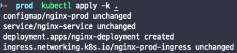
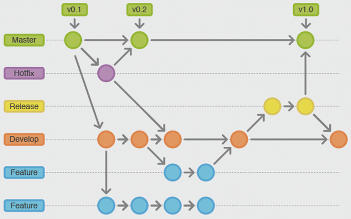
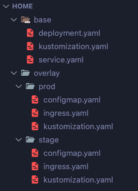
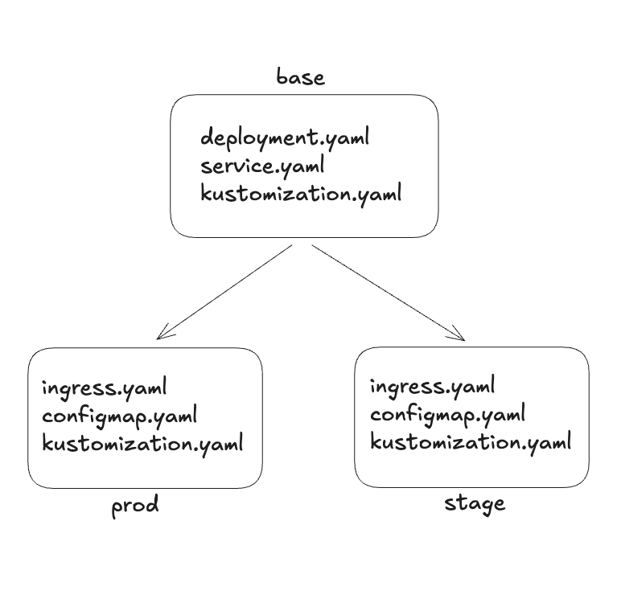
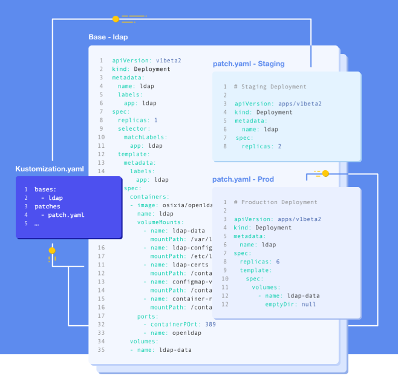
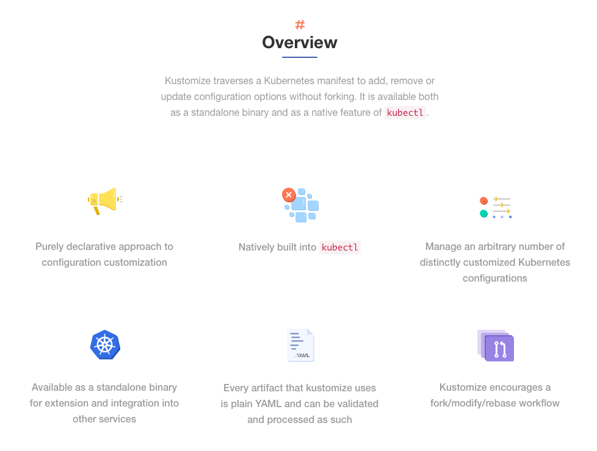
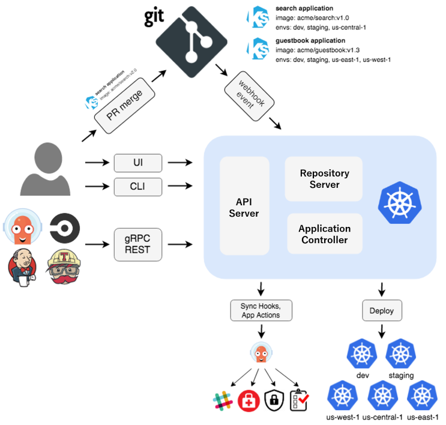

**Kustomize**는 쿠버네티스 오브젝트를 사용자가 원하는 대로 변경할 수 있게 도와주는 선언형 설정 관리 도구이다. 쿠버네티스 v1.14 이후 `kubectl`에 공식 통합되었으며, Base/Overlay 구조를 통해 dev/staging/prod 등 다양한 환경을 효율적으로 관리할 수 있다는 것이 가장 큰 특징이다.

이 글에서는 Kustomize의 핵심 개념인 선언적 관리 방식부터 실전 프로젝트 구성, 그리고 Helm과의 비교까지 다루어 본다.

---

## 1. 선언적(Declarative) vs 명령적(Imperative)

쿠버네티스에서 리소스를 관리하는 방식은 크게 **명령적 방식**과 **선언적 방식** 두 가지로 나뉜다.

### 명령적 방식

명령적 방식은 "무엇을 어떻게 해라"고 하나하나 명령을 내리는 방식이다. 예를 들어 다음과 같이 개별 명령어로 리소스를 직접 조작한다.

```bash
kubectl create deployment nginx --image=nginx
kubectl scale deployment nginx --replicas=3
kubectl expose deployment nginx --port=80
```

이 방식은 간단한 작업에는 편리하지만, 환경이 복잡해질수록 어떤 명령이 실행되었는지 추적하기 어렵고 재현성이 떨어진다.

### 선언적 방식

선언적 방식은 "최종 상태가 이것이어야 한다"를 YAML 파일로 기술하고, 쿠버네티스가 현재 상태와 비교하여 필요한 변경만 적용하는 방식이다.

```bash
kubectl apply -f deployment.yaml
```

선언적 방식의 핵심 장점은 다음과 같다.

- **멱등성(Idempotency)**: 같은 명령을 여러 번 실행해도 결과가 동일하다.
- **버전 관리**: YAML 파일을 Git으로 관리할 수 있어 변경 이력 추적이 가능하다.
- **자동 복구**: 현재 클러스터 상태와 선언된 상태가 다르면 변경된 부분만 자동으로 반영된다.

Kustomize는 바로 이 선언적 방식을 더욱 강력하게 만들어주는 도구이다. 실제로 `kubectl apply -k` 명령어를 통해 Kustomize로 선언된 리소스를 적용하면, 변경 사항이 없는 리소스는 `unchanged`로, 변경이 필요한 리소스만 `created` 또는 `configured`로 처리된다.



위 스크린샷에서 볼 수 있듯이, 이미 존재하는 리소스는 `unchanged`로 표시되고, 새로 추가된 리소스만 `created`로 생성된다. 이것이 선언형 관리의 핵심이다.

---

## 2. Base/Overlay 구조

### 왜 멀티 환경 관리가 필요한가

쿠버네티스를 통해 서비스를 운영하다 보면, 여러 스테이지에 서버를 배포해야 하는 상황이 생긴다. 조직의 규모와 제품의 특성에 따라 배포 환경 구성은 다르지만, 일반적으로는 다음과 같이 단순화할 수 있다.

```
Dev -> Staging -> Prod
```



위 그림처럼 Git 브랜치 전략에 따라 배포 환경이 결정되는 경우가 많다. Master 브랜치는 Production, Release 브랜치는 Staging, Develop 브랜치는 Dev 환경에 매핑된다. 각 환경마다 URL, 데이터베이스 연결 정보, 컴퓨팅 리소스 할당 등 설정이 미묘하게 달라지게 된다.

이러한 "약간의 차이"를 어떻게 선언적으로 관리할 수 있을까? 이것이 바로 Kustomize의 Base/Overlay 구조가 해결하는 문제이다.

### Base/Overlay 개념

Kustomize의 핵심 아이디어는 **상속**이다. 기본이 되는 리소스 정의를 `base` 디렉토리에 두고, 환경별 차이점을 `overlay` 디렉토리에 정의한다.

<!-- TODO: 다이어그램 필요 - base/overlay 디렉토리 트리 구조 -->



위와 같이 `base`에는 deployment.yaml, service.yaml 등 공통 리소스를, `overlay` 아래 각 환경(prod, stage)에는 해당 환경에 특화된 configmap.yaml, ingress.yaml 등을 배치한다.

### Base의 kustomization.yaml

`base` 디렉토리의 `kustomization.yaml`은 공통 리소스들을 등록한다.

```yaml
apiVersion: kustomize.config.k8s.io/v1beta1
kind: Kustomization

resources:
- deployment.yaml
- service.yaml
```

### Overlay의 kustomization.yaml

각 환경의 `kustomization.yaml`에서는 base를 상속받고, 환경별 리소스를 추가한다.

```yaml
apiVersion: kustomize.config.k8s.io/v1beta1
kind: Kustomization

resources:
- ../../base
- configmap.yaml
- ingress.server.yaml
```

`resources` 필드에 `../../base`를 지정하면, base의 모든 리소스를 상속받게 된다. 그 위에 해당 환경에만 필요한 configmap이나 ingress를 추가로 선언한다.

### 상속 구조 다이어그램



위 다이어그램에서 볼 수 있듯이, 하나의 base를 여러 overlay가 공유하는 구조이다. 새로운 환경(예: dev)이 필요하면, overlay 아래에 디렉토리를 하나 더 추가하고 몇 가지 설정 파일만 작성하면 된다.

### 패치 전략

Kustomize는 기존 리소스를 수정하기 위해 두 가지 주요 패치 전략을 제공한다.

#### Strategic Merge Patch

기존 리소스의 특정 필드만 오버라이드하는 방식이다. 쿠버네티스 오브젝트의 구조를 이해하고 지능적으로 병합한다.



위 그림처럼, base에 정의된 Deployment의 replicas 같은 필드를 환경별로 다르게 지정할 수 있다. Staging에서는 `replicas: 2`, Production에서는 `replicas: 6`과 같이 동일한 base를 기반으로 환경별 차이점만 패치 파일에 기술한다.

```yaml
# overlay/prod/increase-replicas.yaml
apiVersion: apps/v1
kind: Deployment
metadata:
  name: nginx-deployment
spec:
  replicas: 6
```

이 패치는 base의 Deployment에서 `replicas` 값만 6으로 변경하고, 나머지 필드는 그대로 유지한다.

#### JSON Patch

보다 세밀한 제어가 필요할 때 사용한다. JSON Patch(RFC 6902) 형식을 통해 특정 경로의 값을 추가, 삭제, 교체할 수 있다.

```yaml
# overlay/prod/kustomization.yaml
apiVersion: kustomize.config.k8s.io/v1beta1
kind: Kustomization

resources:
- ../../base

patches:
- target:
    kind: Deployment
    name: nginx-deployment
  patch: |-
    - op: replace
      path: /spec/replicas
      value: 6
    - op: add
      path: /metadata/labels/environment
      value: production
```

---

## 3. 실전 프로젝트 예시

### 시나리오 구성

실전 프로젝트 예시로, nginx 이미지를 Deployment로 배포하는 시나리오를 구성해 보자. 환경별 차이점은 다음과 같다.

| 설정 항목 | Staging | Production |
|-----------|---------|------------|
| 서브도메인 | `stage.localhost` | `prod.localhost` |
| ConfigMap | `this-is-stage-overlay` | `this-is-prod-overlay` |
| Ingress 이름 | `nginx-stage-ingress` | `nginx-prod-ingress` |

### 실행 방법

Kustomize로 구성된 환경을 배포하려면, 해당 환경의 kustomization.yaml이 있는 디렉토리에서 다음 명령을 실행한다.

```bash
kubectl apply -k .
```

배포 전에 어떤 리소스가 생성될지 미리 확인하려면 `kubectl kustomize` 명령을 사용한다.

```bash
kubectl kustomize .
```

위 명령의 출력 결과 예시는 다음과 같다.

```yaml
apiVersion: v1
data:
  key: this-is-prod-overlay
kind: ConfigMap
metadata:
  name: nginx-prod
---
apiVersion: v1
kind: Service
metadata:
  name: nginx-service
spec:
  ports:
  - port: 80
    targetPort: 80
  selector:
    app: nginx
---
apiVersion: apps/v1
kind: Deployment
metadata:
  name: nginx-deployment
spec:
  selector:
    matchLabels:
      app: nginx-deployment
  template:
    metadata:
      labels:
        app: nginx-deployment
    spec:
      containers:
      - image: nginx
        name: nginx
        ports:
        - containerPort: 80
        resources:
          limits:
            cpu: 500m
            memory: 128Mi
---
apiVersion: networking.k8s.io/v1
kind: Ingress
metadata:
  labels:
    name: nginx
  name: nginx-prod-ingress
spec:
  rules:
  - host: prod.localhost
    http:
      paths:
      - backend:
          service:
            name: nginx-nginx
            port:
              number: 80
        path: /
        pathType: Prefix
```

base에서 정의한 Deployment와 Service는 그대로 유지되면서, prod overlay에서 추가한 ConfigMap과 Ingress가 함께 출력되는 것을 확인할 수 있다.

### 일반적인 패턴

실무에서 자주 사용되는 Kustomize 패턴들을 정리하면 다음과 같다.

**공통 레이블/어노테이션 추가**

```yaml
# kustomization.yaml
apiVersion: kustomize.config.k8s.io/v1beta1
kind: Kustomization

commonLabels:
  app: my-app
  team: platform

resources:
- deployment.yaml
- service.yaml
```

**네임스페이스 일괄 지정**

```yaml
# overlay/prod/kustomization.yaml
apiVersion: kustomize.config.k8s.io/v1beta1
kind: Kustomization

namespace: production

resources:
- ../../base
```

**이미지 태그 오버라이드**

```yaml
# overlay/prod/kustomization.yaml
apiVersion: kustomize.config.k8s.io/v1beta1
kind: Kustomization

resources:
- ../../base

images:
- name: nginx
  newTag: 1.25-alpine
```

### 안티패턴

Kustomize를 사용할 때 피해야 할 패턴들도 있다.

- **base에 환경별 설정 포함**: base에는 모든 환경에 공통으로 적용되는 리소스만 두어야 한다. 특정 환경에만 필요한 설정이 base에 들어가면 overlay의 의미가 퇴색된다.
- **과도한 패치 중첩**: 패치가 3단계 이상 중첩되면 최종 결과를 예측하기 어려워진다. 가능하면 base -> overlay 2단계로 유지하는 것이 좋다.
- **overlay 간 리소스 공유**: 각 overlay는 독립적이어야 한다. overlay 간에 리소스를 참조하면 의존성이 생겨 관리가 복잡해진다.

---

## 4. Kustomize vs Helm

### Helm Chart의 등장과 한계

**Helm**은 쿠버네티스의 패키지 매니저 역할을 하는 도구로, `apt`나 `pip`처럼 사전에 구성된 프리셋(Chart)을 가져와 애플리케이션을 배포할 수 있게 도와준다. Helm Chart를 통해 다양한 오브젝트를 YAML 파일로 배포할 수 있었다.

하지만 Kustomize가 kubectl에 통합되기 전, Helm v2 시절에는 멀티 스테이지 배포가 매우 어려웠다. **Tiller**라는 서버 컴포넌트가 클러스터 내에 필요했고, Chart, Release, Revision 같은 Helm 고유의 개념들을 이해해야 하는 등 높은 러닝 커브가 존재했다.

이런 배경에서 Kustomize가 등장했다. 순수 YAML만으로 동작하고, 별도의 서버 컴포넌트 없이 독립형 구조로 설정을 관리할 수 있었기 때문에 빠르게 인기를 얻었고, 결국 쿠버네티스에 공식 통합되었다.

### 비교표

| 기준 | Kustomize | Helm |
|------|-----------|------|
| 접근 방식 | 순수 YAML 오버레이 | Go 템플릿 기반 |
| 러닝 커브 | 낮음 | 중간~높음 |
| 패키지 배포 | 미지원 | Chart 레포지토리 지원 |
| 쿠버네티스 통합 | kubectl 내장 | 별도 CLI 설치 필요 |
| 복잡한 로직 | 제한적 (패치 기반) | 조건문, 반복문 지원 |
| 템플릿 재사용 | base/overlay 상속 | 차트 의존성 관리 |
| 롤백 | Git 기반 수동 롤백 | `helm rollback` 내장 |

### 언제 어떤 도구를 선택할 것인가

**Kustomize가 적합한 경우**:
- 팀 내부 애플리케이션의 환경별 설정 관리
- 단순한 설정 차이만 있는 멀티 스테이지 배포
- GitOps 워크플로우에서 선언적 관리가 필요한 경우
- 순수 YAML을 유지하고 싶은 경우

**Helm이 적합한 경우**:
- 외부 배포용 패키지 작성 (오픈소스 프로젝트 등)
- 복잡한 조건 분기가 필요한 설정 관리
- Chart 레포지토리를 통한 버전 관리가 필요한 경우
- 롤백 기능이 자주 필요한 경우

### 함께 사용할 수 있는가

두 도구는 상호 배타적이지 않다. 실무에서는 Helm으로 서드파티 애플리케이션(Prometheus, Nginx Ingress Controller 등)을 설치하고, Kustomize로 팀 내부 애플리케이션의 환경별 설정을 관리하는 조합이 흔하다. 또한 ArgoCD 같은 GitOps 도구는 Helm Chart와 Kustomize를 모두 지원하므로, 프로젝트 특성에 따라 유연하게 선택할 수 있다.

---

## GitOps와의 시너지

Kustomize의 선언적 관리 방식은 **GitOps**와 결합될 때 진가를 발휘한다. GitOps는 Git을 **단일 진실 공급원(Single Source of Truth)**으로 삼아 인프라를 관리하는 방법론이다.

모든 인프라 설정이 Git 레포지토리에 선언적으로 기술되면, 변경 이력 추적과 롤백이 Git을 통해 자연스럽게 이루어진다. 이러한 GitOps를 실천하기 위해서는 전체 시스템이 선언적으로 기술되어야 하는데, Kustomize가 바로 이 역할을 한다.



대표적인 GitOps 도구인 **ArgoCD**는 주기적으로 Git 저장소를 감시하면서 변동 사항을 감지하고, 변경된 코드를 자동으로 클러스터에 반영한다. Webhook을 통한 트리거 방식도 지원한다.



Kustomize의 독립형 구조 덕분에 ArgoCD, FluxCD 같은 GitOps 도구와 매끄럽게 연동되며, 이를 통해 코드 커밋만으로 인프라 변경이 자동 반영되는 완전한 GitOps 파이프라인을 구축할 수 있다.

---

## 마치며

Kustomize는 쿠버네티스의 선언적 관리 철학을 충실히 반영한 도구이다. Base/Overlay 구조를 통해 환경별 설정 차이를 깔끔하게 관리할 수 있으며, kubectl에 내장되어 별도의 설치 없이 바로 사용할 수 있다는 점도 큰 장점이다.

특히 GitOps 환경에서 ArgoCD나 FluxCD와 결합하면, 코드 변경만으로 인프라가 자동 반영되는 강력한 배포 파이프라인을 구축할 수 있다. 단일 진실 공급원(SSOT)을 Git으로 유지하면서 선언적으로 인프라를 관리하는 것이 현대 쿠버네티스 운영의 핵심이며, Kustomize는 이 과정에서 없어서는 안 될 도구이다.

### 참고 자료

- [Kustomize 공식 홈페이지](https://kustomize.io/)
- [Kubernetes 공식 문서 - Kustomize를 이용한 선언형 관리](https://kubernetes.io/ko/docs/tasks/manage-kubernetes-objects/kustomization/)
- [ArgoCD 공식 문서](https://argo-cd.readthedocs.io/)
