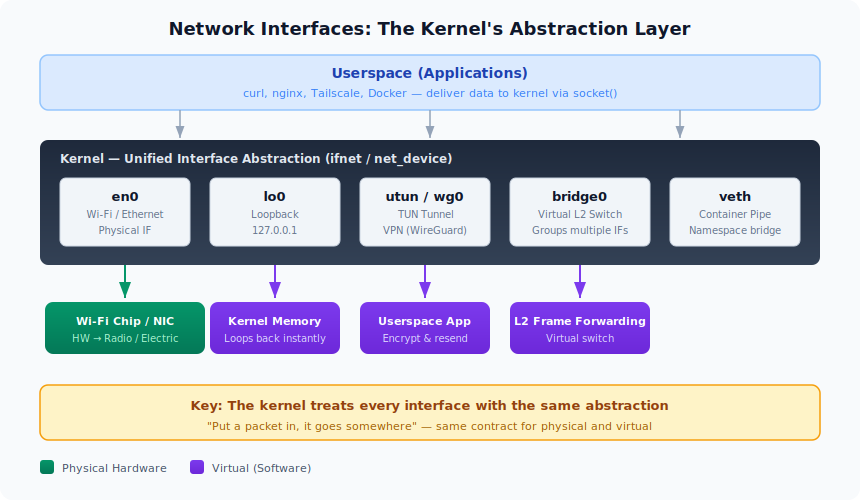
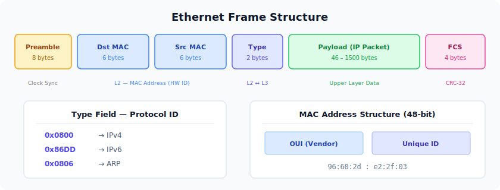
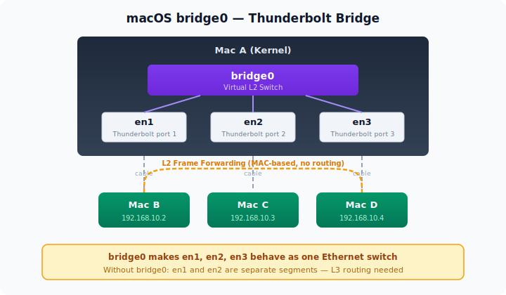
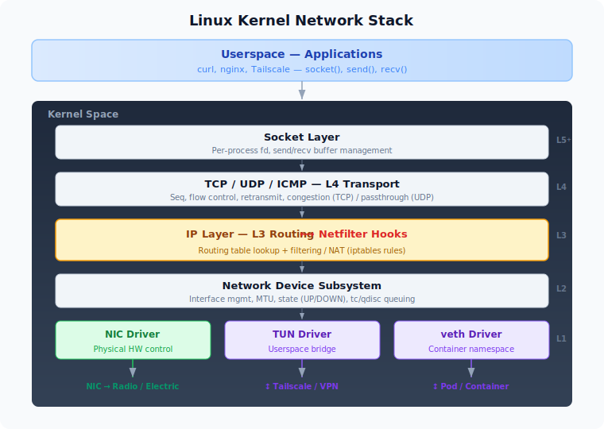
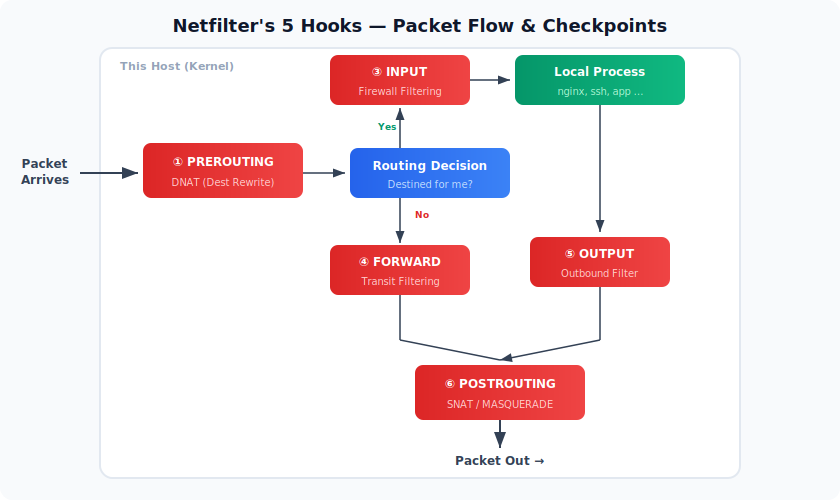
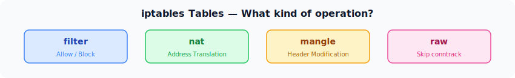
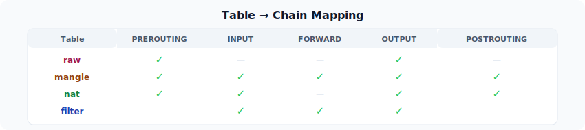
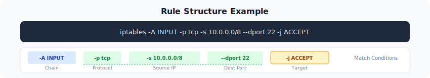
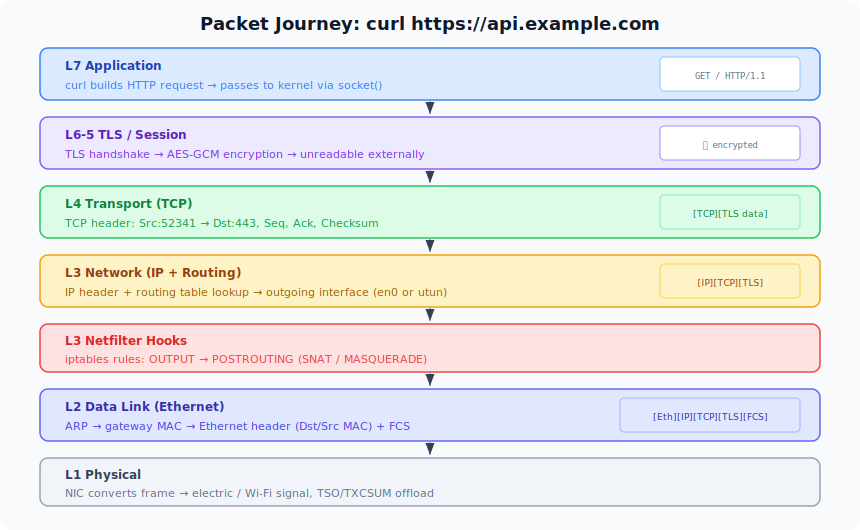

개발을 하다 보면 네트워크는 늘 "그냥 되는 것"처럼 느껴진다. `curl`을 치면 응답이 오고, Docker Compose로 컨테이너를 띄우면 서로 통신이 된다. 하지만 VPN 터널에서 큰 패킷만 드롭되거나, 컨테이너 네트워크가 통째로 먹통이 되는 순간이 오면, "패킷이 실제로 어떻게 움직이는지" 모르고서는 원인을 찾을 수 없다.

이 글에서는 OS 레벨에서 패킷이 실제로 지나가는 경로를 따라간다. `ifconfig` 출력을 읽는 법부터 시작해서 이더넷 프레임, 라우팅 테이블, Netfilter/iptables까지 — 네트워크 트러블슈팅의 기초가 되는 내용을 하나의 글로 정리한다.

## 네트워크 인터페이스 — 커널이 만든 출입구

네트워크 인터페이스는 **운영체제 커널이 네트워크와 대화하기 위해 만든 추상화된 출입구**다.

여러 애플리케이션이 동시에 모니터를 점유할 수 없어서 커널을 통해 화면을 사용하는 것처럼, 네트워크도 마찬가지다. 프로그램이 Wi-Fi 칩에 직접 명령을 내리거나 NIC 메모리에 접근하는 것은 불가능하며, 반드시 커널을 통해야 한다. 인터페이스는 커널이 제공하는 이 출입구이고, 프로그램은 소켓을 통해 여기에 데이터를 넘기면 된다.

`ifconfig` 명령어로 현재 시스템의 네트워크 인터페이스를 확인할 수 있다.

```
➜  ~ ifconfig
lo0: flags=8049<UP,LOOPBACK,RUNNING,MULTICAST> mtu 16384
        options=1203<RXCSUM,TXCSUM,TXSTATUS,SW_TIMESTAMP>
        inet 127.0.0.1 netmask 0xff000000
        inet6 ::1 prefixlen 128
        inet6 fe80::1%lo0 prefixlen 64 scopeid 0x1
        nd6 options=201<PERFORMNUD,DAD>

# ... gif0, stf0, anpi0-3, en1-6 등 비활성 인터페이스 생략 ...

en0: flags=88e3<UP,BROADCAST,SMART,RUNNING,NOARP,SIMPLEX,MULTICAST> mtu 1500
        options=6460<TSO4,TSO6,CHANNEL_IO,PARTIAL_CSUM,ZEROINVERT_CSUM>
        ether aa:bb:cc:dd:ee:01
        inet6 fe80::xxxx:xxxx:xxxx:xxxx%en0 prefixlen 64 secured scopeid 0xe
        inet 192.168.0.10 netmask 0xffffff00 broadcast 192.168.0.255
        nd6 options=201<PERFORMNUD,DAD>
        media: autoselect
        status: active

bridge0: flags=8863<UP,BROADCAST,SMART,RUNNING,SIMPLEX,MULTICAST> mtu 1500
        options=63<RXCSUM,TXCSUM,TSO4,TSO6>
        ether aa:bb:cc:dd:ee:02
        member: en1 flags=3<LEARNING,DISCOVER>
        member: en2 flags=3<LEARNING,DISCOVER>
        member: en3 flags=3<LEARNING,DISCOVER>
        nd6 options=201<PERFORMNUD,DAD>
        media: <unknown type>
        status: inactive

awdl0: flags=8863<UP,BROADCAST,SMART,RUNNING,SIMPLEX,MULTICAST> mtu 1500
        options=6460<TSO4,TSO6,CHANNEL_IO,PARTIAL_CSUM,ZEROINVERT_CSUM>
        ether aa:bb:cc:dd:ee:03
        inet6 fe80::xxxx:xxxx:xxxx:xxxx%awdl0 prefixlen 64 scopeid 0x10
        nd6 options=201<PERFORMNUD,DAD>
        media: autoselect
        status: active
```

출력이 상당히 길지만, 핵심 인터페이스만 추려보면 구조가 보인다.

- **`lo0`** — 루프백. 외부로 나가지 않는 자기 자신과의 통신(`127.0.0.1`)용이다. MTU가 16384로 큰 이유는 물리 전송이 없어 제약이 느슨하기 때문이다.
- **`en0`** — Wi-Fi. `status: active`인 유일한 물리 인터페이스로, 실제 인터넷 트래픽이 이 문을 통과한다. `ether` 필드에 MAC 주소가, `inet`에 할당된 IP가 표시된다.
- **`bridge0`** — Thunderbolt Bridge. `en1`, `en2`, `en3`을 멤버로 묶는 L2 가상 스위치다.
- **`awdl0`** — Apple Wireless Direct Link. AirDrop 등 Apple 기기 간 P2P 통신에 사용된다.

나머지 `anpi*`, `en1-6`, `gif0`, `stf0` 등은 현재 비활성(`inactive`) 상태인 인터페이스다. Thunderbolt 포트, 터널 인터페이스 등 macOS가 미리 만들어 두는 것들이다.

여기서 눈여겨볼 점은 인터페이스마다 `ether`(MAC 주소), `inet`(IP), `mtu`, `flags` 같은 정보가 계층별로 나열된다는 것이다. 이 각 필드가 무엇을 뜻하는지 이해하려면, 먼저 이더넷 프레임의 구조를 알아야 한다.

### 핵심 원칙: 인터페이스 뒤에 반드시 물리 하드웨어가 있을 필요는 없다



| 인터페이스 | 문 뒤에 있는 것 | 설명 |
|---|---|---|
| `en0` | Wi-Fi 칩 (하드웨어) | 패킷이 전파로 변환되어 물리적으로 전송됨 |
| `lo0` | 커널 메모리 | 패킷이 밖으로 나가지 않고 커널 안에서 즉시 되돌아옴 |
| `utun` / `wg0` | 유저스페이스 프로세스 | VPN 앱(Tailscale 등)이 패킷을 받아서 암호화 후 다시 물리 인터페이스로 전송 |
| `bridge0` | 여러 인터페이스를 묶는 가상 스위치 | L2 레벨에서 프레임을 포워딩 |
| `veth` | 컨테이너/Pod의 네트워크 네임스페이스 | 한쪽에서 넣은 패킷이 반대쪽에서 나오는 파이프 |

커널 입장에서는 이 모든 인터페이스가 동일한 추상화로 취급된다. "패킷을 넣으면 어딘가로 간다"는 인터페이스의 계약(contract)은 물리든 가상이든 동일하다. Docker의 `veth`든, Tailscale의 `utun`이든, 커널은 같은 방식으로 패킷을 전달한다.

---

## 이더넷 — 같은 네트워크 안에서의 통신 규칙

### 이더넷이란

이더넷은 **같은 네트워크 안에서 장비들이 데이터를 주고받는 규칙**이다. OSI 모델에서 L1(물리)과 L2(데이터 링크)를 정의하는 IEEE 802.3 표준이다.

이름의 유래는 19세기 물리학에서 빛이 전달되는 매질이라 믿었던 "에테르(Ether)"로, 네트워크라는 보이지 않는 매질을 통해 데이터가 전달된다는 비유다.

### 이더넷 프레임 구조

이더넷의 핵심 전송 단위는 **프레임**(Frame)이다.



각 필드의 역할:

- **Preamble (8 bytes)**: 수신 측 NIC의 클럭 동기화를 위한 패턴 (`10101010...`). 마지막 1바이트(SFD)는 `10101011`로 "여기서 프레임이 시작된다"는 신호다.
- **Dst/Src MAC (6 bytes 씩)**: 목적지와 출발지의 MAC 주소. `ff:ff:ff:ff:ff:ff`면 브로드캐스트.
- **Type (2 bytes)**: 페이로드에 담긴 상위 프로토콜 식별자. `0x0800` = IPv4, `0x86DD` = IPv6, `0x0806` = ARP.
- **Payload (46–1500 bytes)**: 상위 계층의 데이터 (IP 패킷 등). 최대 1500바이트가 표준 MTU.
- **FCS (4 bytes)**: Frame Check Sequence. CRC-32 알고리즘으로 프레임 무결성 검증.

L2 레이어에서 사용하는 데이터 단위는 프레임이며, L3의 IP 레벨에서는 패킷이라고 부른다. 따라서 프레임은 IP 패킷을 페이로드로써, 헤더를 붙여 포장하여 보낼 준비를 한다.

당연하게도 '어떤 IP로 보내겠습니다'는 내용을 담고 있는 IP 패킷은 이제 프레임의 페이로드로 있기 때문에, 프레임의 헤더에서는 MAC 주소를 통해서 '어떤 MAC 주소로 보내겠습니다'라는 내용을 정의하게 된다.

### MAC 주소

MAC(Media Access Control) 주소는 48비트(6바이트)의 하드웨어 식별자다. 앞 3바이트는 제조사(OUI), 뒤 3바이트는 고유 번호다.

```
96:60:2d:e2:2f:03
├──────┤├──────┤
  OUI    고유번호
(제조사)
```

MAC 주소는 동일 네트워크 세그먼트(L2) 안에서만 의미가 있다. **라우터를 넘어가면 MAC은 다음 홉의 것으로 교체된다.**

### Wi-Fi와 이더넷의 관계

Wi-Fi(802.11)는 무선 이더넷이다. 동일한 프레임 구조를 공유하며, MAC 주소 기반으로 통신한다. macOS에서 Wi-Fi 인터페이스가 `en0`(Ethernet의 약자)인 이유가 이것이다.

---

## ifconfig 출력 읽는 법

### 기본 구조

```
인터페이스명: flags=값<플래그들> mtu 값
    options=값<옵션들>
    ether MAC주소          ← L2 (Data Link)
    inet IPv4주소          ← L3 (Network)
    inet6 IPv6주소         ← L3 (Network)
    media: ...             ← L1 (Physical)
    status: active/inactive
```

이 구조 자체가 OSI 레이어 순서 — Physical → Data Link → Network 순으로 정보가 나열된다.

### 주요 flags 해석

| 플래그 | 의미 |
|---|---|
| `UP` | 커널에 의해 인터페이스 활성화됨 |
| `RUNNING` | L1 레벨에서 링크 살아있음. `UP`인데 `RUNNING` 없으면 "드라이버는 올라왔지만 케이블 빠진" 상태 |
| `BROADCAST` | 브로드캐스트 가능 (이더넷 계열) |
| `LOOPBACK` | `lo0` 전용. 자기 자신에게 보내는 트래픽 전용 |
| `POINTOPOINT` | 터널 인터페이스 (`utun`). 양 끝점만 연결하는 1:1 링크 |
| `PROMISC` | Promiscuous mode. 자기 MAC이 아닌 패킷도 전부 수신. bridge 멤버에서 활성화 |

직접 `ifconfig` 명령어를 통해서 확인해보면, 다음과 같이 다양한 flag들이 있는 것을 확인할 수 있다.

```
lo0: flags=8049<UP,LOOPBACK,RUNNING,MULTICAST> mtu 16384
```

플래그의 내용에 따라서 위와 같은 정보를 확인할 수 있다.

### NIC 오프로드 기능 (options)

| 옵션 | 의미 |
|---|---|
| `RXCSUM` / `TXCSUM` | 수신/송신 체크섬을 NIC가 계산 (CPU 부하 절감) |
| `TSO4` / `TSO6` | TCP Segmentation Offload. 커널이 큰 세그먼트를 NIC에 넘기면 NIC가 MTU 크기로 분할 |
| `CHANNEL_IO` | Apple 전용 고성능 I/O 채널 기반 패킷 처리 경로 |

`TSO`가 활성화되어 있으면 tcpdump에서 MTU(1500)보다 큰 패킷이 보이는 것은 정상이다. NIC가 분할하기 전의 큰 세그먼트를 캡처하고 있기 때문이다.

---

## macOS와 Linux의 인터페이스 이름 규칙

`ifconfig` 명령어를 확인해보면 다양한 인터페이스들이 있는데, 각각 어떤 것을 의미하는지 확인해보면 다음과 같다. MacOS와 Linux 계열에서 조금씩 인터페이스를 부르는 키워드가 다르다.

### macOS (BSD 계열)

macOS의 인터페이스 이름은 **드라이버명 + 인스턴스 번호** 패턴이다.

| 접두사 | 의미 | 예시 |
|---|---|---|
| `en` | Ethernet (유선 + Wi-Fi 포함) | `en0` = Wi-Fi, `en1-3` = Thunderbolt |
| `lo` | Loopback | `lo0` = 127.0.0.1 |
| `utun` | User-space Tunnel | `utun1` = Tailscale (WireGuard) |
| `bridge` | L2 Bridge | `bridge0` = Thunderbolt Bridge |
| `awdl` | Apple Wireless Direct Link | `awdl0` = AirDrop |

Apple Silicon Mac에서는 `en0`이 항상 Wi-Fi다. Intel Mac에서는 유선이 `en0`, Wi-Fi가 `en1`이었지만 반전되었다.

또한, en1부터 en3까지는 Thunderbolt에 속하게 된다. 표의 중간에 bridge0이 썬더볼트 브릿지로 쓰여있는데, 말 그대로 썬더볼트의 인터페이스의 브릿지 역할을 하며, 자세한 내용은 밑에서 다룬다.

### Linux (systemd)

Linux는 물리 위치 기반 이름을 사용한다: `enp3s0` (PCI 버스 3, 슬롯 0), `ens1` (핫플러그 슬롯 1). 하드웨어를 변경해도 이름이 바뀌지 않는 장점이 있다.

| 항목 | macOS | Linux |
|---|---|---|
| 명명 규칙 | 발견 순서 기반 (`en0`, `en1`) | 물리 위치 기반 (`enp3s0`) |
| 네트워크 스택 | XNU (BSD 계열 `ifnet`) | Linux 고유 (`net_device`) |
| 방화벽 | pf (Packet Filter) | netfilter (iptables/nftables) |

---

## Bridge 인터페이스

Bridge는 여러 물리(또는 가상) 인터페이스를 하나의 L2 브로드캐스트 도메인으로 묶는 가상 스위치다. 실제 스위치 장비 없이도, 커널이 소프트웨어로 동일한 역할을 수행한다.



### macOS bridge0

앞서 `ifconfig` 출력에서 `bridge0`이 `en1`, `en2`, `en3`을 멤버로 갖고 있는 것을 확인했다. 이 세 인터페이스는 각각 Mac의 Thunderbolt 포트에 대응한다. `bridge0`은 이들을 하나의 L2 세그먼트로 묶는 가상 스위치 역할을 한다.

예를 들어 Mac A(내 컴퓨터)의 Thunderbolt 포트에 Mac B와 Mac C가 각각 케이블로 연결되어 있다고 하자. `bridge0`이 없다면 `en1`과 `en2`는 완전히 별개의 네트워크 세그먼트다. Mac B가 Mac C에게 패킷을 보내려면 IP 레벨의 라우팅(L3)이 필요하다.

하지만 `bridge0`이 `en1`과 `en2`를 묶고 있으므로, Mac B → Mac C 트래픽은 브리지 내부에서 MAC 주소 기반으로 바로 포워딩된다. 마치 세 대의 Mac이 같은 이더넷 스위치에 꽂혀 있는 것과 동일한 효과다. 이것이 L2 브리징의 핵심이다 — IP를 거치지 않고 프레임 레벨에서 직접 전달한다.

### Kubernetes에서의 Bridge

이 개념은 Kubernetes 네트워킹에서도 동일하게 등장한다. Flannel 같은 CNI 플러그인은 각 워커 노드에 `cni0`이라는 브리지를 만들고, 같은 노드에 있는 Pod들의 veth 인터페이스를 이 브리지에 연결한다.

결과적으로 같은 노드의 Pod들은 `cni0` 브리지를 통해 L2 레벨에서 직접 통신한다. macOS에서 `bridge0`이 Thunderbolt로 연결된 Mac들을 하나의 네트워크로 만들어주는 것처럼, `cni0`은 같은 노드의 Pod들을 하나의 네트워크로 만들어주는 것이다. 규모와 용도만 다를 뿐 원리는 같다.

---

## 커널 네트워크 스택

### 왜 네트워크가 커널에 있는가

커널은 하드웨어와 프로그램 사이의 유일한 중재자다. 이것은 모니터, 키보드, 마우스와 동일한 원칙이다.

1. **NIC는 하드웨어** → 커널만 제어 가능
2. **여러 앱이 동시에 네트워크 사용** → 누군가 중재해야 함 → 커널의 역할
3. **라우팅, 방화벽 등 공통 정책** → 모든 앱에 일관되게 적용 → 커널이 한 곳에서 처리

### Linux 커널 네트워크 스택의 구조

네트워크를 사용하기 위해서 커널을 제어해야 한다고 했는데, 소켓을 통해서 커널 레이어에 접근하며 OSI 7 레이어에 해당하는 것처럼 다양한 레이어를 거치게 된다. 그림으로 나타내면 아래와 같다.



각 층의 역할:

- **Socket layer**: 앱이 커널과 대화하는 유일한 창구. `socket()` 시스템 콜로 소켓 fd를 생성하고, `send`/`recv`로 데이터 교환.
- **Transport layer**: TCP면 시퀀스 번호, 흐름 제어, 재전송, 혼잡 제어. UDP면 거의 passthrough.
- **IP layer + Routing + Netfilter**: 라우팅 테이블을 조회해서 나갈 인터페이스를 결정하고, Netfilter 훅에 등록된 규칙을 실행한다.
- **Network device subsystem**: 인터페이스 목록, MTU, 상태(UP/DOWN), 큐잉 규칙(tc/qdisc) 등을 관리.
- **Device drivers**: 하드웨어 제어(NIC driver), 유저스페이스 연결(TUN driver), 컨테이너 연결(veth driver).

애플리케이션이 네트워크로 데이터를 보낼 때, 데이터는 한 덩어리로 나가지 않는다. 레이어를 내려갈수록 IP 헤더(20B), TCP 헤더(20B) 등이 붙기 때문에, L2에서 정한 최대 전송 단위인 MTU(보통 1500B)를 초과하지 않으려면 데이터를 미리 쪼개야 한다.

이때 TCP가 사용하는 단위가 **MSS(Maximum Segment Size)**다. MSS = MTU - IP 헤더 - TCP 헤더이므로, 표준 환경에서는 1500 - 20 - 20 = 1460바이트가 된다. 애플리케이션이 소켓에 아무리 큰 데이터를 써도, TCP가 MSS 크기로 잘라서 내려보낸다.

### macOS vs Linux

이 글에서 다루는 네트워크 스택 구조는 Linux 커널 기준이지만, macOS도 큰 틀에서는 동일한 역할을 하는 컴포넌트를 갖고 있다. 이름과 구현은 다르지만 계층 구조 자체는 같다고 보면 된다.

```
macOS XNU 커널                    Linux 커널
├─ ifnet (BSD Network Stack)      ├─ net_device (리눅스 네트워크 스택)
├─ pf (Packet Filter)             ├─ netfilter (+ iptables/nftables)
├─ utun (NetworkExtension)        ├─ tun/tap, wireguard 모듈
└─ bridge (ifnet bridging)        └─ bridge, veth, vxlan 모듈
```

---

## 라우팅 테이블 — "이 패킷을 어디로 보낼까?"

앞서 커널 네트워크 스택의 구조를 봤다. 애플리케이션이 소켓에 데이터를 쓰면, TCP/UDP(L4)를 거쳐 IP 레이어(L3)에 도달한다. 바로 이 IP 레이어에서 커널이 가장 먼저 하는 일이 라우팅 테이블 조회다 — "이 패킷을 어떤 인터페이스로, 어디를 향해 내보낼 것인가?"를 결정하는 것이다.

라우팅 테이블은 커널이 관리하는 경로 정보 데이터베이스다. 목적지 IP 주소를 보고 가장 구체적으로 일치하는 경로를 선택하는데, 이 알고리즘을 **Longest Prefix Match(LPM)**라고 한다.

### 라우팅 테이블 확인

운영체제에 따라서 라우팅 테이블을 확인하는 방법은 아래와 같다.

**Linux:**

```bash
ip route show
```

```
default via 192.168.1.1 dev eth0          # 기본 게이트웨이
192.168.1.0/24 dev eth0 scope link        # 로컬 서브넷은 eth0으로 직접 전달
10.0.0.0/8 via 10.1.1.1 dev wg0          # 10.x 대역은 WireGuard 터널로
```

**macOS:**

```bash
netstat -rn                    # 라우팅 테이블 전체 조회
route -n get default           # 기본 게이트웨이 상세 정보
route -n get 10.0.5.3          # 특정 IP로의 경로 조회
```

### 핵심 요소

위 명령어를 해석하기 위해 알아두어야 할 요소는 다음과 같다.

| 요소 | 설명 |
|---|---|
| Destination | 목적지 네트워크 (CIDR 표기) |
| Gateway (via) | 다음 홉 주소 (직접 연결이면 없음) |
| Device (dev / Netif) | 나갈 네트워크 인터페이스 |
| Metric | 같은 목적지에 대해 여러 경로가 있을 때 우선순위 |
| Scope | link(로컬 서브넷), global(원격) 등 |

### macOS 라우팅 테이블 해석

macOS 환경에서 netstat를 통해서 확인하면 Internet에 따라 다양한 정보가 다음과 같이 나오게 된다.

```
Destination        Gateway            Flags               Netif Expire
default            192.168.20.1       UGScg                 en0
127                127.0.0.1          UCS                   lo0
192.168.20/23      link#14            UCS                   en0      !
192.168.20.1       ac:71:2e:f:ad:88   UHLWIir               en0   1198
224.0.0/4          link#14            UmCS                  en0      !
```

각 경로의 의미:

- **`default → 192.168.20.1`**: 매칭되는 경로가 없으면 무조건 게이트웨이(공유기)로 보낸다. 인터넷으로 나가는 모든 트래픽.
- **`127.0.0.0/8`**: localhost 트래픽. 네트워크 밖으로 나가지 않고 `lo0`에서 자기 자신에게 돌아온다.
- **`192.168.20/23`**: 로컬 서브넷. 게이트웨이 없이 `en0`에서 직접 통신.
- **`192.168.20.1 → MAC주소`**: ARP 캐시 연동 호스트 경로. Expire 숫자는 ARP 캐시 만료까지 남은 초.
- **`224.0.0.0/4`**: 멀티캐스트 대역. mDNS(Bonjour — AirDrop, AirPlay), SSDP(UPnP) 등.

### Flags 의미

| Flag | 의미 |
|---|---|
| `U` | Up (경로 활성) |
| `G` | Gateway 경유 (직접 연결이 아님) |
| `H` | Host 경로 (/32, 특정 호스트 하나) |
| `S` | Static (수동 또는 시스템 설정) |
| `L` | Link-layer 주소 있음 (MAC 확인됨) |
| `W` | Was cloned (C 경로에서 복제됨) |
| `m` | Multicast |

### 패킷 흐름 예시

- **로컬 서브넷 통신** (`192.168.20.7`로 ping): 서브넷 매칭 → 게이트웨이 없이 `en0`에서 직접 전달 → ARP 캐시에서 MAC 확인 → 이더넷 프레임 전송
- **인터넷 통신** (`8.8.8.8`로 ping): 서브넷 매칭 없음 → default 경로 매칭 → 게이트웨이 `192.168.20.1`로 전달 → 공유기가 인터넷으로 라우팅

---

## Netfilter와 iptables — "이 패킷을 어떻게 처리할까?"

라우팅 테이블이 "어디로 보낼까?"를 결정한다면, Netfilter는 "보내도 될까? 수정할까?"를 결정한다.

| 구분 | 라우팅 테이블 | iptables / Netfilter |
|---|---|---|
| 핵심 질문 | "어디로 보낼까?" | "보내도 될까? 수정할까?" |
| 판단 기준 | 목적지 IP | 출발지/목적지 IP, 포트, 프로토콜, 상태 등 |
| 동작 | 경로 선택 | 허용/차단/주소변환/패킷수정 |

둘은 독립적인 시스템이지만 밀접하게 연동된다. Netfilter가 패킷을 변조하면 라우팅 판단이 달라지고, 라우팅 판단 결과에 따라 거치는 Netfilter 훅이 달라진다.

### iptables의 역할

iptables는 커널의 Netfilter에게 "이런 패킷이 오면 이렇게 처리해"라고 **규칙을 등록해주는 유저스페이스 도구(userspace tool)**다. 실제 패킷 처리는 커널 안의 Netfilter가 수행한다. 규칙이 한번 등록되면 iptables 프로세스가 종료돼도 규칙은 커널에 남아있다.

```
iptables (유저스페이스 CLI)
    │
    │ netlink 소켓으로 커널에 규칙 전달
    ▼
netfilter (커널 프레임워크)
    ├─ PREROUTING hook: 등록된 규칙 체크
    ├─ INPUT hook: 등록된 규칙 체크
    ├─ FORWARD hook: 등록된 규칙 체크
    ├─ OUTPUT hook: 등록된 규칙 체크
    └─ POSTROUTING hook: 등록된 규칙 체크
```

---

## Netfilter의 5개 Hook — 패킷 흐름의 검문소

### 훅의 개념

훅(Hook)이란 "어떤 처리 흐름의 특정 지점에 끼어들 수 있는 진입점"이다. Netfilter는 커널 네트워크 스택의 패킷 처리 흐름 중간중간에 **"여기서 잠깐, 등록된 규칙이 있으면 실행해"** 하는 체크포인트를 5개 만들어 두었다.

### 전체 패킷 흐름

커널 입장에서 패킷이 도착하면 반드시 하나의 질문을 한다: **"이 패킷의 목적지가 나인가, 아닌가?"** 이 질문의 답에 따라 경로가 갈리고, 5개의 훅은 이 경로 위의 서로 다른 지점에 배치되어 있다.



### 각 훅의 역할

**① PREROUTING — 패킷이 막 도착했을 때, 라우팅 판단 전**

패킷이 NIC를 통해 커널에 들어오자마자 가장 먼저 거치는 훅. 여기서 목적지 주소를 바꾸면(DNAT) 뒤의 라우팅 판단 결과가 달라진다.

```bash
# 외부 8080 → 내부 192.168.1.10:80으로 DNAT
iptables -t nat -A PREROUTING -p tcp --dport 8080 -j DNAT --to 192.168.1.10:80
```

**② 라우팅 판단 (Routing Decision)**

Netfilter 훅이 아니라 커널 IP 스택의 동작이지만 흐름 이해에 필수적이다. 목적지 IP를 보고 라우팅 테이블을 조회하여 INPUT 경로와 FORWARD 경로로 나눈다.

**③ INPUT — 이 호스트로 향하는 패킷이 로컬 프로세스에 전달되기 직전**

서버 방화벽의 핵심. 이 호스트가 최종 목적지인 패킷에만 적용된다.

```bash
iptables -A INPUT -p tcp --dport 22 -j ACCEPT     # SSH 허용
iptables -A INPUT -p tcp --dport 80 -j ACCEPT     # HTTP 허용
iptables -A INPUT -j DROP                          # 나머지 차단
```

INPUT 통과 후에도 커널 소켓 계층에서 "이 포트를 listen하고 있는 프로세스가 있는가?"를 확인한다. 두 단계는 독립적이다 — iptables에서 80번을 ACCEPT했더라도 nginx가 안 떠 있으면 RST가 발생한다.

**④ FORWARD — 이 호스트를 경유하는 패킷**

이 호스트가 라우터 역할을 할 때만 의미가 있다. Docker 컨테이너 네트워킹, VPN 서버, Linux 라우터가 대표적인 경우다. Linux에서는 기본적으로 IP 포워딩이 꺼져 있으므로 `sysctl net.ipv4.ip_forward=1`로 활성화해야 한다.

**⑤ OUTPUT — 이 호스트에서 생성된 패킷이 나가기 직전**

로컬 프로세스가 만든 패킷이 커널 네트워크 스택으로 내려온 직후에 거치는 훅.

```bash
# 외부 SMTP(25번 포트) 발신 차단
iptables -A OUTPUT -p tcp --dport 25 -j DROP
```

**⑥ POSTROUTING — 패킷이 최종적으로 NIC를 통해 나가기 직전**

밖으로 나가는 모든 패킷이 마지막으로 거치는 훅. SNAT/MASQUERADE가 여기서 일어난다.

```bash
# 내부 네트워크 출발지를 공인 IP로 변환
iptables -t nat -A POSTROUTING -s 192.168.1.0/24 -o eth0 -j MASQUERADE
```

### 각 훅이 해당 위치에 있는 이유

| 훅 | 핵심 이유 |
|---|---|
| PREROUTING | 라우팅 판단에 영향을 줘야 하니까 (DNAT) |
| INPUT | 프로세스에 도달하기 전에 차단해야 하니까 |
| FORWARD | 남의 패킷을 무조건 통과시키면 안 되니까 |
| OUTPUT | 나가면 안 되는 트래픽을 잡아야 하니까 |
| POSTROUTING | 모든 판단이 끝난 뒤에 주소를 변환해야 하니까 |

이렇게 기본적으로 Netfilter에서 잘 알아두어야 하는 훅은 다섯 개로 이루어져 있다. 이 중에서 FORWARD를 제외하면 나머지는 쌍을 이루기 때문에 그림을 그려보면 손쉽게 이해할 수 있다.

---

## iptables의 구조: 테이블, 체인, 규칙

iptables는 **테이블(Table) > 체인(Chain) > 규칙(Rule)**의 3단 계층 구조를 가진다.

### 테이블 (Table)

하나의 훅에서 성격이 다른 여러 작업을 분리하기 위해 테이블이 존재한다.



**filter** — 가장 기본이자 가장 많이 쓰는 테이블. 패킷을 허용하거나 차단한다.

```bash
iptables -A INPUT -p tcp --dport 22 -j ACCEPT    # SSH 허용
iptables -A INPUT -j DROP                         # 나머지 차단
```

**nat** — 출발지 또는 목적지 IP/포트를 변환한다. 공유기 NAT, 포트 포워딩, Docker 컨테이너 네트워킹 등이 여기서 이루어진다. nat 테이블은 **연결의 첫 번째 패킷에만 적용**되고, 이후는 **conntrack**(연결 추적)이 자동으로 같은 변환을 적용한다.

```bash
# DNAT (목적지 변환) — PREROUTING
iptables -t nat -A PREROUTING -p tcp --dport 8080 -j DNAT --to 192.168.1.10:80

# MASQUERADE (출발지 변환) — POSTROUTING
iptables -t nat -A POSTROUTING -s 192.168.1.0/24 -o eth0 -j MASQUERADE
```

**mangle** — 패킷의 IP 헤더 필드를 직접 수정한다. TTL 변경, TOS 변경, MARK(커널 내부 태그) 설정 등.

**raw** — 특정 패킷을 conntrack 추적 대상에서 제외한다. 대규모 트래픽 서버에서 conntrack 테이블 오버플로우 방지용. 다른 모든 테이블보다 가장 먼저 실행된다.

### 체인 (Chain)

체인은 "특정 훅에서, 특정 테이블의 규칙들을 순서대로 담아둔 목록"이다. 하나의 훅에서 여러 테이블의 체인이 **고정된 순서(raw → mangle → nat → filter)**로 실행된다. 어떤 테이블이 어떤 훅(체인)에서 동작하는지는 아래 매핑 표와 같다.



사용자 정의 체인도 만들 수 있다. 규칙이 많아질 때 정리용으로 사용하며, 프로그래밍의 함수 호출과 유사하다.

```bash
# 사용자 정의 체인 생성 및 사용
iptables -N WEB_TRAFFIC
iptables -A WEB_TRAFFIC -p tcp --dport 80 -j ACCEPT
iptables -A WEB_TRAFFIC -p tcp --dport 443 -j ACCEPT
iptables -A WEB_TRAFFIC -j DROP

# INPUT에서 이 체인으로 분기
iptables -A INPUT -p tcp -j WEB_TRAFFIC
```

### 규칙 (Rule)

규칙은 **매칭 조건(Match)**과 **타겟(Target)**으로 구성된다. 체인 안의 규칙은 위에서 아래로 순서대로 평가되며, 종료 타겟에 매칭되면 즉시 결정된다.



**종료 타겟 (Terminating)** — 다음 규칙으로 넘어가지 않음:

| 타겟 | 동작 |
|---|---|
| `ACCEPT` | 패킷 통과 |
| `DROP` | 무응답 폐기 (상대방은 타임아웃까지 기다림) |
| `REJECT` | 거부 + ICMP 에러 응답 전송 |
| `DNAT` | 목적지 주소 변환 |
| `SNAT` / `MASQUERADE` | 출발지 주소 변환 |

**비종료 타겟 (Non-terminating)** — 처리 후 다음 규칙도 계속 평가:

| 타겟 | 동작 |
|---|---|
| `LOG` | 커널 로그에 기록하고 다음 규칙으로 계속 |
| `MARK` | 내부 마크 설정하고 다음 규칙으로 계속 |

```bash
# LOG(비종료) 후 DROP(종료) — 로그 기록 뒤 차단
iptables -A INPUT -p tcp --dport 22 -j LOG --log-prefix "SSH attempt: "
iptables -A INPUT -p tcp --dport 22 -s !10.0.0.0/8 -j DROP
```

어떤 규칙에도 매칭되지 않으면 체인의 **기본 정책(Policy)**이 적용된다:

```bash
iptables -P INPUT DROP    # INPUT 체인 기본 정책을 DROP으로
```

---

## 패킷의 실제 여정 — curl 한 줄의 무게

`curl https://api.example.com`을 실행하면, 하나의 HTTP 요청이 다음과 같은 계층을 통과한다.



1. **L7 Application**: curl이 HTTP 요청 문자열을 생성한다. `socket()` 시스템 콜로 커널에 소켓 fd를 요청한다.
2. **L6-5 TLS/Session**: TLS 핸드셰이크가 진행된다. HTTP 데이터가 AES-GCM으로 암호화된다.
3. **L4 Transport (TCP)**: TCP 헤더 부착 — 출발지 포트(임시), 목적지 포트(443), 시퀀스 번호, 체크섬.
4. **L3 Network (IP)**: IP 헤더 부착 + 라우팅 테이블 조회 → 출구 인터페이스 결정.
5. **L3 Netfilter Hooks**: OUTPUT → POSTROUTING 순서로 iptables 규칙 체크.
6. **L2 Data Link**: ARP 캐시에서 게이트웨이 MAC 조회 → 이더넷 헤더 + FCS 부착.
7. **L1 Physical**: NIC가 프레임을 전기/Wi-Fi 신호로 변환하여 송신.

L1에서 전기 신호가 된 패킷은 공유기(라우터)로 전달된다. 공유기는 NAT를 수행해 사설 IP를 공인 IP로 바꾸고, ISP 네트워크로 내보낸다. 이후 ISP 간 BGP 라우팅을 따라 IX(Internet Exchange)를 거쳐 목적지 서버가 있는 ISP까지 도달하고, 최종적으로 서버의 NIC에 도착한다.

응답은 이 전체 경로를 역순으로 되돌아온다. 서버에서 L7까지 올라갔다가 다시 L1으로 내려와 동일한 물리 경로를 거쳐 내 NIC에 도착하고, 커널이 L1 → L7 순서로 헤더를 벗겨내며 최종적으로 curl이 HTTP 응답을 출력한다.

---

## 실전 서버 방화벽 설정 패턴

대부분의 서버는 라우터가 아니라 최종 목적지이므로, INPUT 체인이 서버 방화벽의 핵심이다.

```bash
# 기본 정책: 모든 인바운드 차단
iptables -P INPUT DROP

# 이미 연결된 세션의 패킷은 허용 (stateful)
iptables -A INPUT -m conntrack --ctstate ESTABLISHED,RELATED -j ACCEPT

# 루프백은 허용
iptables -A INPUT -i lo -j ACCEPT

# SSH, HTTP, HTTPS만 허용
iptables -A INPUT -p tcp --dport 22 -j ACCEPT
iptables -A INPUT -p tcp --dport 80 -j ACCEPT
iptables -A INPUT -p tcp --dport 443 -j ACCEPT

# 나머지는 기본 정책(DROP)에 의해 차단됨
```

이는 AWS 보안 그룹에서 인바운드 규칙으로 "SSH 22번 허용, HTTP 80번 허용" 하는 것과 본질적으로 동일하다.

---

## 부록: 네트워크 명령어 모음

### macOS

```bash
# 라우팅
netstat -rn                              # 라우팅 테이블 전체
route -n get default                     # 기본 게이트웨이 상세
route -n get <IP>                        # 특정 IP 경로 조회

# 인터페이스
ifconfig                                 # 인터페이스 목록 및 IP

# ARP / NDP
arp -a                                   # ARP 테이블 (IP ↔ MAC 매핑)
ndp -a                                   # IPv6 Neighbor Discovery 테이블

# DNS
scutil --dns                             # DNS 설정 확인
networksetup -listallhardwareports       # 물리 인터페이스 목록

# 방화벽 (PF)
sudo pfctl -sr                           # 현재 활성 방화벽 규칙
sudo pfctl -sa                           # 전체 상태
```

### Linux

```bash
# 라우팅
ip route show                            # 라우팅 테이블
ip route get 10.0.0.5                    # 특정 IP 경로
ip rule show                             # Policy Routing 규칙

# iptables 규칙 (테이블별)
sudo iptables -L -v -n --line-numbers    # filter 테이블
sudo iptables -t nat -L -v -n            # nat 테이블
sudo iptables-save                       # 전체 규칙 덤프

# nftables (iptables 후계자)
sudo nft list ruleset

# k8s 관련 규칙만 필터링
sudo iptables-save | grep -i "KUBE\|FLANNEL\|CALICO"

# conntrack (NAT 매핑 상태)
sudo conntrack -L -d 10.96.0.1

# 실시간 패킷 추적
sudo iptables -t raw -A PREROUTING -s 192.168.1.100 -j TRACE
dmesg -w | grep TRACE
```

### macOS PF와 Linux iptables 문법 비교

```bash
# Linux iptables: 80번 포트 차단
iptables -A INPUT -p tcp --dport 80 -j DROP

# macOS PF: 동일 동작 (/etc/pf.conf)
block in proto tcp from any to any port 80
```

---

## 마치며

지금까지 네트워크에 대한 기본적인 내용을 정리해두었다. 이 글의 목표는 ifconfig, ip route, iptables 같은 기본적인 쉘 명령어의 모든 의미나 상세한 로직을 이해할 수 있도록 정리하는 것이다.

나 역시 자주 사용하면서도 자세하게 이해하고 있지는 못했다. 하지만 새로운 네트워크 도구들이 왜 등장했는지를 이해하려면, 기존 도구의 한계를 알아야 한다. 예를 들어, 앞서 다룬 iptables는 체인 안의 규칙을 위에서 아래로 **순서대로 평가**한다. 규칙이 수십 개일 때는 문제가 없지만, Kubernetes 클러스터처럼 Service가 수백~수천 개로 늘어나면 그만큼 iptables 규칙도 폭증하고, 모든 패킷이 이 긴 목록을 선형 탐색해야 하므로 심각한 성능 병목이 된다. Cilium 같은 도구가 eBPF를 활용해 Netfilter를 우회하는 접근을 택한 배경이 바로 이것이다.

다음 포스팅으로는 네트워크에서도 이러한 기본적인 네트워크 인터페이스 기반 위에 지어진 VLAN이나 VXLAN 혹은 새롭게 나온 네트워크 솔루션들을 다뤄보고자 한다.