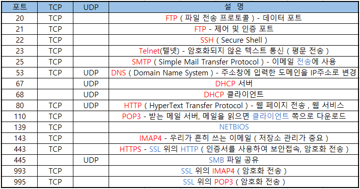
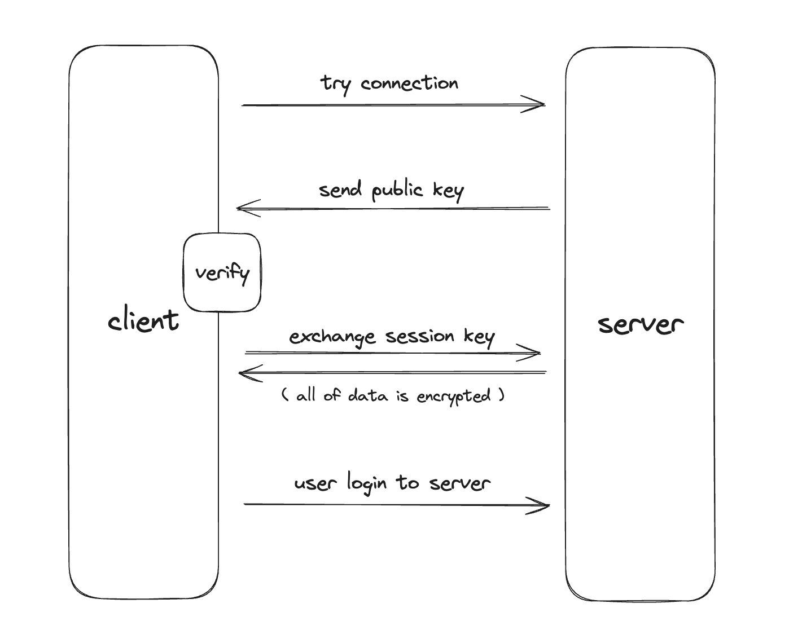
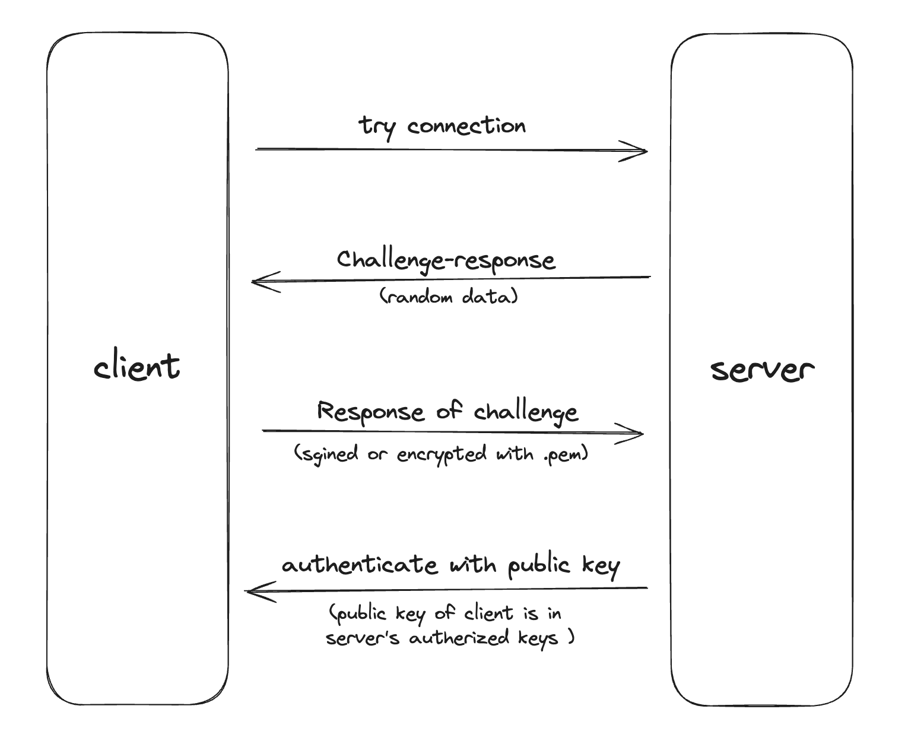
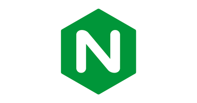
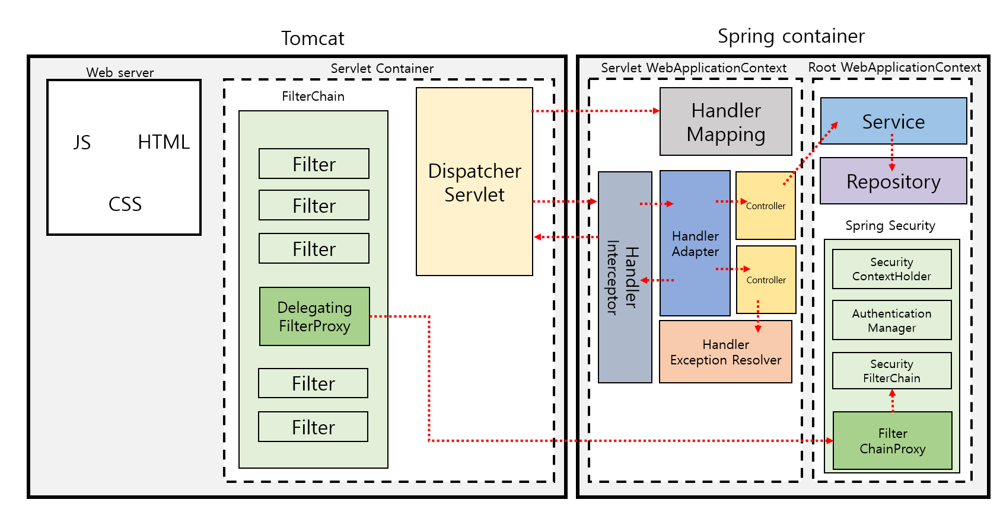
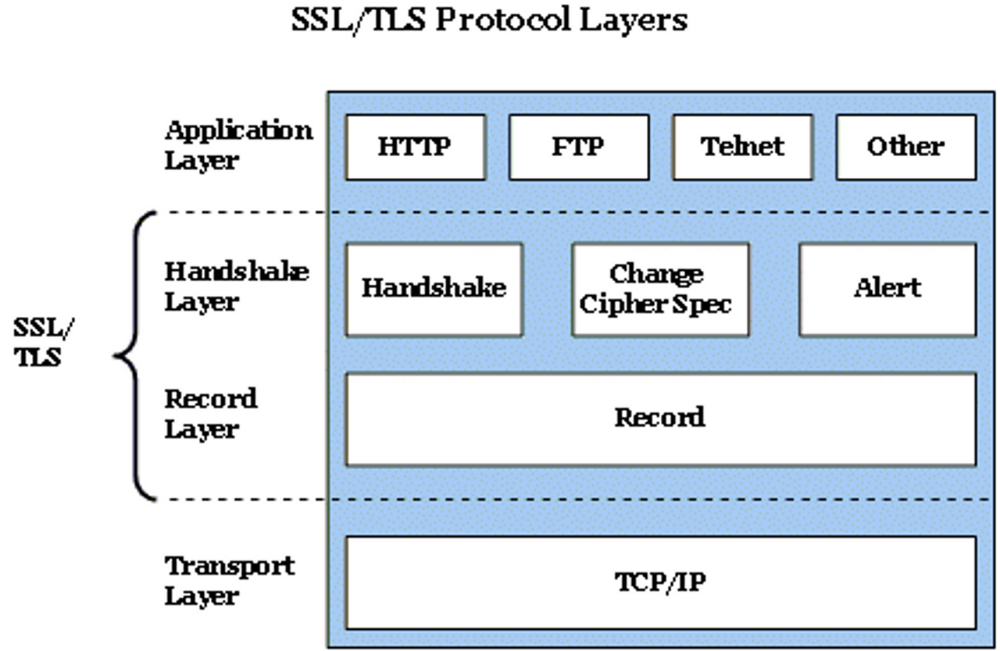
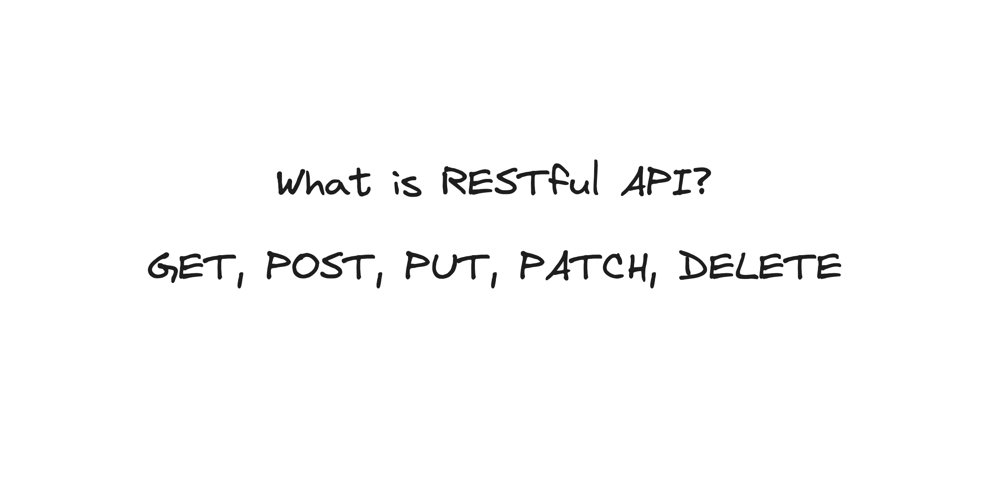
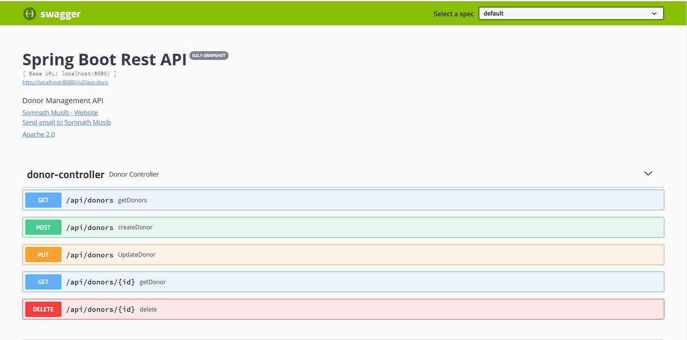
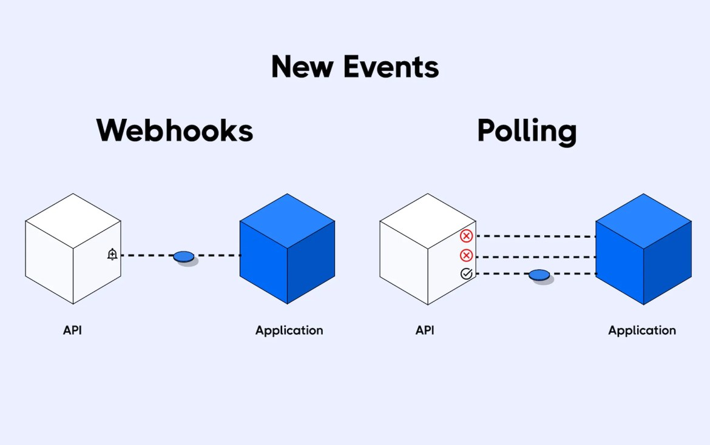
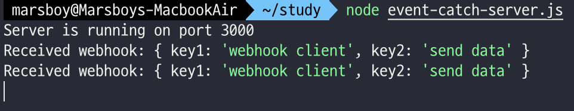

개발자로 일하다 보면 SSH로 서버에 접속하고, HTTPS 인증서를 설정하고, REST API를 설계하는 일이 일상이 된다. 하지만 이러한 기술들이 **왜** 그렇게 동작하는지, 내부에서 **어떤 일**이 일어나는지 깊이 이해하고 있는 사람은 많지 않다.

이 글에서는 SSH의 암호화 원리와 키 교환 메커니즘, nginx를 이용한 HTTPS 설정과 SSL/TLS 핸드셰이크, 그리고 REST API 원칙과 Webhook의 이벤트 기반 통신까지 -- 개발자가 알아야 할 네트워크 기초를 하나의 글로 정리한다.

---

## 1. SSH 심화


SSH(Secure Shell)는 네트워크를 통해 다른 컴퓨터에 연결하거나 로그인하고, 명령을 실행하며, 파일을 전송할 수 있는 **암호화된 네트워크 프로토콜**이다. 데이터 통신, 원격 명령어 실행, 원격 로그인 등 다양한 네트워크 서비스 사이의 데이터를 안전하게 암호화하며, 보안이 중요한 환경에서 널리 사용된다.

### 1.1 SSH의 활용 사례



SSH는 TCP 통신으로 **22번 포트**를 통해 Shell 원격 접속을 수행한다. 그렇기 때문에 호스트의 22번 포트를 함부로 열어두는 것은 위험할 수 있으며, 실제로 조직의 전산팀에 22번 포트 개방을 요청하면 반려당하는 경우도 꽤 있다. SSH가 활용되는 대표적인 사례는 다음과 같다.

- **원격 로그인**: SSH를 통해 원격 서버에 로그인하고 명령어를 실행할 수 있다.
- **파일 전송**: SCP(Secure Copy)나 SFTP(Secure File Transfer Protocol)를 사용하여 파일을 안전하게 전송할 수 있다.
- **포트 포워딩**: SSH의 `-L` 옵션을 통해 로컬 포트 포워딩을 수행할 수 있다.
- **VPN 대체**: 프록시 서버에 SSH를 연결함으로써 VPN을 대체하는 용도로 사용할 수 있다.

### 1.2 SSH 연결 과정



SSH 연결이 이루어지는 과정을 단계별로 살펴보면 다음과 같다.

1. 클라이언트에서 서버로 연결을 시도한다.
2. 서버에서 **공개 키(public key)**를 클라이언트에 전달한다.
3. 해당 키를 검증한 뒤, 서버와 클라이언트는 **세션 키**를 교환하여 암호화된 터널을 연다.
4. 클라이언트에서 **비밀번호(password)** 또는 **개인 키(private key)**를 통해 인증을 진행한다.

기본적인 SSH 연결 명령어는 다음과 같다.

```bash
ssh username@192.168.0.10
```

위 명령어는 `192.168.0.10` IP를 가진 서버에 `username`으로 연결하겠다는 뜻이다. 22번 포트가 막혀 있거나 username이 존재하지 않으면 연결이 차단된다.

연결이 되어 서버에서 공개 키를 받으면, 세션 키 교환을 통해 안전하게 정보를 주고받는다. 이때 비밀번호를 입력하거나 `-i` 옵션으로 개인 키를 지정하여 인증할 수 있다.

```bash
ssh username@192.168.0.10 -i ~/.ssh/username.pem
```

이 외에도 다양한 파라미터를 활용할 수 있다. 원격 서버에서 GUI를 사용하려면 `-X` 파라미터, 서버의 SSH 포트가 22번이 아닌 경우 `-p` 파라미터를 사용한다.

**로컬 포트 포워딩:**

```bash
ssh -L 8080:remote_host:80 username@hostname
```

**원격 포트 포워딩:**

```bash
ssh -R 8080:local_host:80 username@hostname
```

### 1.3 .ssh 디렉토리 구조

Linux 사용자라면 `~/.ssh/` 디렉토리에 SSH 관련 파일들이 저장되어 있다. 주요 파일과 역할은 다음과 같다.

| 파일 | 설명 |
|------|------|
| `id_rsa` | 기본 RSA 개인 키 파일. 절대 유출하면 안 된다. |
| `id_rsa.pub` | 기본 RSA 공개 키 파일. `~/.ssh/authorized_keys`에 추가되어 클라이언트 인증에 사용된다. |
| `authorized_keys` | 서버 측에서 클라이언트의 공개 키를 저장하는 파일. 여기에 등록된 클라이언트만 서버에 접근할 수 있다. |
| `known_hosts` | 접근한 적 있는 호스트의 공개 키를 저장하는 파일. |

`authorized_keys`는 공개 키만 한 줄씩 저장하지만, `known_hosts`는 호스트 주소, IP, 알고리즘, 공개 키 등 전체 정보가 기록된다. SSH 연결 시 서버에서 전달하는 공개 키가 바로 클라이언트의 `~/.ssh/known_hosts`에 기록되는 것이다.

### 1.4 .pem 키와 SSH 암호화 방식

클라우드 서비스(AWS EC2, GCP 등)를 사용할 때 우리는 `.pem` 키 파일 **하나만** 받게 된다. 여기서 의문이 생긴다. SSH 연결에는 클라이언트와 서버 양쪽에 개인 키와 공개 키가 있어야 하는 것 아닌가? 서버의 `~/.ssh/authorized_keys`에는 클라이언트의 공개 키를 저장하는데, 사용자는 어떻게 개인 키 하나만으로 SSH 연결이 가능한 것일까?

이에 대한 답은 **Diffie-Hellman 알고리즘**과 **Challenge-Response Authentication**에 있다.

**Diffie-Hellman 알고리즘**은 암호화되지 않은 통신망을 통해 두 당사자가 공통의 비밀 키를 공유할 수 있도록 하는 키 교환 방식이다. 이를 통해 임시 키를 생성하고 서로 비교하는 과정을 거친다.

**Challenge-Response Authentication**은 다음과 같은 단계로 진행된다.



1. 클라이언트가 접속을 시도하면 서버가 **challenge**(난수 또는 임의의 데이터)를 전송한다.
2. 클라이언트는 `.pem` 키를 사용하여 **디지털 서명**을 생성한 뒤 서버에 전달한다.
3. 서버는 `~/.ssh/authorized_keys`에 저장된 클라이언트의 공개 키로 서명된 응답을 **검증**한다.
4. 검증에 성공하면 안전한 세션을 열어 SSH 연결을 수행한다.

<!-- TODO: SSH 핸드셰이크 전체 흐름을 나타내는 시퀀스 다이어그램 추가 -->

### 1.5 SSH config 팁

자주 접속하는 서버가 여럿이라면 `~/.ssh/config` 파일을 활용하면 편리하다. 예를 들어 다음과 같이 설정할 수 있다.

```bash
# ~/.ssh/config
Host my-server
    HostName 192.168.0.10
    User username
    IdentityFile ~/.ssh/username.pem
    Port 22

Host dev-server
    HostName 10.0.1.50
    User dev
    IdentityFile ~/.ssh/dev.pem
    ForwardAgent yes
```

이렇게 설정해 두면 `ssh my-server`만으로 간편하게 접속할 수 있으며, 포트 번호나 키 파일 경로를 매번 입력할 필요가 없어진다.

---

## 2. nginx로 HTTPS 설정하기



웹사이트를 배포할 때, 클라우드 서버에서 애플리케이션을 실행하면 기본적으로 `http://IP:PORT` 형태로 접근하게 된다. 깔끔한 도메인과 HTTPS 보안 연결을 위해서는 **웹 서버**의 도움이 필요하다. 이 섹션에서는 nginx를 이용한 HTTPS 설정과 리버스 프록시 구성 방법을 다룬다.

### 2.1 웹 서버와 애플리케이션 서버

웹 애플리케이션의 요청 처리 흐름을 이해하기 위해, 먼저 **웹 서버(Web Server)**와 **애플리케이션 서버(Application Server)**의 차이를 살펴보자.



**웹 서버**는 HTTP 요청에 따라 HTML, CSS, JS 등 정적 리소스를 제공하는 프로그램이다. **애플리케이션 서버**는 데이터베이스 액세스, 비즈니스 로직 처리 등 복잡한 기능을 담당한다. 이 둘이 합쳐진 구조를 **WAS(Web Application Server)**라고 부르며, Java 계열의 Spring에서는 **Apache Tomcat**이 대표적이다.

전체적인 요청 흐름은 다음과 같다.

1. 브라우저가 URL로 DNS를 통해 서버의 IP 주소를 찾는다.
2. 브라우저가 서버에 HTTP 요청을 보낸다.
3. **웹 서버가 요청을 애플리케이션 서버로 전달한다.**
4. 애플리케이션 서버가 비즈니스 로직을 처리하고 결과를 웹 서버에 반환한다.
5. 웹 서버가 브라우저에 응답을 반환한다.

Spring처럼 웹 서버를 내장하고 있는 프레임워크도 있지만, Python의 Flask/Django나 Node.js의 Express/NestJS 등은 추가적인 프록시가 필요한 경우가 많다. 이때 **nginx**를 **리버스 프록시 서버**로 사용하여 HTTPS 및 포트 포워딩 기능을 제공한다.

### 2.2 HTTPS와 SSL/TLS

HTTPS는 HTTP에 보안 레이어를 추가한 프로토콜이다. SSL/TLS 계층을 통해 데이터를 암호화하며, 이 레이어가 있어야만 `https://`로 시작하는 안전한 도메인을 가질 수 있다.



HTTP 요청은 평문으로 전송되어 쉽게 엿볼 수 있는 구조이기 때문에, SSL/TLS 레이어를 통한 암호화가 필수적이다.

<!-- TODO: TLS 핸드셰이크 흐름도 추가 (ClientHello -> ServerHello -> 인증서 교환 -> 키 교환 -> 암호화 통신) -->

### 2.3 Let's Encrypt와 Certbot으로 인증서 발급

실제로 nginx에 HTTPS를 적용하는 과정을 단계별로 살펴보자. 여기서는 **Let's Encrypt**의 무료 TLS 인증서를 **Certbot**으로 발급받는 방법을 다룬다. 인증서의 만료 기한은 90일이므로 주기적으로 재발급해야 한다. Ubuntu 기준으로 설명한다.

**nginx 설치:**

```bash
# apt 패키지 업데이트
sudo apt update
sudo apt upgrade

# nginx 설치
sudo apt install nginx

# nginx 실행
sudo service start nginx
```

**Certbot 설치 및 인증서 발급:**

```bash
# Certbot 설치
sudo apt-get update
sudo apt-get install python3-certbot-nginx

# 인증서 발급 (도메인을 본인의 것으로 변경)
sudo certbot certonly --nginx -d EXAMPLE.COM

# 발급된 인증서 확인
sudo ls /etc/letsencrypt/live/EXAMPLE.COM
```

인증서는 `/etc/letsencrypt/live/EXAMPLE.COM/` 경로에 `.pem` 파일 4개로 저장된다.

### 2.4 nginx 설정 파일 작성

먼저 nginx 메인 설정 파일에서 사이트별 설정을 include하도록 확인한다.

```bash
vi /etc/nginx/nginx.conf
```

```nginx
http {
    # ...
    ##
    # Virtual Host Configs
    ##

    include /etc/nginx/conf.d/*.conf;
    include /etc/nginx/sites-enabled/*;
}
```

심볼릭 링크를 생성하고 설정 파일을 작성한다.

```bash
# 심볼릭 링크 생성
sudo ln -s /etc/nginx/sites-available/test.conf /etc/nginx/sites-enabled

# 설정 파일 생성
sudo vi /etc/nginx/sites-available/test.conf
```

핵심 설정 파일의 내용은 다음과 같다. 도메인과 포트를 본인의 환경에 맞게 수정해야 한다.

```nginx
# 80번 포트(HTTP) -> HTTPS 리다이렉트
server {
  listen 80;
  server_name EXAMPLE.COM;
  return 301 https://EXAMPLE.COM$request_uri;
}

# 443번 포트(HTTPS) 설정
server {
  listen 443 ssl http2;
  server_name EXAMPLE.COM;

  # SSL 인증서 경로
  ssl_certificate /etc/letsencrypt/live/EXAMPLE.COM/fullchain.pem;
  ssl_certificate_key /etc/letsencrypt/live/EXAMPLE.COM/privkey.pem;

  location / {
    proxy_pass http://localhost:3000;  # 애플리케이션 서버 포트
    proxy_set_header Host $http_host;
    proxy_set_header X-Real-IP $remote_addr;
    proxy_set_header X-Forwarded-For $proxy_add_x_forwarded_for;
    proxy_set_header X-Forwarded-Proto $scheme;
  }
}
```

설정이 끝나면 문법을 확인하고 nginx를 재시작한다.

```bash
# 설정 파일 문법 검증
sudo nginx -t

# nginx 재시작
sudo service nginx restart

# nginx 상태 확인
systemctl status nginx.service
```

정상적으로 실행되고 있다면 초록색 `active` 상태를 확인할 수 있다.

### 2.5 인증서 관리

Let's Encrypt 인증서는 90일 만료이므로 주기적인 갱신이 필요하다. 관련 명령어는 다음과 같다.

```bash
# 인증서 목록 확인
sudo certbot certificates

# 인증서 자동 갱신 테스트
sudo certbot renew --dry-run

# 인증서 삭제
sudo certbot delete --cert-name EXAMPLE.COM
```

실무에서는 `crontab`이나 `systemd timer`를 사용하여 자동 갱신을 설정하는 것이 일반적이다.

---

## 3. API 패러다임: REST, Webhook, WebSocket

### 3.1 API란?

API(Application Programming Interface)는 소프트웨어 간의 상호 작용을 위한 인터페이스이다. 예를 들어 날씨 앱은 기상청 서버와 API를 통해 데이터를 주고받는다. 데이터를 송수신하는 방법에는 REST API, Webhook, WebSocket 등 다양한 방식이 있는데, 이 섹션에서는 각각의 특징과 차이를 다룬다.

### 3.2 RESTful API 원칙



**REST(Representational State Transfer)**는 API를 설계할 때 따르는 아키텍처 스타일이다. 프로토콜이 아닌 **관습(convention)**이며, 이 관습을 지킨 API를 RESTful API라고 부른다.

#### 균일한 인터페이스 (Uniform Interface)

RESTful API의 핵심은 **리소스에 대해 식별 가능해야 한다**는 것이다. URL과 HTTP 메서드만으로 해당 API가 어떤 동작을 하는지 직관적으로 파악할 수 있어야 한다.



위 Swagger 문서를 보면 URL이 모두 `donors`라는 리소스로 통일되어 있고, HTTP 메서드(GET, POST, PUT, DELETE)만 다르다. 동사를 URL에서 제거하고 리소스를 명시하는 것이 RESTful 설계의 기본이다.

```
GET    /api/users/15          # userId가 15인 사용자 조회
GET    /api/users?name=marsboy # name이 marsboy인 사용자 검색
POST   /api/users             # 새로운 사용자 생성
PUT    /api/users/15          # userId 15번 사용자 정보 수정
DELETE /api/users/15          # userId 15번 사용자 삭제
```

첫 번째 방식은 **Path Variable**, 두 번째 방식은 **Query Parameter**로, 리소스를 더 세밀하게 식별하는 데 사용된다.

#### 무상태 (Stateless)

모든 클라이언트 요청은 다른 요청과 **독립적**으로 서버에서 처리된다. 서버는 매번 요청을 완전히 이해하고 처리할 수 있어야 하며, 이전 요청의 상태에 의존하지 않는다. 이를 통해 다음과 같은 이점을 얻을 수 있다.

- **확장성**: 무상태와 캐싱을 통해 시스템을 효율적으로 확장할 수 있다.
- **유연성**: 클라이언트-서버가 완전히 분리되어 각각 독립적으로 발전할 수 있다.
- **독립성**: 다양한 프로그래밍 언어로 클라이언트와 서버를 작성할 수 있으며, 통신에 영향 없이 기술 스택을 변경할 수 있다.

#### HTTP 상태 코드

RESTful API에서 상태 코드 역시 중요한 관습이다.

| 범위 | 의미 | 대표 코드 |
|------|------|-----------|
| 2xx | 성공 | 200 OK, 201 Created, 204 No Content |
| 3xx | 리다이렉션 | 301 Moved Permanently, 304 Not Modified |
| 4xx | 클라이언트 오류 | 400 Bad Request, 401 Unauthorized, 404 Not Found |
| 5xx | 서버 오류 | 500 Internal Server Error, 503 Service Unavailable |

관습적인 상태 코드 사용은 프론트엔드-백엔드 간 협업에서 소통 비용을 크게 줄여준다.

### 3.3 Webhook: 이벤트 기반 통신


> A webhook is an event-based API endpoint responsible for triggering internal functions to look up information in real-time when a specific event occurs. -- snipcart

**Webhook**은 **이벤트 기반**의 API endpoint이다. 일반적인 REST API가 클라이언트에서 서버로 요청을 보내는 **Pull** 방식이라면, Webhook은 서버에서 특정 이벤트가 발생했을 때 클라이언트에게 데이터를 **Push**하는 방식이다.

#### Polling vs Webhook



| 항목 | Polling | Webhook |
|------|---------|---------|
| **통신 모델** | Pull (클라이언트 주도) | Push (서버 주도) |
| **요청 주체** | 클라이언트가 주기적으로 요청 | 이벤트 발생 시 서버가 자동 전송 |
| **리소스 효율** | 비효율적 (변경 없어도 요청) | 효율적 (변경 있을 때만 전송) |
| **실시간성** | interval에 의한 지연 발생 | 이벤트 발생 즉시 알림 |

#### Webhook 활용 사례

- **SNS 업데이트**: 새로운 게시글 등록 시 알림 발송
- **주문 및 결제**: 주문 생성 시 백엔드로 주문 정보 자동 전달
- **실시간 데이터**: 주식 시세, 날씨 업데이트, 실시간 뉴스 등
- **채팅 봇**: Slack, Discord 등의 Webhook API를 활용한 알림 시스템

#### Webhook 구현 예제 (Node.js)

간단한 Webhook 시스템을 두 개의 서버로 구현할 수 있다. **이벤트를 수신하는 서버(event-catch-server)**와 **이벤트를 발생시키는 서버(event-make-server)**로 나뉜다.

```bash
# 기본 세팅
npm init -y
npm install express body-parser axios
```

**event-catch-server.js** (이벤트 수신 서버):

```javascript
const express = require("express");
const bodyParser = require("body-parser");

const app = express();
const PORT = 3000;

app.use(bodyParser.json());

app.post("/webhook", (req, res) => {
  console.log("Received webhook:", req.body);
  // 내부 비즈니스 로직 처리 ...
  res.sendStatus(200);
});

app.listen(PORT, () => {
  console.log(`Server is running on port ${PORT}`);
});
```

**event-make-server.js** (이벤트 발생 서버):

```javascript
const axios = require("axios");

const webhookUrl = "http://localhost:3000/webhook";
const payload = {
  key1: "webhook client",
  key2: "send data",
};

async function getWebhookData(webhookUrl, payload) {
  console.log(await axios.post(webhookUrl, payload));
}

getWebhookData(webhookUrl, payload);
```



이벤트 수신 서버를 실행한 뒤 이벤트 발생 스크립트를 실행하면 데이터가 정상적으로 전달되는 것을 확인할 수 있다. 핵심은 Polling 방식에서는 요청 주체가 클라이언트였지만, Webhook 방식에서는 **서버가 요청 주체**가 된다는 점이다.

### 3.4 REST vs Webhook vs WebSocket 비교

<!-- TODO: REST vs Webhook vs WebSocket 비교 다이어그램 추가 -->

| 항목 | REST API | Webhook | WebSocket |
|------|----------|---------|-----------|
| **통신 방향** | 클라이언트 -> 서버 (단방향) | 서버 -> 클라이언트 (단방향) | 양방향 (Full-duplex) |
| **연결 방식** | 요청마다 연결/해제 | HTTP 콜백 (일회성) | 연결 유지 (Persistent) |
| **프로토콜** | HTTP/HTTPS | HTTP/HTTPS | ws:// / wss:// |
| **적합한 용도** | CRUD 작업, 데이터 조회/생성 | 이벤트 알림, 비동기 통지 | 실시간 채팅, 게임, 라이브 피드 |
| **상태 관리** | Stateless | Stateless | Stateful |
| **리소스 효율** | 요청당 오버헤드 발생 | 이벤트 시에만 통신 | 연결 유지 비용 있음 |

**선택 가이드:**
- 일반적인 CRUD 작업 -> **REST API**
- 외부 이벤트에 대한 실시간 알림이 필요할 때 -> **Webhook**
- 양방향 실시간 통신이 필요할 때 (채팅, 게임) -> **WebSocket**

---

## 마치며

이 글에서 다룬 내용을 간략히 정리하면 다음과 같다.

- **SSH**는 단순한 원격 접속 도구가 아니라, Diffie-Hellman 키 교환과 Challenge-Response 인증이라는 견고한 암호화 메커니즘 위에 동작하는 프로토콜이다.
- **HTTPS**는 SSL/TLS 레이어를 통해 HTTP 통신을 암호화하며, nginx와 Let's Encrypt를 활용하면 무료로 적용할 수 있다.
- **REST API**는 프로토콜이 아닌 아키텍처 관습이며, 균일한 인터페이스와 무상태 원칙을 지키면 확장성과 협업 효율이 높아진다.
- **Webhook**은 Polling의 한계를 극복한 이벤트 기반 Push 방식이며, 적재적소에 REST API, Webhook, WebSocket을 선택하여 사용하는 것이 중요하다.

### 참고 자료

- [Wikipedia - Challenge-Response Authentication](https://en.wikipedia.org/wiki/Challenge%E2%80%93response_authentication)
- [AWS - 웹 서버와 애플리케이션 서버의 차이점](https://aws.amazon.com/ko/compare/the-difference-between-web-server-and-application-server/)
- [AWS - RESTful API란 무엇인가요?](https://aws.amazon.com/ko/what-is/restful-api/)
- [Snipcart - Webhook vs. API: How Do They Compare?](https://snipcart.com/blog/webhook-vs-api)
- [Slack - Incoming Webhooks](https://api.slack.com/messaging/webhooks)
- [Discord - Webhook Developer Docs](https://discord.com/developers/docs/resources/webhook)
