모니터링 시스템은 서비스 운영의 근간이다. 서비스가 정상적으로 동작하고 있는지, 어떤 문제가 발생하고 있는지를 실시간으로 파악할 수 있어야 한다. 이 글에서는 관측성(Observability)의 세 가지 축에서 출발하여, Prometheus와 Grafana를 활용한 모니터링 시스템 구축 방법을 단계별로 다룬다. node-exporter를 이용한 리눅스 시스템 모니터링, Redis 모니터링, 그리고 100대 이상의 노드가 있는 HPC 클러스터 환경에서의 대시보드 구축까지 실무 경험을 바탕으로 정리한다.

---

## 1. 관측성의 세 가지 축 (Three Pillars of Observability)

<!-- TODO: 세 가지 축(Metrics, Logs, Traces) 관계를 보여주는 다이어그램 추가 -->

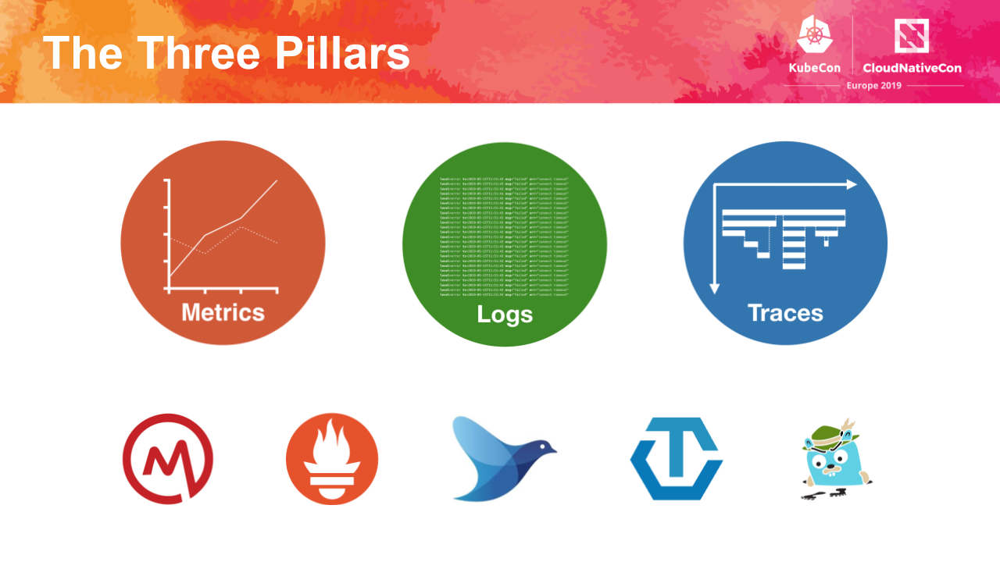

관측성의 세 가지 축이란 **메트릭(Metrics)**, **로그(Logs)**, **트레이스(Traces)**를 말한다. AWS, IBM, Elastic 등 다양한 벤더의 공식 문서에서도 이 세 가지 지표의 중요성을 꾸준히 강조한다.

요약하면 다음과 같다.

| 구분 | 정의 | 예시 |
|------|------|------|
| **메트릭** | 시스템 상태를 시간에 따라 숫자 시계열로 표현 | CPU 사용률, 메모리 사용량, 네트워크 I/O |
| **로그** | 특정 이벤트와 관련된 타임스탬프가 지정된 정형/비정형 데이터 | HTTP 요청 기록, 에러 메시지, crontab 실행 결과 |
| **트레이스** | 하나의 요청이 시스템을 통과하는 전체 여정 | API 호출 경로, 서비스 간 호출 시간 |

### 1.1 메트릭 (Metrics)

메트릭은 **시스템 상태를 시간에 따라 숫자 시계열**로 표현한 것이다. 주로 CPU 사용률, 메모리 사용량, 네트워크 입출력 등의 지표를 다루며, 각각의 지표는 `cpu_utilization`, `memory_utilization`, `network_io` 등의 이름으로 매초, 매분 숫자를 남긴다.

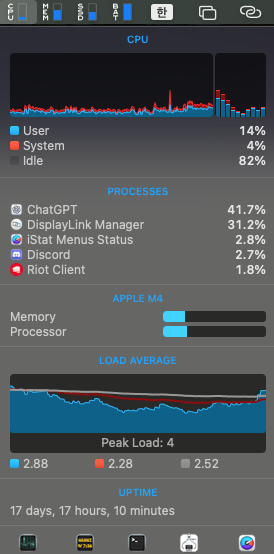

CPU와 메모리 관리는 서비스 안정성의 핵심이다. 간단히 정리하면 다음과 같다.

- **CPU 100%** : 대기열이 폭증하면서 타임아웃과 에러가 증가하고, 심하면 서버가 다운된다.
- **Memory 100%** : OS 레벨의 **OOM(Out-of-Memory) Killer**가 프로세스를 SIGKILL로 강제 종료한다. K8s 환경에서 Pod가 뜨지 않는 문제의 원인이 되기도 한다.

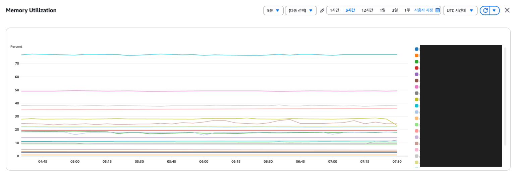

AWS에서는 EC2, Fargate 같은 컴퓨팅 서비스를 띄울 때 CloudWatch를 통해 메트릭을 자동으로 수집해준다. 온프레미스 환경에서는 **Prometheus**가 이 역할을 수행한다. exporter가 메트릭을 노출하고, Prometheus가 이를 수집하며, Grafana가 시각화하는 구조이다.

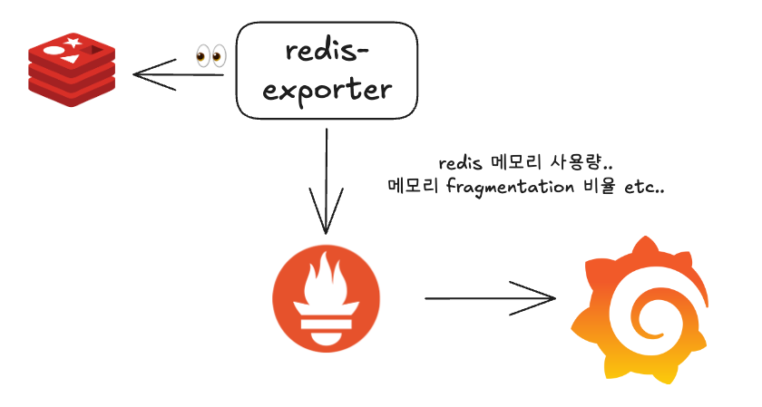

### 1.2 로그 (Logs)

로그는 **사건의 세부 기록**이다. 타임스탬프, 레벨, 메시지, 필드 등으로 구성되며, 개발자가 가장 먼저 접하게 되는 지표이기도 하다.

로그의 대표적인 활용 사례는 다음과 같다.

- **HTTP 요청 기록**: IP, User-Agent, 응답 시간 등을 기록하여 국가별 접근 패턴이나 에이전트별 트래픽을 분석
- **배치 작업 기록**: crontab 수행 결과, 정상 처리 여부 확인
- **도메인별 감사 로그**: 특정 도메인(예: users)에 접근할 때 반드시 기록

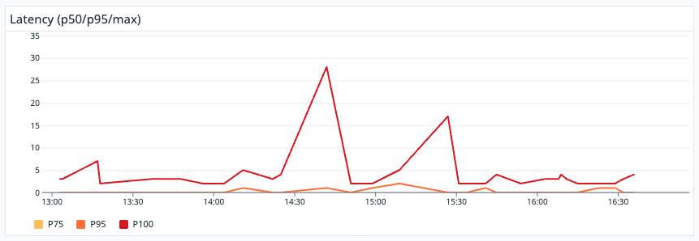

위 그래프는 HTTP Request의 응답 시간(`@responseTime`)을 모아 서버 레이턴시를 시각화한 것이다. 이처럼 로그 데이터도 관측성을 위해 적극 활용할 수 있다.

### 1.3 트레이스 (Traces)

트레이스는 **하나의 요청이 시스템을 통과하는 전체 여정**을 기록한다. 사용자가 `/orders`를 호출했다면, 프론트 -> API -> DB/캐시 -> 외부 결제 API -> 메시지 큐 같은 모든 구간의 시간과 인과관계를 한눈에 보여준다.

트레이스의 핵심 용어를 정리하면 다음과 같다.

- **Trace**: 요청 단위의 전체 실행 흐름. 고유한 `trace_id`로 식별
- **Span**: Trace를 이루는 작업 단위. "컨트롤러 처리", "DB 쿼리", "외부 HTTP 호출" 같은 한 구간
- **Root Span**: 가장 바깥(시작) 스팬. 보통 "HTTP POST /orders"처럼 사용자 시나리오를 대표
- **Span Kind**: 스팬의 역할. `SERVER`(수신), `CLIENT`(외부호출), `INTERNAL`(내부 로직)

Span에 들어가는 정보(Anatomy)에는 이름, 시작/종료 시각(duration), 속성(attributes), 이벤트(event), 상태(status: OK/ERROR), 관계(부모-자식/링크) 등이 있다.

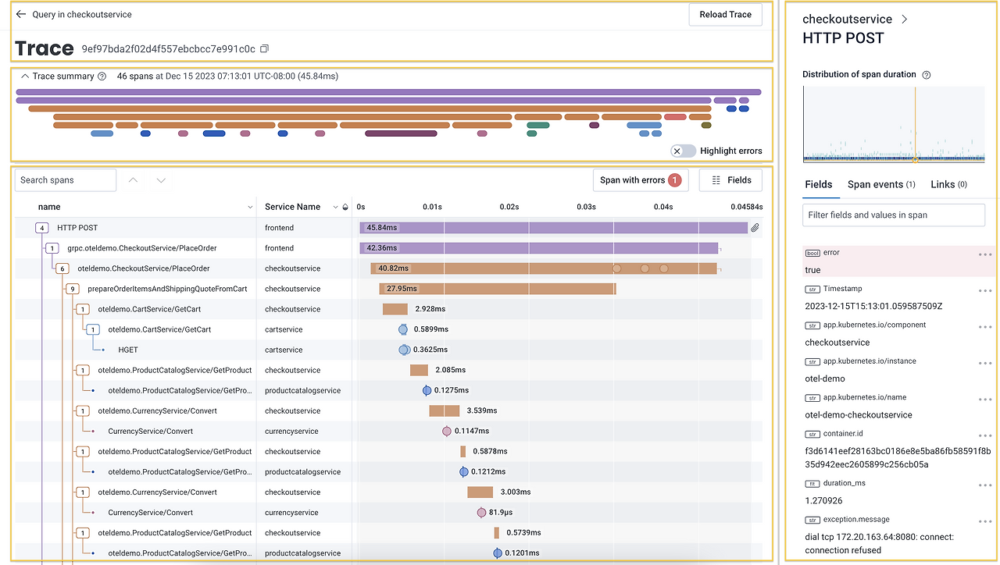

위와 같이 스팬의 부모-자식 관계를 워터폴 구조로 시각화하여, 각 구간에서 소요된 시간을 한눈에 확인할 수 있다. 이를 통해 병목 구간을 빠르게 파악하고 원인을 추적할 수 있다.

### 1.4 세 지표의 상호 보완 관계

세 지표를 함께 활용하면 높은 수준의 관측성을 유지할 수 있다.

- **메트릭**으로 "무언가 이상하다"는 것을 감지하고
- **로그**로 "어떤 이벤트가 발생했는지"를 파악하고
- **트레이스**로 "어느 구간에서 문제가 생겼는지"를 추적한다

참고로, CNCF에서 관리하는 **OpenTelemetry(OTel)**는 이 세 가지 신호를 벤더 중립적으로 계측, 수집, 전송할 수 있게 해주는 표준(API/SDK + Collector + OTLP)이다. Datadog, AWS 등의 모니터링 도구들은 이 OTel 표준을 기반으로 써드파티를 개발하고 있다.

> **주의**: 민감 정보(PII 등)가 메트릭, 로그, 트레이스에 포함되지 않도록 마스킹하거나 삭제해야 한다.

---

## 2. Prometheus 아키텍처

<!-- TODO: Prometheus Pull 모델 흐름도 다이어그램 추가 -->

Prometheus는 오픈 소스 시스템 모니터링 도구로, **시계열 데이터(time-series data)**를 수집하고 저장하며, 쿼리하는 데 중점을 둔다. 주로 단독으로 쓰이지 않고, exporter 및 Grafana와 함께 사용한다.

### 2.1 메트릭 유형 (Metric Types)

Prometheus에서 다루는 메트릭 유형은 네 가지이다.

| 유형 | 설명 | 예시 |
|------|------|------|
| **Counter** | 증가만 가능한 값 | 요청 횟수 (`http_requests_total`) |
| **Gauge** | 증가/감소 모두 가능 | 현재 메모리 사용량 (`node_memory_Active_bytes`) |
| **Histogram** | 관찰값을 버킷으로 나눠 집계 | 응답 시간 분포 (`http_request_duration_seconds`) |
| **Summary** | 특정 기간 동안 관찰값의 요약 통계 | 요청 시간의 백분위 수 |

exporter는 이러한 메트릭을 HTTP 엔드포인트(`/metrics`)로 노출하고, Prometheus가 주기적으로 이를 가져간다(Pull).

### 2.2 아키텍처 개요


Prometheus의 아키텍처를 정리하면 다음과 같다.

1. **Exporter**가 대상 시스템의 메트릭을 `/metrics` 엔드포인트로 노출
2. **Prometheus Server**가 `prometheus.yml`에 설정된 targets를 주기적으로 스크래핑하여 시계열 DB(TSDB)에 저장
3. **PromQL**을 사용하여 저장된 데이터를 쿼리
4. **Grafana** 등의 시각화 도구가 PromQL을 활용하여 대시보드를 구성
5. **Alertmanager**를 통해 특정 조건에 대한 알림 전송

핵심은 **Pull 모델**이다. Prometheus가 직접 타겟을 찾아가서 데이터를 가져오는 구조이기 때문에, 모니터링 대상을 쉽게 추가하거나 제거할 수 있다.

### 2.3 서비스 디스커버리와 Exporter 생태계

Prometheus의 또 다른 강점은 다양한 exporter 생태계이다. DockerHub에서 `exporter`로 검색하면 redis, node, mongodb, nginx 등 다양한 서버용 exporter를 확인할 수 있다.

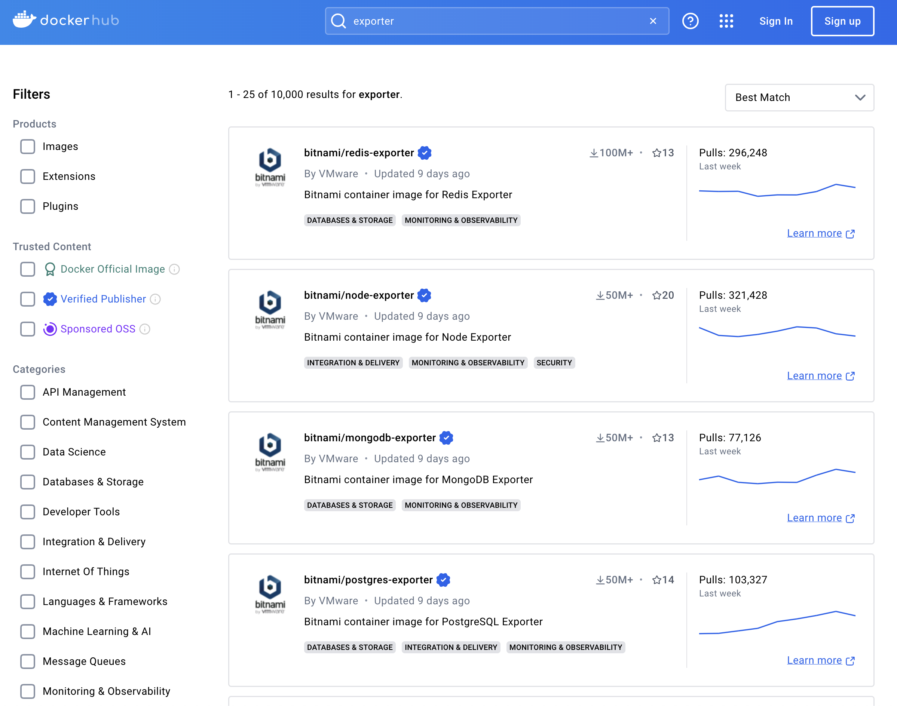

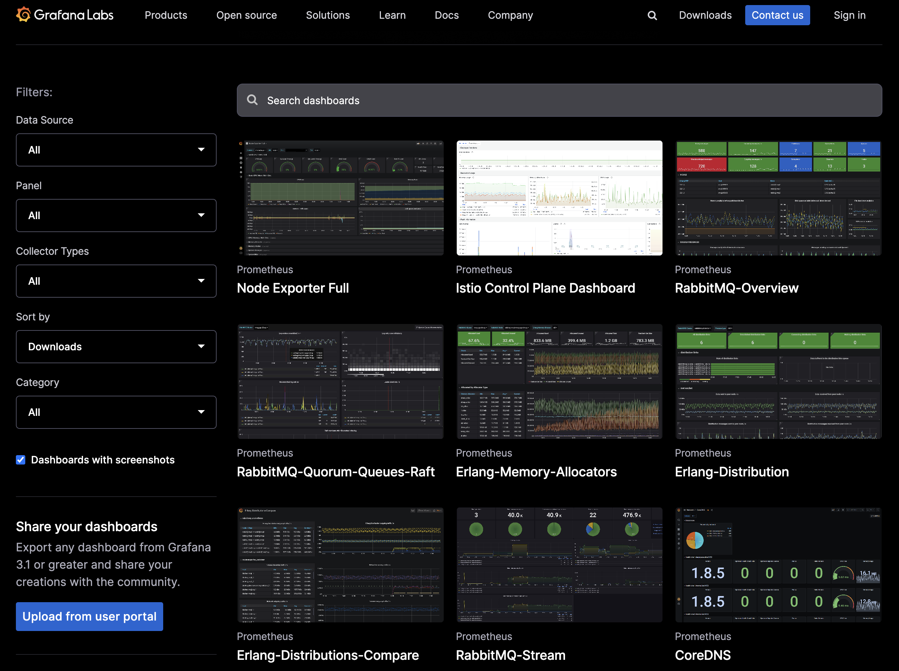

이처럼 `exporter - Prometheus - Grafana` 조합은 시계열 데이터 기반 모니터링의 표준 스택이라 할 수 있다. 로그 수집이 주 목적이라면 ELK 스택(Elasticsearch, Logstash, Kibana)도 좋은 선택이다.

### 2.4 PromQL 기초

Prometheus에 저장된 데이터를 조회할 때는 PromQL을 사용한다. 기본적인 쿼리 예시는 다음과 같다.

```promql
# 현재 CPU 사용률 (1분 평균)
100 - (avg by(instance) (rate(node_cpu_seconds_total{mode="idle"}[1m])) * 100)

# 메모리 사용률
(1 - node_memory_MemAvailable_bytes / node_memory_MemTotal_bytes) * 100

# 특정 job의 up 상태 확인
up{job="monitoring-item"}
```

Docker로 Prometheus를 간단히 실행하여 PromQL을 테스트해볼 수 있다.

```bash
docker run -p 9090:9090 prom/prometheus
```

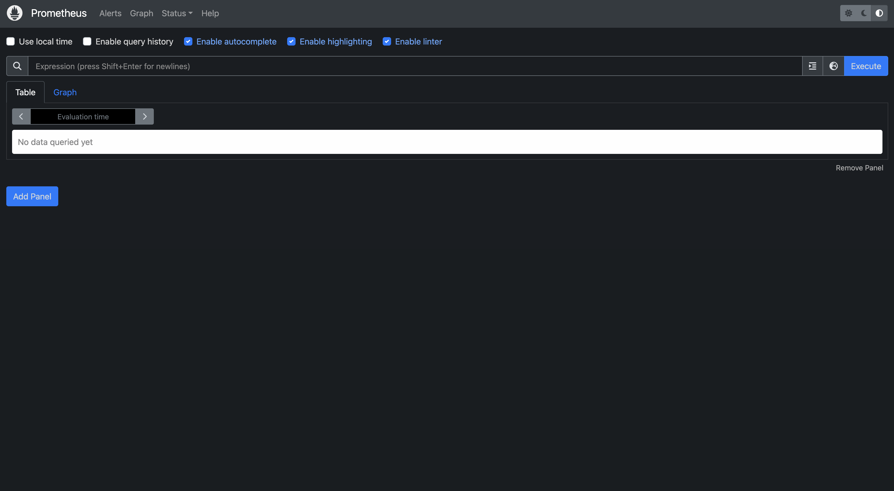

---

## 3. node-exporter로 시스템 모니터링

### 3.1 아키텍처

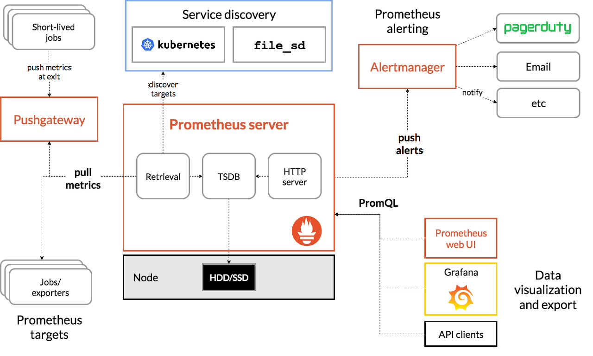

`exporter -> Prometheus -> Grafana` 순서로 데이터가 흘러가는 구조이다. docker-compose를 사용하여 세 서비스를 함께 띄운다.

### 3.2 docker-compose.yml 구성

```yaml
version: "3"

networks:
  monitoring:
    driver: bridge

services:
  prometheus:
    image: prom/prometheus
    container_name: prometheus
    volumes:
      - ./prometheus.yml:/etc/prometheus/prometheus.yml
      - prometheus-data:/prometheus
    ports:
      - 9090:9090
    command:
      - "--storage.tsdb.path=/prometheus"
      - "--config.file=/etc/prometheus/prometheus.yml"
    restart: always
    networks:
      - monitoring

  grafana:
    image: grafana/grafana
    container_name: grafana
    ports:
      - 3000:3000
    volumes:
      - grafana-data:/var/lib/grafana
      - ./grafana/provisioning/:/etc/grafana/provisioning/
    restart: always
    depends_on:
      - prometheus
    networks:
      - monitoring

  node_exporter:
    image: prom/node-exporter
    volumes:
      - /proc:/host/proc:ro
      - /sys:/host/sys:ro
      - /:/rootfs:ro
    command:
      - "--path.procfs=/host/proc"
      - "--path.rootfs=/rootfs"
      - "--path.sysfs=/host/sys"
      - "--collector.filesystem.mount-points-exclude=^/(sys|proc|dev|host|etc)($$|/)"
    ports:
      - "9100:9100"
    networks:
      - monitoring

volumes:
  grafana-data:
  prometheus-data:
```

### 3.3 prometheus.yml 설정

```yaml
global:
  scrape_interval: 15s
  scrape_timeout: 15s
  evaluation_interval: 2m

  external_labels:
    monitor: "codelab-monitor"
    query_log_file: query_log_file.log

scrape_configs:
  - job_name: "monitoring-item"
    scrape_interval: 10s
    scrape_timeout: 10s
    metrics_path: "/metrics"
    scheme: "http"

    static_configs:
      - targets: ["prometheus:9090", "node_exporter:9100"]
        labels:
          service: "monitor"
```

여기서 주의할 점은 **targets에 `localhost`가 아닌 docker-compose의 서비스명**을 사용한다는 것이다. 같은 compose 네트워크 안에서는 서비스명으로 통신할 수 있다. 다만, 호스트에서 직접 접속할 때는 `localhost:포트`로 접근 가능하다.

```bash
docker-compose up -d
```

### 3.4 node-exporter가 노출하는 메트릭

`localhost:9100/metrics`에 접속하면 node-exporter가 내보내는 메트릭을 직접 확인할 수 있다.

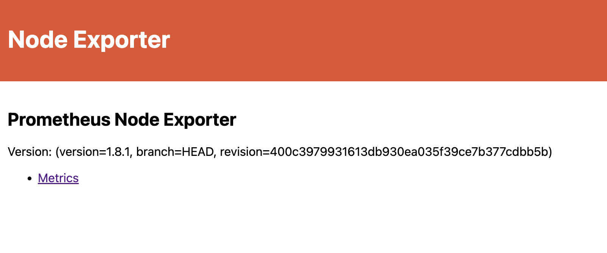

```
# HELP go_gc_duration_seconds A summary of the pause duration of garbage collection cycles.
# TYPE go_gc_duration_seconds summary
go_gc_duration_seconds{quantile="0"} 2.1209e-05
go_gc_duration_seconds{quantile="0.25"} 5.3708e-05
...
# HELP go_goroutines Number of goroutines that currently exist.
# TYPE go_goroutines gauge
go_goroutines 9
```

### 3.5 Grafana 데이터소스 연결

Grafana(`localhost:3000`)에 접속하여 기본 계정(admin/admin)으로 로그인한 뒤, **Connections > Data source**에서 Prometheus를 추가한다.

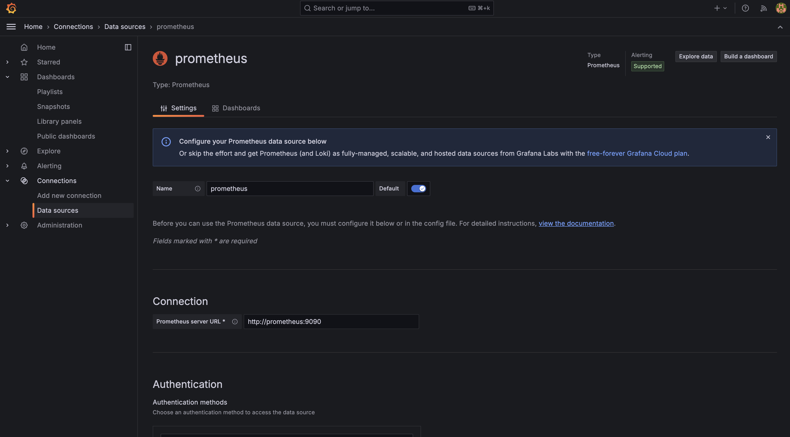

URL을 입력할 때, docker-compose 환경이므로 `http://prometheus:9090`으로 지정해야 한다.

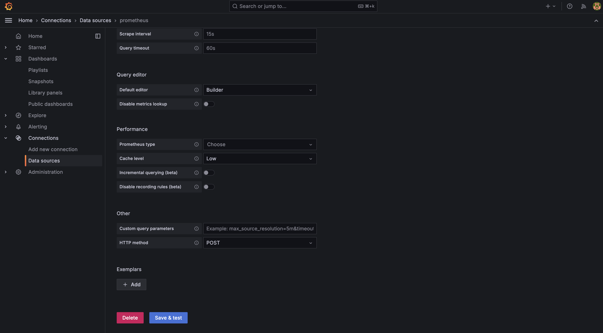

### 3.6 대시보드 Import

Grafana Labs에서 커뮤니티가 공유하는 대시보드 프리셋을 import 할 수 있다. node-exporter용으로 유명한 대시보드 ID는 **1860**이다.

- Grafana Labs Dashboards: https://grafana.com/grafana/dashboards/

**Dashboard > New > Import**에서 ID `1860`을 입력하고, Prometheus 데이터소스를 선택한다.

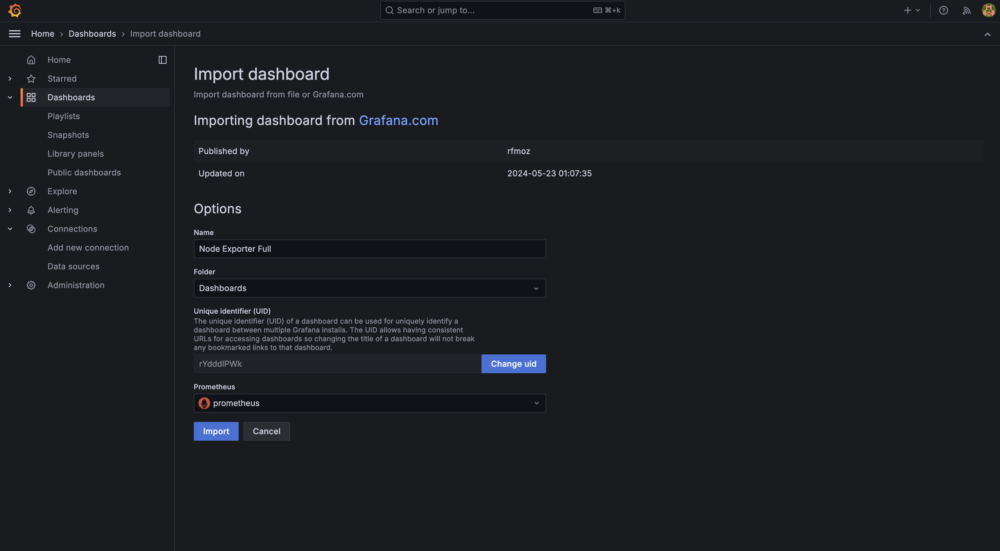

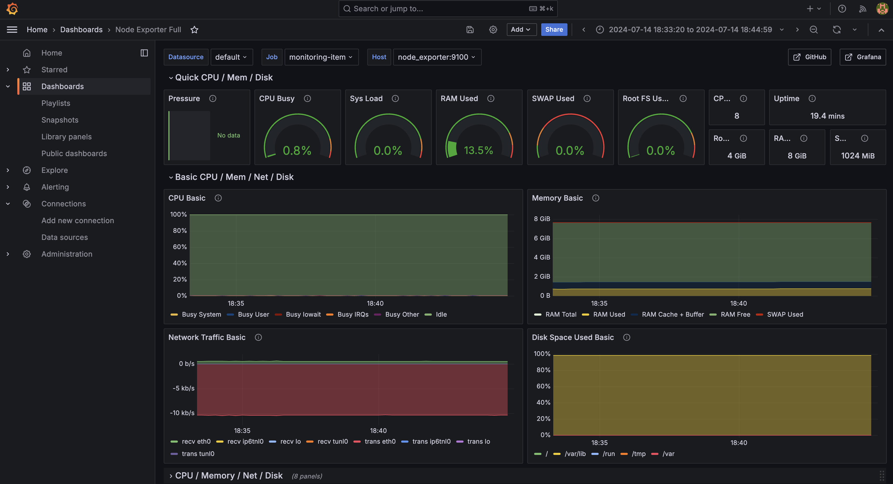

### 3.7 원격 Linux 노드에 node-exporter 설치

로컬이 아닌 원격 서버에 node-exporter를 설치하려면 직접 바이너리를 다운로드하여 systemd 서비스로 등록한다.

```bash
# 1. node-exporter 다운로드 및 설치
wget https://github.com/prometheus/node_exporter/releases/download/v1.8.1/node_exporter-1.8.1.linux-amd64.tar.gz
tar xvfz node_exporter-1.8.1.linux-amd64.tar.gz
mv node_exporter-1.8.1.linux-amd64/node_exporter /usr/local/bin/
```

```bash
# 2. systemd 서비스 파일 생성
cat <<EOF > /etc/systemd/system/node_exporter.service
[Unit]
Description=Node Exporter
Wants=network-online.target
After=network-online.target

[Service]
User=root
Group=root
Type=simple
ExecStart=/usr/local/bin/node_exporter

[Install]
WantedBy=multi-user.target
EOF
```

```bash
# 3. 서비스 활성화 및 시작
systemctl enable node_exporter.service
systemctl start node_exporter.service
systemctl status node_exporter.service
```

원격 노드에서 node-exporter가 실행되면, 모니터링 서버의 `prometheus.yml`에서 해당 노드의 IP와 포트를 targets에 추가하여 메트릭을 수집할 수 있다.

---

## 4. Redis 모니터링

### 4.1 아키텍처

Redis 모니터링의 구성은 `redis -> redis-exporter -> Prometheus -> Grafana`이다. redis-exporter가 Redis의 상태 정보를 메트릭으로 변환하여 노출하고, Prometheus가 이를 수집한다.

- Github Example: https://github.com/marsboy02/redis-exporter-monitoring

### 4.2 docker-compose.yml

```yaml
services:
  redis:
    image: "redis:latest"
    container_name: "redis"
    ports:
      - "6379:6379"

  redis-exporter:
    image: "bitnami/redis-exporter:latest"
    container_name: "redis-exporter"
    environment:
      - REDIS_ADDR=redis:6379
    ports:
      - "9121:9121"
    depends_on:
      - redis

  prometheus:
    image: "prom/prometheus:latest"
    container_name: "prometheus"
    ports:
      - "9090:9090"
    volumes:
      - ./prometheus.yml:/etc/prometheus/prometheus.yml
    depends_on:
      - redis-exporter

  grafana:
    image: "grafana/grafana:latest"
    container_name: "grafana"
    ports:
      - "3000:3000"
    depends_on:
      - prometheus
    environment:
      - GF_SECURITY_ADMIN_PASSWORD=admin
    volumes:
      - grafana-storage:/var/lib/grafana

volumes:
  grafana-storage:
```

컨테이너 의존성은 `redis <- redis-exporter <- prometheus <- grafana` 순서로 구성된다.

### 4.3 prometheus.yml

```yaml
global:
  scrape_interval: 5s

scrape_configs:
  - job_name: "redis"
    static_configs:
      - targets: ["redis-exporter:9121"]
```

`scrape_interval`을 5초로 짧게 설정하여 Redis의 변화를 빠르게 포착할 수 있도록 한다.

### 4.4 redis-exporter 메트릭 확인

`localhost:9121/metrics`에 접속하면 Redis에 관한 다양한 메트릭을 확인할 수 있다.

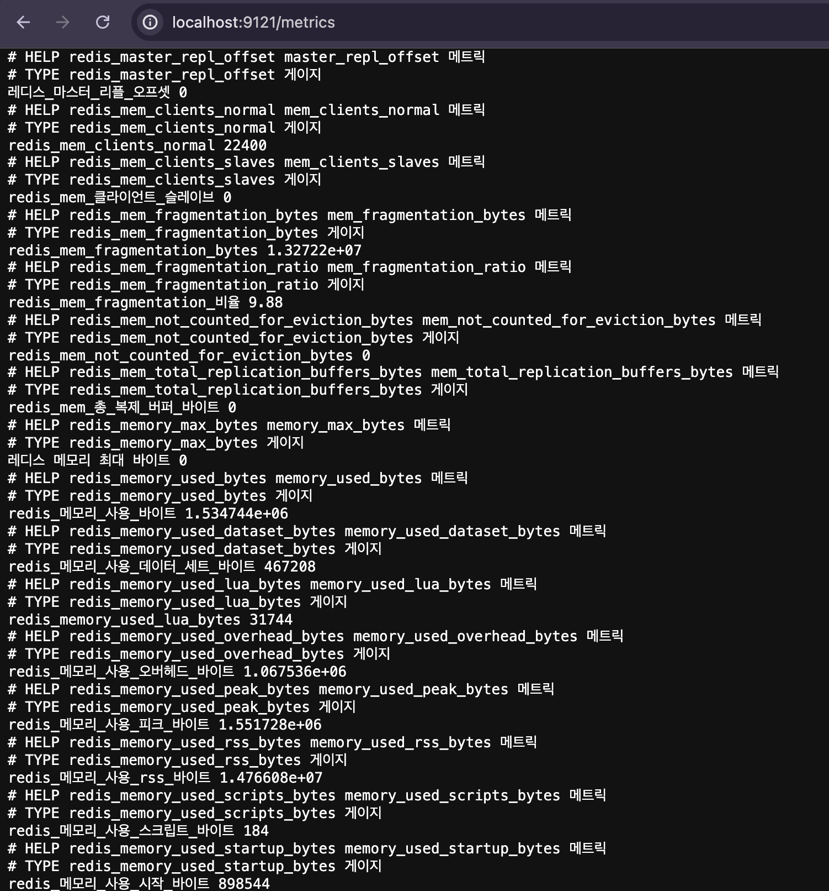

주요 메트릭은 다음과 같다.

```promql
# 연결된 클라이언트 수
redis_connected_clients

# 메모리 사용량
redis_memory_used_bytes

# 초당 처리 명령 수
rate(redis_commands_processed_total[1m])

# 키 개수
redis_db_keys
```

### 4.5 Grafana 대시보드

Grafana Labs에서 Redis용 대시보드 프리셋 **11835**를 import한다.

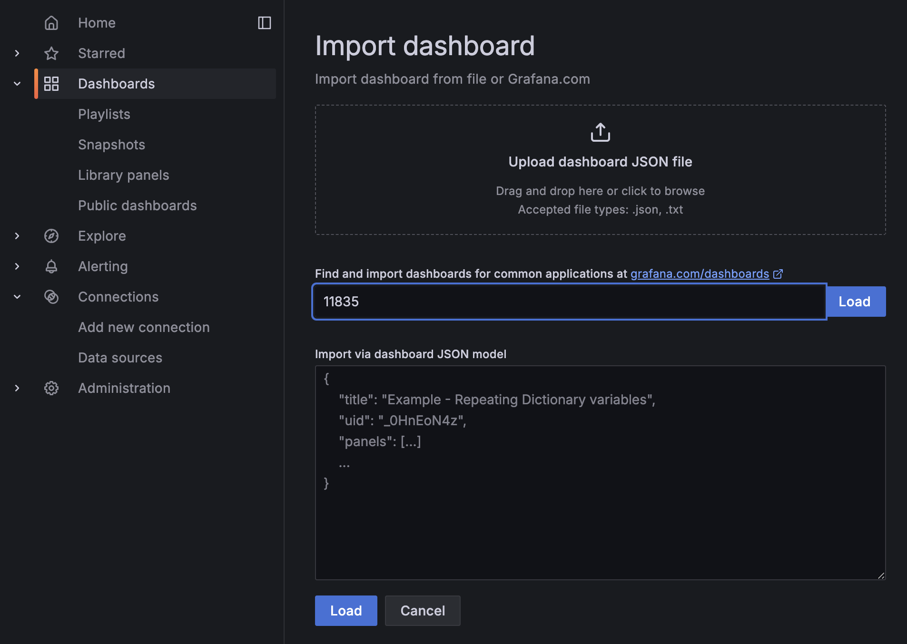

평소 상태의 대시보드는 다음과 같다.

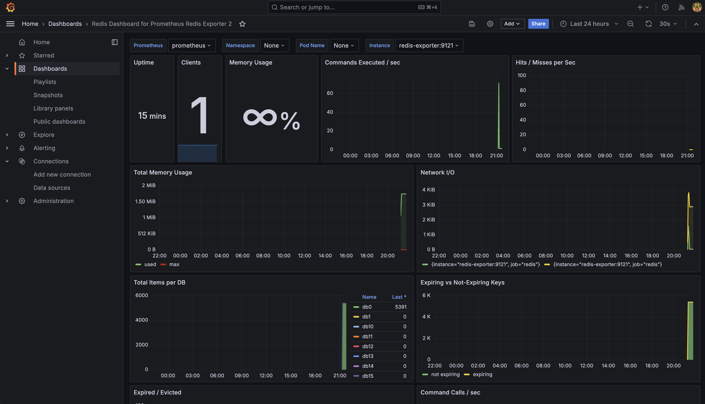

### 4.6 부하 테스트

Redis에 부하를 주기 위한 간단한 Python 스크립트를 실행해보자.

```python
import redis
import random
import string
import time

def random_string(length=10):
    letters = string.ascii_lowercase
    return ''.join(random.choice(letters) for i in range(length))

def main():
    r = redis.Redis(host='localhost', port=6379, db=0)
    try:
        while True:
            key = random_string(10)
            value = random_string(50)
            r.set(key, value)
            print(f"Set {key} -> {value}")
            time.sleep(0.01)
    except KeyboardInterrupt:
        print("Stopped by user")
    except Exception as e:
        print(f"Error: {e}")

if __name__ == "__main__":
    main()
```

```bash
python3 annoying-redis.py
```

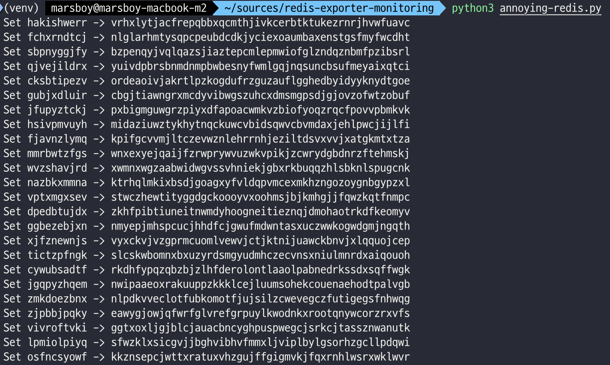

스크립트를 실행한 후 Grafana 대시보드를 확인하면, Redis에 부하가 가해진 것을 시각적으로 확인할 수 있다.

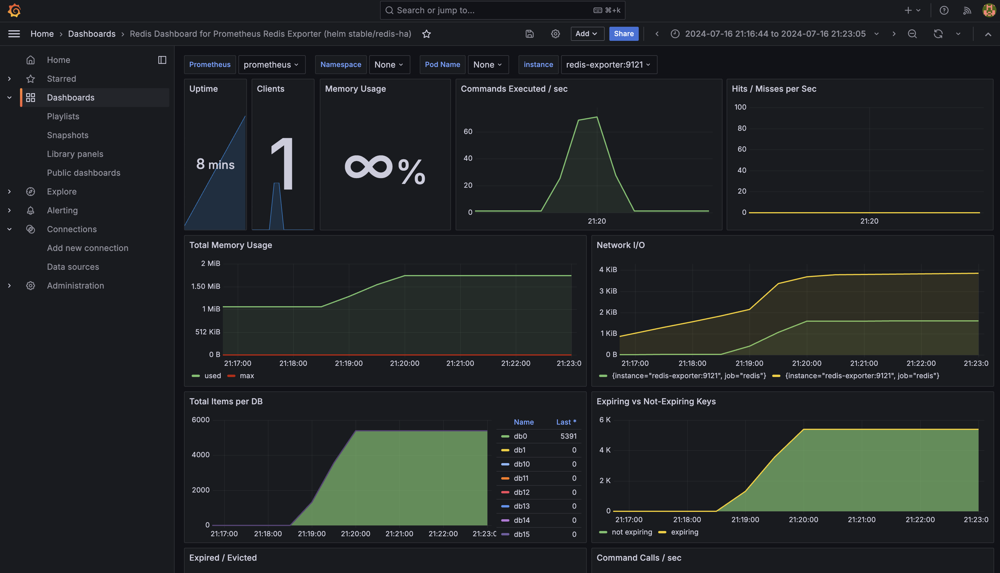

이처럼 Redis 외에도 nginx, kafka 등 다양한 서비스에 대해 DockerHub의 exporter와 Grafana Labs의 대시보드 프리셋을 활용하면 손쉽게 모니터링 환경을 구축할 수 있다.

---

## 5. HPC 클러스터 대시보드

### 5.1 배경

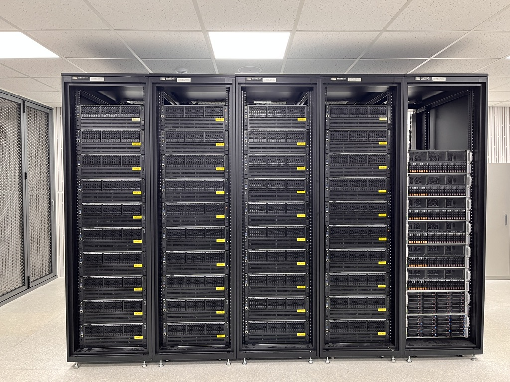

마스터 노드 3대, 워커 노드 약 100대로 구성된 HPC(High Performance Computer) 클러스터 환경에서 모니터링 시스템을 구축한 사례이다. Slurm을 사용하여 클러스터를 관리하고 있었는데, 다음과 같은 문제가 있었다.

- Slurm의 `pestat` 명령으로 확인하는 CPU Loads는 **직관적이지 않았다**
- Anaconda 가상환경을 사용하는 경우 Slurm이 CPU 사용량을 정확하게 측정하지 못해, **작업이 한 노드에 몰려 CPU 100%를 찍고 다운**되는 상황이 발생

이 문제를 해결하기 위해 node-exporter 기반의 Grafana 대시보드를 구축했다.

### 5.2 네트워크 토폴로지

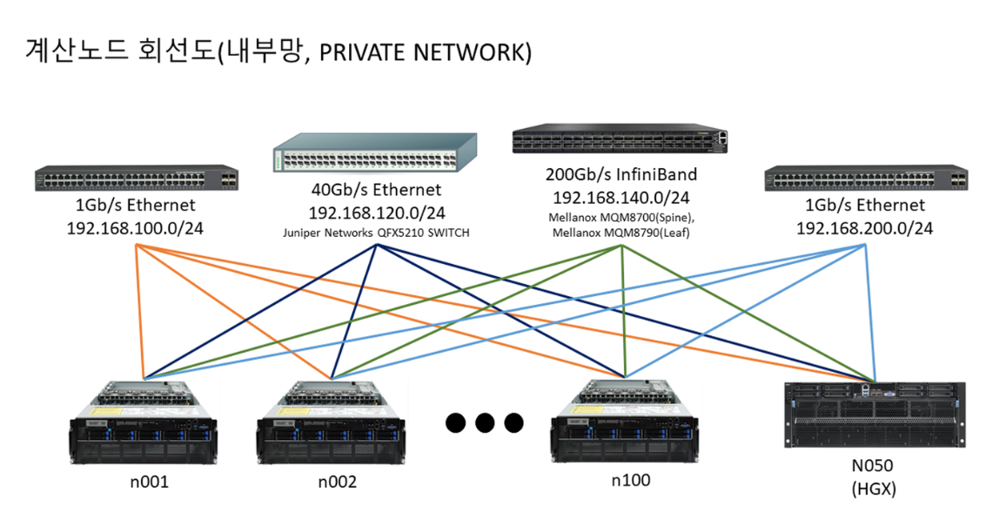

약 100개의 워커 노드가 3대의 마스터 노드에 물리적으로 연결되어 있다. 마스터 노드에서 Prometheus와 Grafana를 docker-compose로 띄우고, 모든 워커 노드에서 node-exporter의 메트릭을 수집하는 구조이다.

### 5.3 워커 노드 설정 전파

모든 워커 노드에 node-exporter를 설치하기 위해 `pdsh`를 사용한다. pdsh는 SSH 프로토콜을 사용하여 원격 호스트에 동시에 명령을 실행하는 도구이다.

```bash
pdsh -w n[001-101] 'curl -O https://raw.githubusercontent.com/marsboy02/node-exporter-monitoring/main/node-exporter-init.sh | ./node-exporter-init.sh'
```

> **주의**: pdsh가 호스트명을 인식할 수 있도록 `/etc/hosts` 등에 각 호스트명이 IP 주소로 올바르게 변환될 수 있도록 사전 설정이 필요하다.

### 5.4 마스터 노드 prometheus.yml

마스터 노드에서는 prometheus.yml의 targets에 워커 노드의 **IP 주소**를 직접 지정해야 한다. Docker 환경에서는 호스트 파일이 격리되어 있기 때문에, 호스트명이 아닌 IP를 사용해야 한다.

```yaml
global:
  scrape_interval: 15s
  scrape_timeout: 15s
  evaluation_interval: 2m

  external_labels:
    monitor: "codelab-monitor"
    query_log_file: query_log_file.log

scrape_configs:
  - job_name: "monitoring-item"
    scrape_interval: 10s
    scrape_timeout: 10s
    metrics_path: "/metrics"
    scheme: "http"

    static_configs:
      # 워커 노드를 원하는 만큼 추가
      - targets: ["prometheus:9090", "192.168.100.1:9100", "192.168.100.2:9100", "..."]
        labels:
          service: "monitor"
```

### 5.5 docker-compose.yml (마스터 노드)

마스터 노드에서는 node_exporter 서비스를 제외하고 Prometheus와 Grafana만 띄운다.

```yaml
version: "3"

networks:
  monitoring:
    driver: bridge

services:
  prometheus:
    image: prom/prometheus
    container_name: prometheus
    volumes:
      - ./prometheus.yml:/etc/prometheus/prometheus.yml
      - prometheus-data:/prometheus
    ports:
      - 9090:9090
    command:
      - "--storage.tsdb.path=/prometheus"
      - "--config.file=/etc/prometheus/prometheus.yml"
    restart: always
    networks:
      - monitoring

  grafana:
    image: grafana/grafana
    container_name: grafana
    ports:
      - 3000:3000
    volumes:
      - grafana-data:/var/lib/grafana
      - ./grafana/provisioning/:/etc/grafana/provisioning/
    restart: always
    depends_on:
      - prometheus
    networks:
      - monitoring

volumes:
  grafana-data:
  prometheus-data:
```

### 5.6 결과 및 인사이트

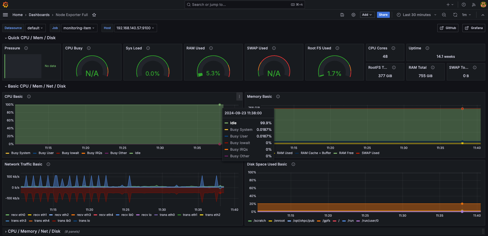

이 모니터링 시스템을 통해 다음과 같은 인사이트를 얻을 수 있었다.

- **Slurm CPU Loads vs 실제 CPU 사용량 비교**: Slurm에서 낮은 수치를 보이지만, 실제로는 CPU가 100%에 가깝게 사용되는 노드를 발견
- **원인 추적**: 대부분 Anaconda 환경에서 Slurm이 리소스를 정확히 추적하지 못하여 발생
- **해결책**: 사용자들을 Anaconda에서 Miniconda로 전환 유도 -> Slurm과 Grafana의 CPU 사용량이 일치하는 것을 확인

대규모 클러스터 대시보드 설계 시 고려할 점은 다음과 같다.

1. **변수(Variables) 활용**: Grafana의 템플릿 변수로 노드를 드롭다운으로 선택할 수 있게 구성
2. **집계 쿼리 우선**: 100대 이상의 노드를 개별로 보기보다는 `avg`, `max`, `quantile` 등으로 집계
3. **알림 규칙 설정**: CPU 사용률이 임계치를 넘으면 Slack/Email로 알림

---

## 6. Lab: docker-compose 전체 스택 구성

지금까지 다룬 내용을 종합하여, Prometheus + Grafana + node-exporter + redis-exporter를 하나의 docker-compose로 구성하는 전체 스택 예제이다.

### 6.1 디렉토리 구조

```
monitoring-lab/
├── docker-compose.yml
├── prometheus.yml
├── grafana/
│   └── provisioning/
│       └── datasources/
│           └── prometheus.yml
└── annoying-redis.py
```

### 6.2 docker-compose.yml

```yaml
version: "3"

networks:
  monitoring:
    driver: bridge

services:
  # ---- Prometheus ----
  prometheus:
    image: prom/prometheus:latest
    container_name: prometheus
    volumes:
      - ./prometheus.yml:/etc/prometheus/prometheus.yml
      - prometheus-data:/prometheus
    ports:
      - "9090:9090"
    command:
      - "--storage.tsdb.path=/prometheus"
      - "--config.file=/etc/prometheus/prometheus.yml"
    restart: always
    networks:
      - monitoring

  # ---- Grafana ----
  grafana:
    image: grafana/grafana:latest
    container_name: grafana
    ports:
      - "3000:3000"
    environment:
      - GF_SECURITY_ADMIN_PASSWORD=admin
    volumes:
      - grafana-data:/var/lib/grafana
      - ./grafana/provisioning/:/etc/grafana/provisioning/
    restart: always
    depends_on:
      - prometheus
    networks:
      - monitoring

  # ---- Node Exporter ----
  node_exporter:
    image: prom/node-exporter:latest
    container_name: node_exporter
    volumes:
      - /proc:/host/proc:ro
      - /sys:/host/sys:ro
      - /:/rootfs:ro
    command:
      - "--path.procfs=/host/proc"
      - "--path.rootfs=/rootfs"
      - "--path.sysfs=/host/sys"
      - "--collector.filesystem.mount-points-exclude=^/(sys|proc|dev|host|etc)($$|/)"
    ports:
      - "9100:9100"
    networks:
      - monitoring

  # ---- Redis ----
  redis:
    image: redis:latest
    container_name: redis
    ports:
      - "6379:6379"
    networks:
      - monitoring

  # ---- Redis Exporter ----
  redis_exporter:
    image: bitnami/redis-exporter:latest
    container_name: redis_exporter
    environment:
      - REDIS_ADDR=redis:6379
    ports:
      - "9121:9121"
    depends_on:
      - redis
    networks:
      - monitoring

volumes:
  grafana-data:
  prometheus-data:
```

### 6.3 prometheus.yml

```yaml
global:
  scrape_interval: 15s
  scrape_timeout: 15s
  evaluation_interval: 2m

scrape_configs:
  - job_name: "node"
    scrape_interval: 10s
    static_configs:
      - targets: ["node_exporter:9100"]
        labels:
          service: "node"

  - job_name: "redis"
    scrape_interval: 5s
    static_configs:
      - targets: ["redis_exporter:9121"]
        labels:
          service: "redis"

  - job_name: "prometheus"
    scrape_interval: 10s
    static_configs:
      - targets: ["prometheus:9090"]
```

### 6.4 Grafana 데이터소스 자동 프로비저닝

`grafana/provisioning/datasources/prometheus.yml` 파일을 작성하면 Grafana가 시작될 때 Prometheus 데이터소스를 자동으로 연결한다.

```yaml
apiVersion: 1

datasources:
  - name: Prometheus
    type: prometheus
    access: proxy
    url: http://prometheus:9090
    isDefault: true
    editable: true
```

### 6.5 실행

```bash
# 전체 스택 실행
docker-compose up -d

# 상태 확인
docker-compose ps

# 로그 확인
docker-compose logs -f prometheus
```

실행 후 확인할 수 있는 엔드포인트는 다음과 같다.

| 서비스 | URL | 설명 |
|--------|-----|------|
| Prometheus | `http://localhost:9090` | PromQL 쿼리, 타겟 상태 확인 |
| Grafana | `http://localhost:3000` | 대시보드 (admin/admin) |
| Node Exporter | `http://localhost:9100/metrics` | 시스템 메트릭 |
| Redis Exporter | `http://localhost:9121/metrics` | Redis 메트릭 |

Grafana에 접속한 뒤, Dashboard Import에서 **1860**(node-exporter)과 **11835**(Redis)를 각각 import하면 모니터링 환경 구축이 완료된다.

---

## 참고 자료

- [Elastic] The 3 pillars of observability: https://www.elastic.co/blog/3-pillars-of-observability
- [Grafana] What's next for observability: https://grafana.com/blog/2019/10/21/whats-next-for-observability/
- [OpenTelemetry] What is OpenTelemetry: https://opentelemetry.io/docs/what-is-opentelemetry/
- [Honeycomb] Explore Traces: https://docs.honeycomb.io/investigate/analyze/explore-traces/
- [Prometheus] Metric Types: https://prometheus.io/docs/concepts/metric_types/
- [Prometheus] Architecture Overview: https://prometheus.io/docs/introduction/overview/
- [Grafana Labs] Dashboards: https://grafana.com/grafana/dashboards/
- [GitHub] node-exporter-monitoring: https://github.com/marsboy02/node-exporter-monitoring
- [GitHub] redis-exporter-monitoring: https://github.com/marsboy02/redis-exporter-monitoring
