A monitoring system is the foundation of running a service. You need to know, in real time, whether the service is working and what is going wrong. This post starts from the three pillars of observability and works step by step through building a monitoring system with Prometheus and Grafana. It covers Linux system monitoring with node-exporter and Redis monitoring, based on hands-on experience.

The order is as follows. First I lay out the concept of observability, then look at the structure of Prometheus — which collects metrics — and the role of exporters. After that I build monitoring environments for node-exporter and Redis, and finally tie everything together into a single docker-compose stack.

## 1. The Three Pillars of Observability

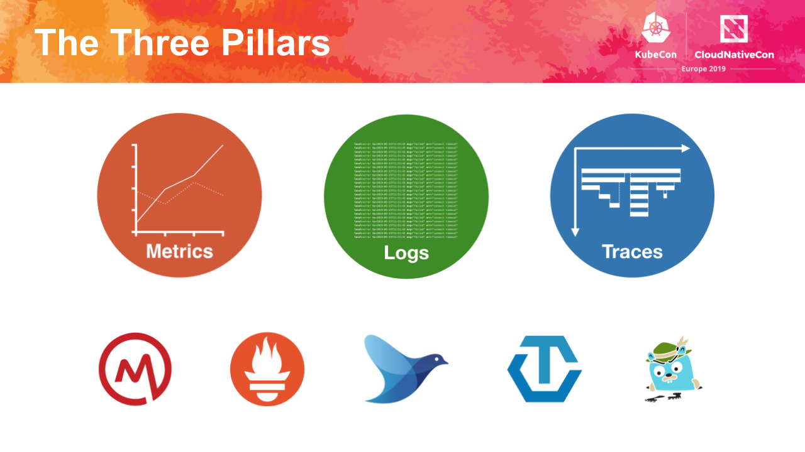

The three pillars of observability are **metrics**, **logs**, and **traces**. Official documentation from vendors like AWS, IBM, and Elastic consistently emphasizes all three.

In short:

| Signal      | Definition                                                            | Examples                                             |
| ----------- | --------------------------------------------------------------------- | ---------------------------------------------------- |
| **Metrics** | System state expressed as numeric time series                          | CPU utilization, memory usage, network I/O           |
| **Logs**    | Timestamped structured or unstructured data tied to a specific event   | HTTP request records, error messages, crontab output |
| **Traces**  | The full journey of a single request through the system                | API call paths, time spent between services          |

### 1.1 Metrics

A metric expresses **system state as a numeric time series**. It usually covers indicators like CPU utilization, memory usage, and network I/O, each leaving a number every second or every minute under a name such as `cpu_utilization`, `memory_utilization`, or `network_io`.

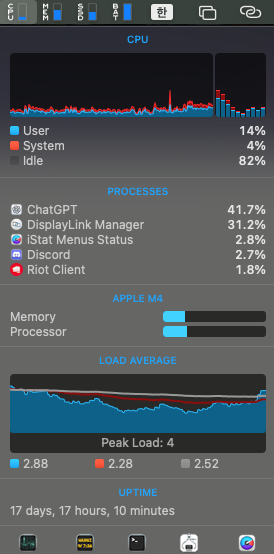

The screenshot above is iStat Menus, an application that shows my machine's CPU usage in the menu bar. Personal machine or server, the need to manage CPU and memory carefully is the same.

That both matter, however, does not mean that hitting 100% has the same consequence. Many people assume a service goes down the moment CPU hits 100%, but in practice the system just gets very slow — nowhere near as fatal as running out of memory.

Memory is a different story. Memory writes data into a physically fixed address space, and if one process crosses into another process's region and overwrites its data, the whole system can collapse. So when memory reaches 100%, the operating system chooses to remove a process outright rather than sacrifice speed.

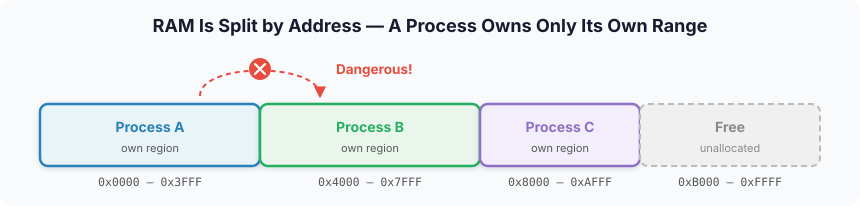

- **CPU at 100%**: queues explode, timeouts and errors rise, and in the worst case the server goes down.
- **Memory at 100%**: the OS-level **OOM Killer** (Out-of-Memory Killer) terminates a process with SIGKILL.

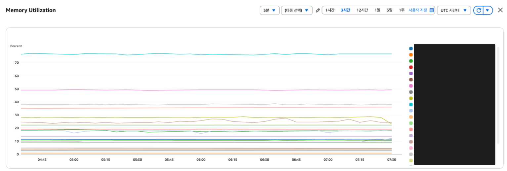

On AWS, spinning up compute services like EC2 or Fargate gets you these metrics automatically through CloudWatch. On-premises, **Prometheus** plays the same role. Prometheus is both the store and the data source for time series: you write "go here and read this value" into a config file, and it walks those addresses periodically to pull the numbers. The configuration details come later.

Put together, exporters expose metrics, Prometheus collects them, and Grafana visualizes them. If Prometheus is the store for metrics, Loki is the counterpart usually mentioned for logs.

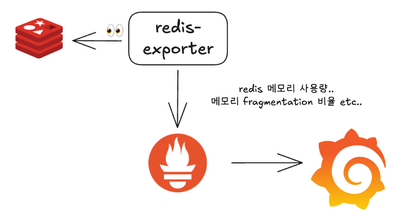

The thing to notice here is the direction of the arrows. Metrics use a **pull** model: Prometheus walks the exporters itself and fetches the values. Logs are the opposite — a **push** model, where whoever holds the data pushes it into the store. Two kinds of observability data, collected in opposite directions; more on that just below.

### 1.2 Logs

A log is a **detailed record of an event**. It consists of a timestamp, a level, a message, and fields, and it is usually the first signal a developer ever encounters.

Typical uses for logs:

- **HTTP request records**: recording IP, User-Agent, and response time to analyze access patterns by country or traffic by agent
- **Batch job records**: checking crontab results and whether processing succeeded
- **Domain audit logs**: always recording access to a particular domain (for example, users)

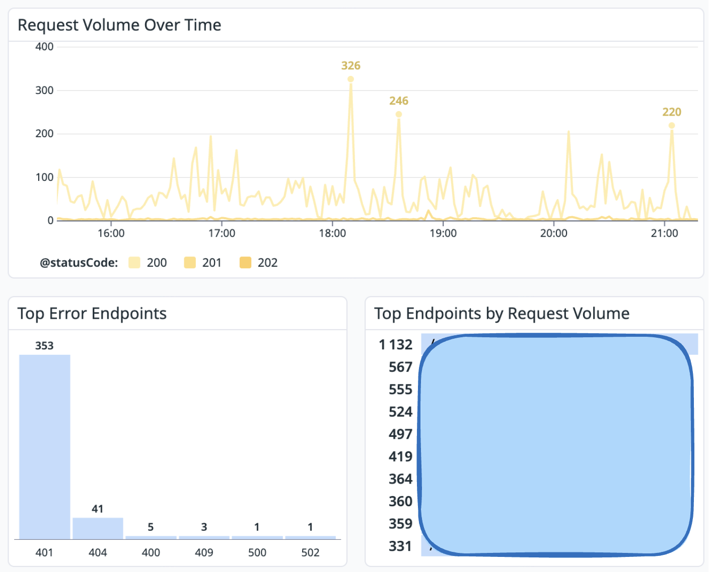

The graphs above are part of a dashboard built from logs. When writing logs, it is common to follow OpenTelemetry — the observability standard — and record the client IP, the endpoint that was hit, and the response status code alongside the message.

From that collected information you can see how status codes are distributed and which endpoints attract the most requests. Beyond that, if you keep log formats consistent across every system, one dashboard can serve every service by swapping a variable, and alerts can be defined on the same terms everywhere. The value of a logging system comes less from any single log line than from that consistency.

### 1.3 How Metrics and Logs Are Collected Differently

As mentioned above, metrics use a pull model where Prometheus fetches values itself. Logs are the reverse: whoever holds the data pushes it into a central store.

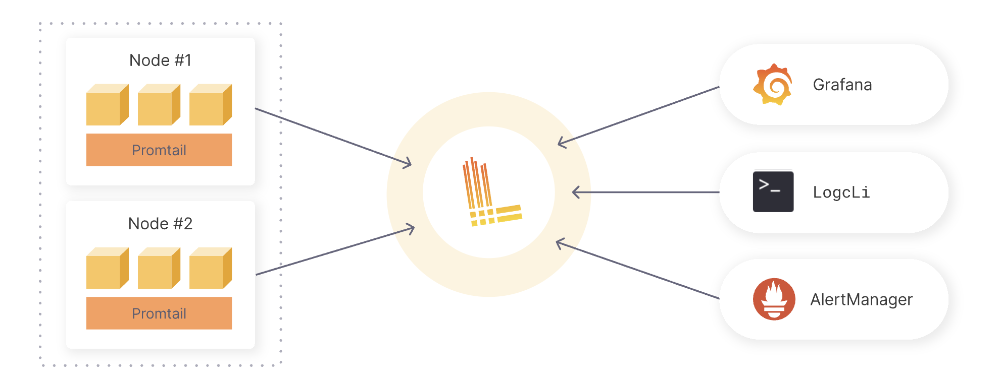

Where Prometheus has "go here and read this value" written into a config file, logs are read by an agent that runs alongside the server and forwarded to a central store. In the diagram above, a Promtail instance resident on each node ships logs to Loki, while Grafana and AlertManager query what has accumulated there. That is how logs get stored and retained. (Note that Alloy has recently replaced Promtail.)

### 1.4 Traces

A trace records **the full journey of a single request through the system**. If a user called `/orders`, it shows the timing and causal relationships of every hop at a glance — frontend → API → DB/cache → external payment API → message queue.

The core vocabulary:

- **Trace**: the entire execution flow for one request, identified by a unique `trace_id`
- **Span**: a unit of work within a trace — one segment such as "controller handling", "DB query", or "external HTTP call"
- **Root Span**: the outermost (initial) span, usually representing the user scenario, like "HTTP POST /orders"
- **Span Kind**: the span's role — `SERVER` (inbound), `CLIENT` (outbound call), `INTERNAL` (internal logic)

The anatomy of a span includes its name, start and end time (duration), attributes, events, status (OK/ERROR), and relationships (parent-child links).

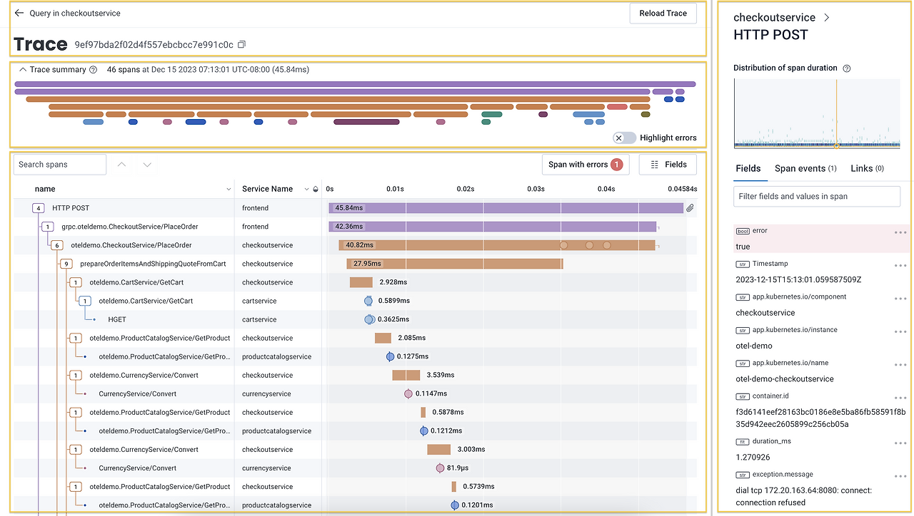

Visualizing parent-child span relationships as a waterfall, as above, makes the time spent in each segment obvious at a glance. That makes it fast to spot a bottleneck and trace it back to its cause.

### 1.5 How the Three Signals Complement Each Other

Used together, the three signals sustain a high level of observability.

- **Metrics** tell you that "something is off"
- **Logs** tell you "which event happened"
- **Traces** tell you "which segment the problem is in"

Worth noting: **OpenTelemetry** (OTel), maintained by the CNCF, is the standard (API/SDK + Collector + OTLP) that lets you instrument, collect, and ship all three signals in a vendor-neutral way. Monitoring tools from Datadog, AWS, and others build their own offerings on top of it.

> **Caution**: sensitive information (PII and the like) must be masked or dropped so that it never lands in metrics, logs, or traces.

---

## 2. Prometheus Architecture

With the concept of observability laid out, it is time to look at Prometheus, which handles the metrics pillar. Prometheus is an open-source monitoring tool focused on collecting, storing, and querying **time-series data**. It is rarely used alone; it forms a stack together with the exporters that expose metrics and the Grafana that visualizes them. If exporters are still unfamiliar, section 2.4 covers them separately, so read straight on.

### 2.1 Metric Types

Prometheus deals with four metric types.

| Type          | Description                                    | Example                                             |
| ------------- | ---------------------------------------------- | --------------------------------------------------- |
| **Counter**   | A value that can only increase                 | Request count (`http_requests_total`)               |
| **Gauge**     | A value that can go up and down                | Current memory usage (`node_memory_Active_bytes`)   |
| **Histogram** | Observations bucketed and aggregated           | Response time distribution (`http_request_duration_seconds`) |
| **Summary**   | Summary statistics of observations over a window | Percentiles of request duration                   |

All four are exposed by an exporter on an HTTP endpoint (`/metrics`) and pulled periodically by Prometheus. The type is also a hint about what the value means: a counter is cumulative, so its rate of increase matters more than the raw number, while a gauge can be read as-is for the current moment.

### 2.2 Architecture Overview

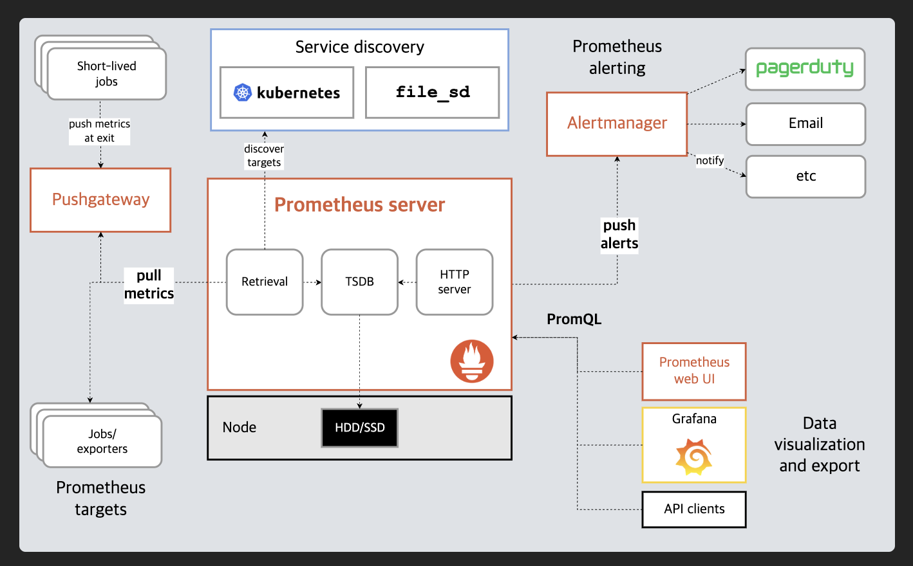

Following the architecture diagram from the official docs, the data flow looks like this.

1. An **exporter** exposes the target system's metrics on a `/metrics` endpoint
2. The **Prometheus server** periodically scrapes the targets configured in `prometheus.yml` and stores them in its time-series database (TSDB)
3. **PromQL** queries the stored data
4. Visualization tools like **Grafana** build dashboards on top of PromQL
5. **Alertmanager** sends notifications for specific conditions

The core of it is the **pull model** mentioned throughout. Because Prometheus goes to the target and fetches the data itself, adding or removing a monitoring target comes down to editing a few lines of config. The trade-off is that Prometheus must be able to reach the target over the network.

**Pushgateway**, on the left of the diagram, exists to work around that constraint. A process too short-lived to be scraped — a batch job, say — pushes its metrics to Pushgateway just before exiting, and Prometheus scrapes Pushgateway instead.

### 2.3 Service Discovery and the Exporter Ecosystem

Listing targets one by one in a config file is convenient when the set of targets is fixed, but it does not hold up in an environment where autoscaling constantly replaces instances. That is why Prometheus offers **service discovery**, as shown in the diagram above, reading target lists dynamically from the Kubernetes API or from files (`file_sd`). This post works with a fixed set of nodes and so uses `static_configs`, but in a Kubernetes environment service discovery is effectively the default.

Another of Prometheus's strengths is the breadth of its exporter ecosystem. Searching DockerHub for `exporter` turns up exporters for most servers you would want — redis, node, mongodb, nginx, and more.

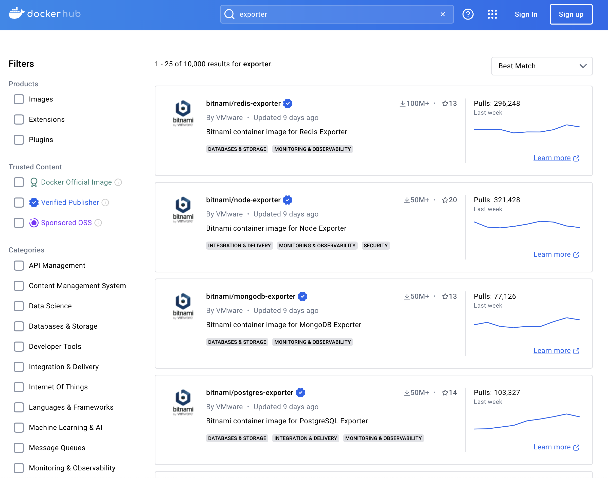

And Grafana Labs hosts community-built dashboard presets for each exporter.

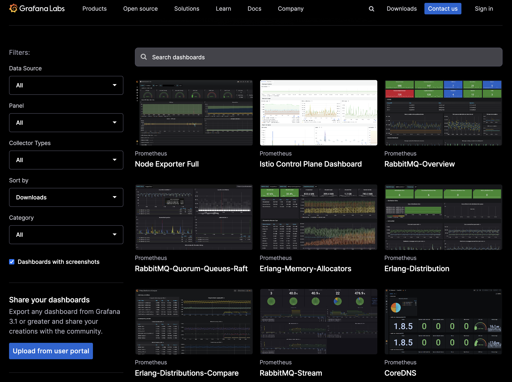

Since you can pull a dashboard in by ID instead of building one from scratch, spinning up an exporter gets you a usable dashboard almost for free. That is how the `exporter → Prometheus → Grafana` combination became the standard stack for time-series monitoring. If your goal is log collection, though, the ELK stack (Elasticsearch, Logstash, Kibana) or the Loki side mentioned earlier is a better fit.

### 2.4 What Is an Exporter?

We have skimmed the exporter ecosystem without ever properly saying what an exporter is. An exporter is **a small server that translates the state of a monitoring target into a format Prometheus can read and exposes it over HTTP**.

The reason translation is needed is simple. Redis reports its state through the `INFO` command, the Linux kernel through the `/proc` filesystem, nginx through its own status page. Every format is different, and Prometheus does not know any of them individually. So you place an exporter next to each system, let it read state the way that system does, convert it into Prometheus's standard format, and serve it on a `/metrics` endpoint. All Prometheus needs to know is that one uniform endpoint.

#### Exposition Format

What `/metrics` returns is not a special protocol — it is plain text. Open it with `curl` and you get something like this.

```
# HELP node_memory_MemAvailable_bytes Memory information field MemAvailable_bytes.
# TYPE node_memory_MemAvailable_bytes gauge
node_memory_MemAvailable_bytes 5.98016e+09
# HELP node_cpu_seconds_total Seconds the CPUs spent in each mode.
# TYPE node_cpu_seconds_total counter
node_cpu_seconds_total{cpu="0",mode="idle"} 20385.53
node_cpu_seconds_total{cpu="0",mode="system"} 512.44
node_cpu_seconds_total{cpu="1",mode="idle"} 20401.17
```

One line is one time series, and the structure is as simple as `metric_name{label="value"} number`.

- `# HELP`: a comment describing what the metric is
- `# TYPE`: which of the four types from 2.1 it belongs to
- `{cpu="0",mode="idle"}`: **labels**, the key-value pairs that split a single metric name across dimensions. As above, values exist separately per CPU core and per mode.

The important part is that this response carries **no time information**. An exporter computes the current value at the moment of the request and returns it, storing nothing. Recording when a value was measured and accumulating history is the job of the Prometheus that scraped it. That makes an exporter a lightweight, stateless process with no data to lose across restarts.

#### Exporters vs. Direct Instrumentation

You need an exporter when you cannot change the target's code. You cannot add Prometheus-specific code to Redis or nginx, so you attach an exporter beside it. For an application you wrote yourself, though, there is no reason to run a separate exporter. It is more natural to add your language's client library and let the application expose `/metrics` on its own — and in that case you can also emit business metrics like "orders created" or "payment failure rate".

The options come down to this.

| Situation                                  | Approach                                          | Example                                      |
| ------------------------------------------ | ------------------------------------------------- | -------------------------------------------- |
| Third-party system you cannot modify       | Run a dedicated exporter alongside it             | redis-exporter, mysqld-exporter              |
| The host and OS itself                     | Keep an exporter resident on every node           | node-exporter                                |
| An application you wrote                   | Instrument directly with a client library         | prometheus-client (Python), Micrometer (JVM) |
| Only whether it responds from the outside  | Probe without touching the target                 | blackbox-exporter                            |
| Short-lived batch jobs                     | Push just before exiting                          | Pushgateway                                  |

In the end, the first question the moment you want to monitor something with Prometheus is "does an exporter for this already exist?" Most of the time it does, and when it does not, you build one with a client library. The next chapter collects real metrics from a Linux server using the most widely used exporter of all, node-exporter.

---

## 3. Monitoring a System with node-exporter

node-exporter exposes a Linux host's CPU, memory, disk, and network state on `/metrics`. Because the target is the host itself, the rule is to keep one resident on every server you want to monitor.

### 3.1 Architecture

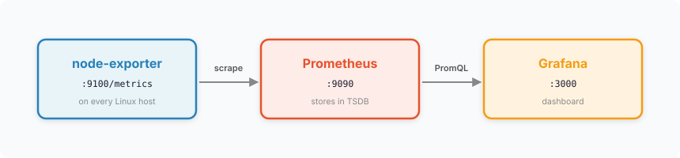

Data flows in the order `exporter → Prometheus → Grafana`. We bring all three services up together with docker-compose.

### 3.2 docker-compose.yml

```yaml
version: "3"

networks:
  monitoring:
    driver: bridge

services:
  prometheus:
    image: prom/prometheus
    container_name: prometheus
    volumes:
      - ./prometheus.yml:/etc/prometheus/prometheus.yml
      - prometheus-data:/prometheus
    ports:
      - 9090:9090
    command:
      - "--storage.tsdb.path=/prometheus"
      - "--config.file=/etc/prometheus/prometheus.yml"
    restart: always
    networks:
      - monitoring

  grafana:
    image: grafana/grafana
    container_name: grafana
    ports:
      - 3000:3000
    volumes:
      - grafana-data:/var/lib/grafana
      - ./grafana/provisioning/:/etc/grafana/provisioning/
    restart: always
    depends_on:
      - prometheus
    networks:
      - monitoring

  node_exporter:
    image: prom/node-exporter
    volumes:
      - /proc:/host/proc:ro
      - /sys:/host/sys:ro
      - /:/rootfs:ro
    command:
      - "--path.procfs=/host/proc"
      - "--path.rootfs=/rootfs"
      - "--path.sysfs=/host/sys"
      - "--collector.filesystem.mount-points-exclude=^/(sys|proc|dev|host|etc)($$|/)"
    ports:
      - "9100:9100"
    networks:
      - monitoring

volumes:
  grafana-data:
  prometheus-data:
```

### 3.3 prometheus.yml

```yaml
global:
  scrape_interval: 15s
  scrape_timeout: 15s
  evaluation_interval: 2m

  external_labels:
    monitor: "codelab-monitor"
    query_log_file: query_log_file.log

scrape_configs:
  - job_name: "monitoring-item"
    scrape_interval: 10s
    scrape_timeout: 10s
    metrics_path: "/metrics"
    scheme: "http"

    static_configs:
      - targets: ["prometheus:9090", "node_exporter:9100"]
        labels:
          service: "monitor"
```

The thing to watch here is that **targets use the docker-compose service names, not `localhost`**. Inside the same compose network, services talk to each other by name. From the host itself, however, `localhost:<port>` works.

```bash
docker-compose up -d
```

### 3.4 What node-exporter Exposes

Visiting `localhost:9100/metrics` shows exactly what node-exporter emits.

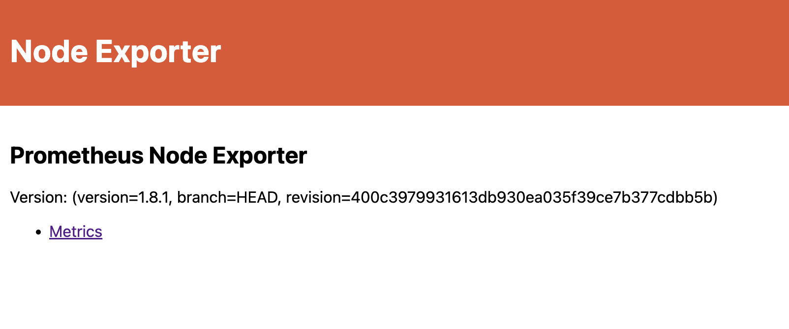

```
# HELP go_gc_duration_seconds A summary of the pause duration of garbage collection cycles.
# TYPE go_gc_duration_seconds summary
go_gc_duration_seconds{quantile="0"} 2.1209e-05
go_gc_duration_seconds{quantile="0.25"} 5.3708e-05
...
# HELP go_goroutines Number of goroutines that currently exist.
# TYPE go_goroutines gauge
go_goroutines 9
```

### 3.5 Connecting the Grafana Data Source

Open Grafana (`localhost:3000`), log in with the default account (admin/admin), and add Prometheus under **Connections > Data source**.

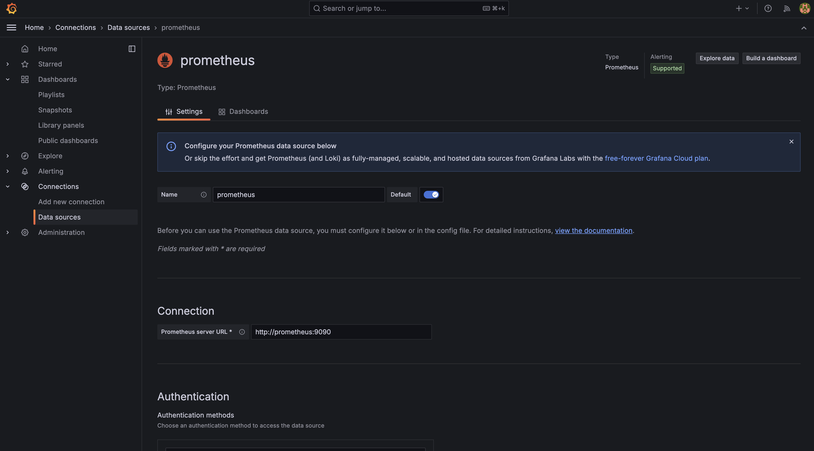

For the URL, since we are in a docker-compose environment, use `http://prometheus:9090`.

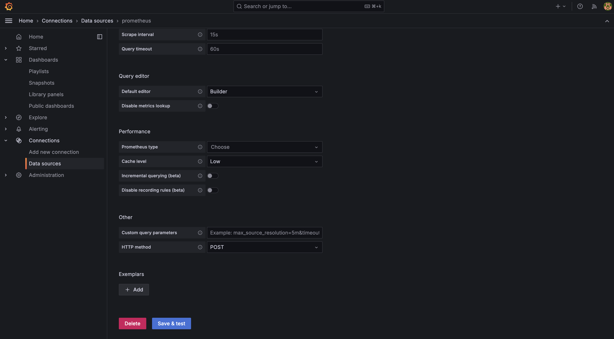

### 3.6 Importing a Dashboard

You can import dashboard presets shared by the community on Grafana Labs. The well-known dashboard ID for node-exporter is **1860**.

- Grafana Labs Dashboards: https://grafana.com/grafana/dashboards/

Under **Dashboard > New > Import**, enter the ID `1860` and pick the Prometheus data source.

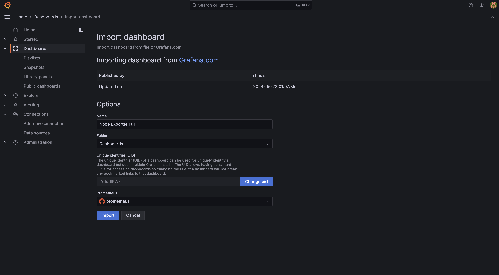

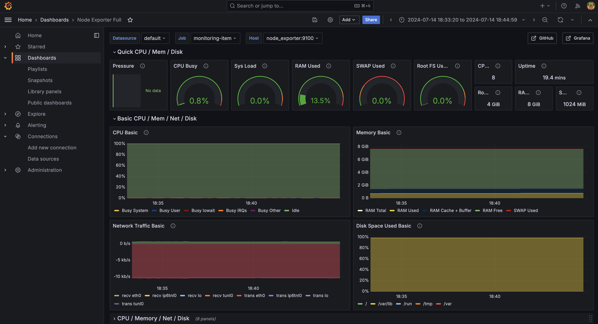

### 3.7 Installing node-exporter on a Remote Linux Node

To install node-exporter on a remote server rather than locally, download the binary directly and register it as a systemd service.

```bash
# 1. Download and install node-exporter
wget https://github.com/prometheus/node_exporter/releases/download/v1.8.1/node_exporter-1.8.1.linux-amd64.tar.gz
tar xvfz node_exporter-1.8.1.linux-amd64.tar.gz
mv node_exporter-1.8.1.linux-amd64/node_exporter /usr/local/bin/
```

```bash
# 2. Create the systemd service file
cat <<EOF > /etc/systemd/system/node_exporter.service
[Unit]
Description=Node Exporter
Wants=network-online.target
After=network-online.target

[Service]
User=root
Group=root
Type=simple
ExecStart=/usr/local/bin/node_exporter

[Install]
WantedBy=multi-user.target
EOF
```

```bash
# 3. Enable and start the service
systemctl enable node_exporter.service
systemctl start node_exporter.service
systemctl status node_exporter.service
```

Once node-exporter is running on the remote node, add that node's IP and port to the targets in the monitoring server's `prometheus.yml` to start collecting its metrics.

---

## 4. Monitoring Redis

Having looked into the host with node-exporter, the next step is the middleware running on top of it. Compared with the previous chapter, the only thing that changes is the exporter; how Prometheus and Grafana are handled stays the same.

### 4.1 Architecture

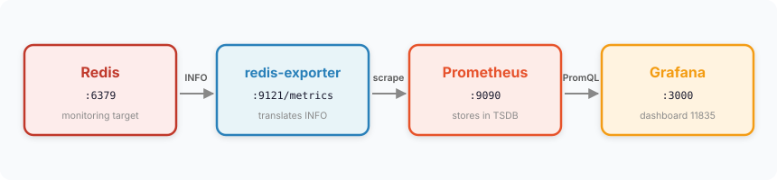

Redis monitoring is composed as `redis → redis-exporter → Prometheus → Grafana`. redis-exporter reads Redis state with the `INFO` command, converts it into metrics on `/metrics`, and Prometheus collects it. Compared with node-exporter in chapter 3, only the monitoring target changed from the host to Redis — everything behind it is identical.

- GitHub example: https://github.com/marsboy02/redis-exporter-monitoring

### 4.2 docker-compose.yml

```yaml
services:
  redis:
    image: "redis:latest"
    container_name: "redis"
    ports:
      - "6379:6379"

  redis-exporter:
    image: "bitnami/redis-exporter:latest"
    container_name: "redis-exporter"
    environment:
      - REDIS_ADDR=redis:6379
    ports:
      - "9121:9121"
    depends_on:
      - redis

  prometheus:
    image: "prom/prometheus:latest"
    container_name: "prometheus"
    ports:
      - "9090:9090"
    volumes:
      - ./prometheus.yml:/etc/prometheus/prometheus.yml
    depends_on:
      - redis-exporter

  grafana:
    image: "grafana/grafana:latest"
    container_name: "grafana"
    ports:
      - "3000:3000"
    depends_on:
      - prometheus
    environment:
      - GF_SECURITY_ADMIN_PASSWORD=admin
    volumes:
      - grafana-storage:/var/lib/grafana

volumes:
  grafana-storage:
```

Container dependencies run in the order `redis <- redis-exporter <- prometheus <- grafana`.

### 4.3 prometheus.yml

```yaml
global:
  scrape_interval: 5s

scrape_configs:
  - job_name: "redis"
    static_configs:
      - targets: ["redis-exporter:9121"]
```

`scrape_interval` is set to a short 5 seconds so that changes in Redis are picked up quickly.

### 4.4 Checking redis-exporter Metrics

Visiting `localhost:9121/metrics` shows a wide range of Redis metrics.

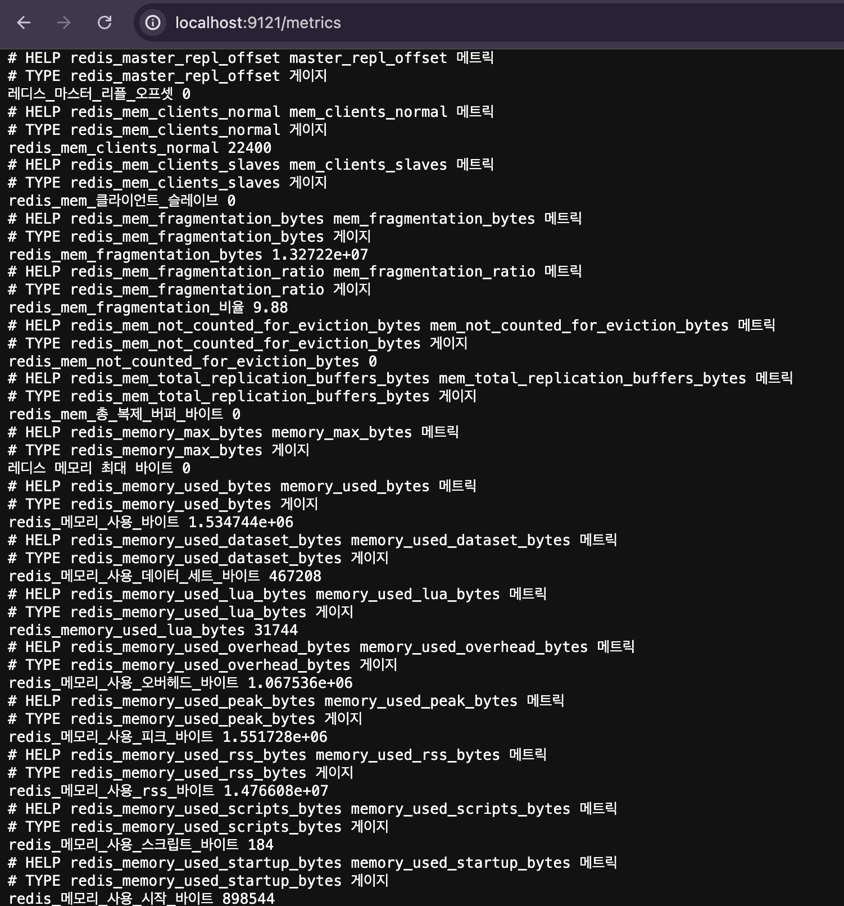

The key ones:

```promql
# Number of connected clients
redis_connected_clients

# Memory usage
redis_memory_used_bytes

# Commands processed per second
rate(redis_commands_processed_total[1m])

# Number of keys
redis_db_keys
```

### 4.5 Grafana Dashboard

Import the Redis dashboard preset **11835** from Grafana Labs.

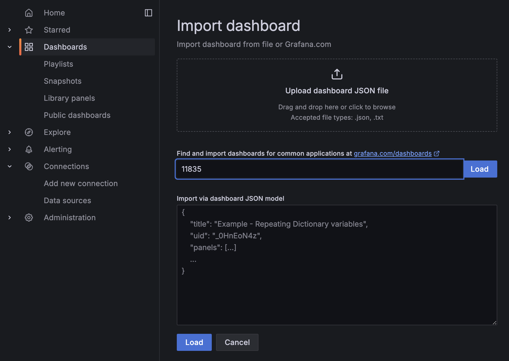

At rest, the dashboard looks like this.

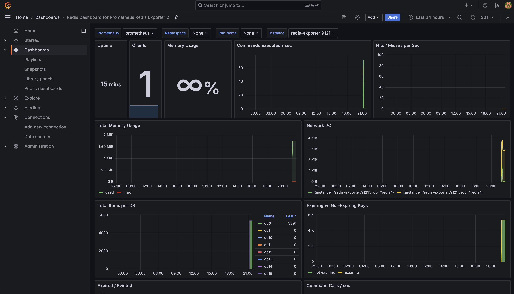

### 4.6 Load Testing

Let's run a simple Python script to put load on Redis.

```python
import redis
import random
import string
import time

def random_string(length=10):
    letters = string.ascii_lowercase
    return ''.join(random.choice(letters) for i in range(length))

def main():
    r = redis.Redis(host='localhost', port=6379, db=0)
    try:
        while True:
            key = random_string(10)
            value = random_string(50)
            r.set(key, value)
            print(f"Set {key} -> {value}")
            time.sleep(0.01)
    except KeyboardInterrupt:
        print("Stopped by user")
    except Exception as e:
        print(f"Error: {e}")

if __name__ == "__main__":
    main()
```

```bash
python3 annoying-redis.py
```

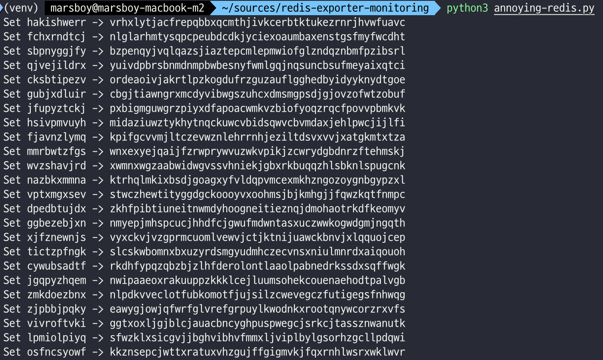

Checking the Grafana dashboard after running the script makes the load on Redis visible.

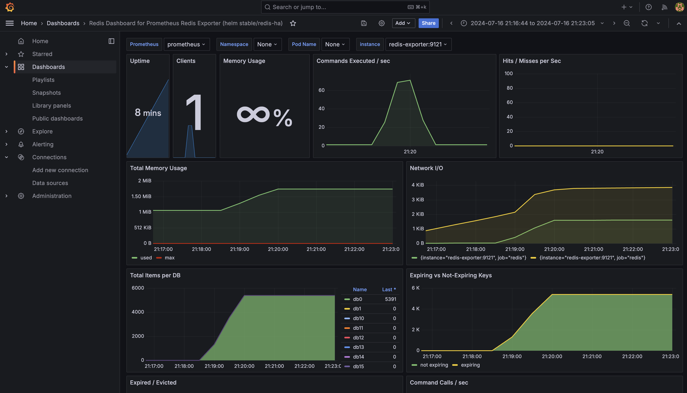

The same approach applies well beyond Redis: for nginx, Kafka, and many other services, combining a DockerHub exporter with a Grafana Labs dashboard preset gets a monitoring environment up with very little effort.

---

## 5. Lab: The Full Stack in One docker-compose

Pulling everything above together, here is a complete example that runs Prometheus, Grafana, node-exporter, and redis-exporter from a single docker-compose file.

### 5.1 Directory Structure

```
monitoring-lab/
├── docker-compose.yml
├── prometheus.yml
├── grafana/
│   └── provisioning/
│       └── datasources/
│           └── prometheus.yml
└── annoying-redis.py
```

### 5.2 docker-compose.yml

```yaml
version: "3"

networks:
  monitoring:
    driver: bridge

services:
  # ---- Prometheus ----
  prometheus:
    image: prom/prometheus:latest
    container_name: prometheus
    volumes:
      - ./prometheus.yml:/etc/prometheus/prometheus.yml
      - prometheus-data:/prometheus
    ports:
      - "9090:9090"
    command:
      - "--storage.tsdb.path=/prometheus"
      - "--config.file=/etc/prometheus/prometheus.yml"
    restart: always
    networks:
      - monitoring

  # ---- Grafana ----
  grafana:
    image: grafana/grafana:latest
    container_name: grafana
    ports:
      - "3000:3000"
    environment:
      - GF_SECURITY_ADMIN_PASSWORD=admin
    volumes:
      - grafana-data:/var/lib/grafana
      - ./grafana/provisioning/:/etc/grafana/provisioning/
    restart: always
    depends_on:
      - prometheus
    networks:
      - monitoring

  # ---- Node Exporter ----
  node_exporter:
    image: prom/node-exporter:latest
    container_name: node_exporter
    volumes:
      - /proc:/host/proc:ro
      - /sys:/host/sys:ro
      - /:/rootfs:ro
    command:
      - "--path.procfs=/host/proc"
      - "--path.rootfs=/rootfs"
      - "--path.sysfs=/host/sys"
      - "--collector.filesystem.mount-points-exclude=^/(sys|proc|dev|host|etc)($$|/)"
    ports:
      - "9100:9100"
    networks:
      - monitoring

  # ---- Redis ----
  redis:
    image: redis:latest
    container_name: redis
    ports:
      - "6379:6379"
    networks:
      - monitoring

  # ---- Redis Exporter ----
  redis_exporter:
    image: bitnami/redis-exporter:latest
    container_name: redis_exporter
    environment:
      - REDIS_ADDR=redis:6379
    ports:
      - "9121:9121"
    depends_on:
      - redis
    networks:
      - monitoring

volumes:
  grafana-data:
  prometheus-data:
```

### 5.3 prometheus.yml

```yaml
global:
  scrape_interval: 15s
  scrape_timeout: 15s
  evaluation_interval: 2m

scrape_configs:
  - job_name: "node"
    scrape_interval: 10s
    static_configs:
      - targets: ["node_exporter:9100"]
        labels:
          service: "node"

  - job_name: "redis"
    scrape_interval: 5s
    static_configs:
      - targets: ["redis_exporter:9121"]
        labels:
          service: "redis"

  - job_name: "prometheus"
    scrape_interval: 10s
    static_configs:
      - targets: ["prometheus:9090"]
```

### 5.4 Auto-Provisioning the Grafana Data Source

Writing a `grafana/provisioning/datasources/prometheus.yml` file makes Grafana connect the Prometheus data source automatically on startup.

```yaml
apiVersion: 1

datasources:
  - name: Prometheus
    type: prometheus
    access: proxy
    url: http://prometheus:9090
    isDefault: true
    editable: true
```

### 5.5 Running It

```bash
# Bring the whole stack up
docker-compose up -d

# Check status
docker-compose ps

# Follow logs
docker-compose logs -f prometheus
```

The endpoints available afterwards:

| Service        | URL                             | Purpose                          |
| -------------- | ------------------------------- | -------------------------------- |
| Prometheus     | `http://localhost:9090`         | PromQL queries, target health    |
| Grafana        | `http://localhost:3000`         | Dashboards (admin/admin)         |
| Node Exporter  | `http://localhost:9100/metrics` | System metrics                   |
| Redis Exporter | `http://localhost:9121/metrics` | Redis metrics                    |

Open Grafana, import **1860** (node-exporter) and **11835** (Redis) from Dashboard Import, and the monitoring environment is complete.

---

## Closing Thoughts

Starting from the three pillars of observability, we put together a monitoring stack by running exporters, Prometheus, and Grafana ourselves. The structure turns out to be simple: run an exporter that translates a target's state into a standard format, tell Prometheus its address, and load a dashboard in Grafana. That covers most of it.

The approach used in this post — listing targets one by one under `static_configs` in `prometheus.yml` — only holds for environments where the targets are fixed. In a Kubernetes environment where Pods come and go constantly, writing down IPs is meaningless. Real production setups therefore use the service discovery mentioned in 2.3 and let the targets announce themselves through annotations.

If you manage your cluster with GitOps, declaring three annotation lines in the application manifest is all it takes.

```yaml
apiVersion: apps/v1
kind: Deployment
metadata:
  name: order-api
spec:
  template:
    metadata:
      annotations:
        prometheus.io/scrape: "true"
        prometheus.io/path: "/actuator/prometheus"
        prometheus.io/port: "8080"
    spec:
      containers:
        - name: order-api
          image: registry.example.com/order-api:1.4.2
          ports:
            - containerPort: 8080
```

Prometheus lists Pods through the Kubernetes API and picks out only those carrying `prometheus.io/scrape: "true"` as targets. What actually turns those annotations into targets is `kubernetes_sd_config` plus relabel rules in the Prometheus configuration; if you run the Prometheus Operator, as kube-prometheus-stack does, CRDs like `ServiceMonitor` and `PodMonitor` play the same role.

What this buys is consistency more than convenience. Because the annotations ship in the same PR that deploys a new service, deployment and monitoring registration happen the moment it merges, and taking the service down removes the target with it. Nobody has to remember to keep the monitoring configuration in sync by hand.

The biggest thing I took away from building monitoring systems is that observability is not a problem of attaching tools but of deciding what to look at. Spinning up an exporter and importing a dashboard preset takes half a day at most, but deciding which of those dozens of graphs should actually wake a human when it crosses a threshold is an entirely different problem. That question runs straight into the reliability metrics covered in [SLO, SLI, and SLA]().

Next I want to widen the scope of this post beyond metrics to logs and traces. Bringing the three pillars from chapter 1 into one Grafana with Loki and Tempo makes it possible to notice an anomaly on a dashboard and drill down into logs and traces on the same screen. That deserves a post of its own.

---

### References

- [Elastic] The 3 pillars of observability: https://www.elastic.co/blog/3-pillars-of-observability
- [Grafana] What's next for observability: https://grafana.com/blog/2019/10/21/whats-next-for-observability/
- [OpenTelemetry] What is OpenTelemetry: https://opentelemetry.io/docs/what-is-opentelemetry/
- [Honeycomb] Explore Traces: https://docs.honeycomb.io/investigate/analyze/explore-traces/
- [Prometheus] Metric Types: https://prometheus.io/docs/concepts/metric_types/
- [Prometheus] Architecture Overview: https://prometheus.io/docs/introduction/overview/
- [Prometheus] Kubernetes service discovery: https://prometheus.io/docs/prometheus/latest/configuration/configuration/#kubernetes_sd_config
- [Grafana Labs] Dashboards: https://grafana.com/grafana/dashboards/
- [GitHub] node-exporter-monitoring: https://github.com/marsboy02/node-exporter-monitoring
- [GitHub] redis-exporter-monitoring: https://github.com/marsboy02/redis-exporter-monitoring
