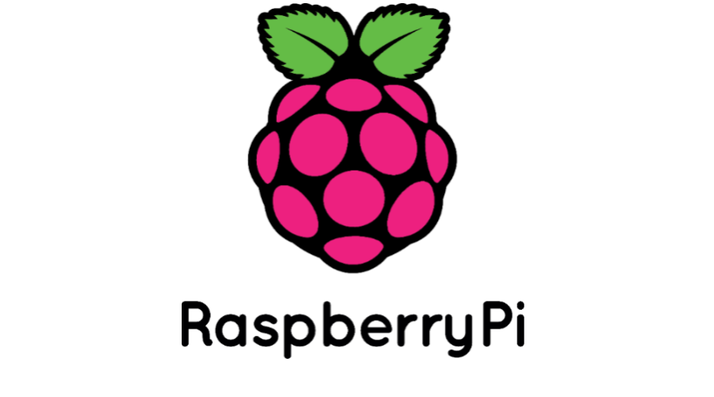

## 1. 동기: 왜 온프레미스인가?

AWS를 통해 다양한 인프라 서비스를 접한 지 거의 일 년이 다 되어 갈 무렵, 프리티어 기간이 슬슬 끝나가고 있었다. 프리티어가 종료되면 매달 고정적인 비용이 발생하게 되는데, 학습 목적으로 인프라를 운영하기에는 부담스러운 금액이다.

이 시점에서 두 가지 선택지가 있었다.

| | 클라우드 (AWS) | 온프레미스 (라즈베리파이) |
|---|---|---|
| **초기 비용** | 없음 (프리티어) | 라즈베리파이 구매 비용 |
| **유지 비용** | 월 과금 (프리티어 종료 후) | 전기세 (미미) |
| **학습 범위** | 관리형 서비스 위주 | 네트워크, OS, 클러스터 전반 |
| **유연성** | 높음 | 물리적 제약 있음 |

마침 학사에 거주하고 있어 공과금을 내지 않는 상황이었기 때문에, 라즈베리파이만 있다면 사실상 무료로 온프레미스 환경을 구축할 수 있었다. 또한 인프라 전반에 대해 좀 더 폭넓게 공부해 보고자 라즈베리파이로 쿠버네티스 클러스터를 직접 구축하기로 결정했다.

이 글에서는 라즈베리파이 설정부터 시작하여, K3s 클러스터 구축, GitHub Actions를 이용한 CI/CD 파이프라인 구현, 그리고 Tailscale VPN을 통한 원격 접속까지 -- 집에서 홈서버를 처음부터 끝까지 만드는 전체 과정을 다룬다.

---

## 2. 라즈베리파이 OS 설정

### 인프라 구조

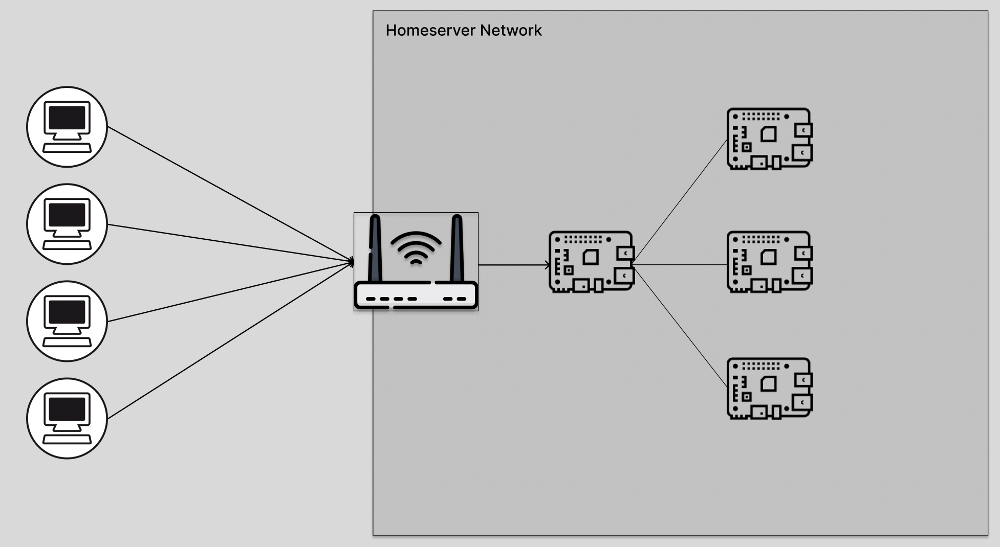

가정용 공유기를 통해 위와 같은 구조로 네트워크를 구성한다. iptime 공유기를 사용하고 있는데, 대규모 트래픽을 처리할 것이 아니기 때문에 별도의 로드밸런서 없이 공유기 설정만으로 충분하다.

### OS 설치

가장 먼저 라즈베리파이에 운영체제를 설치한다. OS 설치는 SD 카드에 운영체제 이미지를 기록하고, 해당 SD 카드를 라즈베리파이에 삽입하여 부팅하는 방식이다.

라즈베리파이 공식 사이트에서 Imager를 다운로드한다.

- **Raspberry Pi Imager** : [https://www.raspberrypi.com/software/](https://www.raspberrypi.com/software/)

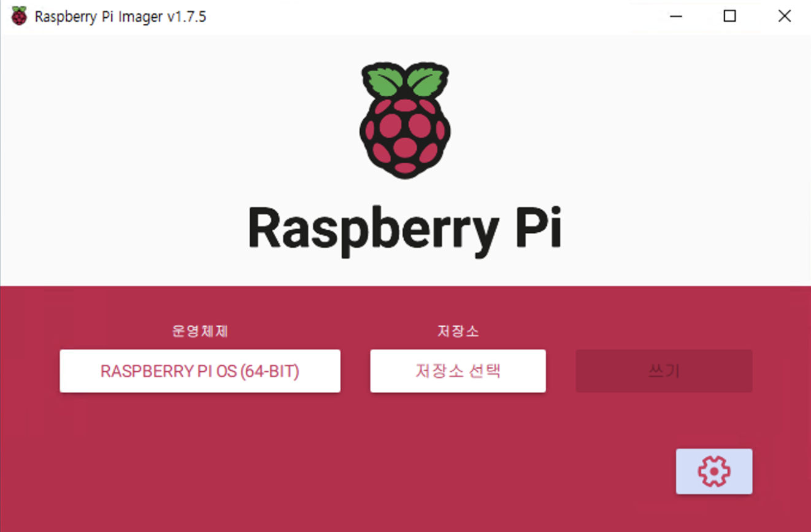

Imager를 실행하면 위와 같은 화면이 나타난다. 저장소는 삽입된 SD 카드를 선택하고, 운영체제는 **Raspberry Pi OS (64-bit)**를 선택한다.

> **주의**: 라즈베리파이에서 제공하는 Ubuntu OS에 K3s를 설치하면 커널 버전 문제로 에러가 발생할 수 있다. Raspberry Pi OS가 가장 안정적이며, Ubuntu를 꼭 사용해야 한다면 `rpi-update` 명령어를 통해 커널 버전을 다운그레이드해야 한다.

OS와 SD 카드를 선택한 후 설정 옵션에서 **SSH 허용**과 **무선랜 설정**을 반드시 진행해야 한다.

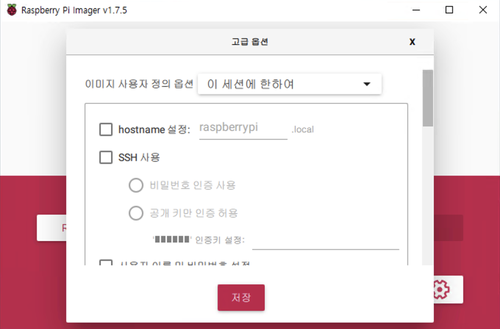

이 화면에서 SSH를 허용하고, 접속에 사용할 Username과 Password를 설정한다. 별도로 설정하지 않으면 기본값으로 `pi` / `raspberry`가 적용된다. 무선랜도 함께 설정하여 홈서버 공유기의 Wi-Fi 정보를 입력해 둔다.

> **참고**: 가능하다면 유선 LAN이 성능 면에서 유리하다. 특히 K8s 환경에서는 더더욱 유선을 권장한다. 다만 이번 구축은 서비스 용도가 아닌 CI/CD 학습 목적이므로 무선랜으로 진행한다.

### SSH 접속 설정

SD 카드에 이미지를 기록하고 라즈베리파이에 삽입하여 부팅하면, 라즈베리파이에 운영체제가 설치된다. 이제 이 작은 컴퓨터는 네트워크에 연결된 하나의 호스트가 되었다.

#### 사설 IP 확인 및 고정

공유기 관리 페이지(`192.168.0.1`)에 접속하여 **고급 설정 > 네트워크 관리 > DHCP 서버 설정**으로 이동한다.

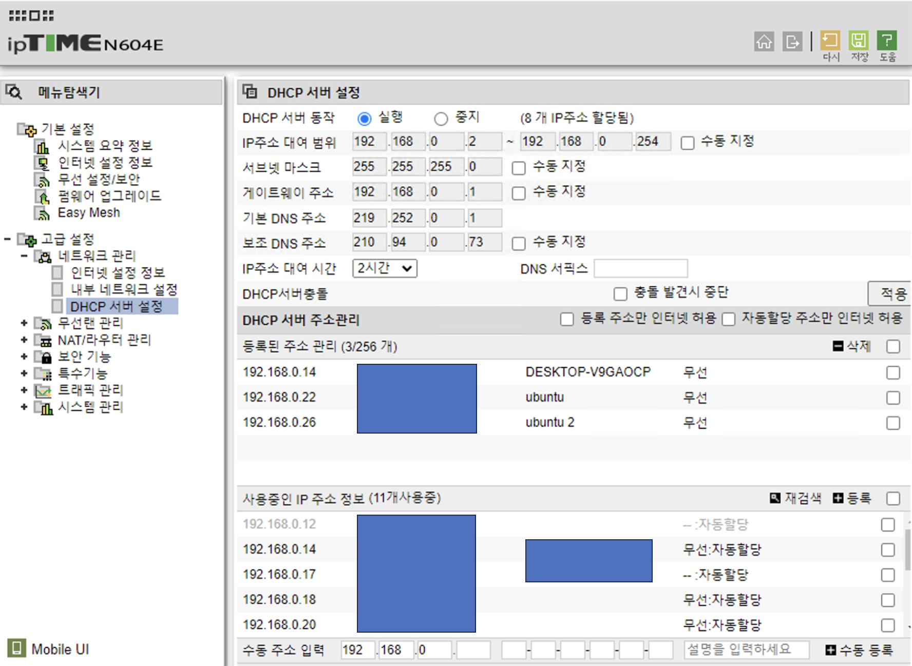

DHCP(Dynamic Host Configuration Protocol)는 네트워크에 연결된 호스트에게 IP 주소를 동적으로 할당하는 프로토콜이다. 문제는 연결할 때마다 다른 IP가 할당될 수 있다는 점이다. 서버로 사용할 라즈베리파이의 IP는 반드시 고정해야 한다.

**사용 중인 IP 주소 정보** 섹션에서 라즈베리파이의 IP를 클릭하고 **수동 등록** 버튼을 눌러 IP를 고정시킨다.

#### 같은 네트워크에서 접속

같은 Wi-Fi를 사용하는 환경에서는 사설 IP로 바로 SSH 접속이 가능하다.

```bash
ssh pi@192.168.0.22
```

패스워드를 입력하면 라즈베리파이에 정상적으로 접근할 수 있다.

#### 다른 네트워크에서 접속 (포트 포워딩)

외부 네트워크에서 접속하려면 공유기에 **포트 포워딩** 설정이 필요하다.

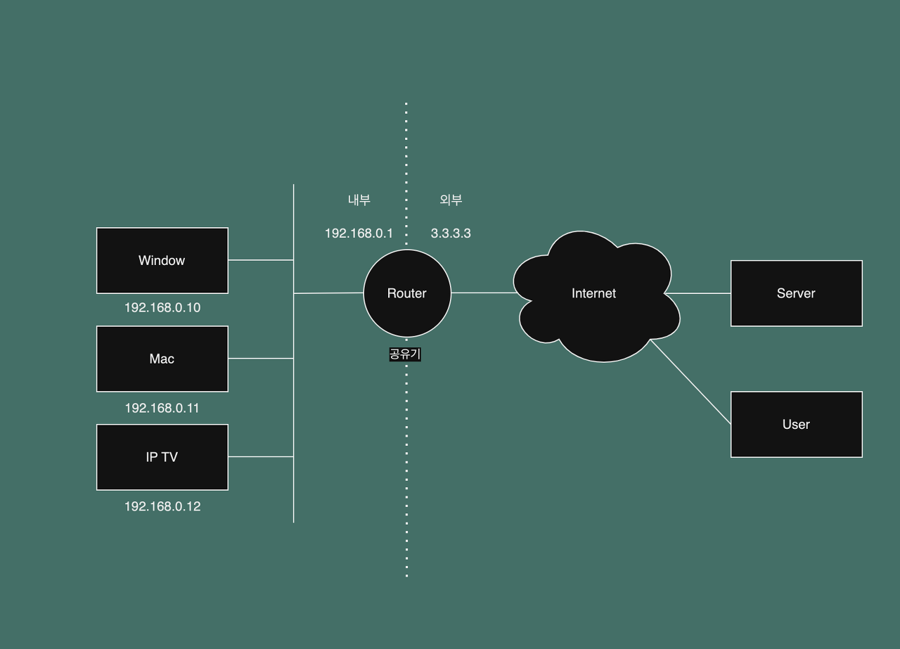

공유기 내부의 호스트들은 DHCP에 의해 `192.168.0.*` 대역의 사설 IP를 할당받는다. 하지만 외부에서는 이 사설 IP를 직접 식별할 수 없다. 따라서 공유기의 공인 IP를 통해 들어오는 특정 포트의 연결을 내부 사설 IP로 전달하는 **포트 포워딩** 설정이 필요하다.

구체적으로는 **외부의 22번 포트로 들어오는 연결을 내부 192.168.0.22의 22번 포트로 전달**하도록 설정한다. 이후에는 공유기의 공인 IP를 통해 SSH 접속이 가능해진다.

```bash
ssh marsboy@100.10.10.1
```

### 다른 라즈베리파이로의 접근


포트 포워딩을 통해 첫 번째 라즈베리파이(192.168.0.22)에 접속한 후, 해당 호스트에서 같은 내부 네트워크에 있는 다른 라즈베리파이로 SSH 연결할 수 있다. 이미 홈서버 네트워크 안에 있으므로 사설 IP만으로 접근이 가능하다.

```bash
# 192.168.0.22에 접속한 상태에서
ssh pi@192.168.0.26
```

---

## 3. K3s 클러스터 구축


> *Lightweight Kubernetes. Easy to install, half the memory, all in a binary of less than 100MB.*

K3s는 쿠버네티스와 완전히 호환되면서도 가볍게 사용할 수 있도록 설계된 경량 쿠버네티스 배포판이다. Kubernetes가 10글자이기 때문에 절반으로 줄여 K3s라고 이름 붙였다고 한다. 노드로 사용할 컴퓨터의 스펙은 **라즈베리파이 4 (4GB RAM)**이다.

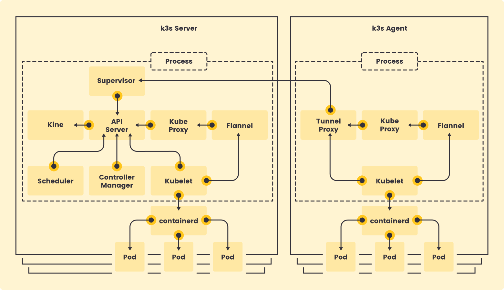

K3s는 위와 같은 구조를 가진다. K8s와 비슷하면서도 약간씩 다른 부분이 있어, 호환성을 위해 몇 가지 설정이 필요하다.

### 마스터 노드 설치

먼저 마스터 노드에서 cgroup 관련 설정을 추가하고 재부팅한다. `sudo -i`로 root 권한을 얻은 후 진행한다.

```bash
echo "cgroup_memory=1 cgroup_enable=memory" >> /boot/cmdline.txt
```

다음으로 고정 IP 설정을 위해 `dhcpcd.conf`를 수정한다.

```bash
nano /etc/dhcpcd.conf
```

다음 내용을 추가한다.

```bash
interface wlan0
static ip_address=192.168.0.128/24
static routers=192.168.0.22
```

`static routers`에는 `ifconfig`를 통해 확인한 현재 호스트의 IP를, `ip_address`에는 사용하지 않는 IP 대역을 할당한다. 설정을 마쳤으면 재부팅한다.

```bash
reboot
```

재부팅 후 다시 `sudo -i`로 root 권한을 얻고, 필수 패키지를 설치한 뒤 K3s를 설치한다.

```bash
apt update & apt upgrade
```

```bash
apt install -y docker.io nfs-common dnsutils curl
```

```bash
curl -sfL https://get.k3s.io | INSTALL_K3S_EXEC="\
    --node-name master --docker  \
    --disable servicelb " sh -
```

K3s 설치가 완료되면 쿠버네티스와의 호환성을 위해 kubeconfig를 설정한다.

```bash
# 마스터 통신을 위한 설정
mkdir ~/.kube
sudo cp /etc/rancher/k3s/k3s.yaml ~/.kube/config
sudo chown -R $(id -u):$(id -g) ~/.kube
echo "export KUBECONFIG=~/.kube/config" >> ~/.bashrc
source ~/.bashrc
```

이제 클러스터 상태를 확인할 수 있다.

```bash
kubectl cluster-info
```

워커 노드 설치를 위해 마스터 노드의 토큰과 IP 주소를 확인하여 저장해 둔다.

```bash
# 마스터 노드 토큰 확인
NODE_TOKEN=$(sudo cat /var/lib/rancher/k3s/server/node-token)
echo $NODE_TOKEN

MASTER_IP=$(kubectl get node master -ojsonpath="{.status.addresses[0].address}")
echo $MASTER_IP
```

### 워커 노드 설치

워커 노드에서도 동일하게 cgroup 설정을 추가하고 재부팅한다.

```bash
sudo echo "cgroup_memory=1 cgroup_enable=memory" >> /boot/cmdline.txt && sudo reboot
```

부팅이 완료되면 `sudo -i`로 root 권한을 얻고, 마스터 노드 정보를 환경 변수에 설정한 뒤 K3s 에이전트를 설치한다.

```bash
NODE_TOKEN={마스터 노드의 토큰}
MASTER_IP={마스터 노드의 IP 주소}

apt update
apt install -y docker.io nfs-common curl

# k3s 워커 노드 설치
curl -sfL https://get.k3s.io | K3S_URL=https://$MASTER_IP:6443 \
	K3S_TOKEN=$NODE_TOKEN \
    INSTALL_K3S_EXEC="--node-name worker --docker" sh -
```

설치가 완료되면 마스터 노드에서 클러스터 상태를 확인한다.

```bash
kubectl get nodes
```

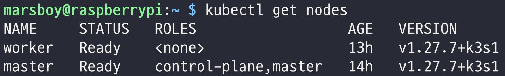

master와 worker 두 노드가 모두 **Ready** 상태로 표시되면 K3s 클러스터 구축이 완료된 것이다.

---

## 4. GitHub Actions를 이용한 CI/CD

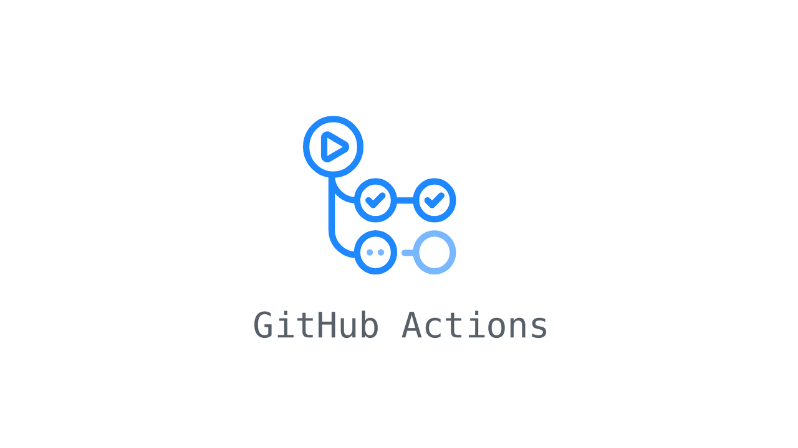

라즈베리파이에 운영체제를 설치하고 쿠버네티스 클러스터 환경 세팅까지 마쳤다. 이제 본격적으로 CI/CD를 구현할 차례이다.

### CI/CD란?

> CI/CD (Continuous Integration/Continuous Delivery)는 애플리케이션 개발 단계를 자동화하여 애플리케이션을 더욱 짧은 주기로 고객에게 제공하는 방법을 의미한다. -- **RedHat**

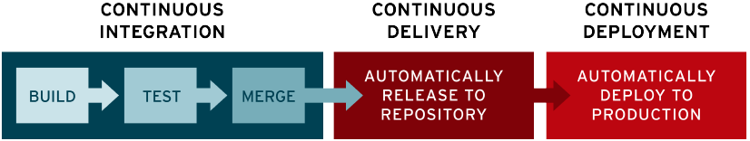

CI/CD가 없는 상황을 생각해 보자. 소스 코드를 수정할 때마다 배포 서버에 SSH로 접속하여, 코드를 업데이트하고, 빌드 명령어를 직접 실행해야 한다. 이 과정은 번거로울 뿐만 아니라 실수가 발생하기 쉽다.

CI/CD 파이프라인은 이러한 과정을 자동화한다. 개발자는 GitHub에 코드를 푸시하기만 하면, 이후의 빌드, 테스트, 배포 과정이 자동으로 진행된다.

- **CI (Continuous Integration)**: 코드 변경 시 자동으로 빌드하고 테스트를 수행한다. 매 PR마다 검증이 이루어지기 때문에 "통합 지옥"을 방지할 수 있다.
- **CD (Continuous Delivery/Deployment)**: CI를 통과한 코드를 자동으로 배포 가능한 상태로 만들거나, 실제 프로덕션에 배포한다.

### GitHub Actions 워크플로우 설정

GitHub Actions는 레포지토리의 `.github/workflows` 디렉터리에 YAML 파일로 워크플로우를 정의한다.

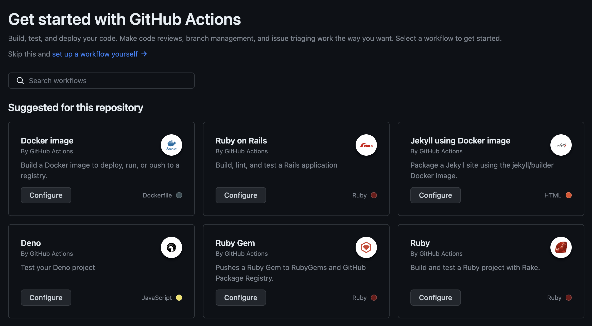

레포지토리의 **Actions** 탭에 들어가면 GitHub이 프로젝트 상태를 분석하여 적합한 워크플로우 템플릿을 추천해 준다.

#### CI 워크플로우 작성

먼저 기본적인 CI 워크플로우를 작성한다. 아래는 Ruby on Rails 프로젝트를 기준으로 한 예시이다.

```yaml
name: "Ruby on Rails CI"
on:
  push:
    branches: [ "main" ]
  pull_request:
    branches: [ "main" ]
jobs:
  test:
    runs-on: ubuntu-latest
    steps:
      - name: Checkout code
        uses: actions/checkout@v3
      - name: Install Ruby and gems
        uses: ruby/setup-ruby@55283cc23133118229fd3f97f9336ee23a179fcf # v1.146.0
        with:
          bundler-cache: true
      - name: Run tests
        run: bin/rake
```

이 워크플로우는 `main` 브랜치에 푸시하거나 PR을 올리면 다음 순서로 실행된다.

1. Ubuntu 환경에서 실행 준비
2. Ruby 및 gems 설치
3. 테스트 실행

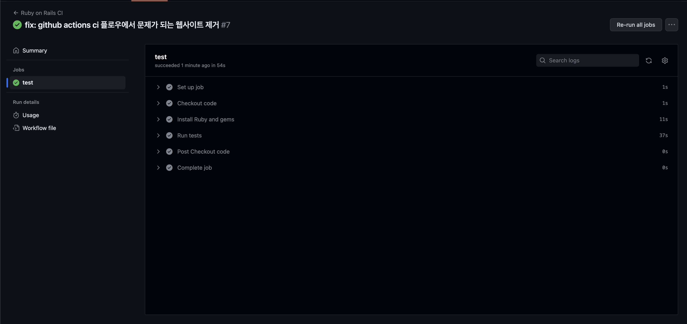

모든 단계를 정상적으로 통과하면 녹색 체크 표시가 나타난다.

#### CD 워크플로우 추가 (Docker 이미지 빌드 및 푸시)

CI를 통과한 코드를 Docker 이미지로 빌드하여 Docker Hub에 업로드하는 CD 단계를 추가한다. Docker Hub 로그인이 필요하므로 먼저 GitHub 레포지토리의 **Settings > Secrets and variables**에 `DOCKER_USERNAME`과 `DOCKER_PASSWORD`를 등록한다.

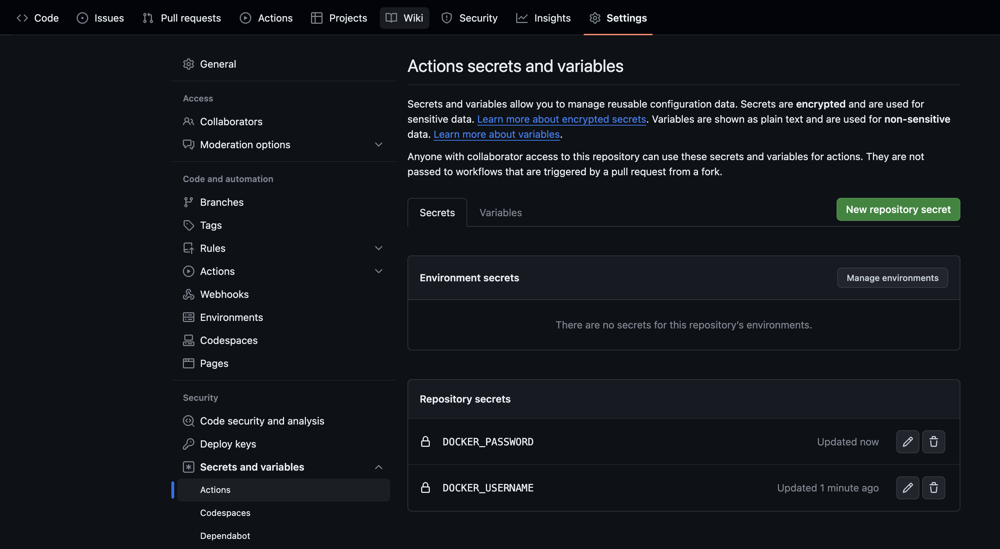

시크릿 설정을 마쳤으면 CI와 CD를 결합한 전체 워크플로우를 작성한다.

```yaml
name: "Ruby on Rails CI"
on:
  push:
    branches: [ "main" ]
  pull_request:
    branches: [ "main" ]
jobs:
  continuous-integration:
    runs-on: ubuntu-latest
    steps:
      - name: Checkout code
        uses: actions/checkout@v3

      - name: Install Ruby and gems
        uses: ruby/setup-ruby@55283cc23133118229fd3f97f9336ee23a179fcf # v1.146.0
        with:
          bundler-cache: true

      - name: Run tests
        run: bin/rake

  continuous-delivery:
    needs: continuous-integration
    runs-on: ubuntu-latest
    steps:
      - name: Checkout out the repo
        uses: actions/checkout@v4

      - name: Login to Docker Hub
        uses: docker/login-action@v1
        with:
          username: ${{ secrets.DOCKER_USERNAME }}
          password: ${{ secrets.DOCKER_PASSWORD }}

      - name: Extract metadata (tags, labels) for Docker
        id: meta
        uses: docker/metadata-action@9ec57ed1fcdbf14dcef7dfbe97b2010124a938b7
        with:
          images: ${{ secrets.DOCKER_USERNAME }}/uos-status

      - name: Build and push Docker image
        uses: docker/build-push-action@3b5e8027fcad23fda98b2e3ac259d8d67585f671
        with:
          context: .
          file: ./Dockerfile
          push: true
          tags: ${{ steps.meta.outputs.tags }}
          labels: ${{ steps.meta.outputs.labels }}
```

핵심은 `continuous-delivery` 잡에 `needs: continuous-integration`을 지정하여, CI가 성공한 경우에만 CD가 실행되도록 한 부분이다.

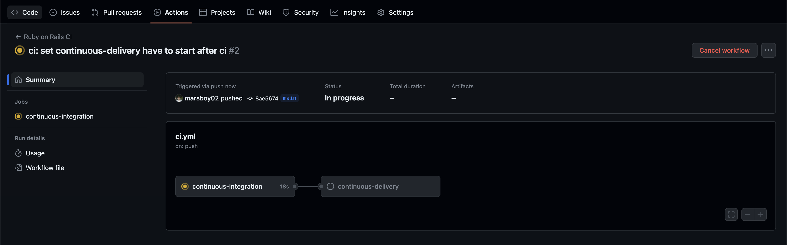

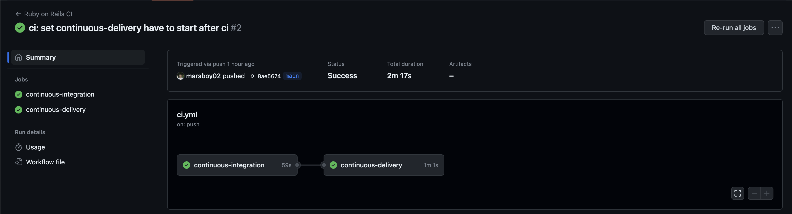

빌드, 테스트, Docker 이미지 업로드까지 모든 과정이 정상적으로 완료되면 위와 같이 두 잡 모두 성공 표시가 나타난다. 이제 코드를 푸시하기만 하면 자동으로 Docker Hub에 최신 이미지가 업로드된다.

---

## 5. Tailscale VPN으로 원격 접속

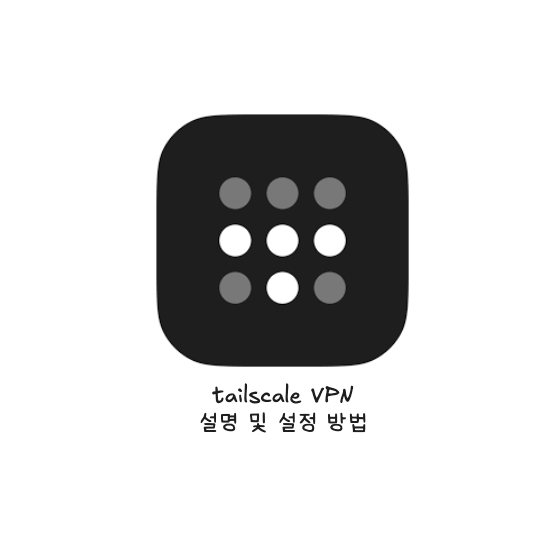

홈서버를 구축했지만, 집 밖에서 접근하려면 기존 방식(포트 포워딩)으로는 한계가 있다. 공유기의 동적 IP가 변경될 수 있고, 보안상으로도 SSH 포트를 외부에 직접 노출하는 것은 바람직하지 않다. 이 문제를 깔끔하게 해결해 주는 것이 **Tailscale**이다.

### Tailscale이란?

**Tailscale**은 WireGuard 기반의 메시 VPN이다. 키 관리, NAT 통과, 접근 제어 같은 복잡한 부분을 대신 처리해 준다.

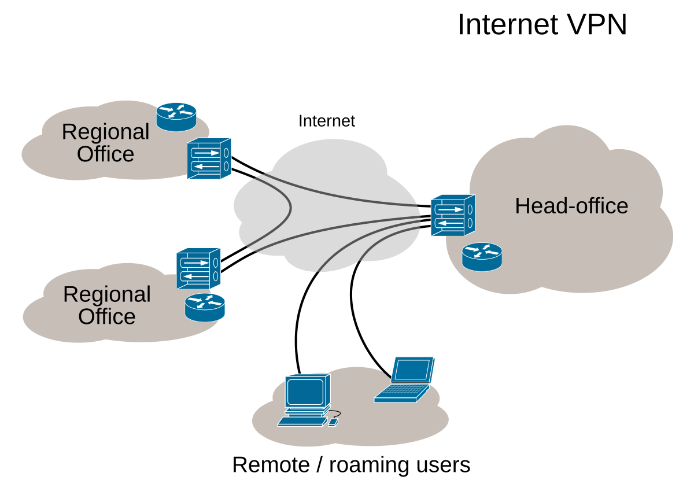

VPN은 인터넷을 거쳐가는 트래픽을 안전하게 보낼 수 있도록 터널을 만들어 트래픽을 보호하는 역할을 한다. Tailscale은 여기에 더해 다음과 같은 기능을 제공한다.

- **보안**: Google, Microsoft OAuth를 통한 로그인, 자동 키 관리, ACL을 통한 접근 제어, 접근 기록 관리
- **편의성**: MagicDNS를 통해 `example.ts.net` 같은 호스트 이름으로 접근 가능
- **메시 네트워크**: 중앙 서버 없이 노드 간 P2P 통신

#### Tailnet

**Tailnet**은 Tailscale에 로그인한 모든 장비가 하나의 프라이빗 네트워크를 형성하는 개념이다. 각 노드는 `100.x.y.z` 같은 Tailscale 전용 IP를 할당받고, 가능한 한 P2P로 직접 WireGuard 터널을 맺는다. P2P가 불가능한 경우에는 DERP 중계 서버를 경유한다.


Tailscale 콘솔에서 같은 VPN에 연결된 기기를 확인하고 관리할 수 있다. Tailscale을 설치하고 실행하면 **서로 어디에 있든 같은 LAN에 있는 것처럼** 통신할 수 있게 된다.

### WireGuard란?

WireGuard는 최신 VPN 터널링 프로토콜로, OpenVPN이나 IPSec보다 단순하고 경량화되어 있다. 적은 수의 모던 암호 알고리즘과 작은 코드베이스가 특징이다.

다만 WireGuard만 단독으로 사용하면 키 관리나 NAT 설정 등을 직접 해야 하고, 망이 늘어날수록 설정이 n^2으로 증가하는 문제가 있다. Tailscale은 메시 토폴로지와 ACL을 통해 이러한 복잡성을 해소해 준다.

### 설치 및 실행

리눅스 기준으로 다음 명령어를 통해 설치 및 실행한다.

```shell
curl -fsSL https://tailscale.com/install.sh | sh
sudo tailscale up
```

이것만으로 Tailscale을 설치한 노드 간 피어 통신이 가능해진다. 하지만 홈서버의 내부 네트워크(192.168.x.x)에 외부에서 접근하려면 추가 설정이 필요하다.

<!-- TODO: 다이어그램 필요 - Tailscale을 적용한 홈 네트워크 전체 아키텍처 (외부 노드 -> Tailscale tunnel -> 홈 공유기 -> K3s 클러스터) -->

### 라우팅 설정

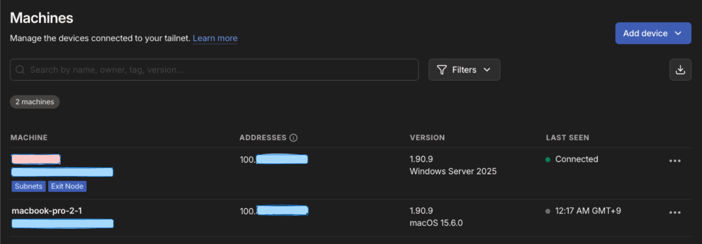

Tailscale 콘솔에서 **Subnets**, **Exit Node** 같은 태그를 볼 수 있다. 기본적인 Tailscale은 같은 Tailnet 노드끼리의 통신만 라우팅하고, 일반 인터넷은 각자 로컬 네트워크를 통해 나간다. 라우팅 범위를 확장하려면 다음 두 가지 설정이 필요하다.

#### Exit Node: 모든 인터넷 트래픽을 특정 노드로

Exit Node를 설정하면 클라이언트의 기본 라우트(`0.0.0.0/0`, `::/0`)가 해당 노드를 향하게 된다. 사실상 VPN 서버처럼 동작하여, 인터넷 트래픽이 먼저 Exit Node로 가서 거기서 다시 외부로 나간다.

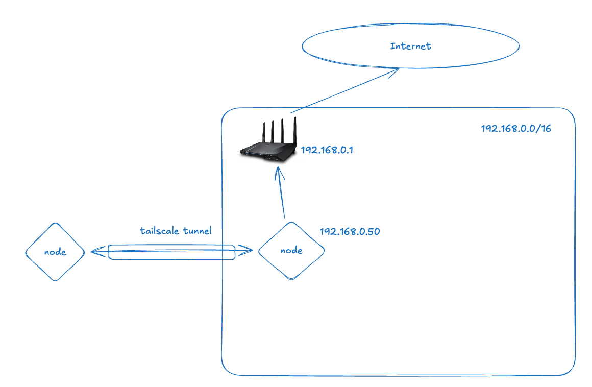

```shell
sudo tailscale up --advertise-exit-node
```

#### Subnet Router: 내부 네트워크 대역으로 접근

**Subnet Router**는 특정 서브넷(예: `192.168.0.0/24`)에 대한 라우트를 광고하는 노드이다. Tailscale을 설치할 수 없는 장비(NAS, 프린터, IoT 기기 등)에 접근할 때 사용한다.

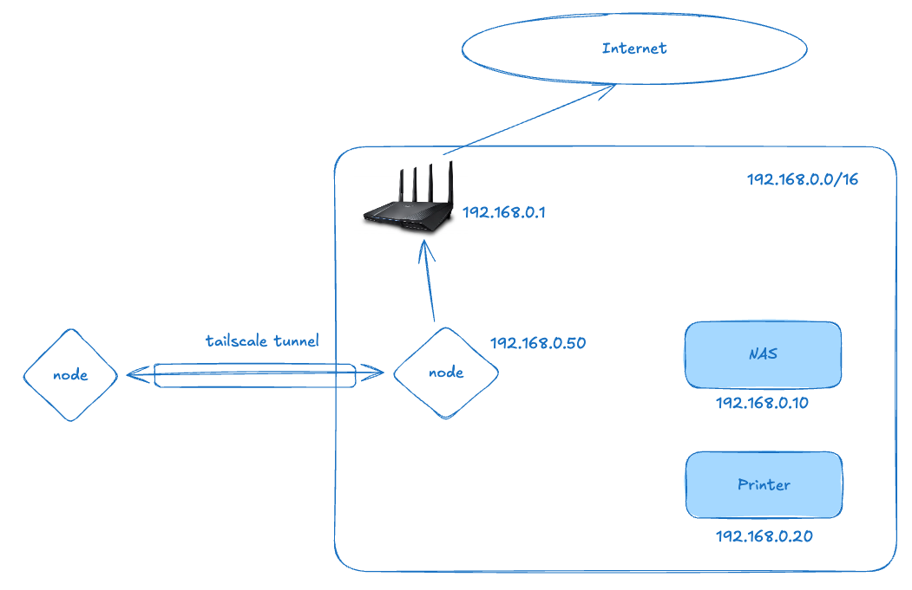

Exit Node만 사용하면 해당 노드를 통해 인터넷 트래픽은 나가지만, 같은 대역에 있는 NAS나 프린터 등 내부 장비에는 접근할 수 없다. 이 경우 해당 노드를 Subnet Router로 설정하고 내부 대역을 advertise 해야 한다.

```shell
sudo tailscale up \
  --advertise-exit-node \
  --advertise-routes=192.168.0.0/24
```

> **참고**: Subnet Router는 Exit Node와 함께 설정해야 한다. 단독으로 설정하려 하면 둘 다 입력하라는 메시지가 표시된다.

### 콘솔에서 라우트 승인

명령어로 설정을 완료한 후, Tailscale 웹 콘솔에서 해당 노드의 라우트를 승인해야 한다.

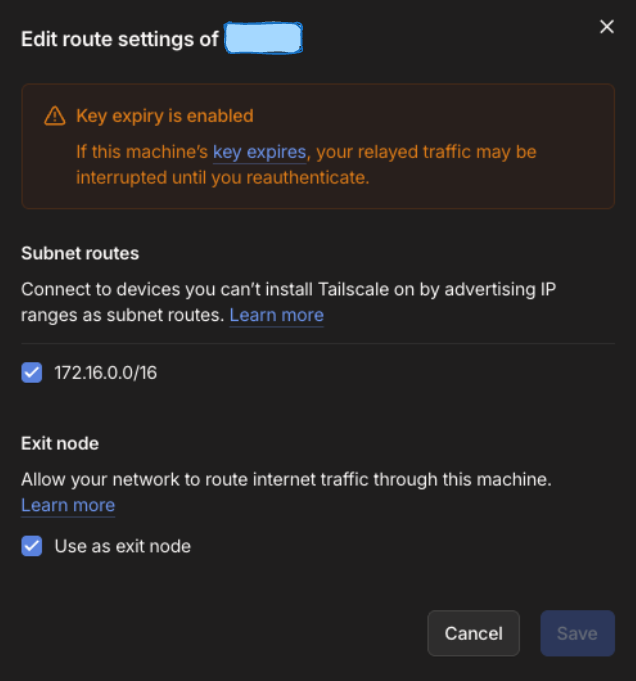

서버 역할을 하는 노드의 설정에서 Subnet Routes와 Exit Node 체크박스를 활성화하고 저장하면 된다.

이로써 외부에서도 Tailscale VPN을 통해 홈서버의 K3s 클러스터는 물론, 같은 내부 네트워크에 있는 모든 장비에 안전하게 접근할 수 있게 된다.

---

## 마치며

이 글에서는 AWS 프리티어 종료를 계기로, 라즈베리파이를 이용하여 처음부터 홈서버를 구축하는 전체 과정을 다루었다.

1. **라즈베리파이 OS 설치 및 네트워크 설정** -- SSH 접속, 고정 IP, 포트 포워딩
2. **K3s 클러스터 구축** -- 마스터/워커 노드 설치 및 클러스터 구성
3. **GitHub Actions CI/CD** -- 자동 빌드, 테스트, Docker 이미지 배포
4. **Tailscale VPN** -- 어디서든 안전하게 홈서버에 접근

클라우드 서비스의 편리함을 포기하는 대신, 네트워크 기초부터 컨테이너 오케스트레이션, CI/CD 파이프라인, VPN까지 인프라 전반을 직접 구성하면서 깊이 있는 학습이 가능했다. 비용 면에서도 초기 라즈베리파이 구매 비용 외에는 거의 들지 않기 때문에, 인프라를 학습하고자 하는 분들에게 좋은 선택지가 될 수 있을 것이다.

### 참고 자료

- [Raspberry Pi 공식 사이트](https://www.raspberrypi.com/software/)
- [K3s 공식 문서](https://docs.k3s.io/)
- [core_kubernetes - 쿠버네티스 설치](https://github.com/bjpublic/core_kubernetes/tree/master/chapters/03)
- [GitHub Actions - Publishing Docker Images](https://docs.github.com/en/actions/publishing-packages/publishing-docker-images)
- [Tailscale 공식 문서](https://tailscale.com/kb/)
- [Tailscale Subnet Routers](https://tailscale.com/kb/1019/subnets)
- [WireGuard GitHub](https://github.com/wireguard)
