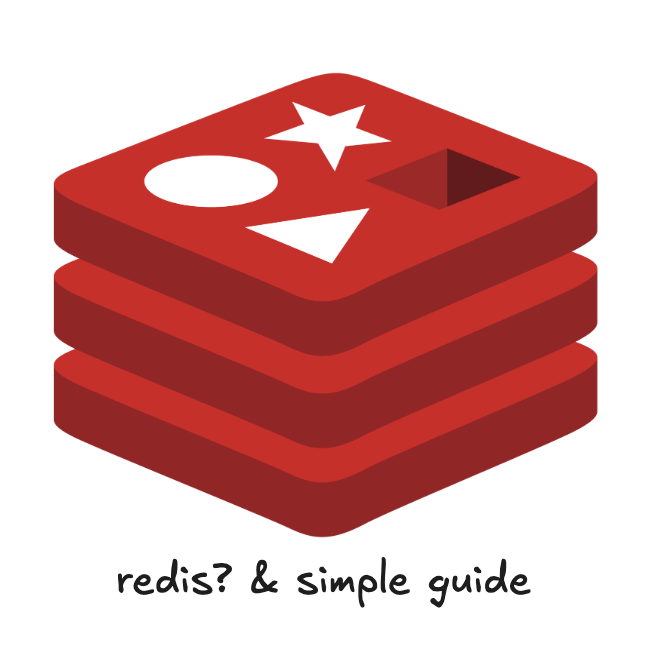
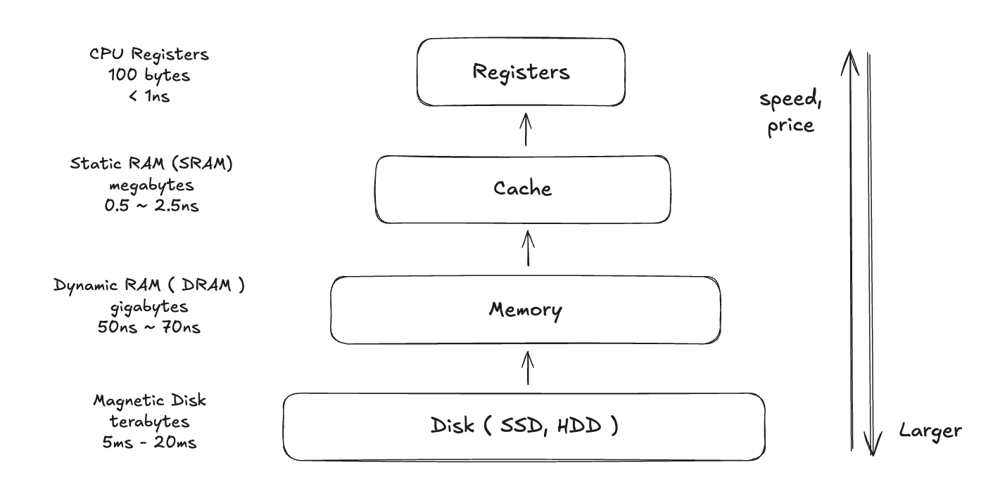
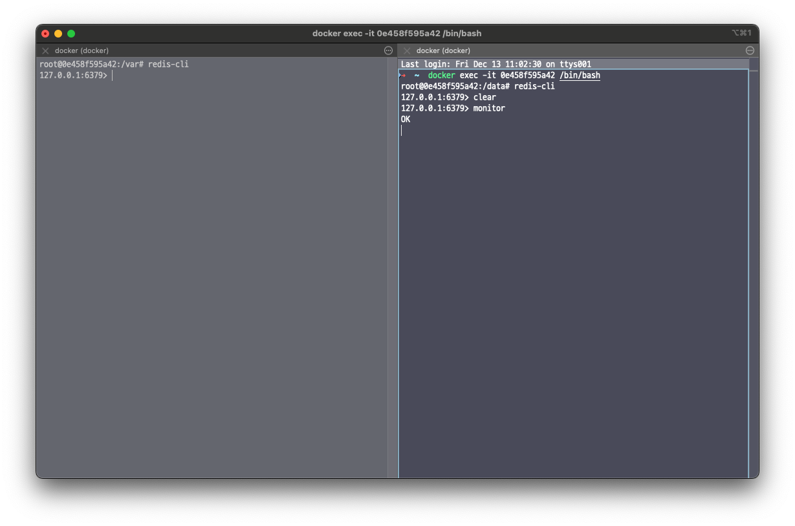
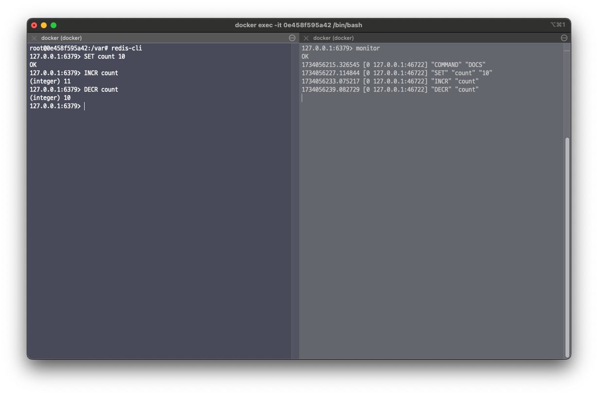
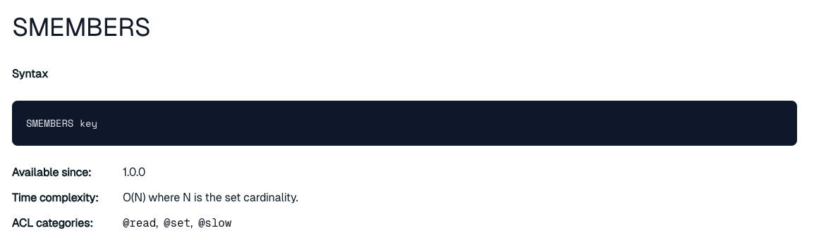
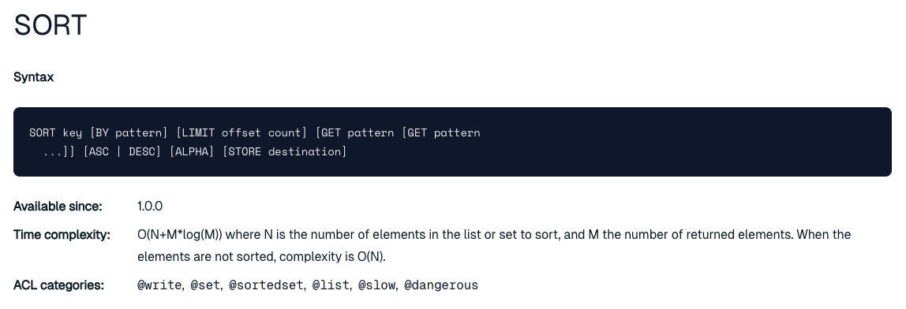
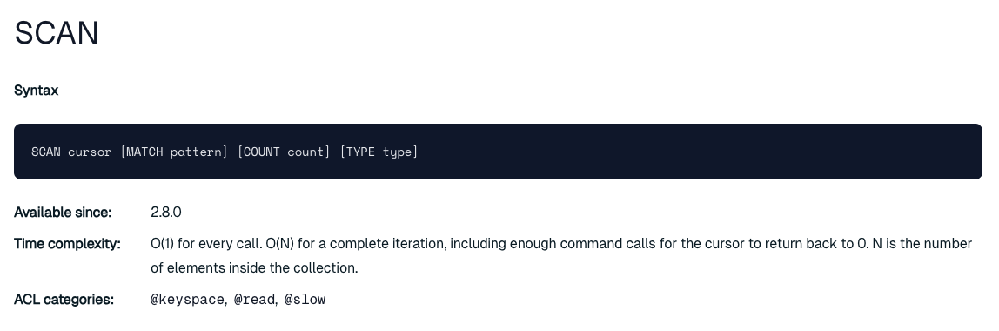

예전에 Redis에 대해서 재미있게 다룬 글을 본 적이 있다. 당시에는 Redis에 대한 깊은 이해 없이도 글쓴이의 필력에 이끌려 마지막 문단까지 읽어 내려갔던 기억이 난다.

- **[June] 레디스의 50가지 그림자** : https://papercut.blog/235

그때까지만 해도 Redis라고 하면 "캐시할 때 쓰는 것" 정도의 인식이 전부였다. 인메모리 데이터 그리드라는 것, key-value 모델을 사용한다는 점, 그리고 마스터-슬레이브 구조로 클러스터링이 가능하다는 점 정도가 알고 있는 전부였다.

하지만 직접 Redis를 여러 번 사용하면서 한계에 봉착하곤 했다. `maxmemory`를 설정하지 않아 스왑 메모리까지 침범하며 성능이 급격히 저하되거나, O(1) 시간복잡도를 제공하는 Redis에 부적절한 명령어를 사용해 성능이 제대로 나오지 않는 등의 문제가 있었다.

이 글에서는 Redis의 기본 개념과 사용법부터 시작해서, 메모리 관리 전략과 프로덕션 운영 팁까지 폭넓게 다뤄보고자 한다.

---

## 1. Redis란?

**Redis(Remote Dictionary Server)**는 정확히 말하면 **인메모리 데이터 그리드**이다. 메모리를 사용하며 그리드 형태이기 때문에 분산 환경에서도 손쉽게 확장할 수 있다. In-Memory라는 것은 말 그대로 메모리에 데이터를 저장하고 가져오는 역할을 한다.

### 데이터베이스와의 차이

일반적인 데이터베이스는 대부분의 데이터를 디스크(SSD, HDD)에 저장한다. 반면 Redis는 메모리에 데이터를 저장하기 때문에 데이터를 읽고 쓰는 속도가 압도적으로 빠르다.



위 그림은 컴퓨터의 메모리 계층 구조를 보여준다. CPU에 가까울수록 속도와 가격이 올라가고, 멀어질수록 용량이 커진다. Disk에서 데이터를 가져오는 것과 Memory에서 가져오는 것의 속도 차이는 단위 자체가 다를 정도로 크다. 데이터베이스는 테라바이트 규모의 데이터를 저장할 수 있지만, Redis는 기가바이트 수준의 데이터를 다루는 대신 비교할 수 없는 속도를 제공한다. 이러한 트레이드오프를 이해하고 적절한 스토리지를 선택하는 것이 중요하다.

### Redis의 핵심 특징

1. **인메모리(In-Memory)**: 데이터를 메모리에 저장하여 디스크 기반 DB 대비 압도적인 읽기/쓰기 속도를 제공한다.
2. **Key-Value 스토어**: 키-값 형태로 데이터를 저장하며, 이를 기반으로 다양한 자료구조를 지원한다.
3. **인메모리 데이터 그리드**: SQL을 사용하지 않아 NoSQL 계열로 분류되기는 하지만, 본질적으로는 인메모리 데이터 그리드이다. 그리드로서 정의되기 때문에 마스터-슬레이브 복제를 통한 클러스터 구축이 용이하다.

### 핵심 자료구조

<!-- TODO: Redis 자료구조(String, List, Set, Hash, Sorted Set)를 시각적으로 표현하는 다이어그램 추가 -->

Redis는 단순한 key-value 저장소를 넘어서 다양한 자료구조를 지원한다.

| 자료구조 | 설명 | 주요 명령어 |
|---------|------|-----------|
| **String** | 가장 기본적인 자료형. 문자열, 숫자 등 저장 | `SET`, `GET`, `INCR`, `DECR` |
| **List** | 순서가 있는 문자열 리스트. Queue로 활용 가능 | `LPUSH`, `RPUSH`, `LPOP`, `RPOP` |
| **Set** | 중복 없는 문자열 집합 | `SADD`, `SMEMBERS`, `SISMEMBER` |
| **Hash** | 필드-값 쌍의 컬렉션. 객체 표현에 적합 | `HSET`, `HGET`, `HGETALL` |
| **Sorted Set** | 점수 기반으로 정렬되는 Set | `ZADD`, `ZRANGE`, `ZRANK` |

---

## 2. Redis 실행과 기본 사용법

### Docker로 Redis 실행하기

환경 설정의 편의를 위해 Docker를 활용한다. Docker가 없다면 [Redis 공식 설치 가이드](https://redis.io/docs/latest/operate/oss_and_stack/install/install-stack/)를 참고하자.

```bash
# Redis 컨테이너 실행
docker run -d redis:7.4.1

# 실행 중인 컨테이너 확인
docker ps

# 컨테이너 접속
docker exec -it <CONTAINER_ID> /bin/bash

# Redis CLI 접속
redis-cli
```

### 모니터링 세팅

두 개의 `redis-cli`를 띄워서 하나는 모니터링용, 하나는 테스트용으로 사용한다. 모니터링 쉘에서 `monitor` 명령어를 입력하면 실시간으로 Redis에서 일어나는 모든 명령을 확인할 수 있다.

```bash
# 모니터링 쉘에서
monitor
```



위처럼 터미널을 분할하면 오른쪽에서 모니터링하면서 왼쪽에서 Redis 명령어를 테스트할 수 있다.

### 기본 명령어 사용

간단하게 값을 세팅하고 증감시키는 예제를 살펴보자.



```bash
# 값 설정
SET count 10

# 값 증가
INCR count

# 값 감소
DECR count

# 값 조회
GET count
```

이 외에도 자주 사용하는 명령어들은 다음과 같다.

- **DEL** : 키 삭제
- **EXPIRE / TTL** : 만료 시간 설정 및 확인
- **SCAN** : 키 탐색
- **HSET / HGET** : Hash 자료구조 활용
- **LPUSH / RPUSH / LPOP / RPOP** : List 자료구조 활용

### 시간복잡도에 주의하라

Redis를 사용할 때 가장 중요한 것 중 하나는 각 명령어의 **시간복잡도**이다. Redis는 key-value 기반이므로 대부분 O(1)의 시간복잡도를 제공하지만, 사용하는 명령어에 따라 O(N)이 될 수 있다.

- [Redis 공식 Commands 문서](https://redis.io/docs/latest/commands/)에서 각 명령어의 시간복잡도를 확인할 수 있다.

#### 데이터 구조 크기에 의존하는 연산

List, Set, Hash 등의 자료구조에서 `LLEN`, `LRANGE`, `SMEMBERS` 같은 명령어를 사용할 때는 데이터 크기에 따라 시간복잡도가 증가할 수 있으므로 주의해야 한다.



#### 정렬 및 탐색

`SORT` 명령은 O(N+M*log(M))의 시간복잡도를 가지므로, 대량의 데이터에 대해 사용할 때 신중해야 한다.



탐색에 있어서도 `KEYS *`와 `SCAN` 명령어 각각의 장단점이 존재한다. `KEYS *`는 모든 키를 한 번에 반환하므로 키가 많은 프로덕션 환경에서는 서버를 블로킹할 수 있다. 반면 `SCAN`은 커서 기반으로 점진적으로 탐색하여 블로킹 위험을 줄여준다.



---

## 3. 서버와의 연결 (Spring Boot 예시)

실제 운영 환경에서는 `redis-cli`를 직접 사용하기보다는 서버 애플리케이션에서 Redis 클라이언트 라이브러리를 통해 연결한다. Spring Boot를 예로 들면 다음과 같이 설정할 수 있다.

```groovy
// build.gradle에 의존성 추가
dependencies {
    implementation 'org.springframework.boot:spring-boot-starter-data-redis'
}
```

```yaml
# application.yml - Redis 서버 정보 지정
spring:
  redis:
    host: localhost
    port: 6379
```

> Redis의 기본 포트는 **6379**이다.

Redis 연결을 위한 설정 클래스를 만든다.

```java
@Configuration
public class RedisConfig {

    @Bean
    public RedisConnectionFactory redisConnectionFactory() {
        return new LettuceConnectionFactory();
    }

    @Bean
    public RedisTemplate<String, String> redisTemplate(RedisConnectionFactory connectionFactory) {
        RedisTemplate<String, String> redisTemplate = new RedisTemplate<>();
        redisTemplate.setConnectionFactory(connectionFactory);

        redisTemplate.setKeySerializer(new StringRedisSerializer());
        redisTemplate.setValueSerializer(new StringRedisSerializer());

        redisTemplate.setHashKeySerializer(new StringRedisSerializer());
        redisTemplate.setHashValueSerializer(new StringRedisSerializer());

        redisTemplate.afterPropertiesSet();
        return redisTemplate;
    }
}
```

이후 서비스 레이어에서 간단하게 사용할 수 있다.

```java
@Service
public class RedisExampleService {

    private final StringRedisTemplate redisTemplate;

    public RedisExampleService(StringRedisTemplate redisTemplate) {
        this.redisTemplate = redisTemplate;
    }

    public void saveValue(String key, String value) {
        redisTemplate.opsForValue().set(key, value);
    }

    public String getValue(String key) {
        return redisTemplate.opsForValue().get(key);
    }
}
```

---

## 4. 메모리 관리: maxmemory


Redis를 기본 설정으로 실행하면 데이터를 사실상 무한정 넣을 수 있다. 인메모리 데이터 스토어에 데이터를 무한정 넣을 수 있다니, 말이 되지 않는 것 같지만 그 비밀은 **maxmemory** 설정에 있다.

Redis는 `maxmemory`를 별도로 설정하지 않으면 메모리 제한을 걸지 않는다. 물리 메모리를 전부 소진하면 운영체제의 **스왑 영역**까지 사용하게 되고, 이 시점부터 Redis의 성능은 급격히 저하된다.

### maxmemory 설정

`redis.conf` 파일에서 다음과 같이 설정할 수 있다.

```bash
# redis.conf에서 maxmemory 설정
# 바이트 단위로 메모리 사용 제한을 설정한다.
# 메모리 한계에 도달하면 eviction 정책에 따라 키를 제거한다.
maxmemory 256mb
```

- **maxmemory 미설정**: 메모리 제한 없음. 물리 메모리 소진 시 스왑 사용으로 인한 극심한 성능 저하.
- **maxmemory 설정 + noeviction(기본)**: 메모리 한계 도달 시 쓰기 명령에 대해 에러를 반환. 읽기(GET 등)는 정상 동작.

> **참고**: 레디스 클러스터에서 master-slave 구성을 사용하는 경우, slave에 데이터를 전달하기 위한 output buffer 크기가 used memory에서 제외된다. 따라서 slave가 있는 경우에는 maxmemory를 약간 낮게 설정하여 output buffer를 위한 여유 메모리를 확보하는 것이 좋다.

### Eviction 정책 비교 (maxmemory-policy)

`maxmemory`에 도달했을 때 Redis가 어떤 키를 제거할지 결정하는 정책이다.

| 정책 | 대상 범위 | 알고리즘 | 설명 |
|-----|---------|---------|------|
| `volatile-lru` | expire 설정된 키 | LRU | 가장 오래 사용되지 않은 키 제거 |
| `allkeys-lru` | 모든 키 | LRU | 가장 오래 사용되지 않은 키 제거 |
| `volatile-lfu` | expire 설정된 키 | LFU | 가장 적게 사용된 키 제거 |
| `allkeys-lfu` | 모든 키 | LFU | 가장 적게 사용된 키 제거 |
| `volatile-random` | expire 설정된 키 | Random | 랜덤 제거 |
| `allkeys-random` | 모든 키 | Random | 랜덤 제거 |
| `volatile-ttl` | expire 설정된 키 | TTL | 만료 시간이 가장 임박한 키 제거 |
| `noeviction` | - | - | 제거 안 함. 쓰기 시 에러 반환 **(기본값)** |

> **LRU(Least Recently Used)**: 가장 최근에 사용되지 않은 키를 제거한다. 캐시 용도로 사용할 때 가장 일반적인 선택이다.
>
> **LFU(Least Frequently Used)**: 사용 빈도가 가장 낮은 키를 제거한다. 핫/콜드 데이터가 명확한 워크로드에 적합하다.

### Redis 메모리가 부족하면?

Redis를 운영하다가 Redis가 죽는 것을 봤다면 대부분의 경우는 **OOM(Out of Memory)**이다.

- **직접 호스트에서 운영**: 리눅스의 `OOM_Killer` 프로세스에 의해 Redis 프로세스가 강제 종료될 수 있다.
- **Kubernetes에서 운영**: Pod의 `resources.limits.memory`를 초과하면 컨테이너가 OOMKilled 상태로 종료된다.

### 환경별 설정 방법

#### Docker에서 설정

```dockerfile
FROM redis
COPY redis.conf /usr/local/etc/redis/redis.conf
CMD [ "redis-server", "/usr/local/etc/redis/redis.conf" ]
```

또는 호스트의 설정 파일을 볼륨 마운트하여 사용할 수 있다.

```bash
docker run -v /myredis/conf:/usr/local/etc/redis \
  --name myredis redis redis-server /usr/local/etc/redis/redis.conf
```

#### Kubernetes에서 설정

ConfigMap을 활용하여 Redis 설정을 관리할 수 있다.

```yaml
apiVersion: v1
kind: ConfigMap
metadata:
  name: example-redis-config
data:
  redis-config: |
    maxmemory 2mb
    maxmemory-policy allkeys-lru
```

```yaml
apiVersion: v1
kind: Pod
metadata:
  name: redis
spec:
  containers:
  - name: redis
    image: redis:5.0.4
    command:
      - redis-server
      - "/redis-master/redis.conf"
    env:
    - name: MASTER
      value: "true"
    ports:
    - containerPort: 6379
    resources:
      limits:
        cpu: "0.1"
    volumeMounts:
    - mountPath: /redis-master-data
      name: data
    - mountPath: /redis-master
      name: config
  volumes:
    - name: data
      emptyDir: {}
    - name: config
      configMap:
        name: example-redis-config
        items:
        - key: redis-config
          path: redis.conf
```

`volumeMounts`를 통해 `/redis-master` 경로에 config 파일을 마운트하고, `redis-server` 시작 시 해당 설정 파일을 참조하도록 구성한다.

- **참고**: [Kubernetes 공식 문서 - 컨피그맵을 사용해서 Redis 설정하기](https://kubernetes.io/ko/docs/tutorials/configuration/configure-redis-using-configmap/)

---

## 5. 프로덕션 운영 팁

### 메모리 제한 미설정으로 인한 장애 사례

실제로 다음과 같은 상황에서 장애가 발생할 수 있다.

1. **스왑 메모리 침범**: `maxmemory`를 설정하지 않은 상태에서 대량의 데이터를 저장하면, 물리 메모리가 부족해지면서 디스크의 스왑 영역을 사용하게 된다. 인메모리의 장점이 사라지고 응답 시간이 수십 배 이상 증가한다.
2. **OOM에 의한 프로세스 종료**: 메모리를 계속 소비하다가 리눅스의 `OOM_Killer`에 의해 Redis 프로세스가 강제 종료되면 저장된 모든 데이터가 유실된다.
3. **Kubernetes OOMKilled**: Pod의 메모리 limits를 넘어서면 컨테이너가 재시작되며 데이터가 유실된다.

> 실제 경험담: 학교 공지사항을 스크래핑하는 크론잡을 만들어 공지사항 전체 내용을 Redis에 저장했더니, maxmemory 설정 없이 운영하다가 성능 저하와 비정상 동작이 발생했다. 단순 캐싱이나 TTL 기반 토큰 저장에서는 문제가 없었지만, 대량의 텍스트 데이터를 넣는 순간 한계가 드러났다.

### RDB vs AOF: 영속성 전략

Redis는 인메모리 스토어이지만, 데이터를 디스크에 영속화하는 두 가지 방법을 제공한다.

<!-- TODO: RDB와 AOF 비교 다이어그램 추가 -->

| 특성 | RDB (Snapshotting) | AOF (Append Only File) |
|-----|-------------------|----------------------|
| **방식** | 특정 시점의 전체 스냅샷 저장 | 모든 쓰기 명령을 로그로 기록 |
| **복구 속도** | 빠름 | 상대적으로 느림 |
| **데이터 안전성** | 마지막 스냅샷 이후 데이터 유실 가능 | fsync 정책에 따라 최소 유실 |
| **디스크 사용** | 효율적 | 상대적으로 큼 |
| **권장 사용** | 백업, 재해 복구 | 데이터 유실 최소화가 중요한 경우 |

프로덕션 환경에서는 **RDB + AOF를 함께 사용**하는 것이 일반적인 권장 사항이다. RDB로 주기적인 백업을 수행하고, AOF로 쓰기 명령을 기록하여 데이터 유실을 최소화한다.

### 모니터링 핵심 메트릭

Redis를 안정적으로 운영하기 위해 반드시 모니터링해야 하는 핵심 메트릭들이다.

```bash
# Redis 서버 정보 전체 조회
redis-cli INFO

# 메모리 관련 정보 조회
redis-cli INFO memory

# 주요 확인 항목
redis-cli INFO stats
```

| 메트릭 | 설명 | 임계값 (참고) |
|-------|------|-------------|
| `used_memory` | 현재 사용 중인 메모리 | maxmemory의 80% 이상이면 주의 |
| `used_memory_rss` | OS가 Redis에 할당한 실제 메모리 | used_memory와의 차이가 크면 단편화 의심 |
| `mem_fragmentation_ratio` | 메모리 단편화 비율 | 1.5 이상이면 단편화 심각 |
| `evicted_keys` | Eviction으로 제거된 키 수 | 급격히 증가하면 메모리 부족 |
| `connected_clients` | 연결된 클라이언트 수 | 비정상적 증가 모니터링 |
| `instantaneous_ops_per_sec` | 초당 처리 명령 수 | 기준선 대비 급격한 변화 감지 |
| `keyspace_hits / keyspace_misses` | 캐시 히트율 | miss 비율이 높으면 캐시 전략 재검토 |

### 베스트 프랙티스

1. **이중 메모리 제한**: `redis.conf`의 `maxmemory`와 Kubernetes의 `resources.limits.memory`를 모두 설정한다. 쿠버네티스 클러스터 운영에서는 만약을 대비해 두 곳 모두 제한을 거는 것이 안전하다.

2. **적절한 Eviction 정책 선택**: 캐시 용도라면 `allkeys-lru`가 일반적이다. TTL이 설정된 키만 관리하고 싶다면 `volatile-lru`를 선택한다.

3. **O(N) 명령어 주의**: `KEYS *`, `SMEMBERS`, `LRANGE 0 -1` 같은 명령어는 프로덕션에서 사용을 자제한다. 대신 `SCAN` 기반 명령어를 사용한다.

4. **클러스터 구성 시 여유 메모리 확보**: master-slave 간 output buffer를 위해 maxmemory를 전체 가용 메모리보다 약간 낮게 설정한다.

5. **StatefulSet 활용**: Kubernetes에서 Redis를 운영할 때는 가용성을 위해 StatefulSet을 사용하여 클러스터를 구성하는 것이 일반적이다.

---

## 마치며

Redis는 대부분의 기술 스택에서 한 끗의 아쉬움을 메워주는 역할을 한다. 상태 저장, 속도 개선, 세션 관리 등 다양한 곳에서 활약하지만, 제대로 이해하지 못하고 사용하면 예상치 못한 장애로 이어질 수 있다.

핵심은 간단하다.

- `maxmemory`를 반드시 설정하고,
- 시나리오에 맞는 Eviction 정책을 선택하며,
- O(N) 명령어 사용에 주의하고,
- 메모리 관련 메트릭을 꾸준히 모니터링하자.

참고로 Redis의 라이선스 정책 변경으로 인해 [Valkey](https://valkey.io/)와 같은 대안 프로젝트도 등장하고 있다. 추후 기회가 된다면 이에 대해서도 다뤄보고자 한다.

---

## 참고

- [redis.io] Commands : https://redis.io/docs/latest/commands/
- [redis.io] Installation Guide : https://redis.io/docs/latest/operate/oss_and_stack/install/install-stack/
- [github] redis/redis.conf : https://github.com/redis/redis/blob/unstable/redis.conf
- [dockerhub] redis : https://hub.docker.com/_/redis
- [Kubernetes] 컨피그맵을 사용해서 Redis 설정하기 : https://kubernetes.io/ko/docs/tutorials/configuration/configure-redis-using-configmap/
- [stackoverflow] How much memory / CPU to allocate to Redis instance? : https://stackoverflow.com/questions/65727287/how-much-memory-cpu-to-allocate-to-redis-instance
- [Moss] Redis 서버 설정 관리 : https://moss.tistory.com/entry/Redis-서버-설정-정리#maxmemory-policy
- [June] 레디스의 50가지 그림자 : https://papercut.blog/235
