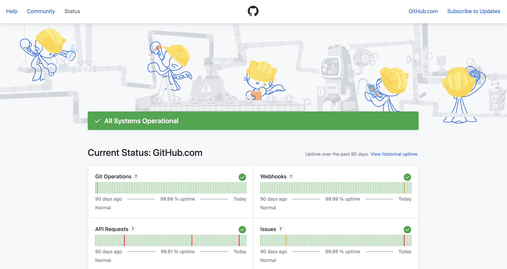
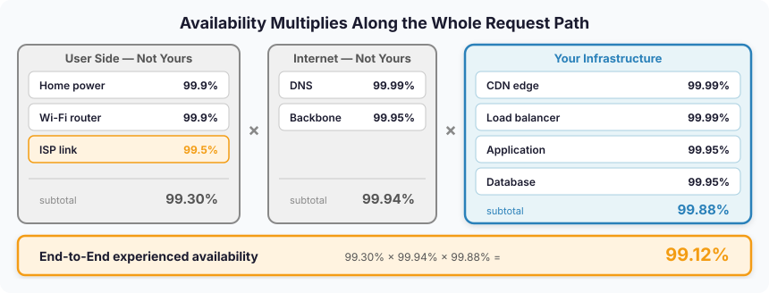
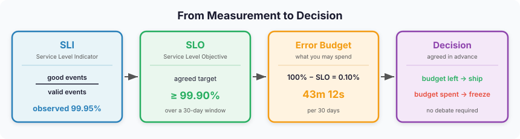
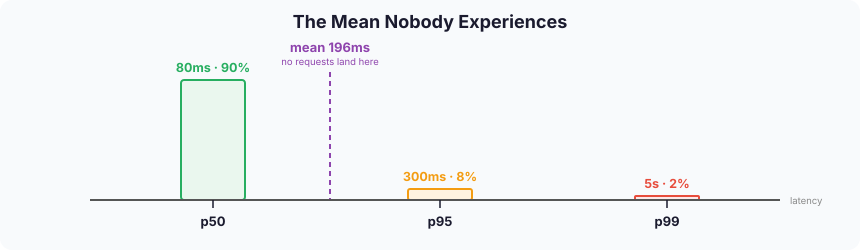

Working as a DevOps engineer, I had run into terms like SLO and SLA plenty of times. I had just never looked at them closely. Most of the articles I found stopped at a one-line gloss of each term, which made it hard to find a reason to dig deeper.

I recently made time to read Google's **Site Reliability Engineering**, and the book handles SLOs differently. Instead of listing definitions, it starts from the proposition that “**100% availability cannot be a target**.” It then gives a name — **Error Budget** — to the space that opens up once you lower the target below 100%, and hands the decision between release velocity and stability over to that budget. That was the moment these stopped reading like metrics and started reading like a **decision-making device**.

Around the same time at work, setting KPIs pulled me into the same territory of negotiated agreements, and thinking about how much infrastructure to provision led me right back to the same place. *How much is enough to prepare* turns out to be unanswerable until you decide *how much failure you are willing to allow*.

This post is a record of following that question. It starts at SLOs, passes through why 100% is impossible, arrives at error budgets, then doubles back to what that number was measuring in the first place (SLIs), and closes with SLAs and what all of this means for an infrastructure team.

---

## 1. What Is an SLO?

SLO stands for **Service Level Objective**. It is the reliability target a service aims to hit. But the important word is not *target* — it is **agreement**.

Google's SRE book locates the need for that agreement in a structural tension between teams. Product development teams are measured on shipping new features quickly. SRE teams are measured on the service staying up. Releases are changes, and changes are the most common cause of outages. So one side pushes to ship faster while the other pushes to slow risky changes down. Because both positions are legitimate, the conflict cannot be settled by arguing about who is right.

An SLO converts that argument into **an agreement about a number**. If you set availability at 99.9%, the remaining 0.1% becomes a share you can spend on faster releases and experiments, even at some cost to reliability. The name for that share is the **error budget**.

### 1.1 No Target, No Judgment

Reliability is not a binary of up-or-down. It is a continuous value.

As GitHub outages became more frequent, developer communities started debating whether to move off it. GitHub publishes the last 90 days of uptime on its [status page](https://www.githubstatus.com/).



What stands out on this screen is that the banner at the top reads **All Systems Operational**, yet the bars below still carry the colored marks of past incidents. Right now the service is fine, but viewed through a 90-day window it wobbled several times. *Is it up right now* and *how much can I rely on it* are different questions, and the second one cannot be answered with a yes or no.

The spread between components is just as interesting.

| Component | 90-day uptime |
| --- | --- |
| Packages | 100.0% |
| Git Operations | 99.99% |
| Webhooks | 99.99% |
| Codespaces | 99.97% |
| Issues / Pull Requests | 99.88% |
| API Requests | 99.81% |
| Pages | 99.65% |
| Copilot | 99.64% |
| Actions | 99.33% |

_(As of August 21, 2026, rolling 90-day window)_

Same GitHub, and yet Packages sits at 100.0% while Actions sits at 99.33%. In other words, "Is GitHub reliable?" has no single number for an answer. The answer depends on what you measure — a problem we will come back to when we get to SLIs.

And these decimal places make a bigger difference than they look. Percentages fool your intuition, so converting them into allowed downtime changes the feel entirely.

| SLO | Month (30d) | Week | Day |
| --- | --- | --- | --- |
| 99% | 7h 12m | 1h 41m | 14m 24s |
| 99.9% | 43m 12s | 10m 5s | 1m 26s |
| 99.95% | 21m 36s | 5m 2s | 43s |
| 99.99% | 4m 19s | 1m 1s | 8.6s |
| 99.999% | 26s | 6s | 0.9s |

Back in the table above, Actions' 99.33% works out to roughly 14 hours 30 minutes of downtime over 90 days. The gap between 99.9% and 99.99% — 43 minutes versus 4 minutes a month — is the difference between two completely different operational postures.

Without a target, there is no basis for deciding whether an alert is something to act on or something to let pass. Every incident becomes equally urgent, and priority ends up being set by whoever is loudest in the room. Setting an SLO is drawing that line in advance.

### 1.2 An SLO Is Not a "Higher Is Better" Number

Offering high availability is normally treated as a virtue. But from the perspective of setting a target, pushing the number up is not always the right call.

A user's request passes through a lot of infrastructure before it reaches my server. Household power, a home router, the ISP link, DNS, the internet backbone — only then does it arrive at my infrastructure. None of those segments is at 100%, and most of them are outside anything I can touch.



Availability does not add up — it **multiplies**. In the example above my infrastructure sits at 99.88%, but once a request also passes the user-side segment (99.30%) and the internet segment (99.94%), the result is 99.12%. My segment is the strongest link in the chain, and yet what drags the overall number down is the part I cannot touch.

A conclusion follows from this. Even if I pushed all four elements of my own infrastructure to 99.999%, end-to-end experienced availability would move from 99.12% to only 99.24%. In annual downtime that is roughly 4,612 minutes down to 4,007 — about ten hours. Whether those ten hours justify taking on multi-region and multi-cloud is an entirely separate question.

There is no reason to pay for reliability that users cannot perceive. That is why "as high as possible" is not a valid answer when setting an SLO.

### 1.3 So 100% Cannot Be a Target

The multiplication we just saw is the first reason. My service's availability can never exceed the product of everything it depends on, and that chain includes items I never even signed a contract for, like power and last-mile connectivity. Claiming 100% would require every one of those layers to be at 100%.

The second reason is cost. Adding one more nine does not cost linearly. Going from a single instance to redundancy, from redundancy to multi-AZ, then on to multi-region and multi-cloud, what each step requires is not just hardware but the human time to design, validate, and operate it. That time is also time not spent building features.

The third reason is organizational. Declare 100% as the target and every failure becomes something that should never have happened. Retrospectives that turn failure into learning get replaced by meetings that look for someone to blame, change itself gets treated as risk, and releases grind to a halt. An organization that never states how much failure it will tolerate cannot learn from failure.

So you flip the framing. Instead of asking **how much we will avoid going down**, you decide **how much going down is acceptable**. The moment you lower the target below 100%, that empty space stops being a hole to plug and becomes a resource you can spend deliberately.

---

## 2. Error Budget — Treating Failure as a Resource

Lowering the target below 100% leaves room underneath it. Promoting that room into something you actively manage is the **error budget**. It is called a budget not as a metaphor but because it is genuinely handled like one: the total is fixed, it shrinks as you spend it, and once it is gone your options are constrained.

### 2.1 Definition and Calculation

The error budget is **100% − SLO**. The definition ends in that one line, but to actually use it you first have to decide what unit you are counting.

**Time-based** treats availability as a fraction of observed time. With a 99.9% SLO over a 30-day window, the budget is 0.1% — **43 minutes 12 seconds**. The service can be down for a total of 43 minutes in a month and still have met its target. The downtime table from 1.1 doubles as a budget table.

**Request-based** treats it as a fraction of successful requests. At the same SLO, a month carrying 100 million requests gives a budget of **100,000 failures**.

The two translate the same SLO differently. On a service whose traffic swings hard by time of day, the two values diverge quite a bit. For a five-minute outage at 3 a.m., the time-based view deducts the full five minutes, while the request-based view only deducts the small volume of requests in that window. The request-based view sits closer to actual user experience, which is why request/response services usually pick it. Conversely, time-based is the natural fit for things like batch pipelines or infrastructure components where a "request" is hard to define.

What matters is not picking the correct one but **agreeing on one in advance**. The moment you choose whichever definition is more favorable after an incident, the budget stops meaning anything.

### 2.2 Budgets Are Meant to Be Spent

The most counterintuitive part of error budgets is this: **leaving budget unspent is not a good thing.** To a DevOps engineer, "spend the error budget to allow failures" may sound strange at first, but Google's SRE defines it differently.

If a month ends with the budget almost untouched, it is usually one of two things: the target was set more conservatively than necessary, or you held back on shipping things you could have shipped. Neither is a good signal. Unspent budget does not roll over to next month — it simply disappears, which means **whatever you did not spend, you threw away**.

So the budget becomes something to consume on purpose. The usual places to spend it:

- Releases that carry risk, and canary rollouts
- Hard-to-reverse changes such as infrastructure migrations
- Performance experiments that can only be validated in production
- Deliberate failure drills

Google's SRE book has one memorable example. **Chubby**, their distributed lock service, sustained availability far above its SLO for a long time. The problem was that internal teams started designing their systems on the assumption that Chubby would never fail. The SRE team's response was not to push reliability higher but to **take the service down deliberately** in order to consume the remaining budget. The judgment was that a service far more stable than its target plants false assumptions across the organization.

Read as a target, that decision makes no sense. Read as a budget, it is the obvious move.

### 2.3 How the Budget Dissolves the Conflict

Return to the tension from Chapter 1. Development wants to ship faster; SRE wants to slow risky changes down. The reason it never resolves is that the two sides speak different languages. One says "this feature has to go out this week," the other says "this release is risky." Those two sentences cannot be compared.

The error budget converts both claims into the same unit. The conversation now runs like this:

> This month's budget is 43 minutes. We've used 12 so far. If the expected risk of this release is worth about 5 minutes, it can ship.

A subjective sense of risk becomes **a balance check**. And the rule does not only work in the direction of blocking releases. When there is plenty of budget left, SRE loses its grounds for holding a release. It binds both sides, which is exactly why it functions as an agreement.

In practice this gets written down as an **error budget policy**. At minimum it covers:

- What stops when the budget is exhausted (usually a freeze on new feature releases)
- What is still allowed to ship anyway (security patches, reliability work)
- What conditions lift the freeze
- Who can approve an exception

The critical part is that this document has to be **agreed before an incident**. The essence of an error budget is not a measurement technique but a decision rule settled in advance. Try to write the rule after something breaks and the rule becomes whatever the most panicked person in the room says.

### 2.4 Burn Rate — Speed Matters More Than Balance

Watching only the balance makes you late. Knowing that 40 of 43 minutes remain tells you nothing about how fast it is leaking right now. So the number people actually watch is the **burn rate**.

Burn rate is normalized so that spending the budget evenly across the whole window equals 1. At 1, you finish the budget exactly when the window closes. At 2, you exhaust it halfway through. With a 99.9% SLO and a 1% error rate, the burn rate is 10, and a 30-day budget disappears in 3 days.

This value is useful because it can serve as an alerting threshold. A static threshold alert ("error rate above 1%") fires too eagerly during low-traffic hours and misses things during high-traffic ones. Burn rate is normalized against the budget, so it scales with **the size of the user impact**.

Google's SRE Workbook recommends layering several observation windows.

| Budget consumed | Window | Burn rate | Error rate | Exhausted in | Action |
| --- | --- | --- | --- | --- | --- |
| 2% of budget | 1 hour | 14.4x | 1.44% | ~2 days | Page |
| 5% of budget | 6 hours | 6x | 0.60% | 5 days | Page |
| 10% of budget | 3 days | 1x | 0.10% | 30 days | Ticket |

_(Based on a 99.9% SLO over a 30-day window)_

The short window catches acute outages quickly; the long window keeps slow leaks from slipping past. When you actually configure this, you combine the short and long windows with **AND**. Otherwise an already-recovered incident keeps the long-window alert firing long afterward.

In 1.1 I said that without a target every incident becomes equally urgent. Burn rate is the answer on the other side of that problem. The same error rate splits into a page or a ticket depending on how fast it is burning the budget. Alerts acquire priority.

---

## 3. SLI — What Was That Number Measuring?

We have now calculated a budget from the number 99.9% and even tracked how fast it burns. Yet we never actually decided what that 99.9% is a ratio **of**.

The GitHub table in 1.1 already exposed this gap. Same service, and Packages was at 100.0% while Actions was at 99.33%. There was no single number called "GitHub's availability" — a number only appeared once we decided what to measure. That "what" is the **SLI**.

### 3.1 Definition: What Makes an SLO Measurable

An SLI is a **Service Level Indicator**, a quantitative metric you actually observe. A good SLI almost always takes this shape:

```text
SLI = good events / valid events
```

It is expressed as a ratio so it stays comparable regardless of traffic volume. Counting raw error totals makes the metric look twice as bad when traffic doubles, even though the experience users get may be unchanged.

The genuinely hard part of the definition is deciding `good` and `valid`.

- `good` — What counts as success? Is any HTTP 200 a success, or only a 200 that arrived within 500ms?
- `valid` — What goes in the denominator? Do you exclude bot traffic, health checks, requests that failed authentication?

Those two definitions are what give the SLO its meaning. Once they are settled, the concepts so far link into a single chain.



Measurement (SLI) produces a target (SLO), the target produces a budget (Error Budget), and the budget produces decisions. If the front of that chain is shaky, everything behind it shakes with it.

### 3.2 What Should You Measure?

The metrics worth using as SLIs fall into a handful of categories.

| Category | What it measures | Example |
| --- | --- | --- |
| Availability | Did the request succeed? | Share of 2xx/3xx responses |
| Latency | Was it fast enough? | Share of responses under 300ms |
| Throughput | Did we process as much as needed? | Operations per second |
| Correctness | Is the result right? | Share of miscalculated records |
| Freshness | Is the data current? | Share reflected within 10 minutes of creation |

Which combination matters depends on the nature of the service.

- **Request/response** (APIs, web) — availability and latency are the core.
- **Storage** — availability and latency, plus durability.
- **Data pipelines** — freshness and correctness are central. Availability alone tells you nothing here. If jobs keep succeeding while shipping data that is six hours stale, that is an outage as far as users are concerned.

### 3.3 The Mean Lies

The most common mistake when using latency as an SLI is reaching for the average.

A mean response time of 196ms reads like a reasonably healthy service. It reads very differently once you see the distribution that mean came from.



90% of requests get a response in 80ms, 8% take 300ms, and 2% wait 5 seconds. The mean computes to 196ms, and yet **not one single request was answered anywhere near 196ms.** The mean is describing a user who does not exist.

Look at the same distribution in percentiles and what was hidden comes out. p50 is 80ms, p95 is 300ms, and p99 is 5 seconds. A team watching only the mean and a team watching p99 will reach completely different conclusions about the same service. So latency has to be viewed as a distribution, which in practice means **percentiles** (p50 · p95 · p99).

And that 2% out in the tail is disproportionately likely to be your important users. The more data an account holds, the longer it has been around, the larger the organization, the heavier its queries and the slower its responses. A team watching only the mean is structurally blind to what its most expensive customers experience.

Where you measure matters too. A success rate measured at the load balancer has two traps.

- **Failures visible only on the client are missing.** A 200 that renders a blank screen, or a response so slow the user gave up, both stay recorded as successes in server-side metrics.
- **If the load balancer dies, nothing gets recorded at all.** Quiet metrics and no problems are not the same thing.

In 1.2 I noted that the user-side segment is mostly outside my control. Measuring failures in that segment requires client-side observation. That comes with implementation and operational cost, though, so what to measure and where is a judgment call of its own.

### 3.4 Fewer SLIs Are Better

Attach observability tooling and hundreds of metrics come with it. The temptation is to promote as many as possible into SLIs, but the direction should be the opposite.

Pick **only the few that connect directly to user experience**. Three to five per service is the usual recommendation. As the count grows, it gets murkier what you are supposed to do when any given metric degrades, and eventually none of them get used for decisions.

CPU utilization is not an SLI. It is countable and looks great on a dashboard, but the fact that CPU is at 80% tells you nothing about what users are experiencing. It is a **cause-side metric**, and it belongs in debugging, not alerting.

The test comes down to two sentences. **If this metric degrades, do users suffer?** And **when this metric degrades, is there a defined action we take?** If either answer is no, it is not an SLI — it is just a metric.

---

## 4. An Aside: An SLA Is Just a Contract

An SLA is a **Service Level Agreement**, a contract with external customers. What decisively separates it from the previous three concepts is that **breaching it has financial consequences**. Many cloud services commit to a monthly availability figure and refund part of the bill as credits when they fall short.

That makes an SLA less an engineering tool than a legal and sales one. Where SLIs, SLOs, and error budgets answer "how do we operate this," an SLA answers "what do we owe when we fail."

One practically important rule follows. **An SLO must always be stricter than the SLA.** If you promised customers 99.9%, the internal target should be something like 99.95%. That is what makes internal alerts fire before a contractual breach. Set the SLO equal to the SLA and the moment your alert goes off is already the moment you owe money.

Putting all four concepts side by side:

| Concept | What it is | Promised to whom | When breached |
| --- | --- | --- | --- |
| **SLI** | A value you actually observe | — (measurement) | N/A |
| **SLO** | An internally agreed target | Agreement between teams | Internal policy fires, e.g. a release freeze |
| **Error Budget** | The room between the target and 100% | Agreement between teams | Policy fires once exhausted |
| **SLA** | A contract with customers | External customers | Financial remedy such as service credits |

In most organizations, the three rows above the last one are what you look at daily. An SLA is closer to something that gets honored as a natural result of those three working properly.

---

## 5. Why Infrastructure Teams Should Run Services on Metrics

Taken together, the various service-level metrics and the error budget discussed so far define what an infrastructure team can actually do inside an organization. How you set the SLO determines the work the infrastructure org has to take on.

### 5.1 Moving Judgment from People to Rules

Everyone knows an outage has to be handled quickly. And if, say, a payments server and a comparatively less critical back-office server both went down at once in a microservice setup, anyone could tell you intuitively which one to handle first.

But if you explain it on the basis of SLOs instead of that intuition, you can actually measure how much availability the payments server and the back-office server each need to guarantee, how much error budget is left, and how much downtime is permitted.

Intuition becomes a problem not when there are two services but when there are thirty. With payments and back-office, anybody knows the priority. But when five alerts fire at once, three of them for internal services whose importance you cannot infer from the name, and the person on call did not build them, intuition stops working. An SLO moves that judgment into a document so that whoever is on call arrives at the same conclusion.

### 5.2 Turning Reliability into a Requirement

There is a situation infrastructure teams run into constantly. You say redundancy is needed, and it slides off next quarter's roadmap. Reliability work has no visible artifact; features do.

The problem is less about logic than about language. "This setup is risky" is a sentence that struggles to win a priority contest. This one is a different kind of sentence:

> The payments API SLO is 99.9%, and we've blown the error budget two quarters running. Per policy, new feature releases are frozen this quarter.

The same claim turns into **an agreed requirement**. That is the moment reliability work stops being the infrastructure team's wish and becomes something policy obliges.

The same structure applies to sizing provisioning. The introduction raised the question *how much is enough to prepare*, and that question has no answer on its own. Only after a target availability is set do the required level of redundancy, region layout, and headroom become computable numbers. This is the most practical reason an infrastructure team needs SLOs: **how much you prepare follows from how much failure you are willing to allow.**

### 5.3 Alerts Regain Their Meaning

Once there are too many alerts, people stop believing alerts. If nine of ten pages overnight needed no action, the tenth gets the same treatment.

The cause is usually that alerts are wired to **causes**. CPU at 80%, disk at 90%, a memory threshold — all countable, all easy to set a threshold on, and none of them directly connected to whether a user is currently suffering. CPU at 80% with normal response times means nothing happened as far as users are concerned.

SLO-based alerting comes at it from the other direction: it fires **only when there is user impact**. And the burn rate from 2.4 sets the intensity from there. Burning the budget fast means a page; leaking slowly means a ticket.

What you gain here is not that the alert count drops. It is that **you come to trust the alerts that remain**. If it fired, users are actually experiencing it — which is a reason to get up at 3 a.m.

### 5.4 How to Start

Try to design a perfect SLO system up front and you will never start. Instrumenting every service and securing company-wide agreement is a multi-quarter project, and it usually stalls halfway.

A realistic order looks like this:

1. **Pick one user journey.** The single most important flow in the service. Checkout, login, or search — one of them.
2. **Define one SLI.** This is the work of deciding `good` and `valid`. Spend your time here.
3. **Observe first, without a target.** Just measure for a few weeks. Targets set without knowing the current level are usually wrong.
4. **Set the SLO from what you observed.** Starting slightly below the current level is the better move. An unreachable target neutralizes the policy itself.
5. **Agree on an error budget policy.** The four items from 2.3 are enough. Start with a single page.
6. **Revisit it every quarter.** If budget is left over every time, raise the target; if it blows every time, either the target does not match reality or reliability work is falling short.

Google's SRE Workbook ships example documents for exactly this process in its appendices. **Appendix A** is an example SLO document and **Appendix B** an example error budget policy. You do not have to start from a blank page.

---

## Closing Thoughts

This post started from the question *how much is enough to prepare*. What writing it confirmed is that the question has no answer on its own. Until you decide how much failure you will allow, you cannot decide how much to prepare. An SLO is the device that puts those in the right order.

Restating the three concepts, they read like this: an SLI is deciding what to look at, an SLO is agreeing on where "fine" ends, and the error budget is what connects that agreement to everyday decisions. Which makes them less measurement tools than **a way of agreeing about failure ahead of time**. The difference between an organization that decides what to do after something breaks and one that decided beforehand shows up not in response speed but in response consistency.

Not aiming for 100% can feel like negligence. But look at the multiplication in 1.2 once and that changes. 100% is not an ambitious target; it is a coordinate you cannot reach, and the moment you declare it as the goal, the organization loses the language it needs to deal with failure. Deciding the total amount of failure in advance is by far the more engineering-minded posture.

What frustrated me when I first looked these concepts up was not that the definitions were hard. What an SLO is takes one line to read. What was missing was **why that definition was needed**. Follow the path from "100% is impossible" through to error budgets and each of the three concepts acquires a reason to exist. The gap between memorizing a definition and knowing the context that made it necessary is what stayed with me most from writing this.

---

### References

#### Google's SRE Trilogy

All three are available free in full. ([sre.google/books](https://sre.google/books/))

| Book | Read online |
| --- | --- |
| **Site Reliability Engineering** (2016) | [Table of contents](https://sre.google/sre-book/table-of-contents/) |
| **The Site Reliability Workbook** (2018) | [Table of contents](https://sre.google/workbook/table-of-contents/) |
| **Building Secure & Reliable Systems** (2020) | [Table of contents](https://google.github.io/building-secure-and-reliable-systems/raw/toc.html) |

#### Chapters Referenced Directly

| Source | Chapter |
| --- | --- |
| SRE Book | [Ch. 3 — Embracing Risk](https://sre.google/sre-book/embracing-risk/) |
| SRE Book | [Ch. 4 — Service Level Objectives](https://sre.google/sre-book/service-level-objectives/) |
| SRE Book | [Ch. 6 — Monitoring Distributed Systems](https://sre.google/sre-book/monitoring-distributed-systems/) |
| SRE Book | [Ch. 10 — Practical Alerting](https://sre.google/sre-book/practical-alerting/) |
| Workbook | [Ch. 1 — How SRE Relates to DevOps](https://sre.google/workbook/how-sre-relates/) |
| Workbook | [Ch. 2 — Implementing SLOs](https://sre.google/workbook/implementing-slos/) |
| Workbook | [Ch. 3 — SLO Engineering Case Studies](https://sre.google/workbook/slo-engineering-case-studies/) |
| Workbook | [Ch. 5 — Alerting on SLOs](https://sre.google/workbook/alerting-on-slos/) |
| Workbook | [Ch. 16 — Canarying Releases](https://sre.google/workbook/canarying-releases/) |
| Workbook | [Appendix A. Example SLO Document](https://sre.google/workbook/slo-document/) |
| Workbook | [Appendix B. Example Error Budget Policy](https://sre.google/workbook/error-budget-policy/) |

#### Data Source

- [GitHub Status](https://www.githubstatus.com/) — the per-component 90-day uptime in 1.1. Retrieved August 21, 2026; it is a rolling 90-day window, so current values will differ.
