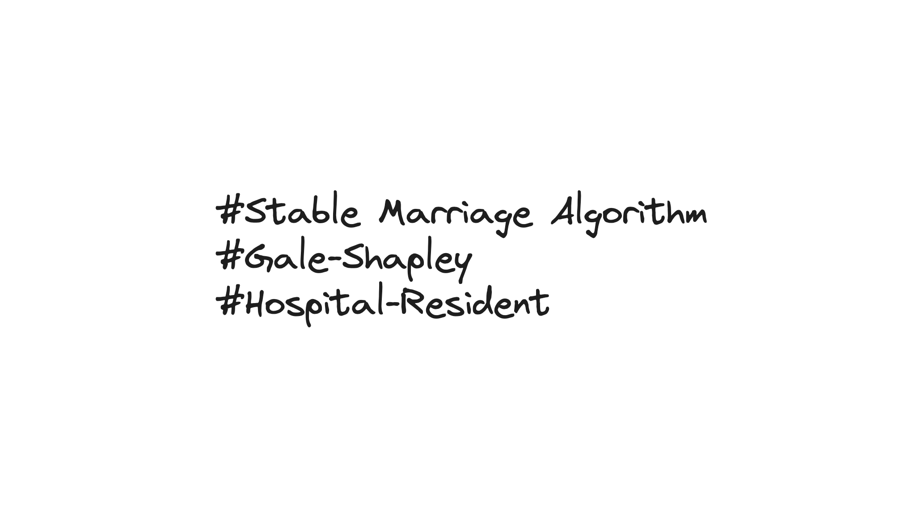
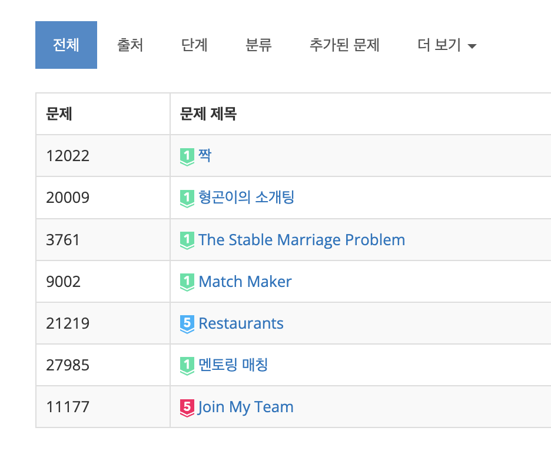

## 1. 소개팅 서비스를 만들어 보자

알고리즘을 통해서 어떻게 매칭을 구현할 수 있을까? 남자와 여자 각각 원하는 상대방의 리스트를 가지고 있다고 하자. 이를 어떻게 매칭시켜야 가장 뒷말이 안 나오는 매칭을 구현할 수 있을까?

소개팅 서비스를 개발한다고 생각해 보자. 사용자들로부터 선호도를 수집하고, 이를 기반으로 최적의 매칭을 만들어야 한다. 단순히 랜덤으로 짝을 맞추면 불만이 생길 수밖에 없다. 예를 들어, A 남성이 현재 파트너보다 B 여성을 더 좋아하고, B 여성도 현재 파트너보다 A 남성을 더 좋아한다면, 이 두 사람은 현재 매칭을 깨고 새로운 쌍을 만들려 할 것이다. 이런 상황이 발생하지 않는 매칭을 만드는 것, 이것이 바로 **안정 결혼 문제(Stable Marriage Problem)**이다.

### 안정성이란 무엇인가

**SMP**의 목표는 모든 매칭이 안정적이게끔 하는 것이다. 여기서 '안정적'이라는 것은 어떤 두 사람이 현재의 매칭 상태보다 서로를 더 선호하는 경우가 없다는 것을 의미한다. 구체적으로는, 어떤 남성 `M`과 여성 `W`가 서로의 현재 파트너보다 상대를 더 선호하는 경우가 없는 상태를 의미한다. 즉, 모든 구성원들이 현재의 매칭 상태를 바꾸고 싶어하지 않도록 만드는 것이 목표다.

좀 더 형식적으로 정의하면 다음과 같다.

- `n`명의 남성 집합과 `n`명의 여성 집합이 존재한다.
- 각 남성은 모든 여성에 대한 선호도 순서를 가진다.
- 각 여성은 모든 남성에 대한 선호도 순서를 가진다.
- **불안정한 쌍(blocking pair)**: 남성 `m`이 현재 파트너보다 여성 `w`를 선호하고, 여성 `w`도 현재 파트너보다 남성 `m`을 선호하는 경우, `(m, w)`를 불안정한 쌍이라 한다.
- **안정 매칭(stable matching)**: 불안정한 쌍이 하나도 존재하지 않는 일대일 매칭이다.

---

## 2. Gale-Shapley 알고리즘

### 역사적 배경

1962년, 수학자 데이비드 게일(David Gale)과 경제학자 로이드 샤플리(Lloyd Shapley)가 이 안정 결혼 문제를 해결하는 알고리즘을 발표했다. 이 알고리즘이 항상 안정 매칭을 보장한다는 것을 증명했으며, 이후 샤플리는 2012년에 앨빈 로스(Alvin Roth)와 함께 이 연구로 노벨 경제학상을 수상했다. 그만큼 이 알고리즘이 현실 세계의 매칭 문제(의대 레지던트 배정, 학교 배정 등)에 미친 영향이 크다.

### 알고리즘 의사코드

위키피디아에 따르면 Gale-Shapley 알고리즘의 의사코드는 아래와 같다.

```
algorithm stable_matching is
    Initialize m in M and w in W to free
    while there exists free man m who has a woman w to propose to do
        w := first woman on m's list to whom m has not yet proposed
        if there exists some pair (m', w) then
            if w prefers m to m' then
                m' becomes free
                (m, w) become engaged
            end if
        else
            (m, w) become engaged
        end if
    repeat
```

핵심 아이디어는 다음과 같다.

1. 모든 남성과 여성을 '미매칭' 상태로 초기화한다.
2. 미매칭 상태인 남성 `m`이 아직 프로포즈하지 않은 여성 중 가장 선호하는 여성 `w`에게 프로포즈한다.
3. 여성 `w`가 미매칭 상태라면, `(m, w)` 쌍이 약혼한다.
4. 여성 `w`가 이미 다른 남성 `m'`과 약혼 중이라면, `w`가 `m`과 `m'` 중 더 선호하는 쪽을 선택한다.
   - `w`가 `m`을 더 선호하면: `m'`은 미매칭 상태로 돌아가고, `(m, w)`가 새로 약혼한다.
   - `w`가 `m'`을 더 선호하면: 기존 약혼이 유지되고, `m`은 다음 선호 여성에게 프로포즈한다.
5. 모든 남성이 매칭될 때까지 반복한다.

<!-- TODO: Gale-Shapley 알고리즘 단계별 시각화 다이어그램 추가 -->
<!-- 예시: 3명의 남성(A, B, C)과 3명의 여성(X, Y, Z)으로 매 라운드 프로포즈/수락/거절 과정을 보여주는 그림 -->

### 알고리즘의 성질

- **종료 보장**: 매 라운드마다 적어도 하나의 프로포즈가 이루어지고, 같은 여성에게 두 번 프로포즈하지 않으므로, 최대 `n^2`번의 프로포즈 후 종료된다.
- **안정성 보장**: 결과 매칭에는 불안정한 쌍이 존재하지 않는다.
- **프로포즈 측 최적(proposer-optimal)**: 남성이 프로포즈하는 구조에서 남성은 가능한 안정 매칭 중 가장 좋은 결과를 얻고, 여성은 가능한 안정 매칭 중 가장 나쁜 결과를 얻는다. 이 비대칭성은 알고리즘의 중요한 특성이다.

---

## 3. Python 구현

### 기본 구현

위 의사코드를 Python으로 구현하면 다음과 같다.

```python
def stable_matching(men_preferences, women_preferences):
    free_men = list(men_preferences.keys())
    engaged_pairs = {}
    women_engaged_to = {woman: None for woman in women_preferences}

    proposals = {man: list(women) for man, women in men_preferences.items()}

    while free_men:
        m = free_men[0]
        if proposals[m]:
            w = proposals[m].pop(0)

            if women_engaged_to[w] is None:
                engaged_pairs[m] = w
                women_engaged_to[w] = m
                free_men.pop(0)
            else:
                m_prime = women_engaged_to[w]
                if women_preferences[w].index(m) < women_preferences[w].index(m_prime):
                    free_men.append(m_prime)
                    engaged_pairs[m] = w
                    women_engaged_to[w] = m
                    free_men.pop(0)
        else:
            free_men.pop(0)

    return engaged_pairs

men_preferences = {
    'A': ['X', 'Y', 'Z'],
    'B': ['Y', 'X', 'Z'],
    'C': ['X', 'Z', 'Y']
}

women_preferences = {
    'X': ['B', 'A', 'C'],
    'Y': ['A', 'B', 'C'],
    'Z': ['A', 'B', 'C']
}

print(stable_matching(men_preferences, women_preferences))
```

위 예시에서 남성 A, B, C와 여성 X, Y, Z 각각이 선호도 리스트를 딕셔너리로 전달하면, 알고리즘이 안정 매칭 결과를 반환한다.

### 최적화된 구현

기본 구현에서 `women_preferences[w].index(m)` 호출은 매번 `O(n)` 시간이 소요된다. 여성의 선호도를 사전에 랭킹 테이블로 변환해 두면 `O(1)`에 비교할 수 있다.

```python
def stable_marriage(men_preferences, women_preferences):
    men = list(men_preferences.keys())
    women = list(women_preferences.keys())
    n = len(men)

    free_men = men[:]
    women_partners = {woman: None for woman in women}
    men_next_proposal = {man: 0 for man in men}
    men_partners = {man: None for man in men}

    # 여성의 선호도를 랭킹 테이블로 변환 (O(1) 비교를 위해)
    women_rankings = {woman: {} for woman in women}
    for woman, wp in women_preferences.items():
        for i, man in enumerate(wp):
            women_rankings[woman][man] = i

    while free_men:
        man = free_men.pop(0)
        woman_index = men_next_proposal[man]
        woman = men_preferences[man][woman_index]
        men_next_proposal[man] += 1

        if women_partners[woman] is None:
            women_partners[woman] = man
            men_partners[man] = woman
        else:
            current_partner = women_partners[woman]
            if women_rankings[woman][man] < women_rankings[woman][current_partner]:
                women_partners[woman] = man
                men_partners[man] = woman
                free_men.append(current_partner)
            else:
                free_men.append(man)

    return sorted([[man, men_partners[man]] for man in men])
```

### 시간 복잡도 분석

- **전처리(랭킹 테이블 구성)**: `O(n^2)` -- 각 여성의 선호도 리스트를 순회하며 딕셔너리를 구성한다.
- **메인 루프**: 각 남성은 최대 `n`명의 여성에게 프로포즈할 수 있으므로, 전체 프로포즈 횟수는 최대 `O(n^2)`이다. 각 프로포즈 내부 비교는 랭킹 테이블 덕분에 `O(1)`이므로, 메인 루프의 총 시간 복잡도는 `O(n^2)`이다.
- **공간 복잡도**: `O(n^2)` -- 선호도 리스트와 랭킹 테이블 저장에 필요하다.

---

## 4. Hospital-Resident 문제: 비대칭 매칭

Gale-Shapley 알고리즘은 이상적인 매칭을 구현해주지만, 제약 조건이 꽤 많다. 남자와 여자의 수가 같아야 하고 선호도 리스트의 길이도 같아야 한다는 조건이 있다.

만약 그렇지 않다면 어떻게 해결할 수 있을까? 이러한 문제를 **Hospital-Resident 문제**라고 부르며, **college admissions problem**이라고 부르기도 한다. 대학 병원이나 대학교에서 한 명 이상의 사람을 받을 수 있는 상황에서 비롯된 이름이다.

만약 남자와 여자를 매칭시켜주는 소프트웨어를 개발한다면, 남자와 여자의 성비를 맞출 수 있을까? 일반적으로는 다를 것이다. 그럴 때 사용할 수 있는 알고리즘이 바로 Gale-Shapley 알고리즘을 확장한 **Hospital-Resident 알고리즘**이다.

Python에서는 `matching` 라이브러리를 통해 이 알고리즘을 바로 사용할 수 있다.

- **PyPI**: [https://pypi.org/project/matching/](https://pypi.org/project/matching/)

```python
from matching.games import HospitalResident

resident_prefs = {"R1": ["H1", "H2"], "R2": ["H2", "H1"]}
hospital_prefs = {"H1": ["R1", "R2"], "H2": ["R2", "R1"]}
capacities = {"H1": 1, "H2": 1}

game = HospitalResident.create_from_dictionaries(
    resident_prefs, hospital_prefs, capacities
)
matching = game.solve()
print(matching)
```

Hospital-Resident 알고리즘은 여러 사람들을 받을 수 있게 고안되어 있기 때문에, 성비가 맞지 않는 상황에서 남자와 여자를 1대1로 매칭시키려면 `capacities`의 값을 1로 주면 된다.

---

## 5. 변형 문제들 (BOJ)

안정 결혼 문제의 이론을 이해했다면, 다양한 변형 문제를 풀어 보며 실력을 다져 보자. [BOJ(Baekjoon Online Judge)](https://www.acmicpc.net/)는 한국의 대표적인 알고리즘 문제 풀이 플랫폼으로, solved.ac 기준 플래티넘 난이도의 안정 결혼 문제 변형들이 출제되어 있다.



### 5.1. BOJ 3761 -- The Stable Marriage Problem

> [https://www.acmicpc.net/problem/3761](https://www.acmicpc.net/problem/3761)

가장 기본적인 안정 결혼 문제이다. 남성 최적(male-optimal) 안정 매칭을 구하라는 문제로, Gale-Shapley 알고리즘을 그대로 적용하면 된다. 선호도가 문자열(이름)로 주어지므로 딕셔너리 기반 구현이 적합하다.

**풀이 핵심**: 입력에서 이름과 선호도 리스트를 파싱한 뒤, 남성이 프로포즈하는 표준 Gale-Shapley를 수행한다.

```python
import sys
input = sys.stdin.readline

def stable_marriage(men_preferences, women_preferences):
    men = list(men_preferences.keys())
    women = list(women_preferences.keys())
    n = len(men)

    free_men = men[:]
    women_partners = {woman: None for woman in women}
    men_next_proposal = {man: 0 for man in men}
    men_partners = {man: None for man in men}

    women_rankings = {woman: {} for woman in women}
    for woman, wp in women_preferences.items():
        for i, man in enumerate(wp):
            women_rankings[woman][man] = i

    while free_men:
        man = free_men.pop(0)
        woman_index = men_next_proposal[man]
        woman = men_preferences[man][woman_index]
        men_next_proposal[man] += 1

        if women_partners[woman] is None:
            women_partners[woman] = man
            men_partners[man] = woman
        else:
            current_partner = women_partners[woman]
            if women_rankings[woman][man] < women_rankings[woman][current_partner]:
                women_partners[woman] = man
                men_partners[man] = woman
                free_men.append(current_partner)
            else:
                free_men.append(man)

    return sorted([[man, men_partners[man]] for man in men])

t = int(input())

for i in range(t):
    n = int(input())
    people = input().split()
    men, women = {}, {}

    for _ in range(n):
        pivot, prefs = input().strip().split(':')
        men[pivot] = prefs.strip()

    for _ in range(n):
        pivot, prefs = input().strip().split(':')
        women[pivot] = prefs.strip()

    matches = stable_marriage(men, women)

    for match in matches:
        print(match[0], match[1])

    if i < t - 1:
        print()
```

### 5.2. BOJ 9002 -- Match Maker

> [https://www.acmicpc.net/problem/9002](https://www.acmicpc.net/problem/9002)

남자와 여자의 수가 `n`명으로 동일하고, 선호도를 숫자 리스트로 받는 문제이다. 기본 Gale-Shapley 알고리즘으로 풀 수 있으며, 입력이 정수 인덱스 기반이므로 배열 기반 구현이 효율적이다.

**풀이 핵심**: 딕셔너리 대신 배열을 사용하여 인덱스 기반으로 구현하면 메모리와 속도 모두 최적화할 수 있다.

```python
import sys
input = sys.stdin.readline

t = int(input())

def stable_marriage(men_preferences, women_preferences):
    n = len(men_preferences)
    free_men = list(range(n))
    women_partners = [None] * n
    men_next_proposal = [0] * n
    men_partners = [None] * n

    women_rankings = []
    for wp in women_preferences:
        ranking = [0] * n
        for i, man in enumerate(wp):
            ranking[man - 1] = i
        women_rankings.append(ranking)

    while free_men:
        man = free_men.pop(0)
        woman_index = men_next_proposal[man]
        woman = men_preferences[man][woman_index] - 1
        men_next_proposal[man] += 1

        if women_partners[woman] is None:
            women_partners[woman] = man
            men_partners[man] = woman
        else:
            current_partner = women_partners[woman]
            if women_rankings[woman][man] < women_rankings[woman][current_partner]:
                women_partners[woman] = man
                men_partners[man] = woman
                free_men.append(current_partner)
            else:
                free_men.append(man)

    return [w + 1 for w in men_partners]

for _ in range(t):
    n = int(input())
    men_pref, women_pref = [], []
    for pivot in (men_pref, women_pref):
        for _ in range(n):
            pivot.append(list(map(int, input().split())))

    matches = stable_marriage(men_pref, women_pref)
    print(*matches)
```

### 5.3. BOJ 12022 -- 짝

> [https://www.acmicpc.net/problem/12022](https://www.acmicpc.net/problem/12022)

역시 Gale-Shapley 알고리즘으로 풀이할 수 있는 문제이다. 각 남성이 매칭된 여성의 번호를 한 줄에 하나씩 출력하는 형식이라는 점만 주의하면 된다.

```python
import sys
input = sys.stdin.readline

N = int(input())
men_pref, women_pref = [], []
for pivot in (men_pref, women_pref):
    for _ in range(N):
        pivot.append(list(map(int, input().split())))

def stable_marriage(men_preferences, women_preferences):
    n = len(men_preferences)
    free_men = list(range(n))
    women_partners = [None] * n
    men_next_proposal = [0] * n
    men_partners = [None] * n

    women_rankings = []
    for wp in women_preferences:
        ranking = [0] * n
        for i, man in enumerate(wp):
            ranking[man - 1] = i
        women_rankings.append(ranking)

    while free_men:
        man = free_men.pop(0)
        woman_index = men_next_proposal[man]
        woman = men_preferences[man][woman_index] - 1
        men_next_proposal[man] += 1

        if women_partners[woman] is None:
            women_partners[woman] = man
            men_partners[man] = woman
        else:
            current_partner = women_partners[woman]
            if women_rankings[woman][man] < women_rankings[woman][current_partner]:
                women_partners[woman] = man
                men_partners[man] = woman
                free_men.append(current_partner)
            else:
                free_men.append(man)

    return [w + 1 for w in men_partners]

matches = stable_marriage(men_pref, women_pref)
for match in matches:
    print(match)
```

### 5.4. BOJ 20009 -- 형곤이의 소개팅

> [https://www.acmicpc.net/problem/20009](https://www.acmicpc.net/problem/20009)

이름 기반으로 선호도가 주어지는 문제이다. 입력 형식이 조금 다르지만, 핵심은 동일하게 Gale-Shapley 알고리즘을 적용하는 것이다.

**풀이 핵심**: 이름 문자열 기반의 선호도를 딕셔너리로 파싱한 뒤 표준 Gale-Shapley를 수행한다.

```python
import sys
input = sys.stdin.readline

n = int(input())

men = input().split()
women = input().split()
men_prefs, women_prefs = {}, {}
for pivot in (men_prefs, women_prefs):
    for _ in range(n):
        people = input().split()
        pivot[people[0]] = people[1:]

def stable_marriage(men_prefs, women_prefs):
    men = list(men_prefs.keys())
    women = list(women_prefs.keys())
    n = len(men)

    free_men = men[:]
    women_partners = {woman: None for woman in women}
    men_next_proposal = {man: 0 for man in men}
    men_partners = {man: None for man in men}

    women_rankings = {}
    for woman, prefs in women_prefs.items():
        ranking = {man: rank for rank, man in enumerate(prefs)}
        women_rankings[woman] = ranking

    while free_men:
        man = free_men.pop(0)
        woman = men_prefs[man][men_next_proposal[man]]
        men_next_proposal[man] += 1

        if women_partners[woman] is None:
            women_partners[woman] = man
            men_partners[man] = woman
        else:
            current_partner = women_partners[woman]
            if women_rankings[woman][man] < women_rankings[woman][current_partner]:
                women_partners[woman] = man
                men_partners[man] = woman
                free_men.append(current_partner)
            else:
                free_men.append(man)

    result = []
    for man, woman in men_partners.items():
        result.append((man, woman))
    return result

matching = stable_marriage(men_prefs, women_prefs)

for man, woman in matching:
    print(man, woman)
```

### 5.5. BOJ 27985 -- 멘토링 매칭

> [https://www.acmicpc.net/problem/27985](https://www.acmicpc.net/problem/27985)

이 문제는 Gale-Shapley 알고리즘을 기반으로 하되, 한쪽의 선호도가 직접 주어지지 않고 특정 규칙에 따라 생성해야 한다는 점이 독특하다.

**풀이 핵심**: 카이스트 학생들의 선호도는 "번호 차이가 작은 학생을 더 선호하되, 같은 거리면 번호가 큰 학생을 더 선호한다"는 규칙에 따라 생성된다. 예를 들어, `n = 5`이고 일반 학생들의 선호도가 모두 `[1, 2, 3, 4, 5]`라면, 카이스트 학생 1번의 선호도는 `[1, 2, 3, 4, 5]`, 학생 3번의 선호도는 `[3, 4, 2, 5, 1]`처럼 거리 기반으로 결정된다.

선호도 생성 로직은 다음과 같다.

```python
for i in range(1, n+1):
    temp = [i]
    for dist in range(1, n):
        for j in range(n, 0, -1):
            if abs(i - j) == dist:
                temp.append(j)
    kaist_pref.append(temp[::-1])
```

이렇게 생성한 선호도를 Gale-Shapley 알고리즘에 넘기면 답을 구할 수 있다.

```python
import sys
input = sys.stdin.readline

n = int(input())
person_pref = [list(map(int, input().split())) for _ in range(n)]
kaist_pref = []

for i in range(1, n+1):
    temp = [i]
    for dist in range(1, n):
        for j in range(n, 0, -1):
            if abs(i - j) == dist:
                temp.append(j)
    kaist_pref.append(temp[::-1])

def stable_marriage(men_preferences, women_preferences):
    n = len(men_preferences)
    free_men = list(range(n))
    women_partners = [None] * n
    men_next_proposal = [0] * n
    men_partners = [None] * n

    women_rankings = []
    for wp in women_preferences:
        ranking = [0] * n
        for i, man in enumerate(wp):
            ranking[man - 1] = i
        women_rankings.append(ranking)

    while free_men:
        man = free_men.pop(0)
        woman_index = men_next_proposal[man]
        woman = men_preferences[man][woman_index] - 1
        men_next_proposal[man] += 1

        if women_partners[woman] is None:
            women_partners[woman] = man
            men_partners[man] = woman
        else:
            current_partner = women_partners[woman]
            if women_rankings[woman][man] < women_rankings[woman][current_partner]:
                women_partners[woman] = man
                men_partners[man] = woman
                free_men.append(current_partner)
            else:
                free_men.append(man)

    return [w + 1 for w in men_partners]

matches = stable_marriage(person_pref, kaist_pref)
print(*matches)
```

---

## 6. 실제 서비스에서의 고려사항

안정 결혼 문제의 이론은 아름답지만, 실제 소개팅 서비스에 적용하려면 몇 가지 현실적인 문제를 해결해야 한다.

### 선호도 수집

이론에서는 모든 참가자가 상대방 전체에 대한 완전한 선호도 순서를 가진다고 가정한다. 하지만 현실에서 100명의 상대방에 대한 선호도를 일일이 매기는 것은 불가능에 가깝다. 실제 서비스에서는 프로필 기반 점수 매기기, 스와이프 기반 호감 표시, 또는 설문을 통한 선호도 추론 같은 간접적인 방법을 사용해야 한다.

### 불완전한 선호도

모든 사용자가 모든 상대방에 대한 선호도를 가지지 않을 수 있다. 이 경우 표준 Gale-Shapley는 직접 적용하기 어렵고, 불완전한 선호도를 허용하는 확장 알고리즘이 필요하다. Hospital-Resident 알고리즘은 이런 상황에서도 활용할 수 있는 대안이다.

### 성비 불균형

남성과 여성의 수가 다른 경우, 기본 SMP 모델로는 해결이 안 된다. 앞서 소개한 Hospital-Resident 알고리즘을 사용하되, `capacities`를 1로 설정하여 1대1 매칭을 구현하면 성비가 맞지 않는 상황에서도 안정 매칭을 구할 수 있다. 다만, 매칭되지 못하는 사용자가 발생한다는 점을 서비스 설계에서 고려해야 한다.

### 공정성

Gale-Shapley 알고리즘은 프로포즈하는 측에 유리한 결과를 낸다는 구조적 비대칭성이 있다. 실제 서비스에서는 한쪽 성별에만 유리한 매칭 결과를 내는 것이 바람직하지 않으므로, 라운드마다 프로포즈 측을 번갈아 바꾸거나, 양측 모두에게 어느 정도 만족스러운 결과를 내는 변형 알고리즘을 고려할 필요가 있다.

---

## 마치며

안정 결혼 문제는 단순한 이론 문제에 그치지 않는다. 1962년에 제안된 Gale-Shapley 알고리즘은 미국 의대 레지던트 매칭(NRMP), 공립학교 배정, 장기 기증 매칭 등 현실 세계의 수많은 매칭 시스템에 적용되고 있다.

이 글에서 다룬 내용을 정리하면 다음과 같다.

- **안정 결혼 문제(SMP)**: 불안정한 쌍이 없는 매칭을 구하는 문제
- **Gale-Shapley 알고리즘**: `O(n^2)` 시간에 안정 매칭을 보장하는 알고리즘
- **Hospital-Resident 문제**: 비대칭 인원, 다대일 매칭으로의 확장
- **변형 문제들**: BOJ의 플래티넘 난이도 문제들을 통한 실전 연습
- **실제 서비스 고려사항**: 선호도 수집, 성비 불균형, 공정성 등

알고리즘 문제 풀이를 통해 기초를 다지고, 그 위에 현실의 제약 조건을 하나씩 고려해 나가는 것이 좋은 접근이 될 것이다.

### 참고 자료

- [Gale-Shapley 알고리즘 -- Wikipedia](https://en.wikipedia.org/wiki/Gale%E2%80%93Shapley_algorithm)
- [matching -- PyPI](https://pypi.org/project/matching/)
- [BOJ 안정 결혼 문제 태그](https://www.acmicpc.net/problemset?sort=ac_desc&algo=172)
