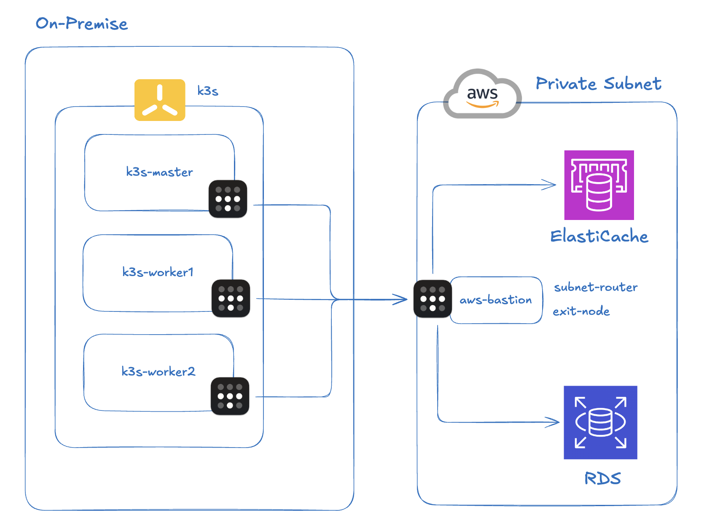
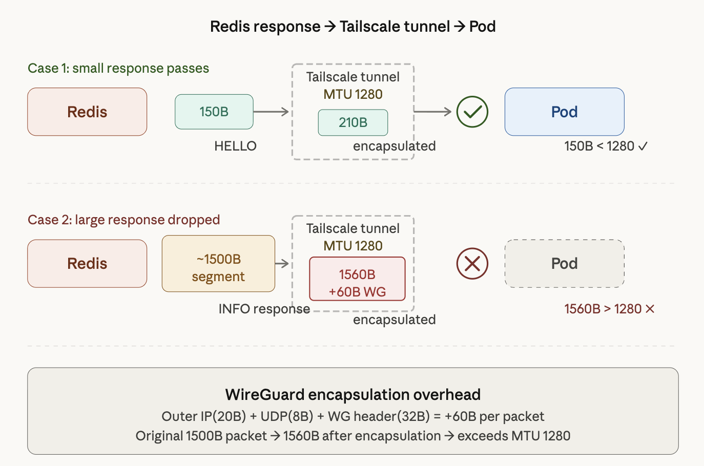
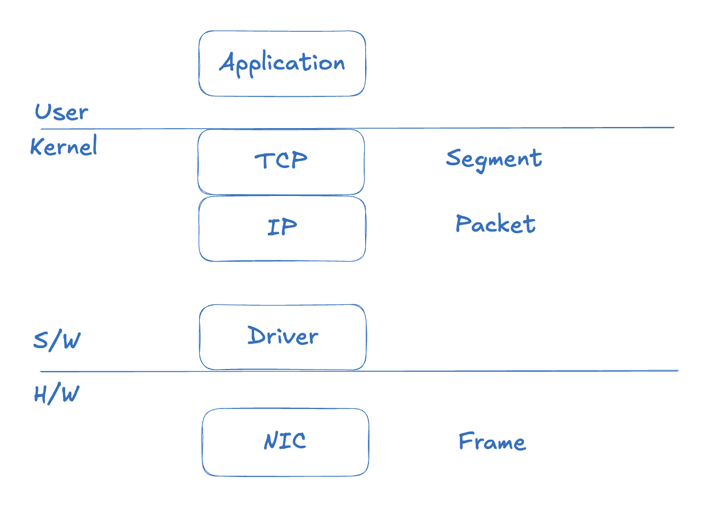
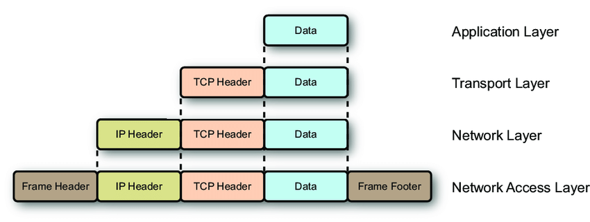
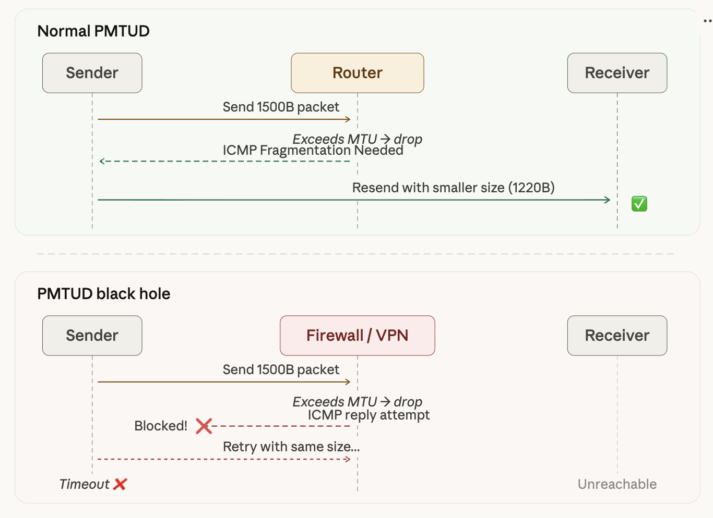
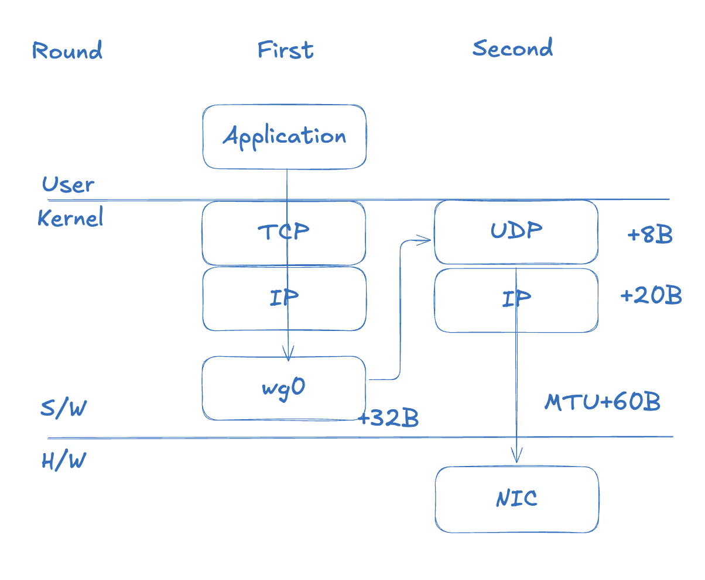
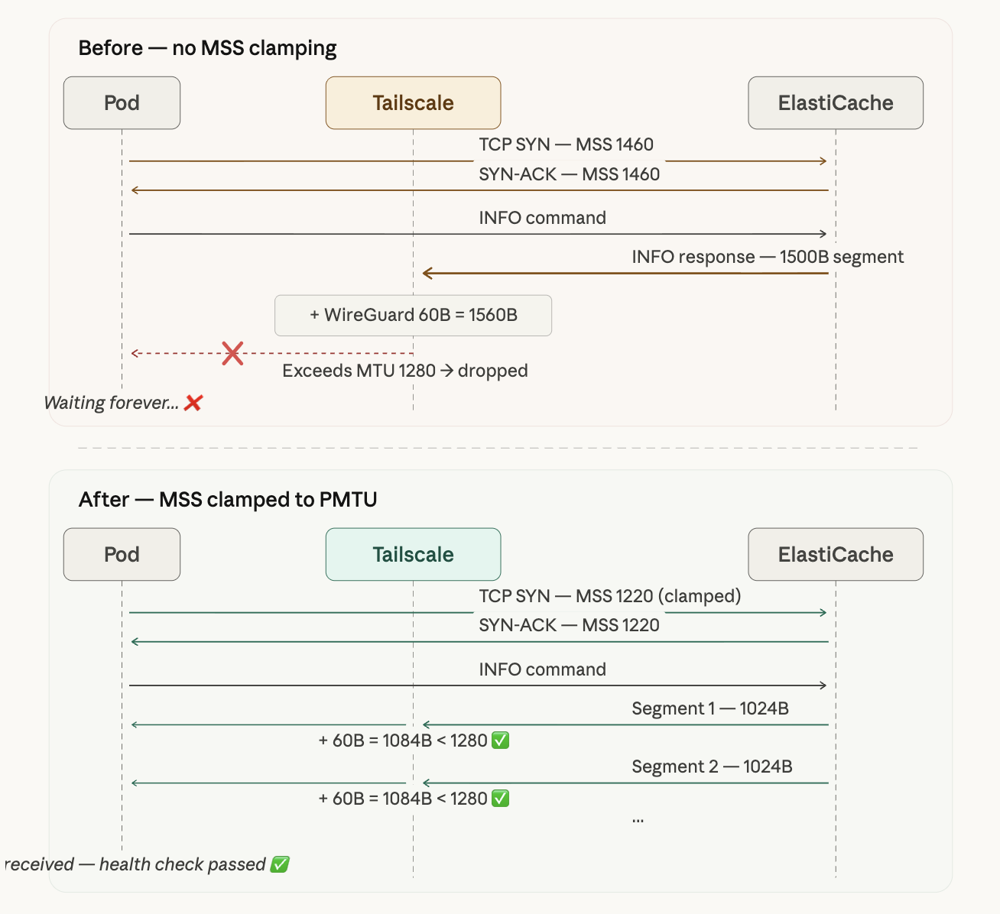
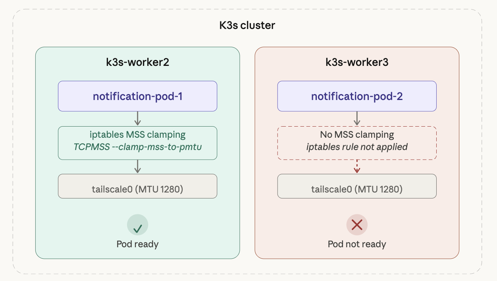
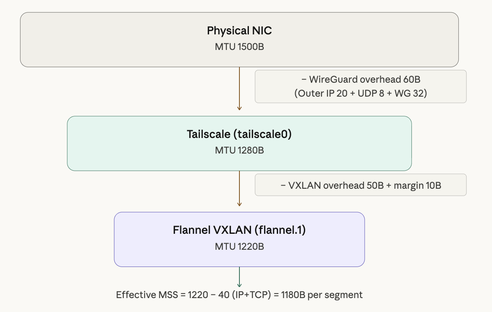

"연결은 되는데 헬스체크만 실패한다."

온프레미스 K3s 클러스터에서 Tailscale VPN을 통해 AWS ElastiCache(Redis)에 연결하는 구성에서, 배포 직후 Pod가 Ready 상태로 전환되지 않는 문제를 마주했다. Redis 연결 자체는 성공하고, 간단한 커맨드(HELLO, CLIENT)에는 정상 응답이 오는데, 헬스체크에 사용되는 **INFO 커맨드의 응답만 사라지는** 기묘한 현상이었다.

결론부터 말하면, 이 문제의 원인은 **MTU(Maximum Transmission Unit)** 였다. 작은 패킷은 VPN 터널을 무사히 통과하지만, 큰 패킷은 캡슐화 후 물리 NIC의 MTU를 초과하여 드롭되는 전형적인 증상이었다.



사실 MTU에 대해서 들어만 봤지 실제로 만나게 될 줄은 몰랐기 때문에, 처음에는 **패킷 크기에 따라 응답이 달라진다는 점**을 눈치채지 못했다. 단순히 트래픽이 안 흐른다고 생각하여 노드 레벨, Pod 레벨에서 ping과 DNS resolve를 반복 확인하는 데 시간을 썼다.

이 글에서는 트러블슈팅 과정과 함께 MTU, MSS의 개념을 짚고, 최종적으로 MSS Clamping과 Flannel MTU 설정으로 문제를 해결한 과정을 다룬다.

---

## 1. 인프라 구성

먼저 문제가 발생한 환경을 소개한다.

- **K3s 클러스터**: 온프레미스에 K3s를 통해 구축된 경량 Kubernetes. Pod CIDR는 `10.42.0.0/16`이다.

- **VPN**: Tailscale(WireGuard 기반 메시 VPN). AWS Private Subnet에 접근할 수 있도록 bastion 인스턴스에 Tailscale을 설치하고, Subnet Router를 통해 VPC CIDR를 advertise하는 구조이다. 온프레미스의 모든 노드에도 Tailscale을 설정해두었다.

- **AWS ElastiCache**: Private Subnet에 위치한 Redis 7.1 인스턴스. EC2 bastion을 통해서만 접근 가능하며, 온프레미스에서는 반드시 Tailscale 터널을 경유해야 한다.

- **애플리케이션**: Spring Boot(Kotlin) 기반 Notification 서비스. ArgoCD로 배포하며, ElastiCache에 Lettuce 클라이언트로 연결한다. AWS ECS에서 온프레미스로 이관하는 도중에 이번 문제가 발생했다.

이 구성에서 핵심은 **온프레미스 Pod → Tailscale 터널 → AWS Private Subnet의 Redis**라는 경로이다. Pod에서 나간 패킷은 Flannel의 VXLAN을 거쳐 노드로 나오고, 다시 Tailscale의 WireGuard 터널을 통해 AWS까지 도달한다. 즉, **캡슐화가 두 번** 일어나는 구조이다.

---

## 2. 문제 발생: Redis 헬스체크 실패

ArgoCD에서 Notification 서비스를 배포하자, Pod가 Ready 상태로 전환되지 않았다. Spring Boot 앱 자체는 13초 만에 정상 기동되었고, Redis TCP 연결도 성공했다. 그런데 **Spring Boot Actuator의 Redis 헬스체크가 계속 실패**하면서 Pod가 Not Ready 상태에 머물렀다.

처음에는 네트워크 자체에 문제가 있는 줄 알았다. ElastiCache의 DNS를 제대로 리졸브하지 못하는 줄 알고, 노드 레벨에서 Pod 레벨로 올라가며 연결을 확인했다. 하지만 모두 정상이었고, 6379 포트에 대한 ping도 성공했다.

로그를 자세히 살펴보니 흥미로운 패턴이 보였다.

**정상: HELLO / CLIENT 커맨드**

```log
01:22:20.983 [lettuce-nioEventLoop-6-1] DEBUG CommandHandler
  - write(ctx, AsyncCommand [type=HELLO, ...])
01:22:21.039 [lettuce-nioEventLoop-6-1] DEBUG CommandHandler
  - Received: 150 bytes, 1 commands in the stack
01:22:21.051 [lettuce-nioEventLoop-6-1] DEBUG CommandHandler
  - Completing command [type=HELLO, output={server=redis, version=7.1.0, proto=3, ...}]

01:22:21.053 [lettuce-nioEventLoop-6-1] DEBUG CommandHandler
  - write(ctx, [AsyncCommand [type=CLIENT, ...], AsyncCommand [type=CLIENT, ...]])
01:22:21.062 [lettuce-nioEventLoop-6-1] DEBUG CommandHandler
  - Received: 10 bytes, 2 commands in the stack
01:22:21.063 [lettuce-nioEventLoop-6-1] DEBUG CommandHandler
  - Completing command [type=CLIENT, output=OK]
```

자세히 보면 **Connection Timeout이 아니라 Healthcheck에서 실패하는 상황**이었다. HELLO(150B), CLIENT(10B)는 `Completing command` 로그가 정상적으로 찍힌다.

**비정상: INFO 커맨드 — 응답 없음**

```log
01:22:21.085 [http-nio-8081-exec-3] DEBUG RedisChannelHandler
  - dispatching command AsyncCommand [type=INFO, ...]
01:22:21.089 [lettuce-nioEventLoop-6-1] DEBUG CommandEncoder
  - writing command AsyncCommand [type=INFO, ...]
# ⚠️ 이후 Received 로그 없음 — 응답이 돌아오지 않음

01:22:30.582 [http-nio-8081-exec-4] DEBUG RedisChannelHandler
  - dispatching command AsyncCommand [type=INFO, ...]
# ⚠️ Received 로그 없음 — 10초 간격으로 재시도 반복

01:22:40.623 ... [type=INFO, ...] # ⚠️ 응답 없음
01:22:50.664 ... [type=INFO, ...] # ⚠️ 응답 없음
01:23:00.705 ... [type=INFO, ...] # ⚠️ 응답 없음
```

INFO 커맨드를 보내면 `writing command` 로그까지는 찍히는데, `Received` 로그가 **아예 찍히지 않는다**. 응답 자체가 돌아오지 않는 것이다. 10초 간격으로 계속 재시도하지만 결과는 같다.

### 패턴 정리: 패킷 크기에 따른 터널 통과 여부



위 다이어그램은 Redis 응답이 Tailscale 터널을 거쳐 Pod에 도달하는 두 가지 시나리오를 보여준다.

**Case 1: 작은 응답은 통과한다.** HELLO 커맨드의 150B 응답은 캡슐화 후에도 210B 수준이다. Tailscale 터널의 MTU 1280을 넉넉하게 밑돌기 때문에, 패킷은 정상적으로 Pod까지 도달한다(150B < 1280).

**Case 2: 큰 응답은 드롭된다.** INFO 커맨드의 응답은 약 1500B 세그먼트로 내려온다. 여기에 WireGuard 캡슐화 오버헤드 60B가 추가되면 **1560B**가 되어, Tailscale 터널의 MTU 1280을 초과한다. 결과적으로 패킷은 드롭되고, Pod에서는 응답을 영원히 기다리게 된다.

**작은 패킷은 통과하고, 큰 패킷만 사라진다.** 이것이 결정적인 단서였다. 패킷 크기에 따라 성공과 실패가 갈리는 시점에서, MTU 문제를 떠올릴 수 있었다.

---

## 3. 원인 추적: MTU 가설

패킷 크기에 따라 성공과 실패가 갈리는 현상은 MTU 문제의 전형적인 증상이다. 다른 가능성도 검토했지만 가능성이 낮았다.

- **Redis ACL/권한 문제?** → 권한이 없다면 에러 응답이 돌아와야 한다. 응답 자체가 없는 것은 네트워크 레벨 문제를 가리킨다.
- **Redis 과부하?** → INFO는 가벼운 커맨드이다. 서버 문제라면 모든 커맨드에 영향이 있어야 한다.
- **Tailscale 설정 문제?** → 동일한 보안 그룹의 RDS에는 정상 연결되고 있었다.

MTU 가설을 확인하기 위해 워커 노드에서 DF(Don't Fragment) 비트를 설정한 ping 테스트를 수행했다.

```bash
uoslife@k3s-worker2:~$ ping -M do -s 1400 10.128.168.231
PING 10.128.168.231 (10.128.168.231) 1400(1428) bytes of data.
ping: local error: message too long, mtu=1280
ping: local error: message too long, mtu=1280
ping: local error: message too long, mtu=1280
```

`-M do`는 DF 비트를 설정하는 옵션이고, `-s 1400`은 ICMP 페이로드 크기를 1400바이트로 지정하는 옵션이다. 결과는 즉시 `message too long, mtu=1280`으로 실패했다. 1400 + 28(IP 20B + ICMP 8B) = 1428바이트가 Tailscale 인터페이스의 MTU 1280을 초과하기 때문이다.

```bash
uoslife@k3s-worker2:~$ ping -M do -s 1200 10.128.168.231
PING 10.128.168.231 (10.128.168.231) 1200(1228) bytes of data.
# 패킷은 나감 (1228 < 1280)
```

1200바이트로 줄이면 패킷은 나간다. **Tailscale 인터페이스(`tailscale0`)의 MTU가 1280**으로 설정되어 있다는 사실이 확인되었다. 이제 MTU가 왜 문제가 되는지 원리를 살펴보자.

---

## 4. MTU 개념 정리

> 이 섹션에서는 트러블슈팅 과정을 잠시 멈추고, MTU와 관련된 핵심 개념을 정리한다.

### 4.1 MTU와 MSS

MTU(Maximum Transmission Unit)는 네트워크 인터페이스가 한 번에 전송할 수 있는 최대 패킷 크기이다. 정확히는 L2 프레임의 페이로드, 즉 **L3(IP) 패킷의 최대 크기**를 의미한다. 이더넷의 표준 MTU는 **1500바이트**이다.

이 의미를 이해하기 위해 OSI 계층별 데이터 단위를 먼저 짚어보자. 아래 그림은 널널한 개발자 강의에서 가져온 내용이다.



TCP 계층에서는 **Segment**, IP 계층에서는 **Packet**, 데이터 링크 계층(NIC)에서는 **Frame**이라는 단위를 사용한다. 위 계층에서 아래 계층으로 이동할수록 헤더가 추가된다.



MTU가 1500바이트이고, IP 헤더 20B + TCP 헤더 20B를 빼면 Payload는 **최대 1460바이트**가 된다. 참고로 Ethernet Frame Header(14B)와 FCS(4B)는 MTU 계산에 포함되지 않는다. MTU는 L3 이상의 크기만 카운트한다.

여기서 중요한 개념이 **MSS(Maximum Segment Size)** 이다. MSS는 한 TCP 세그먼트에 담을 수 있는 최대 애플리케이션 데이터 크기로, MTU에서 IP 헤더와 TCP 헤더를 뺀 값이다.

```
MSS = MTU - IP Header - TCP Header
MSS = 1500 - 20 - 20 = 1460 바이트
```

TCP는 연결 수립(3-way handshake) 시 **자기가 나가는 인터페이스의 MTU를 보고 MSS를 협상**한다. 애플리케이션이 10KB 데이터를 보내달라고 하면, TCP가 MSS 단위로 쪼개서 세그먼트를 만든다.

### 4.2 Fragmentation과 DF 비트

패킷이 경로 중간에서 MTU를 초과하면 두 가지 일이 벌어질 수 있다.

**시나리오 1: Fragmentation (단편화)**

IP 헤더의 DF(Don't Fragment) 비트가 꺼져 있으면, 라우터가 패킷을 MTU에 맞게 쪼개서 전송한다. 수신 측에서 재조립하는데, 성능 저하가 있고 조각 하나라도 유실되면 전체를 재전송해야 한다.

**시나리오 2: 패킷 드롭 + ICMP 에러**

DF 비트가 켜져 있으면(요즘 대부분의 TCP 패킷), 라우터가 패킷을 드롭하고 ICMP "Fragmentation Needed" 메시지를 반환한다. 송신자가 이 메시지를 받고 패킷 크기를 줄여서 재전송한다. 이것이 **Path MTU Discovery(PMTUD)** 메커니즘이다.

단, VPN이나 방화벽 환경에서는 ICMP가 차단되어 PMTUD가 동작하지 않는 경우가 많다. 이때 송신자는 패킷이 왜 드롭되는지 모른 채 타임아웃을 맞게 된다. 이를 **PMTUD Black Hole**이라고 부른다.



위 다이어그램처럼, 정상적인 PMTUD에서는 라우터가 ICMP로 MTU 초과를 알려주어 송신자가 패킷 크기를 줄여 재전송한다. 하지만 VPN/방화벽 환경에서는 ICMP가 차단되어 송신자가 드롭 원인을 알 수 없고, 같은 크기로 재시도를 반복하다 타임아웃에 빠지게 된다.

### 4.3 WireGuard(Tailscale)의 이중 캡슐화 문제

이제 핵심이다. WireGuard는 **L3 VPN**으로, IP 패킷을 통째로 캡슐화한다. 이 과정에서 약 60바이트의 오버헤드가 추가된다.

```
WireGuard 오버헤드: Outer IP(20B) + UDP(8B) + WG Header(32B) = 60B
```

캡슐화 과정을 단계별로 보면 이렇다.

**1단계: 앱이 패킷을 만든다**

애플리케이션은 터널의 존재를 모른다. 평소처럼 데이터를 전송한다.

```
[Inner IP 20B] [Inner TCP 20B] [Payload 1460B] = 1500B
```

**2단계: WireGuard(Tailscale)가 캡슐화한다**

원본 1500B 패킷을 "데이터"로 취급하고, 바깥에 새로운 헤더를 씌운다.

```
[Outer IP 20B] [UDP 8B] [WG Header 32B] [원래 패킷 1500B] = 1560B
```

**3단계: 물리 NIC 통과 시도**

물리 NIC의 MTU는 1500B인데, 캡슐화된 패킷은 1560B이다. **MTU 초과 → 드롭.**



WireGuard 기반 VPN에서는 패킷이 **두 번의 레이어를 거쳐** 전송된다. 먼저 TCP/IP 레이어를 거친 1500B 패킷이 커널의 WireGuard 가상 인터페이스(`wg0`, `tailscale0`)에 도달한다. wg0에서 패킷을 암호화하고 WG 헤더(32B)를 추가하여 새로운 UDP 페이로드로 만든다. 이후 UDP 헤더(8B), Outer IP 헤더(20B)가 차례로 붙어 최종적으로 **1560B**가 된다.

> TCP 계층에서 데이터 단위를 세그먼트(Segment)라고 부르는 것과 달리, UDP 계층에서는 데이터그램(Datagram)이라고 부른다.

정리하면, WireGuard를 통해 캡슐화된 패킷은 다음과 같이 MTU를 초과하게 된다.

```
일반 패킷:
[IP 20B] [TCP 20B] [Payload 1460B] = 1500B   ← 물리 NIC MTU 이하 ✅

WireGuard 캡슐화 후:
[Outer IP 20B] [UDP 8B] [WG 32B] [Inner IP 20B] [TCP 20B] [Payload 1460B] = 1560B
                                                                             ← MTU 초과 ❌
```

이미 꽉 차게 포장된 택배를 국제배송용 박스에 다시 넣어야 하는데, 바깥 박스 크기 제한도 같아서 안 들어가는 상황과 같다.

### TCP가 알아서 조절하지 못하는 이유

TCP는 MSS 협상 시 자기가 나가는 인터페이스의 MTU를 참조한다. 터널 인터페이스(`tailscale0`)의 MTU가 1500으로 설정되어 있으면, TCP는 MSS 1460으로 협상한다. WireGuard가 60B를 추가하는 것은 TCP가 알 수 없는 영역이다. 이것이 바로 **IP-in-UDP 캡슐화**의 함정이다.

### 우리 환경에서 실제로 일어난 일

우리 환경의 Tailscale은 MTU를 1280으로 설정하고 있었다. 이는 IPv6 최소 MTU 호환을 위해 Tailscale이 보수적으로 잡은 값이다. 그런데 Pod 내부의 TCP 스택이 이 값을 제대로 반영하지 못한 것이 문제였다.

```
Redis PING (작은 패킷):
  Inner: [IP+TCP+PING ≈ 50B] = 50B
  캡슐화 후: 50 + 60 = 110B → ✅ 통과

Redis INFO 응답 (큰 패킷):
  Inner: [IP+TCP+INFO ≈ 1500B] = 1500B
  캡슐화 후: 1500 + 60 = 1560B → ❌ 드롭
```

HELLO(150B), CLIENT(10B) 같은 작은 응답은 캡슐화해도 MTU 이내이므로 문제가 없다. 하지만 INFO 응답(~5KB)은 MTU를 초과하는 세그먼트가 포함되어 드롭된다. **"연결은 되는데 헬스체크만 실패한다"**는 바로 이런 원리였다.

---

## 5. 해결: MSS Clamping 적용

원인을 파악했으니, 해결 방법은 **TCP MSS를 터널 MTU에 맞게 강제로 낮추는 것**이다. 이를 **MSS Clamping**이라고 한다.

### 적용한 iptables 룰

```bash
sudo iptables -t mangle -A FORWARD -o tailscale0 \
  -p tcp --tcp-flags SYN,RST SYN \
  -j TCPMSS --clamp-mss-to-pmtu
```

각 옵션의 의미는 다음과 같다.

| 옵션 | 설명 |
|------|------|
| `-t mangle` | 패킷 변조(mangle) 테이블 |
| `-A FORWARD` | 노드를 경유(forward)하는 패킷에 적용 (Pod → 외부 트래픽) |
| `-o tailscale0` | tailscale0 인터페이스로 나가는 패킷 대상 |
| `-p tcp --tcp-flags SYN,RST SYN` | TCP SYN 패킷만 대상 (핸드셰이크 시점) |
| `-j TCPMSS --clamp-mss-to-pmtu` | MSS 값을 Path MTU에 맞게 자동 조정 |

이 룰은 TCP 3-way handshake의 SYN 패킷에서 MSS 값을 `tailscale0` 인터페이스의 MTU(1280)에 맞게 자동으로 조정한다. 이렇게 하면 ElastiCache가 응답을 보낼 때 **더 작은 세그먼트로 나누어 보내게 된다**.

### 적용 직후 결과

```log
01:38:20.012 [http-nio-8081-exec-2] DEBUG RedisChannelHandler
  - dispatching command AsyncCommand [type=INFO, ...]
01:38:20.014 [lettuce-nioEventLoop-6-1] DEBUG CommandEncoder
  - writing command AsyncCommand [type=INFO, ...]
01:38:20.022 [lettuce-nioEventLoop-6-1] DEBUG CommandHandler
  - Received: 1024 bytes, 1 commands in the stack
01:38:20.022 [lettuce-nioEventLoop-6-1] DEBUG RedisStateMachine
  - Decode done, empty stack: false
01:38:20.022 [lettuce-nioEventLoop-6-1] DEBUG CommandHandler
  - Received: 4175 bytes, 1 commands in the stack
01:38:20.023 [lettuce-nioEventLoop-6-1] DEBUG RedisStateMachine
  - Decode done, empty stack: true
01:38:20.023 [lettuce-nioEventLoop-6-1] DEBUG CommandHandler
  - Completing command [type=INFO, output=# Server redis_version:7.1.0 ...]
01:38:20.024 [http-nio-8081-exec-2] DEBUG RedisConnectionUtils
  - Closing Redis Connection
```

INFO 응답이 **여러 TCP 세그먼트로 나뉘어** 도착하는 것이 보인다. 첫 번째 `Received: 1024 bytes`에서 `Decode done, empty stack: false`(아직 더 받아야 함)가 찍히고, 두 번째 `Received: 4175 bytes`에서 `Decode done, empty stack: true`(디코딩 완료)로 마무리된다. 총 약 5,199바이트가 정상 수신되었다.



위 다이어그램은 MSS Clamping 적용 전후의 차이를 보여준다. Before에서는 MSS 1460으로 협상되어 INFO 응답이 1500B 단일 세그먼트로 내려오고, 캡슐화 후 1560B가 되어 드롭된다. After에서는 MSS가 1220으로 클램핑되어 INFO 응답이 1024B 단위의 작은 세그먼트로 분할되고, 캡슐화 후에도 MTU 1280 이내로 정상 통과한다.

### 전후 비교

| 항목 | Before | After |
|------|--------|-------|
| HELLO (150B) | ✅ 정상 수신 | ✅ 정상 수신 |
| CLIENT (10B) | ✅ 정상 수신 | ✅ 정상 수신 |
| INFO (~5KB) | ❌ 응답 드롭 | ✅ 1024B + 4175B 분할 수신 |
| Health Check | ❌ 실패 (Pod Not Ready) | ✅ 성공 (Pod Ready) |

---

## 6. 두 번째 문제: 다른 워커 노드

첫 번째 Pod가 정상화되어 안심하고 있었는데, **두 번째 Pod replica가 여전히 Ready 상태가 되지 않았다.**

원인은 단순했다. MSS Clamping을 `k3s-worker2` 한 대에만 적용했는데, 두 번째 Pod가 **다른 워커 노드**에 스케줄된 것이다. iptables 룰은 노드별로 독립적이므로 자동 전파되지 않는다.



`k3s-worker2`에는 iptables 룰이 적용되어 Pod가 Ready 상태이지만, `k3s-worker3`에는 룰이 없어 동일한 문제가 재현된 것이다.

```bash
# 각 Pod가 어느 노드에 스케줄됐는지 확인
kubectl get pods -n <namespace> -o wide | grep notification
```

해결은 간단하다. **모든 워커 노드**에 동일한 iptables 룰을 적용하면 된다.

```bash
# 모든 워커 노드에서 실행
sudo iptables -t mangle -A FORWARD -o tailscale0 \
  -p tcp --tcp-flags SYN,RST SYN \
  -j TCPMSS --clamp-mss-to-pmtu
```

적용 후 두 번째 Pod도 정상적으로 Ready 상태로 전환되었다.

쿠버네티스에서 네트워크 설정은 **노드 레벨**이다. Pod는 어느 노드에 스케줄될지 모르므로, 네트워크 관련 설정은 반드시 **모든 노드에 일관되게** 적용해야 한다.

---

## 7. 영구 적용

### 문제: 재부팅하면 사라지는 iptables 룰

`iptables` 명령으로 적용한 룰은 메모리에만 존재한다. 노드가 리부트되면 룰이 사라지고, 같은 문제가 다시 발생한다. 실제로 워커 노드에 SSH 접속할 때 `*** System restart required ***` 메시지가 표시되어 있었기 때문에, **영구 적용이 필수**였다.

### 방법 1: iptables-persistent

가장 간단한 방법은 `iptables-persistent`를 설치하여 현재 룰을 영속화하는 것이다.

```bash
sudo apt install iptables-persistent
sudo netfilter-persistent save
```

### 방법 2: Flannel MTU 근본 수정

MSS Clamping은 응급 처치에 가깝다. 근본적으로는 **Flannel의 MTU를 Tailscale 터널 MTU에 맞춰 설정**하는 것이 올바른 방법이다.

서버 노드(master)의 `/etc/rancher/k3s/config.yaml`:

```yaml
flannel-conf: /etc/rancher/k3s/flannel.json
```

`/etc/rancher/k3s/flannel.json`:

```json
{
  "Network": "10.42.0.0/16",
  "EnableIPv4": true,
  "EnableIPv6": false,
  "Backend": {
    "Type": "vxlan",
    "VNI": 1,
    "Port": 8472,
    "MTU": 1220
  }
}
```

MTU 1220의 계산식은 다음과 같다.

```
Tailscale 터널 MTU:  1280
- VXLAN 오버헤드:      50
- 여유분:              10
────────────────────────
Flannel MTU:         1220
```



물리 NIC(1500B)에서 WireGuard 오버헤드(60B)를 빼면 Tailscale MTU 1280이 되고, 여기서 다시 VXLAN 오버헤드(50B)와 여유분(10B)을 빼면 Flannel MTU 1220이 된다. 이 값으로 설정하면 Pod에서 나가는 패킷이 모든 캡슐화 레이어를 통과할 수 있다.

### 적용 순서

```bash
# 1. 현재 flannel 설정 확인
cat /var/lib/rancher/k3s/agent/etc/flannel/net-conf.json

# 2. config 파일 생성 후 k3s 재시작 (master)
sudo systemctl restart k3s

# 3. 워커 노드 재시작
sudo systemctl restart k3s-agent

# 4. flannel MTU 확인
ip link show flannel.1

# 5. 기존 Pod rollout restart (새 MTU는 신규 Pod에만 적용됨)
kubectl rollout restart deployment/<deployment-name> -n <namespace>
```

주의할 점이 있다. Flannel MTU 변경은 **기존 실행 중인 Pod의 veth에 즉시 반영되지 않는다**. 변경 후 기존 Pod들을 rollout restart 해야 새 MTU가 적용된다. 전체 워크로드에 영향이 있으므로 **점검 시간에 진행하는 것을 권장**한다.

---

## 8. 회고

### 배운 것들

이번 트러블슈팅에서 얻은 교훈을 정리하면 다음과 같다.

1. **"작은 패킷은 되고 큰 패킷은 안 된다"면 MTU를 의심하라.** 연결은 성공하는데 데이터 전송만 실패하는 패턴은 MTU 문제의 전형적 증상이다.
2. **VPN 터널 환경에서는 이중 캡슐화를 항상 고려해야 한다.** WireGuard 60B, VXLAN 50B 등 각 캡슐화 레이어의 오버헤드를 계산에 넣어야 한다.
3. **쿠버네티스 네트워크 설정은 노드 레벨이다.** iptables 룰은 자동 전파되지 않으므로 모든 노드에 일관되게 적용해야 한다.
4. **응급 처치(MSS Clamping)와 근본 해결(MTU 설정 변경)을 구분하자.** 장애 상황에서는 빠른 우회가 먼저지만, 이후 반드시 영구 적용을 챙겨야 한다.

### 디버깅 명령어 모음

```bash
# MTU 확인: DF 비트 설정하여 ping
ping -M do -s 1400 <target-ip>

# 인터페이스별 MTU 확인
ip link show tailscale0
ip link show flannel.1

# MSS Clamping 적용 확인
sudo iptables -t mangle -L FORWARD -v
```

### WireGuard 프로토콜 부록

참고로 WireGuard의 주요 특징을 정리하면 다음과 같다.

| 항목 | WireGuard | OpenVPN |
|------|-----------|---------|
| 전송 계층 | UDP (항상) | TCP 또는 UDP |
| 동작 레벨 | 커널 모듈 | 유저스페이스 |
| 코드 크기 | ~4,000줄 | ~수십만 줄 |
| 암호화 협상 | 없음 (고정) | TLS 기반 협상 |

WireGuard가 항상 UDP를 사용하는 데에는 이유가 있다. 터널 안팎 모두 TCP를 사용하면 재전송이 중첩되면서 성능이 급격히 저하되는 **TCP meltdown** 현상이 발생한다. 바깥쪽 UDP는 전달만 담당하고, 안쪽 TCP가 재전송을 담당하는 구조로 이 문제를 회피한다.

Tailscale은 이 WireGuard 위에 **제어 플레인**(키 배포, NAT traversal, DERP 릴레이 등)을 얹은 것이다. 터널링 자체의 동작은 순수 WireGuard와 동일하므로, WireGuard의 MTU 관련 특성이 Tailscale에도 그대로 적용된다.
