토이 프로젝트를 진행하다 보면 크롤러를 구현하는 일이 상당히 잦다. 정보가 넘쳐흐르는 웹 세상에서 원하는 데이터를 끌어와 가공하고, 이를 기반으로 다양한 서비스를 제공할 수 있다는 점은 개발자에게 큰 매력이다. Node.js, Python, 그리고 Spring + Kotlin 환경에 이르기까지, 거의 모든 프로젝트에 크롤러가 들어가곤 했다.

이 글에서는 크롤러와 스크래퍼의 개념 차이부터 시작하여, 다양한 언어로 스크래퍼를 구현하는 방법을 다룬다. 나아가 대학 공지사항을 스크래핑해서 사용자에게 푸시 알림을 보내는 시스템을 Kubernetes CronJob 기반으로 설계하고 운영한 실전 경험까지 공유한다.

---

## 1. 크롤러 vs 스크래퍼

웹 크롤링과 스크래핑은 자주 혼용되지만, 엄밀히 말하면 의미가 다르다.

| 구분 | 크롤러 (Crawler) | 스크래퍼 (Scraper) |
|------|----------------|------------------|
| **목적** | 웹 페이지를 순회하며 URL을 수집 | 특정 페이지에서 데이터를 추출 |
| **범위** | 넓은 범위 (검색 엔진 등) | 좁은 범위 (특정 사이트) |
| **동작** | 링크를 따라가며 탐색 | HTML을 파싱하여 데이터 추출 |
| **예시** | Googlebot, Bingbot | 가격 비교 사이트, 뉴스 수집기 |

실제 프로젝트에서는 두 가지를 결합하는 경우가 많다. 크롤러가 페이지를 순회하면서, 각 페이지에서 스크래퍼가 필요한 데이터를 추출하는 구조이다.

### 법적/윤리적 고려사항

웹 스크래핑을 시작하기 전에 반드시 확인해야 할 사항이 있다.

**robots.txt 확인**: 웹사이트의 루트 도메인에서 `/robots.txt`로 요청을 보내면 텍스트 파일을 받을 수 있다. 이는 검색 로봇에게 사이트 및 웹페이지를 수집할 수 있도록 허용하거나 제한하는 국제 권고안이다. 크롤링할 때 robots.txt에 적힌 규칙을 준수하는 것이 기본이다. robots.txt 파일이 없다면 모든 콘텐츠를 수집할 수 있도록 간주할 수 있다.

```bash
# robots.txt 확인 예시
curl https://example.com/robots.txt
```

```text
User-agent: *
Disallow: /private/
Allow: /public/
Crawl-delay: 10
```

이 외에도 **서비스 이용약관(ToS)** 위반 여부, **과도한 요청으로 인한 서버 부하**, **개인정보 수집** 관련 법률(개인정보보호법 등)을 반드시 확인해야 한다.

---

## 2. 스크래핑 기초: 정적 사이트 vs 동적 사이트

스크래핑에 앞서 가장 먼저 확인해야 할 것은 **어떤 데이터를 가져올 것인지**와 **대상 사이트가 정적인지 동적인지**이다.

### 정적 사이트 스크래핑

크롤링 라이브러리의 기본 원리는 특정 웹사이트에 HTTP 요청을 보내고, 받은 HTML을 파싱하여 데이터를 추출하는 것이다. 대상 웹사이트가 정적이라면 원하는 데이터가 HTML에 모두 포함되어 있으므로, 단순한 HTTP 요청과 HTML 파서만으로 충분하다.

### 동적 사이트 스크래핑

동적 사이트의 경우, 원하는 데이터가 JavaScript 렌더링 후에야 얻을 수 있는 경우가 있다. 이 경우에는 Selenium이나 Puppeteer처럼 **headless browser**를 띄워서 데이터를 가져오는 구조를 고려해야 한다.

---

## 3. 다중 언어 구현

스크래퍼는 언어와 환경에 따라 다양한 방법으로 구현할 수 있다. 주요 언어별 라이브러리와 구현 예시를 살펴보자.

### Python: BeautifulSoup + Requests

Python은 스크래핑에 가장 널리 사용되는 언어이다. `requests`로 HTML을 가져오고 `BeautifulSoup`으로 파싱하는 것이 가장 기본적인 패턴이다.

```python
import requests
from bs4 import BeautifulSoup

def scrape_notices(url: str) -> list[dict]:
    """공지사항 목록을 스크래핑하여 반환한다."""
    response = requests.get(url, headers={
        "User-Agent": "Mozilla/5.0 (compatible; NoticeBot/1.0)"
    })
    response.raise_for_status()

    soup = BeautifulSoup(response.text, "html.parser")
    notices = []

    for item in soup.select("table.board-list tbody tr"):
        title_tag = item.select_one("td.title a")
        date_tag = item.select_one("td.date")

        if title_tag and date_tag:
            notices.append({
                "title": title_tag.get_text(strip=True),
                "url": title_tag.get("href"),
                "date": date_tag.get_text(strip=True),
            })

    return notices
```

### Python: Scrapy 프레임워크

대규모 크롤링이 필요한 경우 Scrapy 프레임워크가 적합하다. 비동기 처리, 중복 제거, 요청 제한(throttling) 등을 프레임워크 수준에서 지원한다.

```python
import scrapy

class NoticeSpider(scrapy.Spider):
    name = "notices"
    start_urls = ["https://example.ac.kr/notices"]

    custom_settings = {
        "DOWNLOAD_DELAY": 1,          # 요청 간 1초 대기
        "CONCURRENT_REQUESTS": 4,     # 동시 요청 수 제한
        "ROBOTSTXT_OBEY": True,       # robots.txt 준수
    }

    def parse(self, response):
        for row in response.css("table.board-list tbody tr"):
            yield {
                "title": row.css("td.title a::text").get(),
                "url": response.urljoin(row.css("td.title a::attr(href)").get()),
                "date": row.css("td.date::text").get(),
            }

        # 다음 페이지 크롤링
        next_page = response.css("a.next-page::attr(href)").get()
        if next_page:
            yield response.follow(next_page, self.parse)
```

### Node.js: Axios + Cheerio

정적 사이트를 스크래핑할 때 Node.js에서는 `axios`로 HTML을 받아오고 `cheerio`로 파싱하는 조합이 가볍고 빠르다.

```javascript
const axios = require("axios");
const cheerio = require("cheerio");

async function scrapeNotices(url) {
  const { data: html } = await axios.get(url);
  const $ = cheerio.load(html);
  const notices = [];

  $("table.board-list tbody tr").each((_, el) => {
    const titleTag = $(el).find("td.title a");
    const dateTag = $(el).find("td.date");

    notices.push({
      title: titleTag.text().trim(),
      url: titleTag.attr("href"),
      date: dateTag.text().trim(),
    });
  });

  return notices;
}
```

### Node.js: Puppeteer (동적 사이트)

JavaScript로 렌더링되는 동적 사이트에는 headless Chrome을 제어하는 Puppeteer가 필요하다.

```javascript
const puppeteer = require("puppeteer");

async function scrapeDynamicPage(url) {
  const browser = await puppeteer.launch({ headless: "new" });
  const page = await browser.newPage();

  await page.goto(url, { waitUntil: "networkidle2" });

  const notices = await page.evaluate(() => {
    const rows = document.querySelectorAll("table.board-list tbody tr");
    return Array.from(rows).map((row) => ({
      title: row.querySelector("td.title a")?.textContent?.trim(),
      url: row.querySelector("td.title a")?.href,
      date: row.querySelector("td.date")?.textContent?.trim(),
    }));
  });

  await browser.close();
  return notices;
}
```

### Kotlin: Jsoup (Spring 환경)

Spring 환경에서는 Jsoup 라이브러리를 활용하여 스크래핑할 수 있다. JVM 기반이므로 기존 백엔드 시스템과 통합하기 수월하다.

```kotlin
import org.jsoup.Jsoup
import org.jsoup.nodes.Document

data class Notice(
    val title: String,
    val url: String,
    val date: String
)

fun scrapeNotices(targetUrl: String): List<Notice> {
    val doc: Document = Jsoup.connect(targetUrl)
        .userAgent("Mozilla/5.0 (compatible; NoticeBot/1.0)")
        .timeout(10_000)
        .get()

    return doc.select("table.board-list tbody tr").mapNotNull { row ->
        val titleTag = row.selectFirst("td.title a") ?: return@mapNotNull null
        val dateTag = row.selectFirst("td.date") ?: return@mapNotNull null

        Notice(
            title = titleTag.text().trim(),
            url = titleTag.absUrl("href"),
            date = dateTag.text().trim()
        )
    }
}
```

### 라이브러리 비교 요약

| 언어 | 라이브러리 | 정적 사이트 | 동적 사이트 | 특징 |
|------|-----------|:---------:|:---------:|------|
| Python | BeautifulSoup + Requests | O | X | 가장 간단하고 직관적 |
| Python | Scrapy | O | X | 대규모 크롤링, 내장 미들웨어 |
| Python | Selenium | O | O | 브라우저 자동화, 느림 |
| Node.js | Axios + Cheerio | O | X | 가볍고 빠름 |
| Node.js | Puppeteer | O | O | headless Chrome, 강력함 |
| Kotlin | Jsoup | O | X | JVM 생태계, Spring 통합 |

---

## 4. 스크래퍼 아키텍처 설계

스크래퍼의 구조는 프로젝트의 규모와 요구사항에 따라 달라진다. 단순한 서버 구조부터 서드파티 스크래퍼, 서버리스 아키텍처까지 단계별로 살펴보자.

### 가장 단순한 구조: 스크래퍼 서버

가장 간단하게 스크래핑 서버를 만드는 경우를 생각해보자. 특정 URI로 요청이 들어오면, 원본 사이트에서 HTML 데이터를 가져와서 응답으로 보내주는 웹 서버를 구성할 수 있다.

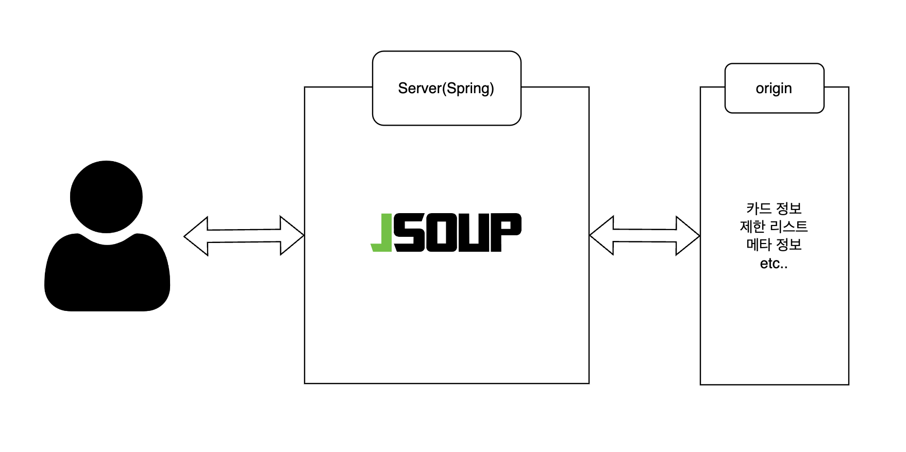

이 구조는 오로지 데이터 크롤링만을 목적으로 하는 경우에 적합하다. 프레임워크 위에 크롤링 라이브러리를 올려 웹 서버를 실행시켜 두는 형태로, AWS EC2 같은 단일 인스턴스에 배포하면 충분하다.

### 서드파티 스크래퍼: 인프라 옵션

프로덕트의 서드파티로 스크래퍼를 만드는 경우, 다양한 인프라 아키텍처를 고려할 수 있다. AWS를 기준으로 크게 세 가지 옵션이 있다.

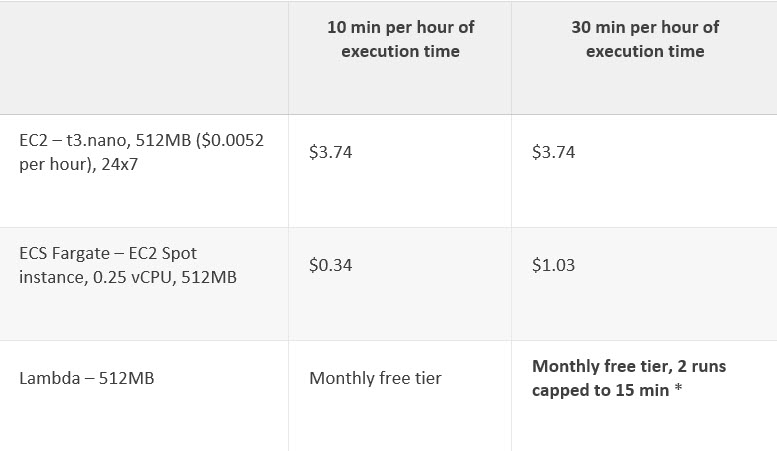

| 옵션 | AWS 서비스 | 특징 |
|------|-----------|------|
| 온프레미즈 | EC2 | 24/7 실행, 높은 비용 |
| 컨테이너 | ECS Fargate | Docker 기반, 중간 비용 |
| 서버리스 | Lambda | 15분 이내 작업, 최저 비용 |

AWS의 [Serverless Architecture for a Web Scraping Solution](https://aws.amazon.com/ko/blogs/architecture/serverless-architecture-for-a-web-scraping-solution/) 포스팅에서 제시하는 핵심은, 간단한 스크립트를 주기적으로 돌리는 스크래퍼라면 **Lambda(서버리스)** 방식이 비용과 리소스 측면에서 가장 효율적이라는 것이다. 스크래핑을 위한 전용 서버를 24시간 가동하는 것은 비효율적이기 때문이다.

### Serverless 스크래퍼 아키텍처

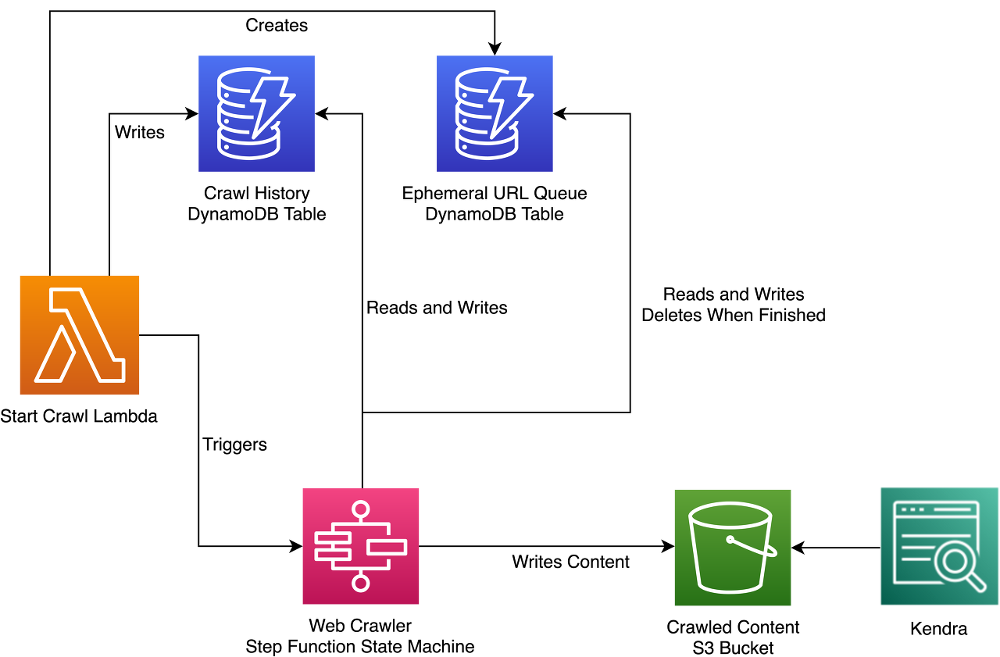

AWS에서 제시하는 Serverless 스크래퍼 아키텍처의 핵심 구조는 다음과 같다.

1. **Lambda**: 스크래핑 작업을 실행
2. **DynamoDB**: 크롤링 이력과 URL 큐를 관리 (상태 저장)
3. **Step Functions**: 크롤링 워크플로우를 상태 머신으로 관리
4. **S3**: 크롤링한 HTML 콘텐츠를 저장

Lambda가 뜰 때마다 이전 Lambda가 어디까지 스크래핑했는지 맥락이 없기 때문에, DynamoDB를 사용하여 상태를 유지하는 구조이다.

---

## 5. 프로젝트: 대학 공지사항 봇


실제 프로덕션 환경에서 공지사항 스크래핑 시스템을 구현한 경험을 공유한다. 대학교 앱 서비스에서 학교 공지사항을 스크래핑하여 사용자에게 실시간 푸시 알림을 보내는 기능을 개발했다.

### 배경과 요구사항

유저 리서치를 통해 공지사항 푸시 알림이 사용자들에게 매우 유용한 기능이라는 것을 확인했다. 특히 선착순 모집 공고나 합격자 발표와 같이 빠르게 전달해야 하는 공지사항이 많았기 때문에, 거의 실시간에 가까운 수준의 전달 속도가 필요했다.

기존 백엔드가 Flask(Python)에서 Spring Boot(Kotlin)로 마이그레이션하는 시점이었으며, 이에 맞춰 스크래핑 시스템을 새로 설계해야 했다.

### 문제 정의

공지사항 스크래핑을 가장 간단하게 구현하는 방법은 메인 서버에 스케줄러를 두는 것이다. 하지만 이 접근법에는 여러 문제가 있었다.

1. **클러스터 환경에서의 중복 실행** -- 2대 이상의 서버가 실행 중이면 스케줄러가 여러 번 동작할 수 있음
2. **로그 관리의 어려움** -- 스크래핑 로그와 메인 서버 로그가 뒤섞임
3. **HTML 처리의 복잡성** -- 공지사항 상세 페이지의 HTML을 그대로 저장해야 했는데, Spring Boot 환경에서는 다루기 번거로움

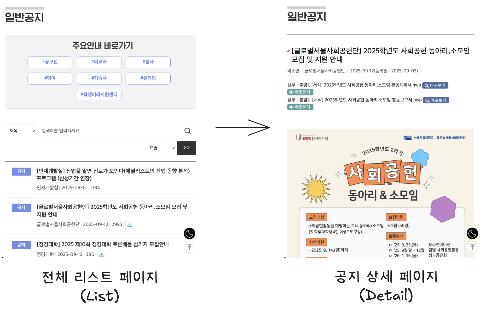

공지사항 페이지를 보면, 한 페이지에 약 40개의 포스팅이 리스트로 나열되어 있고, 각 포스팅을 클릭하면 상세 페이지를 확인할 수 있다. 상세 페이지의 콘텐츠는 사진과 텍스트를 분리해서 스크래핑하기 어려운 구조였고, HTML 자체를 그대로 저장하는 방식을 택했다.

### 왜 CronJob인가

당시 AWS EKS와 온프레미즈에 쿠버네티스 클러스터를 구축하여 서버를 운영하고 있었다. 공지사항 스크래핑은 간단한 스크립트로 충분히 처리할 수 있으므로, **쿠버네티스의 CronJob을 활용하여 주기적으로 Node.js 스크립트를 실행하는 구조**를 선택했다.

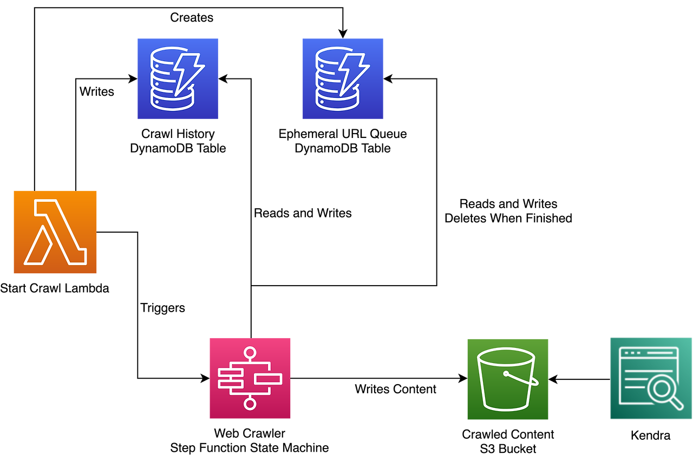

AWS에서 포스팅한 [Scaling up a Serverless Web Crawler and Search Engine](https://aws.amazon.com/ko/blogs/architecture/scaling-up-a-serverless-web-crawler-and-search-engine/) 아키텍처를 참고하여, 쿠버네티스 환경에서도 비슷한 구조를 구현할 수 있을 것으로 판단했다.

---

## 6. 무상태(Stateless) 문제 해결

CronJob 기반 시스템에서 가장 먼저 마주한 문제는 **무상태(stateless)** 라는 점이었다. 매번 새롭게 실행되는 스크래퍼 Pod은 이전에 어디까지 스크래핑했는지 전혀 알 수 없다.

### 문제 상황


CronJob은 매번 새로운 Pod을 생성하여 스크립트를 실행한다. 첫 번째 CronJob이 1번부터 40번까지 스크래핑했다면, 5분 뒤에 실행되는 두 번째 CronJob은 "나는 어디서부터 어디까지 스크래핑해야 하지?"라는 문제에 직면하게 된다.

### 해결: Redis를 통한 상태 관리

을 저장하여 stateful하게 관리")

이 문제를 해결하기 위해 **Redis를 key-value 스토어로 활용**했다. 각 공지사항 포스팅은 고유한 ID를 갖고 있었고, Redis에는 이미 스크래핑한 포스팅의 ID만 저장해 두었다. 새로운 CronJob이 뜰 때마다 Redis를 참조하여 크롤링 범위를 정하고, 작업 후 다시 Redis에 결과를 저장하는 방식으로 **stateless 환경을 stateful하게** 전환했다.

```javascript
const Redis = require("ioredis");
const redis = new Redis(process.env.REDIS_URL);

async function getScrapedIds(origin) {
  // Redis Set에서 이미 스크래핑한 ID 목록을 조회
  const ids = await redis.smembers(`scraped:${origin}`);
  return new Set(ids);
}

async function markAsScraped(origin, id) {
  // 스크래핑 완료한 ID를 Redis Set에 추가
  await redis.sadd(`scraped:${origin}`, id);
}

async function scrapeNewNotices(origin, allNoticeIds) {
  const scrapedIds = await getScrapedIds(origin);

  const newIds = allNoticeIds.filter((id) => !scrapedIds.has(id));
  console.log(`[${origin}] 새로운 공지사항 ${newIds.length}건 발견`);

  for (const id of newIds) {
    await scrapeDetailPage(origin, id);
    await markAsScraped(origin, id);
  }
}
```

### ConfigMap으로 오리진 관리

어떤 공지사항 페이지(오리진)를 스크래핑할 것인지는 쿠버네티스의 **ConfigMap**을 활용하여 환경 변수로 관리했다. 이를 통해 코드 변경 없이 스크래핑 대상을 추가하거나 변경할 수 있었다.

```yaml
apiVersion: v1
kind: ConfigMap
metadata:
  name: scraper-config
  namespace: scraper
data:
  ORIGIN_URL: "https://example.ac.kr/notices/general"
  ORIGIN_NAME: "general-notice"
  REDIS_URL: "redis://redis-service:6379"
  WEBHOOK_URL: "http://utility-server:8080/api/webhook/notice"
```

---

## 7. 속도와 정합성: Producer-Consumer 패턴

### 문제: 파싱 시간이 들쭉날쭉


공지사항 상세 페이지를 파싱하는 과정에서 시간이 오래 걸리는 경우가 간헐적으로 발생했다. HTML 내부에 매우 긴 이미지 URL이 포함되어 파싱 데이터의 크기가 커지는 경우가 있었고, 이로 인해 **레이스 컨디션(race condition)** 이 발생할 수 있었다.

### 해결: Redis Queue 기반 Producer-Consumer 구조

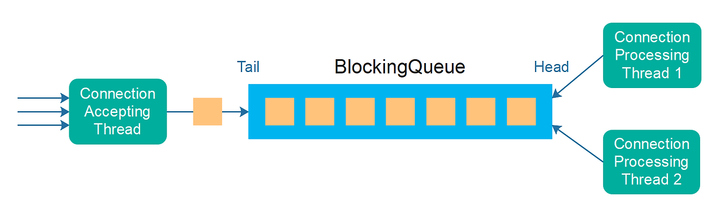

가장 효과적인 방법은 **동기적 역할(스크래핑 범위 확인)과 비동기적 역할(상세 페이지 파싱)을 분리**하는 것이었다. 이를 위해 **Producer-Consumer 패턴**을 도입했다.

- **Producer**: 공지사항 리스트 페이지에서 약 40개의 포스팅 중, Redis에 없는(새로운) ID만 큐에 삽입
- **Consumer**: 큐에서 ID를 꺼내 상세 페이지의 HTML을 비동기적으로 파싱

Redis는 다양한 자료형을 지원하는데, 이를 **큐(Queue)** 로 활용하여 Producer-Consumer 구조를 구현했다.

```javascript
// Producer: 새로운 공지사항 ID를 큐에 삽입
async function produce(origin, noticeIds) {
  const scrapedIds = await getScrapedIds(origin);

  for (const id of noticeIds) {
    if (!scrapedIds.has(id)) {
      await redis.lpush(`queue:${origin}`, id);
      console.log(`[Producer] 큐에 추가: ${id}`);
    }
  }
}

// Consumer: 큐에서 ID를 꺼내 상세 페이지를 파싱
async function consume(origin) {
  while (true) {
    const id = await redis.rpop(`queue:${origin}`);
    if (!id) break;

    try {
      const detail = await scrapeDetailPage(origin, id);
      await sendWebhook(detail);
      await markAsScraped(origin, id);
      console.log(`[Consumer] 처리 완료: ${id}`);
    } catch (err) {
      console.error(`[Consumer] 처리 실패: ${id}`, err);
      // 실패한 항목은 다시 큐에 삽입
      await redis.lpush(`queue:${origin}`, id);
    }
  }
}
```

### 상태 머신을 통한 견고한 크롤링

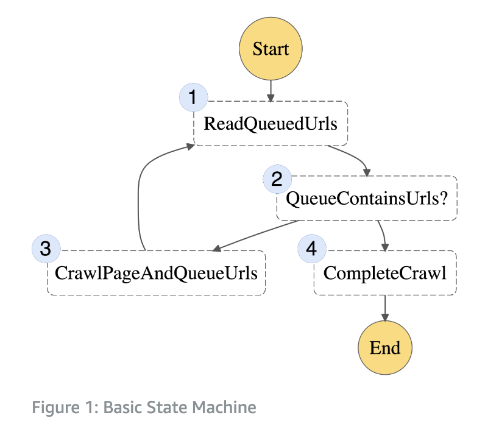

AWS의 Serverless Web Crawler 포스팅에서 제시하는 상태 머신을 참고하여, Redis와 Node.js 스크립트 사이의 통신 알고리즘을 구현했다. 기본 플로우는 다음과 같다.

1. **ReadQueuedUrls** -- 큐에 있는 URL을 읽음
2. **QueueContainsUrls?** -- 큐에 URL이 있는지 확인
3. **CrawlPageAndQueueUrls** -- 페이지를 크롤링하고 새 URL을 큐에 추가
4. **CompleteCrawl** -- 크롤링 완료

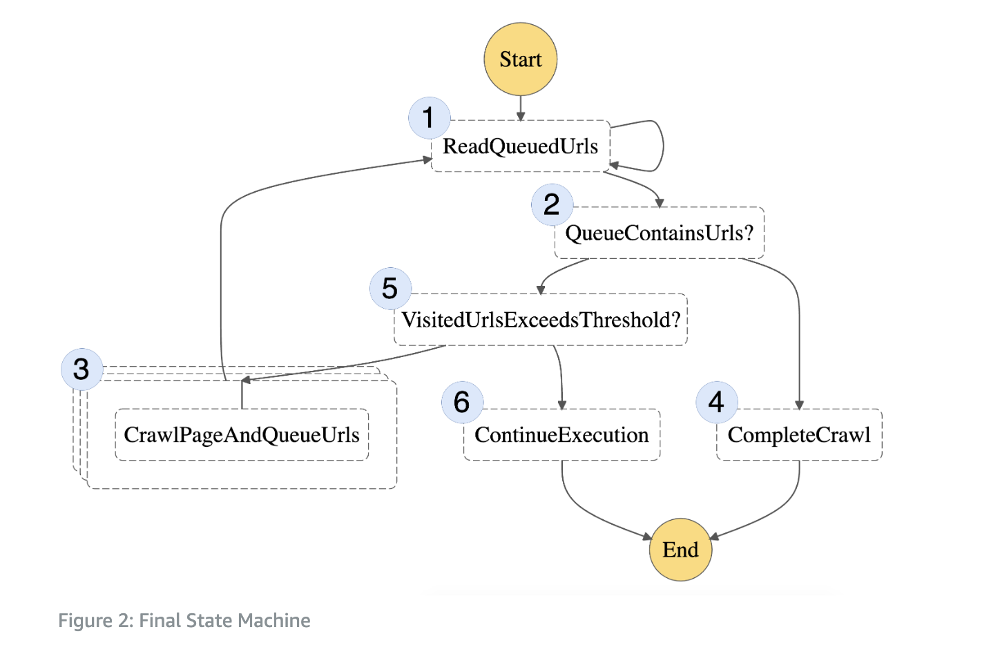

보다 견고한 구현에서는 **VisitedUrlsExceedsThreshold** (방문 URL 수 임계값 확인)와 **ContinueExecution** (실행 지속 여부 판단) 단계가 추가되어, 무한 루프를 방지하고 실행 시간을 제어한다.

---

## 8. 전체 아키텍처: K8s 기반 스크래핑 시스템

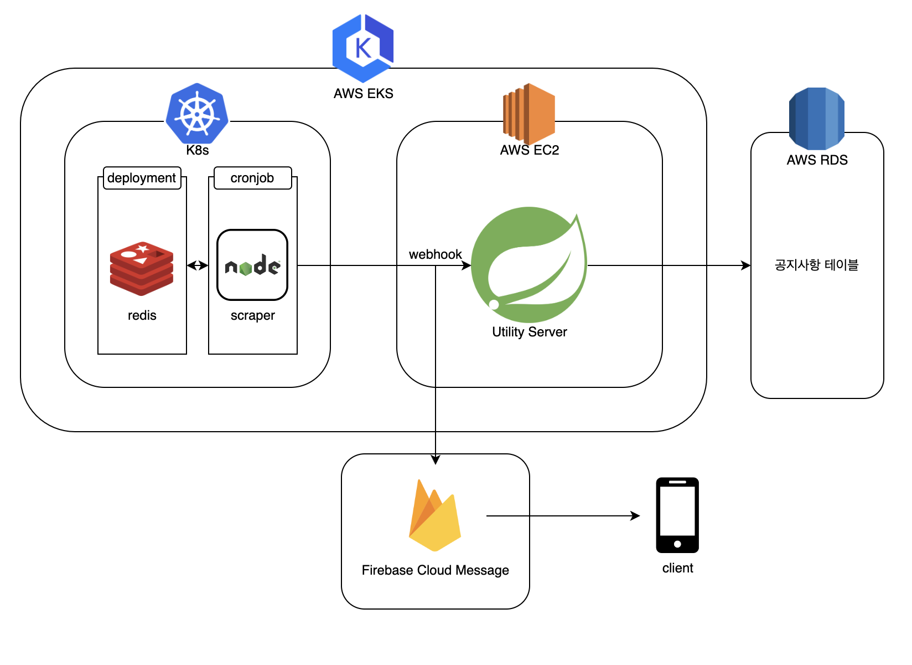

최종 아키텍처는 다음과 같다.

1. **K8s CronJob**: 매분 Node.js 스크래퍼 스크립트를 실행하는 Pod을 생성
2. **Redis (Deployment)**: 스크래핑 이력과 큐를 관리하는 key-value 스토어
3. **Utility Server (Spring Boot)**: 스크래퍼로부터 웹훅을 수신하여 DB에 저장하고 푸시 알림을 트리거
4. **AWS RDS**: 공지사항 데이터를 영구 저장
5. **Firebase Cloud Messaging**: 사용자에게 푸시 알림 발송

스크래퍼는 온전히 스크래핑의 역할만 수행하며, DB에 데이터를 직접 쌓지 않고 **Utility Server를 통해 웹훅으로 전달**한다. Utility Server가 새로운 공지사항을 감지하면 FCM SDK를 통해 사용자에게 푸시 알림을 발송하는 구조이다.

```yaml
apiVersion: batch/v1
kind: CronJob
metadata:
  name: notice-scraper
  namespace: scraper
spec:
  schedule: "*/1 * * * *"    # 매분 실행
  concurrencyPolicy: Forbid   # 이전 작업이 실행 중이면 건너뜀
  successfulJobsHistoryLimit: 3
  failedJobsHistoryLimit: 3
  jobTemplate:
    spec:
      backoffLimit: 1
      activeDeadlineSeconds: 55  # 55초 내에 완료되지 않으면 종료
      template:
        spec:
          restartPolicy: Never
          containers:
            - name: scraper
              image: registry.example.com/notice-scraper:latest
              envFrom:
                - configMapRef:
                    name: scraper-config
              resources:
                requests:
                  memory: "64Mi"
                  cpu: "50m"
                limits:
                  memory: "128Mi"
                  cpu: "100m"
```

### K8s를 사용하지 않는 경우

쿠버네티스 환경이 아닌 경우에도 동일한 아키텍처를 적용할 수 있다. Linux의 `crontab`이나 systemd timer, 혹은 배치 작업 스케줄러를 통해 동일한 스크립트를 주기적으로 실행하면 된다.

```bash
# crontab을 통한 대체 (매분 실행)
* * * * * /usr/bin/node /opt/scraper/index.js >> /var/log/scraper.log 2>&1
```

---

## 9. 멱등성(Idempotency) 보장

### 왜 멱등성이 중요한가

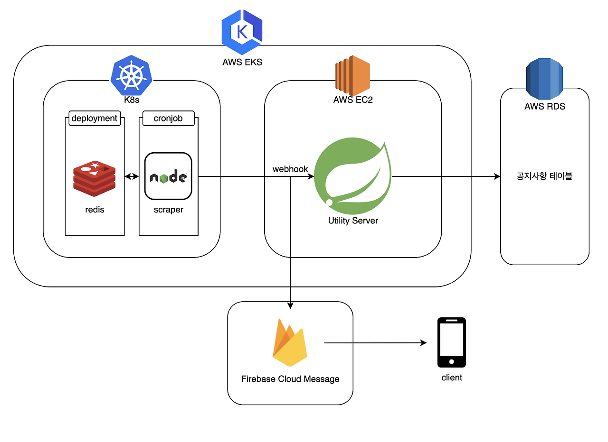

마지막으로 중요하게 고려한 것은 **멱등성(Idempotency)** 보장이었다. 만약 Redis가 다운되어 스크래퍼가 중복된 데이터를 Utility Server로 웹훅을 보내는 경우, 사용자에게 동일한 푸시 알림이 다량으로 발송되는 심각한 문제가 발생할 수 있었다.

실제로 비용 절감과 내부망 접근 속도를 위해 온프레미즈 쿠버네티스 클러스터를 사용하기도 했는데, 네트워크 불안정이나 메모리 부족으로 서버가 불안정해지는 상황도 있었다.

### 해결: DB Unique Key를 통한 멱등성

핵심 전략은 **데이터베이스 저장을 웹훅 발송보다 먼저 수행**하고, **공지사항 URL을 Unique Key로 설정**하는 것이었다.

기존 순서:
```
웹훅 수신 -> 푸시 알림 발송 -> DB 저장   (위험)
```

개선된 순서:
```
웹훅 수신 -> DB 저장 -> 푸시 알림 발송   (안전)
```

```kotlin
@Service
class NoticeWebhookService(
    private val noticeRepository: NoticeRepository,
    private val pushNotificationService: PushNotificationService
) {
    @Transactional
    fun handleWebhook(request: NoticeWebhookRequest) {
        // 1. DB 저장 시도 (URL이 Unique Key)
        //    이미 존재하는 경우 DataIntegrityViolationException 발생
        try {
            val notice = Notice(
                originUrl = request.url,     // Unique Key
                title = request.title,
                content = request.htmlContent,
                origin = request.origin,
                publishedAt = request.publishedAt
            )
            noticeRepository.save(notice)

            // 2. DB 저장 성공 시에만 푸시 알림 발송
            pushNotificationService.sendNotification(
                topic = request.origin,
                title = "새 공지사항",
                body = request.title
            )
        } catch (e: DataIntegrityViolationException) {
            // 중복 데이터 -- 무시 (멱등성 보장)
            log.info("이미 저장된 공지사항: ${request.url}")
        }
    }
}
```

이 구조 덕분에 **동일한 웹훅이 1번이든, 2번이든, 10번이든 서버의 상태는 동일하게 유지**된다. 실제로 Redis Pod을 강제 삭제하는 테스트에서도 푸시 알림 중복 발송이 발생하지 않는 것을 확인했다.

---

## 10. 트러블슈팅 & 운영 팁

### CronJob 실행 겹침 방지

CronJob의 `concurrencyPolicy`를 `Forbid`로 설정하면, 이전 작업이 아직 실행 중일 때 다음 스케줄이 건너뛰어진다. 스크래핑 작업이 예상보다 오래 걸리는 경우의 중복 실행을 방지할 수 있다.

```yaml
spec:
  concurrencyPolicy: Forbid        # Replace, Allow도 가능
  startingDeadlineSeconds: 60      # 스케줄 시간에서 60초 이내에 시작하지 못하면 건너뜀
```

### activeDeadlineSeconds 설정

CronJob이 무한히 실행되지 않도록 `activeDeadlineSeconds`를 설정한다. 매분 실행이라면 55초 정도로 설정하여, 다음 CronJob과의 충돌을 방지한다.

### 리소스 제한

스크래퍼는 가벼운 작업이므로 리소스를 최소화한다. memory 128Mi, CPU 100m 정도면 대부분의 스크래핑 작업에 충분하다.

### Redis 장애 대응

Redis가 다운되어도 시스템이 정상 동작하도록 설계해야 한다. 앞서 다룬 DB Unique Key 기반의 멱등성 보장이 이를 해결해 주며, 추가로 Redis의 Persistent Volume과 백업 정책을 설정해 두는 것이 좋다.

### 모니터링

CronJob의 실행 상태를 모니터링하기 위해 다음 항목을 확인한다.

```bash
# CronJob 실행 이력 확인
kubectl get jobs -n scraper --sort-by=.metadata.creationTimestamp

# 최근 Pod 로그 확인
kubectl logs -n scraper -l job-name=notice-scraper-XXXXX

# CronJob 상태 확인
kubectl get cronjob -n scraper
```

---

## 11. 더 나아가기: 검색 엔진으로의 확장

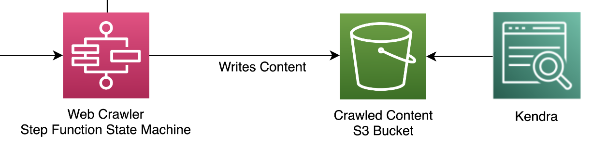

흥미로운 점은 이러한 Serverless Web Scraper 아키텍처가 **검색 엔진(Search Engine)** 구축에도 활용된다는 것이다. 크롤링한 웹 페이지의 HTML을 S3에 저장하고, AWS Kendra 또는 Elasticsearch를 통해 인덱싱하여 검색 서비스를 제공하는 구조이다.

<!-- TODO: 전체 스크래핑 파이프라인 다이어그램 추가 (크롤링 -> 파싱 -> 저장 -> 인덱싱 -> 검색/알림) -->

---

## 마치며

스크래퍼 개발은 단순히 HTML을 파싱하는 것을 넘어, **무상태 환경에서의 상태 관리**, **동시성 제어**, **멱등성 보장**, **분산 시스템에서의 안정성 확보**와 같은 실질적인 엔지니어링 문제를 해결하는 과정이었다.

특히 쿠버네티스 생태계에 본격적으로 발을 들인 프로젝트이면서, 프레임워크 기반의 사고방식에서 확장하여 Redis, 스크립트, 웹훅, Producer-Consumer 패턴까지 기술적인 세계관을 넓힐 수 있었던 경험이었다.

### 핵심 정리

| 문제 | 해결 방법 |
|------|----------|
| Stateless CronJob | Redis에 스크래핑 이력 저장 |
| 파싱 속도 편차 | Producer-Consumer 패턴으로 비동기 분리 |
| 중복 알림 위험 | DB Unique Key + 저장 우선 순서로 멱등성 보장 |
| 클러스터 중복 실행 | CronJob concurrencyPolicy: Forbid |
| 오리진 관리 | ConfigMap으로 환경 변수 외부화 |

### 참고 자료

- **[AWS]** [Serverless Architecture for a Web Scraping Solution](https://aws.amazon.com/ko/blogs/architecture/serverless-architecture-for-a-web-scraping-solution/)
- **[AWS]** [Scaling up a Serverless Web Crawler and Search Engine](https://aws.amazon.com/ko/blogs/architecture/scaling-up-a-serverless-web-crawler-and-search-engine/)
- **[Python]** [Top Python Web Scraping Libraries & Tools](https://research.aimultiple.com/python-web-scraping-libraries/)
